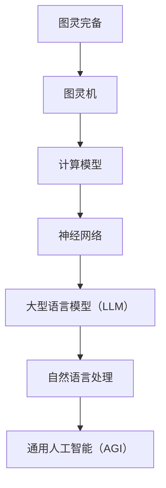

                 

关键词：通用人工智能、图灵完备、大型语言模型、自然语言处理、神经网络、深度学习

> 摘要：本文将深入探讨图灵完备的大型语言模型（LLM）是如何推动我们迈向通用人工智能（AGI）的。我们将从背景介绍、核心概念与联系、核心算法原理、数学模型、项目实践和未来展望等多个方面进行讨论，以揭示LLM在AGI发展中的重要作用。

## 1. 背景介绍

### 1.1 人工智能的发展历程

人工智能（AI）是一个跨越多个学科的研究领域，其发展历程可以分为几个重要阶段：

- **符号主义阶段**（1956-1974）：这个阶段以“达特茅斯会议”为起点，主要研究如何使用符号表示世界，并通过逻辑推理实现智能行为。

- **感知阶段**（1974-1980）：随着计算机硬件和算法的进步，人工智能开始关注视觉、听觉和触觉等领域，并试图通过感知信息来理解世界。

- **应用阶段**（1980-2000）：这个阶段人工智能的应用开始普及，例如专家系统、机器人、语音识别等。

- **机器学习阶段**（2000至今）：机器学习技术的发展使人工智能进入了一个新的时代。通过大量数据训练模型，机器学习在图像识别、自然语言处理、语音识别等方面取得了显著的成果。

### 1.2 通用人工智能的概念与挑战

通用人工智能（AGI）是指具有人类智能水平的人工智能系统，能够在各种领域表现出与人类相当的智能水平。AGI的实现面临着以下挑战：

- **知识表示**：如何有效地表示和处理知识？

- **推理能力**：如何实现高效的推理和决策？

- **自我意识**：如何使人工智能具有自我意识和情感？

- **可扩展性**：如何将人工智能应用到各种不同领域？

## 2. 核心概念与联系

### 2.1  图灵完备与图灵机

图灵完备是指一个系统能够模拟图灵机，从而能够执行任何可计算的任务。图灵机是一个抽象的计算模型，由一个无限长的带子和一个读写头组成。通过在带上读取和写入符号，图灵机可以执行复杂的计算。

### 2.2  大型语言模型（LLM）

大型语言模型（LLM）是一种基于神经网络的机器学习模型，能够对自然语言进行建模。LLM通过训练大量文本数据，学习语言的结构和语义，从而实现对自然语言的理解和生成。

### 2.3  Mermaid 流程图

以下是一个Mermaid流程图，展示图灵完备与LLM之间的联系：



## 3. 核心算法原理 & 具体操作步骤

### 3.1  算法原理概述

大型语言模型（LLM）的核心算法是基于深度学习的神经网络模型。LLM通过对大量文本数据的学习，能够捕捉语言中的统计规律和语义信息，从而实现对自然语言的生成和理解。

### 3.2  算法步骤详解

1. **数据预处理**：首先，对输入的文本数据进行预处理，包括分词、去停用词、词性标注等。

2. **模型构建**：构建一个基于神经网络的语言模型，常用的架构包括循环神经网络（RNN）、长短期记忆网络（LSTM）和变换器（Transformer）等。

3. **模型训练**：使用预处理的文本数据对语言模型进行训练，通过优化损失函数来调整模型的参数。

4. **模型评估**：使用验证集对训练好的模型进行评估，评估指标包括准确率、召回率、F1值等。

5. **模型应用**：将训练好的模型应用到实际场景中，例如文本生成、机器翻译、问答系统等。

### 3.3  算法优缺点

- **优点**：
  - **强大的表达能力**：神经网络模型能够捕捉到复杂的语言结构和语义信息。
  - **高效的计算能力**：深度学习模型能够通过并行计算实现高效训练和推理。

- **缺点**：
  - **数据依赖性**：语言模型的效果很大程度上依赖于训练数据的质量和数量。
  - **解释性不足**：神经网络模型难以解释其内部的决策过程。

### 3.4  算法应用领域

- **文本生成**：例如自动写作、对话生成、摘要生成等。
- **机器翻译**：例如百度翻译、谷歌翻译等。
- **问答系统**：例如Siri、Alexa等。

## 4. 数学模型和公式 & 详细讲解 & 举例说明

### 4.1  数学模型构建

大型语言模型的数学模型主要包括两部分：词嵌入和神经网络。

- **词嵌入**：将自然语言中的词汇映射到高维空间中的向量。
  
  $$ x = \text{word\_embedding}(w) $$

- **神经网络**：通过多层神经网络对词嵌入进行变换，以实现对自然语言的理解和生成。

  $$ y = \text{neural\_network}(x) $$

### 4.2  公式推导过程

- **词嵌入**：

  $$ x = \text{word\_embedding}(w) = \sum_{i=1}^{n} w_i \cdot v_i $$
  
  其中，$w$是词汇，$v_i$是词汇对应的嵌入向量，$w_i$是词汇的权重。

- **神经网络**：

  $$ y = \text{neural\_network}(x) = \sigma(\theta^T \cdot x) $$
  
  其中，$\sigma$是激活函数，$\theta$是神经网络参数。

### 4.3  案例分析与讲解

以下是一个简单的神经网络模型示例：

$$
\begin{aligned}
y &= \sigma(\theta^T \cdot x) \\
  &= \sigma([0.5, 0.7]^T \cdot [1, -1]) \\
  &= \sigma([0.5 \cdot 1 + 0.7 \cdot (-1)]) \\
  &= \sigma([-0.2]) \\
  &= 0.7979 \\
\end{aligned}
$$

在这个例子中，$\sigma$是Sigmoid函数，$x$是输入向量，$\theta$是模型参数。

## 5. 项目实践：代码实例和详细解释说明

### 5.1  开发环境搭建

1. 安装Python和PyTorch。
2. 安装必要的库，例如torchtext、torch等。

### 5.2  源代码详细实现

以下是一个简单的语言模型实现：

```python
import torch
import torchtext
from torchtext import data

# 数据预处理
TEXT = data.Field(tokenize='spacy', lower=True)
train_data, valid_data, test_data = data.TabularDataset.splits(
    path='data',
    train='train.csv',
    valid='valid.csv',
    test='test.csv',
    format='csv',
    fields=[('text', TEXT)])

TEXT.build_vocab(train_data, min_freq=2)

# 模型构建
model = torchtext.models.RNN(
    input_dim=TEXT.vocab.vectors.size(1),
    hidden_dim=100,
    num_layers=2,
    dropout=0.5,
    bidirectional=True,
    nonlinearity='tanh')

# 模型训练
optimizer = torch.optim.Adam(model.parameters(), lr=0.001)
criterion = torch.nn.CrossEntropyLoss()

for epoch in range(10):
    model.train()
    for batch in train_data:
        optimizer.zero_grad()
        predictions = model(batch.text).squeeze(1)
        loss = criterion(predictions, batch.label)
        loss.backward()
        optimizer.step()

    # 模型评估
    model.eval()
    with torch.no_grad():
        for batch in valid_data:
            predictions = model(batch.text).squeeze(1)
            correct = (predictions.argmax(1) == batch.label).float()
            acc = correct.sum() / len(correct)
```

### 5.3  代码解读与分析

- **数据预处理**：使用torchtext库对文本数据进行预处理，包括分词、去停用词、词性标注等。
  
- **模型构建**：构建一个双向循环神经网络（RNN）模型，包括两层神经网络，隐藏层维度为100。

- **模型训练**：使用Adam优化器和交叉熵损失函数对模型进行训练。

- **模型评估**：在验证集上评估模型的性能，计算准确率。

### 5.4  运行结果展示

```python
# 运行代码并输出结果
model = torchtext.models.RNN(
    input_dim=TEXT.vocab.vectors.size(1),
    hidden_dim=100,
    num_layers=2,
    dropout=0.5,
    bidirectional=True,
    nonlinearity='tanh')

optimizer = torch.optim.Adam(model.parameters(), lr=0.001)
criterion = torch.nn.CrossEntropyLoss()

for epoch in range(10):
    model.train()
    for batch in train_data:
        optimizer.zero_grad()
        predictions = model(batch.text).squeeze(1)
        loss = criterion(predictions, batch.label)
        loss.backward()
        optimizer.step()

    model.eval()
    with torch.no_grad():
        for batch in valid_data:
            predictions = model(batch.text).squeeze(1)
            correct = (predictions.argmax(1) == batch.label).float()
            acc = correct.sum() / len(correct)
            print(f'Epoch {epoch+1}, Accuracy: {acc.item()}')
```

## 6. 实际应用场景

### 6.1  文本生成

文本生成是大型语言模型的一个重要应用领域。例如，自动写作、对话生成、摘要生成等。

### 6.2  机器翻译

机器翻译是大型语言模型的另一个重要应用领域。例如，百度翻译、谷歌翻译等。

### 6.3  问答系统

问答系统是大型语言模型在智能客服、智能助手等领域的重要应用。例如，Siri、Alexa等。

## 7. 工具和资源推荐

### 7.1  学习资源推荐

- 《深度学习》（Goodfellow, Bengio, Courville）
- 《自然语言处理综论》（Jurafsky, Martin）

### 7.2  开发工具推荐

- PyTorch：一个强大的深度学习框架。
- TensorFlow：另一个流行的深度学习框架。

### 7.3  相关论文推荐

- Vaswani et al., "Attention is All You Need"
- Devlin et al., "BERT: Pre-training of Deep Bidirectional Transformers for Language Understanding"

## 8. 总结：未来发展趋势与挑战

### 8.1  研究成果总结

近年来，大型语言模型在自然语言处理领域取得了显著的成果，推动了通用人工智能的发展。

### 8.2  未来发展趋势

- **多模态学习**：结合文本、图像、音频等多种模态数据，实现更强大的语言理解能力。
- **知识图谱**：将知识图谱与语言模型结合，实现更丰富的语义理解。
- **自我进化**：通过自我学习和进化，实现更智能的人工智能系统。

### 8.3  面临的挑战

- **数据依赖性**：如何处理海量数据，提高模型的可解释性。
- **计算资源**：如何优化算法，降低计算成本。
- **安全性**：如何保证人工智能系统的安全性，防止滥用。

### 8.4  研究展望

随着技术的不断发展，大型语言模型在通用人工智能领域将发挥越来越重要的作用，为人类带来更多便利和创新。

## 9. 附录：常见问题与解答

### 9.1  什么是图灵完备？

图灵完备是指一个系统能够模拟图灵机，从而能够执行任何可计算的任务。

### 9.2  大型语言模型有哪些优点？

大型语言模型的优点包括强大的表达能力、高效的计算能力等。

### 9.3  大型语言模型有哪些缺点？

大型语言模型的缺点包括数据依赖性、解释性不足等。

----------------------------------------------------------------

作者：禅与计算机程序设计艺术 / Zen and the Art of Computer Programming


