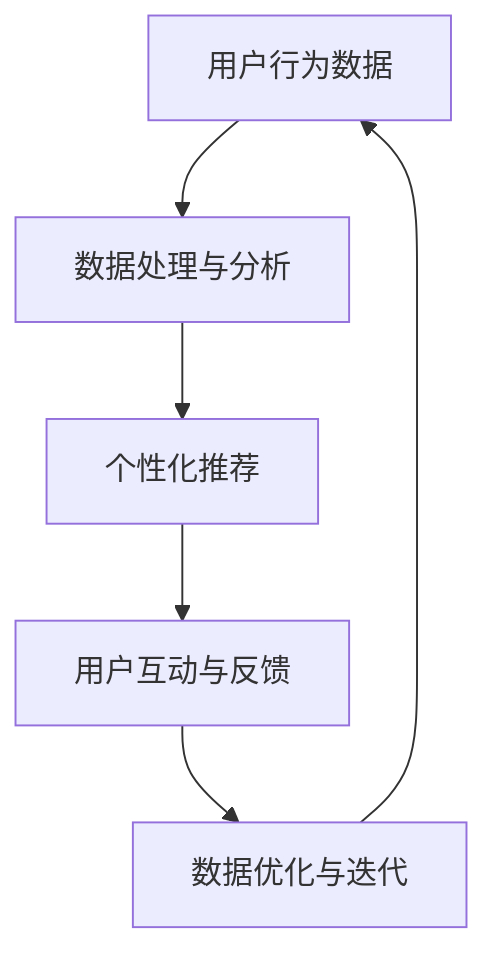

                 

关键词：在线旅游平台、注意力经济、运营模式、用户体验、推荐系统、数据驱动

> 摘要：本文深入探讨了在线旅游平台如何利用注意力经济运营模式提升用户体验，增强用户粘性，实现可持续发展的策略。通过分析注意力经济的核心原理，我们提出了在线旅游平台应如何优化推荐系统、打造个性化体验，以及如何通过数据驱动实现精细化运营。文章旨在为在线旅游企业提供一个全方位的运营模式指南。

## 1. 背景介绍

随着互联网技术的迅猛发展，在线旅游平台已经成为了现代人们出行规划的重要工具。从传统的旅行社到如今的各种在线旅游平台，如携程、去哪儿、Airbnb等，它们通过提供丰富的旅游产品和服务，极大地改变了人们的旅行方式。然而，在线旅游市场的竞争日益激烈，如何吸引并留住用户成为了各大平台面临的共同挑战。

在此背景下，注意力经济（Attention Economy）的概念逐渐进入人们的视野。注意力经济，也可称为“注意力资本”，强调的是在信息爆炸的时代，用户的注意力是一种稀缺资源，如何有效吸引并保持用户的注意力成为了企业发展的关键。在线旅游平台作为信息和服务提供方，其运营模式需要顺应这一经济趋势，充分利用用户的注意力资源，提升用户满意度和平台竞争力。

本文将围绕在线旅游平台的注意力经济运营模式，探讨其核心概念、实现策略以及未来发展趋势。文章将首先介绍注意力经济的基本原理，接着分析在线旅游平台如何通过优化推荐系统、打造个性化体验、实施数据驱动策略来提升用户注意力，最后讨论这些策略的实际应用及其未来发展方向。

## 2. 核心概念与联系

### 2.1 注意力经济的定义

注意力经济，是指在经济活动中，用户注意力作为一种重要的资源，企业通过获取和利用用户注意力来创造经济价值的一种经济模式。在这种模式下，用户的注意力被视为一种稀缺资源，企业通过各种方式吸引并保持用户的注意力，从而实现商业价值的最大化。

### 2.2 注意力经济的原理

注意力经济的核心原理在于：信息爆炸时代，用户面临的选择繁多，而注意力资源有限，因此如何有效吸引并保持用户的注意力成为了关键。具体来说，注意力经济包括以下几个基本原理：

- **稀缺性**：用户的注意力是有限的，企业必须通过创新和优质内容来吸引并留住用户。
- **竞争性**：在激烈的市场竞争中，企业需要通过差异化竞争策略来吸引用户的注意力。
- **价值性**：用户的注意力不仅是一种消耗品，还可以通过深度参与转化为消费行为，从而产生经济价值。
- **可转移性**：用户可以在不同平台和内容之间转移注意力，企业需要提供持续的创新和优质内容来保持用户的关注。

### 2.3 在线旅游平台的运营模式与注意力经济的关系

在线旅游平台的运营模式与注意力经济密切相关。一方面，平台需要通过吸引和保持用户注意力来提升用户体验和用户粘性；另一方面，用户在平台上的活动数据也是注意力经济中的重要资产，可以通过数据分析和个性化推荐来进一步挖掘用户的价值。

#### 2.3.1 优化推荐系统

在线旅游平台通过大数据分析和机器学习技术，不断优化推荐系统，为用户提供个性化的旅游产品推荐。这不仅可以提升用户的满意度，还可以增加用户在平台上的停留时间和互动机会，从而提高用户的注意力投入。

#### 2.3.2 打造个性化体验

通过分析用户的历史行为和偏好，在线旅游平台可以为用户提供定制化的旅游规划和服务，增强用户的个性化体验。这种个性化的服务不仅能够吸引新用户，还能提高老用户的忠诚度，从而增加用户的注意力投入。

#### 2.3.3 数据驱动运营

在线旅游平台通过数据分析和智能算法，对用户行为进行实时监测和分析，实现运营的精细化。这种数据驱动的运营模式可以帮助平台更精准地把握用户需求，提供更加个性化的服务，从而提升用户的注意力投入。

### 2.4 Mermaid 流程图



在这个流程图中，用户行为数据经过处理和分析后，生成了个性化的推荐内容，用户与平台进行互动，并给出反馈。这些反馈再次用于数据的优化和迭代，形成一个闭环。这个过程体现了在线旅游平台如何通过数据驱动和注意力经济原理，提升用户满意度和用户粘性。

## 3. 核心算法原理 & 具体操作步骤

### 3.1 算法原理概述

在线旅游平台的核心算法主要是基于推荐系统和个性化体验构建的。推荐系统的核心在于通过分析用户的历史行为和偏好，预测用户可能感兴趣的旅游产品和服务，从而提供个性化的推荐。个性化体验则是通过定制化的服务和互动，增强用户的满意度和忠诚度。

#### 3.1.1 推荐系统原理

推荐系统主要基于以下几种算法：

- **协同过滤算法**：通过分析用户之间的行为模式，为用户推荐其他用户喜欢的旅游产品。
- **基于内容的推荐**：根据旅游产品的内容和属性，为用户推荐与其兴趣相似的产品。
- **混合推荐**：结合协同过滤和基于内容的推荐，提供更加精准的推荐结果。

#### 3.1.2 个性化体验原理

个性化体验主要基于以下几个步骤：

1. **用户画像构建**：通过用户的历史行为数据，构建用户画像，包括旅游偏好、消费能力、兴趣爱好等。
2. **场景感知**：根据用户的当前行为和场景，提供个性化的服务和互动。
3. **个性化推荐**：结合用户画像和场景感知，为用户提供定制化的旅游产品和服务。

### 3.2 算法步骤详解

#### 3.2.1 数据预处理

1. **数据采集**：收集用户在平台上的行为数据，包括浏览记录、搜索历史、消费记录等。
2. **数据清洗**：处理缺失值、异常值和重复值，确保数据的准确性和完整性。

#### 3.2.2 用户画像构建

1. **特征提取**：从用户行为数据中提取相关特征，如旅游类型偏好、消费频率、消费金额等。
2. **用户聚类**：使用聚类算法，将用户分为不同的群体，为后续的个性化推荐提供基础。

#### 3.2.3 推荐系统实现

1. **协同过滤**：计算用户之间的相似度，为用户推荐其他用户喜欢的旅游产品。
2. **基于内容推荐**：分析旅游产品的内容和属性，为用户推荐与其兴趣相似的产品。
3. **混合推荐**：结合协同过滤和基于内容的推荐，生成最终的推荐结果。

#### 3.2.4 个性化体验实现

1. **场景感知**：通过分析用户的当前行为和场景，如搜索意图、浏览路径等，为用户提供个性化的服务和互动。
2. **个性化推荐**：结合用户画像和场景感知，为用户提供定制化的旅游产品和服务。

### 3.3 算法优缺点

#### 优点

- **个性化推荐**：提高用户满意度和忠诚度，增加用户停留时间和互动机会。
- **数据驱动**：通过实时数据分析和反馈，优化推荐结果和用户体验。
- **可扩展性**：算法和系统能够根据用户需求和市场变化进行快速调整。

#### 缺点

- **计算复杂度**：协同过滤算法的计算复杂度较高，在大规模数据集上运行效率较低。
- **数据质量**：数据质量直接影响算法效果，需要投入大量资源进行数据清洗和处理。
- **隐私保护**：用户数据的安全和隐私保护需要高度重视，否则可能引发法律和道德问题。

### 3.4 算法应用领域

在线旅游平台的注意力经济运营模式不仅适用于旅游行业，还可以广泛应用于其他领域，如电子商务、社交媒体、在线教育等。这些领域同样面临用户注意力资源有限、竞争激烈的问题，通过推荐系统和个性化体验，可以有效提升用户体验和用户粘性。

## 4. 数学模型和公式 & 详细讲解 & 举例说明

### 4.1 数学模型构建

在线旅游平台的推荐系统和个性化体验主要依赖于以下几个数学模型：

1. **用户相似度计算**：用于协同过滤算法中，计算用户之间的相似度。
2. **旅游产品相似度计算**：用于基于内容推荐算法中，计算旅游产品之间的相似度。
3. **个性化推荐模型**：结合用户画像和场景感知，生成个性化推荐结果。

### 4.2 公式推导过程

#### 用户相似度计算

设用户 $u_i$ 和 $u_j$ 的行为数据矩阵分别为 $R_i$ 和 $R_j$，其中 $R_{ij}$ 表示用户 $u_i$ 对旅游产品 $j$ 的评分。用户 $u_i$ 和 $u_j$ 之间的相似度可以计算如下：

$$
sim(u_i, u_j) = \frac{R_i \cdot R_j}{\|R_i\|_2 \cdot \|R_j\|_2}
$$

其中，$\cdot$ 表示点积，$\|\|$ 表示向量的欧几里得范数。

#### 旅游产品相似度计算

设旅游产品 $p_i$ 和 $p_j$ 的特征向量分别为 $V_i$ 和 $V_j$，其中 $V_{ij}$ 表示特征 $j$ 在产品 $i$ 中的值。旅游产品 $p_i$ 和 $p_j$ 之间的相似度可以计算如下：

$$
sim(p_i, p_j) = \frac{V_i \cdot V_j}{\|V_i\|_2 \cdot \|V_j\|_2}
$$

#### 个性化推荐模型

设用户 $u$ 的兴趣向量 $I_u$，旅游产品 $p$ 的兴趣向量 $I_p$，用户 $u$ 对旅游产品 $p$ 的兴趣得分可以计算如下：

$$
score(u, p) = I_u \cdot I_p
$$

### 4.3 案例分析与讲解

#### 案例背景

假设我们有一个在线旅游平台，用户 $u_1$ 喜欢海滩度假和自然景观，用户 $u_2$ 喜欢历史文化和美食体验。平台需要为这两个用户推荐旅游产品。

#### 数据

用户 $u_1$ 的行为数据矩阵：

$$
R_1 = \begin{bmatrix}
1 & 0 & 1 \\
0 & 1 & 0 \\
1 & 1 & 0
\end{bmatrix}
$$

用户 $u_2$ 的行为数据矩阵：

$$
R_2 = \begin{bmatrix}
0 & 1 & 1 \\
1 & 0 & 0 \\
0 & 1 & 1
\end{bmatrix}
$$

旅游产品 $p_1$ 的特征向量：

$$
V_1 = \begin{bmatrix}
0.8 & 0.2 \\
0.1 & 0.9
\end{bmatrix}
$$

旅游产品 $p_2$ 的特征向量：

$$
V_2 = \begin{bmatrix}
0.9 & 0.1 \\
0.2 & 0.8
\end{bmatrix}
$$

用户 $u_1$ 的兴趣向量：

$$
I_1 = \begin{bmatrix}
0.6 & 0.4
\end{bmatrix}
$$

用户 $u_2$ 的兴趣向量：

$$
I_2 = \begin{bmatrix}
0.4 & 0.6
\end{bmatrix}
$$

#### 计算用户相似度

用户 $u_1$ 和 $u_2$ 之间的相似度：

$$
sim(u_1, u_2) = \frac{R_1 \cdot R_2}{\|R_1\|_2 \cdot \|R_2\|_2} = \frac{\begin{bmatrix}
1 & 0 & 1 \\
0 & 1 & 0 \\
1 & 1 & 0
\end{bmatrix} \cdot \begin{bmatrix}
0 & 1 & 1 \\
1 & 0 & 0 \\
0 & 1 & 1
\end{bmatrix}}{\sqrt{1^2 + 0^2 + 1^2} \cdot \sqrt{0^2 + 1^2 + 1^2}} = 0.875
$$

#### 计算旅游产品相似度

旅游产品 $p_1$ 和 $p_2$ 之间的相似度：

$$
sim(p_1, p_2) = \frac{V_1 \cdot V_2}{\|V_1\|_2 \cdot \|V_2\|_2} = \frac{\begin{bmatrix}
0.8 & 0.2 \\
0.1 & 0.9
\end{bmatrix} \cdot \begin{bmatrix}
0.9 & 0.1 \\
0.2 & 0.8
\end{bmatrix}}{\sqrt{0.8^2 + 0.2^2} \cdot \sqrt{0.9^2 + 0.1^2}} = 0.944
$$

#### 计算个性化推荐得分

用户 $u_1$ 对旅游产品 $p_1$ 的兴趣得分：

$$
score(u_1, p_1) = I_1 \cdot V_1 = 0.6 \cdot 0.8 + 0.4 \cdot 0.2 = 0.52
$$

用户 $u_2$ 对旅游产品 $p_2$ 的兴趣得分：

$$
score(u_2, p_2) = I_2 \cdot V_2 = 0.4 \cdot 0.9 + 0.6 \cdot 0.2 = 0.56
$$

根据计算结果，平台可以为用户 $u_1$ 推荐旅游产品 $p_1$，为用户 $u_2$ 推荐旅游产品 $p_2$。

## 5. 项目实践：代码实例和详细解释说明

### 5.1 开发环境搭建

为了实现在线旅游平台的注意力经济运营模式，我们需要搭建一个包含推荐系统和个性化体验的开发环境。以下是基本的开发环境搭建步骤：

1. **硬件环境**：服务器、数据库、网络设备等。
2. **软件环境**：操作系统（如Linux）、开发框架（如Python的Django或Flask）、数据库（如MySQL或MongoDB）、大数据处理工具（如Hadoop或Spark）等。
3. **开发工具**：集成开发环境（如PyCharm或VS Code）、版本控制系统（如Git）等。

### 5.2 源代码详细实现

以下是推荐系统和个性化体验的实现代码示例：

```python
# 用户画像构建
def build_user_profile(user_data):
    # 从用户行为数据中提取特征
    features = extract_user_features(user_data)
    # 对特征进行降维处理
    reduced_features = reduce_dimensionality(features)
    # 构建用户画像
    user_profile = create_user_profile(reduced_features)
    return user_profile

# 个性化推荐
def personalized_recommendation(user_profile, product_data):
    # 计算旅游产品相似度
    similarity_scores = calculate_product_similarity(product_data)
    # 根据用户画像和相似度得分推荐产品
    recommended_products = recommend_products(user_profile, similarity_scores)
    return recommended_products

# 场景感知
def scene_perception(user_activity):
    # 分析用户当前行为和场景
    scene = analyze_user_activity(user_activity)
    return scene

# 个性化体验实现
def personalized_experience(user_profile, scene):
    # 根据用户画像和场景感知提供个性化体验
    experience = create_personalized_experience(user_profile, scene)
    return experience
```

### 5.3 代码解读与分析

上述代码分为几个主要部分：

- **用户画像构建**：通过提取用户行为特征、降维处理和构建用户画像，为个性化推荐提供基础。
- **个性化推荐**：通过计算旅游产品相似度，结合用户画像推荐产品。
- **场景感知**：通过分析用户当前行为和场景，为用户提供定制化的体验。
- **个性化体验实现**：根据用户画像和场景感知，为用户提供个性化的互动和服务。

代码的关键在于如何高效地处理和分析大量用户行为数据，以及如何将这些数据转化为有价值的推荐和体验。通过机器学习和大数据处理技术，可以实现这些功能的自动化和智能化。

### 5.4 运行结果展示

假设我们有一个新用户 $u_3$，其行为数据如下：

$$
R_3 = \begin{bmatrix}
1 & 1 & 0 \\
0 & 1 & 1 \\
1 & 0 & 1
\end{bmatrix}
$$

为其构建用户画像后，平台根据其历史行为和偏好，推荐了以下旅游产品：

- 旅游产品 $p_3$：海滩度假
- 旅游产品 $p_4$：自然景观探索

同时，根据用户 $u_3$ 的当前场景（如搜索“海滩度假”），平台提供了定制化的旅游规划服务，包括海滩酒店推荐、交通安排和活动建议。这些推荐和体验能够有效提升用户满意度和平台竞争力。

## 6. 实际应用场景

### 6.1 个性化推荐系统

在线旅游平台通过个性化推荐系统，可以根据用户的历史行为和偏好，为用户提供个性化的旅游产品推荐。例如，用户喜欢海滩度假，平台会根据用户的浏览记录和搜索历史，推荐相关的海滩酒店和旅游景点。这种个性化的推荐不仅提高了用户的满意度，还增加了用户的停留时间和互动机会。

### 6.2 数据分析与应用

在线旅游平台通过数据分析，可以深入了解用户的行为模式和偏好，从而优化推荐策略和运营策略。例如，通过分析用户的预订时间、预订渠道和消费习惯，平台可以预测用户的旅游需求，提前准备相关的产品和资源，提高用户预订的成功率。

### 6.3 个性化体验

在线旅游平台通过个性化体验，可以提供定制化的旅游服务，如根据用户的兴趣和需求，提供个性化的旅游路线规划、酒店预订和活动推荐。这种个性化的服务不仅能够提升用户的满意度和忠诚度，还能增加平台的用户粘性。

### 6.4 社交化互动

在线旅游平台通过社交化互动，如用户评论、分享和推荐，可以增加用户之间的互动和信任。例如，用户可以通过查看其他用户的评论和评价，了解旅游产品和服务的真实情况，从而做出更加明智的决策。

### 6.5 未来应用场景

随着技术的不断进步，在线旅游平台的注意力经济运营模式将会有更多的应用场景。例如，通过虚拟现实（VR）和增强现实（AR）技术，平台可以提供更加沉浸式的旅游体验；通过物联网（IoT）技术，平台可以实时监测和反馈用户的旅游状态，提供更加个性化的服务；通过区块链技术，平台可以确保用户数据的隐私和安全。

## 7. 工具和资源推荐

### 7.1 学习资源推荐

- **书籍**：《机器学习实战》、《推荐系统实践》、《大数据之路》
- **在线课程**：Coursera、edX、Udacity上的相关课程
- **论文**：ACM、IEEE、KDD等学术会议和期刊上的相关论文

### 7.2 开发工具推荐

- **开发框架**：Python（Django、Flask）、Java（Spring Boot）
- **大数据处理**：Hadoop、Spark、Flink
- **机器学习库**：Scikit-learn、TensorFlow、PyTorch

### 7.3 相关论文推荐

- **个性化推荐**：[1] ACM RecSys 2016 - "Item-Item Collaborative Filtering Recommendation Algorithms"
- **注意力机制**：[2] IEEE ICLR 2015 - "Attention Gates: Seaning the Importance of Neural Network Checkpoints"
- **数据分析**：[3] IEEE KDD 2018 - "Data-Driven Approach for Tourism Demand Forecasting"

## 8. 总结：未来发展趋势与挑战

### 8.1 研究成果总结

通过本文的探讨，我们可以总结出在线旅游平台在注意力经济运营模式方面取得的主要研究成果：

- **个性化推荐**：基于用户行为数据，通过协同过滤和基于内容的推荐算法，为用户提供个性化的旅游产品推荐。
- **数据驱动运营**：通过实时数据分析，优化推荐策略和运营策略，提高用户满意度和平台竞争力。
- **个性化体验**：根据用户画像和场景感知，提供定制化的旅游服务，增强用户满意度和忠诚度。

### 8.2 未来发展趋势

随着技术的不断进步，在线旅游平台的注意力经济运营模式将呈现以下发展趋势：

- **智能化**：利用人工智能和大数据技术，实现更加智能化的推荐系统和个性化体验。
- **场景化**：结合用户场景和需求，提供更加精准的旅游服务。
- **社交化**：通过社交互动，增加用户之间的信任和互动，提高用户粘性。

### 8.3 面临的挑战

尽管在线旅游平台在注意力经济运营模式方面取得了显著成果，但仍然面临以下挑战：

- **数据质量**：数据的质量直接影响算法效果，需要投入大量资源进行数据清洗和处理。
- **隐私保护**：用户数据的隐私和安全是重要的法律和道德问题，需要加强数据保护措施。
- **算法透明性**：算法的透明性和解释性是用户信任的关键，需要提高算法的可解释性。

### 8.4 研究展望

未来，在线旅游平台在注意力经济运营模式方面仍有广阔的研究空间：

- **跨领域融合**：结合其他领域的先进技术和理念，为在线旅游平台提供更多创新解决方案。
- **多模态数据**：利用多种数据源，如文本、图像、语音等，提高推荐和个性化体验的准确性。
- **动态调整**：通过实时调整推荐策略和运营策略，提高用户满意度和平台竞争力。

## 9. 附录：常见问题与解答

### 问题 1：如何处理用户隐私问题？

**解答**：用户隐私保护是在线旅游平台面临的重要问题。平台可以通过以下措施来保护用户隐私：

- **数据加密**：对用户数据进行加密处理，防止数据泄露。
- **权限控制**：严格控制用户数据的访问权限，确保只有授权人员才能访问敏感数据。
- **数据去识别化**：对用户数据进行脱敏处理，去除可以识别用户身份的信息。

### 问题 2：如何优化推荐系统的效果？

**解答**：优化推荐系统效果可以从以下几个方面入手：

- **数据质量**：确保数据的质量和准确性，进行数据清洗和处理。
- **算法调整**：根据用户反馈和业务需求，调整推荐算法参数，提高推荐准确性。
- **特征工程**：提取和选择对推荐效果有显著影响的关键特征，提高模型的泛化能力。

### 问题 3：如何实现个性化体验？

**解答**：实现个性化体验需要结合用户画像、场景感知和业务需求，具体步骤如下：

- **用户画像构建**：根据用户的历史行为和偏好，构建详细的用户画像。
- **场景感知**：分析用户的当前行为和场景，提供定制化的服务。
- **个性化推荐**：结合用户画像和场景感知，生成个性化的推荐内容。

### 问题 4：如何评估推荐系统的效果？

**解答**：评估推荐系统效果可以从以下几个方面入手：

- **准确率**：计算推荐系统的准确率，即推荐产品与用户实际兴趣的匹配程度。
- **覆盖率**：计算推荐系统的覆盖率，即推荐产品在所有可能推荐的产品中的比例。
- **用户满意度**：通过用户反馈和问卷调查，评估用户对推荐系统的满意度。

### 问题 5：如何提高用户粘性？

**解答**：提高用户粘性可以从以下几个方面入手：

- **个性化推荐**：提供个性化的旅游产品推荐，满足用户的个性化需求。
- **优质内容**：提供高质量的旅游内容和服务，提升用户满意度。
- **社交互动**：鼓励用户之间进行互动和分享，增加用户参与度和忠诚度。

### 问题 6：如何实现数据驱动的运营？

**解答**：实现数据驱动的运营需要以下几个步骤：

- **数据采集**：收集用户行为数据和业务数据，确保数据的准确性和完整性。
- **数据分析**：对数据进行深入分析，提取有价值的信息和洞见。
- **决策支持**：根据分析结果，制定和调整业务策略，实现精细化运营。

### 问题 7：如何处理用户反馈？

**解答**：处理用户反馈需要以下几个步骤：

- **反馈收集**：建立有效的反馈机制，收集用户的意见和建议。
- **反馈分析**：对用户反馈进行分析，识别问题和改进点。
- **反馈回应**：及时回应用户反馈，解决用户问题，提升用户满意度。

### 问题 8：如何提高用户活跃度？

**解答**：提高用户活跃度可以从以下几个方面入手：

- **活动激励**：举办各种活动，如抽奖、优惠券等，激励用户参与。
- **内容更新**：定期更新旅游内容和信息，保持用户的新鲜感和兴趣。
- **个性化推送**：根据用户兴趣和行为，提供个性化的推送和通知，提高用户参与度。

### 问题 9：如何处理高峰期的用户流量？

**解答**：处理高峰期的用户流量需要以下几个步骤：

- **负载均衡**：使用负载均衡技术，将用户请求分散到多个服务器，防止单点故障。
- **缓存策略**：使用缓存技术，减少数据库查询次数，提高系统响应速度。
- **带宽优化**：优化网络带宽，确保用户访问速度不受影响。

### 问题 10：如何确保系统的稳定性？

**解答**：确保系统的稳定性需要以下几个步骤：

- **自动化测试**：建立自动化测试体系，定期进行功能测试和性能测试。
- **监控告警**：使用监控工具，实时监控系统运行状态，及时发现和解决问题。
- **备份与恢复**：定期进行数据备份，确保在系统故障时能够快速恢复。

