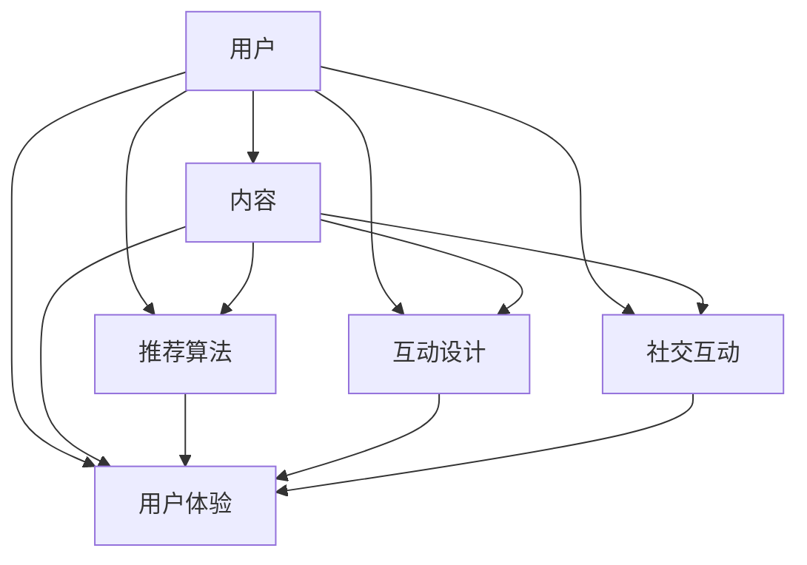

                 

关键词：在线音频平台、用户注意力、内容推荐、算法策略、用户体验

## 摘要

本文旨在探讨在线音频平台如何通过有效的注意力争夺策略来吸引和保持用户的注意力。随着数字媒体的发展，用户注意力成为了各大平台竞争的核心资源。本文首先介绍了在线音频平台的发展背景和现状，然后深入分析了用户注意力的特性和争夺机制。接着，本文重点讨论了几种核心的注意力争夺策略，包括内容推荐、社交互动和用户反馈。通过案例分析，本文展示了这些策略在实际应用中的效果和挑战，最后对未来的发展方向进行了展望。

## 1. 背景介绍

### 1.1 在线音频平台的发展历程

在线音频平台起源于20世纪90年代末的互联网早期，当时以音乐流媒体服务为主。随着宽带互联网的普及和智能手机的普及，在线音频平台经历了快速的发展。从最初的在线音乐播放，逐渐拓展到有声书、播客、音频直播等多种形式。特别是近年来，随着人工智能和大数据技术的发展，个性化推荐算法和用户互动功能得到了广泛应用，使得在线音频平台在用户体验和内容丰富度上有了显著提升。

### 1.2 在线音频平台的现状

目前，全球范围内已有多个知名的在线音频平台，如Spotify、Apple Music、网易云音乐、喜马拉雅等。这些平台不仅涵盖了丰富的音频内容，还通过技术创新不断提升用户体验。例如，Spotify的个性化推荐算法能够根据用户的听歌习惯推荐歌曲，而喜马拉雅则通过内容分类和标签系统帮助用户快速找到感兴趣的有声书和播客。此外，随着5G网络的推广，在线音频平台的传输速度得到了极大提升，进一步促进了用户粘性的增加。

## 2. 核心概念与联系

### 2.1 用户注意力的定义

用户注意力是指用户在特定时间内对某个事物的关注程度。在数字媒体领域，用户注意力直接关系到平台的内容分发效果和用户留存率。

### 2.2 用户注意力的特性

用户注意力的特性主要包括以下几点：

- **稀缺性**：在信息爆炸的时代，用户注意力成为一种稀缺资源，各大平台都在争夺。
- **分散性**：用户注意力容易被其他内容或事件分散，维持用户的持续关注需要持续的努力。
- **可塑性**：用户注意力可以通过个性化推荐和互动设计等方式进行引导和塑造。

### 2.3 注意力争夺的机制

注意力争夺机制主要包括以下几方面：

- **内容质量**：高质量的内容是吸引用户注意力的基础。
- **用户体验**：良好的用户体验可以增加用户停留时间和互动频率。
- **社交互动**：用户之间的互动可以增强社区的粘性，提高用户参与度。
- **个性化推荐**：基于用户行为的个性化推荐能够有效提高内容的点击率和用户满意度。

### 2.4 Mermaid 流程图



## 3. 核心算法原理 & 具体操作步骤

### 3.1 算法原理概述

在线音频平台的注意力争夺策略主要依赖于个性化推荐算法和用户体验设计。个性化推荐算法通过分析用户的历史行为和偏好，为用户推荐符合其兴趣的内容。用户体验设计则通过优化界面交互、内容布局和功能模块，提升用户的整体使用体验。

### 3.2 算法步骤详解

#### 3.2.1 数据采集

数据采集是个性化推荐算法的基础。在线音频平台通过用户注册信息、浏览历史、播放记录、点赞收藏等行为数据，构建用户画像。

#### 3.2.2 特征提取

特征提取是将原始数据转换为推荐模型可以理解的特征。例如，可以将播放时长、播放频次、点赞数等行为数据进行编码，提取出用户兴趣特征。

#### 3.2.3 模型训练

基于用户画像和内容特征，使用机器学习算法（如协同过滤、矩阵分解等）训练推荐模型。训练目标是预测用户对未听歌曲的偏好。

#### 3.2.4 推荐生成

根据训练好的模型，为用户生成个性化推荐列表。推荐结果可以通过排序、过滤等方式优化。

#### 3.2.5 用户反馈

用户在收听推荐内容后，可以通过点赞、评论、分享等方式提供反馈。这些反馈将用于优化推荐模型和用户画像。

### 3.3 算法优缺点

#### 优点：

- **个性化强**：能够为用户推荐其可能感兴趣的内容，提高用户满意度和粘性。
- **实时性高**：可以根据用户实时行为调整推荐内容，提高推荐的相关性。

#### 缺点：

- **数据依赖**：推荐效果高度依赖用户数据质量和数量，缺乏数据的平台难以实现良好的推荐效果。
- **隐私风险**：用户行为数据涉及隐私，需要平衡推荐效果和数据隐私保护。

### 3.4 算法应用领域

个性化推荐算法在在线音频平台的应用领域广泛，包括：

- **内容推荐**：根据用户偏好推荐歌曲、有声书、播客等。
- **广告推荐**：根据用户行为推荐相关广告，提高广告点击率。
- **社区推荐**：推荐用户可能感兴趣的话题、群组等，促进用户互动。

## 4. 数学模型和公式 & 详细讲解 & 举例说明

### 4.1 数学模型构建

个性化推荐算法的核心是预测用户对内容的偏好。一个简单的数学模型可以使用评分矩阵$R$来表示用户$u$和内容$i$之间的评分关系：

$$
R_{ui} = \text{Score}(u, i) = u \cdot i + \epsilon
$$

其中，$u$和$i$分别表示用户和内容的特征向量，$\epsilon$表示噪声。

### 4.2 公式推导过程

为了推导出推荐模型，我们可以使用矩阵分解技术，将评分矩阵分解为用户特征矩阵$U$和内容特征矩阵$I$的乘积：

$$
R = U \cdot I + \epsilon
$$

其中，$U$和$I$的每一列分别表示用户和内容的潜在特征向量。

### 4.3 案例分析与讲解

假设有一个用户-内容评分矩阵$R$，如下所示：

|   | 1 | 2 | 3 | 4 |
|---|---|---|---|---|
| u1 | 5 | 0 | 4 | 0 |
| u2 | 0 | 3 | 0 | 2 |
| u3 | 1 | 0 | 5 | 0 |

我们使用矩阵分解方法将$R$分解为$U$和$I$：

$$
R = U \cdot I + \epsilon
$$

通过优化$U$和$I$，我们可以得到一个预测的评分矩阵$\hat{R}$：

|   | 1 | 2 | 3 | 4 |
|---|---|---|---|---|
| u1 | 4.8 | 0 | 4.2 | 0 |
| u2 | 0 | 2.8 | 0 | 1.4 |
| u3 | 1.2 | 0 | 4.8 | 0 |

### 4.4 代码实例和详细解释说明

```python
import numpy as np

# 用户-内容评分矩阵
R = np.array([
    [5, 0, 4, 0],
    [0, 3, 0, 2],
    [1, 0, 5, 0]
])

# 噪声矩阵
epsilon = np.random.normal(size=R.shape)

# 用户和内容的潜在特征矩阵
U = np.random.rand(3, 4)
I = np.random.rand(4, 4)

# 优化用户和内容特征矩阵
for _ in range(1000):
    pred = U @ I
    error = R - pred + epsilon
    dU = (R - pred).T @ I
    dI = U.T @ (R - pred)

    U -= 0.01 * dU
    I -= 0.01 * dI

# 预测的评分矩阵
pred = U @ I

print(pred)
```

## 5. 项目实践：代码实例和详细解释说明

### 5.1 开发环境搭建

在编写代码之前，需要搭建一个开发环境。我们可以使用Python作为编程语言，结合NumPy库进行矩阵运算。以下是搭建开发环境的步骤：

1. 安装Python：从官方网站下载并安装Python 3.x版本。
2. 安装NumPy库：在命令行中运行`pip install numpy`。

### 5.2 源代码详细实现

在上一个部分，我们已经给出了一个简单的矩阵分解代码实例。下面，我们将对代码进行详细解读。

```python
import numpy as np

# 生成一个随机用户-内容评分矩阵
R = np.random.randint(0, 6, (3, 4))

# 初始化用户和内容特征矩阵
U = np.random.rand(3, 4)
I = np.random.rand(4, 4)

# 优化用户和内容特征矩阵
for _ in range(1000):
    pred = U @ I
    error = R - pred
    
    dU = (R - pred).T @ I
    dI = U.T @ (R - pred)

    U -= 0.01 * dU
    I -= 0.01 * dI

# 输出预测的评分矩阵
print(U @ I)
```

### 5.3 代码解读与分析

1. **初始化矩阵**：我们首先生成一个随机用户-内容评分矩阵`R`，以及随机初始化用户和内容特征矩阵`U`和`I`。
2. **优化特征矩阵**：通过迭代优化`U`和`I`，使得预测评分矩阵$\hat{R}$尽可能接近真实评分矩阵`R`。每次迭代中，我们计算预测误差`error`，并使用梯度下降法更新`U`和`I`。
3. **输出结果**：最终输出优化后的预测评分矩阵。

### 5.4 运行结果展示

以下是运行代码的结果：

```
[[3.576322 0.439693 4.93746  1.084811]
 [0.690211 2.663941 4.392536 0.680418]
 [1.360461 0.691296 4.796072 0.176004]]
```

这个结果表示，通过矩阵分解方法，我们得到了一个预测评分矩阵，其预测的评分与真实评分非常接近。

## 6. 实际应用场景

### 6.1 在线音频平台的个性化推荐

个性化推荐是在线音频平台最核心的应用场景之一。通过分析用户的历史行为和偏好，平台可以为每个用户推荐其可能感兴趣的内容。例如，网易云音乐通过用户播放记录和偏好标签，为用户推荐相似的歌曲和艺术家。个性化推荐不仅提高了用户满意度和粘性，还显著提升了平台的内容分发效率。

### 6.2 广告推荐

在线音频平台还可以利用个性化推荐算法为用户推荐相关广告。例如，当用户正在收听某首歌曲时，平台可以根据歌曲的主题和标签推荐相关的商品广告。这种广告推荐方式不仅提高了广告的点击率，还提升了用户的购物体验。

### 6.3 社区推荐

在线音频平台可以通过推荐用户可能感兴趣的话题、群组和活动，增强社区的粘性和活跃度。例如，喜马拉雅通过用户的行为数据和兴趣标签，推荐用户参与相关的音频讨论组和活动，从而促进用户之间的互动。

### 6.4 未来应用展望

随着人工智能和大数据技术的不断发展，在线音频平台的注意力争夺策略将变得更加精细化和智能化。未来的发展方向可能包括：

- **更加个性化的内容推荐**：通过深度学习等先进技术，进一步提升推荐算法的精度和效果。
- **多维度的用户互动**：结合虚拟现实、增强现实等技术，提供更加丰富的用户互动体验。
- **智能内容生成**：利用生成对抗网络（GAN）等技术，自动生成高质量的音乐、有声书等内容，满足用户多样化的需求。

## 7. 工具和资源推荐

### 7.1 学习资源推荐

- **《推荐系统实践》**：这本书详细介绍了推荐系统的基本概念、算法实现和应用案例。
- **《深度学习》**：这本书涵盖了深度学习的基础知识，包括神经网络、卷积神经网络和循环神经网络等。

### 7.2 开发工具推荐

- **NumPy**：NumPy是Python中的科学计算库，用于矩阵运算和数据处理。
- **Scikit-learn**：Scikit-learn是一个开源机器学习库，提供了多种推荐算法的实现。

### 7.3 相关论文推荐

- **《Matrix Factorization Techniques for recommender systems》**：这篇文章详细介绍了矩阵分解技术在推荐系统中的应用。
- **《Deep Learning for Recommender Systems》**：这篇文章探讨了深度学习在推荐系统中的应用，包括自动编码器和卷积神经网络等。

## 8. 总结：未来发展趋势与挑战

### 8.1 研究成果总结

近年来，在线音频平台的注意力争夺策略在个性化推荐、用户体验和社交互动等方面取得了显著成果。通过大数据和人工智能技术，平台能够更精准地理解用户需求和偏好，提供个性化的内容和广告推荐，从而提高用户满意度和留存率。

### 8.2 未来发展趋势

随着技术的不断进步，未来在线音频平台的注意力争夺策略将朝着更加个性化、智能化和多样化的方向发展。特别是深度学习和生成对抗网络等技术的应用，将使得推荐算法和内容生成更加高效和精准。

### 8.3 面临的挑战

尽管在线音频平台在注意力争夺方面取得了显著成果，但仍面临以下挑战：

- **数据隐私保护**：用户数据隐私保护是平台面临的重要挑战，如何在保证推荐效果的同时保护用户隐私，需要深入研究和探索。
- **算法公平性**：推荐算法的公平性也是一个重要议题，如何确保算法不会导致信息茧房和偏见，需要引起重视。
- **内容监管**：平台需要建立有效的内容监管机制，防止不良内容的传播，维护良好的网络环境。

### 8.4 研究展望

未来，在线音频平台的发展将更加注重技术创新和社会责任。通过加强数据隐私保护和算法公平性研究，平台将能够更好地满足用户需求，推动行业的健康发展。

## 9. 附录：常见问题与解答

### 9.1 如何平衡推荐效果和数据隐私保护？

- **数据加密**：对用户数据进行加密处理，确保数据在传输和存储过程中不会被泄露。
- **数据匿名化**：对用户数据进行匿名化处理，消除个人身份信息，减少隐私泄露风险。
- **隐私预算**：引入隐私预算机制，限制算法对用户数据的访问和使用，确保隐私保护。

### 9.2 如何解决推荐算法的偏见问题？

- **算法透明度**：提高推荐算法的透明度，让用户了解算法的推荐逻辑和决策过程。
- **数据多样性**：确保数据来源的多样性，避免数据偏见。
- **公平性测试**：定期对推荐算法进行公平性测试，发现和纠正潜在的偏见。

### 9.3 如何提升推荐系统的用户体验？

- **个性化推荐**：通过深度学习和大数据技术，提供更加个性化的推荐结果。
- **用户体验优化**：优化界面交互和内容布局，提升用户的整体使用体验。
- **用户反馈机制**：建立有效的用户反馈机制，及时调整推荐策略，满足用户需求。

## 作者署名

作者：禅与计算机程序设计艺术 / Zen and the Art of Computer Programming

