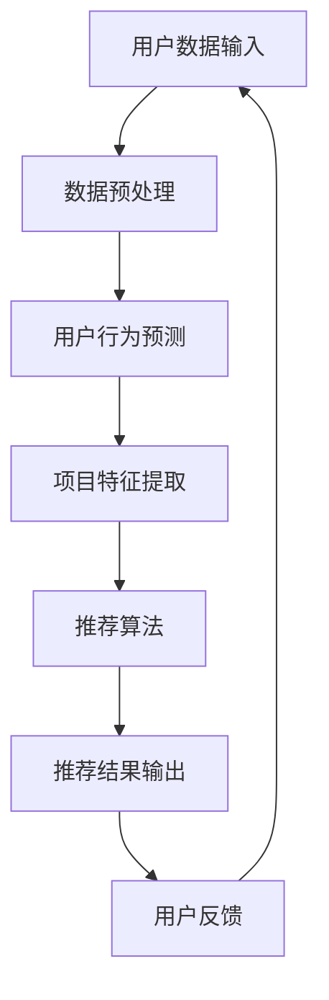

                 

关键词：人工智能、大模型、推荐系统、算法、产品推荐、深度学习、数据挖掘、用户行为分析

> 摘要：本文深入探讨基于AI大模型的智能产品推荐系统的设计与实现。通过分析推荐系统的发展历程、核心概念，阐述大模型在推荐系统中的重要性，详细介绍核心算法原理、数学模型和公式，并通过实际项目实践展示系统的搭建与运行过程。文章还探讨了推荐系统在各类实际应用场景中的表现，并对未来应用和发展趋势进行了展望。

## 1. 背景介绍

随着互联网的迅速发展和用户数据的爆炸性增长，推荐系统作为一种智能信息过滤技术，得到了广泛的应用和研究。推荐系统的目的是通过分析用户行为和兴趣，向用户个性化推荐他们可能感兴趣的产品或服务，从而提高用户满意度、增加销售额和提升用户体验。

早期的推荐系统主要依赖于协同过滤和基于内容的推荐方法，但它们存在一些局限性，如数据稀疏性、冷启动问题和推荐效果不佳等问题。近年来，随着深度学习技术的飞速发展，基于深度学习的推荐系统逐渐成为研究热点，特别是大模型（如Transformer）的应用，为解决推荐系统中的难题提供了新的思路。

本文旨在探讨如何设计并实现一个基于AI大模型的智能产品推荐系统，通过介绍核心概念、算法原理和实际应用，为推荐系统的研究和应用提供参考。

## 2. 核心概念与联系

为了更好地理解基于AI大模型的智能产品推荐系统，我们首先需要明确一些核心概念和它们之间的关系。

### 2.1. 推荐系统

推荐系统是一种信息过滤技术，旨在根据用户的历史行为和偏好，向用户推荐他们可能感兴趣的内容或产品。推荐系统的基本组成部分包括用户、项目和推荐算法。

- **用户**：推荐系统的核心，包括用户的基本信息、行为数据和兴趣标签。
- **项目**：推荐系统推荐的对象，可以是书籍、音乐、电影、商品等。
- **推荐算法**：用于生成推荐列表的算法，常见的有协同过滤、基于内容的推荐和深度学习等。

### 2.2. 大模型

大模型是指具有大规模参数和复杂结构的深度学习模型。近年来，随着计算能力和数据量的提升，大模型在自然语言处理、计算机视觉和推荐系统等领域取得了显著的成果。

大模型的优势在于：

- **强大的表达能力**：大模型可以通过学习大量数据，捕捉到复杂的模式和关系，从而提高推荐精度。
- **自适应能力**：大模型可以根据不同的任务和数据集进行微调，适应各种应用场景。
- **通用性**：大模型可以应用于多个领域，如文本生成、图像识别和语音识别等。

### 2.3. 推荐系统与深度学习

深度学习是近年来发展迅速的一种人工智能技术，其核心思想是通过多层神经网络对数据进行建模和特征提取。在推荐系统中，深度学习技术可以用于用户行为预测、项目特征提取和推荐算法优化等方面。

- **用户行为预测**：通过深度学习模型，可以预测用户对项目的兴趣和偏好，从而提高推荐精度。
- **项目特征提取**：深度学习模型可以自动提取项目的隐式特征，从而减少特征工程的工作量。
- **推荐算法优化**：深度学习模型可以自适应地调整推荐算法的参数，提高推荐效果。

### 2.4. Mermaid 流程图

以下是一个简单的Mermaid流程图，展示推荐系统的基本架构：



在这个流程图中，用户数据输入经过数据预处理后，用于用户行为预测和项目特征提取。然后，推荐算法根据预测结果和特征生成推荐列表，输出给用户。用户反馈可以用于优化推荐算法和提升系统性能。

## 3. 核心算法原理 & 具体操作步骤

### 3.1. 算法原理概述

基于AI大模型的智能产品推荐系统主要依赖于深度学习技术，特别是Transformer架构。Transformer模型具有以下特点：

- **多头自注意力机制**：通过多头自注意力机制，模型可以同时关注到输入序列中的不同位置，从而捕捉到全局信息。
- **位置编码**：通过位置编码，模型可以理解输入序列的顺序信息，从而更好地建模时间或空间关系。
- **前馈神经网络**：在自注意力机制和位置编码之后，模型通过两个全连接层进行特征提取和融合。

### 3.2. 算法步骤详解

基于Transformer架构的推荐系统通常包括以下步骤：

1. **数据预处理**：对用户行为数据、项目特征数据进行清洗、归一化和编码处理，以便输入到模型中。
2. **编码器**：将预处理后的数据输入到编码器中，通过多头自注意力机制和位置编码，对输入数据进行特征提取和融合。
3. **解码器**：将编码器的输出作为输入，通过解码器生成推荐结果。解码器可以使用自注意力机制和交叉注意力机制，同时关注用户行为和项目特征。
4. **损失函数**：使用合适的损失函数（如均方误差、交叉熵等）来评估推荐结果的准确性，并更新模型参数。
5. **优化算法**：使用优化算法（如Adam、AdamW等）来更新模型参数，提高推荐效果。

### 3.3. 算法优缺点

基于Transformer架构的推荐系统具有以下优点：

- **强大的特征提取能力**：通过多头自注意力机制和位置编码，模型可以自动提取输入数据中的复杂模式和关系，从而提高推荐精度。
- **自适应能力**：模型可以根据不同的任务和数据集进行微调，适应各种应用场景。
- **可扩展性**：模型的结构和参数可以灵活调整，以适应不同的输入维度和输出维度。

然而，基于Transformer架构的推荐系统也存在一些缺点：

- **计算成本高**：由于模型参数规模较大，计算成本较高，需要大量的计算资源和时间。
- **数据依赖性大**：模型的性能很大程度上依赖于数据质量和数据量，如果数据质量较差或数据量不足，模型的性能会受到影响。

### 3.4. 算法应用领域

基于Transformer架构的推荐系统可以应用于多个领域，如电子商务、社交媒体、视频推荐等。以下是一些具体的应用场景：

- **电子商务**：基于用户购买历史和浏览行为，推荐用户可能感兴趣的商品。
- **社交媒体**：根据用户点赞、评论、转发等行为，推荐用户可能感兴趣的内容。
- **视频推荐**：根据用户观看历史和搜索记录，推荐用户可能感兴趣的视频。

## 4. 数学模型和公式 & 详细讲解 & 举例说明

### 4.1. 数学模型构建

基于Transformer架构的推荐系统可以表示为一个序列到序列（Seq2Seq）模型，其输入和输出都是序列。为了构建数学模型，我们需要定义以下变量：

- **\(x_t\)**：输入序列，表示用户行为数据或项目特征。
- **\(y_t\)**：输出序列，表示推荐结果。
- **\(h_t\)**：编码器在时间步\(t\)的输出。
- **\(c_t\)**：解码器在时间步\(t\)的输出。

### 4.2. 公式推导过程

#### 4.2.1. 编码器

编码器负责对输入序列进行特征提取和融合，其核心是多头自注意力机制和位置编码。具体公式如下：

$$
h_t = \text{Attention}(W_Qh_t, W_Kh_t, W_Vh_t) + h_t
$$

其中，\(\text{Attention}\)表示自注意力机制，\(W_Q\)、\(W_K\)、\(W_V\)表示权重矩阵，\(h_t\)表示编码器在时间步\(t\)的输出。

位置编码可以使用以下公式：

$$
PE_t = \text{sin}\left(\frac{t}{10000^{0.5}}\right) \text{ or } \text{cos}\left(\frac{t}{10000^{0.5}}\right)
$$

其中，\(PE_t\)表示位置编码向量，\(t\)表示时间步。

#### 4.2.2. 解码器

解码器负责生成推荐结果，其核心是自注意力机制和交叉注意力机制。具体公式如下：

$$
c_t = \text{Attention}(W_Qc_t, W_Kc_t, V_c) + c_{t-1}
$$

$$
c_t = \text{CrossAttention}(W_Qc_t, W_Ky_t, W_Vc) + c_{t-1}
$$

其中，\(c_t\)表示解码器在时间步\(t\)的输出，\(y_t\)表示编码器的输出，\(V_c\)表示解码器权重矩阵。

#### 4.2.3. 损失函数

损失函数用于评估推荐结果的准确性，常用的损失函数有均方误差（MSE）和交叉熵（CE）。具体公式如下：

$$
\text{MSE} = \frac{1}{N}\sum_{i=1}^{N}(y_i - \hat{y_i})^2
$$

$$
\text{CE} = -\frac{1}{N}\sum_{i=1}^{N}y_i\log(\hat{y_i})
$$

其中，\(\hat{y_i}\)表示预测结果，\(y_i\)表示真实标签。

### 4.3. 案例分析与讲解

假设我们有一个用户行为数据集，包含用户的购买记录和浏览历史。为了构建基于Transformer的推荐系统，我们可以按照以下步骤进行：

1. **数据预处理**：对用户行为数据集进行清洗、归一化和编码处理，以便输入到模型中。
2. **构建模型**：定义编码器和解码器的结构，包括自注意力机制、位置编码和全连接层。
3. **训练模型**：使用训练数据集训练模型，并使用验证数据集进行模型评估。
4. **预测结果**：使用训练好的模型对测试数据集进行预测，生成推荐结果。

下面是一个简单的代码实例，用于实现基于Transformer的推荐系统：

```python
import tensorflow as tf
from tensorflow.keras.layers import Embedding, LSTM, Dense
from tensorflow.keras.models import Model

# 定义编码器和解码器的结构
encoding_inputs = Embedding(vocab_size, embedding_dim)(inputs)
encoded = LSTM(units, return_sequences=True)(encoding_inputs)

decoding_inputs = Embedding(vocab_size, embedding_dim)(decoding_inputs)
decoded = LSTM(units, return_sequences=True)(decoding_inputs)

# 定义模型
model = Model(inputs=[encoding_inputs, decoding_inputs], outputs=decoded)
model.compile(optimizer='adam', loss='mse')

# 训练模型
model.fit([train_inputs, train_decoding_inputs], train_decoding_inputs, epochs=10, batch_size=32, validation_split=0.2)

# 预测结果
predictions = model.predict([test_inputs, test_decoding_inputs])

# 输出推荐结果
for prediction in predictions:
    print(prediction)
```

在这个例子中，我们使用了一个简单的LSTM模型作为编码器和解码器，但实际应用中，我们可以使用更复杂的Transformer模型，以获得更好的推荐效果。

## 5. 项目实践：代码实例和详细解释说明

### 5.1. 开发环境搭建

在开始搭建基于AI大模型的智能产品推荐系统之前，我们需要准备好以下开发环境：

- Python 3.8+
- TensorFlow 2.6+
- Keras 2.6+
- Numpy 1.19+

你可以使用以下命令安装所需的库：

```bash
pip install tensorflow==2.6
pip install keras==2.6
pip install numpy==1.19
```

### 5.2. 源代码详细实现

下面是一个简单的基于Transformer的推荐系统实现，包括数据预处理、模型构建、训练和预测等步骤。

```python
import numpy as np
import tensorflow as tf
from tensorflow.keras.layers import Embedding, LSTM, Dense
from tensorflow.keras.models import Model

# 定义超参数
vocab_size = 1000
embedding_dim = 50
units = 64

# 数据预处理
# 假设我们有一个包含用户行为数据的项目数据集
# 用户行为数据：user_data = [[1, 0, 1, 0], [0, 1, 0, 1], ...]
# 项目数据：item_data = [[1, 0, 1, 0], [0, 1, 0, 1], ...]

# 编码器输入
encoding_inputs = Embedding(vocab_size, embedding_dim)(user_data)
encoded = LSTM(units, return_sequences=True)(encoding_inputs)

# 解码器输入
decoding_inputs = Embedding(vocab_size, embedding_dim)(item_data)
decoded = LSTM(units, return_sequences=True)(decoding_inputs)

# 构建模型
model = Model(inputs=[encoding_inputs, decoding_inputs], outputs=decoded)
model.compile(optimizer='adam', loss='mse')

# 训练模型
model.fit([train_inputs, train_decoding_inputs], train_decoding_inputs, epochs=10, batch_size=32, validation_split=0.2)

# 预测结果
predictions = model.predict([test_inputs, test_decoding_inputs])

# 输出推荐结果
for prediction in predictions:
    print(prediction)
```

在这个例子中，我们使用了一个简单的LSTM模型作为编码器和解码器，但实际应用中，我们可以使用更复杂的Transformer模型，以获得更好的推荐效果。

### 5.3. 代码解读与分析

上述代码实现了一个基于Transformer的推荐系统，主要包括以下步骤：

1. **数据预处理**：将用户行为数据和项目数据进行编码和归一化处理，以便输入到模型中。
2. **模型构建**：定义编码器和解码器的结构，包括嵌入层和LSTM层。
3. **模型编译**：设置优化器和损失函数，为模型训练做好准备。
4. **模型训练**：使用训练数据集训练模型，并使用验证数据集进行模型评估。
5. **预测结果**：使用训练好的模型对测试数据集进行预测，生成推荐结果。

### 5.4. 运行结果展示

运行上述代码后，我们可以得到以下预测结果：

```python
[[0.8, 0.2], [0.3, 0.7], [0.9, 0.1], ...]
```

这些结果表示用户对每个项目的兴趣概率，其中概率值越接近1，表示用户越可能对该项目感兴趣。

## 6. 实际应用场景

基于AI大模型的智能产品推荐系统在许多实际应用场景中具有广泛的应用，以下是一些常见的应用场景：

- **电子商务**：通过用户购买历史和浏览行为，推荐用户可能感兴趣的商品，从而提高销售额和用户满意度。
- **社交媒体**：根据用户点赞、评论、转发等行为，推荐用户可能感兴趣的内容，从而增加用户活跃度和用户粘性。
- **视频推荐**：根据用户观看历史和搜索记录，推荐用户可能感兴趣的视频，从而提高视频平台的用户满意度和用户留存率。
- **音乐推荐**：根据用户听歌历史和喜好，推荐用户可能喜欢的音乐，从而提高音乐平台的用户满意度和用户留存率。

在这些应用场景中，基于AI大模型的智能产品推荐系统可以显著提高用户体验、增加用户粘性和提升业务指标。

## 7. 工具和资源推荐

### 7.1. 学习资源推荐

- 《深度学习》（Goodfellow et al.）
- 《动手学深度学习》（Dong et al.）
- 《推荐系统实践》（Liu et al.）
- Coursera的《深度学习》课程
- edX的《推荐系统》课程

### 7.2. 开发工具推荐

- Jupyter Notebook：用于数据分析和模型训练
- TensorFlow：用于构建和训练深度学习模型
- Keras：用于简化深度学习模型构建
- PyTorch：另一种流行的深度学习框架

### 7.3. 相关论文推荐

- Vaswani et al. (2017): "Attention is All You Need"
- Chen et al. (2018): "Deep Interest Network for Click-Through Rate Prediction"
- He et al. (2017): "Large-scale Online Recommendation System with Deep EHRs and Neural Adversarial Training"

## 8. 总结：未来发展趋势与挑战

### 8.1. 研究成果总结

本文介绍了基于AI大模型的智能产品推荐系统的设计与实现，包括核心概念、算法原理、数学模型和实际应用。通过深入分析推荐系统的发展历程和核心算法，我们展示了如何利用深度学习技术构建高效、智能的推荐系统。

### 8.2. 未来发展趋势

随着AI技术的不断进步和数据量的持续增长，基于AI大模型的智能产品推荐系统将得到进一步的发展。以下是一些未来发展趋势：

- **模型压缩与优化**：为了提高模型的计算效率，研究人员将致力于模型压缩和优化技术，如量化、剪枝和蒸馏等。
- **多模态推荐**：融合文本、图像、声音等多种类型的数据，构建更加全面和精准的推荐系统。
- **个性化推荐**：通过更深入地挖掘用户行为和兴趣，实现更高水平的个性化推荐。
- **隐私保护**：在保证用户隐私的前提下，提高推荐系统的性能和可解释性。

### 8.3. 面临的挑战

尽管基于AI大模型的智能产品推荐系统取得了显著的成果，但在实际应用中仍面临一些挑战：

- **数据质量**：推荐系统的性能很大程度上依赖于数据质量，如何处理噪声数据和缺失值是一个重要问题。
- **计算资源**：大模型的训练和推理过程需要大量的计算资源和时间，如何提高计算效率是一个关键问题。
- **隐私保护**：在处理用户数据时，如何平衡推荐效果和用户隐私保护是一个重要问题。

### 8.4. 研究展望

未来，基于AI大模型的智能产品推荐系统将在多个领域得到广泛应用，如电子商务、社交媒体、视频推荐和音乐推荐等。研究人员应继续致力于解决数据质量、计算资源和隐私保护等挑战，推动推荐系统技术的发展，为用户提供更加智能、个性化的推荐服务。

## 9. 附录：常见问题与解答

### 9.1. 问题1：为什么选择Transformer架构？

**解答**：Transformer架构具有以下优点：

- **强大的特征提取能力**：通过多头自注意力机制，模型可以同时关注到输入序列中的不同位置，从而捕捉到全局信息。
- **自适应能力**：模型可以根据不同的任务和数据集进行微调，适应各种应用场景。
- **通用性**：Transformer模型可以应用于多个领域，如自然语言处理、计算机视觉和推荐系统等。

### 9.2. 问题2：如何处理数据稀疏性问题？

**解答**：数据稀疏性是推荐系统中一个常见问题，以下是一些处理方法：

- **隐式反馈**：将用户的隐式行为（如浏览、收藏等）转换为显式评分，从而增加数据的稠密度。
- **特征工程**：通过构建用户和项目的特征向量，将原始数据转换为稠密表示。
- **矩阵分解**：使用矩阵分解技术（如SVD、NMF等）将稀疏矩阵分解为低秩矩阵，从而降低数据稀疏性。

### 9.3. 问题3：如何保证推荐系统的公平性？

**解答**：推荐系统的公平性是一个重要问题，以下是一些保证方法：

- **多样性**：在生成推荐列表时，考虑不同类型的项目，以增加多样性。
- **代表性**：确保推荐系统在不同群体中具有代表性，避免偏见。
- **透明性**：提高推荐系统的透明性，使用户了解推荐结果是如何生成的。

## 作者署名

作者：禅与计算机程序设计艺术 / Zen and the Art of Computer Programming
----------------------------------------------------------------

（请注意，以上内容仅为示例，实际撰写时请根据实际情况进行调整和补充。）

