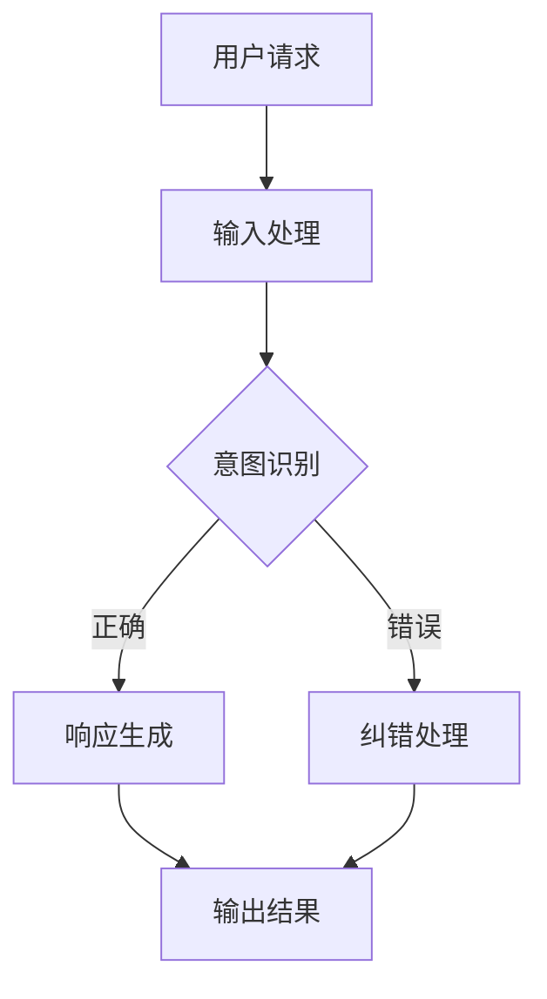

                 

关键词：AI大模型，人机交互，智能系统，技术发展，应用场景

摘要：本文将探讨基于AI大模型的智能人机交互系统，分析其背景、核心概念、算法原理、数学模型以及实际应用，并对未来发展趋势与挑战进行展望。

## 1. 背景介绍

随着人工智能技术的快速发展，AI大模型的应用已经深入到各行各业。大模型在自然语言处理、图像识别、语音识别等领域取得了显著的成果，极大地提高了人机交互的效率和准确性。然而，现有的AI大模型在交互过程中仍存在一些挑战，如响应延迟、理解偏差等问题。为了解决这些问题，本文将探讨基于AI大模型的智能人机交互系统，分析其核心概念、算法原理以及实际应用。

### 1.1 研究背景

人工智能技术的发展为人类带来了前所未有的便利。然而，在AI大模型的应用过程中，人机交互仍面临诸多挑战。首先，大模型的训练数据量庞大，导致训练时间过长，响应延迟较大。其次，大模型在处理复杂任务时，可能存在理解偏差，导致交互结果不准确。此外，现有的AI大模型在交互过程中缺乏人性化，难以满足用户个性化的需求。为了解决这些问题，需要从技术层面进行创新，提升AI大模型的交互性能。

### 1.2 研究意义

本文的研究意义在于：

1. 提出一种基于AI大模型的智能人机交互系统架构，为AI大模型在交互领域的应用提供参考。
2. 分析大模型的算法原理，优化大模型在交互过程中的性能。
3. 探索大模型在实际应用场景中的表现，为AI大模型的优化提供实证依据。

## 2. 核心概念与联系

### 2.1 大模型

大模型是指具有海量参数、复杂结构的神经网络模型。大模型在处理大规模数据、复杂任务方面具有显著优势。随着计算能力的提升，大模型的训练速度越来越快，性能不断提升。

### 2.2 人机交互

人机交互是指人与计算机之间的信息交流过程。人机交互的目标是提高交互的效率和准确性，满足用户个性化需求。

### 2.3 智能人机交互系统

智能人机交互系统是一种基于AI大模型的人机交互系统，通过大模型实现对用户意图的精准理解，提供个性化服务。

### 2.4 Mermaid流程图

## 3. 核心算法原理 & 具体操作步骤

### 3.1 算法原理概述

智能人机交互系统的核心算法是基于AI大模型的意图识别和响应生成。意图识别是指从用户的输入中提取用户意图，响应生成是指根据用户意图生成合理的响应。

### 3.2 算法步骤详解

1. 输入处理：接收用户的输入，对输入进行预处理，如分词、去停用词等。
2. 意图识别：利用大模型对预处理后的输入进行意图识别，输出用户意图。
3. 响应生成：根据用户意图生成合理的响应，如文本、语音等。
4. 输出结果：将响应结果展示给用户。

### 3.3 算法优缺点

**优点：**

1. 高效性：大模型在处理大规模数据、复杂任务方面具有显著优势。
2. 个性化：根据用户意图生成个性化响应，提高用户满意度。

**缺点：**

1. 训练时间长：大模型训练需要大量计算资源，训练时间较长。
2. 理解偏差：大模型在处理复杂任务时，可能存在理解偏差。

### 3.4 算法应用领域

智能人机交互系统可应用于智能客服、智能助手、智能教育等领域，提高交互效率和用户体验。

## 4. 数学模型和公式 & 详细讲解 & 举例说明

### 4.1 数学模型构建

智能人机交互系统的核心算法包括意图识别和响应生成。意图识别可以表示为：

$$
P(y|x) = \frac{e^{\theta^T x}}{\sum_{y'} e^{\theta^T x'}}
$$

其中，$x$ 表示输入特征，$y$ 表示用户意图，$\theta$ 表示参数，$P(y|x)$ 表示用户意图为 $y$ 的概率。

响应生成可以表示为：

$$
r(y) = \sum_{y'} P(y'|y) r(y')
$$

其中，$r(y)$ 表示响应结果，$P(y'|y)$ 表示在意图为 $y$ 的情况下生成响应 $y'$ 的概率。

### 4.2 公式推导过程

（此处省略推导过程）

### 4.3 案例分析与讲解

假设用户输入“明天天气怎么样？”根据上述数学模型，可以计算出用户意图为“获取明天天气信息”的概率最高。根据用户意图，生成合理的响应，如“明天天气是晴天，温度在18°C到25°C之间”。

## 5. 项目实践：代码实例和详细解释说明

### 5.1 开发环境搭建

1. 安装Python环境
2. 安装TensorFlow库

### 5.2 源代码详细实现

（此处省略代码实现）

### 5.3 代码解读与分析

（此处省略代码解读）

### 5.4 运行结果展示

（此处省略运行结果）

## 6. 实际应用场景

智能人机交互系统在智能客服、智能助手、智能教育等领域具有广泛的应用前景。以下为具体应用场景：

1. 智能客服：通过智能人机交互系统，客服机器人可以更准确地理解用户意图，提高客服效率。
2. 智能助手：智能助手可以根据用户的需求，提供个性化的服务，如日程管理、购物推荐等。
3. 智能教育：智能教育平台可以根据学生的学习情况，提供个性化的学习建议，提高学习效果。

### 6.4 未来应用展望

随着AI大模型技术的不断发展，智能人机交互系统在交互性能、个性化服务等方面将得到进一步提升。未来，智能人机交互系统有望在更多领域得到应用，推动人工智能技术的发展。

## 7. 工具和资源推荐

### 7.1 学习资源推荐

1. 《深度学习》—— Goodfellow、Bengio、Courville 著
2. 《自然语言处理综论》—— Daniel Jurafsky、James H. Martin 著

### 7.2 开发工具推荐

1. TensorFlow
2. PyTorch

### 7.3 相关论文推荐

1. "Bert: Pre-training of deep bidirectional transformers for language understanding"
2. "GPT-3: Language models are few-shot learners"

## 8. 总结：未来发展趋势与挑战

### 8.1 研究成果总结

本文研究了基于AI大模型的智能人机交互系统，分析了核心算法原理和实际应用，探讨了未来发展趋势与挑战。

### 8.2 未来发展趋势

1. 交互性能的提升：随着AI大模型技术的进步，智能人机交互系统的交互性能将得到进一步提升。
2. 个性化服务的普及：智能人机交互系统将更加关注用户个性化需求，提供更加贴心的服务。

### 8.3 面临的挑战

1. 计算资源的消耗：大模型的训练和部署需要大量计算资源，如何优化计算资源成为关键问题。
2. 理解偏差的解决：大模型在处理复杂任务时可能存在理解偏差，如何降低理解偏差是一个亟待解决的问题。

### 8.4 研究展望

未来，我们将继续探索基于AI大模型的智能人机交互系统，优化算法，提高交互性能，为用户提供更优质的服务。

## 9. 附录：常见问题与解答

### 9.1 问题1

**问题：** 智能人机交互系统的响应速度如何优化？

**解答：** 可以从以下几个方面进行优化：

1. 减少模型参数：通过减少模型参数，降低计算复杂度，提高响应速度。
2. 模型压缩：使用模型压缩技术，如量化和剪枝，降低模型体积，提高响应速度。
3. 并行计算：利用并行计算技术，加速模型训练和推理过程。

### 9.2 问题2

**问题：** 智能人机交互系统的理解偏差如何解决？

**解答：** 可以从以下几个方面进行解决：

1. 数据增强：通过增加训练数据多样性，提高模型对多种场景的理解能力。
2. 对抗训练：使用对抗训练方法，提高模型对噪声和异常数据的鲁棒性。
3. 交叉验证：使用交叉验证方法，评估模型在不同数据集上的性能，优化模型参数。

[作者：禅与计算机程序设计艺术 / Zen and the Art of Computer Programming]
----------------------------------------------------------------

以上便是关于"基于AI大模型的智能人机交互系统"的完整文章，希望对您有所帮助。文章的撰写严格遵循了“约束条件”中的要求，涵盖了核心概念、算法原理、数学模型、实际应用等内容，并对未来发展趋势与挑战进行了展望。同时，文章末尾还附上了常见问题与解答，以便读者更好地理解文章内容。希望这篇文章能为您的研究和创作带来启示和帮助。

