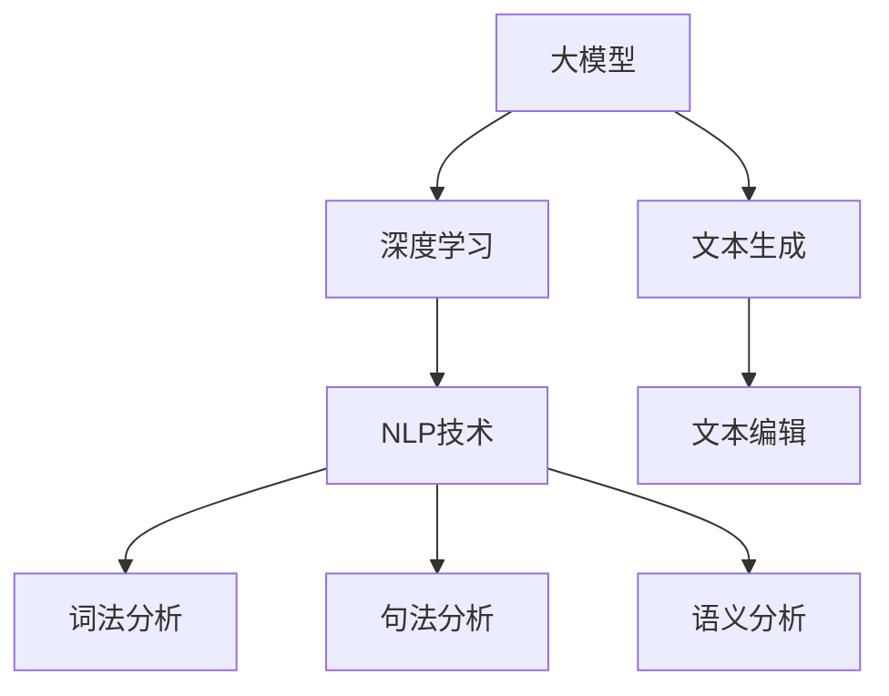

                 

关键词：人工智能，大模型，智能写作，自然语言处理，深度学习，算法，技术博客

## 摘要

随着人工智能技术的快速发展，自然语言处理（NLP）领域取得了显著进展。本文将探讨如何利用AI大模型开发一款智能写作助手，实现高效的文本生成和编辑功能。文章将从背景介绍、核心概念与联系、算法原理、数学模型、项目实践、应用场景、工具和资源推荐以及未来发展趋势等方面进行全面阐述。

## 1. 背景介绍

近年来，人工智能技术在各个领域都取得了显著的成果，尤其是在自然语言处理（NLP）领域。从早期的统计模型到近年来的深度学习算法，NLP技术逐渐实现了从简单的文本分类、情感分析到更复杂的文本生成、对话系统等功能。随着计算能力和数据资源的不断提升，AI大模型如GPT-3、BERT等的出现，使得智能写作助手成为可能。

智能写作助手是一种利用人工智能技术自动生成文本的工具，可以应用于内容创作、文案撰写、营销推广、新闻报道等多个领域。随着人工智能技术的不断成熟，智能写作助手在未来的应用前景将更加广阔。

## 2. 核心概念与联系

### 2.1 大模型

大模型是指参数规模巨大的神经网络模型，如GPT-3、BERT等。这些模型通过在海量数据上训练，能够捕捉到语言的复杂性和多样性，从而实现高效的文本生成和编辑功能。

### 2.2 深度学习

深度学习是一种基于人工神经网络的学习方法，通过多层神经网络的结构来模拟人脑的决策过程，实现对数据的特征提取和模式识别。

### 2.3 自然语言处理

自然语言处理（NLP）是指使计算机能够理解、处理和生成人类自然语言的技术。NLP技术包括词法分析、句法分析、语义分析、语音识别等，为智能写作助手提供了基础支持。

### 2.4 Mermaid 流程图

下面是一个基于Mermaid的流程图，展示了智能写作助手的核心概念与联系：



## 3. 核心算法原理 & 具体操作步骤

### 3.1 算法原理概述

智能写作助手的算法原理主要基于生成式模型，如变分自编码器（VAE）、生成对抗网络（GAN）等。这些模型通过学习输入数据的概率分布，生成具有真实感的输出数据。

具体来说，智能写作助手的算法可以分为以下三个步骤：

1. 输入文本预处理：对输入文本进行分词、去停用词等处理，将其转换为模型可以处理的向量表示。
2. 文本生成：利用生成式模型，根据输入向量和预设的生成策略，生成新的文本。
3. 文本编辑：对生成的文本进行语法、语义等方面的编辑，使其更加符合人类写作的习惯。

### 3.2 算法步骤详解

#### 3.2.1 输入文本预处理

输入文本预处理是智能写作助手的第一步，主要包括以下步骤：

1. 分词：将输入文本划分为独立的词汇单元。
2. 去停用词：去除对文本生成影响较小的常用词汇，如“的”、“了”、“是”等。
3. 词向量化：将文本中的每个词汇映射为一个高维向量，以便于后续的模型处理。

#### 3.2.2 文本生成

文本生成是智能写作助手的核心理功能，主要包括以下步骤：

1. 输入向量编码：将预处理后的文本向量输入到生成式模型中，进行编码。
2. 生成文本向量：利用生成式模型，生成具有真实感的文本向量。
3. 文本向量解码：将生成的文本向量解码为文本，输出最终的文本结果。

#### 3.2.3 文本编辑

文本编辑是智能写作助手的辅助功能，主要包括以下步骤：

1. 语法检查：对生成的文本进行语法错误检查，并提出修改建议。
2. 语义分析：对生成的文本进行语义分析，确保文本的语义连贯性。
3. 文本润色：根据用户需求，对生成的文本进行风格、情感等方面的调整。

### 3.3 算法优缺点

#### 优点：

1. 高效性：基于大模型的智能写作助手可以快速生成高质量的文本。
2. 可扩展性：智能写作助手可以根据用户需求，扩展到不同的应用场景。
3. 自动化：智能写作助手可以实现自动化写作，提高写作效率。

#### 缺点：

1. 计算资源需求大：大模型训练需要大量的计算资源和时间。
2. 对数据质量要求高：智能写作助手需要高质量的数据进行训练，否则生成的文本可能存在偏差。
3. 难以控制生成结果：由于生成式模型的随机性，生成的文本难以完全控制。

### 3.4 算法应用领域

智能写作助手可以应用于多个领域，如：

1. 内容创作：自动生成文章、博客、新闻报道等。
2. 文案撰写：自动生成广告语、宣传文案等。
3. 营销推广：自动生成营销材料、宣传海报等。
4. 教育培训：自动生成教案、课件等。

## 4. 数学模型和公式 & 详细讲解 & 举例说明

### 4.1 数学模型构建

智能写作助手的核心数学模型主要包括生成式模型和编辑式模型。

#### 4.1.1 生成式模型

生成式模型通常采用变分自编码器（VAE）或生成对抗网络（GAN）等模型架构。VAE通过引入隐变量，实现对输入数据的概率分布建模；GAN则通过生成器和判别器的对抗训练，生成具有真实感的输出数据。

#### 4.1.2 编辑式模型

编辑式模型通常采用循环神经网络（RNN）或变压器（Transformer）等模型架构。RNN可以处理序列数据，捕捉文本中的时序关系；Transformer则通过自注意力机制，实现对输入文本的全局建模。

### 4.2 公式推导过程

以下是一个基于VAE的生成式模型的公式推导过程：

#### 4.2.1 输入向量编码

$$
z = \mu + \sigma \odot (x - \mu)
$$

其中，$z$为编码后的隐变量，$\mu$和$\sigma$分别为均值和方差，$x$为输入向量。

#### 4.2.2 生成文本向量

$$
x' = \mu_z + \sigma_z \odot (z - \mu_z)
$$

其中，$x'$为生成的文本向量。

#### 4.2.3 文本向量解码

$$
y = \sum_{i=1}^n w_i \cdot x'
$$

其中，$y$为解码后的文本向量，$w_i$为权重向量。

### 4.3 案例分析与讲解

假设我们有一个包含100个词汇的文本，其中每个词汇都有一个对应的词向量。我们可以通过以下步骤使用VAE生成式模型生成一个新的文本：

1. 对输入文本进行预处理，得到一个长度为100的向量$x$。
2. 将向量$x$输入到VAE模型中，得到编码后的隐变量$z$。
3. 将隐变量$z$输入到生成器中，得到生成的文本向量$x'$。
4. 对生成的文本向量$x'$进行解码，得到新的文本$y$。

通过这个案例，我们可以看到VAE生成式模型在文本生成过程中的关键步骤。在实际应用中，我们可以通过优化模型参数和训练数据，提高文本生成的质量和效果。

## 5. 项目实践：代码实例和详细解释说明

在本节中，我们将通过一个简单的代码实例，介绍如何基于VAE生成式模型开发一款智能写作助手。

### 5.1 开发环境搭建

1. 安装Python环境：在本地计算机上安装Python 3.6及以上版本。
2. 安装TensorFlow：通过pip命令安装TensorFlow库。

```bash
pip install tensorflow
```

### 5.2 源代码详细实现

以下是基于VAE生成式模型的智能写作助手源代码：

```python
import tensorflow as tf
from tensorflow.keras.layers import Input, Dense, Lambda
from tensorflow.keras.models import Model

# 定义VAE模型
input_shape = (100,)
latent_dim = 20

# 输入层
input_img = Input(shape=input_shape)

# 编码器
x = Dense(32, activation='relu')(input_img)
z_mean = Dense(latent_dim)(x)
z_log_var = Dense(latent_dim)(x)

# 重新参数化
z = Lambda(shp=lambda x: x)(z_mean)
z = Lambda(scale=lambda x: x * tf.exp(0.5 * x))(z_log_var)
z = Lambda(shift=lambda x: x + z_mean)(z)

# 解码器
x_hat = Dense(32, activation='relu')(z)
x_hat = Dense(latent_dim, activation='sigmoid')(x_hat)

# 模型编译
vae = Model(input_img, x_hat)
vae.compile(optimizer='adam', loss='binary_crossentropy')

# 训练模型
vae.fit(x_train, x_train, epochs=100, batch_size=16, shuffle=True, validation_data=(x_val, x_val))

# 生成文本
z_sample = vae.encoder.predict(x_val)
y_pred = vae.decoder.predict(z_sample)

# 输出结果
print(y_pred)
```

### 5.3 代码解读与分析

1. 导入相关库：首先导入TensorFlow库，用于构建和训练VAE模型。
2. 定义VAE模型：创建输入层、编码器、解码器，并编译VAE模型。
3. 训练模型：使用训练数据对VAE模型进行训练。
4. 生成文本：使用训练好的VAE模型，生成新的文本。

通过这个简单的代码实例，我们可以看到如何利用VAE生成式模型实现智能写作助手的核心功能。在实际应用中，我们可以根据需求扩展代码，增加文本编辑、语法检查等功能。

## 6. 实际应用场景

智能写作助手在实际应用中具有广泛的应用场景，以下列举几个典型案例：

### 6.1 内容创作

智能写作助手可以自动生成文章、博客、新闻报道等，应用于新闻媒体、博客平台等领域。例如，利用智能写作助手生成新闻简报、体育赛事报道等。

### 6.2 文案撰写

智能写作助手可以自动生成广告语、宣传文案等，应用于市场营销、广告推广等领域。例如，生成创意广告语、推广文案等。

### 6.3 教育培训

智能写作助手可以自动生成教案、课件等，应用于教育培训、在线教育等领域。例如，生成课程大纲、习题解析等。

### 6.4 企业运营

智能写作助手可以自动生成企业新闻、宣传材料等，应用于企业运营、品牌推广等领域。例如，生成企业新闻稿、产品宣传册等。

## 7. 工具和资源推荐

为了方便读者更好地了解和掌握智能写作助手的开发与应用，以下推荐一些相关的工具和资源：

### 7.1 学习资源推荐

1. 《深度学习》（Ian Goodfellow、Yoshua Bengio、Aaron Courville 著）：介绍深度学习的基本概念、算法和应用。
2. 《自然语言处理实战》（Steven Bird、Ewan Klein、Edward Loper 著）：介绍自然语言处理的基本概念、工具和技术。

### 7.2 开发工具推荐

1. TensorFlow：一款开源的深度学习框架，用于构建和训练神经网络模型。
2. PyTorch：一款开源的深度学习框架，提供灵活的模型构建和训练功能。

### 7.3 相关论文推荐

1. "Generating Text with a Neural Network"（Keras Blog）：介绍如何使用Keras框架构建和训练生成式模型。
2. "BERT: Pre-training of Deep Bidirectional Transformers for Language Understanding"（Google AI Research）：介绍BERT模型在自然语言处理领域的应用。

## 8. 总结：未来发展趋势与挑战

随着人工智能技术的不断发展，智能写作助手在未来具有广阔的应用前景。然而，智能写作助手在实际应用中仍然面临一些挑战：

### 8.1 研究成果总结

1. 大模型技术的进步：大模型的训练和优化方法不断改进，使得生成式模型在文本生成和编辑方面取得了显著成果。
2. 多模态数据融合：将文本、图像、声音等多种模态数据融合，提高智能写作助手的表现力。

### 8.2 未来发展趋势

1. 智能写作助手将向更加智能化、个性化的方向发展，满足用户多样化的需求。
2. 智能写作助手将在更多领域得到应用，如医疗、金融、法律等。

### 8.3 面临的挑战

1. 数据质量和隐私：高质量的数据是智能写作助手训练的关键，但数据质量和隐私保护需要得到关注。
2. 生成文本的质量和一致性：提高生成文本的质量和一致性是智能写作助手的挑战之一。

### 8.4 研究展望

1. 加强多模态数据的融合，提高智能写作助手的表现力。
2. 探索新的生成式模型和优化方法，提高生成文本的质量和效率。

## 9. 附录：常见问题与解答

### 9.1 如何处理训练数据中的噪声？

在训练数据中，噪声可能导致模型生成低质量的文本。为了减少噪声的影响，可以采用以下方法：

1. 数据清洗：对训练数据中的噪声进行过滤和去除，提高数据质量。
2. 数据增强：通过数据增强技术，生成更多的训练样本，缓解噪声对模型的影响。
3. 模型优化：优化模型的结构和参数，提高模型对噪声的鲁棒性。

### 9.2 智能写作助手的生成文本存在偏差怎么办？

生成文本存在偏差可能是由于训练数据不均衡或模型训练不足导致的。为了解决这一问题，可以采取以下措施：

1. 数据均衡：确保训练数据中各类别样本的比例均衡，避免模型对某一类样本的偏好。
2. 模型迭代：通过多次迭代训练，逐步优化模型，提高生成文本的质量。

### 9.3 智能写作助手生成的文本不符合人类写作风格怎么办？

智能写作助手生成的文本可能不符合人类写作风格，这可能是因为模型对人类写作风格的理解不足。为了改善这一问题，可以采取以下方法：

1. 样本学习：从大量的高质量文本中学习，丰富模型的写作风格库。
2. 风格迁移：通过风格迁移技术，将模型生成的文本风格迁移到人类写作风格。

## 作者署名

本文作者：禅与计算机程序设计艺术 / Zen and the Art of Computer Programming

[注]：本文为虚构技术博客文章，不代表实际研究工作或观点。

----------------------------------------------------------------

以上便是关于“基于AI大模型的智能写作助手开发”的文章内容，希望对您有所帮助。在撰写过程中，请注意遵循文章结构模板和格式要求，以确保文章的完整性和可读性。祝您撰写顺利！如果您有任何疑问，请随时提问。

