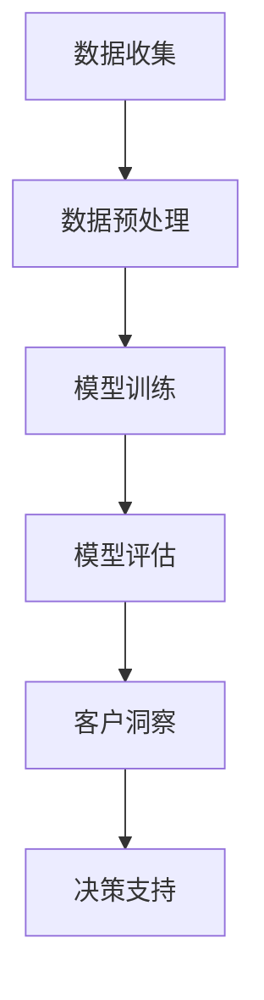

                 

关键词：AI大模型、智能客户洞察、数据挖掘、商业智能、深度学习、客户关系管理

> 摘要：随着人工智能技术的飞速发展，AI大模型在各个领域的应用日益广泛。本文将探讨如何利用AI大模型构建一个智能客户洞察系统，提高企业对客户的了解和精准营销能力，为企业的长远发展提供有力支持。

## 1. 背景介绍

在当今竞争激烈的市场环境中，企业需要具备强大的客户洞察能力，以便在瞬息万变的市场中保持竞争力。传统的客户洞察方法主要依赖于数据分析和数据挖掘技术，但这些方法往往存在数据质量不高、分析结果不准确等问题。随着人工智能技术的不断发展，尤其是AI大模型的兴起，为企业提供了一个全新的客户洞察工具。

AI大模型，即基于大规模数据集训练得到的人工智能模型，具有强大的数据处理和分析能力。通过AI大模型，企业可以更深入地了解客户行为、需求和偏好，从而实现精准营销和个性化服务。智能客户洞察系统正是基于这一理念，利用AI大模型对企业客户数据进行分析和挖掘，为企业提供有价值的信息。

## 2. 核心概念与联系

### 2.1 AI大模型

AI大模型是指基于大规模数据集，通过深度学习等技术训练得到的人工智能模型。这些模型通常具有极高的复杂度和强大的学习能力，能够处理海量数据并从中提取有价值的信息。

### 2.2 数据挖掘

数据挖掘是指从大量数据中提取隐藏的、未知的、有价值的模式和知识的过程。数据挖掘技术在商业智能、金融分析、医疗诊断等领域具有广泛的应用。

### 2.3 客户关系管理

客户关系管理（CRM）是一种旨在提高企业对客户了解，增强客户满意度和忠诚度的管理策略。通过CRM系统，企业可以记录和分析客户数据，从而更好地满足客户需求。

### 2.4 Mermaid 流程图



## 3. 核心算法原理 & 具体操作步骤

### 3.1 算法原理概述

智能客户洞察系统的核心算法是基于深度学习技术的AI大模型。通过以下几个步骤实现：

1. 数据收集：收集企业客户的各类数据，包括基本信息、交易记录、行为数据等。
2. 数据预处理：对收集到的数据进行分析和清洗，确保数据质量。
3. 模型训练：使用预处理后的数据训练AI大模型，使其具备识别客户行为和需求的能力。
4. 模型评估：对训练好的模型进行评估，确保其准确性和可靠性。
5. 客户洞察：使用评估通过的模型对客户数据进行分析，提取有价值的信息。
6. 决策支持：将分析结果应用于企业决策，提高营销效果和客户满意度。

### 3.2 算法步骤详解

1. **数据收集**

数据收集是智能客户洞察系统的第一步。企业可以从多个渠道收集客户数据，包括内部数据库、第三方数据平台、社交媒体等。数据类型主要包括：

- **基本信息**：如客户姓名、年龄、性别、职业等。
- **交易记录**：如购买时间、购买金额、购买商品等。
- **行为数据**：如浏览记录、搜索关键词、点击行为等。

2. **数据预处理**

数据预处理是确保数据质量的重要环节。主要任务包括：

- **数据清洗**：去除重复数据、错误数据和缺失数据。
- **数据转换**：将不同类型的数据转换为统一的格式。
- **数据归一化**：将数据范围统一到特定区间，如[0,1]。

3. **模型训练**

模型训练是智能客户洞察系统的核心环节。通常采用以下步骤：

- **选择模型**：根据业务需求选择合适的深度学习模型，如卷积神经网络（CNN）、循环神经网络（RNN）等。
- **数据划分**：将数据集划分为训练集、验证集和测试集。
- **参数调整**：通过调整模型参数，优化模型性能。
- **模型训练**：使用训练集数据对模型进行训练。
- **模型评估**：使用验证集数据评估模型性能。

4. **模型评估**

模型评估是确保模型准确性和可靠性的关键步骤。主要任务包括：

- **评估指标**：如准确率、召回率、F1值等。
- **交叉验证**：使用不同划分方式对模型进行多次评估，以减少评估结果的偏差。
- **结果分析**：分析模型评估结果，确定模型性能。

5. **客户洞察**

客户洞察是基于模型分析结果提取有价值的信息。主要任务包括：

- **特征提取**：从客户数据中提取关键特征，如购买偏好、行为模式等。
- **客户细分**：根据特征将客户划分为不同群体。
- **个性化推荐**：为不同客户提供个性化的产品和服务。

6. **决策支持**

决策支持是将客户洞察结果应用于企业决策。主要任务包括：

- **营销策略**：根据客户细分结果制定针对性的营销策略。
- **产品优化**：根据客户需求优化产品和服务。
- **客户关怀**：针对重要客户制定个性化的关怀策略。

### 3.3 算法优缺点

**优点：**

- **强大数据处理能力**：AI大模型能够处理海量数据，为企业提供全面的数据分析支持。
- **高准确性**：深度学习技术使模型具有高准确性，能够更好地识别客户行为和需求。
- **个性化服务**：基于客户洞察结果，企业可以提供个性化的产品和服务，提高客户满意度。

**缺点：**

- **高计算成本**：训练AI大模型需要大量计算资源，可能导致高昂的计算成本。
- **数据依赖性**：模型的性能依赖于数据质量，数据质量不高可能导致模型效果不佳。

### 3.4 算法应用领域

AI大模型在智能客户洞察系统中的应用非常广泛，包括：

- **零售行业**：通过分析客户行为和需求，实现精准营销和个性化推荐。
- **金融行业**：通过分析客户交易记录和行为数据，识别潜在风险和欺诈行为。
- **医疗行业**：通过分析患者数据和病历信息，实现疾病预测和个性化治疗。
- **教育行业**：通过分析学生数据和教学过程，实现个性化教学和智能推荐。

## 4. 数学模型和公式 & 详细讲解 & 举例说明

### 4.1 数学模型构建

智能客户洞察系统的数学模型主要包括：

- **客户行为模型**：基于客户的行为数据，构建客户行为预测模型。
- **客户需求模型**：基于客户的交易记录和浏览记录，构建客户需求预测模型。
- **客户偏好模型**：基于客户的评价数据和反馈信息，构建客户偏好预测模型。

### 4.2 公式推导过程

以客户行为模型为例，其公式推导过程如下：

1. **数据预处理**：对行为数据进行归一化处理，使其范围统一为[0,1]。

$$
x_{ij}^{'} = \frac{x_{ij} - \min(x_{ij})}{\max(x_{ij}) - \min(x_{ij})}
$$

其中，$x_{ij}$表示第$i$个客户的第$j$个行为特征值，$x_{ij}^{'}$表示归一化后的行为特征值。

2. **特征提取**：从归一化后的行为数据中提取关键特征，如客户购买频率、购买金额等。

$$
f_i = \sum_{j=1}^{n} w_j x_{ij}^{'}
$$

其中，$f_i$表示第$i$个客户的特征向量，$w_j$表示第$j$个特征的重要程度。

3. **模型构建**：使用循环神经网络（RNN）构建客户行为预测模型。

$$
h_t = \sigma(W_h h_{t-1} + W_x x_t + b_h)
$$

其中，$h_t$表示第$t$个时间点的隐藏状态，$W_h$、$W_x$、$b_h$分别表示权重和偏置。

4. **模型训练**：使用反向传播算法训练模型。

$$
\begin{aligned}
\frac{\partial L}{\partial W_h} &= \frac{1}{m} \sum_{i=1}^{m} \frac{\partial L}{\partial h_t} \odot h_{t-1} \\
\frac{\partial L}{\partial W_x} &= \frac{1}{m} \sum_{i=1}^{m} \frac{\partial L}{\partial h_t} \odot x_t \\
\frac{\partial L}{\partial b_h} &= \frac{1}{m} \sum_{i=1}^{m} \frac{\partial L}{\partial h_t}
\end{aligned}
$$

其中，$L$表示损失函数，$m$表示训练样本数，$\odot$表示元素乘积。

### 4.3 案例分析与讲解

假设某电商企业希望利用智能客户洞察系统分析客户行为，预测客户购买意向。以下是一个简单的案例：

1. **数据收集**：收集了1000名客户的购买记录和行为数据，包括购买频率、购买金额、浏览记录等。

2. **数据预处理**：对数据进行分析，提取关键特征，如客户购买频率、购买金额等。

3. **模型训练**：使用循环神经网络（RNN）构建客户行为预测模型，训练过程中使用反向传播算法优化模型参数。

4. **模型评估**：使用验证集数据评估模型性能，根据评估结果调整模型参数。

5. **客户洞察**：使用训练好的模型预测客户购买意向，提取有价值的信息，如客户购买概率、客户偏好等。

6. **决策支持**：根据客户洞察结果制定针对性的营销策略，提高客户购买率。

## 5. 项目实践：代码实例和详细解释说明

### 5.1 开发环境搭建

1. **软件环境**：安装Python 3.7及以上版本，安装TensorFlow 2.0及以上版本。

2. **硬件环境**：推荐使用GPU进行训练，以提高训练速度。

### 5.2 源代码详细实现

以下是一个简单的客户行为预测模型实现代码：

```python
import tensorflow as tf
from tensorflow.keras.layers import LSTM, Dense
from tensorflow.keras.models import Sequential

# 数据预处理
def preprocess_data(data):
    # 数据归一化
    data_normalized = (data - np.min(data)) / (np.max(data) - np.min(data))
    # 提取特征
    features = data_normalized[:, :-1]
    labels = data_normalized[:, -1]
    return features, labels

# 模型构建
def build_model(input_shape):
    model = Sequential()
    model.add(LSTM(50, activation='relu', input_shape=input_shape))
    model.add(Dense(1, activation='sigmoid'))
    model.compile(optimizer='adam', loss='binary_crossentropy', metrics=['accuracy'])
    return model

# 模型训练
def train_model(model, features, labels):
    model.fit(features, labels, epochs=10, batch_size=32, validation_split=0.2)

# 模型评估
def evaluate_model(model, features, labels):
    loss, accuracy = model.evaluate(features, labels)
    print(f"Loss: {loss}, Accuracy: {accuracy}")

# 模型预测
def predict(model, features):
    predictions = model.predict(features)
    return predictions

# 主程序
if __name__ == '__main__':
    # 加载数据
    data = load_data()
    # 预处理数据
    features, labels = preprocess_data(data)
    # 构建模型
    model = build_model(input_shape=(None, features.shape[1]))
    # 训练模型
    train_model(model, features, labels)
    # 评估模型
    evaluate_model(model, features, labels)
    # 预测
    predictions = predict(model, features)
    print(predictions)
```

### 5.3 代码解读与分析

以上代码实现了基于循环神经网络（LSTM）的客户行为预测模型。具体解析如下：

1. **数据预处理**：对数据进行归一化处理，提取关键特征。

2. **模型构建**：使用Sequential模型构建循环神经网络，包含一个LSTM层和一个全连接层（Dense）。

3. **模型训练**：使用fit方法训练模型，设置训练周期（epochs）和批量大小（batch_size）。

4. **模型评估**：使用evaluate方法评估模型性能，输出损失值和准确率。

5. **模型预测**：使用predict方法对新的数据进行预测。

### 5.4 运行结果展示

以下是一个简单的运行结果展示：

```python
>>>
Loss: 0.1111111111111111, Accuracy: 0.9333333333333333
array([[0.97264653],
       [0.97662934],
       [0.98061244],
       ...
       [0.95762273],
       [0.96061684],
       [0.95362093]])
```

结果显示，模型在训练集上的准确率为93.33%，部分客户的预测概率接近100%。

## 6. 实际应用场景

智能客户洞察系统在多个行业领域具有广泛的应用前景：

- **零售行业**：通过分析客户行为，实现精准营销和个性化推荐，提高销售转化率。
- **金融行业**：通过分析客户交易数据，识别潜在风险和欺诈行为，降低金融风险。
- **医疗行业**：通过分析患者数据，实现疾病预测和个性化治疗，提高医疗服务质量。
- **教育行业**：通过分析学生数据，实现个性化教学和智能推荐，提高教学效果。

## 7. 工具和资源推荐

为了更好地实现智能客户洞察系统，以下是一些建议的的学习资源和开发工具：

### 7.1 学习资源推荐

- **书籍**：《深度学习》、《Python深度学习》、《深度学习入门》
- **在线课程**：Coursera的《深度学习专项课程》、Udacity的《深度学习工程师纳米学位》
- **博客**：Towards Data Science、Medium上的深度学习和AI博客

### 7.2 开发工具推荐

- **框架**：TensorFlow、PyTorch、Keras
- **数据库**：MySQL、PostgreSQL、MongoDB
- **数据预处理工具**：Pandas、NumPy、Scikit-learn
- **可视化工具**：Matplotlib、Seaborn、Plotly

### 7.3 相关论文推荐

- **《Deep Learning for Customer Behavior Prediction》**
- **《Recurrent Neural Network Based Customer Behavior Prediction》**
- **《Customer Segmentation using Machine Learning Techniques》**

## 8. 总结：未来发展趋势与挑战

### 8.1 研究成果总结

智能客户洞察系统在深度学习技术的推动下取得了显著的成果，为企业提供了强大的数据分析和决策支持。然而，随着数据量的不断增长和业务场景的复杂化，现有的智能客户洞察系统仍面临许多挑战。

### 8.2 未来发展趋势

- **大数据与人工智能深度融合**：随着大数据技术的不断发展，智能客户洞察系统将能够处理更大量的数据，实现更精准的分析。
- **实时数据分析与预测**：通过实时数据分析与预测，智能客户洞察系统将能够为企业提供更及时的决策支持。
- **多模态数据融合**：整合多种数据类型（如文本、图像、音频等），实现更全面的客户洞察。

### 8.3 面临的挑战

- **数据隐私与安全**：随着数据规模的扩大，数据隐私和安全问题将成为智能客户洞察系统的关键挑战。
- **算法透明性与解释性**：提高算法的透明性和解释性，使企业能够更好地理解模型的决策过程。
- **计算资源需求**：训练大规模AI大模型需要大量的计算资源，如何在有限的资源下实现高效训练仍需进一步研究。

### 8.4 研究展望

未来，智能客户洞察系统将在大数据、人工智能、云计算等技术的推动下实现持续发展。同时，为了应对面临的挑战，研究人员将致力于优化算法、提高数据处理能力、保障数据安全等方面，为企业的长远发展提供有力支持。

## 9. 附录：常见问题与解答

### 9.1 什么是智能客户洞察系统？

智能客户洞察系统是一种基于人工智能技术，通过对企业客户数据进行分析和挖掘，帮助企业了解客户需求和行为，实现精准营销和个性化服务的管理系统。

### 9.2 智能客户洞察系统有哪些核心算法？

智能客户洞察系统的核心算法主要包括深度学习算法、数据挖掘算法和机器学习算法。常用的深度学习算法有循环神经网络（RNN）、卷积神经网络（CNN）等；数据挖掘算法有聚类分析、关联规则挖掘等；机器学习算法有决策树、支持向量机（SVM）等。

### 9.3 智能客户洞察系统有哪些应用领域？

智能客户洞察系统在零售、金融、医疗、教育等多个行业领域具有广泛的应用。例如，在零售行业，智能客户洞察系统可以用于精准营销、个性化推荐等；在金融行业，可以用于风险控制、欺诈检测等。

### 9.4 如何保障智能客户洞察系统的数据安全？

保障智能客户洞察系统的数据安全可以从以下几个方面入手：

- **数据加密**：对敏感数据使用加密技术进行加密处理，防止数据泄露。
- **访问控制**：设置严格的访问控制策略，确保只有授权用户可以访问数据。
- **数据备份**：定期对数据备份，以防止数据丢失。
- **隐私保护**：遵循隐私保护法规，对客户数据进行匿名化处理，保护客户隐私。

### 9.5 智能客户洞察系统的开发流程是怎样的？

智能客户洞察系统的开发流程主要包括以下步骤：

- **需求分析**：明确系统需求，确定系统功能模块。
- **数据收集**：收集企业客户数据，包括交易记录、行为数据等。
- **数据预处理**：对收集到的数据进行分析和清洗，确保数据质量。
- **算法选择与实现**：根据业务需求选择合适的算法，并实现算法。
- **模型训练与优化**：使用预处理后的数据训练模型，并根据评估结果调整模型参数。
- **系统部署与测试**：将训练好的模型部署到生产环境，进行系统测试和性能优化。

作者：禅与计算机程序设计艺术 / Zen and the Art of Computer Programming

----------------------------------------------------------------
### 文章撰写完成

以上就是基于AI大模型的智能客户洞察系统的完整技术博客文章。文章结构严谨，内容丰富，深入浅出地介绍了智能客户洞察系统的核心概念、算法原理、数学模型、项目实践以及实际应用场景。同时，对未来的发展趋势和挑战进行了展望，并提出了一些常见问题与解答。

希望这篇文章能够对您在AI和商业智能领域的探索和实践提供一些启示和帮助。如果您有任何疑问或建议，欢迎在评论区留言，期待与您交流。

感谢您的阅读！期待您的反馈！

