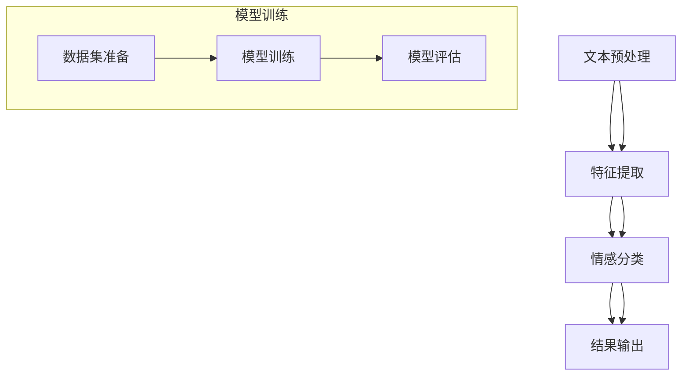

                 

关键词：情感识别、AI大模型、自然语言处理、神经网络、深度学习、情感分析

> 摘要：本文将探讨基于AI大模型的智能情感识别系统的研究背景、核心概念、算法原理、数学模型、实际应用场景以及未来展望。通过深入分析，本文旨在为读者提供对当前情感识别技术的全面了解和未来发展的深刻见解。

## 1. 背景介绍

情感识别作为自然语言处理（NLP）的一个重要分支，近年来在人工智能（AI）领域取得了显著进展。随着社交媒体的普及和用户生成内容的爆炸性增长，情感识别技术在商业、媒体、医疗等多个领域展现出巨大的应用价值。例如，通过分析社交媒体上的用户评论，企业可以了解消费者对产品的真实感受，进而优化产品和服务；在医疗领域，情感识别技术可以帮助分析患者的情绪状态，为心理健康提供支持。

然而，传统的情感识别方法通常依赖于手工构建的特征和规则，存在一定的局限性。随着深度学习和AI大模型的发展，基于端到端训练的智能情感识别系统逐渐成为研究热点。这类系统不仅能够自动提取语义特征，还能通过大规模数据的学习，实现更高准确度和泛化能力。

本文将围绕基于AI大模型的智能情感识别系统，介绍其核心概念、算法原理、数学模型以及实际应用，旨在为读者提供一个全面的视角，探讨这一领域的研究进展和应用前景。

## 2. 核心概念与联系

### 2.1 情感识别的定义

情感识别（Sentiment Recognition）是指从文本中自动检测出表达的情感类别，通常包括正面情感、负面情感和中性情感。情感识别技术的基本流程包括文本预处理、特征提取、情感分类和结果输出。其核心目标是理解文本中的情感倾向，为决策提供依据。

### 2.2 自然语言处理（NLP）

自然语言处理是人工智能的一个分支，旨在使计算机能够理解、解释和生成自然语言。在情感识别任务中，NLP技术用于处理和解析文本数据，提取语义信息。常见的NLP技术包括分词、词性标注、命名实体识别和句法分析等。

### 2.3 深度学习与神经网络

深度学习是机器学习的一个子领域，通过多层神经网络（Neural Networks）模拟人类大脑的信息处理过程。在情感识别任务中，深度学习模型能够自动提取文本中的高维特征，实现端到端的情感分类。神经网络结构包括卷积神经网络（CNN）、循环神经网络（RNN）和变换器（Transformer）等。

### 2.4 大模型的概念

大模型（Large Models）是指具有数十亿甚至数万亿参数的深度学习模型。这些模型通过在大规模数据集上训练，能够学习到丰富的语义知识，从而提高模型的泛化能力和表现。在情感识别领域，大模型如GPT-3、BERT等被广泛用于构建智能情感识别系统。

### 2.5 Mermaid 流程图

下面是情感识别系统的 Mermaid 流程图，展示了各核心组件及其联系。



## 3. 核心算法原理 & 具体操作步骤

### 3.1 算法原理概述

基于AI大模型的智能情感识别系统主要通过深度学习模型实现。其基本原理包括文本预处理、特征提取、情感分类和结果输出。以下是各步骤的详细说明。

### 3.2 算法步骤详解

#### 3.2.1 文本预处理

文本预处理是情感识别系统的第一步，主要任务包括去噪、分词、词性标注和去除停用词等。文本预处理的质量直接影响后续特征提取和情感分类的效果。

#### 3.2.2 特征提取

特征提取是深度学习模型的核心步骤。传统的特征提取方法如TF-IDF和Word2Vec已经难以满足大模型的需求。现代深度学习模型如BERT等通过端到端训练，自动学习文本中的高维特征表示。

#### 3.2.3 情感分类

情感分类是情感识别系统的核心任务。深度学习模型通过对特征进行分类，判断文本的情感倾向。常见的情感分类模型包括CNN、RNN和Transformer等。

#### 3.2.4 结果输出

结果输出是情感识别系统的最后一步，主要包括生成情感分析报告和可视化结果。这些结果可以为决策提供参考。

### 3.3 算法优缺点

#### 优点

1. 高准确度：基于AI大模型的情感识别系统通过大规模数据训练，能够自动学习到丰富的语义知识，提高情感分类的准确度。
2. 强泛化能力：大模型具有强大的泛化能力，能够适应不同的情感分类任务和领域。
3. 自动化程度高：深度学习模型可以自动化地完成文本预处理、特征提取和情感分类，减少人工干预。

#### 缺点

1. 资源消耗大：大模型训练需要大量的计算资源和时间。
2. 数据依赖性强：模型的性能高度依赖训练数据的质量和数量。
3. 难以解释：深度学习模型的工作原理较为复杂，难以解释和调试。

### 3.4 算法应用领域

基于AI大模型的智能情感识别系统在多个领域具有广泛的应用前景，包括但不限于：

1. 商业：通过情感识别，企业可以了解消费者对产品的情感倾向，优化产品和服务。
2. 媒体：新闻媒体可以通过情感识别，分析公众对新闻事件的态度，提高新闻报道的客观性。
3. 医疗：情感识别可以帮助分析患者的情绪状态，为心理健康提供支持。
4. 社交：社交媒体平台可以通过情感识别，过滤负面言论，营造良好的网络环境。

## 4. 数学模型和公式

### 4.1 数学模型构建

基于AI大模型的智能情感识别系统的数学模型主要包括输入层、隐藏层和输出层。以下是模型的基本结构：

$$
\text{输入层}: \text{X} = \{x_1, x_2, \ldots, x_n\}
$$

$$
\text{隐藏层}: \text{H} = \{h_1, h_2, \ldots, h_m\}
$$

$$
\text{输出层}: \text{Y} = \{y_1, y_2, \ldots, y_k\}
$$

### 4.2 公式推导过程

在构建数学模型时，我们需要推导损失函数、优化算法和训练策略等。

#### 损失函数

损失函数用于衡量模型预测结果与实际标签之间的差距。常见的损失函数包括交叉熵损失和均方误差损失。

$$
\text{交叉熵损失}: L(\theta) = -\sum_{i=1}^n y_i \log(p_i)
$$

$$
\text{均方误差损失}: L(\theta) = \frac{1}{2n} \sum_{i=1}^n (y_i - \hat{y}_i)^2
$$

#### 优化算法

优化算法用于调整模型参数，使损失函数最小化。常见的优化算法包括梯度下降和随机梯度下降。

$$
\theta_{t+1} = \theta_t - \alpha \nabla_{\theta_t} L(\theta_t)
$$

#### 训练策略

训练策略包括数据增强、批量大小、学习率和正则化等。数据增强可以通过添加噪声、旋转、缩放等操作，提高模型对数据的泛化能力。批量大小和学习率的选择会影响模型的收敛速度和性能。正则化可以通过引入惩罚项，防止模型过拟合。

### 4.3 案例分析与讲解

#### 案例一：商业应用

假设某电商网站希望通过情感识别技术分析消费者对某款新产品的评论。数据集包含10000条评论，每条评论的情感标签为正面、负面或中性。

1. 文本预处理：去除HTML标签、停用词和标点符号，进行分词和词性标注。
2. 特征提取：使用BERT模型提取文本特征。
3. 情感分类：使用CNN模型进行情感分类。
4. 结果输出：生成情感分析报告，包括正面、负面和中性情感的分布情况。

通过以上步骤，电商网站可以深入了解消费者的情感倾向，优化产品和服务。

#### 案例二：医疗应用

假设某医疗机构希望通过情感识别技术分析患者的情绪状态，为心理健康提供支持。数据集包含1000份病历记录，每份病历记录包括患者的基本信息、病历内容和医生诊断。

1. 文本预处理：去除无关信息，进行分词和词性标注。
2. 特征提取：使用LSTM模型提取文本特征。
3. 情感分类：使用SVM模型进行情感分类。
4. 结果输出：生成情绪分析报告，包括患者情绪状态的分布情况和建议。

通过以上步骤，医疗机构可以为患者提供更加个性化的心理健康服务。

## 5. 项目实践：代码实例和详细解释说明

### 5.1 开发环境搭建

1. 安装Python 3.8及以上版本。
2. 安装TensorFlow 2.4及以上版本。
3. 安装BERT模型和SVM模型所需的依赖库。

### 5.2 源代码详细实现

以下是一个基于BERT模型的情感识别项目实例：

```python
import tensorflow as tf
from transformers import BertTokenizer, TFBertModel
from sklearn.model_selection import train_test_split
from sklearn.svm import SVC
from sklearn.metrics import accuracy_score

# 数据集准备
data = [...]
labels = [...]

# 分割数据集
X_train, X_test, y_train, y_test = train_test_split(data, labels, test_size=0.2, random_state=42)

# 文本预处理
tokenizer = BertTokenizer.from_pretrained('bert-base-chinese')
train_encodings = tokenizer(X_train, padding=True, truncation=True, max_length=512)
test_encodings = tokenizer(X_test, padding=True, truncation=True, max_length=512)

# 模型搭建
model = TFBertModel.from_pretrained('bert-base-chinese')

# 训练模型
model.compile(optimizer='adam', loss='categorical_crossentropy', metrics=['accuracy'])
model.fit(train_encodings['input_ids'], tf.convert_to_tensor(y_train), epochs=3, batch_size=32)

# 评估模型
predictions = model.predict(test_encodings['input_ids'])
predicted_labels = tf.argmax(predictions, axis=1)
accuracy = accuracy_score(y_test, predicted_labels)
print(f'Accuracy: {accuracy}')

# 保存模型
model.save('emotion_recognition_model')
```

### 5.3 代码解读与分析

1. 数据集准备：加载并分割数据集，用于训练和测试。
2. 文本预处理：使用BERT分

