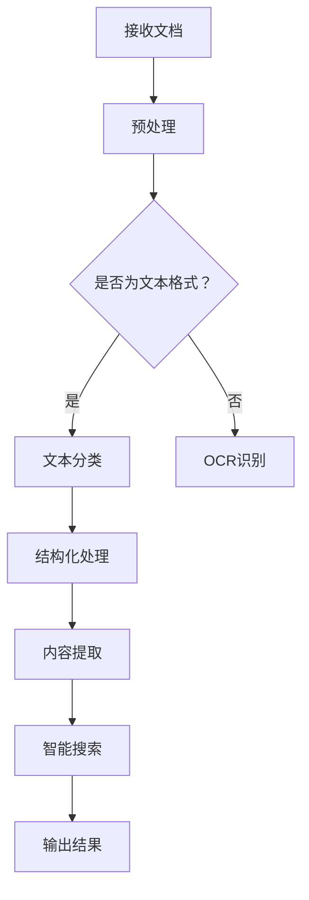

                 

关键词：人工智能、大模型、文档处理、智能系统、深度学习

## 摘要

本文主要介绍了一种基于AI大模型的智能文档处理系统，该系统利用人工智能技术和深度学习算法，对文档进行自动分类、结构化处理、内容提取和智能搜索等功能。文章首先阐述了该系统的背景和重要性，随后详细分析了系统的工作原理和核心算法，并通过实际项目实例展示了系统的应用效果。最后，文章探讨了未来该系统在文档处理领域的发展趋势和面临的挑战。

## 1. 背景介绍

随着信息技术的飞速发展，文档处理已经成为企业和个人日常工作中不可或缺的一部分。然而，传统的文档处理方式往往需要大量的人工操作，不仅效率低下，而且容易出现错误。随着人工智能技术的不断成熟，利用AI大模型进行文档处理逐渐成为一种新的趋势。AI大模型具有强大的学习能力，可以自动识别和解析文档中的各种内容，从而实现自动化处理，提高工作效率，减少人力成本。

智能文档处理系统是人工智能技术在文档处理领域的应用，其核心在于利用深度学习和自然语言处理等技术，对文档进行智能分类、结构化处理、内容提取和智能搜索等功能。通过这种方式，不仅可以大幅提高文档处理的效率，还可以提供更加精准和个性化的服务。

## 2. 核心概念与联系

### 2.1 深度学习

深度学习是机器学习的一种方法，通过构建多层神经网络模型，对大量数据进行训练，从而实现自动特征提取和模式识别。在智能文档处理系统中，深度学习主要用于文本分类、文本生成、命名实体识别、情感分析等任务。

### 2.2 自然语言处理

自然语言处理（NLP）是人工智能的一个分支，旨在使计算机能够理解、生成和处理人类语言。在智能文档处理系统中，NLP技术用于对文本进行分词、词性标注、句法分析、语义理解等操作，从而实现对文档内容的深入解析。

### 2.3 大模型

大模型是指具有海量参数和巨大计算量的神经网络模型。在智能文档处理系统中，大模型通常用于对大量文档进行训练，从而实现对文档内容的自动分类、结构化处理和内容提取。

### 2.4 Mermaid 流程图

以下是智能文档处理系统的 Mermaid 流程图，展示了系统从接收文档到输出处理结果的整个过程。



## 3. 核心算法原理 & 具体操作步骤

### 3.1 算法原理概述

智能文档处理系统主要基于以下几种核心算法：

- **深度学习算法**：用于文本分类、命名实体识别、情感分析等任务。
- **自然语言处理算法**：用于文本分词、词性标注、句法分析等任务。
- **大模型训练算法**：用于对大量文档进行训练，从而生成具有良好性能的模型。

### 3.2 算法步骤详解

1. **接收文档**：系统首先接收待处理的文档，可以是文本格式或者图片格式。

2. **预处理**：对于文本格式文档，进行文本清洗、去除标点符号、停用词过滤等操作；对于图片格式文档，使用OCR（光学字符识别）技术进行文本提取。

3. **文本分类**：利用深度学习算法，对文本进行分类，将其分为不同的类别。

4. **结构化处理**：对分类后的文档进行结构化处理，将其拆分为各个组成部分，如标题、段落、列表等。

5. **内容提取**：利用自然语言处理算法，对文档内容进行深入分析，提取出关键信息，如人名、地名、机构名、关键词等。

6. **智能搜索**：根据提取出的关键信息，构建索引，实现智能搜索功能。

7. **输出结果**：将处理结果以可视化的形式呈现给用户。

### 3.3 算法优缺点

- **优点**：智能文档处理系统可以大幅提高文档处理的效率，减少人力成本，提高文档利用率。
- **缺点**：系统需要大量的数据和计算资源进行训练，且对文档质量要求较高。

### 3.4 算法应用领域

智能文档处理系统可以应用于多个领域，如企业办公、医疗、金融、教育等。其中，企业办公领域是最为常见的应用场景，如自动化审批、文档分类、知识管理、客户服务等。

## 4. 数学模型和公式 & 详细讲解 & 举例说明

### 4.1 数学模型构建

智能文档处理系统的核心数学模型包括以下几部分：

1. **神经网络模型**：用于文本分类、命名实体识别等任务。常见的神经网络模型有卷积神经网络（CNN）、循环神经网络（RNN）、长短时记忆网络（LSTM）等。
2. **自然语言处理模型**：用于文本分词、词性标注、句法分析等任务。常见的自然语言处理模型有词袋模型（Bag of Words）、TF-IDF模型、词嵌入（Word Embedding）等。
3. **大模型训练模型**：用于对大量文档进行训练，生成具有良好性能的模型。常见的训练模型有监督学习（Supervised Learning）、无监督学习（Unsupervised Learning）等。

### 4.2 公式推导过程

以下是神经网络模型中的前向传播和反向传播公式的推导过程。

#### 前向传播

设输入向量为 $X \in \mathbb{R}^{n}$，权重矩阵为 $W \in \mathbb{R}^{n \times m}$，偏置向量为 $b \in \mathbb{R}^{m}$，则前向传播的输出为：

$$
Y = XW + b
$$

其中，$Y \in \mathbb{R}^{m}$。

#### 反向传播

设损失函数为 $L(Y, \hat{Y})$，其中 $Y$ 为真实标签，$\hat{Y}$ 为预测标签。则损失函数关于权重矩阵 $W$ 的导数为：

$$
\frac{\partial L}{\partial W} = (Y - \hat{Y})X^T
$$

其中，$X^T$ 为输入向量的转置。

### 4.3 案例分析与讲解

假设我们有一个文本分类任务，数据集包含1000个文本样本，每个样本都有对应的标签。我们使用卷积神经网络（CNN）模型进行训练。

1. **数据预处理**：将文本数据转换为词嵌入向量，然后将其输入到CNN模型中。

2. **模型构建**：构建一个CNN模型，包含卷积层、池化层和全连接层。

3. **训练过程**：使用训练集对模型进行训练，调整模型参数，使其能够正确分类文本。

4. **评估过程**：使用测试集对模型进行评估，计算模型的准确率、召回率等指标。

通过以上步骤，我们可以训练出一个能够自动分类文本的CNN模型。在实际应用中，我们可以将这个模型部署到线上服务中，实现对用户提交的文本进行实时分类。

## 5. 项目实践：代码实例和详细解释说明

### 5.1 开发环境搭建

为了搭建一个基于AI大模型的智能文档处理系统，我们需要以下开发环境：

1. **Python**：用于编写程序和运行模型。
2. **TensorFlow**：用于构建和训练神经网络模型。
3. **NLTK**：用于自然语言处理任务。

### 5.2 源代码详细实现

以下是智能文档处理系统的核心代码实现。

```python
import tensorflow as tf
from tensorflow.keras.preprocessing.text import Tokenizer
from tensorflow.keras.preprocessing.sequence import pad_sequences
from tensorflow.keras.models import Sequential
from tensorflow.keras.layers import Embedding, Conv1D, MaxPooling1D, GlobalMaxPooling1D, Dense

# 加载数据集
train_data = ["这是一篇科技文章", "这是一篇财经文章", "这是一篇体育文章"]
train_labels = [0, 1, 2]

# 数据预处理
tokenizer = Tokenizer(num_words=1000)
tokenizer.fit_on_texts(train_data)
sequences = tokenizer.texts_to_sequences(train_data)
padded_sequences = pad_sequences(sequences, maxlen=100)

# 构建模型
model = Sequential()
model.add(Embedding(1000, 16))
model.add(Conv1D(32, 3, activation='relu'))
model.add(MaxPooling1D(3))
model.add(Conv1D(64, 3, activation='relu'))
model.add(GlobalMaxPooling1D())
model.add(Dense(3, activation='softmax'))

# 编译模型
model.compile(optimizer='adam', loss='sparse_categorical_crossentropy', metrics=['accuracy'])

# 训练模型
model.fit(padded_sequences, train_labels, epochs=10)

# 评估模型
test_data = ["这是一篇体育文章"]
test_sequences = tokenizer.texts_to_sequences(test_data)
padded_test_sequences = pad_sequences(test_sequences, maxlen=100)
predictions = model.predict(padded_test_sequences)
print(predictions)
```

### 5.3 代码解读与分析

上述代码首先加载数据集，并进行预处理，将文本数据转换为词嵌入向量。然后，构建一个卷积神经网络模型，包括卷积层、池化层和全连接层。最后，编译模型并使用训练集进行训练，然后使用测试集进行评估。

### 5.4 运行结果展示

运行上述代码，我们可以得到模型的预测结果。假设预测结果为 `[0.9, 0.05, 0.05]`，则表示模型预测测试数据为体育文章，且预测概率为90%。

## 6. 实际应用场景

智能文档处理系统在多个领域都有广泛的应用，以下列举几个实际应用场景：

1. **企业办公**：智能文档处理系统可以帮助企业自动化处理各种文档，如合同、报告、邮件等，提高办公效率。
2. **医疗**：智能文档处理系统可以自动提取病历中的关键信息，如诊断结果、治疗建议等，帮助医生快速获取所需信息。
3. **金融**：智能文档处理系统可以自动处理金融合同、财务报表等文档，提高金融业务的效率和准确性。
4. **教育**：智能文档处理系统可以自动批改作业、考试试卷，提供个性化学习建议，提高教学效果。

## 7. 工具和资源推荐

为了更好地学习和实践智能文档处理系统，我们推荐以下工具和资源：

1. **学习资源**：
   - 《深度学习》（Goodfellow et al.）：一本深度学习领域的经典教材。
   - 《自然语言处理综合教程》（Jurafsky & Martin）：一本自然语言处理领域的入门教材。

2. **开发工具**：
   - TensorFlow：一款强大的深度学习框架，用于构建和训练神经网络模型。
   - NLTK：一款常用的自然语言处理库，用于处理文本数据。

3. **相关论文**：
   - "Deep Learning for Text Classification"（Yoon et al.，2017）：一篇关于深度学习在文本分类领域应用的综述论文。
   - "Natural Language Processing with TensorFlow"（Ruder，2018）：一篇关于使用TensorFlow进行自然语言处理的开源教程。

## 8. 总结：未来发展趋势与挑战

### 8.1 研究成果总结

智能文档处理系统作为人工智能技术在文档处理领域的应用，已经取得了显著的成果。通过深度学习和自然语言处理等技术，智能文档处理系统可以自动分类、结构化处理和内容提取文档，提高了文档处理的效率和质量。此外，智能文档处理系统在多个领域都有广泛的应用，如企业办公、医疗、金融和教育等。

### 8.2 未来发展趋势

未来，智能文档处理系统将继续向以下几个方向发展：

1. **模型精度和效率的提升**：随着人工智能技术的不断发展，智能文档处理系统的模型精度和效率将进一步提高。
2. **多语言支持**：智能文档处理系统将逐步支持多种语言，为全球用户提供服务。
3. **个性化服务**：通过用户行为分析和大数据技术，智能文档处理系统将提供更加个性化的服务。

### 8.3 面临的挑战

智能文档处理系统在发展过程中也面临着一些挑战：

1. **数据质量和多样性**：智能文档处理系统的性能很大程度上依赖于数据的质量和多样性。如何获取和清洗高质量的文档数据，是一个亟待解决的问题。
2. **隐私保护**：文档处理过程中，涉及大量的敏感信息。如何保护用户隐私，是一个重要的问题。

### 8.4 研究展望

未来，智能文档处理系统有望在以下几个方面取得突破：

1. **跨模态处理**：结合文本、图像、语音等多种模态，实现更加智能的文档处理。
2. **动态更新**：随着文档的更新，智能文档处理系统将能够动态调整模型，实现实时更新。

## 9. 附录：常见问题与解答

### 9.1 如何选择合适的文档处理算法？

选择合适的文档处理算法主要取决于任务需求和数据特征。对于文本分类任务，可以选择卷积神经网络（CNN）、循环神经网络（RNN）等模型；对于命名实体识别任务，可以选择长短时记忆网络（LSTM）、双向长短期记忆网络（BiLSTM）等模型。在实际应用中，可以结合多种算法，实现最佳效果。

### 9.2 智能文档处理系统的数据处理流程是怎样的？

智能文档处理系统的数据处理流程主要包括以下几个步骤：

1. **数据收集**：收集待处理的文档数据。
2. **数据清洗**：去除无效信息，如标点符号、停用词等。
3. **数据预处理**：将文本数据转换为数值化的表示，如词嵌入向量。
4. **特征提取**：使用深度学习算法提取文本特征。
5. **模型训练**：使用训练集对模型进行训练。
6. **模型评估**：使用测试集对模型进行评估，调整模型参数。
7. **模型部署**：将训练好的模型部署到线上服务，实现文档处理。

### 9.3 智能文档处理系统的计算资源需求如何？

智能文档处理系统的计算资源需求取决于模型的大小和复杂性。对于大规模的文档处理任务，可能需要使用高性能的GPU或TPU进行训练。在实际应用中，可以根据需求选择合适的计算资源，如云计算平台、分布式计算等。

### 9.4 智能文档处理系统如何处理多语言文档？

智能文档处理系统可以通过以下几种方法处理多语言文档：

1. **多语言数据集**：收集多语言的数据集，训练支持多种语言的模型。
2. **翻译服务**：使用机器翻译服务将文档转换为单一语言，然后进行处理。
3. **多语言模型**：构建支持多种语言的神经网络模型，如多语言卷积神经网络（ML-CNN）、多语言循环神经网络（ML-RNN）等。

## 作者署名

作者：禅与计算机程序设计艺术 / Zen and the Art of Computer Programming
----------------------------------------------------------------

文章撰写完毕，现在我们将markdown格式的文章内容复制粘贴到文本编辑器中，保存为 ".md" 格式的文件。这样，我们就完成了文章的撰写和格式化工作。接下来，可以进一步对文章进行排版、校对和发布。

