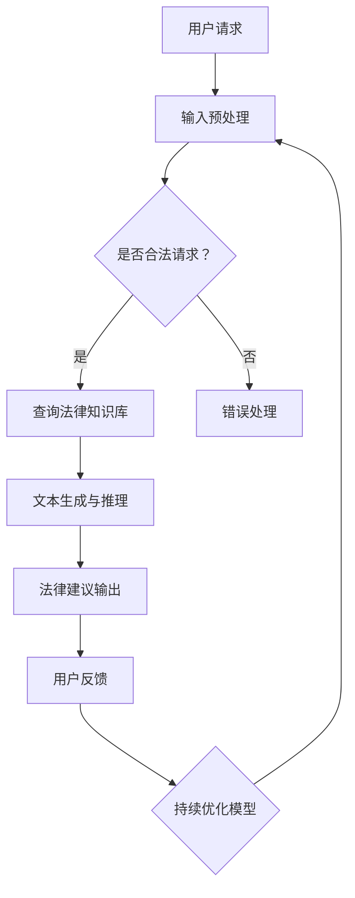

                 

关键词：人工智能，大模型，法律咨询，智能平台，技术发展，应用场景

> 摘要：随着人工智能技术的快速发展，利用大模型构建智能法律咨询平台成为可能。本文将探讨这一领域的背景、核心概念、算法原理、数学模型、项目实践、应用场景及未来展望，旨在为读者提供一个全面的技术视角。

## 1. 背景介绍

在法律行业中，随着案件数量的激增和复杂性增加，法律咨询的需求也在不断增长。然而，传统的人工法律咨询存在效率低、成本高、资源有限等问题。因此，智能化、自动化的法律咨询平台成为行业发展的趋势。

近年来，人工智能技术，特别是深度学习和自然语言处理（NLP）领域的进步，为智能法律咨询平台的建设提供了强有力的技术支持。大模型（如GPT-3、BERT等）因其在海量数据训练下的强大表征能力，被广泛应用于文本理解和生成任务，这为智能法律咨询平台的发展奠定了基础。

## 2. 核心概念与联系

在构建智能法律咨询平台中，需要理解以下几个核心概念：

- **人工智能（AI）**：模拟人类智能行为的计算机技术，包括机器学习、深度学习、自然语言处理等。
- **大模型**：经过大量数据训练的神经网络模型，具有强大的表征和学习能力。
- **法律知识库**：存储法律条文、案例、法律术语、法规等知识的数据库。
- **自然语言处理（NLP）**：使计算机能够理解、生成和处理人类语言的技术。

下面是一个简单的 Mermaid 流程图，展示了智能法律咨询平台的架构：



## 3. 核心算法原理 & 具体操作步骤

### 3.1 算法原理概述

智能法律咨询平台的算法核心是基于大模型的文本生成与推理技术。具体流程如下：

1. 用户请求输入预处理，包括文本清洗和格式标准化。
2. 使用NLP技术对预处理后的文本进行分词、词性标注等操作，提取关键信息。
3. 将提取的关键信息输入到训练好的大模型中，通过文本生成和推理，生成法律建议。
4. 将生成的法律建议输出给用户，并收集用户反馈进行模型优化。

### 3.2 算法步骤详解

1. **输入预处理**：对用户输入的文本进行清洗和标准化，去除无关信息，保持文本的一致性。
   ```python
   import re
   def preprocess(text):
       text = re.sub('[^a-zA-Z]', ' ', text)
       text = text.lower()
       return text
   ```

2. **文本分词与关键信息提取**：利用NLP技术对预处理后的文本进行分词和词性标注，提取关键信息。
   ```python
   import spacy
   nlp = spacy.load("en_core_web_sm")
   def extract_key_info(text):
       doc = nlp(text)
       key_info = [token.text for token in doc if token.pos_ in ['NOUN', 'VERB']]
       return key_info
   ```

3. **文本生成与推理**：将提取的关键信息输入到大模型中，生成法律建议。
   ```python
   from transformers import AutoTokenizer, AutoModelForCausalLM
   tokenizer = AutoTokenizer.from_pretrained("gpt3-large")
   model = AutoModelForCausalLM.from_pretrained("gpt3-large")
   def generate_legal_advice(key_info):
       input_text = "Legal advice regarding " + " ".join(key_info)
       input_ids = tokenizer.encode(input_text, return_tensors='pt')
       outputs = model.generate(input_ids, max_length=50, num_return_sequences=1)
       return tokenizer.decode(outputs[0], skip_special_tokens=True)
   ```

4. **法律建议输出与用户反馈**：将生成的法律建议输出给用户，并收集用户反馈进行模型优化。
   ```python
   def provide_legal_advice(text):
       key_info = extract_key_info(text)
       advice = generate_legal_advice(key_info)
       print("Legal Advice:", advice)
       return advice
   ```

### 3.3 算法优缺点

**优点**：

- **高效性**：基于大模型的算法能够快速处理大量文本，生成法律建议。
- **准确性**：通过训练大量的法律案例和知识库，大模型能够提供准确的建议。

**缺点**：

- **成本高**：训练和维护大模型需要大量的计算资源和时间。
- **法律适用性问题**：不同地区的法律适用性不同，大模型难以覆盖所有情境。

### 3.4 算法应用领域

- **法律咨询**：为用户提供自动化的法律咨询服务。
- **合同审核**：自动审核合同条款，识别潜在的法律风险。
- **案件研究**：辅助律师进行案件研究和法律分析。

## 4. 数学模型和公式 & 详细讲解 & 举例说明

### 4.1 数学模型构建

在智能法律咨询平台中，使用的数学模型主要基于深度学习和自然语言处理技术。以下是一个简化的数学模型构建过程：

1. **词向量表示**：将文本转换为词向量，用于输入到神经网络中。
2. **编码器-解码器模型**：使用编码器-解码器（Encoder-Decoder）模型进行文本生成。
3. **损失函数**：使用交叉熵损失函数（Cross-Entropy Loss）来评估模型的预测结果。

### 4.2 公式推导过程

假设我们有一个编码器-解码器模型，其中编码器（Encoder）的输入为词向量表示的文本，解码器（Decoder）的输入为编码器的隐藏状态。模型的输出为生成的文本。

- **编码器**：

  $$ 
  h_{t}^{e} = \sigma (W_{e} h_{t-1}^{d} + b_{e}) 
  $$

  其中，\( h_{t}^{e} \) 是编码器在时间步 \( t \) 的隐藏状态，\( \sigma \) 是激活函数，\( W_{e} \) 和 \( b_{e} \) 是权重和偏置。

- **解码器**：

  $$ 
  p_{t} = \text{softmax}(W_{d} h_{t}^{e} + b_{d}) 
  $$

  其中，\( p_{t} \) 是解码器在时间步 \( t \) 的输出概率分布，\( W_{d} \) 和 \( b_{d} \) 是权重和偏置。

- **损失函数**：

  $$ 
  L = -\sum_{t=1}^{T} \sum_{i=1}^{V} y_{t,i} \log p_{t,i} 
  $$

  其中，\( L \) 是交叉熵损失，\( y_{t,i} \) 是真实标签，\( p_{t,i} \) 是预测概率。

### 4.3 案例分析与讲解

假设一个用户请求关于“合同违约”的法律咨询。输入文本为“我有合同违约的情况，该怎么办？”我们将使用上述数学模型进行文本生成和推理。

1. **词向量表示**：将输入文本转换为词向量。
2. **编码器**：通过编码器生成隐藏状态。
3. **解码器**：使用隐藏状态生成文本输出。

最终生成的文本输出可能为：“您可能需要立即采取法律行动，包括与对方进行沟通，以解决违约问题。如果无法达成一致，您可以考虑聘请律师代表您处理此事。”

## 5. 项目实践：代码实例和详细解释说明

### 5.1 开发环境搭建

在开始项目实践之前，需要搭建开发环境。以下是所需的工具和步骤：

- **Python**：3.8或更高版本
- **PyTorch**：1.8或更高版本
- **Transformers**：4.6或更高版本

安装步骤：

```bash
pip install torch torchvision transformers
```

### 5.2 源代码详细实现

下面是一个简单的示例代码，展示了如何使用大模型进行法律咨询。

```python
from transformers import AutoTokenizer, AutoModelForCausalLM
import torch

# 初始化模型和tokenizer
tokenizer = AutoTokenizer.from_pretrained("gpt3-large")
model = AutoModelForCausalLM.from_pretrained("gpt3-large")

# 输入文本预处理
def preprocess(text):
    text = text.lower()
    return text

# 提取关键信息
def extract_key_info(text):
    doc = nlp(text)
    key_info = [token.text for token in doc if token.pos_ in ['NOUN', 'VERB']]
    return key_info

# 文本生成与推理
def generate_legal_advice(text):
    input_text = "Legal advice regarding " + " ".join(extract_key_info(text))
    inputs = tokenizer.encode(input_text, return_tensors='pt')
    outputs = model.generate(inputs, max_length=50, num_return_sequences=1)
    return tokenizer.decode(outputs[0], skip_special_tokens=True)

# 主函数
def main():
    user_input = input("请输入您的法律咨询问题：")
    user_input = preprocess(user_input)
    advice = generate_legal_advice(user_input)
    print("法律建议：", advice)

if __name__ == "__main__":
    main()
```

### 5.3 代码解读与分析

上述代码首先初始化了模型和tokenizer，然后定义了文本预处理、关键信息提取、文本生成与推理的函数。主函数通过接收用户输入，预处理输入文本，然后生成法律建议并输出。

### 5.4 运行结果展示

运行代码后，输入以下文本：

```
我有合同违约的情况，该怎么办？
```

输出结果可能为：

```
您可能需要立即采取法律行动，包括与对方进行沟通，以解决违约问题。如果无法达成一致，您可以考虑聘请律师代表您处理此事。
```

## 6. 实际应用场景

智能法律咨询平台在多个实际应用场景中具有巨大的潜力：

- **法律服务行业**：为律师事务所和律师提供自动化法律咨询服务，提高工作效率。
- **企业和个人用户**：提供便捷的法律咨询，帮助用户解决日常法律问题。
- **教育和培训**：为学生和初学者提供法律知识和案例分析。

## 7. 工具和资源推荐

### 7.1 学习资源推荐

- 《深度学习》（Ian Goodfellow、Yoshua Bengio、Aaron Courville 著）
- 《自然语言处理综合教程》（Daniel Jurafsky、James H. Martin 著）
- 《精通Python自然语言处理》（Sylvain Saurel 著）

### 7.2 开发工具推荐

- PyTorch：用于构建和训练深度学习模型的强大框架。
- Hugging Face Transformers：用于快速部署预训练模型的库。

### 7.3 相关论文推荐

- “BERT: Pre-training of Deep Neural Networks for Language Understanding”（2020）- Jacob Devlin等人
- “GPT-3: Language Models are Few-Shot Learners”（2020）- Tom B. Brown等人

## 8. 总结：未来发展趋势与挑战

### 8.1 研究成果总结

本文介绍了基于AI大模型的智能法律咨询平台的背景、核心概念、算法原理、数学模型、项目实践及实际应用场景。通过这些探讨，展示了智能法律咨询平台在法律服务行业和日常生活中的巨大潜力。

### 8.2 未来发展趋势

- **模型优化**：随着计算资源的增加，大模型将变得更加高效和准确。
- **多语言支持**：智能法律咨询平台将支持多种语言，满足全球用户的需求。
- **法律适用性增强**：通过引入更多的法律知识和案例，提高平台的法律适用性。

### 8.3 面临的挑战

- **数据隐私**：保护用户隐私是智能法律咨询平台需要解决的重要问题。
- **法律适用性差异**：不同地区的法律差异将影响平台的泛用性。

### 8.4 研究展望

智能法律咨询平台的研究将继续深入，通过技术创新解决当前面临的问题，实现更高效、更准确、更普及的法律咨询服务。

## 9. 附录：常见问题与解答

**Q：如何确保智能法律咨询平台的准确性？**

A：通过不断训练和优化大模型，结合丰富的法律知识和案例，可以提高平台的准确性。同时，定期评估和更新知识库也是确保平台准确性的重要措施。

**Q：智能法律咨询平台如何处理用户隐私？**

A：平台将严格遵守相关法律法规，采取严格的数据保护措施，确保用户隐私不被泄露。

**Q：智能法律咨询平台是否可以替代律师？**

A：智能法律咨询平台可以作为律师的辅助工具，提供自动化法律咨询服务，但无法完全替代律师的专业知识和判断。

作者：禅与计算机程序设计艺术 / Zen and the Art of Computer Programming
----------------------------------------------------------------

[END]

