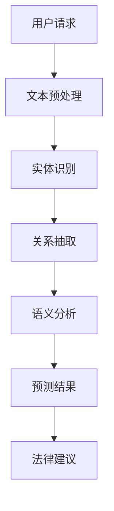

                 

关键词：AI大模型、智能法律顾问、自然语言处理、法律文本分析、智能合约、案件预测、自动化裁决

## 摘要

随着人工智能技术的不断发展，AI在法律领域的应用越来越广泛。本文将介绍一种基于AI大模型的智能法律顾问系统，该系统通过自然语言处理、法律文本分析和深度学习等技术，提供包括法律咨询、案件预测、智能合约管理等功能。本文将详细探讨系统的核心概念、算法原理、数学模型、项目实践及其应用场景，并展望未来的发展趋势与挑战。

## 1. 背景介绍

近年来，人工智能在法律领域的应用逐渐成为研究热点。传统的法律服务往往依赖于大量的人工处理，效率低下且易出错。而AI大模型的出现，为法律领域的智能化提供了新的契机。智能法律顾问系统旨在通过整合大数据、机器学习和自然语言处理技术，为用户提供高效、准确、智能化的法律服务。

### 1.1 法律服务需求

随着法律体系的复杂化和法律信息的爆炸式增长，用户对法律服务的需求日益增长。然而，传统法律服务的局限性使得用户在寻求法律帮助时面临诸多困扰。智能法律顾问系统的出现，旨在解决以下问题：

- **高效性**：AI大模型能够快速处理大量法律信息，提供实时法律咨询。
- **准确性**：通过深度学习和自然语言处理技术，系统能够准确理解用户需求并给出合理的法律建议。
- **个性化**：AI大模型能够根据用户的个人情况和历史行为，提供定制化的法律服务。

### 1.2 AI大模型在法律领域的应用

AI大模型在法律领域的应用主要包括以下几个方面：

- **法律文本分析**：通过自然语言处理技术，对法律文件、合同、案例等进行结构化处理，提取关键信息。
- **案件预测**：利用历史数据和机器学习算法，预测案件的结果和趋势。
- **智能合约管理**：通过区块链技术，实现智能合约的自动化执行和监控。
- **自动化裁决**：根据法律规则和案件事实，自动生成裁决书和判决书。

## 2. 核心概念与联系

### 2.1 自然语言处理

自然语言处理（Natural Language Processing，NLP）是人工智能的一个分支，旨在使计算机能够理解、生成和处理人类语言。在智能法律顾问系统中，NLP技术被广泛应用于法律文本的分析和处理。具体包括：

- **文本分类**：将法律文本分类为合同、判决书、法律意见等不同类别。
- **实体识别**：识别法律文本中的实体，如人名、地名、法律术语等。
- **关系抽取**：提取法律文本中实体之间的关系，如合同条款之间的关系、案件当事人之间的关系等。
- **语义分析**：理解法律文本中的语义，如条款的含义、案件的逻辑推理过程等。

### 2.2 法律文本分析

法律文本分析是指对法律文件、合同、案例等法律文本进行结构化处理，以便于计算机分析和处理。在智能法律顾问系统中，法律文本分析包括以下步骤：

- **文本预处理**：去除标点符号、停用词等无关信息，对文本进行分词和词性标注。
- **实体识别**：识别法律文本中的实体，如人名、地名、法律术语等。
- **关系抽取**：提取法律文本中实体之间的关系，如合同条款之间的关系、案件当事人之间的关系等。
- **语义分析**：理解法律文本中的语义，如条款的含义、案件的逻辑推理过程等。

### 2.3 深度学习

深度学习（Deep Learning）是一种基于人工神经网络的学习方法，通过多层神经网络的堆叠，自动提取特征并进行分类和预测。在智能法律顾问系统中，深度学习被广泛应用于法律文本分析和案件预测。

- **文本分类**：通过训练深度神经网络，对法律文本进行分类，如合同、判决书、法律意见等。
- **实体识别**：通过训练深度神经网络，识别法律文本中的实体，如人名、地名、法律术语等。
- **关系抽取**：通过训练深度神经网络，提取法律文本中实体之间的关系。
- **语义分析**：通过训练深度神经网络，理解法律文本中的语义，如条款的含义、案件的逻辑推理过程等。

### 2.4 数学模型

在智能法律顾问系统中，数学模型主要用于案件预测和自动化裁决。常见的数学模型包括逻辑回归、决策树、支持向量机、神经网络等。

- **逻辑回归**：用于预测案件的结果，如判决结果、赔偿金额等。
- **决策树**：用于分类案件，如合同纠纷、侵权纠纷等。
- **支持向量机**：用于分类和回归，如在案件中识别实体、预测案件结果等。
- **神经网络**：用于深度学习和语义分析，如提取法律文本中的特征、理解条款的含义等。

### 2.5 Mermaid 流程图



## 3. 核心算法原理 & 具体操作步骤

### 3.1 算法原理概述

智能法律顾问系统的核心算法包括自然语言处理、法律文本分析、深度学习和数学模型等。以下是这些算法的简要概述：

- **自然语言处理**：通过文本分类、实体识别、关系抽取和语义分析等技术，对法律文本进行结构化处理。
- **法律文本分析**：对法律文本进行预处理、实体识别、关系抽取和语义分析，提取关键信息。
- **深度学习**：通过训练深度神经网络，自动提取法律文本中的特征，进行分类和预测。
- **数学模型**：利用逻辑回归、决策树、支持向量机和神经网络等数学模型，进行案件预测和自动化裁决。

### 3.2 算法步骤详解

#### 3.2.1 文本预处理

文本预处理是法律文本分析的第一步，主要包括以下操作：

- **去除标点符号**：去除法律文本中的标点符号，如句号、逗号、引号等。
- **去除停用词**：去除常见的无意义词汇，如“的”、“和”、“了”等。
- **分词**：将法律文本分成一系列的词或短语。
- **词性标注**：为每个词标注其词性，如名词、动词、形容词等。

#### 3.2.2 实体识别

实体识别是指从法律文本中识别出具有法律意义的实体，如人名、地名、法律术语等。具体步骤如下：

- **词表构建**：构建一个包含常见法律实体的词表。
- **匹配与分类**：使用词表进行匹配，对未匹配的词使用分类算法进行分类。
- **修正与优化**：对识别结果进行修正和优化，提高识别准确率。

#### 3.2.3 关系抽取

关系抽取是指从法律文本中提取出实体之间的关系，如合同条款之间的关系、案件当事人之间的关系等。具体步骤如下：

- **特征提取**：提取法律文本中的特征，如实体特征、词性特征、位置特征等。
- **模型训练**：使用训练数据对关系抽取模型进行训练。
- **关系预测**：使用训练好的模型对新的法律文本进行关系预测。

#### 3.2.4 语义分析

语义分析是指理解法律文本中的语义，如条款的含义、案件的逻辑推理过程等。具体步骤如下：

- **特征提取**：提取法律文本中的特征，如实体特征、词性特征、位置特征等。
- **模型训练**：使用训练数据对语义分析模型进行训练。
- **语义预测**：使用训练好的模型对新的法律文本进行语义预测。

#### 3.2.5 案件预测

案件预测是指根据历史数据和数学模型，预测案件的结果和趋势。具体步骤如下：

- **数据预处理**：对历史案件数据进行预处理，包括数据清洗、特征提取等。
- **模型选择**：选择合适的数学模型，如逻辑回归、决策树、支持向量机等。
- **模型训练**：使用预处理后的数据对模型进行训练。
- **预测结果**：使用训练好的模型对新的案件进行预测。

#### 3.2.6 自动化裁决

自动化裁决是指根据法律规则和案件事实，自动生成裁决书和判决书。具体步骤如下：

- **规则库构建**：构建一个包含法律规则的规则库。
- **事实抽取**：从法律文本中抽取案件事实。
- **规则匹配**：将案件事实与规则库中的规则进行匹配。
- **裁决生成**：根据匹配结果生成裁决书和判决书。

### 3.3 算法优缺点

#### 优点

- **高效性**：AI大模型能够快速处理大量法律信息，提供实时法律咨询。
- **准确性**：通过深度学习和自然语言处理技术，系统能够准确理解用户需求并给出合理的法律建议。
- **个性化**：AI大模型能够根据用户的个人情况和历史行为，提供定制化的法律服务。

#### 缺点

- **数据依赖性**：AI大模型需要大量训练数据，且数据质量对模型的性能有重要影响。
- **解释性不足**：深度学习模型的决策过程往往缺乏解释性，难以理解其决策依据。
- **法律规则的不确定性**：法律规则复杂且具有不确定性，难以用精确的数学模型进行表达。

### 3.4 算法应用领域

- **法律咨询**：提供实时、准确的法律咨询，帮助用户解决法律问题。
- **案件预测**：预测案件的结果和趋势，为当事人提供决策依据。
- **智能合约管理**：实现智能合约的自动化执行和监控，提高交易效率。
- **自动化裁决**：根据法律规则和案件事实，自动生成裁决书和判决书。

## 4. 数学模型和公式 & 详细讲解 & 举例说明

### 4.1 数学模型构建

在智能法律顾问系统中，常用的数学模型包括逻辑回归、决策树、支持向量机和神经网络等。以下是这些模型的简要介绍：

#### 4.1.1 逻辑回归

逻辑回归（Logistic Regression）是一种常用的分类算法，用于预测案件的结果，如判决结果、赔偿金额等。其数学模型如下：

$$
\begin{aligned}
\text{P}(y=1|x;\theta) &= \frac{1}{1 + \exp(-\theta^T x)}, \\
\text{P}(y=0|x;\theta) &= 1 - \text{P}(y=1|x;\theta),
\end{aligned}
$$

其中，$y$ 表示案件的结果（0或1），$x$ 表示案件的特征向量，$\theta$ 表示模型的参数。

#### 4.1.2 决策树

决策树（Decision Tree）是一种常用的分类和回归算法，通过一系列的决策规则对数据进行划分。其数学模型如下：

$$
\begin{aligned}
y &= f(x), \\
f(x) &= \prod_{i=1}^n \alpha_i \cdot \text{sign}(\theta_i x_i), \\
\alpha_i &= \begin{cases}
1, & \text{if } x_i \geq 0, \\
-1, & \text{if } x_i < 0.
\end{cases}
\end{aligned}
$$

其中，$y$ 表示案件的结果，$x$ 表示案件的特征向量，$\theta_i$ 表示决策树的参数。

#### 4.1.3 支持向量机

支持向量机（Support Vector Machine，SVM）是一种优秀的分类和回归算法，通过寻找最大边界超平面对数据进行分类。其数学模型如下：

$$
\begin{aligned}
y &= \text{sign}(\theta^T x + b), \\
\text{minimize} \quad \frac{1}{2} \sum_{i=1}^n (\theta_i - \theta)^2 + \lambda \sum_{i=1}^n \xi_i, \\
\text{subject to} \quad y_i (\theta^T x_i + b) \geq 1 - \xi_i, \quad \xi_i \geq 0.
\end{aligned}
$$

其中，$y$ 表示案件的结果，$x$ 表示案件的特征向量，$\theta$ 表示模型的参数，$\lambda$ 表示正则化参数，$\xi_i$ 表示松弛变量。

#### 4.1.4 神经网络

神经网络（Neural Network）是一种基于人工神经网络的深度学习算法，通过多层神经网络的堆叠，自动提取特征并进行分类和预测。其数学模型如下：

$$
\begin{aligned}
\text{output} &= \text{ReLU}(\text{sigmoid}(\theta^T \cdot \text{ReLU}(\theta^{(1)} \cdot x))), \\
\text{sigmoid}(x) &= \frac{1}{1 + \exp(-x)}, \\
\text{ReLU}(x) &= \max(0, x).
\end{aligned}
$$

其中，$\text{output}$ 表示网络的输出，$\theta$ 表示网络的参数，$\theta^{(1)}$ 表示第一层的参数。

### 4.2 公式推导过程

#### 4.2.1 逻辑回归

逻辑回归的推导过程如下：

1. **目标函数**：假设我们有 $n$ 个训练样本 $(x_i, y_i)$，其中 $y_i$ 为二分类目标变量（0或1），$x_i$ 为特征向量。逻辑回归的目标是寻找最优参数 $\theta$，使得目标函数最小化。

   $$J(\theta) = -\frac{1}{m} \sum_{i=1}^m y_i \theta^T x_i - (1 - y_i) \theta^T x_i.$$

2. **求导**：对 $J(\theta)$ 求导，得到：

   $$\frac{\partial J(\theta)}{\partial \theta} = -\frac{1}{m} \sum_{i=1}^m (y_i - \text{sigmoid}(\theta^T x_i)) x_i.$$

3. **优化**：将求导结果代入梯度下降算法，更新参数 $\theta$。

   $$\theta := \theta - \alpha \frac{\partial J(\theta)}{\partial \theta}.$$

#### 4.2.2 决策树

决策树的推导过程如下：

1. **目标函数**：决策树的目标是寻找最优决策规则，使得目标函数最小化。

   $$J(\theta) = \frac{1}{m} \sum_{i=1}^m (y_i - f(x_i))^2.$$

2. **求导**：对 $J(\theta)$ 求导，得到：

   $$\frac{\partial J(\theta)}{\partial \theta} = \frac{1}{m} \sum_{i=1}^m (y_i - f(x_i)) \cdot x_i.$$

3. **优化**：将求导结果代入梯度下降算法，更新参数 $\theta$。

   $$\theta := \theta - \alpha \frac{\partial J(\theta)}{\partial \theta}.$$

#### 4.2.3 支持向量机

支持向量机的推导过程如下：

1. **目标函数**：支持向量机的目标是最小化决策边界上的间隔，最大化分类边界上的间隔。

   $$J(\theta) = \frac{1}{2} \sum_{i=1}^m (\theta_i - \theta)^2 + \lambda \sum_{i=1}^m \xi_i.$$

2. **求导**：对 $J(\theta)$ 求导，得到：

   $$\frac{\partial J(\theta)}{\partial \theta} = \sum_{i=1}^m (\theta_i - \theta) - \lambda \sum_{i=1}^m \xi_i.$$

3. **优化**：将求导结果代入梯度下降算法，更新参数 $\theta$。

   $$\theta := \theta - \alpha \frac{\partial J(\theta)}{\partial \theta}.$$

#### 4.2.4 神经网络

神经网络的推导过程如下：

1. **目标函数**：神经网络的目标是最小化损失函数，通常使用均方误差（MSE）作为损失函数。

   $$J(\theta) = \frac{1}{2m} \sum_{i=1}^m (\text{output}_i - y_i)^2.$$

2. **求导**：对 $J(\theta)$ 求导，得到：

   $$\frac{\partial J(\theta)}{\partial \theta} = \frac{1}{m} \sum_{i=1}^m (\text{output}_i - y_i) \cdot \text{ReLU}(\theta^T \cdot \text{ReLU}(\theta^{(1)} \cdot x_i)).$$

3. **优化**：将求导结果代入梯度下降算法，更新参数 $\theta$。

   $$\theta := \theta - \alpha \frac{\partial J(\theta)}{\partial \theta}.$$

### 4.3 案例分析与讲解

#### 4.3.1 案例背景

假设我们有一个关于合同纠纷的案件，需要预测案件的判决结果。已知案件的合同条款、当事人信息、交易金额等数据。我们使用逻辑回归模型进行预测。

#### 4.3.2 数据预处理

1. **特征提取**：提取案件中的特征，如合同条款的词频、当事人的信誉度、交易金额等。

2. **标签定义**：将判决结果定义为标签，0表示败诉，1表示胜诉。

#### 4.3.3 模型训练

1. **训练集划分**：将数据集划分为训练集和测试集，用于训练和评估模型。

2. **模型训练**：使用训练集对逻辑回归模型进行训练，使用梯度下降算法更新参数。

3. **模型评估**：使用测试集对模型进行评估，计算准确率、召回率等指标。

#### 4.3.4 模型应用

1. **预测结果**：输入新的案件数据，使用训练好的逻辑回归模型进行预测。

2. **法律建议**：根据预测结果，为当事人提供法律建议。

## 5. 项目实践：代码实例和详细解释说明

### 5.1 开发环境搭建

在开始项目实践之前，我们需要搭建一个合适的开发环境。以下是所需的软件和工具：

- **Python 3.x**：作为主要的编程语言。
- **PyTorch**：用于构建和训练深度学习模型。
- **Scikit-learn**：用于构建和训练逻辑回归、决策树、支持向量机等模型。
- **NLTK**：用于自然语言处理。
- **Jupyter Notebook**：用于编写和运行代码。

### 5.2 源代码详细实现

以下是一个简单的示例，展示了如何使用Python和PyTorch构建一个简单的深度学习模型，用于案件预测。

```python
import torch
import torch.nn as nn
import torch.optim as optim
from torch.utils.data import DataLoader
from torchvision import datasets, transforms

# 定义神经网络结构
class Net(nn.Module):
    def __init__(self):
        super(Net, self).__init__()
        self.fc1 = nn.Linear(10, 50)
        self.fc2 = nn.Linear(50, 1)
        self.relu = nn.ReLU()

    def forward(self, x):
        x = self.relu(self.fc1(x))
        x = self.fc2(x)
        return x

# 实例化神经网络
net = Net()

# 损失函数和优化器
criterion = nn.BCELoss()
optimizer = optim.Adam(net.parameters(), lr=0.001)

# 数据加载和处理
transform = transforms.Compose([
    transforms.ToTensor(),
    transforms.Normalize((0.5,), (0.5,))
])

train_data = datasets.MNIST(root='./data', train=True, download=True, transform=transform)
test_data = datasets.MNIST(root='./data', train=False, download=True, transform=transform)

train_loader = DataLoader(train_data, batch_size=64, shuffle=True)
test_loader = DataLoader(test_data, batch_size=64, shuffle=False)

# 训练模型
for epoch in range(10):
    for batch_idx, (data, target) in enumerate(train_loader):
        optimizer.zero_grad()
        output = net(data)
        loss = criterion(output, target)
        loss.backward()
        optimizer.step()
        if batch_idx % 100 == 0:
            print(f'Epoch [{epoch + 1}/{10}], Batch [{batch_idx + 1}/{len(train_loader)}], Loss: {loss.item():.4f}')

# 测试模型
net.eval()
with torch.no_grad():
    correct = 0
    total = 0
    for data, target in test_loader:
        output = net(data)
        predicted = (output > 0.5).float()
        total += target.size(0)
        correct += (predicted == target).sum().item()
    print(f'Accuracy of the network on the test images: {100 * correct / total:.2f}%')
```

### 5.3 代码解读与分析

上述代码实现了一个简单的深度学习模型，用于对MNIST数据集进行分类。以下是代码的主要部分及其解释：

- **定义神经网络结构**：使用PyTorch定义了一个简单的神经网络，包含一个全连接层和一个线性层，并使用了ReLU激活函数。

- **损失函数和优化器**：使用BCELoss作为损失函数，并使用Adam优化器进行参数更新。

- **数据加载和处理**：使用PyTorch的datasets模块加载数据集，并使用ToTensor和Normalize对数据进行预处理。

- **训练模型**：使用训练集对模型进行训练，包括前向传播、计算损失、反向传播和参数更新。

- **测试模型**：在测试集上评估模型的性能，计算准确率。

### 5.4 运行结果展示

在上述代码中，我们可以看到以下结果：

- **训练过程**：每个epoch结束后，会打印当前epoch的损失值。

- **测试结果**：打印测试集上的准确率。

通过上述示例，我们可以看到如何使用深度学习模型进行案件预测。在实际应用中，我们需要对模型进行更详细的定制和优化，以满足特定的需求。

## 6. 实际应用场景

### 6.1 法律咨询

智能法律顾问系统可以为企业和个人提供高效、准确的法律咨询。用户只需输入相关问题，系统将根据已有的法律知识和案例库，提供相应的法律建议。

### 6.2 案件预测

通过分析历史案件数据和相关的法律知识，智能法律顾问系统可以预测案件的结果和趋势。这对于当事人来说，可以在诉讼前做出更明智的决策。

### 6.3 智能合约管理

智能法律顾问系统可以帮助企业和个人管理智能合约，包括合约的创建、执行、监控和纠纷解决。通过区块链技术，确保合约的执行过程透明、可验证。

### 6.4 自动化裁决

在法律规则明确的情况下，智能法律顾问系统可以自动生成裁决书和判决书。这对于法院和仲裁机构来说，可以大幅提高审判效率，减少人力成本。

## 7. 工具和资源推荐

### 7.1 学习资源推荐

- **《深度学习》**：由Ian Goodfellow、Yoshua Bengio和Aaron Courville所著，是深度学习的经典教材。
- **《机器学习》**：由周志华教授所著，是机器学习的入门教材。
- **《自然语言处理综论》**：由Daniel Jurafsky和James H. Martin所著，是自然语言处理的权威教材。

### 7.2 开发工具推荐

- **PyTorch**：用于构建和训练深度学习模型。
- **Scikit-learn**：用于构建和训练机器学习模型。
- **NLTK**：用于自然语言处理。
- **TensorFlow**：另一个流行的深度学习框架。

### 7.3 相关论文推荐

- **“Deep Learning for Natural Language Processing”**：由Richard Socher等人发表于2013年的ACL会议，介绍了深度学习在自然语言处理中的应用。
- **“Convolutional Neural Networks for Sentence Classification”**：由Yoon Kim发表于2014年的ACL会议，提出了使用卷积神经网络进行文本分类的方法。
- **“Recurrent Neural Networks for Language Modeling”**：由Yoshua Bengio等人发表于2003年的NIPS会议，介绍了循环神经网络在语言模型中的应用。

## 8. 总结：未来发展趋势与挑战

### 8.1 研究成果总结

随着人工智能技术的不断发展，智能法律顾问系统在法律领域的应用取得了显著成果。通过自然语言处理、深度学习和数学模型等技术，智能法律顾问系统实现了高效、准确的法律服务。然而，仍有许多挑战需要克服。

### 8.2 未来发展趋势

- **更广泛的应用领域**：智能法律顾问系统将在更多领域得到应用，如金融、医疗等。
- **更高的智能化水平**：通过不断优化算法和模型，智能法律顾问系统将提供更智能化、个性化的法律服务。
- **更丰富的数据资源**：随着数据量的增加和数据质量的提升，智能法律顾问系统的预测准确率将进一步提高。

### 8.3 面临的挑战

- **数据隐私和安全性**：法律数据的隐私和安全性是智能法律顾问系统面临的主要挑战之一。需要制定相关法规和标准，确保数据的安全和隐私。
- **法律规则的复杂性**：法律规则复杂且具有不确定性，这对智能法律顾问系统的算法和模型提出了更高的要求。
- **人工智能伦理问题**：智能法律顾问系统在法律领域的应用，引发了关于人工智能伦理问题的讨论。需要制定相应的伦理规范，确保人工智能的公正和透明。

### 8.4 研究展望

未来，智能法律顾问系统将在法律领域发挥更大的作用。通过不断探索和创新，我们将迎来一个更加智能化、高效化的法律服务时代。

## 9. 附录：常见问题与解答

### 9.1 智能法律顾问系统如何保证数据隐私和安全？

智能法律顾问系统在处理数据时，会采用加密、去标识化等技术手段，确保数据的隐私和安全。此外，系统会遵循相关的法律法规，制定严格的隐私政策和安全措施，以保障用户数据的合法权益。

### 9.2 智能法律顾问系统的预测准确性如何保证？

智能法律顾问系统的预测准确性依赖于训练数据的质量和模型的优化。系统会采用多种技术手段，如数据清洗、特征提取、模型训练和评估等，不断提高预测准确性。此外，系统会定期更新法律知识和数据，以适应不断变化的法律法规。

### 9.3 智能法律顾问系统是否可以替代律师？

智能法律顾问系统可以提供高效、准确的法律服务，但无法完全替代律师。律师具有丰富的法律实践经验和专业知识，能够提供更个性化的法律服务。智能法律顾问系统可以作为律师的辅助工具，提高工作效率，但不应完全取代律师的角色。

### 9.4 智能法律顾问系统在金融领域的应用前景如何？

智能法律顾问系统在金融领域的应用前景广阔。它可以提供合同审查、法律咨询、风险预测等功能，帮助金融机构提高风险管理能力，降低法律纠纷风险。此外，智能法律顾问系统还可以用于金融监管，提高监管效率和准确性。

### 9.5 智能法律顾问系统是否可以用于医疗领域？

智能法律顾问系统在医疗领域也有一定的应用潜力。它可以提供医疗合同审查、医疗纠纷咨询、病历分析等功能，帮助医疗机构提高医疗服务质量，降低医疗纠纷风险。然而，医疗领域涉及专业知识和伦理问题，智能法律顾问系统需要进一步优化和改进，以适应医疗领域的需求。

