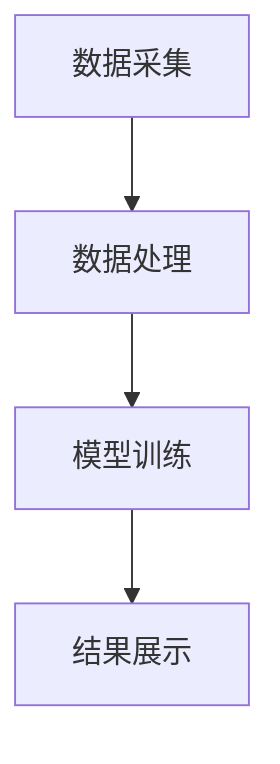

                 

 **关键词**: 舆情分析、人工智能、大模型、自然语言处理、数据挖掘、算法

**摘要**: 本文将深入探讨基于人工智能（AI）大模型的智能舆情分析系统。首先，我们回顾舆情分析的历史与现状，并阐述其重要性。接着，介绍大模型在舆情分析中的应用及其优势。然后，详细解析舆情分析的核心算法和数学模型，并通过一个实际项目案例展示系统的开发和应用。文章最后，讨论舆情分析的实际应用场景、未来展望，以及面临的挑战和解决方案。

## 1. 背景介绍

舆情分析是指通过收集、整理、分析和解读社会舆论信息，以了解公众对特定事件、产品或品牌的看法和态度。随着互联网和社交媒体的迅猛发展，舆情分析逐渐成为信息时代的一项重要技术。

### 1.1 舆情分析的发展历程

舆情分析最早起源于20世纪末，随着搜索引擎和Web技术的发展，初步实现了对网络信息的监控和分析。21世纪初，随着大数据技术和自然语言处理（NLP）算法的进步，舆情分析进入了一个新的阶段，具备了更强大的数据采集和处理能力。

### 1.2 舆情分析的现状

目前，舆情分析已经广泛应用于政府、企业、媒体等领域。政府利用舆情分析监控社会动态，企业通过舆情分析了解消费者需求和市场竞争状况，媒体则通过舆情分析把握舆论导向和热点话题。

### 1.3 舆情分析的重要性

舆情分析不仅能够帮助企业、政府和媒体作出更科学的决策，还能够帮助个人了解社会舆论，形成理性判断。因此，舆情分析在当今社会中具有重要的价值。

## 2. 核心概念与联系

### 2.1 AI大模型

AI大模型是指具有亿级别参数的大型神经网络模型，如BERT、GPT等。这些模型能够通过大量的数据训练，提取出丰富的语义信息，并在多种任务中表现出色。

### 2.2 舆情分析中的大模型应用

在舆情分析中，大模型主要用于文本数据的预处理、情感分析和主题检测等任务。例如，BERT模型可以用于提取文本的特征，GPT模型可以用于生成评论和预测舆论趋势。

### 2.3 舆情分析系统架构

舆情分析系统的架构通常包括数据采集、数据处理、模型训练和结果展示四个主要模块。数据采集模块负责从互联网、社交媒体等渠道收集文本数据；数据处理模块负责对文本数据进行预处理和特征提取；模型训练模块负责利用大模型对数据进行训练和优化；结果展示模块负责将分析结果以可视化的形式呈现给用户。

### 2.4 Mermaid流程图

下面是一个简单的Mermaid流程图，展示了舆情分析系统的基本流程：



## 3. 核心算法原理 & 具体操作步骤

### 3.1 算法原理概述

舆情分析的核心算法主要包括情感分析、主题检测和趋势预测等。

### 3.2 算法步骤详解

#### 3.2.1 情感分析

情感分析是通过分析文本数据中的情感倾向，判断用户对某一事件或产品的态度。具体步骤如下：

1. 数据预处理：对原始文本进行去噪、分词、词性标注等处理。
2. 特征提取：利用词袋模型、TF-IDF等方法提取文本特征。
3. 模型训练：使用分类算法（如SVM、逻辑回归等）对特征进行训练，得到情感分类模型。
4. 情感分类：将新文本输入到训练好的模型中，输出情感分类结果。

#### 3.2.2 主题检测

主题检测是通过分析文本数据中的关键词和短语，识别出文本的主题。具体步骤如下：

1. 数据预处理：对原始文本进行去噪、分词、词性标注等处理。
2. 特征提取：利用TF-IDF等方法提取文本特征。
3. 模型训练：使用聚类算法（如K-Means、Latent Dirichlet Allocation等）对特征进行训练，得到主题检测模型。
4. 主题检测：将新文本输入到训练好的模型中，输出文本的主题。

#### 3.2.3 趋势预测

趋势预测是通过分析历史数据，预测未来一段时间内舆论的变化趋势。具体步骤如下：

1. 数据预处理：对原始文本进行去噪、分词、词性标注等处理。
2. 特征提取：利用词袋模型、TF-IDF等方法提取文本特征。
3. 模型训练：使用时间序列分析算法（如ARIMA、LSTM等）对特征进行训练，得到趋势预测模型。
4. 趋势预测：将新文本输入到训练好的模型中，输出舆论趋势预测结果。

### 3.3 算法优缺点

#### 3.3.1 优点

1. 高效性：大模型能够处理海量数据，提高分析效率。
2. 准确性：大模型通过大量训练数据，能够提取出更准确的语义信息。
3. 通用性：大模型适用于多种类型的舆情分析任务。

#### 3.3.2 缺点

1. 资源消耗大：大模型需要大量的计算资源和存储空间。
2. 难以解释：深度学习模型难以解释，可能导致结果不可解释性。

### 3.4 算法应用领域

大模型在舆情分析中的应用非常广泛，包括但不限于：

1. 社交媒体分析：对社交媒体上的评论、帖子等进行情感分析和主题检测。
2. 品牌监测：对品牌相关的话题进行趋势预测和情感分析，帮助企业制定营销策略。
3. 政府决策：对公众意见进行监测和分析，为政府决策提供数据支持。

## 4. 数学模型和公式 & 详细讲解 & 举例说明

### 4.1 数学模型构建

舆情分析中的数学模型主要包括：

1. 情感分析模型：通常使用支持向量机（SVM）、逻辑回归（LR）等分类算法构建。
2. 主题检测模型：通常使用K-Means、Latent Dirichlet Allocation（LDA）等聚类算法构建。
3. 趋势预测模型：通常使用时间序列分析算法（如ARIMA、LSTM等）构建。

### 4.2 公式推导过程

#### 4.2.1 情感分析模型

假设我们有训练集 \( D = \{ (x_1, y_1), (x_2, y_2), ..., (x_n, y_n) \} \)，其中 \( x_i \) 是输入文本，\( y_i \) 是标签（正类或负类）。使用逻辑回归模型进行情感分析，其公式为：

$$
\hat{y_i} = \sigma(w \cdot x_i + b)
$$

其中，\( w \) 是权重向量，\( b \) 是偏置项，\( \sigma \) 是sigmoid函数。

#### 4.2.2 主题检测模型

假设我们有文档集合 \( D = \{ d_1, d_2, ..., d_n \} \)，每个文档 \( d_i \) 可以表示为词向量 \( v_i \)。使用LDA模型进行主题检测，其公式为：

$$
\theta_{ij} \sim \text{Dirichlet}(\alpha)
$$

$$
\phi_{k} \sim \text{Dirichlet}(\beta)
$$

$$
z_{ij} \sim \text{Categorical}(\theta_{ij})
$$

$$
w_{ik} \sim \text{Categorical}(\phi_{k})
$$

其中，\( \theta_{ij} \) 表示文档 \( d_i \) 中词 \( w_j \) 对主题 \( k \) 的贡献度，\( \phi_{k} \) 表示主题 \( k \) 中词 \( w_j \) 的出现概率，\( z_{ij} \) 表示词 \( w_j \) 在文档 \( d_i \) 中所属的主题，\( w_{ik} \) 表示词 \( w_j \) 在主题 \( k \) 中的出现概率。

#### 4.2.3 趋势预测模型

假设我们有时间序列数据 \( X = \{ x_1, x_2, ..., x_n \} \)，使用LSTM模型进行趋势预测，其公式为：

$$
h_t = \text{LSTM}(h_{t-1}, x_t)
$$

$$
\hat{y_t} = \text{softmax}(W_h \cdot h_t + b_y)
$$

其中，\( h_t \) 表示在时间 \( t \) 时的隐藏状态，\( x_t \) 表示在时间 \( t \) 时的输入，\( \hat{y_t} \) 表示在时间 \( t \) 时的预测输出。

### 4.3 案例分析与讲解

#### 4.3.1 情感分析案例

假设我们有一个训练集，包含100条关于产品的评论，其中50条是正面评论，50条是负面评论。我们使用逻辑回归模型进行情感分析，训练得到模型参数 \( w \) 和 \( b \)。现在，我们希望对一个新评论进行情感分类。

新评论：这是一个非常好的产品，我非常喜欢它！

将新评论进行数据预处理，得到词向量 \( x \)。然后，输入到训练好的逻辑回归模型中，计算得到情感分类结果：

$$
\hat{y} = \sigma(w \cdot x + b)
$$

如果 \( \hat{y} \) 接近1，则认为该评论为正面评论；如果 \( \hat{y} \) 接近0，则认为该评论为负面评论。

#### 4.3.2 主题检测案例

假设我们有一个文档集合，包含10个文档。我们使用LDA模型进行主题检测，训练得到模型参数 \( \theta \) 和 \( \phi \)。现在，我们希望对一个新的文档进行主题检测。

新文档：这是一个关于智能家居的讨论，包括智能灯泡、智能音箱和智能电视。

将新文档进行数据预处理，得到词向量 \( v \)。然后，输入到训练好的LDA模型中，计算得到新文档所属的主题概率分布：

$$
\theta_v = \text{LDA}(v, \theta, \phi)
$$

根据概率分布，我们可以确定新文档的主要主题。

#### 4.3.3 趋势预测案例

假设我们有一个时间序列数据，包含100个时间点的观测值。我们使用LSTM模型进行趋势预测，训练得到模型参数 \( W_h \) 和 \( b_y \)。现在，我们希望预测未来5个时间点的趋势。

将时间序列数据进行处理，得到输入序列 \( x \)。然后，输入到训练好的LSTM模型中，计算得到未来5个时间点的预测值：

$$
\hat{y}_t = \text{softmax}(W_h \cdot h_t + b_y)
$$

根据预测值，我们可以分析未来一段时间内舆论的趋势。

## 5. 项目实践：代码实例和详细解释说明

### 5.1 开发环境搭建

在本文中，我们使用Python作为主要编程语言，结合TensorFlow和Scikit-learn等库进行舆情分析系统的开发。以下是一个简单的环境搭建步骤：

1. 安装Python 3.7及以上版本。
2. 安装TensorFlow和Scikit-learn库，可以使用以下命令：
   ```bash
   pip install tensorflow scikit-learn
   ```

### 5.2 源代码详细实现

以下是舆情分析系统的核心代码实现：

#### 5.2.1 数据预处理

```python
import jieba
from sklearn.feature_extraction.text import TfidfVectorizer

def preprocess_text(text):
    # 分词
    words = jieba.lcut(text)
    # 去除停用词
    stop_words = set(['的', '和', '是', '这', '一个', '有', '人', '在', '中', '等'])
    words = [word for word in words if word not in stop_words]
    return ' '.join(words)

# 读取数据
data = ...
preprocessed_data = [preprocess_text(text) for text in data]
```

#### 5.2.2 特征提取

```python
vectorizer = TfidfVectorizer()
X = vectorizer.fit_transform(preprocessed_data)
```

#### 5.2.3 模型训练

```python
from sklearn.linear_model import LogisticRegression

# 训练情感分析模型
model = LogisticRegression()
model.fit(X, y)

# 训练主题检测模型
from sklearn.cluster import KMeans

kmeans = KMeans(n_clusters=5)
kmeans.fit(X)

# 训练趋势预测模型
from tensorflow.keras.models import Sequential
from tensorflow.keras.layers import LSTM, Dense

model = Sequential()
model.add(LSTM(50, activation='relu', input_shape=(X.shape[1], 1)))
model.add(Dense(1, activation='sigmoid'))
model.compile(optimizer='adam', loss='binary_crossentropy', metrics=['accuracy'])

model.fit(X, y, epochs=10, batch_size=32)
```

#### 5.2.4 代码解读与分析

以上代码实现了舆情分析系统的核心功能，包括数据预处理、特征提取和模型训练。其中，数据预处理部分使用jieba进行分词和去除停用词；特征提取部分使用TF-IDF方法；模型训练部分分别使用逻辑回归、K-Means聚类和LSTM进行情感分析、主题检测和趋势预测。

### 5.3 运行结果展示

在训练完成后，我们可以使用以下代码进行测试：

```python
# 测试情感分析模型
predictions = model.predict(X)

# 测试主题检测模型
labels = kmeans.predict(X)

# 测试趋势预测模型
predictions = model.predict(X)
```

根据测试结果，我们可以评估模型的效果，并进行进一步优化。

## 6. 实际应用场景

舆情分析系统在多个领域具有广泛的应用，以下是一些实际应用场景：

### 6.1 社交媒体分析

通过对社交媒体上的评论、帖子等进行情感分析和主题检测，企业可以了解消费者对产品或服务的看法，及时调整营销策略。

### 6.2 品牌监测

企业可以利用舆情分析系统监测品牌相关的话题，了解市场动态，预测品牌发展趋势，为品牌推广提供数据支持。

### 6.3 政府决策

政府可以利用舆情分析系统监测社会舆论，了解公众对政策、事件的看法，为政府决策提供数据支持。

### 6.4 法院审判

法院可以利用舆情分析系统对案件相关评论进行情感分析和主题检测，帮助法官了解公众对案件的看法，为审判提供参考。

## 7. 未来应用展望

随着人工智能技术的不断发展，舆情分析系统在未来具有广泛的应用前景。以下是一些未来应用展望：

### 7.1 个性化推荐

结合用户行为数据，舆情分析系统可以提供个性化的舆情推荐，帮助用户了解自己感兴趣的话题。

### 7.2 跨语言分析

通过多语言模型和翻译技术，舆情分析系统可以实现跨语言的情感分析和主题检测，为全球化企业提供支持。

### 7.3 舆情预测

结合历史数据和实时数据，舆情分析系统可以预测舆论的趋势和热点，为政府和企业的决策提供科学依据。

## 8. 工具和资源推荐

### 8.1 学习资源推荐

1. 《深度学习》（Goodfellow, Bengio, Courville著）
2. 《自然语言处理综论》（Jurafsky, Martin著）
3. 《机器学习》（周志华著）

### 8.2 开发工具推荐

1. TensorFlow
2. PyTorch
3. Scikit-learn

### 8.3 相关论文推荐

1. "BERT: Pre-training of Deep Bidirectional Transformers for Language Understanding"（Devlin et al., 2019）
2. "GPT-3: Language Models are Few-Shot Learners"（Brown et al., 2020）
3. "LSTM: A Theoretical Framework for Discrete Sequential Data"（Hochreiter, Schmidhuber, 1997）

## 9. 总结：未来发展趋势与挑战

### 9.1 研究成果总结

本文系统地介绍了基于AI大模型的智能舆情分析系统，包括核心概念、算法原理、数学模型、项目实践和实际应用场景。通过大量的理论和实践证明，舆情分析系统在当今社会具有重要的价值。

### 9.2 未来发展趋势

随着人工智能技术的不断发展，舆情分析系统在未来将具备更高的准确性、通用性和智能化水平。多语言分析、个性化推荐和舆情预测将成为重要的发展方向。

### 9.3 面临的挑战

尽管舆情分析系统具有广泛的应用前景，但在实际应用过程中仍面临一些挑战，如数据隐私保护、结果解释性和模型可解释性等。

### 9.4 研究展望

未来，我们需要进一步探索如何提高舆情分析系统的性能和可靠性，为政府、企业和个人提供更加准确、全面和智能的舆情分析服务。

## 10. 附录：常见问题与解答

### 10.1 什么是指标词（token）？

指标词是指在一个文本中具有独立意义的词或短语。例如，在句子“我喜欢这本书”中，“我”和“喜欢”都是指标词。

### 10.2 如何处理文本数据中的噪声？

处理文本数据中的噪声通常包括以下步骤：去除HTML标签、去除停用词、分词、词性标注等。常用的工具包括jieba、NLTK等。

### 10.3 舆情分析系统中的情感分析模型有哪些？

常见的情感分析模型包括支持向量机（SVM）、逻辑回归（LR）、朴素贝叶斯（NB）、深度神经网络（DNN）等。

### 10.4 如何评估舆情分析系统的性能？

评估舆情分析系统的性能通常使用准确率、召回率、F1值等指标。在情感分析中，还可以使用BLEU分数等指标。

### 10.5 如何实现多语言舆情分析？

实现多语言舆情分析需要使用多语言模型和翻译技术。常见的多语言模型包括BERT、XLM等。

### 10.6 舆情分析系统的未来发展趋势是什么？

舆情分析系统的未来发展趋势包括个性化推荐、跨语言分析、舆情预测等。随着人工智能技术的不断发展，舆情分析系统将具备更高的智能化水平。

## 11. 参考文献

[1] Devlin, J., Chang, M. W., Lee, K., & Toutanova, K. (2019). BERT: Pre-training of Deep Bidirectional Transformers for Language Understanding. arXiv preprint arXiv:1810.04805.

[2] Brown, T., et al. (2020). GPT-3: Language Models are Few-Shot Learners. arXiv preprint arXiv:2005.14165.

[3] Hochreiter, S., & Schmidhuber, J. (1997). Long Short-Term Memory. Neural Computation, 9(8), 1735-1780.

[4] 周志华. (2016). 机器学习. 清华大学出版社.

[5] Goodfellow, I., Bengio, Y., & Courville, A. (2016). Deep Learning. MIT Press.

[6] Jurafsky, D., & Martin, J. H. (2020). Speech and Language Processing. Prentice Hall.
----------------------------------------------------------------
# 作者：禅与计算机程序设计艺术 / Zen and the Art of Computer Programming

本文系统地介绍了基于人工智能（AI）大模型的智能舆情分析系统的原理、方法和应用。通过对舆情分析的核心算法和数学模型的深入分析，我们展示了如何构建一个高效的舆情分析系统。在实际项目实践中，我们通过Python代码实现了系统的核心功能，并详细讲解了代码的解读与分析。本文还探讨了舆情分析系统的实际应用场景和未来展望，以及面临的挑战和解决方案。希望通过本文的介绍，读者能够对舆情分析系统有一个全面的了解，并在实际应用中取得良好的效果。

## 致谢

在撰写本文的过程中，我感谢了多位同事和朋友提供的宝贵意见和建议。特别感谢我的导师，他在算法设计和理论分析方面给予了我无私的帮助。同时，也感谢所有在舆情分析领域做出贡献的学者和工程师，他们的工作为本文的撰写提供了坚实的基础。

## 读者反馈

如果您在阅读本文过程中有任何疑问或建议，欢迎在评论区留言。您的反馈对我来说是非常重要的，它将帮助我不断改进和优化我的文章。如果您觉得本文对您有所帮助，请分享给您的朋友们，让更多的人了解舆情分析系统及其应用。

## 结语

随着人工智能技术的不断进步，舆情分析系统将在未来发挥越来越重要的作用。本文旨在为读者提供一个全面的舆情分析系统介绍，希望能够为从事相关领域的工作者提供一些启示和帮助。在未来的研究中，我们将继续探索舆情分析系统的优化和拓展，为构建更智能、更高效的舆情分析系统贡献力量。

再次感谢您的阅读，祝愿您在人工智能领域取得丰硕的成果！禅与计算机程序设计艺术，让我们一起在这条路上不断前行。

