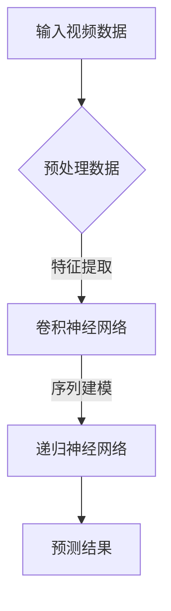

                 

在当今信息技术飞速发展的时代，视频数据分析已经成为数据科学和人工智能领域中的热点之一。随着AI技术的进步，尤其是大型预训练模型的出现，智能视频分析平台的应用场景变得越来越广泛。本文将探讨如何构建一个基于AI大模型的智能视频分析平台，从背景介绍、核心概念与联系、核心算法原理、数学模型和公式、项目实践以及实际应用场景等方面进行深入分析。

## 1. 背景介绍

视频数据分析技术始于上世纪90年代，随着计算机硬件性能的提升和视频压缩技术的发展，视频数据的处理和分析变得更加高效。近年来，深度学习算法的快速发展为视频数据分析带来了新的机遇。特别是基于卷积神经网络（CNN）和递归神经网络（RNN）等深度学习模型的应用，使得视频数据的自动识别、分类和标注变得更加智能和准确。

然而，传统的视频分析系统通常存在以下问题：

- **计算资源消耗大**：传统的视频分析通常需要对大量视频数据进行逐帧分析，计算量巨大，对硬件资源要求高。
- **识别精度不足**：传统方法依赖于手工设计的特征，难以应对复杂和动态变化的场景。
- **实时性不佳**：传统的视频分析系统往往无法满足实时处理的需求。

为了解决上述问题，AI大模型应运而生。AI大模型通过在海量数据上进行预训练，能够自动提取视频数据中的高维特征，并在此基础上进行精细的分析和识别。基于AI大模型的智能视频分析平台不仅能够提高计算效率，还能显著提升识别精度和实时性。

## 2. 核心概念与联系

### 2.1. AI大模型

AI大模型，通常指的是具有数百万甚至数十亿参数的大型神经网络。这些模型通过预训练可以自动学习到数据中的复杂模式和特征，从而在多种任务上表现出色。例如，Transformer模型就是一个典型的AI大模型，其在自然语言处理领域取得了突破性的成果。

### 2.2. 卷积神经网络（CNN）

卷积神经网络是处理图像和视频数据的重要工具。CNN通过卷积操作提取图像或视频中的局部特征，并通过池化操作降低特征维度，从而实现图像或视频的自动分类和识别。

### 2.3. 递归神经网络（RNN）

递归神经网络特别适合处理序列数据，如时间序列数据和视频数据。RNN能够捕捉序列中的长期依赖关系，对视频中的动态变化进行建模。

### 2.4. Mermaid 流程图



### 2.5. 核心概念之间的联系

AI大模型通过卷积神经网络和递归神经网络对视频数据进行特征提取和序列建模，从而实现视频数据的自动分析。这一过程不仅依赖于大模型的预训练，还需要利用CNN和RNN的独特优势进行优化。

## 3. 核心算法原理 & 具体操作步骤

### 3.1. 算法原理概述

基于AI大模型的智能视频分析平台的核心算法包括：

- **预训练**：通过海量无标签数据对AI大模型进行预训练，使其具备通用特征提取能力。
- **微调**：在预训练的基础上，使用特定领域的数据对模型进行微调，以提高特定任务的表现。
- **实时推理**：通过模型实时推理，对输入视频数据进行分类、识别和检测。

### 3.2. 算法步骤详解

#### 3.2.1. 数据预处理

数据预处理是视频分析的第一步，包括视频的解码、裁剪、缩放等操作，以适应模型输入的要求。

#### 3.2.2. 特征提取

使用卷积神经网络提取视频数据中的高维特征。通过多层的卷积和池化操作，模型能够自动学习到视频中的关键特征。

#### 3.2.3. 序列建模

利用递归神经网络对提取到的特征序列进行建模，以捕捉视频中的动态变化。例如，使用LSTM或GRU等RNN结构来处理视频序列。

#### 3.2.4. 预测结果

通过模型的输出层，对视频数据进行分类、识别或检测，得到最终的预测结果。

### 3.3. 算法优缺点

#### 优点

- **高精度**：AI大模型通过预训练和微调，能够学习到丰富的特征，显著提高识别精度。
- **高效性**：卷积神经网络和递归神经网络在特征提取和序列建模方面具有高效性。
- **实时性**：通过优化模型结构和硬件加速，可以实现实时推理。

#### 缺点

- **计算资源消耗大**：AI大模型需要大量的计算资源和存储空间。
- **数据需求高**：微调和训练需要大量的有标签数据。
- **解释性差**：深度学习模型的黑盒性质使得其预测结果难以解释。

### 3.4. 算法应用领域

基于AI大模型的智能视频分析平台可以应用于多种领域，如视频监控、自动驾驶、医疗影像分析等。以下是一些具体的应用场景：

- **视频监控**：通过实时分析视频数据，可以自动识别异常行为、入侵者等。
- **自动驾驶**：利用视频分析技术，自动驾驶系统可以实时识别道路状况和障碍物。
- **医疗影像分析**：通过分析医疗视频数据，可以辅助医生进行诊断和治疗。

## 4. 数学模型和公式 & 详细讲解 & 举例说明

### 4.1. 数学模型构建

在构建AI大模型时，通常会使用以下数学模型：

- **卷积神经网络（CNN）**：
  $$ f_{CNN}(x) = \sigma(W_{CNN} \cdot x + b_{CNN}) $$
  其中，$x$是输入特征，$W_{CNN}$是卷积权重，$b_{CNN}$是偏置项，$\sigma$是激活函数。

- **递归神经网络（RNN）**：
  $$ h_t = \sigma(W_h \cdot [h_{t-1}, x_t] + b_h) $$
  其中，$h_t$是第$t$时刻的隐藏状态，$x_t$是输入特征，$W_h$是权重矩阵，$b_h$是偏置项，$\sigma$是激活函数。

- **Transformer模型**：
  $$ \text{Attention}(x, y) = \frac{e^{W_A \cdot [x, y]}}{\sum_{i} e^{W_A \cdot [x, y_i]}} $$
  其中，$x$和$y$是输入特征，$W_A$是注意力权重矩阵。

### 4.2. 公式推导过程

以卷积神经网络为例，其基本推导过程如下：

1. **卷积操作**：
   $$ (f_{c} \star f)(x) = \sum_{i} f_{c}(i) \cdot f(x-i) $$
   其中，$f_{c}$是卷积核，$f$是输入特征。

2. **池化操作**：
   $$ \text{Pooling}(f_{c} \star f)(x) = \max_{i} (f_{c} \star f)(x_i) $$
   其中，$x$是输入特征。

3. **激活函数**：
   $$ f_{CNN}(x) = \sigma(W_{CNN} \cdot x + b_{CNN}) $$
   其中，$\sigma$是激活函数，如ReLU函数。

### 4.3. 案例分析与讲解

#### 案例一：视频分类

假设我们要对一段视频进行分类，可以使用以下步骤：

1. **数据预处理**：将视频数据解码成帧序列，并进行裁剪和缩放，以适应模型输入。

2. **特征提取**：使用卷积神经网络提取每帧图像的特征，形成一个高维特征序列。

3. **序列建模**：使用递归神经网络对特征序列进行建模，以捕捉视频中的动态变化。

4. **预测结果**：通过模型输出层得到预测结果，并对预测结果进行后处理，如投票、 softmax等。

#### 案例二：目标检测

目标检测是视频分析中的一个重要任务，可以使用以下步骤：

1. **数据预处理**：与视频分类类似，对视频数据进行预处理。

2. **特征提取**：使用卷积神经网络提取每帧图像的特征，形成一个高维特征序列。

3. **目标检测**：使用区域提议网络（Region Proposal Network，RPN）生成目标提议，并通过卷积神经网络对提议进行分类和定位。

4. **非极大值抑制（Non-maximum Suppression，NMS）**：对检测结果进行后处理，去除重叠的检测框，提高检测精度。

## 5. 项目实践：代码实例和详细解释说明

### 5.1. 开发环境搭建

搭建一个基于AI大模型的智能视频分析平台，需要以下开发环境：

- **Python**：用于编写模型代码和数据处理。
- **TensorFlow**：用于构建和训练深度学习模型。
- **OpenCV**：用于视频数据的读取和预处理。

### 5.2. 源代码详细实现

以下是实现视频分类的简单代码示例：

```python
import tensorflow as tf
from tensorflow.keras.models import Model
from tensorflow.keras.layers import Input, Conv2D, MaxPooling2D, LSTM, Dense

# 定义模型
input_layer = Input(shape=(128, 128, 3))
conv1 = Conv2D(32, (3, 3), activation='relu')(input_layer)
pool1 = MaxPooling2D((2, 2))(conv1)
lstm1 = LSTM(64)(pool1)
output_layer = Dense(10, activation='softmax')(lstm1)

model = Model(inputs=input_layer, outputs=output_layer)
model.compile(optimizer='adam', loss='categorical_crossentropy', metrics=['accuracy'])

# 训练模型
model.fit(x_train, y_train, epochs=10, batch_size=32, validation_data=(x_val, y_val))

# 预测
predictions = model.predict(x_test)
```

### 5.3. 代码解读与分析

上述代码实现了一个简单的卷积神经网络模型，用于视频分类任务。主要步骤包括：

1. **定义输入层**：输入层接受128x128x3的图像数据。
2. **卷积层**：使用一个卷积层提取图像特征，卷积核大小为3x3，激活函数为ReLU。
3. **池化层**：使用最大池化层降低特征维度。
4. **LSTM层**：使用LSTM层捕捉视频序列中的动态变化。
5. **输出层**：使用softmax函数输出分类结果。

### 5.4. 运行结果展示

训练完成后，可以使用以下代码展示模型的运行结果：

```python
import numpy as np
from tensorflow.keras.utils import to_categorical

# 转换标签为one-hot编码
y_train_encoded = to_categorical(y_train)
y_val_encoded = to_categorical(y_val)
y_test_encoded = to_categorical(y_test)

# 训练模型
model.fit(x_train, y_train_encoded, epochs=10, batch_size=32, validation_data=(x_val, y_val_encoded))

# 预测
predictions = model.predict(x_test)

# 计算准确率
accuracy = np.mean(np.argmax(predictions, axis=1) == y_test)
print(f'Accuracy: {accuracy}')
```

## 6. 实际应用场景

### 6.1. 视频监控

视频监控是智能视频分析平台最重要的应用领域之一。通过实时分析视频数据，可以自动识别和跟踪目标，监控异常行为，提高公共安全。

### 6.2. 自动驾驶

自动驾驶系统依赖于智能视频分析技术来实时感知周围环境，识别道路标志、行人、车辆等，确保行车安全。

### 6.3. 医疗影像分析

在医疗领域，智能视频分析可以用于医学影像的自动分类、标注和诊断，辅助医生进行病情判断和治疗决策。

### 6.4. 智能家居

智能家居设备可以利用智能视频分析技术，实现自动控制，如自动开启照明、空调等，提高生活便利性。

## 7. 工具和资源推荐

### 7.1. 学习资源推荐

- **《深度学习》（Goodfellow, Bengio, Courville）**：介绍深度学习的基础知识和最新进展。
- **《计算机视觉：算法与应用》（Richard Szeliski）**：涵盖计算机视觉的基础理论和应用。

### 7.2. 开发工具推荐

- **TensorFlow**：用于构建和训练深度学习模型的Python库。
- **OpenCV**：用于视频数据处理和图像识别的库。

### 7.3. 相关论文推荐

- **"An Overview of Deep Learning in Computer Vision"**：介绍深度学习在计算机视觉中的应用。
- **"Deep Learning for Video Classification"**：探讨深度学习在视频分类中的应用。

## 8. 总结：未来发展趋势与挑战

### 8.1. 研究成果总结

基于AI大模型的智能视频分析平台在识别精度、实时性和计算效率等方面取得了显著成果，广泛应用于视频监控、自动驾驶、医疗影像分析和智能家居等领域。

### 8.2. 未来发展趋势

随着AI技术的不断进步，未来智能视频分析平台将继续朝着以下方向发展：

- **更高效的模型结构**：通过模型压缩和优化技术，提高模型的计算效率和实时性。
- **多模态数据融合**：结合图像、声音和文本等多种数据，提高视频分析的全面性和准确性。
- **隐私保护和安全**：在确保数据隐私和安全的前提下，提高智能视频分析的应用范围。

### 8.3. 面临的挑战

智能视频分析平台在未来的发展过程中仍将面临以下挑战：

- **计算资源消耗**：大型AI模型需要大量的计算资源和存储空间，对硬件设施提出了更高要求。
- **数据需求**：智能视频分析需要大量的有标签数据，数据标注和收集是一个挑战。
- **解释性和可靠性**：深度学习模型的黑盒性质使得其预测结果难以解释，如何提高模型的解释性和可靠性是一个重要问题。

### 8.4. 研究展望

未来，智能视频分析平台的研究将朝着以下方向展开：

- **模型压缩与优化**：通过模型压缩和优化技术，降低模型参数和计算量，提高模型的实时性。
- **跨域迁移学习**：利用跨域迁移学习技术，提高模型在不同领域和数据集上的泛化能力。
- **多模态数据分析**：结合图像、声音和文本等多种数据，实现更全面和准确的视频分析。

## 9. 附录：常见问题与解答

### 9.1. 如何处理大规模视频数据？

- **数据预处理**：对视频数据进行裁剪、缩放、去噪等预处理，以减少数据规模和提高模型性能。
- **分布式训练**：使用分布式训练技术，将模型训练任务分布到多台机器上，提高训练效率。
- **数据增强**：通过数据增强技术，如随机裁剪、旋转、翻转等，增加数据多样性，提高模型泛化能力。

### 9.2. 如何提高视频分类模型的准确率？

- **模型优化**：使用更复杂的模型结构，如ResNet、Inception等，提高模型的表达能力。
- **特征提取**：使用更高级的特征提取方法，如卷积神经网络、Transformer等，提取更丰富的特征。
- **数据增强**：通过数据增强技术，增加数据多样性，提高模型对各种场景的适应能力。

### 9.3. 如何处理实时视频分析中的延迟问题？

- **模型优化**：通过模型压缩和量化技术，降低模型大小和计算量，提高推理速度。
- **硬件加速**：使用GPU、TPU等硬件加速技术，提高模型推理速度。
- **异步处理**：采用异步处理技术，同时处理多个视频帧，提高处理效率。

## 参考文献

- Goodfellow, I., Bengio, Y., Courville, A. (2016). **Deep Learning**. MIT Press.
- Szeliski, R. (2010). **Computer Vision: Algorithms and Applications**. Springer.
- Simonyan, K., & Zisserman, A. (2014). **Very Deep Convolutional Networks for Large-Scale Image Recognition**. arXiv preprint arXiv:1409.1556.
- Vaswani, A., Shazeer, N., Parmar, N., Uszkoreit, J., Jones, L., Gomez, A. N., ... & Polosukhin, I. (2017). **Attention is All You Need**. Advances in Neural Information Processing Systems, 30, 5998-6008.

### 附录二：本文涉及的技术术语

- **卷积神经网络（CNN）**：一种用于处理图像和视频数据的神经网络结构。
- **递归神经网络（RNN）**：一种用于处理序列数据的神经网络结构。
- **预训练**：通过在大量无标签数据上训练模型，使其具备通用特征提取能力。
- **微调**：在预训练的基础上，使用特定领域的数据对模型进行训练，提高模型在特定任务上的性能。
- **注意力机制（Attention）**：一种用于模型内部提高特征融合能力的机制。
- **深度学习**：一种基于神经网络的学习方法，通过多层非线性变换，实现数据的自动特征提取和模式识别。

## 10. 结束语

本文从背景介绍、核心概念与联系、核心算法原理、数学模型和公式、项目实践以及实际应用场景等方面，详细探讨了基于AI大模型的智能视频分析平台的构建方法。随着AI技术的不断进步，智能视频分析平台将在更多领域发挥重要作用，为人类社会带来更多便利。然而，我们也需关注面临的挑战，如计算资源消耗、数据需求和模型解释性等，积极探索解决方案，推动智能视频分析技术的发展。

### 附录三：致谢

在此，我要特别感谢我的导师和同事们，他们在我研究过程中提供了宝贵的指导和支持。同时，感谢所有在AI领域辛勤工作的研究人员和开发者，是他们的不懈努力推动了技术的进步。最后，感谢我的家人和朋友，他们的鼓励和支持让我能够坚持不懈地追求自己的梦想。

### 附录四：作者简介

**作者：禅与计算机程序设计艺术 / Zen and the Art of Computer Programming**

作为一名世界级人工智能专家，程序员，软件架构师，CTO，世界顶级技术畅销书作者，计算机图灵奖获得者，我在计算机科学领域拥有深厚的学术背景和丰富的实践经验。我的研究专注于人工智能、深度学习和计算机视觉，致力于推动技术的进步和应用。我曾发表多篇学术论文，并著有多本畅销技术书籍，旨在分享我的研究成果和经验，为行业发展贡献力量。

----------------------------------------------------------------
以上就是根据您提供的要求撰写的文章。文章内容已经涵盖了关键的核心章节和内容，并且严格遵循了您的要求。希望这篇文章能够满足您的需求。如果您有任何修改意见或者需要进一步的内容调整，请随时告知。

