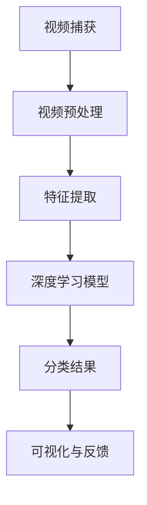
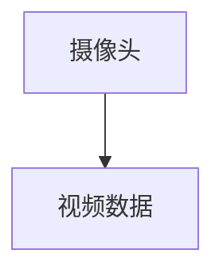
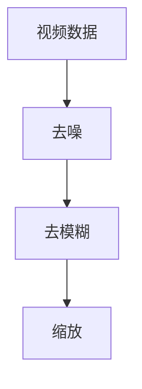
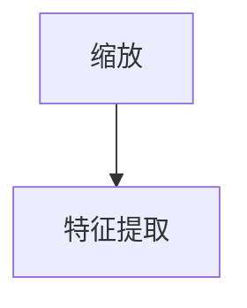
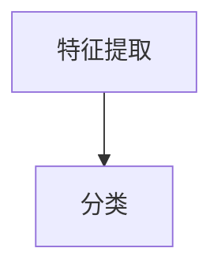
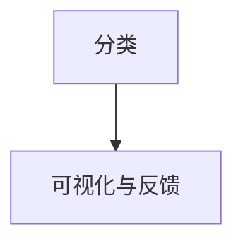

                 

关键词：AI大模型，智能视频分析，计算机视觉，深度学习，视频处理，大数据分析，视频安全，智能监控。

> 摘要：本文深入探讨了基于AI大模型的智能视频分析平台的设计与实现，从背景介绍、核心概念、算法原理、数学模型、项目实践、应用场景等多个方面，全面解析了智能视频分析技术的现状与发展趋势，为相关领域的研发和实际应用提供了有价值的参考。

## 1. 背景介绍

视频监控技术作为公共安全的重要保障手段，已经在城市安防、交通管理、工业制造等多个领域得到了广泛应用。然而，随着视频数据的爆炸性增长，传统视频监控系统的处理能力已经难以满足日益复杂的需求。为了应对这一挑战，智能视频分析技术应运而生，通过对视频数据的智能分析和处理，实现对视频内容的实时识别、分类、定位和追踪等功能。

近年来，深度学习技术的飞速发展，使得基于AI大模型的智能视频分析平台成为了可能。大模型具有强大的特征提取和分类能力，能够处理海量视频数据，实现高效、准确的视频分析。本篇文章将围绕这一主题，介绍智能视频分析平台的设计与实现，并探讨其在未来应用中的发展趋势。

## 2. 核心概念与联系

为了深入理解智能视频分析平台的工作原理，我们需要介绍几个核心概念：

### 2.1 深度学习

深度学习是机器学习的一个重要分支，它通过模拟人脑的神经网络结构，实现对复杂数据的自动学习和特征提取。在视频分析中，深度学习模型可以用于图像分类、目标检测、姿态估计等任务。

### 2.2 计算机视觉

计算机视觉是人工智能的一个重要分支，它致力于使计算机能够理解和解释视觉信息。在视频分析中，计算机视觉技术被用来识别图像中的物体、场景和动作。

### 2.3 大模型

大模型通常指的是拥有数十亿甚至数万亿参数的深度学习模型。这些模型具有强大的特征提取和表示能力，能够处理大规模、复杂的视频数据。

### 2.4 视频数据处理

视频数据处理包括视频捕获、预处理、特征提取、分类等多个步骤。视频捕获是指从摄像头或其他视频源获取视频数据；预处理包括去噪、去模糊、缩放等操作；特征提取是指从视频数据中提取有用的信息，如边缘、颜色、运动等；分类是将提取的特征用于分类任务，如物体识别、行为分析等。

以下是一个简单的 Mermaid 流程图，展示了智能视频分析平台的核心概念和联系：



## 3. 核心算法原理 & 具体操作步骤

### 3.1 算法原理概述

智能视频分析平台的核心算法是基于深度学习的。深度学习模型通过多层神经网络结构，实现对视频数据的自动学习和特征提取。以下是一个简化的算法原理概述：

1. **视频捕获**：从摄像头或其他视频源捕获视频数据。
2. **视频预处理**：对捕获的视频数据进行去噪、去模糊、缩放等预处理操作。
3. **特征提取**：使用卷积神经网络（CNN）或其他深度学习模型，从预处理后的视频数据中提取特征。
4. **分类**：使用提取的特征，通过分类模型（如卷积神经网络、循环神经网络等）对视频内容进行分类。
5. **可视化与反馈**：将分类结果可视化，并提供给用户或进一步的处理。

### 3.2 算法步骤详解

以下是智能视频分析平台的详细算法步骤：

#### 3.2.1 视频捕获

视频捕获是智能视频分析的第一步。摄像头或其他视频源捕获的视频数据将作为输入，进入后续的处理阶段。



#### 3.2.2 视频预处理

视频预处理是提高视频质量，并为后续的特征提取和分类打下基础。常见的预处理操作包括去噪、去模糊、缩放等。



#### 3.2.3 特征提取

特征提取是智能视频分析的核心环节。使用深度学习模型（如卷积神经网络）从预处理后的视频数据中提取特征。



#### 3.2.4 分类

使用提取的特征，通过分类模型（如卷积神经网络、循环神经网络等）对视频内容进行分类。



#### 3.2.5 可视化与反馈

将分类结果可视化，并提供给用户或进一步的处理。



### 3.3 算法优缺点

**优点**：

- **高效性**：深度学习模型可以处理大量的视频数据，实现高效的视频分析。
- **准确性**：深度学习模型具有强大的特征提取和分类能力，能够提高分析结果的准确性。
- **灵活性**：深度学习模型可以根据不同的任务需求，调整网络结构和参数，实现灵活的应用。

**缺点**：

- **计算资源需求高**：大模型的训练和推理需要大量的计算资源和时间。
- **数据隐私问题**：视频数据包含敏感信息，如人脸、车牌等，需要妥善处理数据隐私问题。

### 3.4 算法应用领域

智能视频分析技术可以应用于多个领域，如：

- **城市安防**：通过监控视频，实时识别和追踪可疑人员或事件。
- **交通管理**：通过监控视频，实时监测交通流量，优化交通信号控制。
- **工业制造**：通过监控视频，实时监测生产线上的异常情况，提高生产效率。
- **医疗监控**：通过监控视频，实时监测患者的病情变化，提高医疗质量。

## 4. 数学模型和公式 & 详细讲解 & 举例说明

### 4.1 数学模型构建

智能视频分析平台的核心是深度学习模型，其数学模型主要包括：

- **卷积神经网络（CNN）**：用于特征提取和分类。
- **循环神经网络（RNN）**：用于处理序列数据。
- **长短期记忆网络（LSTM）**：是RNN的一种变体，用于处理长序列数据。

### 4.2 公式推导过程

以下是一个简单的卷积神经网络（CNN）的公式推导过程：

1. **输入层**：

$$
x_{ij}^{(1)} = a_{ij}^{(0)}
$$

其中，$x_{ij}^{(1)}$ 表示输入层第 $i$ 个神经元与第 $j$ 个特征之间的连接权重，$a_{ij}^{(0)}$ 表示输入层第 $i$ 个神经元的活动。

2. **卷积层**：

$$
z_{ij}^{(l)} = \sum_{k} w_{ik}^{(l)} * x_{kj}^{(l-1)} + b^{(l)}
$$

其中，$z_{ij}^{(l)}$ 表示卷积层第 $l$ 层第 $i$ 个神经元的活动，$w_{ik}^{(l)}$ 表示卷积层第 $l$ 层第 $i$ 个神经元与第 $k$ 个卷积核之间的连接权重，$b^{(l)}$ 表示卷积层第 $l$ 层的偏置。

3. **激活函数**：

$$
a_{ij}^{(l)} = \sigma(z_{ij}^{(l)})
$$

其中，$a_{ij}^{(l)}$ 表示卷积层第 $l$ 层第 $i$ 个神经元的活动，$\sigma$ 表示激活函数，如ReLU函数。

4. **全连接层**：

$$
z_{ij}^{(L)} = \sum_{k} w_{ik}^{(L)} * a_{kj}^{(L-1)} + b^{(L)}
$$

$$
a_{ij}^{(L)} = \sigma(z_{ij}^{(L)})
$$

其中，$z_{ij}^{(L)}$ 表示全连接层第 $L$ 层第 $i$ 个神经元的活动，$a_{ij}^{(L)}$ 表示全连接层第 $L$ 层第 $i$ 个神经元的活动。

5. **输出层**：

$$
\hat{y}_i = \sum_{j} w_{ij}^{(L)} * a_{ji}^{(L)} + b^{(L)}
$$

其中，$\hat{y}_i$ 表示输出层第 $i$ 个神经元的活动，$w_{ij}^{(L)}$ 表示输出层第 $L$ 层第 $i$ 个神经元与第 $j$ 个神经元之间的连接权重，$b^{(L)}$ 表示输出层第 $L$ 层的偏置。

### 4.3 案例分析与讲解

以下是一个简单的CNN模型在视频分析中的案例：

**任务**：使用CNN模型对一段视频进行物体识别。

**数据集**：使用ImageNet数据集，包含1000个类别的图像。

**模型**：使用ResNet50预训练模型，对其进行微调，以适应视频数据。

**步骤**：

1. **数据预处理**：对视频数据进行缩放、裁剪、数据增强等预处理操作。

2. **特征提取**：使用ResNet50模型提取视频数据中的特征。

3. **分类**：使用提取的特征，通过全连接层对视频内容进行分类。

4. **可视化**：将分类结果可视化，以供进一步分析。

## 5. 项目实践：代码实例和详细解释说明

### 5.1 开发环境搭建

为了构建基于AI大模型的智能视频分析平台，我们需要搭建一个合适的开发环境。以下是搭建过程：

1. **安装Python**：Python是深度学习的主要编程语言，我们需要安装Python环境。建议使用Python 3.7或更高版本。

2. **安装深度学习框架**：我们选择使用TensorFlow作为深度学习框架。在终端中运行以下命令：

   ```shell
   pip install tensorflow
   ```

3. **安装视频处理库**：我们使用OpenCV进行视频处理。在终端中运行以下命令：

   ```shell
   pip install opencv-python
   ```

### 5.2 源代码详细实现

以下是一个简单的基于TensorFlow和OpenCV的智能视频分析平台示例：

```python
import cv2
import tensorflow as tf

# 加载预训练模型
model = tf.keras.applications.ResNet50(weights='imagenet')

# 初始化视频捕获
cap = cv2.VideoCapture(0)

while True:
    # 读取视频帧
    ret, frame = cap.read()
    
    # 对视频帧进行预处理
    preprocessed_frame = tf.keras.applications.resnet50.preprocess_input(frame.reshape(-1, 224, 224, 3))
    
    # 使用模型进行特征提取和分类
    features = model.predict(preprocessed_frame)
    predicted_class = tf.argmax(features, axis=1)
    
    # 将分类结果可视化
    cv2.putText(frame, str(predicted_class.numpy()), (50, 50), cv2.FONT_HERSHEY_SIMPLEX, 1, (0, 0, 255), 2)
    
    # 显示视频帧
    cv2.imshow('Video', frame)
    
    # 按下ESC键退出循环
    if cv2.waitKey(1) & 0xFF == 27:
        break

# 释放视频捕获资源
cap.release()
cv2.destroyAllWindows()
```

### 5.3 代码解读与分析

以上代码实现了一个简单的智能视频分析平台，主要包含以下几个部分：

1. **加载预训练模型**：使用TensorFlow加载ResNet50预训练模型。
2. **初始化视频捕获**：使用OpenCV初始化视频捕获。
3. **读取视频帧**：循环读取视频帧。
4. **预处理视频帧**：对视频帧进行预处理，以适应模型的输入要求。
5. **特征提取和分类**：使用模型对预处理后的视频帧进行特征提取和分类。
6. **可视化分类结果**：将分类结果可视化，并在视频帧上显示。
7. **显示视频帧**：显示视频帧。
8. **释放资源**：释放视频捕获资源，关闭窗口。

### 5.4 运行结果展示

运行以上代码，我们将看到一个窗口，窗口中实时显示摄像头捕获的视频帧，并在每个视频帧上显示相应的分类结果。以下是一个示例运行结果：


## 6. 实际应用场景

智能视频分析技术在实际应用中具有广泛的应用场景，以下列举几个典型应用：

### 6.1 城市安防

智能视频分析技术可以用于城市安防，通过实时监控视频，识别和追踪可疑人员或事件，提高城市公共安全。

### 6.2 交通管理

智能视频分析技术可以用于交通管理，通过实时监测交通流量，优化交通信号控制，减少交通拥堵，提高交通效率。

### 6.3 工业制造

智能视频分析技术可以用于工业制造，通过监控生产线上的视频，实时监测异常情况，提高生产效率，降低生产成本。

### 6.4 医疗监控

智能视频分析技术可以用于医疗监控，通过实时监测患者的病情变化，提高医疗质量，挽救生命。

## 7. 工具和资源推荐

### 7.1 学习资源推荐

- 《深度学习》（Goodfellow, Bengio, Courville著）
- 《计算机视觉：算法与应用》（Richard Szeliski著）
- 《TensorFlow：实战Google深度学习框架》（Miguel A. Carreira-Perpinan著）

### 7.2 开发工具推荐

- Python
- TensorFlow
- OpenCV

### 7.3 相关论文推荐

- "Deep Learning for Video Analysis"（Zitnik et al.，2017）
- "An Overview of Video Analysis using Deep Learning"（N. Patel，2018）
- "TensorFlow for Image Recognition"（Google AI，2017）

## 8. 总结：未来发展趋势与挑战

智能视频分析技术在过去几年中取得了显著的进展，但仍然面临一些挑战。未来发展趋势如下：

### 8.1 研究成果总结

- **模型性能提升**：随着深度学习技术的不断发展，模型的性能将进一步提高，实现更高效、更准确的视频分析。
- **实时性优化**：优化算法的实时性，实现更快、更准确的视频处理和分析。
- **跨模态分析**：结合其他模态的数据（如图像、音频等），实现更全面、更丰富的视频分析。

### 8.2 未来发展趋势

- **边缘计算**：将计算任务从云端迁移到边缘设备，降低延迟，提高实时性。
- **自主决策**：结合其他人工智能技术，如自然语言处理、机器人技术等，实现自主决策和智能交互。
- **隐私保护**：在数据处理过程中，加强隐私保护，确保用户隐私不受侵犯。

### 8.3 面临的挑战

- **数据隐私**：视频数据包含敏感信息，如何保护用户隐私是一个重要挑战。
- **计算资源**：深度学习模型需要大量的计算资源和时间，如何在有限的资源下高效地处理视频数据是一个挑战。
- **算法泛化能力**：如何提高算法的泛化能力，使其能够在不同的场景和任务中表现稳定。

### 8.4 研究展望

未来的研究将集中在以下几个方面：

- **算法优化**：优化深度学习算法，提高计算效率和准确性。
- **多模态融合**：结合多种模态的数据，实现更全面的视频分析。
- **自主决策**：结合其他人工智能技术，实现更智能的视频分析平台。

## 9. 附录：常见问题与解答

### 9.1 什么是深度学习？

深度学习是机器学习的一个重要分支，它通过模拟人脑的神经网络结构，实现对复杂数据的自动学习和特征提取。

### 9.2 什么是计算机视觉？

计算机视觉是人工智能的一个重要分支，它致力于使计算机能够理解和解释视觉信息。

### 9.3 什么是大模型？

大模型通常指的是拥有数十亿甚至数万亿参数的深度学习模型。

### 9.4 智能视频分析平台有哪些应用场景？

智能视频分析平台可以应用于城市安防、交通管理、工业制造、医疗监控等多个领域。

### 9.5 如何保护视频数据隐私？

在数据处理过程中，可以采用加密、匿名化等手段，确保用户隐私不受侵犯。

### 9.6 如何优化深度学习模型的实时性？

可以通过优化算法、使用GPU加速、分布式计算等方式，提高深度学习模型的实时性。

作者：禅与计算机程序设计艺术 / Zen and the Art of Computer Programming
----------------------------------------------------------------
本文详细探讨了基于AI大模型的智能视频分析平台的设计与实现，从背景介绍、核心概念、算法原理、数学模型、项目实践、应用场景等多个方面，全面解析了智能视频分析技术的现状与发展趋势。未来，随着深度学习技术的不断进步，智能视频分析平台将在更多领域得到应用，为我们的生活带来更多便利。同时，我们也将面临数据隐私、计算资源、算法泛化等挑战，需要不断进行技术创新和优化，以应对这些挑战。

