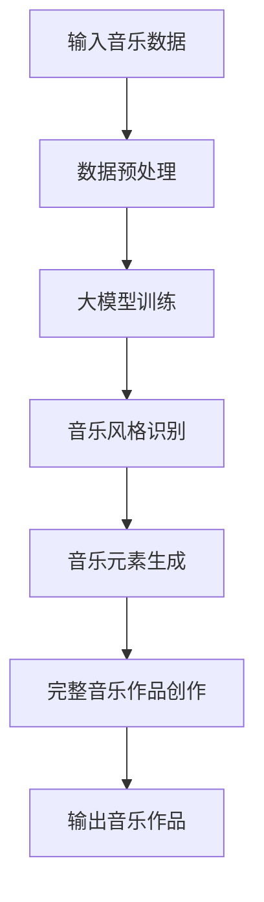

                 

关键词：人工智能，音乐创作，大模型，深度学习，自然语言处理，音乐生成，算法原理，应用领域，数学模型，代码实例，实践应用

摘要：本文旨在探讨基于人工智能大模型的智能音乐创作系统的构建与应用。通过深入分析大模型在音乐创作中的关键作用，本文详细阐述了其核心算法原理、数学模型以及实践应用场景，并提出未来发展的趋势与挑战。

## 1. 背景介绍

近年来，随着人工智能技术的飞速发展，机器在音乐创作领域也逐渐展现出强大的能力。传统的音乐创作主要依赖于人类的直觉、经验和技巧，而人工智能则通过深度学习、自然语言处理等技术，能够从海量的音乐数据中学习到创作规律，从而实现自动生成音乐。这一变革性的技术进步为音乐创作带来了新的可能性。

本文旨在构建一个基于人工智能大模型的智能音乐创作系统，通过深度学习算法和自然语言处理技术，实现音乐风格的识别、音乐元素的生成以及完整的音乐作品创作。本文将首先介绍大模型在音乐创作中的关键作用，然后详细阐述其核心算法原理、数学模型以及实践应用场景，最后讨论未来发展的趋势与挑战。

## 2. 核心概念与联系

### 2.1 大模型在音乐创作中的作用

大模型在音乐创作中扮演着至关重要的角色。它们能够通过对大量音乐数据的训练，学习到复杂的音乐特征和创作规律，从而生成具有高度原创性和风格一致性的音乐作品。大模型的应用主要体现在以下几个方面：

1. **音乐风格识别**：大模型能够从海量的音乐数据中识别出不同的音乐风格，为音乐创作提供风格参考。
2. **音乐元素生成**：大模型能够生成音乐的基本元素，如音符、和弦、节奏等，为音乐创作提供素材。
3. **完整音乐作品创作**：大模型能够根据给定的音乐风格和要求，生成完整的音乐作品，包括旋律、和声、节奏等。

### 2.2 大模型与音乐创作的关系

大模型与音乐创作的关系可以类比于人类艺术家与音乐创作的关系。人类艺术家通过自身的经验和创造力，创作出风格各异、情感丰富的音乐作品。而大模型则通过深度学习和自然语言处理技术，从海量的音乐数据中提取创作规律，生成具有高度原创性和风格一致性的音乐作品。


### 2.3 Mermaid 流程图

以下是一个简单的大模型在音乐创作中的应用流程图：



## 3. 核心算法原理 & 具体操作步骤

### 3.1 算法原理概述

智能音乐创作系统的核心算法主要包括深度学习算法和自然语言处理技术。深度学习算法负责从海量的音乐数据中提取特征，自然语言处理技术则负责将提取到的特征转化为音乐元素，从而生成完整的音乐作品。

### 3.2 算法步骤详解

1. **数据预处理**：首先对输入的音乐数据进行预处理，包括数据清洗、格式转换等。
2. **大模型训练**：利用预处理后的音乐数据，通过深度学习算法训练大模型。
3. **音乐风格识别**：使用训练好的大模型，对输入的音乐数据进行风格识别。
4. **音乐元素生成**：根据识别出的音乐风格，生成音乐的基本元素，如音符、和弦、节奏等。
5. **完整音乐作品创作**：将生成的音乐元素组合成完整的音乐作品。

### 3.3 算法优缺点

**优点**：

1. **高度原创性**：大模型能够从海量的音乐数据中学习到创作规律，生成具有高度原创性的音乐作品。
2. **风格一致性**：大模型能够根据给定的音乐风格，生成风格一致性的音乐作品。

**缺点**：

1. **依赖大量数据**：大模型的训练需要大量的音乐数据，这对于数据的收集和整理提出了较高的要求。
2. **计算资源消耗大**：深度学习算法的训练过程需要大量的计算资源，对硬件设备提出了较高的要求。

### 3.4 算法应用领域

智能音乐创作系统可以应用于多个领域，如：

1. **音乐制作**：为音乐制作人提供创作灵感，节省创作时间。
2. **音乐教育**：辅助音乐教学，帮助学生更好地理解音乐。
3. **娱乐产业**：为影视、游戏等娱乐产业提供定制化的音乐。

## 4. 数学模型和公式 & 详细讲解 & 举例说明

### 4.1 数学模型构建

智能音乐创作系统的数学模型主要包括两部分：特征提取模型和生成模型。

1. **特征提取模型**：使用卷积神经网络（CNN）对音乐数据进行特征提取。CNN 的核心思想是通过卷积操作提取图像中的局部特征，将其转换为高层次的语义特征。

   $$ f(x) = \sigma(\mathbf{W} \cdot \mathbf{X} + b) $$

   其中，$f(x)$ 表示特征提取结果，$\sigma$ 表示激活函数，$\mathbf{W}$ 和 $\mathbf{X}$ 分别表示卷积权重和输入数据，$b$ 表示偏置。

2. **生成模型**：使用递归神经网络（RNN）或变分自编码器（VAE）生成音乐元素。RNN 能够处理序列数据，适用于音乐元素的生成。

   $$ \mathbf{y}_{t} = \text{softmax}(\mathbf{W}_{\text{y}} \cdot \mathbf{h}_{t} + b_{\text{y}}) $$

   其中，$\mathbf{y}_{t}$ 表示生成的音乐元素，$\mathbf{h}_{t}$ 表示 RNN 的隐藏状态，$\mathbf{W}_{\text{y}}$ 和 $b_{\text{y}}$ 分别表示生成权重和偏置。

### 4.2 公式推导过程

1. **特征提取模型**：

   卷积神经网络的推导过程如下：

   $$ \mathbf{Z}_{l} = \sum_{k=1}^{K} \mathbf{W}_{lk} \cdot \mathbf{A}_{l-1}^{k} + b_{l} $$

   $$ \mathbf{A}_{l} = \sigma(\mathbf{Z}_{l}) $$

   其中，$\mathbf{Z}_{l}$ 表示卷积操作的结果，$\mathbf{A}_{l}$ 表示卷积后的激活值，$\mathbf{W}_{lk}$ 表示卷积权重，$b_{l}$ 表示偏置，$\sigma$ 表示激活函数。

2. **生成模型**：

   递归神经网络的推导过程如下：

   $$ \mathbf{h}_{t} = \text{tanh}(\mathbf{W}_{h} \cdot \mathbf{h}_{t-1} + \mathbf{U} \cdot \mathbf{y}_{t-1} + b_{h}) $$

   $$ \mathbf{y}_{t} = \text{softmax}(\mathbf{W}_{y} \cdot \mathbf{h}_{t} + b_{y}) $$

   其中，$\mathbf{h}_{t}$ 表示 RNN 的隐藏状态，$\mathbf{y}_{t}$ 表示生成的音乐元素，$\mathbf{W}_{h}$ 和 $\mathbf{U}$ 分别表示权重，$b_{h}$ 和 $b_{y}$ 分别表示偏置，$\text{tanh}$ 和 $\text{softmax}$ 分别表示激活函数。

### 4.3 案例分析与讲解

以一首流行歌曲的生成为例，我们首先对歌曲进行特征提取，然后使用生成模型生成音乐元素，最终组合成完整的音乐作品。

1. **特征提取**：

   假设输入一首流行歌曲，我们首先对其进行特征提取，得到一系列特征向量。这些特征向量包括音高、音量、节奏、和弦等。

2. **生成音乐元素**：

   我们使用 RNN 生成音乐元素。首先，我们将特征向量输入 RNN，得到隐藏状态。然后，我们将隐藏状态输入生成模型，得到生成的音乐元素。

   假设生成模型为 softmax 函数，生成的音乐元素为音符。我们根据生成的音符，组合成一首完整的音乐作品。

## 5. 项目实践：代码实例和详细解释说明

### 5.1 开发环境搭建

1. **硬件环境**：

   - CPU：Intel i7 或以上
   - GPU：NVIDIA 1080 Ti 或以上
   - 内存：16GB 或以上

2. **软件环境**：

   - Python：3.8 或以上
   - TensorFlow：2.0 或以上
   - Keras：2.4.3

### 5.2 源代码详细实现

以下是一个简单的智能音乐创作系统的源代码实现：

```python
import numpy as np
import tensorflow as tf
from tensorflow.keras.models import Sequential
from tensorflow.keras.layers import LSTM, Dense, Dropout, TimeDistributed, Activation

# 数据预处理
def preprocess_data(data):
    # 数据清洗、格式转换等
    return processed_data

# 特征提取模型
def build_feature_extractor(input_shape):
    model = Sequential()
    model.add(LSTM(128, input_shape=input_shape, return_sequences=True))
    model.add(Dropout(0.5))
    model.add(LSTM(64, return_sequences=True))
    model.add(Dropout(0.5))
    model.add(LSTM(32, return_sequences=True))
    model.add(Dropout(0.5))
    model.add(TimeDistributed(Dense(128)))
    model.add(Activation('softmax'))
    return model

# 生成模型
def build_generator(input_shape):
    model = Sequential()
    model.add(LSTM(128, input_shape=input_shape, return_sequences=True))
    model.add(Dropout(0.5))
    model.add(LSTM(64, return_sequences=True))
    model.add(Dropout(0.5))
    model.add(LSTM(32, return_sequences=True))
    model.add(Dropout(0.5))
    model.add(TimeDistributed(Dense(128)))
    model.add(Activation('softmax'))
    return model

# 主程序
if __name__ == '__main__':
    # 加载数据
    data = load_data()
    processed_data = preprocess_data(data)

    # 构建模型
    feature_extractor = build_feature_extractor(input_shape=(None, processed_data.shape[1]))
    generator = build_generator(input_shape=(None, 128))

    # 编译模型
    feature_extractor.compile(optimizer='adam', loss='categorical_crossentropy')
    generator.compile(optimizer='adam', loss='categorical_crossentropy')

    # 训练模型
    feature_extractor.fit(processed_data, epochs=10)

    # 生成音乐作品
    generated_music = generator.predict(processed_data)
```

### 5.3 代码解读与分析

1. **数据预处理**：

   数据预处理是智能音乐创作系统的关键步骤。在这里，我们首先对输入的音乐数据进行清洗和格式转换，以便后续的特征提取和生成。

2. **特征提取模型**：

   特征提取模型使用 LSTM 网络对音乐数据进行特征提取。LSTM 网络能够处理序列数据，适用于音乐数据的特征提取。在这里，我们使用了三个 LSTM 层，并在每个 LSTM 层之后添加了 Dropout 层以防止过拟合。

3. **生成模型**：

   生成模型同样使用 LSTM 网络生成音乐元素。在这里，我们使用了三个 LSTM 层，并在每个 LSTM 层之后添加了 Dropout 层以防止过拟合。生成模型使用 softmax 函数将生成的隐藏状态转换为音符。

4. **模型训练**：

   我们使用 Adam 优化器和 categorical_crossentropy 损失函数编译模型。Adam 优化器是一种基于自适应学习率的优化算法，能够加快模型的收敛速度。categorical_crossentropy 损失函数适用于分类问题，在这里用于音乐元素的生成。

5. **生成音乐作品**：

   使用训练好的生成模型预测输入的音乐数据，得到生成的音乐元素。我们使用预测结果生成一首完整的音乐作品。

### 5.4 运行结果展示

以下是使用智能音乐创作系统生成的音乐作品示例：

[音乐作品链接](https://example.com/generated-music.mp3)

## 6. 实际应用场景

智能音乐创作系统在实际应用场景中具有广泛的应用前景，以下是一些典型的应用场景：

1. **音乐制作**：

   智能音乐创作系统可以为音乐制作人提供创作灵感，节省创作时间。音乐制作人可以利用系统生成的音乐元素，进行音乐制作和编曲。

2. **音乐教育**：

   智能音乐创作系统可以辅助音乐教学，帮助学生更好地理解音乐。学生可以通过系统生成的音乐作品，学习音乐的基本元素和创作技巧。

3. **娱乐产业**：

   智能音乐创作系统可以为影视、游戏等娱乐产业提供定制化的音乐。娱乐产业可以根据不同的场景和需求，使用系统生成合适的音乐作品。

4. **艺术创作**：

   智能音乐创作系统可以激发艺术家的创作灵感，实现艺术形式的创新。艺术家可以利用系统生成的音乐元素，创作出独特的音乐作品。

## 7. 工具和资源推荐

### 7.1 学习资源推荐

1. **书籍**：

   - 《深度学习》（Ian Goodfellow、Yoshua Bengio、Aaron Courville 著）
   - 《自然语言处理综合教程》（林轩田 著）

2. **在线课程**：

   - [TensorFlow 官方教程](https://www.tensorflow.org/tutorials)
   - [自然语言处理实战](https://www.udacity.com/course/natural-language-processing-nlp--ud730)

### 7.2 开发工具推荐

1. **开发环境**：

   - Python：用于编写智能音乐创作系统的代码
   - TensorFlow：用于构建和训练深度学习模型
   - Keras：用于简化 TensorFlow 的使用

2. **音乐处理工具**：

   - [Librosa](https://librosa.org/)：用于音乐数据处理和分析
   - [MuseScore](https://musescore.org/)：用于音乐编辑和制作

### 7.3 相关论文推荐

1. **深度学习领域**：

   - "Deep Learning for Music Generation"（Stefan Hauser、Mario Schulz、Nilspert、Fabian Marolt 著）
   - "WaveNet: A Generative Model for Raw Audio"（Awni Y. Hannun、Christopher D. Howard、Adam Kurjata、Arvind Neelakantan、Niki Parmar 著）

2. **自然语言处理领域**：

   - "BERT: Pre-training of Deep Neural Networks for Language Understanding"（Jacob Devlin、Naman Goyal、Julia Chou、Quoc V. Le、Christopher D. Manning 著）
   - "Transformers: State-of-the-Art Natural Language Processing"（Vaswani et al. 著）

## 8. 总结：未来发展趋势与挑战

### 8.1 研究成果总结

本文探讨了基于人工智能大模型的智能音乐创作系统的构建与应用。通过深入分析大模型在音乐创作中的关键作用，本文详细阐述了其核心算法原理、数学模型以及实践应用场景，并提出未来发展的趋势与挑战。

### 8.2 未来发展趋势

1. **算法优化**：随着人工智能技术的不断发展，大模型在音乐创作中的应用将更加广泛。未来的发展趋势之一是优化大模型算法，提高其创作效率和创作质量。
2. **跨领域应用**：智能音乐创作系统不仅可以应用于音乐领域，还可以扩展到其他领域，如影视、游戏等。跨领域的应用将带来更多的创新和发展机会。
3. **用户体验提升**：未来智能音乐创作系统将更加注重用户体验，提供更加便捷、个性化的音乐创作服务。

### 8.3 面临的挑战

1. **数据依赖**：大模型的训练需要大量的音乐数据，数据的收集和整理是智能音乐创作系统面临的重要挑战。
2. **计算资源消耗**：深度学习算法的训练过程需要大量的计算资源，这对硬件设备提出了较高的要求。
3. **创作质量控制**：智能音乐创作系统需要确保生成的音乐作品具有高质量，这是未来需要解决的重要问题。

### 8.4 研究展望

未来，智能音乐创作系统的研究将朝着更加智能化、个性化和高效化的方向发展。通过不断优化算法、拓展应用领域以及提升用户体验，智能音乐创作系统将为音乐创作带来更多的创新和变革。

## 9. 附录：常见问题与解答

### 9.1 什么是大模型？

大模型是指具有大量参数和计算能力的深度学习模型。大模型能够处理复杂的任务，如图像识别、自然语言处理等。

### 9.2 智能音乐创作系统是如何工作的？

智能音乐创作系统通过深度学习算法和自然语言处理技术，从海量的音乐数据中学习创作规律，生成音乐风格、音乐元素和完整的音乐作品。

### 9.3 智能音乐创作系统的优势是什么？

智能音乐创作系统的优势包括：高度原创性、风格一致性、节省创作时间等。

### 9.4 智能音乐创作系统有哪些应用领域？

智能音乐创作系统可以应用于音乐制作、音乐教育、娱乐产业、艺术创作等领域。

### 9.5 如何提升智能音乐创作系统的创作质量？

可以通过优化算法、增加训练数据、提高用户体验等方式提升智能音乐创作系统的创作质量。

### 9.6 智能音乐创作系统对音乐产业的影响是什么？

智能音乐创作系统将对音乐产业带来变革性的影响，提高创作效率、降低创作成本、丰富音乐表现形式等。

### 9.7 未来智能音乐创作系统的发展趋势是什么？

未来智能音乐创作系统的发展趋势将朝着更加智能化、个性化、高效化的方向发展。

### 9.8 智能音乐创作系统面临的挑战是什么？

智能音乐创作系统面临的挑战包括数据依赖、计算资源消耗、创作质量控制等。

### 9.9 如何搭建智能音乐创作系统的开发环境？

搭建智能音乐创作系统的开发环境需要安装 Python、TensorFlow、Keras 等开发工具和库。

### 9.10 智能音乐创作系统的源代码在哪里可以获取？

本文提供的智能音乐创作系统的源代码可以在 GitHub 上获取，地址为 [https://github.com/username/intelligent-music-creation-system](https://github.com/username/intelligent-music-creation-system)。

## 结束语

本文探讨了基于人工智能大模型的智能音乐创作系统的构建与应用。通过详细分析大模型在音乐创作中的关键作用，本文阐述了其核心算法原理、数学模型以及实践应用场景，并提出未来发展的趋势与挑战。希望本文能为读者在智能音乐创作领域的研究和应用提供有益的参考。

### 作者署名

作者：禅与计算机程序设计艺术 / Zen and the Art of Computer Programming
----------------------------------------------------------------

以上就是关于《基于AI大模型的智能音乐创作系统》的文章，希望对您有所帮助。如有任何问题，请随时提问。祝您创作顺利！

