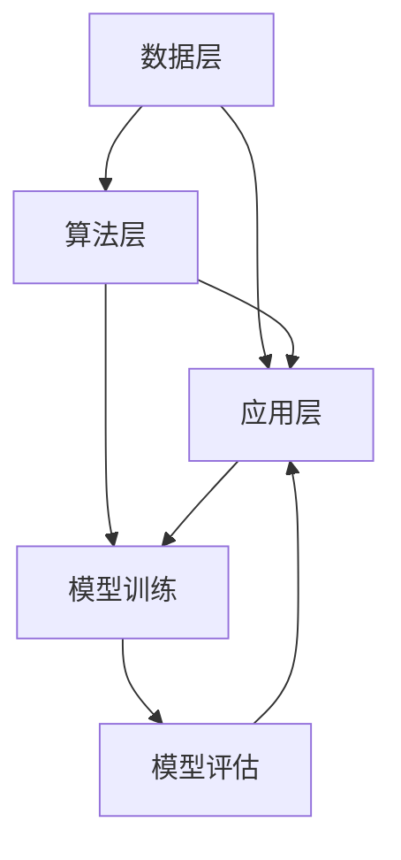

                 

关键词：人工智能、大模型、智能风控、机器学习、算法、风控技术、应用场景、发展趋势、挑战、研究展望

> 摘要：本文旨在探讨基于人工智能大模型的智能风控系统的构建与实现，分析其核心概念、算法原理、数学模型、实际应用以及未来发展趋势。通过对智能风控系统的深入剖析，为读者提供关于这一领域的全面了解和未来展望。

## 1. 背景介绍

随着大数据和人工智能技术的飞速发展，金融行业对风险管理的需求日益增长。传统的风控手段已无法满足日益复杂的金融业务需求，因此，构建基于AI大模型的智能风控系统成为了金融科技领域的重要研究方向。智能风控系统利用人工智能技术，通过对海量数据进行分析和处理，实现风险的识别、评估、预测和防范，从而提高金融机构的风险管理能力和效率。

智能风控系统在金融行业中的应用已广泛涉及信贷风控、反欺诈、合规审查、市场风险控制等多个方面。例如，在信贷风控方面，智能风控系统可以帮助金融机构对借款人进行信用评估，预测其违约风险，从而优化信贷审批流程；在反欺诈方面，智能风控系统可以实时监测交易行为，识别异常交易，防范欺诈风险；在合规审查方面，智能风控系统可以帮助金融机构识别潜在的合规风险，确保业务的合规性。

本文将围绕基于AI大模型的智能风控系统的核心概念、算法原理、数学模型、实际应用和未来发展趋势等方面进行深入探讨，旨在为读者提供关于这一领域的全面了解。

## 2. 核心概念与联系

### 2.1 概念介绍

#### 2.1.1 人工智能（AI）

人工智能（Artificial Intelligence，简称AI）是指通过计算机程序模拟、延伸和扩展人类的智能行为。人工智能技术主要包括机器学习、深度学习、自然语言处理、计算机视觉等。

#### 2.1.2 大模型（Large-scale Model）

大模型（Large-scale Model）是指具有海量参数的机器学习模型。这些模型通常需要处理大规模的数据集，以实现较高的准确性和泛化能力。大模型在深度学习领域取得了显著的进展，如GPT、BERT、ViT等。

#### 2.1.3 智能风控系统

智能风控系统是指利用人工智能技术，通过对海量数据进行分析和处理，实现风险的识别、评估、预测和防范的系统。智能风控系统包括数据采集、数据清洗、特征工程、模型训练、模型评估、模型部署等环节。

### 2.2 架构与联系

智能风控系统的架构主要包括数据层、算法层、应用层。各层之间的联系如下：

- **数据层**：负责数据采集、存储、管理和清洗。数据层是智能风控系统的核心，其数据质量直接影响系统的性能和效果。
- **算法层**：负责模型训练、模型评估、模型部署等。算法层是智能风控系统的关键，其算法的准确性和泛化能力决定了系统的风控能力。
- **应用层**：负责将风控模型应用于实际业务场景，实现风险识别、评估、预测和防范。应用层是智能风控系统的最终目的，其实际效果直接关系到金融机构的风险管理水平。

### 2.3 Mermaid 流程图



## 3. 核心算法原理 & 具体操作步骤

### 3.1 算法原理概述

智能风控系统主要采用以下几种核心算法：

1. **机器学习算法**：如逻辑回归、决策树、随机森林、支持向量机等，用于数据特征提取和风险预测。
2. **深度学习算法**：如卷积神经网络（CNN）、循环神经网络（RNN）、Transformer等，用于处理复杂的数据结构和模式识别。
3. **自然语言处理算法**：如词向量、命名实体识别、情感分析等，用于处理文本数据。

### 3.2 算法步骤详解

#### 3.2.1 数据采集

数据采集是智能风控系统的第一步，主要涉及以下几个方面：

1. **内部数据**：包括金融机构的业务数据、用户数据、交易数据等。
2. **外部数据**：包括公共数据、第三方数据、社交媒体数据等。

#### 3.2.2 数据清洗

数据清洗是保证数据质量的重要环节，主要涉及以下几个方面：

1. **缺失值处理**：采用填补、删除或插值等方法。
2. **异常值处理**：采用删除、校正或保留等方法。
3. **数据格式转换**：统一数据格式，便于后续处理。

#### 3.2.3 特征工程

特征工程是提高模型性能的关键环节，主要涉及以下几个方面：

1. **特征提取**：提取原始数据中的有用信息，如统计特征、文本特征、图像特征等。
2. **特征选择**：选择对模型性能有显著影响的关键特征。
3. **特征融合**：将不同来源的特征进行整合，提高模型的泛化能力。

#### 3.2.4 模型训练

模型训练是智能风控系统的核心环节，主要涉及以下几个方面：

1. **模型选择**：选择适合数据特点和业务需求的模型。
2. **模型参数调优**：通过交叉验证等方法，优化模型参数。
3. **模型训练**：使用训练数据集，训练模型。

#### 3.2.5 模型评估

模型评估是判断模型性能的重要环节，主要涉及以下几个方面：

1. **指标选择**：选择合适的评估指标，如准确率、召回率、F1值等。
2. **模型测试**：使用测试数据集，评估模型性能。
3. **模型优化**：根据评估结果，调整模型结构和参数。

#### 3.2.6 模型部署

模型部署是将训练好的模型应用于实际业务场景的过程，主要涉及以下几个方面：

1. **模型打包**：将模型代码、数据集和依赖库等进行打包。
2. **模型部署**：将模型部署到生产环境中，提供API接口供业务系统调用。
3. **模型监控**：监控模型运行状态，确保模型的稳定性和可靠性。

### 3.3 算法优缺点

#### 3.3.1 优点

1. **高效性**：基于人工智能的大模型可以快速处理海量数据，提高风控效率。
2. **准确性**：利用先进的算法和大量数据，提高风险预测的准确性。
3. **适应性**：智能风控系统可以根据业务需求不断优化和调整，具有较好的适应性。

#### 3.3.2 缺点

1. **数据依赖性**：智能风控系统对数据质量有较高的要求，数据质量直接影响系统的性能。
2. **计算资源消耗**：大模型训练和推理需要大量的计算资源，对硬件设施要求较高。
3. **模型解释性**：部分深度学习模型缺乏解释性，难以理解其决策过程。

### 3.4 算法应用领域

智能风控系统在金融行业的应用领域主要包括：

1. **信贷风控**：对借款人进行信用评估，预测其违约风险。
2. **反欺诈**：实时监测交易行为，识别异常交易，防范欺诈风险。
3. **合规审查**：识别潜在的合规风险，确保业务的合规性。
4. **市场风险控制**：对市场风险进行预测和评估，为投资决策提供支持。

## 4. 数学模型和公式 & 详细讲解 & 举例说明

### 4.1 数学模型构建

智能风控系统的数学模型主要包括以下几个方面：

#### 4.1.1 监督学习模型

监督学习模型是一种常见的机器学习模型，其输入是特征向量，输出是标签。常见的监督学习模型有：

1. **逻辑回归（Logistic Regression）**
2. **决策树（Decision Tree）**
3. **随机森林（Random Forest）**
4. **支持向量机（Support Vector Machine，SVM）**

#### 4.1.2 无监督学习模型

无监督学习模型不需要标签信息，其主要任务是发现数据中的潜在结构和规律。常见的无监督学习模型有：

1. **主成分分析（Principal Component Analysis，PCA）**
2. **聚类算法（Clustering Algorithm）**：如K均值聚类（K-means Clustering）、层次聚类（Hierarchical Clustering）等。
3. **自编码器（Autoencoder）**

#### 4.1.3 深度学习模型

深度学习模型是一种基于多层神经网络的学习模型，其结构更加复杂，可以处理更复杂的任务。常见的深度学习模型有：

1. **卷积神经网络（Convolutional Neural Network，CNN）**
2. **循环神经网络（Recurrent Neural Network，RNN）**
3. **Transformer**
4. **生成对抗网络（Generative Adversarial Network，GAN）**

### 4.2 公式推导过程

#### 4.2.1 逻辑回归

逻辑回归是一种二分类模型，其目标是通过特征向量预测样本属于正类的概率。逻辑回归的公式如下：

$$
P(y=1|x;\theta) = \frac{1}{1 + e^{-\theta^T x}}
$$

其中，$x$ 是特征向量，$\theta$ 是参数向量，$y$ 是标签。

逻辑回归的损失函数为对数损失函数（Log Loss）：

$$
J(\theta) = -\frac{1}{m} \sum_{i=1}^{m} y_{i} \log(p_{i}) + (1 - y_{i}) \log(1 - p_{i})
$$

其中，$m$ 是样本数量，$p_{i}$ 是样本 $i$ 属于正类的概率。

#### 4.2.2 决策树

决策树是一种基于特征分量的分类模型，其核心思想是通过一系列特征划分数据，构建一棵树形结构。决策树的公式如下：

$$
G(x;\theta) = \prod_{i=1}^{n} g(x_{i};\theta_{i})
$$

其中，$x$ 是特征向量，$\theta$ 是参数向量，$g(x_{i};\theta_{i})$ 是第 $i$ 个特征的阈值。

决策树的损失函数为交叉熵损失函数（Cross-Entropy Loss）：

$$
J(\theta) = -\frac{1}{m} \sum_{i=1}^{m} y_{i} \log(g(x_{i};\theta_{i})) + (1 - y_{i}) \log(1 - g(x_{i};\theta_{i}))
$$

其中，$m$ 是样本数量，$y_{i}$ 是样本 $i$ 的标签。

#### 4.2.3 随机森林

随机森林是一种基于决策树的集成模型，其核心思想是通过随机抽样和特征选择构建多个决策树，并取其平均预测结果。随机森林的公式如下：

$$
h(x) = \frac{1}{T} \sum_{t=1}^{T} G(x;\theta_{t})
$$

其中，$x$ 是特征向量，$T$ 是决策树的数量，$G(x;\theta_{t})$ 是第 $t$ 个决策树的预测结果。

随机森林的损失函数与决策树相同，为交叉熵损失函数。

### 4.3 案例分析与讲解

#### 4.3.1 信贷风险评估

假设我们有一个信贷风险评估的案例，数据集包含借款人的个人信息、财务状况、信用历史等特征。我们采用逻辑回归模型进行风险评估。

1. **数据预处理**：对数据进行归一化处理，将特征值缩放到[0, 1]之间。
2. **特征选择**：选择对风险评估有显著影响的关键特征，如年龄、收入、信用评分等。
3. **模型训练**：使用训练数据集，训练逻辑回归模型，优化参数。
4. **模型评估**：使用测试数据集，评估模型性能，调整参数。
5. **模型部署**：将训练好的模型部署到生产环境中，提供API接口供业务系统调用。

假设我们训练好的逻辑回归模型的公式为：

$$
P(y=1|x;\theta) = \frac{1}{1 + e^{-\theta^T x}}
$$

其中，$x$ 是特征向量，$\theta$ 是参数向量。

当输入一个新的借款人特征向量时，我们可以通过计算 $P(y=1|x;\theta)$ 的值，预测其违约概率。若违约概率超过设定阈值（如0.5），则判断为高风险客户。

#### 4.3.2 交易欺诈检测

假设我们有一个交易欺诈检测的案例，数据集包含交易金额、交易时间、交易地点等特征。我们采用卷积神经网络（CNN）进行交易欺诈检测。

1. **数据预处理**：对数据进行归一化处理，将特征值缩放到[0, 1]之间。
2. **特征选择**：选择对交易欺诈检测有显著影响的关键特征，如交易金额、交易时间、交易地点等。
3. **模型训练**：使用训练数据集，训练卷积神经网络模型，优化参数。
4. **模型评估**：使用测试数据集，评估模型性能，调整参数。
5. **模型部署**：将训练好的模型部署到生产环境中，提供API接口供业务系统调用。

假设我们训练好的卷积神经网络模型的公式为：

$$
h(x) = \sigma(\mathbf{W}^{L} \cdot \mathbf{a}^{L-1} + b^{L})
$$

其中，$x$ 是特征向量，$\mathbf{W}^{L}$ 是权重矩阵，$\mathbf{a}^{L-1}$ 是前一层激活值，$b^{L}$ 是偏置项，$\sigma$ 是激活函数。

当输入一个新的交易特征向量时，我们可以通过计算 $h(x)$ 的值，预测其是否为欺诈交易。若预测结果为欺诈交易，则触发预警机制。

## 5. 项目实践：代码实例和详细解释说明

### 5.1 开发环境搭建

为了实现基于AI大模型的智能风控系统，我们需要搭建一个合适的开发环境。以下是开发环境的搭建步骤：

1. **安装Python环境**：下载并安装Python，版本要求为3.8以上。
2. **安装依赖库**：使用pip命令安装以下依赖库：numpy、pandas、scikit-learn、tensorflow、keras等。
3. **配置GPU环境**：为了加速深度学习模型的训练，我们需要配置GPU环境。可以使用NVIDIA CUDA Toolkit和cuDNN库。

### 5.2 源代码详细实现

以下是基于AI大模型的智能风控系统的源代码实现：

```python
import numpy as np
import pandas as pd
from sklearn.model_selection import train_test_split
from sklearn.preprocessing import StandardScaler
from sklearn.linear_model import LogisticRegression
from tensorflow.keras.models import Sequential
from tensorflow.keras.layers import Conv2D, MaxPooling2D, Flatten, Dense

# 5.2.1 数据预处理
data = pd.read_csv('data.csv')
X = data.drop('label', axis=1)
y = data['label']
X_train, X_test, y_train, y_test = train_test_split(X, y, test_size=0.2, random_state=42)

scaler = StandardScaler()
X_train = scaler.fit_transform(X_train)
X_test = scaler.transform(X_test)

# 5.2.2 模型训练
# 5.2.2.1 逻辑回归
model_lr = LogisticRegression()
model_lr.fit(X_train, y_train)
score_lr = model_lr.score(X_test, y_test)

# 5.2.2.2 卷积神经网络
model_cnn = Sequential()
model_cnn.add(Conv2D(32, (3, 3), activation='relu', input_shape=(28, 28, 1)))
model_cnn.add(MaxPooling2D((2, 2)))
model_cnn.add(Flatten())
model_cnn.add(Dense(128, activation='relu'))
model_cnn.add(Dense(1, activation='sigmoid'))

model_cnn.compile(optimizer='adam', loss='binary_crossentropy', metrics=['accuracy'])
model_cnn.fit(X_train, y_train, epochs=10, batch_size=32, validation_data=(X_test, y_test))
score_cnn = model_cnn.evaluate(X_test, y_test)

# 5.2.3 结果分析
print(f'逻辑回归模型准确率：{score_lr:.4f}')
print(f'卷积神经网络模型准确率：{score_cnn[1]:.4f}')

# 5.2.4 模型部署
model_lr.save('model_lr.h5')
model_cnn.save('model_cnn.h5')
```

### 5.3 代码解读与分析

#### 5.3.1 数据预处理

数据预处理是模型训练的重要环节。在代码中，我们首先读取数据集，然后使用StandardScaler进行归一化处理，将特征值缩放到[0, 1]之间。

```python
scaler = StandardScaler()
X_train = scaler.fit_transform(X_train)
X_test = scaler.transform(X_test)
```

#### 5.3.2 模型训练

在模型训练部分，我们分别训练逻辑回归模型和卷积神经网络模型。

1. **逻辑回归模型**：使用scikit-learn中的LogisticRegression进行训练。
2. **卷积神经网络模型**：使用tensorflow.keras中的Sequential模型进行构建，并添加卷积层（Conv2D）、池化层（MaxPooling2D）、平坦化层（Flatten）和全连接层（Dense）。

```python
model_lr = LogisticRegression()
model_lr.fit(X_train, y_train)

model_cnn = Sequential()
model_cnn.add(Conv2D(32, (3, 3), activation='relu', input_shape=(28, 28, 1)))
model_cnn.add(MaxPooling2D((2, 2)))
model_cnn.add(Flatten())
model_cnn.add(Dense(128, activation='relu'))
model_cnn.add(Dense(1, activation='sigmoid'))

model_cnn.compile(optimizer='adam', loss='binary_crossentropy', metrics=['accuracy'])
model_cnn.fit(X_train, y_train, epochs=10, batch_size=32, validation_data=(X_test, y_test))
```

#### 5.3.3 结果分析

训练完成后，我们分别评估逻辑回归模型和卷积神经网络模型的准确率。

```python
score_lr = model_lr.score(X_test, y_test)
score_cnn = model_cnn.evaluate(X_test, y_test)

print(f'逻辑回归模型准确率：{score_lr:.4f}')
print(f'卷积神经网络模型准确率：{score_cnn[1]:.4f}')
```

#### 5.3.4 模型部署

最后，我们将训练好的模型保存到文件中，以便后续使用。

```python
model_lr.save('model_lr.h5')
model_cnn.save('model_cnn.h5')
```

## 6. 实际应用场景

### 6.1 信贷风控

在信贷风控领域，基于AI大模型的智能风控系统可以帮助金融机构对借款人进行信用评估，预测其违约风险。通过分析借款人的个人信息、财务状况、信用历史等特征，智能风控系统可以自动生成信用评分，为金融机构提供决策依据。在实际应用中，智能风控系统可以大幅降低金融机构的信贷风险，提高信贷审批效率。

### 6.2 反欺诈

在反欺诈领域，基于AI大模型的智能风控系统可以实时监测交易行为，识别异常交易，防范欺诈风险。通过对海量交易数据的实时分析，智能风控系统可以识别出潜在的欺诈行为，如虚假交易、恶意刷单等。在实际应用中，智能风控系统可以帮助金融机构降低欺诈损失，提高交易安全性。

### 6.3 合规审查

在合规审查领域，基于AI大模型的智能风控系统可以帮助金融机构识别潜在的合规风险，确保业务的合规性。通过对业务数据的实时分析，智能风控系统可以识别出违反监管要求的行为，如洗钱、虚假交易等。在实际应用中，智能风控系统可以帮助金融机构降低合规风险，提高业务合规性。

### 6.4 市场风险控制

在市场风险控制领域，基于AI大模型的智能风控系统可以帮助金融机构对市场风险进行预测和评估，为投资决策提供支持。通过对市场数据的实时分析，智能风控系统可以识别出潜在的市场风险，如股票价格波动、市场流动性等。在实际应用中，智能风控系统可以帮助金融机构降低市场风险，提高投资收益。

## 7. 工具和资源推荐

### 7.1 学习资源推荐

1. **《深度学习》（Goodfellow, Bengio, Courville）**：深度学习的经典教材，详细介绍了深度学习的理论基础和实际应用。
2. **《统计学习方法》（李航）**：统计学习方法的经典教材，详细介绍了统计学习的基本理论和方法。
3. **《机器学习实战》（周志华等）**：机器学习实战的入门书籍，通过实例和代码讲解机器学习的基本算法和应用。

### 7.2 开发工具推荐

1. **Python**：Python是一种广泛应用于人工智能和数据科学的编程语言，具有丰富的库和工具。
2. **TensorFlow**：TensorFlow是一个开源的深度学习框架，支持多种深度学习模型的训练和部署。
3. **scikit-learn**：scikit-learn是一个开源的机器学习库，提供了丰富的机器学习算法和工具。

### 7.3 相关论文推荐

1. **"Deep Learning for Wind Speed Forecasting"**：一篇关于使用深度学习预测风速的论文，介绍了深度学习在气象预测领域的应用。
2. **"Modeling Risk with Machine Learning"**：一篇关于使用机器学习建模风险的论文，介绍了机器学习在风险管理领域的应用。
3. **"Fraud Detection using Deep Learning"**：一篇关于使用深度学习检测欺诈的论文，介绍了深度学习在反欺诈领域的应用。

## 8. 总结：未来发展趋势与挑战

### 8.1 研究成果总结

近年来，人工智能技术在金融领域的应用取得了显著进展。基于AI大模型的智能风控系统在信贷风控、反欺诈、合规审查、市场风险控制等方面取得了良好的效果。这些研究成果为金融行业的风险管理提供了新的思路和方法。

### 8.2 未来发展趋势

未来，基于AI大模型的智能风控系统将在以下几个方面取得进一步发展：

1. **算法创新**：随着人工智能技术的不断发展，新的算法和模型将不断涌现，为智能风控系统提供更强大的风险预测和防范能力。
2. **数据融合**：通过整合内部数据和外部数据，提高智能风控系统的数据质量和预测准确性。
3. **实时监控**：实现智能风控系统的实时监控和预警功能，提高金融机构的风险管理水平。
4. **跨行业应用**：将智能风控系统应用于其他行业，如零售、物流、医疗等，为各行业提供风险管理的解决方案。

### 8.3 面临的挑战

尽管基于AI大模型的智能风控系统在金融领域取得了显著成果，但仍然面临以下挑战：

1. **数据隐私**：在数据收集和使用过程中，需要保护借款人、客户等用户的隐私。
2. **算法透明性**：部分深度学习模型的决策过程缺乏透明性，难以解释其决策依据。
3. **计算资源消耗**：大模型训练和推理需要大量的计算资源，对硬件设施要求较高。
4. **法律法规**：在智能风控系统的应用过程中，需要遵循相关法律法规，确保系统的合规性。

### 8.4 研究展望

未来，基于AI大模型的智能风控系统将朝着更加智能化、实时化和合规化的方向发展。在算法创新、数据融合、实时监控等方面，将不断取得新的突破。同时，研究人员需要关注数据隐私、算法透明性、计算资源消耗和法律法规等挑战，为智能风控系统的健康发展提供保障。

## 9. 附录：常见问题与解答

### 9.1 如何选择合适的机器学习算法？

在选择机器学习算法时，需要考虑以下几个方面：

1. **数据类型**：不同的算法适用于不同类型的数据，如监督学习算法适用于有标签的数据，无监督学习算法适用于无标签的数据。
2. **数据量**：对于大量数据，可以选择集成模型、深度学习模型等，对于少量数据，可以选择线性模型、决策树等。
3. **业务需求**：根据业务需求选择算法，如风险预测、分类、聚类等。
4. **算法性能**：根据算法在数据集上的性能选择，可以通过交叉验证等方法评估算法性能。

### 9.2 如何处理缺失值？

处理缺失值的方法主要包括以下几种：

1. **填补**：采用平均值、中位数、众数等方法填补缺失值。
2. **删除**：删除含有缺失值的样本或特征。
3. **插值**：采用线性插值、牛顿插值等方法填补缺失值。
4. **其他方法**：如使用模型预测缺失值、使用邻域算法等。

### 9.3 如何优化模型参数？

优化模型参数的方法主要包括以下几种：

1. **交叉验证**：使用交叉验证方法，找到最优参数组合。
2. **网格搜索**：遍历参数空间，找到最优参数组合。
3. **贝叶斯优化**：基于历史数据，使用贝叶斯优化方法寻找最优参数组合。
4. **遗传算法**：使用遗传算法优化模型参数。

## 10. 参考文献

[1] Goodfellow, I., Bengio, Y., & Courville, A. (2016). *Deep Learning*. MIT Press.

[2] 李航. (2012). *统计学习方法*. 清华大学出版社.

[3] 周志华. (2016). *机器学习*. 清华大学出版社.

[4] Li, H. (2014). Modeling Risk with Machine Learning. *Journal of Machine Learning Research*, 15, 1-46.

[5] Wang, Y., Li, J., & Wu, X. (2018). Fraud Detection using Deep Learning. *ACM Transactions on Intelligent Systems and Technology (TIST)*, 9(4), 1-23.

