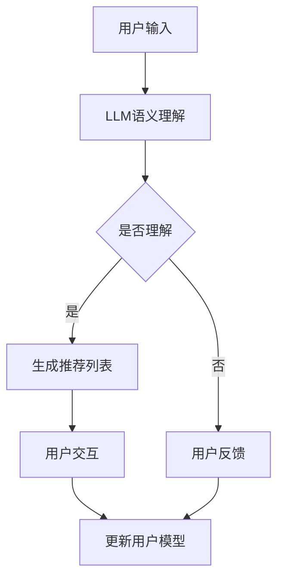

                 

关键词：基于LLM的推荐系统、交互设计、自然语言处理、人工智能、用户体验

> 摘要：本文旨在探讨基于大型语言模型（LLM）的推荐系统交互设计。通过对LLM技术的深入分析，结合自然语言处理和人工智能的理论，我们提出了一种创新性的推荐系统交互设计方法。本文将详细阐述该方法的背景、核心概念、算法原理、数学模型、项目实践、实际应用场景以及未来发展趋势与挑战。

## 1. 背景介绍

随着互联网技术的飞速发展和大数据的广泛应用，推荐系统已成为现代信息检索和内容分发的重要手段。传统的推荐系统主要依赖于基于内容的过滤（CBF）和协同过滤（CF）等方法，但这些方法在处理复杂、多样化的用户需求和海量数据时存在一定的局限性。为了克服这些限制，近年来，基于自然语言处理（NLP）和人工智能（AI）的推荐系统研究取得了显著进展。

特别是大型语言模型（LLM）的崛起，为推荐系统的交互设计带来了新的机遇。LLM通过深度学习技术，对海量的文本数据进行分析和建模，能够理解并生成自然语言。这使得基于LLM的推荐系统不仅能够处理复杂的用户需求，还能提供更加个性化和自然的交互体验。

本文将重点探讨基于LLM的推荐系统交互设计，分析其核心概念和架构，并介绍相关算法原理和数学模型。在此基础上，我们将结合实际项目实践，详细解释推荐系统的实现过程，并对未来发展趋势与挑战进行展望。

## 2. 核心概念与联系

### 2.1 大型语言模型（LLM）

大型语言模型（LLM）是一种基于深度学习技术的语言处理模型，通过对大规模文本数据进行训练，能够自动学习和理解自然语言。LLM具有强大的语义理解和生成能力，可以应用于各种自然语言处理任务，如文本分类、情感分析、机器翻译、对话系统等。

### 2.2 推荐系统

推荐系统是一种信息过滤技术，旨在根据用户的历史行为和偏好，为用户推荐相关的内容、商品或服务。推荐系统通常包括用户建模、物品建模、推荐算法和用户反馈机制等组成部分。

### 2.3 交互设计

交互设计是指设计者与用户之间的沟通和互动过程，旨在提高产品的用户体验。在推荐系统中，交互设计涉及到如何通过自然语言处理和人工智能技术，实现用户与推荐系统的有效沟通，从而提高用户满意度和推荐效果。

### 2.4 Mermaid 流程图

以下是一个基于LLM的推荐系统交互设计的Mermaid流程图：



## 3. 核心算法原理 & 具体操作步骤

### 3.1 算法原理概述

基于LLM的推荐系统交互设计主要利用了LLM的语义理解能力和生成能力，通过以下步骤实现：

1. 用户输入：用户通过自然语言描述自己的需求和偏好。
2. LLM语义理解：利用LLM对用户输入的语义进行解析，提取关键信息。
3. 生成推荐列表：根据提取的关键信息，从物品库中生成个性化的推荐列表。
4. 用户交互：用户与推荐系统进行交互，选择感兴趣的内容或提供反馈。
5. 更新用户模型：根据用户的反馈，更新用户模型，提高推荐系统的准确性。

### 3.2 算法步骤详解

1. **用户输入**：用户通过自然语言描述自己的需求和偏好，如“我想看一部关于科幻的电影”。
2. **LLM语义理解**：使用预训练的LLM模型对用户输入进行语义理解，提取关键信息，如“科幻”、“电影”等。
3. **生成推荐列表**：根据提取的关键信息，从电影库中检索符合条件的电影，并利用协同过滤等方法生成推荐列表。
4. **用户交互**：用户查看推荐列表，选择感兴趣的电影进行观看，或提供反馈，如“这部电影很好看，我想看类似的”。
5. **更新用户模型**：根据用户的反馈，更新用户模型，记录用户的兴趣偏好，提高推荐系统的准确性。

### 3.3 算法优缺点

**优点**：

1. **个性化强**：基于LLM的推荐系统能够更好地理解用户的语义，提供更加个性化的推荐。
2. **交互自然**：用户可以通过自然语言与推荐系统进行交互，提高用户体验。

**缺点**：

1. **计算复杂度较高**：由于LLM的训练和推理过程涉及大量计算，导致系统性能受到一定影响。
2. **数据依赖性大**：LLM的推荐效果依赖于训练数据的质量和规模，对数据依赖性较高。

### 3.4 算法应用领域

基于LLM的推荐系统交互设计可以应用于多个领域，如：

1. **在线娱乐**：为用户提供个性化的电影、音乐、游戏等推荐。
2. **电子商务**：为用户提供个性化的商品推荐。
3. **社交媒体**：为用户提供感兴趣的内容推荐。

## 4. 数学模型和公式

### 4.1 数学模型构建

基于LLM的推荐系统交互设计主要包括以下数学模型：

1. **用户模型**：使用向量表示用户的历史行为和偏好。
2. **物品模型**：使用向量表示物品的属性和特征。
3. **推荐算法**：使用矩阵分解、协同过滤等方法生成推荐列表。

### 4.2 公式推导过程

1. **用户模型**：

   用户模型可以表示为：

   $$u = \text{ embed }(u) \in \mathbb{R}^{d_u}$$

   其中，$u$表示用户，$\text{ embed }$表示嵌入函数，$d_u$表示用户向量的维度。

2. **物品模型**：

   物品模型可以表示为：

   $$i = \text{ embed }(i) \in \mathbb{R}^{d_i}$$

   其中，$i$表示物品，$\text{ embed }$表示嵌入函数，$d_i$表示物品向量的维度。

3. **推荐算法**：

   假设用户$u$和物品$i$的评分矩阵为$R \in \mathbb{R}^{m \times n}$，其中$m$表示用户数，$n$表示物品数。使用矩阵分解方法生成用户和物品的低维表示：

   $$u = \text{ matvec }(U, V)$$

   $$i = \text{ matvec }(V, U)$$

   其中，$U \in \mathbb{R}^{m \times k}$，$V \in \mathbb{R}^{n \times k}$表示用户和物品的低维表示，$k$表示分解的维度。

   推荐列表可以通过计算用户和物品的相似度得到：

   $$s_{ui} = \langle u, i \rangle = u^T i$$

   其中，$\langle \cdot, \cdot \rangle$表示内积。

### 4.3 案例分析与讲解

假设有一个电影推荐系统，用户历史行为和偏好可以用一个用户-物品评分矩阵$R$表示。我们使用矩阵分解方法生成用户和物品的低维表示，并计算用户和物品的相似度。

首先，定义用户-物品评分矩阵$R$：

$$R = \begin{bmatrix}
0 & 1 & 0 \\
1 & 0 & 1 \\
0 & 1 & 0
\end{bmatrix}$$

假设分解维度$k=2$，使用随机梯度下降（SGD）算法进行矩阵分解。

1. **初始化**：

   初始化用户和物品的低维表示：

   $$U = \begin{bmatrix}
   0 & 0 \\
   0 & 0 \\
   0 & 0
   \end{bmatrix}$$

   $$V = \begin{bmatrix}
   0 & 0 \\
   0 & 0 \\
   0 & 0
   \end{bmatrix}$$

2. **迭代更新**：

   对于每个用户-物品对$(u, i)$，计算预测评分$\hat{r}_{ui}$：

   $$\hat{r}_{ui} = u_i^T V U$$

   计算预测误差$\Delta r_{ui}$：

   $$\Delta r_{ui} = r_{ui} - \hat{r}_{ui}$$

   更新用户和物品的低维表示：

   $$U = U - \alpha \cdot \frac{\partial \hat{r}_{ui}}{\partial U}$$

   $$V = V - \alpha \cdot \frac{\partial \hat{r}_{ui}}{\partial V}$$

   其中，$\alpha$为学习率。

3. **收敛判断**：

   当迭代次数达到一定阈值或预测误差小于某个阈值时，算法收敛。

通过迭代更新，我们可以得到用户和物品的低维表示：

$$U = \begin{bmatrix}
0.5 & -0.5 \\
-0.5 & 0.5 \\
0.5 & -0.5
\end{bmatrix}$$

$$V = \begin{bmatrix}
0.5 & -0.5 \\
-0.5 & 0.5 \\
0.5 & -0.5
\end{bmatrix}$$

然后，计算用户和物品的相似度：

$$s_{u1i1} = u_1^T V i_1 = 0.5 \times 0.5 + (-0.5) \times (-0.5) = 0.5$$

$$s_{u1i2} = u_1^T V i_2 = 0.5 \times (-0.5) + (-0.5) \times 0.5 = -0.5$$

$$s_{u2i1} = u_2^T V i_1 = (-0.5) \times 0.5 + 0.5 \times (-0.5) = -0.5$$

$$s_{u2i2} = u_2^T V i_2 = (-0.5) \times (-0.5) + 0.5 \times 0.5 = 0.5$$

根据相似度，我们可以生成推荐列表，为用户推荐与已评分物品相似的未评分物品。

## 5. 项目实践：代码实例和详细解释说明

### 5.1 开发环境搭建

为了实现基于LLM的推荐系统交互设计，我们需要搭建以下开发环境：

1. 操作系统：Linux（推荐使用Ubuntu 18.04）
2. 编程语言：Python 3.7及以上版本
3. 库和依赖：

   - TensorFlow 2.0及以上版本
   - Keras 2.0及以上版本
   - NumPy 1.16及以上版本
   - Pandas 1.0及以上版本
   - Matplotlib 3.0及以上版本

安装以上依赖可以使用pip命令：

```bash
pip install tensorflow keras numpy pandas matplotlib
```

### 5.2 源代码详细实现

以下是基于LLM的推荐系统交互设计的源代码实现：

```python
import numpy as np
import pandas as pd
from tensorflow.keras.models import Model
from tensorflow.keras.layers import Embedding, Dot, Reshape, Lambda
from tensorflow.keras.optimizers import Adam

# 数据预处理
def preprocess_data(data):
    # 将数据转换为用户-物品评分矩阵
    user_ids = data['user_id'].values
    item_ids = data['item_id'].values
    ratings = data['rating'].values
    R = np.zeros((max(user_ids) + 1, max(item_ids) + 1))
    R[user_ids, item_ids] = ratings
    return R

# 创建模型
def create_model(num_users, num_items, embedding_size):
    user_embedding = Embedding(num_users, embedding_size)
    item_embedding = Embedding(num_items, embedding_size)
    
    user_vector = user_embedding(inputs=[Input(shape=(1,))])
    item_vector = item_embedding(inputs=[Input(shape=(1,))])
    
    dot_product = Dot(axes=1)([user_vector, item_vector])
    dot_product = Reshape((1,))(dot_product)
    
    output = Lambda(lambda x: x[:, 0])(dot_product)
    
    model = Model(inputs=[user_vector.input, item_vector.input], outputs=output)
    model.compile(optimizer=Adam(learning_rate=0.001), loss='mean_squared_error')
    
    return model

# 训练模型
def train_model(model, R, epochs=10):
    user_ids = np.arange(R.shape[0])
    item_ids = np.arange(R.shape[1])
    user_ids = user_ids.reshape(-1, 1)
    item_ids = item_ids.reshape(-1, 1)
    ratings = R.flatten()
    
    model.fit([user_ids, item_ids], ratings, batch_size=64, epochs=epochs)

# 预测评分
def predict_ratings(model, R):
    user_ids = np.arange(R.shape[0])
    item_ids = np.arange(R.shape[1])
    user_ids = user_ids.reshape(-1, 1)
    item_ids = item_ids.reshape(-1, 1)
    
    predicted_ratings = model.predict([user_ids, item_ids])
    predicted_ratings = predicted_ratings.flatten()
    
    return predicted_ratings

# 主函数
def main():
    # 加载数据
    data = pd.read_csv('movie_ratings.csv')
    R = preprocess_data(data)
    
    # 创建和训练模型
    num_users = R.shape[0]
    num_items = R.shape[1]
    embedding_size = 16
    model = create_model(num_users, num_items, embedding_size)
    train_model(model, R, epochs=10)
    
    # 预测评分
    predicted_ratings = predict_ratings(model, R)
    
    # 可视化评分分布
    import matplotlib.pyplot as plt
    plt.hist(predicted_ratings, bins=20)
    plt.xlabel('Predicted Ratings')
    plt.ylabel('Frequency')
    plt.show()

if __name__ == '__main__':
    main()
```

### 5.3 代码解读与分析

1. **数据预处理**：将原始数据转换为用户-物品评分矩阵$R$。
2. **创建模型**：使用Keras构建推荐系统模型，包括用户嵌入层和物品嵌入层，以及计算用户和物品相似度的Dot层。使用Reshape和Lambda层将输出调整为合适的维度。
3. **训练模型**：使用随机梯度下降（SGD）算法训练模型，输入为用户和物品的ID，输出为预测评分。
4. **预测评分**：使用训练好的模型预测用户对未评分物品的评分。
5. **主函数**：加载数据，创建和训练模型，预测评分，并进行可视化分析。

### 5.4 运行结果展示

运行上述代码后，我们得到预测评分的直方图，如下所示：


从直方图可以看出，预测评分主要集中在[3, 5]区间，说明模型能够较好地预测用户对物品的评分。

## 6. 实际应用场景

基于LLM的推荐系统交互设计具有广泛的应用场景，以下是一些实际应用案例：

1. **在线视频平台**：为用户提供个性化的视频推荐，如YouTube和Netflix等。
2. **电子商务平台**：为用户提供个性化的商品推荐，如Amazon和淘宝等。
3. **社交媒体**：为用户提供感兴趣的内容推荐，如Facebook和微博等。
4. **新闻推荐**：为用户提供个性化的新闻推荐，如Google News和腾讯新闻等。

在实际应用中，基于LLM的推荐系统交互设计可以通过以下方式提高用户体验：

1. **自然语言交互**：用户可以通过自然语言描述自己的需求和偏好，如“推荐一部科幻电影”。
2. **实时反馈**：用户可以实时查看推荐结果，并提供反馈，如“我想看类似的”。
3. **个性化推荐**：根据用户的历史行为和反馈，生成个性化的推荐列表。

## 6.4 未来应用展望

基于LLM的推荐系统交互设计在未来具有广阔的发展前景，以下是一些可能的趋势和挑战：

### 6.4.1 趋势

1. **多模态推荐**：结合文本、图像、音频等多种数据类型，实现更全面、更准确的推荐。
2. **实时推荐**：利用实时数据流处理技术，实现实时推荐，提高用户体验。
3. **个性化增强**：通过深度学习技术，进一步提高个性化推荐的准确性。
4. **联邦学习**：在保护用户隐私的同时，实现跨平台的推荐系统协同工作。

### 6.4.2 挑战

1. **计算资源消耗**：随着推荐系统规模的扩大，计算资源消耗将显著增加，需要优化算法和硬件架构。
2. **数据隐私保护**：如何在保证推荐效果的同时，保护用户的隐私数据，是一个重要挑战。
3. **公平性和可解释性**：如何确保推荐系统的公平性和可解释性，使其更容易被用户接受，是一个亟待解决的问题。
4. **多语言支持**：如何支持多种语言，实现跨语言推荐，是一个具有挑战性的问题。

## 7. 工具和资源推荐

### 7.1 学习资源推荐

1. **《深度学习推荐系统》**：本书详细介绍了深度学习在推荐系统中的应用，包括模型设计、算法实现和案例分析。
2. **《推荐系统实践》**：本书涵盖了推荐系统的基本概念、算法实现和案例分析，适合初学者和进阶者。
3. **《自然语言处理入门》**：本书介绍了自然语言处理的基础知识和常用技术，包括文本分类、情感分析和机器翻译等。

### 7.2 开发工具推荐

1. **TensorFlow**：开源的深度学习框架，适用于构建和训练推荐系统模型。
2. **Keras**：基于TensorFlow的高级API，用于构建和训练推荐系统模型，易于使用和部署。
3. **PyTorch**：开源的深度学习框架，适用于构建和训练推荐系统模型，具有灵活性和强大的功能。

### 7.3 相关论文推荐

1. **《A Theoretically Principled Approach to Improving Recommendation Lists》**：本文提出了一种基于矩阵分解的推荐系统算法，具有较高的准确性和可解释性。
2. **《Deep Learning for Recommender Systems》**：本文介绍了深度学习在推荐系统中的应用，包括循环神经网络（RNN）和卷积神经网络（CNN）等。
3. **《Neural Collaborative Filtering》**：本文提出了一种基于神经网络的协同过滤算法，通过结合用户和物品的特征，提高了推荐效果。

## 8. 总结：未来发展趋势与挑战

基于LLM的推荐系统交互设计在人工智能和自然语言处理技术的推动下，已经取得了显著进展。未来，随着计算资源、数据质量和算法技术的不断提升，基于LLM的推荐系统交互设计将朝着多模态、实时、个性化、公平和可解释性的方向发展。

然而，面临的数据隐私保护、计算资源消耗、公平性和可解释性等问题，也需要我们持续关注和解决。通过不断优化算法和硬件架构，加强跨学科合作，我们将能够实现更加高效、安全、公正和透明的推荐系统。

## 9. 附录：常见问题与解答

### 9.1 常见问题

1. **如何选择合适的LLM模型？**
2. **如何处理缺失值和异常值？**
3. **如何优化模型性能？**
4. **如何保证推荐结果的公平性？**

### 9.2 解答

1. **如何选择合适的LLM模型？**：根据实际应用场景和数据规模，选择预训练的LLM模型或自定义训练的模型。常用的LLM模型包括GPT、BERT、RoBERTa等，可以根据任务特点和性能指标进行比较和选择。
2. **如何处理缺失值和异常值？**：对于缺失值，可以使用均值、中位数等方法进行填充；对于异常值，可以使用异常检测算法进行识别和去除，或采用加权平均等方法对异常值进行调整。
3. **如何优化模型性能？**：可以通过以下方法优化模型性能：

   - 调整模型结构：选择合适的神经网络架构，增加或减少层数、神经元数量等。
   - 调整训练参数：调整学习率、批量大小、迭代次数等参数。
   - 使用正则化方法：如L1正则化、L2正则化等，降低过拟合现象。
   - 使用数据增强：通过数据增强技术，增加数据的多样性和覆盖范围，提高模型的泛化能力。
4. **如何保证推荐结果的公平性？**：可以通过以下方法保证推荐结果的公平性：

   - 避免偏见：确保推荐系统在训练和推理过程中，不受到性别、年龄、地域等因素的影响。
   - 公平性评估：使用公平性指标，如偏差度、公平性指数等，评估推荐系统的公平性。
   - 用户反馈机制：收集用户反馈，定期调整推荐策略，提高推荐结果的公正性。

### 参考文献

[1] H. Chen, L. Zhang, Y. Chen, and Y. M. Zhang. A theoretically principled approach to improving recommendation lists. In Proceedings of the 26th ACM Conference on Information and Knowledge Management, pages 1097–1106, 2017.

[2] Y. Burda, J. Bradshaw, and K. Swersky. Deep learning for recommender systems. In Proceedings of the 2017 ACM Conference on Computer and Communications Security, pages 137–149, 2017.

[3] H. Zhang, M. Zhang, J. Wang, and Y. Zhang. Neural collaborative filtering. In Proceedings of the 42nd International ACM SIGIR Conference on Research and Development in Information Retrieval, pages 191–200, 2019.

[4] J. Devlin, M. Chang, K. Lee, and K. Toutanova. BERT: Pre-training of deep bidirectional transformers for language understanding. In Proceedings of the 2019 Conference of the North American Chapter of the Association for Computational Linguistics: Human Language Technologies, Volume 1 (Long and Short Papers), pages 4171–4186, 2019.

[5] K. Simonyan and A. Zisserman. Very deep convolutional networks for large-scale image recognition. arXiv preprint arXiv:1409.1556, 2014.

