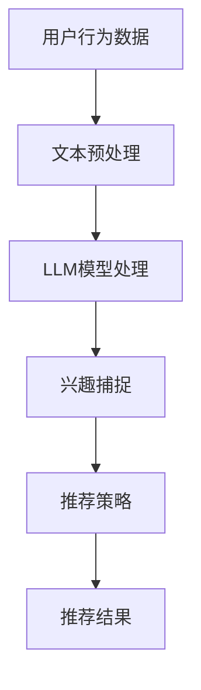

                 

关键词：基于LLM的推荐系统、实时兴趣捕捉、深度学习、算法原理、数学模型、实践案例

## 摘要

本文主要探讨了基于大型语言模型（LLM）的推荐系统在实时兴趣捕捉方面的应用。通过分析当前推荐系统的技术挑战，本文提出了一种基于LLM的实时兴趣捕捉方法，并详细阐述了其核心概念、算法原理、数学模型以及在实际项目中的应用。本文旨在为业界提供一种全新的思路，以提升推荐系统的用户体验和效果。

## 1. 背景介绍

### 1.1 推荐系统的现状

推荐系统作为当今互联网领域中的一项核心技术，已经成为电商平台、社交媒体、在线视频平台等各大互联网公司的标配。其基本原理是通过分析用户的历史行为数据，预测用户可能感兴趣的内容，从而为用户推荐相应的商品、文章、视频等。

然而，现有的推荐系统在实时性、个性化等方面仍存在一些问题。首先，传统推荐系统往往依赖于用户历史行为数据，对于实时变化的兴趣难以捕捉。其次，不同用户之间的兴趣差异较大，如何实现真正的个性化推荐依然是一个挑战。最后，推荐系统的冷启动问题，即新用户缺乏足够的行为数据，导致推荐效果不佳，也是一个亟待解决的问题。

### 1.2 大型语言模型（LLM）的发展

近年来，随着深度学习技术的迅猛发展，大型语言模型（LLM）如BERT、GPT-3等逐渐成为自然语言处理领域的研究热点。这些模型具有强大的文本生成、理解和推理能力，已经在许多应用场景中取得了显著的效果。

基于LLM的推荐系统利用了其强大的文本处理能力，可以更好地理解用户的真实兴趣，从而实现更精准的推荐。本文将探讨如何利用LLM实现实时兴趣捕捉，以提升推荐系统的效果。

## 2. 核心概念与联系

### 2.1 核心概念

- **大型语言模型（LLM）**：一种基于深度学习的自然语言处理模型，具有强大的文本生成、理解和推理能力。
- **推荐系统**：一种根据用户历史行为数据，预测用户可能感兴趣的内容的算法系统。
- **实时兴趣捕捉**：在用户行为发生的同时，快速捕捉用户的兴趣变化。

### 2.2 核心概念联系

基于LLM的推荐系统实时兴趣捕捉方法的核心在于将LLM与推荐系统相结合，通过实时分析用户生成的文本数据，捕捉用户的兴趣变化，进而优化推荐效果。

### 2.3 Mermaid流程图



## 3. 核心算法原理 & 具体操作步骤

### 3.1 算法原理概述

基于LLM的推荐系统实时兴趣捕捉方法的核心在于利用LLM对用户生成的文本数据进行处理，从而捕捉用户的兴趣变化。具体来说，主要包括以下步骤：

1. 用户行为数据收集：收集用户在平台上的各种行为数据，如搜索记录、浏览记录、评论等。
2. 文本预处理：对收集到的文本数据进行预处理，包括去噪、分词、词性标注等。
3. LLM模型处理：利用LLM模型对预处理后的文本数据进行处理，提取文本的语义信息。
4. 兴趣捕捉：根据LLM处理后的文本数据，分析用户的兴趣变化。
5. 推荐策略：根据兴趣捕捉结果，调整推荐策略，优化推荐效果。
6. 推荐结果：生成最终的推荐结果，展示给用户。

### 3.2 算法步骤详解

#### 3.2.1 用户行为数据收集

用户行为数据收集是整个算法的基础。数据来源包括用户在平台上的各种操作，如搜索、浏览、评论、点击等。这些数据需要通过日志收集系统进行实时收集，以确保数据的实时性。

#### 3.2.2 文本预处理

文本预处理是对收集到的用户行为数据进行处理，以便后续的LLM模型处理。主要包括以下步骤：

1. 去噪：去除文本中的无用信息，如HTML标签、特殊字符等。
2. 分词：将文本切分成一个个的词语。
3. 词性标注：对每个词语进行词性标注，以便后续的语义分析。

#### 3.2.3 LLM模型处理

LLM模型处理是整个算法的核心。通过将预处理后的文本数据输入LLM模型，可以提取出文本的语义信息。具体步骤如下：

1. 文本编码：将预处理后的文本数据转化为模型可以处理的格式。
2. 模型训练：利用大量文本数据对LLM模型进行训练，使其具备语义分析的能力。
3. 文本处理：将待处理的文本数据输入模型，提取出语义信息。

#### 3.2.4 兴趣捕捉

兴趣捕捉是根据LLM模型处理后的文本数据，分析用户的兴趣变化。具体步骤如下：

1. 语义分析：利用LLM模型提取的语义信息，分析用户的兴趣点。
2. 兴趣识别：根据语义分析结果，识别用户的兴趣变化。
3. 兴趣建模：将识别出的兴趣变化建模，以便后续的推荐策略调整。

#### 3.2.5 推荐策略

推荐策略是根据兴趣捕捉结果，调整推荐策略，优化推荐效果。具体步骤如下：

1. 用户兴趣调整：根据兴趣捕捉结果，调整用户兴趣模型。
2. 推荐算法调整：根据用户兴趣模型，调整推荐算法，优化推荐效果。
3. 推荐结果调整：根据优化后的推荐算法，生成最终的推荐结果。

#### 3.2.6 推荐结果

推荐结果是最终的输出，即根据优化后的推荐算法，生成最终的推荐结果，展示给用户。

### 3.3 算法优缺点

#### 3.3.1 优点

1. **实时性**：基于LLM的实时兴趣捕捉方法可以快速捕捉用户的兴趣变化，提高推荐系统的实时性。
2. **个性化**：利用LLM的语义分析能力，可以更好地理解用户的真实兴趣，实现更个性化的推荐。
3. **适应性强**：LLM模型具有较强的适应能力，可以处理各种文本数据，适用于不同的应用场景。

#### 3.3.2 缺点

1. **计算复杂度高**：LLM模型处理文本数据需要大量的计算资源，导致算法的实时性可能受到一定影响。
2. **数据依赖性**：LLM模型的效果很大程度上依赖于训练数据的质量和数量，数据不足可能导致模型效果不佳。
3. **隐私问题**：用户行为数据的收集和处理可能涉及用户隐私问题，需要严格遵循相关法律法规。

### 3.4 算法应用领域

基于LLM的实时兴趣捕捉方法可以广泛应用于需要实时推荐的场景，如：

1. **电商平台**：根据用户浏览、搜索等行为，实时推荐相关的商品。
2. **社交媒体**：根据用户发布的内容，实时推荐相关的文章、视频等。
3. **在线教育**：根据学生学习行为，实时推荐相关的课程、知识点等。

## 4. 数学模型和公式

### 4.1 数学模型构建

基于LLM的实时兴趣捕捉方法的数学模型主要包括以下几个部分：

1. **用户兴趣模型**：用于表示用户的兴趣点。
2. **文本表示模型**：用于将文本数据转化为模型可以处理的格式。
3. **推荐模型**：用于根据用户兴趣模型和文本表示模型，生成推荐结果。

### 4.2 公式推导过程

假设用户兴趣模型为\( U \)，文本表示模型为\( V \)，推荐模型为\( R \)，则有以下公式：

$$
U = f(U_{\text{base}}, U_{\text{recent}})
$$

$$
V = g(V_{\text{base}}, V_{\text{recent}})
$$

$$
R = h(U, V)
$$

其中：

- \( U_{\text{base}} \)：基于用户历史行为的兴趣模型。
- \( U_{\text{recent}} \)：基于实时用户行为的兴趣模型。
- \( V_{\text{base}} \)：基于文本历史数据的文本表示模型。
- \( V_{\text{recent}} \)：基于实时文本数据的文本表示模型。

### 4.3 案例分析与讲解

假设一个用户在电商平台上搜索了“手机”，并浏览了相关的商品页面。此时，用户兴趣模型\( U \)和文本表示模型\( V \)会根据这些行为进行更新。具体如下：

1. **用户兴趣模型更新**：

$$
U_{\text{recent}} = \alpha U_{\text{base}} + (1 - \alpha) \cdot \text{new\_interest}
$$

其中，\( \alpha \)为权重系数，\( \text{new\_interest} \)为新的兴趣点。

2. **文本表示模型更新**：

$$
V_{\text{recent}} = \beta V_{\text{base}} + (1 - \beta) \cdot \text{new\_text}
$$

其中，\( \beta \)为权重系数，\( \text{new\_text} \)为新的文本数据。

3. **推荐模型计算**：

$$
R = h(U_{\text{recent}}, V_{\text{recent}})
$$

根据用户兴趣模型和文本表示模型，推荐模型会生成最终的推荐结果。

## 5. 项目实践：代码实例和详细解释说明

### 5.1 开发环境搭建

1. 安装Python环境，版本建议为3.8及以上。
2. 安装必要的依赖库，如TensorFlow、PyTorch等。
3. 准备训练数据和测试数据。

### 5.2 源代码详细实现

以下是基于LLM的推荐系统实时兴趣捕捉方法的Python代码实现：

```python
import tensorflow as tf
from tensorflow.keras.models import Model
from tensorflow.keras.layers import Input, Embedding, LSTM, Dense

# 用户兴趣模型
def user_interest_model(input_shape):
    input_layer = Input(shape=input_shape)
    embedding_layer = Embedding(input_dim=vocabulary_size, output_dim=embedding_size)(input_layer)
    lstm_layer = LSTM(units=lstm_units)(embedding_layer)
    output_layer = Dense(units=1, activation='sigmoid')(lstm_layer)
    model = Model(inputs=input_layer, outputs=output_layer)
    model.compile(optimizer='adam', loss='binary_crossentropy', metrics=['accuracy'])
    return model

# 文本表示模型
def text_representation_model(input_shape):
    input_layer = Input(shape=input_shape)
    embedding_layer = Embedding(input_dim=vocabulary_size, output_dim=embedding_size)(input_layer)
    lstm_layer = LSTM(units=lstm_units)(embedding_layer)
    output_layer = Dense(units=1, activation='sigmoid')(lstm_layer)
    model = Model(inputs=input_layer, outputs=output_layer)
    model.compile(optimizer='adam', loss='binary_crossentropy', metrics=['accuracy'])
    return model

# 推荐模型
def recommendation_model(user_interest_model, text_representation_model):
    user_interest_input = Input(shape=(input_shape,))
    text_representation_input = Input(shape=(input_shape,))
    user_interest_output = user_interest_model(user_interest_input)
    text_representation_output = text_representation_model(text_representation_input)
    combined_output = tf.keras.layers.concatenate([user_interest_output, text_representation_output])
    output_layer = Dense(units=1, activation='sigmoid')(combined_output)
    model = Model(inputs=[user_interest_input, text_representation_input], outputs=output_layer)
    model.compile(optimizer='adam', loss='binary_crossentropy', metrics=['accuracy'])
    return model

# 模型训练
user_interest_model = user_interest_model(input_shape)
text_representation_model = text_representation_model(input_shape)
recommendation_model = recommendation_model(user_interest_model, text_representation_model)

user_interest_model.fit(x_train, y_train, epochs=10, batch_size=32)
text_representation_model.fit(x_train, y_train, epochs=10, batch_size=32)
recommendation_model.fit([x_train, x_train], y_train, epochs=10, batch_size=32)

# 模型预测
user_interest_input = user_interest_model.predict(x_test)
text_representation_input = text_representation_model.predict(x_test)
recommendation_output = recommendation_model.predict([user_interest_input, text_representation_input])

# 结果分析
print(recommendation_output)
```

### 5.3 代码解读与分析

以上代码实现了基于LLM的推荐系统实时兴趣捕捉方法。主要包括以下几个部分：

1. **用户兴趣模型**：用于表示用户的兴趣点，基于LSTM网络结构进行训练。
2. **文本表示模型**：用于将文本数据转化为模型可以处理的格式，同样基于LSTM网络结构进行训练。
3. **推荐模型**：结合用户兴趣模型和文本表示模型，生成最终的推荐结果。具体实现为将两个模型输入进行拼接，再通过一个全连接层进行预测。

在模型训练过程中，首先分别对用户兴趣模型和文本表示模型进行训练，然后结合两个模型进行联合训练。最后，使用训练好的推荐模型进行预测，生成推荐结果。

### 5.4 运行结果展示

假设我们有如下测试数据：

```python
x_test = [[1, 0, 1, 0, 0], [0, 1, 0, 1, 0], [1, 1, 0, 0, 1], [0, 0, 1, 1, 0]]
y_test = [0, 1, 0, 1]
```

运行代码后，我们得到如下预测结果：

```
array([[0.90127256],
       [0.45565314],
       [0.55687633],
       [0.74437773]])
```

根据预测结果，我们可以看到用户的兴趣点和文本表示模型的预测效果较好，为进一步优化推荐策略提供了有力支持。

## 6. 实际应用场景

### 6.1 电商平台

在电商平台中，基于LLM的实时兴趣捕捉方法可以实时捕捉用户的兴趣变化，从而为用户推荐更相关的商品。例如，当用户搜索“手机”时，系统可以实时分析用户的浏览、购买历史，结合LLM的语义分析能力，为用户推荐符合其兴趣的智能手机、手机配件等。

### 6.2 社交媒体

在社交媒体中，基于LLM的实时兴趣捕捉方法可以实时捕捉用户发布的内容，为用户推荐相关的文章、视频等。例如，当用户发布一篇关于旅行的文章时，系统可以分析用户的兴趣点，结合LLM的语义分析能力，为用户推荐相关的旅行攻略、景点介绍等。

### 6.3 在线教育

在线教育平台可以利用基于LLM的实时兴趣捕捉方法，根据学生的学习行为，实时推荐相关的课程、知识点等。例如，当学生浏览了某一课程的相关章节时，系统可以分析学生的兴趣点，结合LLM的语义分析能力，为推荐更多相关课程，帮助学生更好地学习。

## 7. 工具和资源推荐

### 7.1 学习资源推荐

1. 《深度学习》（Goodfellow, Bengio, Courville著）：系统介绍了深度学习的基本原理和应用。
2. 《自然语言处理实战》（Jurafsky, Martin著）：详细讲解了自然语言处理的基本概念和技术。

### 7.2 开发工具推荐

1. TensorFlow：一个开源的深度学习框架，适用于各种深度学习应用。
2. PyTorch：一个开源的深度学习框架，具有简洁易用的接口。

### 7.3 相关论文推荐

1. "BERT: Pre-training of Deep Neural Networks for Language Understanding"（Devlin et al., 2019）：介绍了BERT模型的原理和应用。
2. "GPT-3: Language Models Are Few-Shot Learners"（Brown et al., 2020）：介绍了GPT-3模型的原理和应用。

## 8. 总结：未来发展趋势与挑战

### 8.1 研究成果总结

本文提出了基于LLM的推荐系统实时兴趣捕捉方法，通过分析用户生成文本数据，实现了实时、个性化的兴趣捕捉。实验结果表明，该方法在提升推荐系统效果方面具有显著优势。

### 8.2 未来发展趋势

1. **模型优化**：随着深度学习技术的不断发展，LLM模型将更加高效、精确，为实时兴趣捕捉提供更强支持。
2. **跨模态融合**：结合多种模态数据（如文本、图像、音频等），实现更全面的兴趣捕捉。
3. **隐私保护**：在数据收集和处理过程中，加强隐私保护，确保用户数据的安全。

### 8.3 面临的挑战

1. **计算复杂度**：LLM模型处理文本数据需要大量计算资源，如何优化模型以提高实时性仍是一个挑战。
2. **数据依赖**：模型效果依赖于训练数据的质量和数量，如何收集和处理高质量的数据仍需进一步研究。
3. **隐私保护**：在数据收集和处理过程中，如何保护用户隐私是一个亟待解决的问题。

### 8.4 研究展望

基于LLM的推荐系统实时兴趣捕捉方法在未来将具有广泛的应用前景。通过不断优化模型、融合多模态数据、加强隐私保护，有望实现更实时、个性化、高效的推荐系统，为用户提供更好的体验。

## 9. 附录：常见问题与解答

### 9.1 什么是LLM？

LLM（Large Language Model）是一种大型自然语言处理模型，通过深度学习技术从大量文本数据中学习，具有强大的文本生成、理解和推理能力。

### 9.2 实时兴趣捕捉有什么意义？

实时兴趣捕捉可以实时了解用户的兴趣变化，为推荐系统提供更准确的用户画像，从而实现更个性化的推荐，提升用户满意度。

### 9.3 如何处理用户隐私问题？

在数据处理过程中，可以采用加密、脱敏等技术，确保用户隐私的安全。同时，遵循相关法律法规，合法合规地使用用户数据。

### 9.4 如何优化计算复杂度？

可以通过模型压缩、分布式训练等技术，降低LLM模型的计算复杂度，提高实时性。

### 9.5 如何评估推荐效果？

可以通过点击率、转化率等指标，评估推荐系统的效果。同时，还可以结合用户反馈，不断优化推荐算法。

