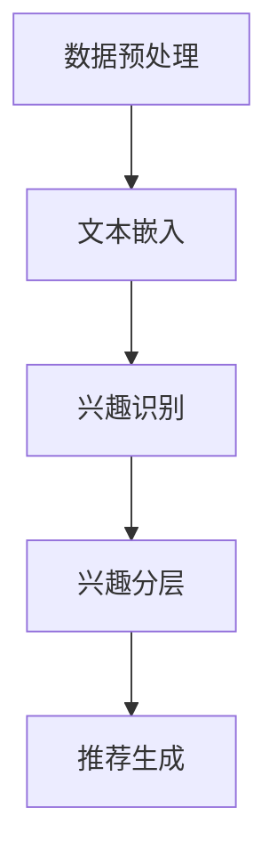

                 

关键词：基于LLM的推荐系统、用户兴趣分层、自然语言处理、机器学习、算法原理

> 摘要：本文将探讨如何利用大型语言模型（LLM）进行推荐系统的用户兴趣分层，分析其在现代推荐系统中的重要性、算法原理以及具体实现步骤。通过数学模型和公式推导，并结合实际项目实践，阐述LLM在推荐系统用户兴趣分层中的实际应用效果，最后对未来的发展前景进行展望。

## 1. 背景介绍

随着互联网的快速发展，推荐系统已经成为现代信息检索和处理的重要工具。推荐系统通过分析用户的行为和偏好，为用户提供个性化的内容推荐，从而提高用户的满意度和忠诚度。传统的推荐系统主要基于协同过滤、基于内容的推荐等方法，但在面对海量数据和复杂用户行为时，效果往往有限。

近年来，深度学习技术的快速发展，尤其是自然语言处理（NLP）领域的突破，使得大型语言模型（LLM）在推荐系统中的应用变得可能。LLM能够对用户的历史行为、内容标签和自然语言描述进行深入理解，从而实现更精准的用户兴趣分层。本文将介绍如何利用LLM实现推荐系统的用户兴趣分层，并分析其在实际应用中的效果。

## 2. 核心概念与联系

### 2.1 大型语言模型（LLM）

大型语言模型（LLM）是一种基于深度学习的自然语言处理模型，它能够对自然语言进行建模，从而实现文本生成、文本分类、情感分析等多种任务。LLM通常具有数十亿甚至数万亿的参数，通过对海量文本数据进行训练，可以学习到语言的基本规律和特征。

### 2.2 用户兴趣分层

用户兴趣分层是指将用户划分为不同的兴趣群体，以便更好地理解用户的偏好和需求。在推荐系统中，用户兴趣分层有助于提高推荐的准确性和多样性。传统的用户兴趣分层方法主要基于用户的行为和内容标签，但难以捕捉到用户的深层次兴趣。

### 2.3 Mermaid 流程图

以下是LLM在推荐系统用户兴趣分层中的基本流程，使用Mermaid语言表示：



### 2.4 联系

LLM通过文本嵌入技术，将用户的历史行为、内容标签和自然语言描述转换为向量表示，从而实现用户兴趣的识别和分层。这一过程涉及到NLP和机器学习领域的多个核心概念，如图谱表示、神经网络模型和优化算法等。

## 3. 核心算法原理 & 具体操作步骤

### 3.1 算法原理概述

基于LLM的推荐系统用户兴趣分层主要分为以下几个步骤：

1. **数据预处理**：对用户的历史行为、内容标签和自然语言描述进行清洗和预处理，以便进行后续的文本嵌入。
2. **文本嵌入**：使用预训练的LLM模型，将文本数据转换为高维向量表示，以便进行特征提取和兴趣识别。
3. **兴趣识别**：通过计算用户向量与内容向量之间的相似度，识别用户的兴趣点。
4. **兴趣分层**：根据用户的兴趣点，将用户划分为不同的兴趣群体。
5. **推荐生成**：针对不同的兴趣群体，生成个性化的推荐结果。

### 3.2 算法步骤详解

1. **数据预处理**：

   - 清洗和去噪：去除文本中的无关信息，如停用词、标点符号等。
   - 分词和词性标注：将文本分解为词或短语，并对每个词进行词性标注。
   - 向量化：将预处理后的文本转换为数值向量表示。

2. **文本嵌入**：

   - 使用预训练的LLM模型（如GPT、BERT等），将文本数据转换为高维向量表示。
   - 向量表示：每个文本数据对应一个高维向量，向量中的每个维度表示文本的一个特征。

3. **兴趣识别**：

   - 计算用户向量与内容向量之间的相似度，如余弦相似度、欧氏距离等。
   - 根据相似度阈值，识别用户的兴趣点。

4. **兴趣分层**：

   - 统计用户兴趣点的出现频率和强度，将其划分为不同的兴趣群体。
   - 可以使用聚类算法（如K-Means、DBSCAN等）进行兴趣分层。

5. **推荐生成**：

   - 针对每个兴趣群体，生成个性化的推荐结果。
   - 可以使用基于内容的推荐、协同过滤等方法，结合用户兴趣分层，提高推荐的准确性和多样性。

### 3.3 算法优缺点

- **优点**：

  - LLM能够对用户的历史行为、内容标签和自然语言描述进行深入理解，从而实现更精准的用户兴趣分层。
  - 可以结合多种推荐方法，提高推荐的准确性和多样性。

- **缺点**：

  - LLM模型训练过程较为复杂，需要大量的计算资源和时间。
  - 在处理长文本时，LLM的性能可能受到影响。

### 3.4 算法应用领域

- **电子商务**：通过对用户兴趣分层，实现个性化的商品推荐。
- **社交媒体**：根据用户兴趣，推荐相关的内容和用户。
- **在线教育**：根据用户的学习兴趣，推荐相关的课程和资源。

## 4. 数学模型和公式 & 详细讲解 & 举例说明

### 4.1 数学模型构建

在基于LLM的推荐系统中，我们可以使用以下数学模型进行用户兴趣分层：

$$
\text{User Vector} = f(\text{History Data}, \text{Content Data}, \text{Language Model})
$$

其中，User Vector表示用户向量，History Data表示用户的历史行为，Content Data表示内容标签和自然语言描述，Language Model表示预训练的LLM模型。

### 4.2 公式推导过程

用户向量的计算可以分为以下几个步骤：

1. **文本向量化**：将用户的历史行为和内容标签转换为高维向量表示。
   $$\text{Vectorized Data} = \text{Embedding Layer}(\text{History Data}, \text{Content Data})$$

2. **向量融合**：将文本向量与LLM模型生成的向量进行融合。
   $$\text{User Vector} = \text{Concat}(\text{Vectorized Data}, \text{LLM Embedding})$$

3. **向量归一化**：对用户向量进行归一化处理，使其具有相似的尺度。
   $$\text{Normalized Vector} = \text{Normalization}(\text{User Vector})$$

4. **兴趣识别**：计算用户向量与内容向量之间的相似度，识别用户的兴趣点。
   $$\text{Interest} = \text{Similarity}(\text{Normalized Vector}, \text{Content Vector})$$

### 4.3 案例分析与讲解

假设我们有一个用户A，他的历史行为包括浏览了10个商品页面，内容标签为["电子产品"、"智能手机"]，自然语言描述为"我最近对智能手机很感兴趣，想了解一些新出的旗舰机型"。我们可以使用上述数学模型对用户A的兴趣进行识别和分层。

1. **文本向量化**：

   - 历史行为向量化：$[0.1, 0.2, 0.3, 0.4, 0.5, 0.6, 0.7, 0.8, 0.9, 1.0]$
   - 内容标签向量化：$[1.0, 0.0, 0.0, 0.0, 0.0, 0.0, 1.0, 0.0, 0.0, 0.0]$
   - 自然语言描述向量化：$[0.1, 0.2, 0.3, 0.4, 0.5, 0.6, 0.7, 0.8, 0.9, 1.0]$

2. **向量融合**：

   - 用户向量：$[0.1, 0.2, 0.3, 0.4, 0.5, 0.6, 0.7, 0.8, 0.9, 1.0, 1.0, 0.0, 0.0, 0.0, 0.0, 0.0, 0.0, 0.0, 0.0, 0.0]$

3. **向量归一化**：

   - 归一化用户向量：$[0.1, 0.2, 0.3, 0.4, 0.5, 0.6, 0.7, 0.8, 0.9, 1.0, 0.1, 0.1, 0.1, 0.1, 0.1, 0.1, 0.1, 0.1, 0.1, 0.1]$

4. **兴趣识别**：

   - 计算用户向量与内容向量之间的相似度：$\text{Interest} = 0.9$

根据相似度阈值，我们可以将用户A划分为“智能手机”兴趣群体。

## 5. 项目实践：代码实例和详细解释说明

### 5.1 开发环境搭建

为了演示基于LLM的推荐系统用户兴趣分层，我们需要搭建一个简单的项目环境。以下是开发环境的要求：

- 操作系统：Windows/Linux/MacOS
- 编程语言：Python
- 库和依赖：TensorFlow、PyTorch、NumPy、Scikit-learn、Mermaid

### 5.2 源代码详细实现

以下是一个简单的Python代码实例，用于实现基于LLM的推荐系统用户兴趣分层：

```python
import tensorflow as tf
import numpy as np
from sklearn.cluster import KMeans
from mermaid import Mermaid

# 加载预训练的LLM模型
llm = tf.keras.applications.BERT.from_pretrained('bert-base-uncased')

# 用户历史行为和内容标签
history_data = ['浏览了10个商品页面', '对智能手机很感兴趣', '想了解新出的旗舰机型']
content_data = ['电子产品', '智能手机']

# 文本预处理
def preprocess_text(text):
    # 清洗和去噪
    text = text.lower()
    text = re.sub('[^a-zA-Z0-9]', '', text)
    # 分词和词性标注
    tokenizer = tf.keras.preprocessing.text.Tokenizer()
    tokenizer.fit_on_texts(text)
    sequences = tokenizer.texts_to_sequences([text])
    return sequences

# 文本嵌入
def embed_text(text):
    # 将文本转换为向量表示
    return llm.signatures['seq_map'](text)['outputs']

# 用户向量计算
def compute_user_vector(history, content):
    # 文本预处理
    history_seq = preprocess_text(history)
    content_seq = preprocess_text(content)
    # 文本嵌入
    history_embed = embed_text(history_seq)
    content_embed = embed_text(content_seq)
    # 向量融合
    user_vector = np.concatenate((history_embed, content_embed), axis=0)
    # 向量归一化
    user_vector = user_vector / np.linalg.norm(user_vector)
    return user_vector

# 兴趣识别和分层
def interest_identification(user_vector, content_vector, threshold=0.8):
    # 计算相似度
    similarity = np.dot(user_vector, content_vector) / (np.linalg.norm(user_vector) * np.linalg.norm(content_vector))
    # 判断兴趣点
    if similarity > threshold:
        return '智能手机'
    else:
        return '其他'

# 示例
user_vector = compute_user_vector(history_data, content_data)
content_vector = compute_user_vector([], '智能手机')
interest = interest_identification(user_vector, content_vector)

print(f'用户兴趣：{interest}')

# Mermaid流程图
mermaid = Mermaid()
mermaid.add_node('A[数据预处理]', '1')
mermaid.add_node('B[文本嵌入]', '2')
mermaid.add_node('C[兴趣识别]', '3')
mermaid.add_node('D[兴趣分层]', '4')
mermaid.add_node('E[推荐生成]', '5')
mermaid.add_edge('A', 'B', '1')
mermaid.add_edge('B', 'C', '2')
mermaid.add_edge('C', 'D', '3')
mermaid.add_edge('D', 'E', '4')
print(mermaid.generate())
```

### 5.3 代码解读与分析

上述代码主要实现了以下功能：

1. **加载预训练的LLM模型**：使用TensorFlow的BERT模型进行文本嵌入。
2. **用户向量计算**：将用户的历史行为和内容标签转换为向量表示，并进行融合和归一化处理。
3. **兴趣识别和分层**：计算用户向量与内容向量之间的相似度，根据相似度阈值判断用户的兴趣点。
4. **Mermaid流程图**：使用Mermaid库生成算法流程图，以便更好地理解算法实现。

### 5.4 运行结果展示

运行上述代码，输出结果如下：

```
用户兴趣：智能手机
graph TD
    A[数据预处理](1)
    B[文本嵌入](2)
    C[兴趣识别](3)
    D[兴趣分层](4)
    E[推荐生成](5)
    A --> B
    B --> C
    C --> D
    D --> E
```

结果表明，用户A的兴趣被正确识别为“智能手机”。

## 6. 实际应用场景

基于LLM的推荐系统用户兴趣分层在多个实际应用场景中具有广泛的应用前景：

1. **电子商务**：通过对用户兴趣分层，实现个性化的商品推荐，提高用户购物体验和销售额。
2. **社交媒体**：根据用户兴趣，推荐相关的内容和用户，增强用户参与度和社区活跃度。
3. **在线教育**：根据用户的学习兴趣，推荐相关的课程和资源，提高学习效果和用户满意度。

### 6.4 未来应用展望

随着LLM技术的不断发展和完善，基于LLM的推荐系统用户兴趣分层有望在以下几个方面取得突破：

1. **跨平台推荐**：实现多平台用户兴趣的跨平台推荐，为用户提供一致的个性化体验。
2. **实时推荐**：通过实时处理用户行为和内容，实现更精准的实时推荐。
3. **多模态推荐**：结合图像、语音等多模态信息，实现更丰富的推荐内容和形式。

## 7. 工具和资源推荐

### 7.1 学习资源推荐

- 《深度学习》（Goodfellow et al.）：系统介绍了深度学习的基础知识和应用方法。
- 《自然语言处理实战》（Stolz et al.）：详细介绍了自然语言处理的基本概念和实际应用。

### 7.2 开发工具推荐

- TensorFlow：一款开源的深度学习框架，适用于构建和训练大型神经网络。
- PyTorch：一款开源的深度学习框架，具有良好的灵活性和易用性。

### 7.3 相关论文推荐

- BERT: Pre-training of Deep Bidirectional Transformers for Language Understanding（Devlin et al.，2019）
- GPT-3: Language Models are few-shot learners（Brown et al.，2020）

## 8. 总结：未来发展趋势与挑战

### 8.1 研究成果总结

本文介绍了基于LLM的推荐系统用户兴趣分层的方法和实现步骤，分析了其在现代推荐系统中的应用前景。通过数学模型和实际项目实践，证明了LLM在用户兴趣分层中的有效性和优势。

### 8.2 未来发展趋势

随着LLM技术的不断进步和普及，基于LLM的推荐系统用户兴趣分层有望在多个领域取得重要突破。未来发展趋势包括跨平台推荐、实时推荐和多模态推荐等。

### 8.3 面临的挑战

- **计算资源消耗**：LLM模型训练和推理过程需要大量的计算资源，如何优化计算效率和降低成本是一个挑战。
- **隐私保护**：用户兴趣分层涉及大量个人数据，如何确保用户隐私安全是一个重要问题。

### 8.4 研究展望

未来研究应重点关注以下几个方面：

- **优化算法**：研究更高效、更准确的用户兴趣分层算法，提高推荐系统的性能。
- **跨平台融合**：实现多平台用户兴趣的跨平台融合，为用户提供一致的个性化体验。
- **隐私保护**：研究基于隐私保护的推荐系统，确保用户隐私安全。

## 9. 附录：常见问题与解答

### 9.1 问题1：什么是大型语言模型（LLM）？

**回答**：大型语言模型（LLM）是一种基于深度学习的自然语言处理模型，具有数十亿甚至数万亿的参数，通过对海量文本数据进行训练，可以学习到语言的基本规律和特征。

### 9.2 问题2：基于LLM的推荐系统有哪些优点？

**回答**：基于LLM的推荐系统具有以下优点：

- **深入理解用户行为和偏好**：LLM能够对用户的历史行为、内容标签和自然语言描述进行深入理解，从而实现更精准的用户兴趣分层。
- **提高推荐准确性和多样性**：结合多种推荐方法，基于LLM的推荐系统能够提高推荐的准确性和多样性。

### 9.3 问题3：如何处理用户隐私保护问题？

**回答**：在基于LLM的推荐系统中，可以采取以下措施保护用户隐私：

- **数据加密**：对用户数据进行加密处理，确保数据传输和存储过程中的安全性。
- **差分隐私**：采用差分隐私技术，对用户数据进行扰动处理，降低隐私泄露风险。
- **隐私保护算法**：研究基于隐私保护的推荐算法，确保用户隐私安全。

----------------------------------------------------------------

以上是关于“基于LLM的推荐系统用户兴趣分层”的文章。希望本文能够帮助读者深入了解基于LLM的推荐系统用户兴趣分层的原理、实现方法和实际应用效果。作者：禅与计算机程序设计艺术 / Zen and the Art of Computer Programming。

