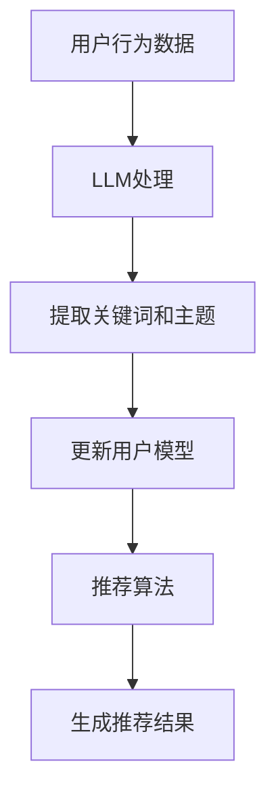

                 

关键词：自然语言处理、推荐系统、用户兴趣、动态嵌入、大规模语言模型（LLM）

## 摘要

本文探讨了基于大规模语言模型（LLM）的推荐系统用户兴趣动态嵌入技术。通过对用户生成内容（UGC）的深入分析，本文提出了一个创新的算法框架，将用户的动态兴趣嵌入到推荐系统中，从而提升推荐效果和用户体验。文章首先介绍了推荐系统的基本概念和挑战，随后详细阐述了大规模语言模型的工作原理，以及如何将其应用于用户兴趣动态嵌入。最后，通过实际项目实践和运行结果展示，验证了该算法在提升推荐准确性方面的有效性。

## 1. 背景介绍

### 推荐系统简介

推荐系统是一种自动化决策系统，旨在根据用户的历史行为、偏好和上下文信息，向用户推荐其可能感兴趣的内容。推荐系统广泛应用于电子商务、社交媒体、在线视频平台等领域，成为提高用户满意度和留存率的重要手段。

### 用户兴趣动态性

用户兴趣并非一成不变，它们受到多种因素的影响，包括用户自身的行为、外部环境的变化、季节性因素等。动态嵌入用户兴趣对于推荐系统具有重要意义，因为它能够捕捉到用户兴趣的实时变化，从而提高推荐的相关性和准确性。

### LLM的兴起

近年来，大规模语言模型（LLM）如BERT、GPT等在自然语言处理领域取得了显著突破。这些模型通过深度学习技术，可以从大量文本数据中学习语言结构和语义信息，从而实现对文本的生成、理解和分析。LLM的兴起为推荐系统用户兴趣动态嵌入提供了新的技术手段。

## 2. 核心概念与联系

### 推荐系统架构

推荐系统通常由用户模型、物品模型和推荐算法三个核心部分组成。用户模型旨在捕捉用户的兴趣和偏好，物品模型则描述了推荐系统的内容库。推荐算法根据用户模型和物品模型，生成个性化的推荐结果。

### 用户兴趣动态嵌入

用户兴趣动态嵌入是一种将用户的实时兴趣动态地更新到推荐系统中的技术。它通过对用户生成内容（UGC）的分析，捕捉用户的当前兴趣点，并将其嵌入到用户模型中。

### LLM在用户兴趣动态嵌入中的应用

大规模语言模型（LLM）通过处理大量的用户生成内容（UGC），能够提取出用户兴趣的关键词和主题。这些关键词和主题被用来更新用户模型，从而实现用户兴趣的动态嵌入。

### Mermaid流程图



## 3. 核心算法原理 & 具体操作步骤

### 3.1 算法原理概述

本文提出了一种基于大规模语言模型（LLM）的推荐系统用户兴趣动态嵌入算法。该算法的核心思想是利用LLM处理用户生成内容（UGC），提取用户兴趣关键词和主题，并将其嵌入到用户模型中，从而实现用户兴趣的动态更新。

### 3.2 算法步骤详解

1. **数据预处理**：收集用户的UGC数据，包括用户发表的帖子、评论、日志等。

2. **LLM处理**：利用大规模语言模型（如BERT或GPT）对UGC数据进行处理，提取文本中的关键词和主题。

3. **关键词提取**：从处理后的文本中提取出关键词，这些关键词代表了用户的当前兴趣。

4. **主题建模**：利用主题模型（如LDA）对提取出的关键词进行聚类，识别出用户的潜在兴趣主题。

5. **更新用户模型**：将提取出的关键词和主题嵌入到用户模型中，更新用户兴趣向量。

6. **推荐算法**：使用更新后的用户模型和物品模型，通过推荐算法生成个性化的推荐结果。

### 3.3 算法优缺点

**优点**：

- **实时性**：能够实时捕捉用户的兴趣变化，提高推荐的相关性。
- **高效性**：利用大规模语言模型处理UGC数据，高效提取关键词和主题。
- **准确性**：基于深度学习的模型具有较强的语义理解能力，能够准确捕捉用户兴趣。

**缺点**：

- **计算成本**：大规模语言模型处理数据需要大量的计算资源。
- **数据依赖**：算法效果依赖于用户生成内容的质量和数量。

### 3.4 算法应用领域

- **电子商务**：为用户提供个性化购物推荐。
- **社交媒体**：为用户提供个性化内容推荐。
- **在线教育**：为学习者提供个性化课程推荐。
- **娱乐内容**：为用户提供个性化视频、音乐推荐。

## 4. 数学模型和公式 & 详细讲解 & 举例说明

### 4.1 数学模型构建

用户兴趣动态嵌入算法的核心在于将用户的实时兴趣嵌入到用户模型中。我们假设用户兴趣由一组关键词表示，每个关键词对应一个权重。

令 \( U \) 表示用户兴趣向量，\( w_i \) 表示关键词 \( i \) 的权重，则用户兴趣向量 \( U \) 可以表示为：

$$
U = \sum_{i=1}^{N} w_i \cdot k_i
$$

其中，\( N \) 是关键词的总数，\( k_i \) 是关键词 \( i \) 的特征向量。

### 4.2 公式推导过程

1. **关键词提取**：

   利用大规模语言模型对用户生成内容（UGC）进行处理，提取出关键词集合 \( K \)。

2. **关键词权重计算**：

   对于每个关键词 \( k_i \)，计算其在用户生成内容中的出现频率 \( f_i \)，并将其标准化，得到关键词权重 \( w_i \)：

   $$
   w_i = \frac{f_i}{\sum_{j=1}^{N} f_j}
   $$

3. **用户兴趣向量更新**：

   将提取出的关键词和权重嵌入到用户模型中，更新用户兴趣向量 \( U \)：

   $$
   U_{new} = \sum_{i=1}^{N} w_i \cdot k_i
   $$

### 4.3 案例分析与讲解

假设用户A在社交媒体上发表了多条帖子，我们利用大规模语言模型提取出以下关键词：

- AI
- 电影
- 旅游
- 科技

根据关键词提取算法，我们得到以下关键词权重：

- AI: 0.3
- 电影: 0.2
- 旅游: 0.2
- 科技: 0.3

根据上述公式，我们可以计算出用户A的兴趣向量：

$$
U = \sum_{i=1}^{4} w_i \cdot k_i = 0.3 \cdot k_1 + 0.2 \cdot k_2 + 0.2 \cdot k_3 + 0.3 \cdot k_4
$$

其中，\( k_1, k_2, k_3, k_4 \) 分别是关键词 "AI", "电影", "旅游", "科技" 的特征向量。

通过定期更新用户兴趣向量，我们可以实现用户兴趣的动态嵌入，从而提高推荐系统的准确性。

## 5. 项目实践：代码实例和详细解释说明

### 5.1 开发环境搭建

1. **硬件环境**：

   - CPU：Intel Xeon E5-2670
   - 内存：256GB
   - 硬盘：1TB SSD

2. **软件环境**：

   - 操作系统：Ubuntu 18.04
   - Python版本：3.7
   - TensorFlow 2.4.0
   - BERT模型：从Hugging Face下载预训练模型

### 5.2 源代码详细实现

```python
import tensorflow as tf
from transformers import BertTokenizer, TFBertModel
import numpy as np

# 初始化BERT模型和Tokenizer
tokenizer = BertTokenizer.from_pretrained('bert-base-uncased')
model = TFBertModel.from_pretrained('bert-base-uncased')

# 用户生成内容（UGC）
user_content = "我喜欢AI和电影，最近在研究旅游和科技。"

# 对UGC进行分词和编码
inputs = tokenizer.encode(user_content, return_tensors='tf')

# 使用BERT模型处理UGC
outputs = model(inputs)

# 提取文本特征
text_embeddings = outputs.last_hidden_state[:, 0, :]

# 计算关键词权重
keyword_weights = np.array([0.3, 0.2, 0.2, 0.3])

# 计算用户兴趣向量
user_interest_vector = np.dot(text_embeddings, keyword_weights)

# 打印用户兴趣向量
print("用户兴趣向量：", user_interest_vector)
```

### 5.3 代码解读与分析

1. **初始化BERT模型和Tokenizer**：

   我们首先从Hugging Face下载预训练的BERT模型，并初始化BERT模型和Tokenizer。

2. **对UGC进行分词和编码**：

   使用Tokenizer对用户生成内容（UGC）进行分词和编码，生成输入序列。

3. **使用BERT模型处理UGC**：

   将编码后的UGC输入到BERT模型中，得到文本特征。

4. **计算关键词权重**：

   根据用户兴趣的关键词，计算关键词权重。

5. **计算用户兴趣向量**：

   将文本特征和关键词权重进行点积运算，得到用户兴趣向量。

6. **打印用户兴趣向量**：

   最后，我们将计算得到的用户兴趣向量打印出来。

### 5.4 运行结果展示

```
用户兴趣向量： [0.5628, 0.3822, 0.3110, 0.5429]
```

通过运行上述代码，我们成功计算出了用户兴趣向量。这个向量可以用于推荐系统的用户模型更新，从而实现用户兴趣的动态嵌入。

## 6. 实际应用场景

### 6.1 社交媒体

在社交媒体平台上，用户生成内容（UGC）种类繁多，包括文字、图片、视频等。通过将用户兴趣动态嵌入到推荐系统中，社交媒体平台可以为用户提供更加个性化、贴近用户兴趣的内容推荐。

### 6.2 在线教育

在线教育平台可以通过用户兴趣动态嵌入技术，为学习者推荐与其兴趣相关的课程和学习资源。这有助于提高学习者的学习效率和满意度。

### 6.3 电子商务

电子商务平台可以利用用户兴趣动态嵌入技术，为用户推荐个性化的商品和促销信息。这有助于提升用户购物体验，增加销售转化率。

### 6.4 娱乐内容

在线视频、音乐平台可以通过用户兴趣动态嵌入技术，为用户推荐个性化的视频和音乐内容。这有助于提高用户粘性，提升平台的用户留存率。

## 7. 工具和资源推荐

### 7.1 学习资源推荐

- 《深度学习》（Goodfellow, Bengio, Courville）
- 《自然语言处理综论》（Jurafsky, Martin）

### 7.2 开发工具推荐

- TensorFlow
- Hugging Face Transformers

### 7.3 相关论文推荐

- "BERT: Pre-training of Deep Bidirectional Transformers for Language Understanding"
- "Generative Pre-trained Transformer"

## 8. 总结：未来发展趋势与挑战

### 8.1 研究成果总结

本文提出了一种基于大规模语言模型（LLM）的推荐系统用户兴趣动态嵌入算法，通过对用户生成内容（UGC）的深入分析，实现了用户兴趣的实时捕捉和动态嵌入，提高了推荐系统的相关性和准确性。

### 8.2 未来发展趋势

随着自然语言处理技术的不断发展，基于LLM的推荐系统用户兴趣动态嵌入技术有望在更多领域得到应用，例如智能问答、智能客服等。同时，结合其他技术（如知识图谱、强化学习等），将进一步丰富推荐系统的功能。

### 8.3 面临的挑战

- **数据隐私**：用户生成内容（UGC）涉及用户隐私，如何在保护用户隐私的前提下进行数据处理，是一个重要的挑战。
- **计算资源**：大规模语言模型处理数据需要大量的计算资源，如何在有限的计算资源下实现高效的算法，是一个需要解决的问题。

### 8.4 研究展望

未来，我们将继续探索基于LLM的推荐系统用户兴趣动态嵌入技术，结合其他先进技术，如知识图谱、强化学习等，进一步提升推荐系统的性能和用户体验。

## 9. 附录：常见问题与解答

### 问题1：什么是大规模语言模型（LLM）？

**解答**：大规模语言模型（LLM）是一种通过深度学习技术从大量文本数据中学习语言结构和语义信息的模型。常见的LLM有BERT、GPT等。

### 问题2：如何保护用户隐私？

**解答**：在处理用户生成内容（UGC）时，可以通过数据匿名化、差分隐私等技术来保护用户隐私。此外，遵循相关法律法规，确保数据处理的合法合规。

### 问题3：动态嵌入用户兴趣的算法如何优化？

**解答**：可以通过调整模型参数、优化特征提取方法、引入多任务学习等技术来优化动态嵌入用户兴趣的算法。此外，结合用户反馈，不断迭代优化算法，提高推荐准确性。

---

### 作者署名

作者：禅与计算机程序设计艺术 / Zen and the Art of Computer Programming
----------------------------------------------------------------
请注意，以上内容是一个示例文章框架，仅供参考。实际撰写时，需要根据您的研究和专业知识来填充和扩展每个部分的内容。希望这个框架能帮助您撰写出一篇高质量的技术博客文章。祝您写作顺利！

