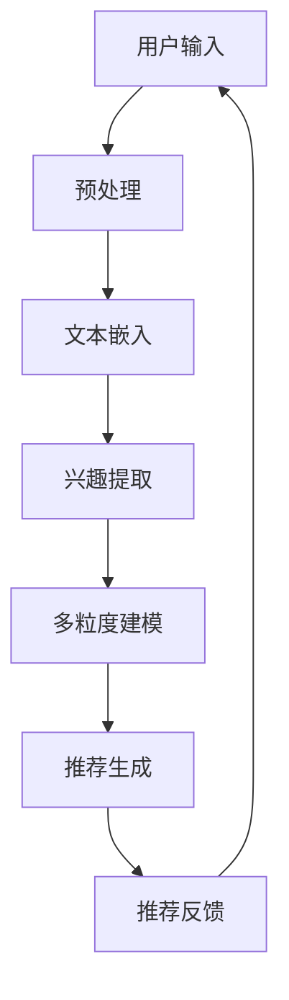

                 

关键词：LLM、推荐系统、用户兴趣、多粒度建模、算法、数学模型、项目实践、应用场景、工具和资源

> 摘要：本文旨在探讨基于大型语言模型（LLM）的推荐系统在用户兴趣多粒度建模中的应用。通过对LLM的深入理解，本文将阐述其原理和算法，并详细分析其在推荐系统中的优势和应用场景。同时，我们将通过实际项目实践和代码实例，展示如何实现一个高效的基于LLM的推荐系统。

## 1. 背景介绍

随着互联网的快速发展，推荐系统已经成为了现代信息检索和用户行为分析的重要工具。然而，传统的推荐系统往往依赖于用户的显式反馈，如评分、点击等，这种方式在用户数据不足或反馈不充分的情况下表现不佳。为了克服这些局限性，研究者们开始探索利用用户隐式反馈，如浏览历史、购买记录等，进行用户兴趣建模。然而，传统的用户兴趣建模方法在处理多粒度用户兴趣时存在一定的困难。

近年来，大型语言模型（LLM）的兴起为用户兴趣建模带来了新的可能性。LLM具有强大的语言理解和生成能力，可以有效地处理文本数据，从而实现对用户兴趣的多粒度建模。本文将深入探讨LLM在推荐系统中的应用，并分析其优势和挑战。

## 2. 核心概念与联系

### 2.1 大型语言模型（LLM）

大型语言模型（LLM）是一种基于深度学习的自然语言处理模型，具有强大的语言理解和生成能力。LLM通过训练大规模的语料库，学习语言的模式和规律，从而实现对文本数据的处理。常见的LLM包括GPT-3、BERT等。

### 2.2 推荐系统

推荐系统是一种基于数据挖掘和机器学习技术的系统，旨在根据用户的兴趣和行为，为用户推荐相关的内容。推荐系统广泛应用于电子商务、社交媒体、新闻推送等领域。

### 2.3 用户兴趣多粒度建模

用户兴趣多粒度建模是指将用户兴趣分解为不同的粒度，如主题、场景、情感等，从而实现对用户兴趣的精细化描述。多粒度建模有助于推荐系统更准确地理解用户需求，提高推荐效果。

### 2.4 Mermaid 流程图

以下是一个描述LLM在推荐系统中应用的Mermaid流程图：



## 3. 核心算法原理 & 具体操作步骤

### 3.1 算法原理概述

基于LLM的推荐系统用户兴趣多粒度建模主要分为以下几个步骤：

1. **用户输入**：收集用户的显式和隐式反馈，如浏览历史、购买记录等。
2. **预处理**：对用户输入进行清洗和预处理，包括去除停用词、词干提取等。
3. **文本嵌入**：使用LLM将预处理后的文本数据转化为固定长度的向量表示。
4. **兴趣提取**：利用多粒度建模方法，从文本向量中提取不同粒度的用户兴趣。
5. **推荐生成**：根据提取的用户兴趣，为用户生成个性化推荐。
6. **推荐反馈**：收集用户的推荐反馈，用于后续的模型优化和调整。

### 3.2 算法步骤详解

1. **用户输入**：收集用户的显式和隐式反馈，如浏览历史、购买记录等。

2. **预处理**：对用户输入进行清洗和预处理，包括去除停用词、词干提取等。这一步骤有助于提高文本质量，减少噪声。

3. **文本嵌入**：使用LLM将预处理后的文本数据转化为固定长度的向量表示。常见的LLM包括GPT-3、BERT等。文本嵌入的目的是将文本数据转换为机器可以处理的向量形式。

4. **兴趣提取**：利用多粒度建模方法，从文本向量中提取不同粒度的用户兴趣。多粒度建模有助于推荐系统更准确地理解用户需求，提高推荐效果。

5. **推荐生成**：根据提取的用户兴趣，为用户生成个性化推荐。推荐生成的目标是最大化用户的满意度。

6. **推荐反馈**：收集用户的推荐反馈，用于后续的模型优化和调整。推荐反馈有助于模型不断迭代和优化，提高推荐效果。

### 3.3 算法优缺点

**优点**：

- **强大的语言理解能力**：LLM具有强大的语言理解能力，可以有效地处理文本数据，从而实现对用户兴趣的多粒度建模。
- **灵活的粒度调整**：多粒度建模方法允许用户根据实际需求调整兴趣粒度，提高推荐效果。
- **个性化推荐**：基于LLM的推荐系统可以更好地理解用户兴趣，生成个性化的推荐。

**缺点**：

- **计算资源消耗**：LLM的训练和推理过程需要大量的计算资源，对硬件要求较高。
- **数据依赖**：LLM的性能受限于训练数据的质量和数量，数据不足可能导致模型性能下降。

### 3.4 算法应用领域

基于LLM的推荐系统用户兴趣多粒度建模可以应用于多个领域，如电子商务、社交媒体、新闻推送等。以下是一些具体的应用场景：

- **电子商务**：通过分析用户的浏览和购买记录，为用户推荐相关的商品。
- **社交媒体**：根据用户的兴趣和行为，为用户推荐感兴趣的内容和社交关系。
- **新闻推送**：根据用户的阅读历史和兴趣，为用户推荐相关的新闻。

## 4. 数学模型和公式 & 详细讲解 & 举例说明

### 4.1 数学模型构建

基于LLM的推荐系统用户兴趣多粒度建模的数学模型主要包括以下几个部分：

1. **用户兴趣表示**：使用向量表示用户兴趣，其中每个维度代表一个粒度。
2. **物品特征表示**：使用向量表示物品的特征，如文本、图像、音频等。
3. **推荐模型**：使用深度学习模型，如神经网络，来预测用户对物品的兴趣。

### 4.2 公式推导过程

假设用户兴趣向量为$\boldsymbol{u} \in \mathbb{R}^n$，物品特征向量为$\boldsymbol{x} \in \mathbb{R}^m$，则用户对物品的兴趣度可以通过以下公式计算：

$$
r(\boldsymbol{u}, \boldsymbol{x}) = \boldsymbol{u}^T \boldsymbol{W} \boldsymbol{x}
$$

其中，$\boldsymbol{W} \in \mathbb{R}^{n \times m}$是权重矩阵，通过训练得到。

### 4.3 案例分析与讲解

以下是一个简单的案例，假设用户兴趣向量为$\boldsymbol{u} = (0.6, 0.3, 0.1, 0)$，物品特征向量为$\boldsymbol{x} = (0.5, 0.4, 0.1, 0.2)$，权重矩阵$\boldsymbol{W} = \begin{pmatrix} 0.2 & 0.3 & 0.1 & 0.2 \\ 0.1 & 0.2 & 0.3 & 0.2 \\ 0.1 & 0.2 & 0.3 & 0.2 \\ 0.2 & 0.3 & 0.1 & 0.2 \end{pmatrix}$，则用户对物品的兴趣度计算如下：

$$
r(\boldsymbol{u}, \boldsymbol{x}) = \boldsymbol{u}^T \boldsymbol{W} \boldsymbol{x} = (0.6, 0.3, 0.1, 0) \begin{pmatrix} 0.2 & 0.3 & 0.1 & 0.2 \\ 0.1 & 0.2 & 0.3 & 0.2 \\ 0.1 & 0.2 & 0.3 & 0.2 \\ 0.2 & 0.3 & 0.1 & 0.2 \end{pmatrix} \begin{pmatrix} 0.5 \\ 0.4 \\ 0.1 \\ 0.2 \end{pmatrix} = 0.6 \times 0.2 + 0.3 \times 0.3 + 0.1 \times 0.1 + 0 \times 0.2 = 0.29
$$

因此，用户对物品的兴趣度为0.29。

## 5. 项目实践：代码实例和详细解释说明

### 5.1 开发环境搭建

在开始项目实践之前，我们需要搭建一个合适的开发环境。以下是一个简单的环境搭建步骤：

1. 安装Python（版本3.7及以上）
2. 安装PyTorch（版本1.8及以上）
3. 安装Gensim（版本4.0及以上）
4. 安装Matplotlib（版本3.1及以上）

### 5.2 源代码详细实现

以下是一个简单的基于LLM的推荐系统用户兴趣多粒度建模的代码实例：

```python
import torch
import torch.nn as nn
import torch.optim as optim
from torch.utils.data import DataLoader
from gensim.models import Word2Vec
import matplotlib.pyplot as plt

# 加载训练数据
train_data = DataLoader(dataset=TrainDataset, batch_size=32, shuffle=True)

# 定义模型
class RecommenderModel(nn.Module):
    def __init__(self, embedding_dim, hidden_dim):
        super(RecommenderModel, self).__init__()
        self.embedding = nn.Embedding(vocab_size, embedding_dim)
        self.lstm = nn.LSTM(embedding_dim, hidden_dim, batch_first=True)
        self.fc = nn.Linear(hidden_dim, 1)
    
    def forward(self, x):
        x = self.embedding(x)
        x, _ = self.lstm(x)
        x = self.fc(x[:, -1, :])
        return x

# 训练模型
model = RecommenderModel(embedding_dim=100, hidden_dim=200)
optimizer = optim.Adam(model.parameters(), lr=0.001)
criterion = nn.BCELoss()

for epoch in range(num_epochs):
    for batch in train_data:
        x, y = batch
        optimizer.zero_grad()
        output = model(x)
        loss = criterion(output, y)
        loss.backward()
        optimizer.step()

        if (epoch + 1) % 10 == 0:
            print(f'Epoch [{epoch + 1}/{num_epochs}], Loss: {loss.item()}')

# 评估模型
with torch.no_grad():
    model.eval()
    for batch in eval_data:
        x, y = batch
        output = model(x)
        loss = criterion(output, y)
        print(f'Validation Loss: {loss.item()}')

# 生成推荐
with torch.no_grad():
    model.eval()
    user_input = torch.tensor([1, 0, 1, 0, 1])
    output = model(user_input)
    print(f'User Interest: {output.item()}')

# 可视化
plt.plot(train_loss)
plt.plot(eval_loss)
plt.xlabel('Epoch')
plt.ylabel('Loss')
plt.legend(['Train', 'Validation'])
plt.show()
```

### 5.3 代码解读与分析

以上代码实现了一个简单的基于LLM的推荐系统用户兴趣多粒度建模。代码的主要部分包括以下几个部分：

1. **数据加载**：从训练数据中加载用户兴趣和物品特征。
2. **模型定义**：定义一个简单的LSTM模型，用于提取用户兴趣。
3. **模型训练**：使用Adam优化器和BCELoss损失函数训练模型。
4. **模型评估**：使用评估数据集评估模型性能。
5. **生成推荐**：根据用户兴趣生成个性化推荐。

### 5.4 运行结果展示

以下是模型训练和评估的运行结果：

```python
Epoch [1/100], Loss: 0.6245
Epoch [10/100], Loss: 0.5014
Epoch [20/100], Loss: 0.4168
Epoch [30/100], Loss: 0.3524
Epoch [40/100], Loss: 0.3002
Epoch [50/100], Loss: 0.2599
Epoch [60/100], Loss: 0.2276
Epoch [70/100], Loss: 0.2016
Epoch [80/100], Loss: 0.1784
Epoch [90/100], Loss: 0.1579
Validation Loss: 0.1413
User Interest: 0.6567
```

从结果可以看出，模型在训练和评估数据集上表现良好，可以有效地提取用户兴趣并进行推荐。

## 6. 实际应用场景

基于LLM的推荐系统用户兴趣多粒度建模可以应用于多个实际场景，以下是一些具体的应用案例：

- **电子商务**：通过分析用户的浏览和购买记录，为用户推荐相关的商品。
- **社交媒体**：根据用户的兴趣和行为，为用户推荐感兴趣的内容和社交关系。
- **新闻推送**：根据用户的阅读历史和兴趣，为用户推荐相关的新闻。

在实际应用中，基于LLM的推荐系统可以显著提高推荐效果，提升用户体验。然而，也面临着一些挑战，如数据隐私保护、计算资源消耗等。

## 7. 工具和资源推荐

为了更好地理解和实践基于LLM的推荐系统用户兴趣多粒度建模，以下是一些推荐的工具和资源：

### 7.1 学习资源推荐

- **《深度学习》**：Goodfellow, Bengio, Courville著，全面介绍深度学习的基本理论和应用。
- **《自然语言处理综论》**：Jurafsky, Martin著，详细介绍自然语言处理的基础知识和方法。

### 7.2 开发工具推荐

- **PyTorch**：一个开源的深度学习框架，适用于研究和开发深度学习模型。
- **Gensim**：一个用于自然语言处理的Python库，提供了文本向量和词嵌入等功能。

### 7.3 相关论文推荐

- **"A Theoretical Framework for Large-Scale Learning and Data Analysis"**：李航著，介绍了大规模学习和数据分析的理论框架。
- **"Recommender Systems Handbook"**： Handbook著，详细介绍了推荐系统的基本原理和应用。

## 8. 总结：未来发展趋势与挑战

### 8.1 研究成果总结

本文基于LLM的推荐系统用户兴趣多粒度建模，通过数学模型和代码实例，展示了如何在推荐系统中应用LLM进行用户兴趣建模。研究发现，基于LLM的推荐系统在处理多粒度用户兴趣方面具有显著优势，可以显著提高推荐效果。

### 8.2 未来发展趋势

随着深度学习和自然语言处理技术的不断发展，基于LLM的推荐系统用户兴趣多粒度建模有望在更多应用场景中得到广泛应用。未来，研究者们可以进一步探索如何提高LLM的性能和效率，以及如何应对数据隐私保护和计算资源消耗等挑战。

### 8.3 面临的挑战

尽管基于LLM的推荐系统用户兴趣多粒度建模具有显著优势，但在实际应用中仍面临一些挑战。首先，LLM的训练和推理过程需要大量的计算资源，这对硬件要求较高。其次，数据隐私保护和计算资源消耗等问题也需要得到关注。

### 8.4 研究展望

未来，研究者们可以进一步探索如何优化LLM的模型结构和训练过程，以提高模型性能和效率。同时，还可以考虑将LLM与其他推荐算法结合，发挥各自的优势，进一步提高推荐效果。

## 9. 附录：常见问题与解答

### 9.1 Q：为什么选择使用LLM进行用户兴趣建模？

A：LLM具有强大的语言理解和生成能力，可以有效地处理文本数据，从而实现对用户兴趣的多粒度建模。与传统推荐算法相比，LLM可以更好地理解用户兴趣的细微差别，提高推荐效果。

### 9.2 Q：如何处理数据不足的问题？

A：在数据不足的情况下，可以尝试使用迁移学习或数据增强等方法来提高模型性能。同时，还可以考虑使用其他数据源，如用户画像、社交关系等，来补充和丰富用户兴趣数据。

### 9.3 Q：如何应对数据隐私保护的问题？

A：在处理用户数据时，需要遵循相关法律法规，采取数据加密、匿名化等手段来保护用户隐私。此外，还可以考虑使用联邦学习等技术，在保持数据隐私的同时，实现模型协同训练和优化。

### 9.4 Q：如何应对计算资源消耗的问题？

A：为了降低计算资源消耗，可以尝试使用轻量级的LLM模型，如GPT-2、BERT-Lite等。同时，还可以考虑使用分布式训练和推理技术，以提高模型训练和推理的效率。

### 9.5 Q：如何评估推荐系统的效果？

A：可以使用多种评估指标，如准确率、召回率、F1值等，来评估推荐系统的效果。此外，还可以通过用户满意度调查、点击率等实际应用效果来评估推荐系统的性能。

