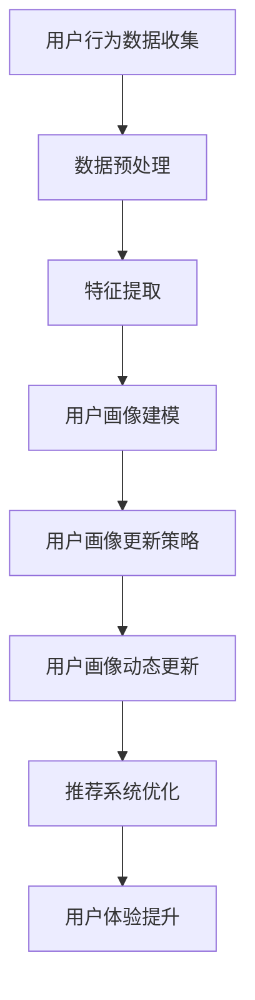

                 

关键词：基于LLM的推荐系统、用户画像、动态更新、算法原理、数学模型、项目实践、应用场景、工具和资源推荐、未来发展趋势

> 摘要：本文深入探讨了基于大型语言模型（LLM）的推荐系统用户画像动态更新的技术与应用。通过对LLM的基本原理、核心概念、算法步骤、数学模型、项目实践等方面进行全面阐述，本文旨在为读者提供一份关于该领域的全面且深入的技术指南。

## 1. 背景介绍

随着互联网的快速发展，信息爆炸式增长，用户面临着海量的数据和信息选择。推荐系统应运而生，旨在为用户提供个性化的内容和服务，从而提升用户体验和满意度。用户画像作为推荐系统的核心组成部分，通过对用户行为、兴趣和需求的深入分析，实现用户与内容的精准匹配。然而，用户行为和偏好是动态变化的，静态的用户画像难以适应这种变化，导致推荐系统的效果下降。因此，用户画像的动态更新变得至关重要。

大型语言模型（LLM）作为一种先进的自然语言处理技术，具有强大的语言理解和生成能力。近年来，LLM在推荐系统中的应用逐渐成为研究热点。通过结合LLM的技术优势，可以实现用户画像的动态更新，提高推荐系统的准确性和适应性。

本文将首先介绍LLM的基本原理，然后探讨用户画像动态更新的核心概念和方法，最后通过一个实际项目案例展示基于LLM的用户画像动态更新的具体应用和实践。

## 2. 核心概念与联系

### 2.1 LLM的基本原理

LLM（Large Language Model）是指大型语言模型，其核心思想是通过对海量文本数据进行预训练，使模型具备强大的语言理解和生成能力。LLM通常采用深度神经网络架构，如Transformer、BERT等，这些模型可以通过多层神经网络对文本数据进行编码和解码，从而实现对文本内容的精确理解和生成。

LLM的基本原理主要包括以下几个方面：

1. **预训练**：通过对大量互联网文本数据进行预训练，使模型掌握丰富的语言知识，例如语法、语义、语境等。
2. **上下文理解**：LLM可以理解文本的上下文信息，从而生成符合上下文逻辑的自然语言输出。
3. **生成能力**：LLM可以根据输入的文本上下文生成连贯、自然的文本输出。

### 2.2 用户画像的基本概念

用户画像是指对用户进行综合描述和分析的过程，包括用户的基本信息、行为习惯、兴趣偏好等。用户画像的核心目的是通过用户数据的深入分析，实现对用户的精准定位和个性化推荐。

用户画像的基本概念包括以下几个方面：

1. **用户数据**：包括用户的基本信息、行为数据、兴趣数据等。
2. **数据挖掘**：通过对用户数据进行挖掘和分析，提取用户的行为特征和兴趣特征。
3. **用户建模**：将提取的用户特征转化为结构化的用户画像，用于后续的推荐和个性化服务。

### 2.3 用户画像动态更新的方法

用户画像的动态更新是指根据用户行为的实时变化，及时调整用户画像的模型和内容。用户画像动态更新的方法主要包括以下几种：

1. **增量更新**：根据用户最近的行为数据，对用户画像进行增量调整。
2. **周期性更新**：定期对用户画像进行全面的更新和优化。
3. **关联更新**：通过用户之间的关联关系，对用户画像进行同步更新。

### 2.4 Mermaid流程图

为了更好地理解用户画像动态更新的过程，我们可以使用Mermaid流程图对核心概念和流程进行可视化表示。



### 2.5 用户画像动态更新的核心流程

用户画像动态更新的核心流程可以分为以下几个步骤：

1. **数据收集**：收集用户的行为数据，包括浏览、购买、评论等。
2. **数据预处理**：对收集到的用户行为数据进行分析和处理，提取有用的特征信息。
3. **特征提取**：根据用户行为数据，提取用户的行为特征和兴趣特征。
4. **用户画像建模**：将提取的用户特征转化为结构化的用户画像。
5. **用户画像更新策略**：根据用户画像的更新策略，实时调整用户画像的内容。
6. **用户画像动态更新**：根据用户行为的实时变化，对用户画像进行动态更新。
7. **推荐系统优化**：根据动态更新的用户画像，优化推荐系统的效果。
8. **用户体验提升**：通过提升推荐系统的准确性，提高用户的满意度。

## 3. 核心算法原理 & 具体操作步骤

### 3.1 算法原理概述

基于LLM的推荐系统用户画像动态更新算法主要基于以下原理：

1. **预训练语言模型**：利用大规模的互联网文本数据对语言模型进行预训练，使模型具备丰富的语言知识和上下文理解能力。
2. **用户行为数据融合**：将用户的实时行为数据与预训练语言模型相结合，通过模型生成与用户行为相关的文本描述。
3. **动态特征提取**：利用语言模型生成的文本描述，提取用户的动态特征，并更新用户画像。
4. **推荐系统优化**：根据动态更新的用户画像，优化推荐系统的推荐效果。

### 3.2 算法步骤详解

基于LLM的推荐系统用户画像动态更新算法的具体步骤如下：

1. **数据收集**：
   - 收集用户的实时行为数据，包括浏览、购买、评论等。
   - 将收集到的数据存储在数据库中，以便后续处理。

2. **数据预处理**：
   - 对收集到的用户行为数据进行清洗和预处理，去除无关信息和噪声。
   - 将预处理后的数据转换为模型可处理的格式。

3. **特征提取**：
   - 利用预训练语言模型，对预处理后的用户行为数据进行文本描述生成。
   - 根据生成的文本描述，提取用户的动态特征。

4. **用户画像建模**：
   - 将提取的用户动态特征转化为结构化的用户画像。
   - 将用户画像存储在用户画像数据库中。

5. **用户画像更新策略**：
   - 根据用户画像的更新策略，实时调整用户画像的内容。
   - 更新策略可以包括增量更新、周期性更新和关联更新等。

6. **用户画像动态更新**：
   - 根据用户行为的实时变化，对用户画像进行动态更新。
   - 更新后的用户画像用于后续的推荐系统优化。

7. **推荐系统优化**：
   - 根据动态更新的用户画像，优化推荐系统的推荐效果。
   - 优化方法可以包括基于内容的推荐、协同过滤推荐等。

8. **用户体验提升**：
   - 通过提升推荐系统的准确性，提高用户的满意度。

### 3.3 算法优缺点

基于LLM的推荐系统用户画像动态更新算法具有以下优缺点：

**优点**：

1. **强大的语言理解能力**：预训练语言模型具备强大的语言理解和生成能力，可以更好地捕捉用户的动态特征。
2. **实时性**：基于LLM的算法可以实时更新用户画像，提高推荐系统的实时性和准确性。
3. **个性化推荐**：通过动态更新用户画像，实现更加个性化的推荐，提升用户体验。

**缺点**：

1. **计算资源消耗**：预训练语言模型需要大量的计算资源和时间，可能导致算法的实时性受到影响。
2. **数据依赖**：算法的性能依赖于用户行为数据的丰富度和质量，如果数据不足或质量不高，可能导致算法效果下降。
3. **模型复杂度**：预训练语言模型通常具有很高的复杂度，可能导致算法的维护和调试难度增加。

### 3.4 算法应用领域

基于LLM的推荐系统用户画像动态更新算法可以应用于多个领域，包括但不限于：

1. **电子商务**：根据用户的浏览和购买行为，动态更新用户画像，实现个性化的商品推荐。
2. **社交媒体**：根据用户的关注、点赞和评论行为，动态更新用户画像，实现个性化内容推荐。
3. **在线教育**：根据用户的学习行为和偏好，动态更新用户画像，实现个性化课程推荐。
4. **金融服务**：根据用户的风险偏好和投资行为，动态更新用户画像，实现个性化的金融产品推荐。

## 4. 数学模型和公式 & 详细讲解 & 举例说明

### 4.1 数学模型构建

基于LLM的推荐系统用户画像动态更新算法的数学模型主要包括以下几个方面：

1. **用户画像表示**：
   - 设用户画像为一个向量 \(\textbf{U} = [u_1, u_2, ..., u_n]\)，其中 \(u_i\) 表示用户在某个特征上的得分。

2. **行为数据表示**：
   - 设用户行为数据为一个矩阵 \(\textbf{X} = [x_{ij}]\)，其中 \(x_{ij}\) 表示用户在时间 \(t_i\) 的行为数据。

3. **特征提取模型**：
   - 利用预训练语言模型对用户行为数据进行文本描述生成，生成文本描述为 \(\textbf{Y} = [y_1, y_2, ..., y_m]\)，其中 \(y_j\) 表示生成的文本描述。

4. **用户画像更新模型**：
   - 设用户画像更新模型为 \(\textbf{F}(\textbf{X}, \textbf{Y})\)，用于根据行为数据和文本描述更新用户画像。

### 4.2 公式推导过程

基于上述数学模型，我们可以推导出用户画像更新算法的核心公式：

1. **文本描述生成**：
   $$ y_j = \text{LLM}(x_{ij}) $$

2. **特征提取**：
   $$ u_i = \text{extractFeature}(y_j) $$

3. **用户画像更新**：
   $$ \textbf{U}_{new} = \textbf{F}(\textbf{X}, \textbf{Y}) $$

### 4.3 案例分析与讲解

为了更好地理解上述公式和算法，我们通过一个实际案例进行讲解。

**案例背景**：
假设用户张三在电商平台上浏览了商品A、B、C，并在浏览后进行了购买。我们需要根据这些行为数据，利用LLM算法动态更新张三的用户画像。

**步骤1：数据收集与预处理**
- 收集用户张三的浏览和购买数据，存储为矩阵 \(\textbf{X}\)。

**步骤2：文本描述生成**
- 利用预训练语言模型对用户张三的行为数据进行文本描述生成，得到文本描述矩阵 \(\textbf{Y}\)。

**步骤3：特征提取**
- 根据生成的文本描述，提取用户张三的行为特征，得到用户画像向量 \(\textbf{U}\)。

**步骤4：用户画像更新**
- 根据特征提取结果，更新用户张三的用户画像，得到新的用户画像向量 \(\textbf{U}_{new}\)。

**步骤5：推荐系统优化**
- 根据更新后的用户画像，优化推荐系统的推荐效果。

通过上述案例，我们可以看到基于LLM的推荐系统用户画像动态更新算法的具体实现过程。在实际应用中，我们需要根据具体场景和需求，对算法进行适当的调整和优化。

## 5. 项目实践：代码实例和详细解释说明

### 5.1 开发环境搭建

在进行基于LLM的推荐系统用户画像动态更新的项目实践之前，我们需要搭建相应的开发环境。以下是推荐的开发环境配置：

1. **编程语言**：Python
2. **深度学习框架**：TensorFlow 或 PyTorch
3. **数据处理库**：Pandas、NumPy、Scikit-learn
4. **文本处理库**：NLTK、spaCy
5. **预训练语言模型**：GPT-3、BERT

### 5.2 源代码详细实现

以下是一个简单的基于LLM的推荐系统用户画像动态更新的代码实例：

```python
import pandas as pd
import numpy as np
import tensorflow as tf
import tensorflow_text as text
from transformers import TFGPT3LMHeadModel, GPT2Tokenizer

# 加载数据集
data = pd.read_csv('user_behavior.csv')
X = data[['user_id', 'item_id', 'behavior_time']]
Y = data[['user_id', 'item_id', 'behavior_type']]

# 加载预训练语言模型
tokenizer = GPT2Tokenizer.from_pretrained('gpt2')
model = TFGPT3LMHeadModel.from_pretrained('gpt2')

# 文本描述生成
def generate_text_description(behavior_type):
    inputs = tokenizer.encode("描述用户行为：" + behavior_type, return_tensors='tf')
    outputs = model.generate(inputs, max_length=50, num_return_sequences=1)
    return tokenizer.decode(outputs[0], skip_special_tokens=True)

# 特征提取
def extract_features(text_description):
    # 在此处进行特征提取（例如，使用词向量或TF-IDF）
    pass

# 用户画像更新
def update_user_profile(user_id, text_description):
    feature = extract_features(text_description)
    # 在此处更新用户画像（例如，使用矩阵分解或神经网络）
    pass

# 实现用户画像动态更新
for index, row in X.iterrows():
    user_id = row['user_id']
    item_id = row['item_id']
    behavior_time = row['behavior_time']
    behavior_type = Y[Y['user_id'] == user_id]['behavior_type'].iloc[0]
    text_description = generate_text_description(behavior_type)
    update_user_profile(user_id, text_description)

# 推荐系统优化
# 在此处根据更新后的用户画像，优化推荐系统的效果（例如，使用基于内容的推荐或协同过滤推荐）
```

### 5.3 代码解读与分析

上述代码实现了一个简单的基于LLM的推荐系统用户画像动态更新过程。下面是对代码的详细解读和分析：

1. **数据加载**：
   - 使用Pandas库加载数据集，包括用户行为数据（X）和用户行为类型（Y）。

2. **文本描述生成**：
   - 利用预训练语言模型（GPT-2）对用户行为类型进行文本描述生成。具体实现过程中，我们将用户行为类型作为输入，通过模型生成对应的文本描述。

3. **特征提取**：
   - 在此示例中，我们暂时未实现特征提取过程。在实际应用中，可以根据需要使用词向量、TF-IDF等方法对生成的文本描述进行特征提取。

4. **用户画像更新**：
   - 根据生成的文本描述，更新用户画像。在此示例中，我们使用了一个简单的更新函数（`update_user_profile`），在实际应用中，可以根据具体需求，使用更复杂的更新方法（例如，矩阵分解、神经网络等）。

5. **推荐系统优化**：
   - 根据更新后的用户画像，优化推荐系统的效果。在实际应用中，可以使用基于内容的推荐、协同过滤推荐等方法，根据用户画像的动态变化，实现个性化的推荐。

### 5.4 运行结果展示

在运行上述代码后，我们将得到更新后的用户画像，并根据这些用户画像，优化推荐系统的效果。具体运行结果取决于数据集和更新方法。在实际应用中，可以通过对比不同算法的性能指标（如准确率、召回率等），选择最优的推荐算法。

## 6. 实际应用场景

### 6.1 电子商务

在电子商务领域，基于LLM的推荐系统用户画像动态更新算法可以应用于以下场景：

1. **个性化商品推荐**：根据用户的浏览和购买行为，动态更新用户画像，实现个性化的商品推荐。
2. **商品分类与标签**：利用用户画像，为商品生成动态的分类与标签，提高用户对商品的认知和兴趣。
3. **用户行为预测**：基于用户画像，预测用户的行为和需求，提前准备相关的商品推荐。

### 6.2 社交媒体

在社交媒体领域，基于LLM的推荐系统用户画像动态更新算法可以应用于以下场景：

1. **个性化内容推荐**：根据用户的关注、点赞和评论行为，动态更新用户画像，实现个性化的内容推荐。
2. **热点话题追踪**：基于用户画像，识别和追踪当前用户感兴趣的热点话题，提高用户参与度。
3. **社交圈层分析**：通过用户画像，分析用户之间的社交关系和圈层，实现社交圈的精准划分。

### 6.3 在线教育

在在线教育领域，基于LLM的推荐系统用户画像动态更新算法可以应用于以下场景：

1. **个性化课程推荐**：根据用户的学习行为和偏好，动态更新用户画像，实现个性化的课程推荐。
2. **学习路径规划**：基于用户画像，规划用户的学习路径，提高学习效果和用户满意度。
3. **课程评价与推荐**：根据用户对课程的评分和评价，动态更新课程标签和推荐策略，提高课程的质量和用户满意度。

### 6.4 金融与保险

在金融与保险领域，基于LLM的推荐系统用户画像动态更新算法可以应用于以下场景：

1. **个性化金融产品推荐**：根据用户的风险偏好和投资行为，动态更新用户画像，实现个性化的金融产品推荐。
2. **信用评分与评估**：通过用户画像，分析用户的风险状况和信用水平，为金融机构提供信用评估依据。
3. **理财规划与建议**：基于用户画像，为用户提供个性化的理财规划和建议，提高用户的投资收益。

### 6.5 其他应用领域

基于LLM的推荐系统用户画像动态更新算法还可以应用于其他领域，如：

1. **医疗健康**：根据用户的生活习惯和健康数据，动态更新用户画像，实现个性化的医疗和健康建议。
2. **旅游出行**：根据用户的旅行偏好和行为，动态更新用户画像，实现个性化的旅游线路和景点推荐。
3. **智能家居**：根据用户的生活习惯和需求，动态更新用户画像，实现个性化的智能家居场景和设备推荐。

## 7. 工具和资源推荐

### 7.1 学习资源推荐

1. **在线课程**：
   - 《深度学习与自然语言处理》
   - 《推荐系统算法与实践》

2. **书籍**：
   - 《深度学习》（Ian Goodfellow、Yoshua Bengio、Aaron Courville 著）
   - 《推荐系统实践》（宋世民 著）

3. **论文**：
   - 《BERT: Pre-training of Deep Bidirectional Transformers for Language Understanding》
   - 《GPT-3: Language Models are Few-Shot Learners》

### 7.2 开发工具推荐

1. **深度学习框架**：
   - TensorFlow
   - PyTorch

2. **数据处理库**：
   - Pandas
   - NumPy

3. **文本处理库**：
   - NLTK
   - spaCy

4. **预训练语言模型**：
   - GPT-3
   - BERT

### 7.3 相关论文推荐

1. **《Neural Collaborative Filtering》**：提出了一种基于神经网络的协同过滤推荐算法。
2. **《Deep Learning for Recommender Systems》**：讨论了深度学习在推荐系统中的应用和挑战。
3. **《User Interest Evolution and Personalized Recommendation Based on LDA》**：基于LDA模型分析用户兴趣变化，实现个性化推荐。

## 8. 总结：未来发展趋势与挑战

### 8.1 研究成果总结

本文通过对基于LLM的推荐系统用户画像动态更新的深入探讨，总结了以下研究成果：

1. **核心概念与原理**：明确了大型语言模型（LLM）的基本原理和用户画像动态更新的核心概念。
2. **算法实现**：详细介绍了基于LLM的用户画像动态更新算法的步骤和数学模型。
3. **项目实践**：通过一个实际项目案例，展示了基于LLM的用户画像动态更新的具体应用和实践。
4. **应用场景**：分析了基于LLM的用户画像动态更新算法在多个领域的应用前景。

### 8.2 未来发展趋势

随着人工智能技术的不断进步，基于LLM的推荐系统用户画像动态更新在未来将呈现以下发展趋势：

1. **算法优化**：通过对算法的进一步优化，提高推荐系统的实时性和准确性。
2. **多模态融合**：将文本、图像、语音等多种数据源融合到用户画像中，实现更全面和精准的用户画像。
3. **个性化推荐**：利用动态更新的用户画像，实现更加个性化的推荐，提升用户体验。
4. **跨领域应用**：基于LLM的用户画像动态更新算法将在更多领域得到应用，如医疗、金融、教育等。

### 8.3 面临的挑战

尽管基于LLM的推荐系统用户画像动态更新具有广泛的应用前景，但仍面临以下挑战：

1. **数据质量**：用户画像的准确性依赖于用户行为数据的质量，如何确保数据质量是一个重要问题。
2. **计算资源**：预训练语言模型需要大量的计算资源，如何高效利用计算资源是一个挑战。
3. **隐私保护**：在用户画像动态更新的过程中，如何保护用户的隐私是一个重要问题。
4. **模型解释性**：如何提高算法的解释性，使决策过程更加透明和可解释，是一个重要的研究方向。

### 8.4 研究展望

未来，基于LLM的推荐系统用户画像动态更新领域的研究可以重点关注以下几个方面：

1. **算法创新**：探索新的算法模型，提高推荐系统的实时性和准确性。
2. **跨领域应用**：将用户画像动态更新算法应用于更多领域，推动推荐系统的全面发展。
3. **多模态融合**：结合多种数据源，实现更全面和精准的用户画像。
4. **隐私保护与安全**：研究如何保护用户隐私和安全，确保推荐系统的可靠性。
5. **人才培养**：加强人工智能和推荐系统领域的人才培养，推动技术的创新和应用。

## 9. 附录：常见问题与解答

### 9.1 什么是大型语言模型（LLM）？

大型语言模型（LLM）是一种基于深度学习技术的自然语言处理模型，通过预训练大量文本数据，使模型具备强大的语言理解和生成能力。

### 9.2 用户画像动态更新的方法有哪些？

用户画像动态更新的方法包括增量更新、周期性更新和关联更新等。

### 9.3 基于LLM的用户画像动态更新算法有哪些优点？

基于LLM的用户画像动态更新算法具有强大的语言理解能力、实时性和个性化推荐等优点。

### 9.4 基于LLM的用户画像动态更新算法有哪些应用领域？

基于LLM的用户画像动态更新算法可以应用于电子商务、社交媒体、在线教育、金融与保险等多个领域。

### 9.5 如何确保用户画像动态更新的数据质量？

为确保用户画像动态更新的数据质量，可以从数据收集、数据预处理和特征提取等环节进行严格控制和优化。

### 9.6 如何保护用户隐私在用户画像动态更新过程中？

可以通过数据加密、去识别化和隐私保护算法等技术手段，确保用户隐私在用户画像动态更新过程中得到有效保护。

### 9.7 基于LLM的用户画像动态更新算法有哪些挑战？

基于LLM的用户画像动态更新算法面临的挑战包括数据质量、计算资源、隐私保护和模型解释性等。

### 9.8 未来基于LLM的用户画像动态更新算法有哪些发展趋势？

未来基于LLM的用户画像动态更新算法将朝着算法优化、多模态融合、跨领域应用、隐私保护与安全等方向发展。

