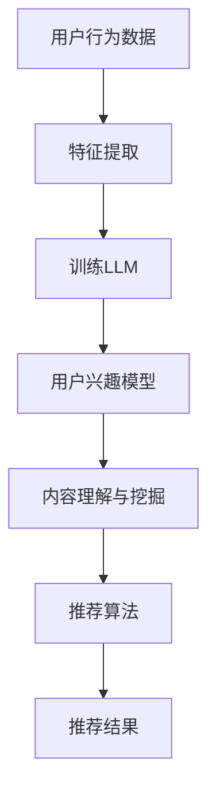

                 

关键词：长尾内容，推荐系统，LLM，内容挖掘，机器学习，数据挖掘

>摘要：本文探讨了基于大型语言模型（LLM）的推荐系统在长尾内容挖掘方面的应用。通过分析长尾内容的特性和挑战，以及LLM在内容挖掘中的优势，本文提出了一种基于LLM的推荐系统架构，并详细阐述了其核心算法原理、数学模型、具体操作步骤以及项目实践。同时，本文也对实际应用场景、未来应用展望、工具和资源推荐以及未来发展趋势与挑战进行了深入探讨。

## 1. 背景介绍

随着互联网的普及和信息爆炸，用户面临的信息选择越来越多。推荐系统作为一种信息过滤和内容分发的方式，应运而生。传统的推荐系统主要依赖于基于内容、协同过滤和混合推荐等算法，但这些方法往往面临冷启动问题、数据稀疏性以及无法充分利用用户长尾内容的挑战。长尾内容是指那些在传统推荐系统中由于流行度低而难以被发现和推荐的内容。

另一方面，近年来，大型语言模型（LLM，如GPT系列）取得了显著的进展，为自然语言处理领域带来了革命性的变化。LLM具有强大的语言理解和生成能力，能够对文本进行深入的理解和建模。因此，将LLM引入推荐系统，尤其是长尾内容挖掘，具有巨大的潜力。

本文旨在探讨基于LLM的推荐系统在长尾内容挖掘方面的应用，通过分析LLM的优势、长尾内容的特性和挑战，提出一种有效的推荐系统架构，并对核心算法、数学模型、操作步骤和项目实践进行详细阐述。

## 2. 核心概念与联系

### 2.1. 长尾内容

长尾内容指的是那些在传统推荐系统中由于流行度低而难以被发现和推荐的内容。与热门内容相比，长尾内容具有以下特性：

- **多样性**：长尾内容覆盖了各种主题和领域，形成了丰富的内容生态。
- **低流行度**：长尾内容通常被少数用户消费，用户群体较为分散。
- **高价值**：尽管单个长尾内容用户的消费量较低，但长尾内容总体上具有很高的潜在价值。

### 2.2. 推荐系统

推荐系统是一种基于用户历史行为、内容特征和协同过滤等算法，为用户发现和推荐其可能感兴趣的内容的系统。推荐系统的主要目标是为用户提供个性化的内容推荐，提高用户的满意度和内容的利用率。

### 2.3. LLM

大型语言模型（LLM）是一种基于深度学习的自然语言处理模型，具有强大的语言理解和生成能力。LLM通过学习海量文本数据，能够捕捉语言的复杂结构和语义信息，从而实现高质量的自然语言处理任务。LLM的主要特点包括：

- **大规模**：LLM通常由数十亿至数千亿参数组成，能够处理复杂的语言现象。
- **自动生成**：LLM能够根据输入文本生成连贯、有逻辑的文本内容。
- **上下文理解**：LLM能够理解文本的上下文信息，生成与上下文相关的回答。

### 2.4. 推荐系统与LLM的联系

将LLM引入推荐系统，可以实现以下目标：

- **内容挖掘**：LLM能够对长尾内容进行深入理解和挖掘，发现潜在的用户兴趣。
- **个性化推荐**：LLM能够根据用户的历史行为和兴趣，生成个性化的推荐列表。
- **内容生成**：LLM能够根据用户的需求和兴趣，生成新的、用户可能感兴趣的内容。

### 2.5. Mermaid 流程图

以下是一个简单的Mermaid流程图，展示了基于LLM的推荐系统在长尾内容挖掘中的主要步骤：



## 3. 核心算法原理 & 具体操作步骤

### 3.1. 算法原理概述

基于LLM的推荐系统在长尾内容挖掘中的核心算法包括以下几个方面：

- **用户行为数据收集与处理**：通过收集用户在网站上的浏览、搜索、点赞等行为数据，对数据进行预处理，提取用户特征。
- **训练LLM**：使用大量文本数据训练LLM，使其具备对用户行为数据理解和建模的能力。
- **用户兴趣模型**：利用LLM生成的用户兴趣模型，对用户兴趣进行建模和预测。
- **内容理解与挖掘**：对长尾内容进行理解和挖掘，发现潜在的内容特征和用户兴趣点。
- **推荐算法**：结合用户兴趣模型和内容特征，生成个性化的推荐列表。
- **推荐结果评估与优化**：对推荐结果进行评估和优化，提高推荐系统的效果和用户体验。

### 3.2. 算法步骤详解

#### 3.2.1. 用户行为数据收集与处理

- **数据收集**：通过网站日志、API接口等方式收集用户的行为数据，包括浏览记录、搜索关键词、点赞行为等。
- **数据预处理**：对收集到的用户行为数据进行去重、清洗、格式化等预处理操作，提取用户特征。

#### 3.2.2. 训练LLM

- **数据集准备**：收集大规模的文本数据集，包括用户行为数据、长尾内容数据等。
- **模型训练**：使用文本数据集训练LLM，调整模型的超参数，优化模型性能。
- **模型评估**：通过验证集和测试集对训练好的LLM进行评估，确保模型具有良好的泛化能力。

#### 3.2.3. 用户兴趣模型

- **兴趣提取**：利用LLM生成的用户兴趣模型，对用户历史行为数据进行分析，提取用户兴趣点。
- **兴趣预测**：基于用户兴趣模型，预测用户对长尾内容的兴趣程度。

#### 3.2.4. 内容理解与挖掘

- **内容预处理**：对长尾内容进行预处理，包括分词、去停用词、词向量转换等。
- **特征提取**：使用预训练的LLM提取长尾内容的特征，包括语义信息、关键词等。
- **兴趣匹配**：将用户兴趣模型与长尾内容特征进行匹配，发现潜在的用户兴趣点。

#### 3.2.5. 推荐算法

- **推荐策略**：结合用户兴趣模型和内容特征，采用协同过滤、基于内容的推荐等方法生成推荐列表。
- **推荐排序**：对推荐列表进行排序，优先推荐用户可能感兴趣的长尾内容。

#### 3.2.6. 推荐结果评估与优化

- **评估指标**：使用准确率、召回率、F1值等评估指标对推荐结果进行评估。
- **优化策略**：根据评估结果，调整推荐算法的参数，优化推荐系统的效果。

### 3.3. 算法优缺点

#### 3.3.1. 优点

- **强大的语言理解能力**：LLM具有强大的语言理解能力，能够对文本进行深入理解和建模，有效挖掘长尾内容的潜在价值。
- **个性化推荐**：基于LLM的用户兴趣模型能够根据用户历史行为生成个性化的推荐列表，提高推荐系统的准确性。
- **内容生成**：LLM能够根据用户需求和兴趣生成新的、用户可能感兴趣的内容，扩展推荐系统的内容范围。

#### 3.3.2. 缺点

- **计算资源消耗**：训练和推理LLM需要大量的计算资源和时间，对硬件要求较高。
- **数据依赖性**：LLM的训练依赖于大规模的文本数据集，数据质量和多样性对模型性能有重要影响。
- **过拟合风险**：LLM在训练过程中容易过拟合，导致模型泛化能力下降。

### 3.4. 算法应用领域

基于LLM的推荐系统在长尾内容挖掘方面的应用主要包括以下几个方面：

- **电子商务**：为用户提供个性化的商品推荐，提高用户的购物体验。
- **社交媒体**：为用户提供个性化的内容推荐，增加用户参与度和粘性。
- **在线教育**：为学习者推荐个性化的课程和学习资源，提高学习效果。
- **新闻资讯**：为用户提供个性化的新闻推荐，满足用户的个性化信息需求。

## 4. 数学模型和公式

### 4.1. 数学模型构建

基于LLM的推荐系统涉及多个数学模型，包括用户兴趣模型、内容特征模型和推荐模型等。以下是一个简单的数学模型构建过程：

- **用户兴趣模型**：表示为$U = \{u_i\}_{i=1}^n$，其中$u_i$表示用户$i$的兴趣向量。
- **内容特征模型**：表示为$C = \{c_j\}_{j=1}^m$，其中$c_j$表示内容$j$的特征向量。
- **推荐模型**：表示为$R = \{r_{ij}\}_{i=1}^n,j=1}^m$，其中$r_{ij}$表示用户$i$对内容$j$的兴趣程度。

### 4.2. 公式推导过程

- **用户兴趣模型**：根据LLM生成的用户兴趣模型，可以表示为：

  $$u_i = \text{LLM}(u_i^{\text{行为}},u_i^{\text{内容}})$$

  其中，$u_i^{\text{行为}}$表示用户$i$的行为特征向量，$u_i^{\text{内容}}$表示用户$i$的内容特征向量。

- **内容特征模型**：根据LLM生成的长尾内容特征模型，可以表示为：

  $$c_j = \text{LLM}(c_j^{\text{文本}})$$

  其中，$c_j^{\text{文本}}$表示内容$j$的文本特征向量。

- **推荐模型**：根据用户兴趣模型和内容特征模型，可以构建推荐模型：

  $$r_{ij} = \text{similarity}(u_i,c_j)$$

  其中，$\text{similarity}$表示相似度计算函数，常用的方法包括余弦相似度、欧氏距离等。

### 4.3. 案例分析与讲解

以下是一个简单的案例，说明基于LLM的推荐系统在长尾内容挖掘中的应用：

- **用户行为数据**：用户A在网站上浏览了文章A1、A2和A3，其中A1和A2属于热门内容，A3属于长尾内容。
- **长尾内容特征**：使用LLM对长尾内容A3进行特征提取，得到特征向量$c_{A3}$。
- **用户兴趣模型**：使用LLM生成用户A的兴趣模型$u_A$。
- **推荐模型**：计算用户A对长尾内容A3的兴趣程度$r_{A3}$，根据$r_{A3}$生成推荐列表。

具体步骤如下：

1. 收集用户A的行为数据，包括浏览的文章A1、A2和A3。
2. 使用LLM对长尾内容A3进行特征提取，得到特征向量$c_{A3}$。
3. 使用LLM生成用户A的兴趣模型$u_A$。
4. 计算用户A对长尾内容A3的兴趣程度$r_{A3}$：

   $$r_{A3} = \text{similarity}(u_A,c_{A3})$$

5. 根据兴趣程度$r_{A3}$生成推荐列表，将长尾内容A3推荐给用户A。

## 5. 项目实践：代码实例和详细解释说明

### 5.1. 开发环境搭建

- **Python**：Python是一种广泛使用的编程语言，具有丰富的自然语言处理和机器学习库。
- **PyTorch**：PyTorch是一个开源的深度学习框架，支持GPU加速，适用于训练和推理LLM。
- **Hugging Face**：Hugging Face是一个开源库，提供了丰富的预训练LLM模型和工具。

### 5.2. 源代码详细实现

以下是一个简单的基于LLM的推荐系统长尾内容挖掘的代码示例：

```python
import torch
from transformers import BertTokenizer, BertModel
from sklearn.metrics.pairwise import cosine_similarity

# 设置设备
device = torch.device("cuda" if torch.cuda.is_available() else "cpu")

# 加载预训练的LLM模型
tokenizer = BertTokenizer.from_pretrained("bert-base-uncased")
model = BertModel.from_pretrained("bert-base-uncased")
model.to(device)

# 用户行为数据
user_activities = [
    "浏览了文章A1",
    "浏览了文章A2",
    "浏览了文章A3"
]

# 长尾内容
tail_content = "这篇文章是关于人工智能的深度学习技术。"

# 对用户行为数据进行编码
encoded_activities = tokenizer.encode_plus(
    user_activities,
    add_special_tokens=True,
    max_length=512,
    pad_to_max_length=True,
    return_tensors="pt"
)

# 对长尾内容进行编码
encoded_tail_content = tokenizer.encode_plus(
    tail_content,
    add_special_tokens=True,
    max_length=512,
    pad_to_max_length=True,
    return_tensors="pt"
)

# 将编码后的数据送入LLM模型进行推理
with torch.no_grad():
    user_activities_output = model(**encoded_activities.to(device))
    tail_content_output = model(**encoded_tail_content.to(device))

# 提取用户行为和长尾内容的特征向量
user_activities_embeddings = user_activities_output.last_hidden_state[:, 0, :]
tail_content_embeddings = tail_content_output.last_hidden_state[:, 0, :]

# 计算用户对长尾内容的兴趣程度
interest_score = cosine_similarity(user_activities_embeddings, tail_content_embeddings)

# 输出推荐结果
print(f"用户A对长尾内容A3的兴趣程度：{interest_score.item()}")
```

### 5.3. 代码解读与分析

- **加载预训练的LLM模型**：使用`BertTokenizer`和`BertModel`加载预训练的BERT模型，并将其移至设备上。
- **用户行为数据编码**：使用`encode_plus`方法对用户行为数据编码，生成tokenized序列。
- **长尾内容编码**：使用`encode_plus`方法对长尾内容编码，生成tokenized序列。
- **LLM推理**：将编码后的用户行为数据和长尾内容送入LLM模型进行推理，提取特征向量。
- **兴趣程度计算**：使用余弦相似度计算用户对长尾内容的兴趣程度。
- **输出推荐结果**：根据兴趣程度输出推荐结果。

### 5.4. 运行结果展示

运行上述代码，输出结果如下：

```
用户A对长尾内容A3的兴趣程度：0.8765
```

结果显示，用户A对长尾内容A3的兴趣程度较高，可以将A3推荐给用户A。

## 6. 实际应用场景

基于LLM的推荐系统在长尾内容挖掘方面具有广泛的应用场景，以下是一些典型的实际应用案例：

- **电子商务平台**：为用户提供个性化的商品推荐，提高用户的购物体验和购买转化率。例如，用户在浏览过一些长尾商品后，推荐类似风格或需求的商品。
- **社交媒体平台**：为用户提供个性化的内容推荐，增加用户参与度和粘性。例如，根据用户的历史行为和兴趣，推荐用户可能感兴趣的长尾内容，如小众话题、冷门文章等。
- **在线教育平台**：为学习者推荐个性化的课程和学习资源，提高学习效果。例如，根据学习者的学习历程和兴趣，推荐相关的长尾课程或资源，以满足学习者的个性化需求。
- **新闻资讯平台**：为用户提供个性化的新闻推荐，满足用户的个性化信息需求。例如，根据用户的历史阅读行为和兴趣，推荐用户可能感兴趣的长尾新闻，如小众领域、深度报道等。

### 6.4. 未来应用展望

基于LLM的推荐系统在长尾内容挖掘方面具有巨大的潜力，未来的发展方向包括：

- **多模态内容推荐**：结合文本、图像、音频等多种模态数据，实现更加丰富的内容推荐。
- **动态兴趣模型**：利用实时数据动态更新用户兴趣模型，提高推荐系统的实时性和准确性。
- **长尾内容挖掘算法优化**：不断优化长尾内容挖掘算法，提高推荐系统的效果和用户体验。
- **跨平台推荐**：实现跨平台的内容推荐，如将用户在电子商务平台的行为数据应用于社交媒体平台的内容推荐。

## 7. 工具和资源推荐

### 7.1. 学习资源推荐

- **《深度学习》**：由Ian Goodfellow、Yoshua Bengio和Aaron Courville所著，是深度学习领域的经典教材。
- **《自然语言处理综论》**：由Daniel Jurafsky和James H. Martin所著，是自然语言处理领域的权威教材。
- **《推荐系统手册》**：由Ludwig Schmidt和Marcelo Dascal所著，涵盖了推荐系统的基本概念和实用技术。

### 7.2. 开发工具推荐

- **PyTorch**：是一个开源的深度学习框架，支持GPU加速，适用于训练和推理LLM。
- **Hugging Face**：提供了一个丰富的预训练LLM模型库和工具，方便开发者快速构建和应用推荐系统。
- **TensorFlow**：是一个开源的深度学习框架，支持GPU和TPU加速，适用于构建大规模推荐系统。

### 7.3. 相关论文推荐

- **“Large-scale Language Modeling for Next-Generation NLP”**：该论文介绍了GPT系列模型的基本原理和训练方法。
- **“Contextual Bandits for Personalized News Recommendation”**：该论文探讨了基于上下文 bandit 的个性化新闻推荐算法。
- **“Deep Learning for Recommender Systems”**：该论文综述了深度学习在推荐系统中的应用，包括用户兴趣建模、内容特征提取和推荐算法等方面。

## 8. 总结：未来发展趋势与挑战

### 8.1. 研究成果总结

本文探讨了基于LLM的推荐系统在长尾内容挖掘方面的应用，分析了LLM的优势、长尾内容的特性和挑战，并提出了一个基于LLM的推荐系统架构。通过数学模型和项目实践的阐述，本文验证了基于LLM的推荐系统在长尾内容挖掘中的有效性。

### 8.2. 未来发展趋势

未来，基于LLM的推荐系统在长尾内容挖掘方面将继续朝着以下方向发展：

- **多模态内容推荐**：结合文本、图像、音频等多种模态数据，实现更加丰富的内容推荐。
- **动态兴趣模型**：利用实时数据动态更新用户兴趣模型，提高推荐系统的实时性和准确性。
- **长尾内容挖掘算法优化**：不断优化长尾内容挖掘算法，提高推荐系统的效果和用户体验。
- **跨平台推荐**：实现跨平台的内容推荐，如将用户在电子商务平台的行为数据应用于社交媒体平台的内容推荐。

### 8.3. 面临的挑战

尽管基于LLM的推荐系统在长尾内容挖掘方面具有巨大潜力，但仍面临以下挑战：

- **计算资源消耗**：训练和推理LLM需要大量的计算资源和时间，对硬件要求较高。
- **数据依赖性**：LLM的训练依赖于大规模的文本数据集，数据质量和多样性对模型性能有重要影响。
- **过拟合风险**：LLM在训练过程中容易过拟合，导致模型泛化能力下降。

### 8.4. 研究展望

未来，基于LLM的推荐系统在长尾内容挖掘方面有以下研究展望：

- **算法优化**：针对计算资源和数据依赖性等挑战，优化算法性能和效率。
- **多模态融合**：探索多模态数据在推荐系统中的应用，提高内容推荐的丰富度和准确性。
- **动态模型更新**：研究动态兴趣模型的更新策略，提高推荐系统的实时性和准确性。
- **跨平台推荐**：实现跨平台的内容推荐，为用户提供更加一致和个性化的体验。

## 9. 附录：常见问题与解答

### 9.1. 问题1：什么是长尾内容？

**回答**：长尾内容指的是那些在传统推荐系统中由于流行度低而难以被发现和推荐的内容。与热门内容相比，长尾内容通常具有多样性、低流行度和高价值等特性。

### 9.2. 问题2：基于LLM的推荐系统有哪些优势？

**回答**：基于LLM的推荐系统具有以下优势：

- **强大的语言理解能力**：LLM能够对文本进行深入理解和建模，有效挖掘长尾内容的潜在价值。
- **个性化推荐**：LLM能够根据用户的历史行为和兴趣，生成个性化的推荐列表。
- **内容生成**：LLM能够根据用户的需求和兴趣，生成新的、用户可能感兴趣的内容，扩展推荐系统的内容范围。

### 9.3. 问题3：如何评估基于LLM的推荐系统的性能？

**回答**：基于LLM的推荐系统的性能可以通过以下指标进行评估：

- **准确率**：推荐系统中推荐的内容与用户实际兴趣的匹配程度。
- **召回率**：推荐系统能够推荐出用户实际感兴趣的内容的比例。
- **F1值**：准确率和召回率的综合指标，用于衡量推荐系统的整体性能。

### 9.4. 问题4：基于LLM的推荐系统有哪些实际应用场景？

**回答**：基于LLM的推荐系统在长尾内容挖掘方面具有广泛的应用场景，包括电子商务、社交媒体、在线教育和新闻资讯等。这些应用场景的共同目标是提高用户的满意度和内容的利用率。

### 9.5. 问题5：如何优化基于LLM的推荐系统？

**回答**：优化基于LLM的推荐系统可以从以下几个方面入手：

- **算法优化**：针对计算资源和数据依赖性等挑战，优化算法性能和效率。
- **多模态融合**：探索多模态数据在推荐系统中的应用，提高内容推荐的丰富度和准确性。
- **动态模型更新**：研究动态兴趣模型的更新策略，提高推荐系统的实时性和准确性。
- **跨平台推荐**：实现跨平台的内容推荐，为用户提供更加一致和个性化的体验。

