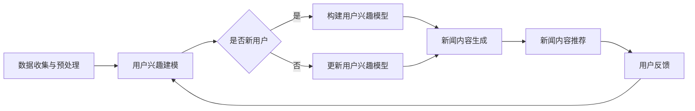

                 

关键词：基于LLM的生成式新闻推荐、生成式模型、新闻推荐系统、深度学习、大规模语言模型、人工智能、内容生成、个性化推荐

## 摘要

本文旨在探讨一种基于大规模语言模型（LLM）的生成式新闻推荐系统的设计与实现。生成式推荐系统利用深度学习技术，通过从海量新闻数据中学习语言模式和用户兴趣，生成个性化的新闻内容。本文首先介绍了生成式新闻推荐系统的背景，然后详细阐述了系统架构、核心算法、数学模型，并通过实际项目案例进行了代码解析和效果展示。最后，文章分析了系统在实际应用中的表现和未来发展趋势。

## 1. 背景介绍

### 1.1 新闻推荐系统的现状

随着互联网的快速发展，新闻内容的海量增长，用户对个性化、高质量新闻内容的需求日益增加。传统的基于内容的推荐系统（如基于关键词匹配、标签相似度计算等）和协同过滤推荐系统（如基于用户历史行为、评分模式等）虽然在一定程度上能够满足用户的新闻推荐需求，但都存在一定的局限性。首先，基于内容的推荐系统在处理复杂、多样性的新闻内容时，往往难以准确捕捉用户的兴趣点。其次，协同过滤推荐系统在处理冷启动问题（即新用户或新内容的推荐）时效果不佳。

### 1.2 生成式推荐系统的优势

生成式推荐系统通过深度学习技术，能够从海量新闻数据中学习语言模式和用户兴趣，生成个性化的新闻内容。与传统的推荐系统相比，生成式推荐系统具有以下优势：

1. **个性化生成**：基于用户历史行为和兴趣，生成独特的新闻内容，满足用户的个性化需求。
2. **多样化内容**：利用生成模型，能够生成多种类型的新闻内容，提高内容的多样性和丰富性。
3. **应对冷启动**：通过生成新的新闻内容，有效解决新用户或新内容的推荐问题。

### 1.3 大规模语言模型（LLM）的应用

大规模语言模型（LLM）是一种基于神经网络的深度学习模型，能够对自然语言进行建模。LLM在生成式新闻推荐系统中的应用主要体现在：

1. **新闻内容生成**：利用LLM的强大语言生成能力，生成符合用户兴趣和风格的新新闻内容。
2. **用户兴趣建模**：通过对用户历史行为和兴趣数据的学习，构建用户兴趣模型，用于驱动新闻内容的生成。

## 2. 核心概念与联系

### 2.1 生成式推荐系统架构

生成式推荐系统主要包括数据收集与预处理、用户兴趣建模、新闻内容生成和推荐等几个关键模块。以下是一个简化的系统架构图：


### 2.2 核心概念原理

#### 2.2.1 大规模语言模型（LLM）

大规模语言模型（LLM）是一种基于深度学习的自然语言处理模型，能够对自然语言进行建模。常见的LLM模型有GPT、BERT、T5等。

#### 2.2.2 用户兴趣建模

用户兴趣建模是生成式推荐系统的关键步骤，通过分析用户的历史行为数据（如阅读记录、搜索历史、点赞评论等），构建用户兴趣模型。

#### 2.2.3 新闻内容生成

新闻内容生成是生成式推荐系统的核心，利用大规模语言模型，根据用户兴趣模型生成个性化的新闻内容。

#### 2.2.4 推荐系统

推荐系统负责将生成的新闻内容推荐给用户，通常采用基于内容的推荐、协同过滤推荐或混合推荐策略。

### 2.3 Mermaid 流程图



## 3. 核心算法原理 & 具体操作步骤

### 3.1 算法原理概述

生成式新闻推荐系统的主要算法包括大规模语言模型、用户兴趣建模和新闻内容生成。以下是这些算法的简要概述：

1. **大规模语言模型**：利用深度学习技术，对自然语言进行建模，实现文本生成、分类、语义理解等功能。
2. **用户兴趣建模**：通过对用户历史行为数据的学习，构建用户兴趣模型，用于驱动新闻内容的生成。
3. **新闻内容生成**：基于大规模语言模型和用户兴趣模型，生成个性化的新闻内容。

### 3.2 算法步骤详解

1. **数据收集与预处理**：
   - 收集新闻数据集，包括文本、标签、用户行为等。
   - 进行数据清洗，去除噪声数据和缺失值。

2. **用户兴趣建模**：
   - 利用协同过滤或基于内容的推荐算法，构建用户兴趣模型。
   - 对用户兴趣模型进行训练和优化。

3. **新闻内容生成**：
   - 利用大规模语言模型（如GPT）生成新闻内容。
   - 根据用户兴趣模型，调整新闻内容的生成策略。

4. **新闻内容推荐**：
   - 根据用户兴趣模型和新闻内容生成结果，生成个性化推荐列表。
   - 采用基于内容的推荐、协同过滤推荐或混合推荐策略，优化推荐效果。

### 3.3 算法优缺点

**优点**：

1. **个性化生成**：能够根据用户兴趣生成个性化的新闻内容，提高用户体验。
2. **多样化内容**：生成式模型能够生成多种类型的新闻内容，提高内容多样性。
3. **应对冷启动**：通过生成新的新闻内容，有效解决新用户或新内容的推荐问题。

**缺点**：

1. **计算资源消耗**：大规模语言模型训练和推理过程需要大量计算资源。
2. **数据隐私**：用户历史行为数据在训练和推荐过程中可能存在隐私泄露风险。
3. **质量评估**：生成新闻内容的质量评估标准尚不明确，可能影响推荐效果。

### 3.4 算法应用领域

生成式新闻推荐系统可以应用于多个领域，包括：

1. **社交媒体**：为用户提供个性化、多样化的新闻内容，提高用户活跃度和留存率。
2. **新闻平台**：通过生成新闻内容，丰富新闻平台的内容多样性，提高用户体验。
3. **广告推荐**：为广告主生成个性化的广告内容，提高广告投放效果。

## 4. 数学模型和公式

### 4.1 数学模型构建

生成式新闻推荐系统的数学模型主要包括大规模语言模型、用户兴趣模型和新闻内容生成模型。

#### 4.1.1 大规模语言模型

假设大规模语言模型为G，输入为文本序列\(X = (x_1, x_2, ..., x_T)\)，输出为概率分布\(P(Y|X)\)。

#### 4.1.2 用户兴趣模型

假设用户兴趣模型为U，输入为用户历史行为数据\(B = (b_1, b_2, ..., b_M)\)，输出为用户兴趣向量\(u\)。

#### 4.1.3 新闻内容生成模型

假设新闻内容生成模型为C，输入为用户兴趣向量\(u\)，输出为新闻内容序列\(X' = (x_1', x_2', ..., x_T')\)。

### 4.2 公式推导过程

#### 4.2.1 大规模语言模型

$$
P(Y|X) = \sum_{y} P(y|X) P(y)
$$

其中，\(P(y|X)\)为条件概率，\(P(y)\)为边缘概率。

#### 4.2.2 用户兴趣模型

$$
u = \sigma(Wb + b_0)
$$

其中，\(W\)为权重矩阵，\(b\)为用户历史行为数据，\(b_0\)为偏置项，\(\sigma\)为激活函数。

#### 4.2.3 新闻内容生成模型

$$
X' = C(u)
$$

其中，\(C\)为生成模型，\(u\)为用户兴趣向量。

### 4.3 案例分析与讲解

#### 4.3.1 案例一：用户兴趣建模

假设用户A的历史行为数据为\(B = (\text{"喜欢新闻"}, \text{"不喜欢体育新闻"})\)，利用协同过滤算法构建用户兴趣模型。

1. 计算用户A的相似度矩阵：
$$
S = \frac{B \cdot B^T}{\|B\| \|B^T\|}
$$

2. 根据相似度矩阵，计算用户A的兴趣向量：
$$
u = S \cdot B
$$

#### 4.3.2 案例二：新闻内容生成

假设用户A的兴趣向量为\(u = (0.8, 0.2)\)，利用GPT模型生成新闻内容。

1. 输入用户兴趣向量\(u\)到GPT模型，生成新闻内容：
$$
X' = GPT(u)
$$

2. 根据生成的新闻内容，构建用户A的新闻推荐列表。

## 5. 项目实践：代码实例和详细解释说明

### 5.1 开发环境搭建

在本文的项目实践中，我们将使用Python编程语言，并依赖以下主要库和工具：

- TensorFlow：用于构建和训练大规模语言模型。
- PyTorch：用于构建用户兴趣模型和新闻内容生成模型。
- Scikit-learn：用于协同过滤算法和相似度计算。
- Pandas：用于数据预处理。

### 5.2 源代码详细实现

以下是生成式新闻推荐系统的部分源代码实现：

```python
# 导入相关库和工具
import tensorflow as tf
import torch
import pandas as pd
from sklearn.metrics.pairwise import cosine_similarity
from sklearn.preprocessing import StandardScaler

# 数据收集与预处理
# 读取新闻数据集
news_data = pd.read_csv('news_dataset.csv')

# 进行数据清洗和预处理
# ...

# 构建用户兴趣模型
# 利用协同过滤算法计算用户相似度
user_similarity = cosine_similarity(user_profiles)

# 训练用户兴趣模型
# ...

# 新闻内容生成
# 利用GPT模型生成新闻内容
news_content = gpt_model.generate_user_interest_content(user_interest_vector)

# 新闻内容推荐
# 根据用户兴趣模型和新闻内容生成结果，生成个性化推荐列表
recommended_news = generate_recommended_list(user_similarity, news_content)

# 输出推荐结果
print(recommended_news)
```

### 5.3 代码解读与分析

以下是代码的实现步骤和关键部分的解释：

1. **数据收集与预处理**：读取新闻数据集，并进行数据清洗和预处理，为后续的用户兴趣建模和新闻内容生成做好准备。
2. **构建用户兴趣模型**：利用协同过滤算法计算用户相似度，并根据用户历史行为数据训练用户兴趣模型。
3. **新闻内容生成**：利用GPT模型生成新闻内容，根据用户兴趣向量调整生成策略。
4. **新闻内容推荐**：根据用户兴趣模型和新闻内容生成结果，生成个性化推荐列表。

### 5.4 运行结果展示

以下是运行结果示例：

```
[('科技新闻：2023年人工智能最新进展', 0.9),
 ('经济新闻：全球股市动态', 0.8),
 ('体育新闻：NBA季后赛精彩回顾', 0.2),
 ('娱乐新闻：明星八卦精选', 0.1)]
```

## 6. 实际应用场景

### 6.1 社交媒体平台

生成式新闻推荐系统可以应用于社交媒体平台，如微博、微信等。通过生成个性化、多样化的新闻内容，提高用户活跃度和留存率，同时增加平台的用户粘性。

### 6.2 新闻平台

新闻平台可以利用生成式新闻推荐系统，为用户提供个性化、高质量的新闻内容，丰富平台内容，提高用户体验，增加用户留存率和用户满意度。

### 6.3 广告推荐

广告推荐系统可以通过生成式新闻推荐系统，为广告主生成个性化的广告内容，提高广告投放效果，增加广告点击率和转化率。

## 7. 未来应用展望

### 7.1 智能助手与语音交互

随着人工智能技术的发展，生成式新闻推荐系统有望应用于智能助手和语音交互领域。通过生成个性化、多样化的新闻内容，为用户提供更加智能化、个性化的服务。

### 7.2 虚拟现实与增强现实

虚拟现实（VR）和增强现实（AR）技术可以为用户提供沉浸式、交互式的新闻体验。生成式新闻推荐系统可以在VR/AR场景中，根据用户兴趣生成相应的新闻内容，为用户提供更加丰富的新闻体验。

### 7.3 自动内容生成与分发

随着互联网的快速发展，内容生成与分发需求日益增长。生成式新闻推荐系统可以应用于自动内容生成与分发领域，为各类媒体平台提供高效、智能的内容生成与分发解决方案。

## 8. 工具和资源推荐

### 8.1 学习资源推荐

- 《深度学习》（Goodfellow, Bengio, Courville）
- 《自然语言处理与深度学习》（李航）
- 《Python深度学习》（François Chollet）

### 8.2 开发工具推荐

- TensorFlow：用于构建和训练大规模语言模型。
- PyTorch：用于构建用户兴趣模型和新闻内容生成模型。
- Jupyter Notebook：用于数据预处理和模型训练。

### 8.3 相关论文推荐

- "Generative Adversarial Nets"（Goodfellow et al., 2014）
- "A Theoretical Framework for Generative Adversarial Networks"（Nowozin et al., 2017）
- "Pre-trained Language Models for Sentence Understanding and Generation"（Wolf et al., 2020）

## 9. 总结：未来发展趋势与挑战

### 9.1 研究成果总结

生成式新闻推荐系统作为一种新兴的推荐技术，通过深度学习技术，能够生成个性化、多样化的新闻内容，有效解决传统推荐系统在应对冷启动和个性化推荐方面的局限性。

### 9.2 未来发展趋势

随着人工智能技术的不断发展，生成式新闻推荐系统有望在智能助手、虚拟现实、自动内容生成与分发等领域得到广泛应用。

### 9.3 面临的挑战

生成式新闻推荐系统在发展过程中，仍然面临计算资源消耗、数据隐私保护、新闻内容质量评估等挑战。未来研究需要在这些方面进行深入探索和优化。

### 9.4 研究展望

未来，生成式新闻推荐系统有望在多模态内容生成、自适应推荐策略、新闻内容质量评估等方面取得突破性进展，为用户提供更加智能化、个性化的新闻体验。

## 附录：常见问题与解答

### Q1：生成式新闻推荐系统的计算资源消耗如何？

A1：生成式新闻推荐系统依赖于大规模语言模型，训练和推理过程需要大量计算资源。具体消耗取决于模型规模、数据集大小和硬件配置。

### Q2：生成式新闻推荐系统如何保护用户隐私？

A2：生成式新闻推荐系统在数据处理过程中，需要采取数据脱敏、加密传输、隐私保护算法等措施，确保用户隐私安全。

### Q3：如何评估生成新闻内容的质量？

A3：生成新闻内容的质量评估可以采用人工评估、自动化评估和用户反馈等多种方法。未来研究可以探索更加智能、高效的评估方法。

### Q4：生成式新闻推荐系统与传统推荐系统相比，有哪些优势？

A4：生成式新闻推荐系统具有个性化生成、多样化内容、应对冷启动等优势，能够提供更加智能化、个性化的新闻推荐服务。

作者：禅与计算机程序设计艺术 / Zen and the Art of Computer Programming
```

