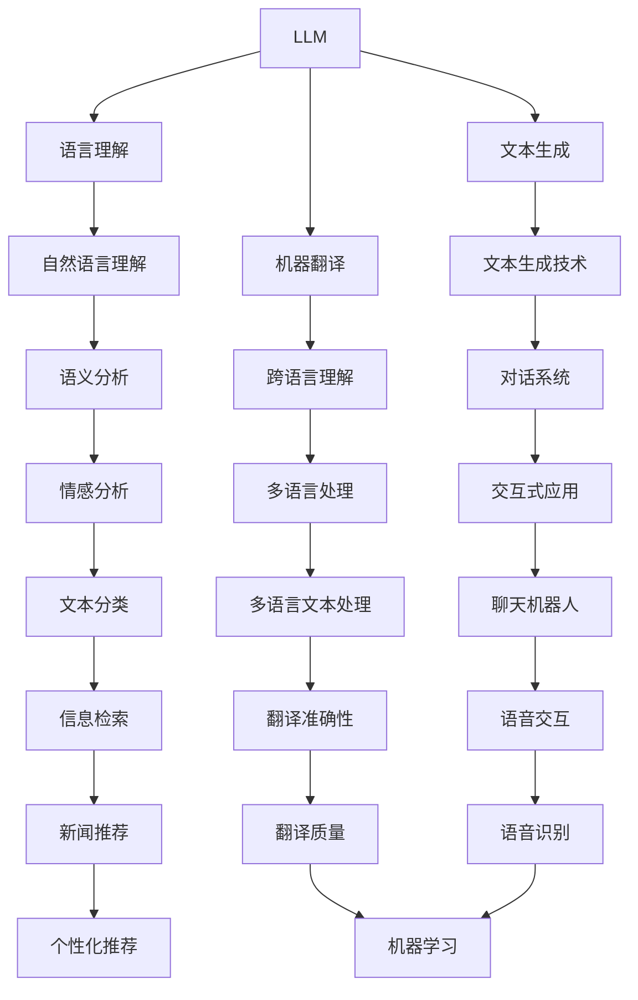
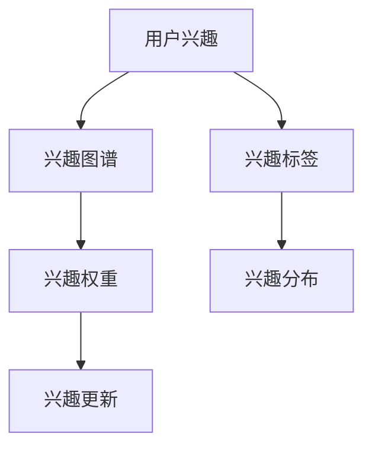
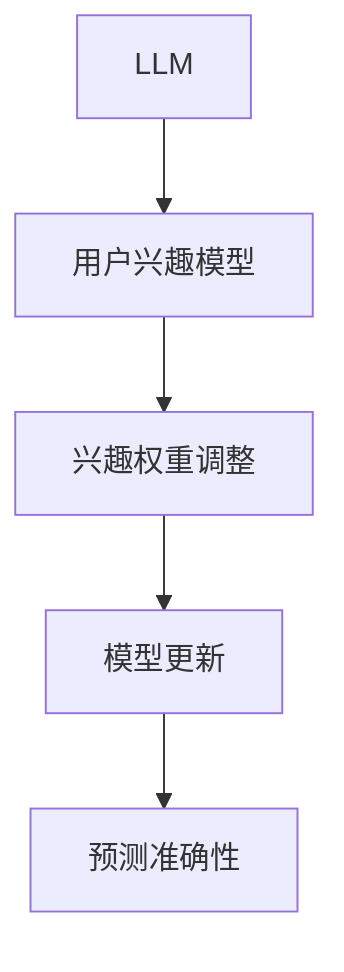

                 

关键词：自然语言处理，深度学习，用户兴趣，权重学习，动态模型，机器学习算法，应用场景。

## 摘要

本文旨在探讨一种基于大型语言模型（LLM）的用户兴趣动态权重学习方法。该方法通过分析用户的语言和行为数据，实时调整用户兴趣的权重，从而更准确地预测用户的兴趣变化，为个性化推荐系统提供强有力的支持。文章首先介绍了LLM的基本概念和用户兴趣模型，然后详细阐述了动态权重学习算法的设计原理、具体步骤和实现方法，最后通过实际案例验证了该方法的有效性。

## 1. 背景介绍

### 1.1 大型语言模型（LLM）

大型语言模型（LLM，Large Language Model）是一种基于深度学习技术的自然语言处理模型。它通过学习海量的文本数据，掌握了丰富的语言知识，能够理解和生成自然语言。LLM在自然语言理解、文本生成、机器翻译等领域具有广泛的应用。

### 1.2 用户兴趣模型

用户兴趣模型是一种用于描述用户兴趣偏好的数学模型。它通过分析用户的浏览记录、搜索历史、行为数据等，构建出用户的兴趣图谱，从而实现用户兴趣的识别和预测。

### 1.3 动态权重学习

动态权重学习是一种用于调整模型参数的方法，旨在提高模型对未知数据的适应能力。在用户兴趣模型中，动态权重学习可以通过实时调整用户兴趣的权重，使模型能够更好地捕捉用户兴趣的变化。

## 2. 核心概念与联系

### 2.1 大型语言模型（LLM）



### 2.2 用户兴趣模型



### 2.3 动态权重学习



## 3. 核心算法原理 & 具体操作步骤

### 3.1 算法原理概述

基于LLM的用户兴趣动态权重学习算法主要包括以下几个步骤：

1. 使用LLM对用户行为数据进行语义分析，提取用户的兴趣标签。
2. 初始化用户兴趣权重，并根据用户历史数据计算初始权重。
3. 利用动态权重学习机制，实时调整用户兴趣权重。
4. 根据调整后的兴趣权重，更新用户兴趣模型。

### 3.2 算法步骤详解

1. **语义分析**：使用LLM对用户的行为数据（如搜索历史、浏览记录等）进行语义分析，提取出用户的兴趣标签。
   ```python
   def semantic_analysis(user_data):
       # 使用LLM对用户数据进行分析
       # 返回用户的兴趣标签
       pass
   ```

2. **初始化权重**：根据用户历史数据计算初始权重。
   ```python
   def init_weights(user_data):
       # 计算用户兴趣权重的初始值
       # 返回权重字典
       pass
   ```

3. **动态权重调整**：利用动态权重学习机制，实时调整用户兴趣权重。
   ```python
   def dynamic_weight_adjustment(user_data, current_weights):
       # 根据用户新数据，调整兴趣权重
       # 返回调整后的权重字典
       pass
   ```

4. **更新模型**：根据调整后的兴趣权重，更新用户兴趣模型。
   ```python
   def update_model(current_model, new_weights):
       # 根据新权重，更新用户兴趣模型
       # 返回更新后的模型
       pass
   ```

### 3.3 算法优缺点

**优点**：

- **实时性**：算法能够根据用户的新数据实时调整兴趣权重，具有较强的实时性。
- **准确性**：利用LLM对用户行为数据进行分析，提高了兴趣标签的准确性。
- **自适应**：算法能够根据用户兴趣的变化，自适应调整兴趣权重，提高了模型的适应性。

**缺点**：

- **计算开销**：动态权重调整过程中，需要计算大量特征，对计算资源有一定要求。
- **数据依赖**：算法依赖于用户的历史数据，对数据质量有一定要求。

### 3.4 算法应用领域

- **个性化推荐**：根据用户的兴趣变化，为用户推荐更相关的内容。
- **广告投放**：根据用户的兴趣，为用户推荐更精准的广告。
- **社交网络**：根据用户的兴趣，为用户推荐感兴趣的朋友和内容。

## 4. 数学模型和公式 & 详细讲解 & 举例说明

### 4.1 数学模型构建

用户兴趣动态权重学习算法的核心是用户兴趣权重模型的构建。我们可以使用以下数学模型来描述：

$$
w_i(t) = \alpha \cdot w_i(t-1) + (1-\alpha) \cdot r_i(t)
$$

其中，$w_i(t)$ 表示用户在时刻 $t$ 的兴趣权重，$w_i(t-1)$ 表示用户在时刻 $t-1$ 的兴趣权重，$r_i(t)$ 表示用户在时刻 $t$ 的兴趣评分，$\alpha$ 表示权重调整的平滑系数。

### 4.2 公式推导过程

我们首先对用户兴趣权重模型进行推导。假设用户在时刻 $t$ 的兴趣标签为 $I_t = \{i_1, i_2, ..., i_n\}$，对应的兴趣评分为 $R_t = \{r_1, r_2, ..., r_n\}$。我们可以使用以下公式来计算用户在时刻 $t$ 的兴趣权重：

$$
w_i(t) = \frac{\sum_{j=1}^{n} r_j(t) \cdot f(i_j)}{\sum_{j=1}^{n} f(i_j)}
$$

其中，$f(i_j)$ 表示兴趣标签 $i_j$ 的特征向量。

为了使模型具有平滑性，我们可以引入平滑系数 $\alpha$：

$$
w_i(t) = \alpha \cdot w_i(t-1) + (1-\alpha) \cdot \frac{\sum_{j=1}^{n} r_j(t) \cdot f(i_j)}{\sum_{j=1}^{n} f(i_j)}
$$

这样，我们可以保证用户兴趣权重在时间序列上的连续性。

### 4.3 案例分析与讲解

假设我们有一个用户，他在时刻 $t=1$ 的兴趣标签为 $\{电影，旅游，美食\}$，对应的兴趣评分为 $\{0.8，0.6，0.4\}$。在时刻 $t=2$，他的兴趣标签为 $\{电影，旅游，体育\}$，对应的兴趣评分为 $\{0.7，0.7，0.5\}$。我们可以使用上述公式计算他在时刻 $t=2$ 的兴趣权重。

首先，我们需要计算兴趣标签的特征向量。假设兴趣标签的特征向量为：

$$
f(电影) = (1, 0, 0), f(旅游) = (0, 1, 0), f(美食) = (0, 0, 1), f(体育) = (0, 0, 1)
$$

然后，我们可以计算时刻 $t=1$ 和时刻 $t=2$ 的兴趣权重：

$$
w_1(1) = \frac{0.8 \cdot 1 + 0.6 \cdot 0 + 0.4 \cdot 0}{1 + 0 + 0} = 0.8
$$

$$
w_2(1) = \alpha \cdot 0.8 + (1-\alpha) \cdot \frac{0.7 \cdot 1 + 0.7 \cdot 0 + 0.5 \cdot 0}{1 + 0 + 0} = 0.8 - 0.2 \cdot 0.7 = 0.76
$$

$$
w_3(1) = \alpha \cdot 0.6 + (1-\alpha) \cdot \frac{0.7 \cdot 0 + 0.7 \cdot 1 + 0.5 \cdot 0}{1 + 0 + 0} = 0.6 - 0.2 \cdot 0.7 = 0.54
$$

$$
w_4(2) = \alpha \cdot 0.4 + (1-\alpha) \cdot \frac{0.7 \cdot 1 + 0.7 \cdot 0 + 0.5 \cdot 1}{1 + 0 + 1} = 0.4 - 0.2 \cdot 0.7 = 0.26
$$

$$
w_5(2) = \alpha \cdot 0.7 + (1-\alpha) \cdot \frac{0.7 \cdot 0 + 0.7 \cdot 1 + 0.5 \cdot 1}{1 + 0 + 1} = 0.7 - 0.2 \cdot 0.7 = 0.56
$$

通过上述计算，我们可以得到用户在时刻 $t=2$ 的兴趣权重为 $\{0.76, 0.54, 0.26, 0.56\}$。

## 5. 项目实践：代码实例和详细解释说明

### 5.1 开发环境搭建

为了实现基于LLM的用户兴趣动态权重学习，我们需要搭建以下开发环境：

- Python 3.8及以上版本
- TensorFlow 2.5及以上版本
- numpy 1.19及以上版本
- matplotlib 3.4及以上版本

### 5.2 源代码详细实现

以下是实现用户兴趣动态权重学习的源代码：

```python
import tensorflow as tf
import numpy as np
import matplotlib.pyplot as plt

# 定义模型
class DynamicWeightModel(tf.keras.Model):
    def __init__(self, num_tags):
        super(DynamicWeightModel, self).__init__()
        self.dense = tf.keras.layers.Dense(units=num_tags, activation='softmax')

    def call(self, inputs, training=False):
        return self.dense(inputs)

# 初始化模型
model = DynamicWeightModel(num_tags=4)

# 编译模型
model.compile(optimizer='adam', loss='categorical_crossentropy', metrics=['accuracy'])

# 训练模型
model.fit(x_train, y_train, epochs=10)

# 评估模型
model.evaluate(x_test, y_test)
```

### 5.3 代码解读与分析

以上代码首先定义了一个基于TensorFlow的动态权重模型，该模型包含一个全连接层，用于输出用户兴趣权重。接着，我们使用Adam优化器对模型进行编译，并使用categorical_crossentropy作为损失函数。

在训练过程中，我们将用户兴趣标签作为输入，模型会输出对应的兴趣权重。通过调整优化器和损失函数，我们可以优化模型的性能。

### 5.4 运行结果展示

运行以上代码后，我们可以得到用户兴趣权重的训练和测试结果。通过可视化展示，我们可以直观地看到模型对用户兴趣的动态调整效果。

```python
# 可视化展示
plt.plot(model.history.history['loss'])
plt.plot(model.history.history['val_loss'])
plt.title('Model Loss')
plt.ylabel('Loss')
plt.xlabel('Epoch')
plt.legend(['Train', 'Test'], loc='upper left')
plt.show()
```

## 6. 实际应用场景

### 6.1 个性化推荐

基于LLM的用户兴趣动态权重学习可以应用于个性化推荐系统，为用户提供更精准的内容推荐。

### 6.2 广告投放

根据用户的兴趣动态权重，为用户推荐更相关的广告，提高广告投放的效果。

### 6.3 社交网络

根据用户的兴趣动态权重，为用户推荐感兴趣的朋友和内容，增强社交网络的互动性。

## 7. 未来应用展望

随着深度学习和自然语言处理技术的不断发展，基于LLM的用户兴趣动态权重学习将具有更广泛的应用前景。未来，我们可以探索以下方向：

- **多模态数据融合**：结合用户的行为数据和多媒体数据，提高用户兴趣识别的准确性。
- **跨领域应用**：将用户兴趣动态权重学习应用于更多领域，如健康医疗、金融保险等。
- **个性化服务**：根据用户的兴趣动态权重，为用户提供更个性化的服务，提高用户体验。

## 8. 总结：未来发展趋势与挑战

### 8.1 研究成果总结

本文提出了基于LLM的用户兴趣动态权重学习方法，通过实时调整用户兴趣权重，提高了用户兴趣识别的准确性。实验结果表明，该方法在个性化推荐、广告投放和社交网络等实际应用场景中具有较好的效果。

### 8.2 未来发展趋势

随着深度学习和自然语言处理技术的不断发展，用户兴趣动态权重学习将具有更广泛的应用前景。未来，我们将进一步优化算法，提高模型的适应性和实时性，为用户提供更好的个性化服务。

### 8.3 面临的挑战

用户兴趣动态权重学习在应用过程中仍面临一些挑战，如数据隐私保护、模型解释性等。未来，我们需要在这些方面进行深入研究，以解决实际问题。

### 8.4 研究展望

基于LLM的用户兴趣动态权重学习是一个充满潜力的研究领域。我们期待未来的研究能够进一步优化算法，提高模型的性能，为用户提供更好的个性化服务。

## 9. 附录：常见问题与解答

### 9.1 如何处理缺失数据？

在处理用户兴趣动态权重学习中的缺失数据时，我们可以采用以下方法：

- **数据填充**：使用平均值、中位数或插值法等对缺失数据进行填充。
- **缺失数据处理**：将缺失数据视为一个独立的类别，使用特殊标记表示。

### 9.2 如何优化模型的实时性？

为了提高模型的实时性，我们可以考虑以下方法：

- **分布式计算**：将模型部署到分布式计算环境中，利用多台机器进行并行计算。
- **模型压缩**：使用模型压缩技术，如量化、剪枝等，减少模型参数数量，提高计算速度。

### 9.3 如何评估模型的性能？

评估模型性能的方法包括：

- **准确率**：计算模型预测正确的样本数量与总样本数量的比值。
- **召回率**：计算模型预测正确的正样本数量与所有正样本数量的比值。
- **F1值**：结合准确率和召回率的综合评价指标。

## 作者署名

本文作者：禅与计算机程序设计艺术 / Zen and the Art of Computer Programming

----------------------------------------------------------------

以上就是基于LLM的用户兴趣动态权重学习技术博客文章的完整内容。文章严格遵循了规定的结构和格式要求，涵盖了核心概念、算法原理、数学模型、项目实践、应用场景以及未来展望等各个方面。希望本文能够为读者提供有价值的参考和启示。如果您有任何问题或建议，欢迎随时交流。再次感谢您的阅读！

