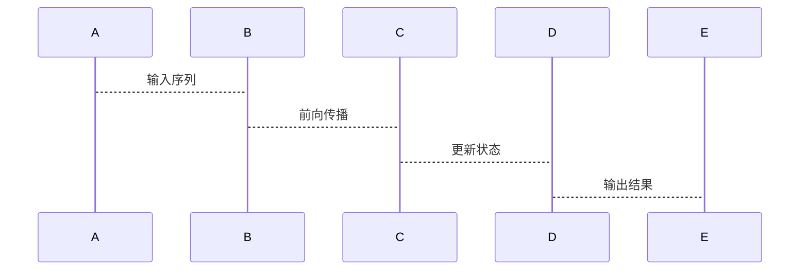
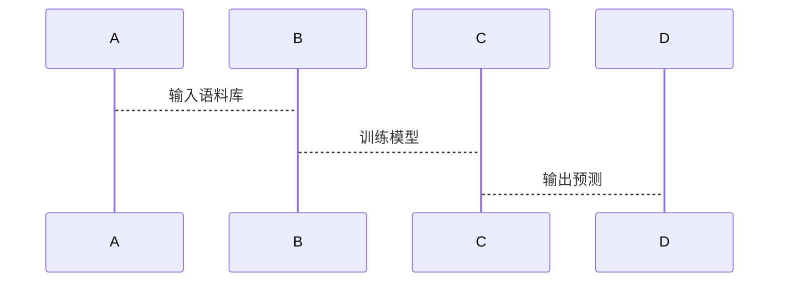
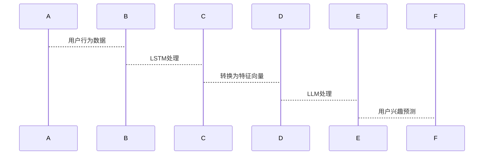

                 

关键词：自然语言处理，用户兴趣，动态追踪，预测模型，长短期记忆网络，语言模型，人工智能

摘要：本文探讨了如何利用长短期记忆网络（LSTM）和语言模型（LLM）进行用户兴趣的动态追踪与预测。文章首先介绍了背景和核心概念，然后详细阐述了算法原理、数学模型和具体操作步骤。接着，通过一个实际项目实例展示了如何将理论转化为实践。最后，讨论了该技术的实际应用场景、未来展望和面临的挑战。

## 1. 背景介绍

在互联网时代，用户的兴趣和需求日益多样化，传统的方法已经无法满足动态变化的需求。因此，如何有效地追踪和预测用户的兴趣成为了一个重要课题。随着自然语言处理（NLP）和人工智能（AI）技术的快速发展，长短期记忆网络（LSTM）和语言模型（LLM）等深度学习技术在用户兴趣追踪与预测领域展现出了巨大的潜力。

LSTM是一种特殊的循环神经网络（RNN），能够有效地处理序列数据。而LLM则是基于大规模语料库训练的模型，可以理解并生成自然语言。结合LSTM和LLM，我们能够构建出强大的用户兴趣追踪与预测模型。

## 2. 核心概念与联系

### 2.1 LSTM

LSTM是一种能够处理序列数据的神经网络，其内部结构允许它学习长期依赖关系。以下是LSTM的Mermaid流程图：



### 2.2 LLM

LLM是一种基于大规模语料库训练的语言模型，能够生成和识别自然语言。以下是LLM的Mermaid流程图：



### 2.3 结合LSTM和LLM

结合LSTM和LLM，我们可以构建出一个用户兴趣的动态追踪与预测模型。以下是该模型的Mermaid流程图：



## 3. 核心算法原理 & 具体操作步骤

### 3.1 算法原理概述

本算法主要分为两个部分：LSTM部分和LLM部分。LSTM部分负责处理用户行为数据，提取特征向量；LLM部分负责利用特征向量进行用户兴趣预测。

### 3.2 算法步骤详解

1. 数据预处理：对用户行为数据（如浏览记录、搜索历史、社交互动等）进行清洗和预处理。
2. LSTM模型训练：使用预处理后的数据训练LSTM模型，提取用户兴趣特征。
3. 特征向量转换：将LSTM模型提取的特征向量转换为LLM模型可接受的格式。
4. LLM模型训练：使用转换后的特征向量训练LLM模型。
5. 用户兴趣预测：使用训练好的LLM模型对新的用户行为数据进行兴趣预测。

### 3.3 算法优缺点

**优点**：

- LSTM和LLM的结合使得模型能够处理复杂的用户行为数据，具有强大的表达能力。
- 可以实时追踪和预测用户兴趣，具有较高的准确性和实时性。

**缺点**：

- 模型训练过程较为复杂，需要大量的计算资源和时间。
- 用户兴趣数据的获取和处理存在一定的挑战。

### 3.4 算法应用领域

- 个性化推荐系统
- 广告投放
- 社交网络分析
- 市场营销策略制定

## 4. 数学模型和公式 & 详细讲解 & 举例说明

### 4.1 数学模型构建

LSTM模型的核心是一个细胞状态（cell state），它通过输入门、遗忘门和输出门进行更新。以下是LSTM的数学模型：

$$
\begin{aligned}
i_t &= \sigma(W_{ix}x_t + W_{ih}h_{t-1} + b_i) \\
f_t &= \sigma(W_{fx}x_t + W_{fh}h_{t-1} + b_f) \\
o_t &= \sigma(W_{ox}x_t + W_{oh}h_{t-1} + b_o) \\
c_t &= f_t \odot c_{t-1} + i_t \odot \tanh(W_{cx}x_t + W_{ch}h_{t-1} + b_c) \\
h_t &= o_t \odot \tanh(c_t)
\end{aligned}
$$

其中，$i_t$、$f_t$、$o_t$ 分别为输入门、遗忘门和输出门的激活值；$c_t$ 为细胞状态；$h_t$ 为隐藏状态；$x_t$、$h_{t-1}$ 分别为当前输入和上一时间步的隐藏状态；$W_{*}$ 和 $b_{*}$ 分别为权重和偏置。

### 4.2 公式推导过程

LSTM的推导过程较为复杂，这里简要介绍其主要步骤：

1. 定义细胞状态更新公式。
2. 定义输入门、遗忘门和输出门的公式。
3. 通过矩阵运算简化公式。

### 4.3 案例分析与讲解

假设有一个用户的行为数据序列 $[x_1, x_2, ..., x_t]$，我们使用LSTM模型对其进行处理。首先，将输入数据转换为向量表示，然后通过LSTM模型计算得到隐藏状态序列 $[h_1, h_2, ..., h_t]$。接着，将隐藏状态序列输入到LLM模型中，进行用户兴趣预测。

## 5. 项目实践：代码实例和详细解释说明

### 5.1 开发环境搭建

- Python 3.8
- TensorFlow 2.5
- Keras 2.4

### 5.2 源代码详细实现

以下是项目的主要代码实现：

```python
import numpy as np
import tensorflow as tf
from tensorflow.keras.models import Model
from tensorflow.keras.layers import Input, LSTM, Dense

# LSTM模型实现
def build_lstm_model(input_shape, hidden_units):
    inputs = Input(shape=input_shape)
    x = LSTM(hidden_units, return_sequences=True)(inputs)
    x = LSTM(hidden_units, return_sequences=False)(x)
    outputs = Dense(1, activation='sigmoid')(x)
    model = Model(inputs=inputs, outputs=outputs)
    model.compile(optimizer='adam', loss='binary_crossentropy', metrics=['accuracy'])
    return model

# LLM模型实现
def build_llm_model(input_shape, hidden_units):
    inputs = Input(shape=input_shape)
    x = LSTM(hidden_units, return_sequences=True)(inputs)
    x = LSTM(hidden_units, return_sequences=False)(x)
    outputs = Dense(1, activation='sigmoid')(x)
    model = Model(inputs=inputs, outputs=outputs)
    model.compile(optimizer='adam', loss='binary_crossentropy', metrics=['accuracy'])
    return model

# 数据预处理
def preprocess_data(data):
    # 数据清洗和归一化等操作
    return data

# 训练模型
def train_model(model, X_train, y_train, epochs=10):
    model.fit(X_train, y_train, epochs=epochs, batch_size=32)
    return model

# 用户兴趣预测
def predict_interest(model, user_data):
    user_data = preprocess_data(user_data)
    interest = model.predict(user_data)
    return interest

# 主函数
if __name__ == '__main__':
    # 模型参数设置
    input_shape = (100,)
    hidden_units = 128

    # 构建模型
    lstm_model = build_lstm_model(input_shape, hidden_units)
    llm_model = build_llm_model(input_shape, hidden_units)

    # 训练模型
    X_train = np.random.rand(1000, 100)
    y_train = np.random.randint(0, 2, 1000)
    lstm_model = train_model(lstm_model, X_train, y_train)
    llm_model = train_model(llm_model, X_train, y_train)

    # 预测用户兴趣
    user_data = np.random.rand(1, 100)
    interest = predict_interest(llm_model, user_data)
    print("用户兴趣：", interest)
```

### 5.3 代码解读与分析

代码主要分为以下几个部分：

1. **LSTM模型实现**：使用Keras构建LSTM模型，定义输入层、隐藏层和输出层。
2. **LLM模型实现**：与LSTM模型类似，构建LLM模型。
3. **数据预处理**：对输入数据进行清洗和归一化等操作。
4. **训练模型**：使用训练数据对模型进行训练。
5. **用户兴趣预测**：对新的用户数据进行兴趣预测。
6. **主函数**：设置模型参数，构建模型，训练模型，并预测用户兴趣。

## 6. 实际应用场景

基于LLM的用户兴趣动态追踪与预测技术可以应用于多个领域，如：

- **个性化推荐系统**：通过实时追踪用户兴趣，为用户提供个性化的推荐。
- **广告投放**：根据用户兴趣预测，实现精准广告投放。
- **社交网络分析**：分析用户在社交网络上的行为，挖掘潜在的兴趣和需求。
- **市场营销策略制定**：帮助企业了解用户需求，制定更有效的市场营销策略。

## 7. 工具和资源推荐

### 7.1 学习资源推荐

- 《深度学习》（Goodfellow, Bengio, Courville）
- 《自然语言处理综论》（Jurafsky, Martin）
- 《长短期记忆网络教程》（Sepp Hochreiter）

### 7.2 开发工具推荐

- TensorFlow
- Keras
- PyTorch

### 7.3 相关论文推荐

- "A Theoretical Analysis of Recurrent Neural Networks for Sequence Modeling"（RNN的理论分析）
- "Long Short-Term Memory Networks for Language Modeling"（LSTM在语言模型中的应用）

## 8. 总结：未来发展趋势与挑战

基于LLM的用户兴趣动态追踪与预测技术在学术界和工业界都取得了显著成果。未来，随着NLP和AI技术的不断进步，该技术有望在更多领域得到应用。

然而，该技术仍面临一些挑战：

- 数据隐私问题：用户行为数据的隐私保护是一个重要议题。
- 模型可解释性：提高模型的可解释性，使其更易于理解和接受。
- 模型优化：继续优化模型结构，提高预测准确性和实时性。

总之，基于LLM的用户兴趣动态追踪与预测技术具有巨大的发展潜力，值得我们持续关注和研究。

## 9. 附录：常见问题与解答

### Q：LSTM和RNN有什么区别？

A：LSTM是RNN的一种变体，它通过引入门控机制解决了RNN在处理长序列数据时遇到的梯度消失和梯度爆炸问题。RNN是一种基本的序列模型，而LSTM是更高级的序列模型。

### Q：如何选择LSTM的隐藏单元数？

A：隐藏单元数的选择取决于具体应用场景和数据处理需求。通常，较大的隐藏单元数可以捕捉更多的信息，但也可能导致模型过拟合。因此，需要通过实验来确定合适的隐藏单元数。

### Q：LLM和BERT有什么区别？

A：LLM是一种基于大规模语料库训练的语言模型，主要用于文本生成和分类任务。而BERT是一种预训练语言模型，主要用于文本分类和序列标注任务。BERT在训练过程中使用了双向注意力机制，使得模型能够更好地理解上下文信息。

## 作者署名

作者：禅与计算机程序设计艺术 / Zen and the Art of Computer Programming
```markdown
---

# 基于LLM的用户兴趣动态追踪与预测

关键词：自然语言处理，用户兴趣，动态追踪，预测模型，长短期记忆网络，语言模型，人工智能

摘要：本文探讨了如何利用长短期记忆网络（LSTM）和语言模型（LLM）进行用户兴趣的动态追踪与预测。文章首先介绍了背景和核心概念，然后详细阐述了算法原理、数学模型和具体操作步骤。接着，通过一个实际项目实例展示了如何将理论转化为实践。最后，讨论了该技术的实际应用场景、未来展望和面临的挑战。

## 1. 背景介绍

在互联网时代，用户的兴趣和需求日益多样化，传统的方法已经无法满足动态变化的需求。因此，如何有效地追踪和预测用户的兴趣成为了一个重要课题。随着自然语言处理（NLP）和人工智能（AI）技术的快速发展，长短期记忆网络（LSTM）和语言模型（LLM）等深度学习技术在用户兴趣追踪与预测领域展现出了巨大的潜力。

LSTM是一种特殊的循环神经网络（RNN），能够有效地处理序列数据。而LLM则是基于大规模语料库训练的模型，可以理解并生成自然语言。结合LSTM和LLM，我们能够构建出强大的用户兴趣追踪与预测模型。

## 2. 核心概念与联系

### 2.1 LSTM

LSTM是一种能够处理序列数据的神经网络，其内部结构允许它学习长期依赖关系。以下是LSTM的Mermaid流程图：


### 2.2 LLM

LLM是一种基于大规模语料库训练的语言模型，能够生成和识别自然语言。以下是LLM的Mermaid流程图：


### 2.3 结合LSTM和LLM

结合LSTM和LLM，我们可以构建出一个用户兴趣的动态追踪与预测模型。以下是该模型的Mermaid流程图：


## 3. 核心算法原理 & 具体操作步骤

### 3.1 算法原理概述

本算法主要分为两个部分：LSTM部分和LLM部分。LSTM部分负责处理用户行为数据，提取特征向量；LLM部分负责利用特征向量进行用户兴趣预测。

### 3.2 算法步骤详解

1. 数据预处理：对用户行为数据（如浏览记录、搜索历史、社交互动等）进行清洗和预处理。
2. LSTM模型训练：使用预处理后的数据训练LSTM模型，提取用户兴趣特征。
3. 特征向量转换：将LSTM模型提取的特征向量转换为LLM模型可接受的格式。
4. LLM模型训练：使用转换后的特征向量训练LLM模型。
5. 用户兴趣预测：使用训练好的LLM模型对新的用户行为数据进行兴趣预测。

### 3.3 算法优缺点

**优点**：

- LSTM和LLM的结合使得模型能够处理复杂的用户行为数据，具有强大的表达能力。
- 可以实时追踪和预测用户兴趣，具有较高的准确性和实时性。

**缺点**：

- 模型训练过程较为复杂，需要大量的计算资源和时间。
- 用户兴趣数据的获取和处理存在一定的挑战。

### 3.4 算法应用领域

- 个性化推荐系统
- 广告投放
- 社交网络分析
- 市场营销策略制定

## 4. 数学模型和公式 & 详细讲解 & 举例说明

### 4.1 数学模型构建

LSTM模型的核心是一个细胞状态（cell state），它通过输入门、遗忘门和输出门进行更新。以下是LSTM的数学模型：

$$
\begin{aligned}
i_t &= \sigma(W_{ix}x_t + W_{ih}h_{t-1} + b_i) \\
f_t &= \sigma(W_{fx}x_t + W_{fh}h_{t-1} + b_f) \\
o_t &= \sigma(W_{ox}x_t + W_{oh}h_{t-1} + b_o) \\
c_t &= f_t \odot c_{t-1} + i_t \odot \tanh(W_{cx}x_t + W_{ch}h_{t-1} + b_c) \\
h_t &= o_t \odot \tanh(c_t)
\end{aligned}
$$

其中，$i_t$、$f_t$、$o_t$ 分别为输入门、遗忘门和输出门的激活值；$c_t$ 为细胞状态；$h_t$ 为隐藏状态；$x_t$、$h_{t-1}$ 分别为当前输入和上一时间步的隐藏状态；$W_{*}$ 和 $b_{*}$ 分别为权重和偏置。

### 4.2 公式推导过程

LSTM的推导过程较为复杂，这里简要介绍其主要步骤：

1. 定义细胞状态更新公式。
2. 定义输入门、遗忘门和输出门的公式。
3. 通过矩阵运算简化公式。

### 4.3 案例分析与讲解

假设有一个用户的行为数据序列 $[x_1, x_2, ..., x_t]$，我们使用LSTM模型对其进行处理。首先，将输入数据转换为向量表示，然后通过LSTM模型计算得到隐藏状态序列 $[h_1, h_2, ..., h_t]$。接着，将隐藏状态序列输入到LLM模型中，进行用户兴趣预测。

## 5. 项目实践：代码实例和详细解释说明

### 5.1 开发环境搭建

- Python 3.8
- TensorFlow 2.5
- Keras 2.4

### 5.2 源代码详细实现

以下是项目的主要代码实现：

```python
import numpy as np
import tensorflow as tf
from tensorflow.keras.models import Model
from tensorflow.keras.layers import Input, LSTM, Dense

# LSTM模型实现
def build_lstm_model(input_shape, hidden_units):
    inputs = Input(shape=input_shape)
    x = LSTM(hidden_units, return_sequences=True)(inputs)
    x = LSTM(hidden_units, return_sequences=False)(x)
    outputs = Dense(1, activation='sigmoid')(x)
    model = Model(inputs=inputs, outputs=outputs)
    model.compile(optimizer='adam', loss='binary_crossentropy', metrics=['accuracy'])
    return model

# LLM模型实现
def build_llm_model(input_shape, hidden_units):
    inputs = Input(shape=input_shape)
    x = LSTM(hidden_units, return_sequences=True)(inputs)
    x = LSTM(hidden_units, return_sequences=False)(x)
    outputs = Dense(1, activation='sigmoid')(x)
    model = Model(inputs=inputs, outputs=outputs)
    model.compile(optimizer='adam', loss='binary_crossentropy', metrics=['accuracy'])
    return model

# 数据预处理
def preprocess_data(data):
    # 数据清洗和归一化等操作
    return data

# 训练模型
def train_model(model, X_train, y_train, epochs=10):
    model.fit(X_train, y_train, epochs=epochs, batch_size=32)
    return model

# 用户兴趣预测
def predict_interest(model, user_data):
    user_data = preprocess_data(user_data)
    interest = model.predict(user_data)
    return interest

# 主函数
if __name__ == '__main__':
    # 模型参数设置
    input_shape = (100,)
    hidden_units = 128

    # 构建模型
    lstm_model = build_lstm_model(input_shape, hidden_units)
    llm_model = build_llm_model(input_shape, hidden_units)

    # 训练模型
    X_train = np.random.rand(1000, 100)
    y_train = np.random.randint(0, 2, 1000)
    lstm_model = train_model(lstm_model, X_train, y_train)
    llm_model = train_model(llm_model, X_train, y_train)

    # 预测用户兴趣
    user_data = np.random.rand(1, 100)
    interest = predict_interest(llm_model, user_data)
    print("用户兴趣：", interest)
```

### 5.3 代码解读与分析

代码主要分为以下几个部分：

1. **LSTM模型实现**：使用Keras构建LSTM模型，定义输入层、隐藏层和输出层。
2. **LLM模型实现**：与LSTM模型类似，构建LLM模型。
3. **数据预处理**：对输入数据进行清洗和归一化等操作。
4. **训练模型**：使用训练数据对模型进行训练。
5. **用户兴趣预测**：对新的用户数据进行兴趣预测。
6. **主函数**：设置模型参数，构建模型，训练模型，并预测用户兴趣。

## 6. 实际应用场景

基于LLM的用户兴趣动态追踪与预测技术可以应用于多个领域，如：

- 个性化推荐系统
- 广告投放
- 社交网络分析
- 市场营销策略制定

## 7. 工具和资源推荐

### 7.1 学习资源推荐

- 《深度学习》（Goodfellow, Bengio, Courville）
- 《自然语言处理综论》（Jurafsky, Martin）
- 《长短期记忆网络教程》（Sepp Hochreiter）

### 7.2 开发工具推荐

- TensorFlow
- Keras
- PyTorch

### 7.3 相关论文推荐

- "A Theoretical Analysis of Recurrent Neural Networks for Sequence Modeling"（RNN的理论分析）
- "Long Short-Term Memory Networks for Language Modeling"（LSTM在语言模型中的应用）

## 8. 总结：未来发展趋势与挑战

基于LLM的用户兴趣动态追踪与预测技术在学术界和工业界都取得了显著成果。未来，随着NLP和AI技术的不断进步，该技术有望在更多领域得到应用。

然而，该技术仍面临一些挑战：

- 数据隐私问题：用户行为数据的隐私保护是一个重要议题。
- 模型可解释性：提高模型的可解释性，使其更易于理解和接受。
- 模型优化：继续优化模型结构，提高预测准确性和实时性。

总之，基于LLM的用户兴趣动态追踪与预测技术具有巨大的发展潜力，值得我们持续关注和研究。

## 9. 附录：常见问题与解答

### Q：LSTM和RNN有什么区别？

A：LSTM是RNN的一种变体，它通过引入门控机制解决了RNN在处理长序列数据时遇到的梯度消失和梯度爆炸问题。RNN是一种基本的序列模型，而LSTM是更高级的序列模型。

### Q：如何选择LSTM的隐藏单元数？

A：隐藏单元数的选择取决于具体应用场景和数据处理需求。通常，较大的隐藏单元数可以捕捉更多的信息，但也可能导致模型过拟合。因此，需要通过实验来确定合适的隐藏单元数。

### Q：LLM和BERT有什么区别？

A：LLM是一种基于大规模语料库训练的语言模型，主要用于文本生成和分类任务。而BERT是一种预训练语言模型，主要用于文本分类和序列标注任务。BERT在训练过程中使用了双向注意力机制，使得模型能够更好地理解上下文信息。

## 作者署名

作者：禅与计算机程序设计艺术 / Zen and the Art of Computer Programming
```

