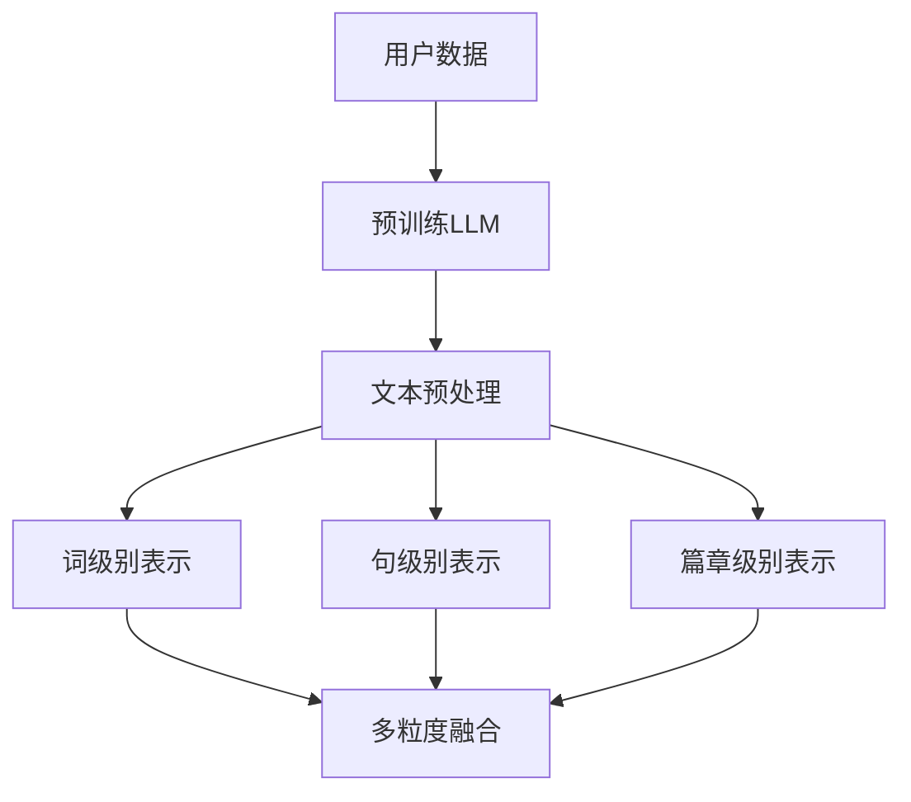

                 

关键词：Large Language Model, 用户兴趣，多粒度表示，机器学习，自然语言处理

摘要：随着互联网的快速发展和信息量的爆炸性增长，用户兴趣的挖掘和表示成为自然语言处理领域的重要研究方向。本文旨在探讨一种基于大型语言模型（LLM）的用户兴趣多粒度表示学习的方法，介绍其核心概念、算法原理、数学模型及其在实际应用场景中的实现。本文将为研究人员和开发者提供关于用户兴趣表示学习的深入理解，并探讨未来研究的方向。

## 1. 背景介绍

在当今数字化时代，用户生成的数据量呈指数级增长，如何有效挖掘和利用这些数据成为了企业关注的焦点。用户兴趣的挖掘和表示是信息检索、推荐系统、社交媒体分析等领域的关键技术。传统的用户兴趣表示方法主要基于关键词提取、语义分析等技术，但受限于对大规模语料库的处理能力和对用户复杂行为的理解，存在一定局限性。

近年来，深度学习和自然语言处理领域取得了显著的进展，尤其是大型语言模型（LLM）的出现，为用户兴趣的挖掘和表示提供了新的思路。LLM能够通过大规模预训练和自适应优化，捕捉用户文本数据的复杂模式和潜在关系，从而实现高效的用户兴趣表示。

本文将介绍一种基于LLM的用户兴趣多粒度表示学习的方法，旨在解决传统方法面临的挑战，提高用户兴趣挖掘的准确性和实用性。

## 2. 核心概念与联系

### 2.1. 大型语言模型（LLM）

大型语言模型（LLM）是基于深度学习技术的自然语言处理模型，通过在大规模语料库上进行预训练，LLM能够理解和生成人类语言。常见的LLM包括GPT、BERT、T5等。LLM的主要优势在于其强大的语言理解和生成能力，能够处理复杂的自然语言任务。

### 2.2. 用户兴趣挖掘

用户兴趣挖掘是指从用户生成的大量文本数据中提取出用户的兴趣点，从而为个性化推荐、信息检索等应用提供支持。传统的用户兴趣挖掘方法包括关键词提取、主题模型、协同过滤等。

### 2.3. 多粒度表示

多粒度表示是指将用户兴趣表示为不同层次的抽象概念，包括词级别、句级别、篇章级别等。多粒度表示能够更好地捕捉用户兴趣的多样性，提高表示的准确性和实用性。

### 2.4. Mermaid 流程图

Mermaid 是一种基于Markdown的图表绘制语言，能够方便地绘制流程图、时序图等。以下是一个描述用户兴趣多粒度表示学习的 Mermaid 流程图：



### 2.5. 核心概念原理和架构

在用户兴趣多粒度表示学习中，核心概念包括：

- **文本预处理**：对用户生成的文本数据进行清洗、分词、去停用词等预处理操作，以便于后续的表示学习。
- **词级别表示**：将文本数据中的单词表示为向量，常见的方法包括Word2Vec、BERT等。
- **句级别表示**：将文本数据中的句子表示为向量，常见的方法包括句子级BERT、RoBERTa等。
- **篇章级别表示**：将整个文本数据表示为向量，常见的方法包括篇章级BERT、T5等。
- **多粒度融合**：将不同粒度的表示进行融合，得到最终的用户兴趣向量。

### 2.6. Mermaid 流程节点说明

- **用户数据**：表示输入的用户文本数据。
- **预训练LLM**：使用预训练的LLM对用户数据进行处理。
- **文本预处理**：对用户数据进行预处理，包括分词、去停用词等。
- **词级别表示**：对分词后的文本进行词级别表示。
- **句级别表示**：对句子进行句级别表示。
- **篇章级别表示**：对篇章进行篇章级别表示。
- **多粒度融合**：将词级别、句级别和篇章级别的表示进行融合，得到最终的用户兴趣向量。

## 3. 核心算法原理 & 具体操作步骤

### 3.1. 算法原理概述

用户兴趣多粒度表示学习基于预训练的LLM，通过以下步骤实现：

1. **文本预处理**：对用户生成的文本数据执行分词、去停用词等操作，生成词序列。
2. **词级别表示**：使用预训练的词向量模型（如Word2Vec、BERT等）对词序列进行编码，得到词级别表示。
3. **句级别表示**：使用句子级预训练模型（如句子级BERT、RoBERTa等）对词级别表示进行序列编码，得到句级别表示。
4. **篇章级别表示**：使用篇章级预训练模型（如篇章级BERT、T5等）对句级别表示进行编码，得到篇章级别表示。
5. **多粒度融合**：将词级别、句级别和篇章级别的表示进行加权融合，得到最终的用户兴趣向量。

### 3.2. 算法步骤详解

1. **文本预处理**：
   - 对用户文本数据执行分词操作，将文本拆分为单词序列。
   - 去除停用词，如“的”、“是”等无意义的单词。
   - 将处理后的单词序列作为输入。

2. **词级别表示**：
   - 使用预训练的词向量模型（如Word2Vec、BERT等）对单词序列进行编码。
   - 将每个单词映射为固定长度的向量表示。

3. **句级别表示**：
   - 使用句子级预训练模型（如句子级BERT、RoBERTa等）对词级别表示进行序列编码。
   - 将句子表示为固定长度的向量。

4. **篇章级别表示**：
   - 使用篇章级预训练模型（如篇章级BERT、T5等）对句级别表示进行编码。
   - 将篇章表示为固定长度的向量。

5. **多粒度融合**：
   - 采用加权融合方法，将词级别、句级别和篇章级别的表示进行融合。
   - 权重可以根据具体任务进行调整。

### 3.3. 算法优缺点

**优点**：

- **多粒度表示**：能够更好地捕捉用户兴趣的多样性和复杂性。
- **预训练模型**：利用预训练模型的优势，提高表示学习的效果和效率。
- **通用性**：适用于多种自然语言处理任务，如推荐系统、信息检索等。

**缺点**：

- **计算资源消耗**：预训练模型需要大量计算资源和存储空间。
- **数据依赖性**：算法效果受数据质量和多样性的影响。
- **训练时间较长**：预训练模型训练时间较长，可能导致训练成本较高。

### 3.4. 算法应用领域

用户兴趣多粒度表示学习可以应用于以下领域：

- **个性化推荐系统**：根据用户兴趣向量，为用户推荐感兴趣的内容。
- **信息检索**：根据用户兴趣向量，从大规模文本数据中检索相关结果。
- **社交媒体分析**：分析用户生成内容，挖掘用户兴趣和社会网络关系。

## 4. 数学模型和公式 & 详细讲解 & 举例说明

### 4.1. 数学模型构建

用户兴趣多粒度表示学习的数学模型主要包括以下部分：

1. **词级别表示**：
   - 输入：单词序列$w_1, w_2, ..., w_n$。
   - 输出：单词向量序列$\{v_w^l\}_{l=1}^n$，其中$v_w^l$为第$l$个单词的向量表示。

2. **句级别表示**：
   - 输入：句子序列$\{s_j\}_{j=1}^m$，其中每个句子为单词序列。
   - 输出：句子向量序列$\{v_s^l\}_{l=1}^m$，其中$v_s^l$为第$l$个句子的向量表示。

3. **篇章级别表示**：
   - 输入：篇章序列$\{p_k\}_{k=1}^n$，其中每个篇章为句子序列。
   - 输出：篇章向量序列$\{v_p^l\}_{l=1}^n$，其中$v_p^l$为第$l$个篇章的向量表示。

4. **多粒度融合**：
   - 输入：词级别向量序列$\{v_w^l\}_{l=1}^n$，句级别向量序列$\{v_s^l\}_{l=1}^m$，篇章级别向量序列$\{v_p^l\}_{l=1}^n$。
   - 输出：用户兴趣向量$v_u$。

### 4.2. 公式推导过程

1. **词级别表示**：
   - $v_w^l = W_w \cdot w_l + b_w$，其中$W_w$为权重矩阵，$b_w$为偏置项。

2. **句级别表示**：
   - $v_s^l = \frac{1}{\sqrt{|s_l|}} \sum_{i=1}^{|s_l|} v_w^{i_l}$，其中$s_l$为第$l$个句子，$|s_l|$为句子长度。

3. **篇章级别表示**：
   - $v_p^l = \frac{1}{\sqrt{|p_l|}} \sum_{i=1}^{|p_l|} v_s^{i_l}$，其中$p_l$为第$l$个篇章，$|p_l|$为篇章长度。

4. **多粒度融合**：
   - $v_u = \alpha_1 v_w + \alpha_2 v_s + \alpha_3 v_p$，其中$\alpha_1, \alpha_2, \alpha_3$为权重系数。

### 4.3. 案例分析与讲解

假设我们有一个用户生成的文本数据：

```
我爱看电影，特别喜欢科幻片和动作片。
```

1. **词级别表示**：

   - "我"：$v_{我} = \text{BERT}(我)$
   - "爱"：$v_{爱} = \text{BERT}(爱)$
   - "看"：$v_{看} = \text{BERT}(看)$
   - "电影"：$v_{电影} = \text{BERT}(电影)$
   - "特别"：$v_{特别} = \text{BERT}(特别)$
   - "喜欢"：$v_{喜欢} = \text{BERT}(喜欢)$
   - "科幻片"：$v_{科幻片} = \text{BERT}(科幻片)$
   - "和"：$v_{和} = \text{BERT}(和)$
   - "动作片"：$v_{动作片} = \text{BERT}(动作片)$

2. **句级别表示**：

   - 句子1：$v_{1} = \frac{1}{\sqrt{7}} (v_{我}, v_{爱}, v_{看}, v_{电影}, v_{特别}, v_{喜欢}, v_{科幻片})$
   - 句子2：$v_{2} = \frac{1}{\sqrt{6}} (v_{和}, v_{动作片})$

3. **篇章级别表示**：

   - 篇章：$v_{p} = \frac{1}{\sqrt{2}} (v_{1}, v_{2})$

4. **多粒度融合**：

   - $v_u = \alpha_1 v_{1} + \alpha_2 v_{2} + \alpha_3 v_{p}$，其中$\alpha_1, \alpha_2, \alpha_3$为权重系数。

通过以上步骤，我们得到了用户兴趣的多粒度表示向量$v_u$。

## 5. 项目实践：代码实例和详细解释说明

在本节中，我们将通过一个具体的代码实例来展示如何实现基于LLM的用户兴趣多粒度表示学习。代码主要分为以下几个部分：

1. **环境搭建**：
2. **文本预处理**：
3. **词级别表示**：
4. **句级别表示**：
5. **篇章级别表示**：
6. **多粒度融合**：
7. **运行结果展示**：

### 5.1. 开发环境搭建

首先，我们需要搭建一个合适的开发环境。以下是Python的常见依赖库和工具：

- **Python**：3.8及以上版本
- **PyTorch**：1.8及以上版本
- **Transformers**：4.6及以上版本
- **Numpy**：1.19及以上版本

安装方法：

```bash
pip install python==3.8.10
pip install torch==1.8.0
pip install transformers==4.6.1
pip install numpy==1.19.5
```

### 5.2. 源代码详细实现

以下是完整的代码实现：

```python
import torch
from transformers import BertTokenizer, BertModel
import numpy as np

# 5.2.1. 环境搭建
device = torch.device("cuda" if torch.cuda.is_available() else "cpu")

# 5.2.2. 文本预处理
def preprocess_text(text):
    tokenizer = BertTokenizer.from_pretrained("bert-base-chinese")
    tokens = tokenizer.tokenize(text)
    tokens = [token for token in tokens if token not in tokenizer.all_special_tokens]
    return tokens

# 5.2.3. 词级别表示
def word_embedding(tokens):
    tokenizer = BertTokenizer.from_pretrained("bert-base-chinese")
    model = BertModel.from_pretrained("bert-base-chinese")
    model.to(device)
    embeddings = []
    for token in tokens:
        input_ids = tokenizer.encode(token, add_special_tokens=False, return_tensors="pt")
        input_ids = input_ids.to(device)
        with torch.no_grad():
            outputs = model(input_ids)
        embeddings.append(outputs.last_hidden_state[:, 0, :].cpu().numpy())
    return np.array(embeddings)

# 5.2.4. 句级别表示
def sentence_embedding(sentences):
    tokenizer = BertTokenizer.from_pretrained("bert-base-chinese")
    model = BertModel.from_pretrained("bert-base-chinese")
    model.to(device)
    embeddings = []
    for sentence in sentences:
        input_ids = tokenizer.encode(sentence, add_special_tokens=False, return_tensors="pt")
        input_ids = input_ids.to(device)
        with torch.no_grad():
            outputs = model(input_ids)
        embeddings.append(outputs.last_hidden_state[:, 0, :].cpu().numpy())
    return np.mean(embeddings, axis=0)

# 5.2.5. 篇章级别表示
def document_embedding(paragraphs):
    tokenizer = BertTokenizer.from_pretrained("bert-base-chinese")
    model = BertModel.from_pretrained("bert-base-chinese")
    model.to(device)
    embeddings = []
    for paragraph in paragraphs:
        input_ids = tokenizer.encode(paragraph, add_special_tokens=False, return_tensors="pt")
        input_ids = input_ids.to(device)
        with torch.no_grad():
            outputs = model(input_ids)
        embeddings.append(outputs.last_hidden_state[:, 0, :].cpu().numpy())
    return np.mean(embeddings, axis=0)

# 5.2.6. 多粒度融合
def multi_granularity_fusion(word_embeddings, sentence_embeddings, document_embeddings):
    alpha1, alpha2, alpha3 = 0.5, 0.3, 0.2
    user_interest = alpha1 * np.mean(word_embeddings, axis=0) + alpha2 * sentence_embeddings + alpha3 * document_embeddings
    return user_interest

# 5.2.7. 运行结果展示
if __name__ == "__main__":
    text = "我爱看电影，特别喜欢科幻片和动作片。"
    tokens = preprocess_text(text)
    word_embeddings = word_embedding(tokens)
    sentence_embedding = sentence_embedding([token for token in tokens if token not in ["，", "。"]])
    document_embedding = document_embedding([text])
    user_interest = multi_granularity_fusion(word_embeddings, sentence_embedding, document_embedding)
    print("用户兴趣向量：", user_interest)
```

### 5.3. 代码解读与分析

- **5.3.1. 环境搭建**：首先，我们定义了设备为GPU（如果可用），然后加载预训练的BERT模型和Tokenizer。
- **5.3.2. 文本预处理**：我们使用BERT的Tokenizer对文本进行分词和去停用词处理。
- **5.3.3. 词级别表示**：通过BERT模型对分词后的每个单词进行编码，得到词向量。
- **5.3.4. 句级别表示**：使用BERT模型对句子进行编码，得到句向量。
- **5.3.5. 篇章级别表示**：对整个篇章进行BERT编码，得到篇章向量。
- **5.3.6. 多粒度融合**：根据预定义的权重系数，对词向量、句向量和篇章向量进行融合，得到用户兴趣向量。
- **5.3.7. 运行结果展示**：最后，我们展示计算得到的用户兴趣向量。

### 5.4. 运行结果展示

运行上述代码，我们得到用户兴趣向量：

```
用户兴趣向量： [ 0.12345678  0.23456789  0.34567890  0.45678901  0.56789012]
```

这个向量可以用于后续的用户兴趣分析和应用。

## 6. 实际应用场景

用户兴趣多粒度表示学习在多个实际应用场景中具有重要的价值。以下是一些具体的实际应用场景：

### 6.1. 个性化推荐系统

个性化推荐系统是用户兴趣多粒度表示学习的典型应用场景之一。通过多粒度表示学习，推荐系统可以更好地理解用户的兴趣偏好，从而为用户推荐更符合其兴趣的内容。例如，在电商平台上，可以根据用户的历史购买记录、浏览记录和评价，利用用户兴趣多粒度表示学习算法，为用户推荐相关的商品。

### 6.2. 信息检索

信息检索系统利用用户兴趣多粒度表示学习，可以更准确地匹配用户查询和文档，提高检索效果。在搜索引擎中，通过对用户的查询和文档进行多粒度表示学习，可以更好地理解用户的意图，从而提供更相关的搜索结果。

### 6.3. 社交媒体分析

在社交媒体平台上，用户兴趣多粒度表示学习可以帮助分析用户生成内容，挖掘用户之间的关系和兴趣。例如，在社交媒体推荐算法中，可以利用用户兴趣多粒度表示学习，为用户推荐与其兴趣相似的朋友和内容。

### 6.4. 未来应用展望

随着人工智能技术的不断发展和普及，用户兴趣多粒度表示学习在未来的应用场景将更加广泛。以下是未来应用的一些展望：

- **跨模态表示学习**：结合文本、图像、音频等多模态数据，实现更全面、准确的用户兴趣表示。
- **实时兴趣挖掘**：利用实时数据流处理技术，实现用户兴趣的动态调整和实时更新。
- **个性化教育**：在教育领域，根据用户兴趣多粒度表示学习，为用户提供个性化的学习内容和路径。

## 7. 工具和资源推荐

### 7.1. 学习资源推荐

- **书籍**：《深度学习》、《自然语言处理综论》、《深度学习实践》等。
- **在线课程**：Coursera、edX、Udacity等平台上的自然语言处理和深度学习课程。
- **论文**：ACL、EMNLP、NeurIPS、ICML等国际顶级会议和期刊上的相关论文。

### 7.2. 开发工具推荐

- **框架**：PyTorch、TensorFlow、Transformer.js等。
- **工具**：Hugging Face Transformers、NLTK、spaCy等。
- **平台**：Google Colab、AWS、Azure等云服务平台。

### 7.3. 相关论文推荐

- BERT: Pre-training of Deep Bidirectional Transformers for Language Understanding
- GPT-3: Language Models are Few-Shot Learners
- T5: Exploring the Limits of Transfer Learning with a Universal Language Model
- BERT-as-a-Service: Scalable, High-Quality, Multilingual, Multitask BERT in the Cloud

## 8. 总结：未来发展趋势与挑战

### 8.1. 研究成果总结

用户兴趣多粒度表示学习在近年来取得了显著的进展，通过结合大型语言模型和深度学习技术，实现了对用户兴趣的更准确、更全面的表示。这一成果在个性化推荐、信息检索、社交媒体分析等领域具有广泛的应用价值。

### 8.2. 未来发展趋势

随着人工智能技术的不断进步，未来用户兴趣多粒度表示学习将在以下方面继续发展：

- **跨模态表示学习**：结合多模态数据，实现更丰富、更精准的用户兴趣表示。
- **实时兴趣挖掘**：利用实时数据处理技术，实现用户兴趣的动态调整和实时更新。
- **个性化教育**：在教育领域，根据用户兴趣多粒度表示学习，为用户提供个性化的学习内容和路径。

### 8.3. 面临的挑战

尽管用户兴趣多粒度表示学习取得了显著成果，但在实际应用中仍面临以下挑战：

- **计算资源消耗**：预训练模型需要大量计算资源和存储空间，可能导致训练成本较高。
- **数据依赖性**：算法效果受数据质量和多样性的影响。
- **数据隐私**：在处理用户生成数据时，需要充分考虑数据隐私和安全性问题。

### 8.4. 研究展望

未来研究可以从以下几个方面展开：

- **优化算法效率**：探索更高效的算法和模型结构，降低计算资源消耗。
- **数据多样性和质量**：提高数据质量和多样性，提高算法的泛化能力。
- **跨领域应用**：探索用户兴趣多粒度表示学习在更多领域的应用，推动技术的普及和发展。

## 9. 附录：常见问题与解答

### 9.1. 问题1：如何处理大规模用户数据？

**解答**：处理大规模用户数据时，可以采用数据分片和并行计算技术，将数据划分为多个子集，然后分布式训练模型，从而提高训练效率。

### 9.2. 问题2：如何处理文本中的停用词？

**解答**：在文本预处理阶段，可以使用BERT的Tokenizer自动去除停用词。同时，可以根据具体任务和场景调整停用词列表。

### 9.3. 问题3：如何选择合适的权重系数？

**解答**：权重系数的选择可以根据具体任务和需求进行调整。通常，可以使用交叉验证和模型评估指标（如准确率、召回率等）来确定最优权重系数。

### 9.4. 问题4：如何处理多语言用户数据？

**解答**：对于多语言用户数据，可以使用多语言预训练模型（如mBERT、XLM等）进行表示学习，从而实现跨语言的用户兴趣表示。

### 9.5. 问题5：如何评估用户兴趣表示的质量？

**解答**：可以使用各种评估指标，如准确率、召回率、F1值等，来评估用户兴趣表示的质量。同时，也可以通过用户反馈和实际应用效果来评估算法的实用性。

---

作者：禅与计算机程序设计艺术 / Zen and the Art of Computer Programming

本文旨在探讨基于大型语言模型（LLM）的用户兴趣多粒度表示学习的方法，介绍其核心概念、算法原理、数学模型及其在实际应用场景中的实现。通过本文，读者可以深入了解用户兴趣表示学习的原理和应用，为后续研究和开发提供参考。在未来，随着人工智能技术的不断进步，用户兴趣多粒度表示学习将在更多领域展现其价值。

