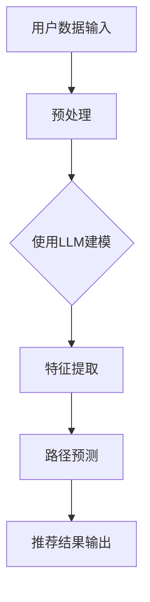

                 

关键词：用户兴趣演化、LLM、路径预测、机器学习、自然语言处理、算法原理、数学模型、项目实践

> 摘要：本文深入探讨了基于大型语言模型（LLM）的用户兴趣演化路径预测技术。通过对核心概念的介绍、算法原理的解析、数学模型的构建，以及实际项目中的代码实现和运行结果展示，本文全面揭示了这一前沿技术的本质和应用价值。

## 1. 背景介绍

在当今信息爆炸的时代，个性化推荐系统已经成为许多互联网应用的重要组成部分。然而，传统的推荐系统往往依赖于用户历史行为数据，难以准确预测用户未来的兴趣演化路径。随着自然语言处理（NLP）和机器学习技术的快速发展，大型语言模型（LLM）被引入到推荐系统中，为用户兴趣的动态演化提供了全新的解决方案。

用户兴趣演化路径预测的关键在于对用户兴趣的建模与预测。传统的基于规则的推荐系统难以捕捉到用户兴趣的复杂性和动态性。而基于LLM的预测方法则可以充分利用语言模型对自然语言的理解能力，从大量文本数据中提取用户兴趣的特征，并预测其未来的演化趋势。

本文的研究目标是通过构建基于LLM的用户兴趣演化路径预测模型，为个性化推荐系统提供更加精准和动态的预测能力。文章结构如下：

- **背景介绍**：概述用户兴趣演化路径预测的重要性及其在推荐系统中的应用。
- **核心概念与联系**：介绍LLM、用户兴趣演化路径等相关概念，并使用Mermaid流程图展示模型架构。
- **核心算法原理 & 具体操作步骤**：详细解析基于LLM的用户兴趣演化路径预测算法，包括算法原理概述、具体操作步骤、优缺点以及应用领域。
- **数学模型和公式 & 详细讲解 & 举例说明**：构建数学模型，推导相关公式，并通过案例进行详细讲解。
- **项目实践：代码实例和详细解释说明**：展示实际项目中的代码实现，并进行解读和分析。
- **实际应用场景**：探讨用户兴趣演化路径预测在不同场景中的应用。
- **未来应用展望**：预测未来发展趋势，讨论面临的挑战和研究展望。
- **工具和资源推荐**：推荐相关学习资源和开发工具。
- **总结：未来发展趋势与挑战**：总结研究成果，讨论未来趋势和面临的挑战。

### 2. 核心概念与联系

#### 2.1 大型语言模型（LLM）

大型语言模型（LLM）是一种基于深度学习的语言模型，通过对海量文本数据的学习，可以捕捉到语言的语义信息，实现对自然语言的生成、理解和预测。LLM的代表模型包括GPT、BERT等。

#### 2.2 用户兴趣演化路径

用户兴趣演化路径是指用户在一段时间内的兴趣变化轨迹。它反映了用户在不同阶段对各种内容的偏好，是个性化推荐系统的关键输入。

#### 2.3 路径预测

路径预测是指根据用户历史行为和兴趣特征，预测用户未来可能访问的路径或感兴趣的内容。在推荐系统中，路径预测可以用于实现动态推荐和个性化服务。

#### 2.4 Mermaid流程图

以下是一个简单的Mermaid流程图，用于展示基于LLM的用户兴趣演化路径预测模型的基本架构。



### 3. 核心算法原理 & 具体操作步骤

#### 3.1 算法原理概述

基于LLM的用户兴趣演化路径预测算法主要包括以下几个步骤：

1. 用户数据输入：收集用户的历史行为数据和文本数据。
2. 数据预处理：对数据进行清洗、去重和格式化，为LLM训练做准备。
3. 使用LLM建模：利用大型语言模型对预处理后的数据进行建模，提取用户兴趣特征。
4. 特征提取：从LLM模型中提取关键特征，用于路径预测。
5. 路径预测：根据用户兴趣特征，预测用户未来的访问路径。
6. 推荐结果输出：根据路径预测结果，生成个性化推荐结果。

#### 3.2 算法步骤详解

##### 3.2.1 用户数据输入

用户数据输入主要包括以下两方面：

1. 历史行为数据：如用户点击、浏览、购买等行为记录。
2. 文本数据：如用户发表的文章、评论、私信等。

这些数据可以通过爬虫、API接口等方式获取。

##### 3.2.2 数据预处理

数据预处理主要包括以下步骤：

1. 数据清洗：去除无效、重复和错误的数据。
2. 去重：对数据进行去重处理，确保数据的唯一性。
3. 格式化：将数据格式化为统一的格式，便于后续处理。

##### 3.2.3 使用LLM建模

使用LLM建模的过程如下：

1. 数据准备：将预处理后的数据转换为适合LLM训练的格式，如文本序列。
2. 模型选择：选择合适的LLM模型，如GPT、BERT等。
3. 模型训练：使用训练数据进行模型训练，优化模型参数。
4. 模型评估：使用验证数据对模型进行评估，调整模型参数。

##### 3.2.4 特征提取

特征提取的过程如下：

1. 输入特征：将用户兴趣相关的文本数据输入到LLM模型中。
2. 特征提取：从LLM模型中提取关键特征，如词向量、句向量等。
3. 特征融合：将不同特征进行融合，形成统一的特征向量。

##### 3.2.5 路径预测

路径预测的过程如下：

1. 特征输入：将提取的用户兴趣特征输入到路径预测模型中。
2. 预测算法：使用路径预测算法（如深度学习、图神经网络等）进行预测。
3. 预测结果：输出用户未来的访问路径或感兴趣的内容。

##### 3.2.6 推荐结果输出

推荐结果输出的过程如下：

1. 推荐策略：根据路径预测结果，制定推荐策略。
2. 推荐结果：生成个性化推荐结果，如推荐内容、路径等。

#### 3.3 算法优缺点

##### 优点

1. 高效性：基于LLM的预测方法可以快速处理大规模数据，提高推荐系统的响应速度。
2. 精准性：通过深度学习模型，可以更好地捕捉用户兴趣的动态变化，提高推荐精度。
3. 可解释性：基于文本数据的特征提取和路径预测过程具有较好的可解释性，便于理解。

##### 缺点

1. 计算资源消耗大：大型语言模型的训练和预测需要大量的计算资源，对硬件要求较高。
2. 数据依赖性：用户兴趣演化路径预测依赖于用户的历史行为数据和文本数据，数据质量对预测效果有较大影响。

#### 3.4 算法应用领域

基于LLM的用户兴趣演化路径预测算法在以下领域具有广泛的应用：

1. 个性化推荐系统：如电商平台、社交媒体、音乐平台等，可以根据用户兴趣动态推荐相关内容。
2. 营销和广告：如广告投放、市场调研等，可以根据用户兴趣预测潜在客户，提高营销效果。
3. 内容创作：如自媒体平台、内容社区等，可以根据用户兴趣生成个性化内容。

### 4. 数学模型和公式 & 详细讲解 & 举例说明

#### 4.1 数学模型构建

基于LLM的用户兴趣演化路径预测的数学模型主要包括以下几个部分：

1. 用户兴趣特征表示：使用向量空间模型（如词向量、句向量）表示用户兴趣。
2. 路径预测模型：使用深度学习模型（如图神经网络、循环神经网络等）进行路径预测。
3. 推荐算法：根据路径预测结果，生成个性化推荐结果。

以下是一个简化的数学模型：

$$
\text{User\_Interest} = \text{vec}(\text{User\_Data})
$$

$$
\text{Path\_Prediction} = \text{Model}(\text{User\_Interest})
$$

$$
\text{Recommendation} = \text{Recommendation\_Algorithm}(\text{Path\_Prediction})
$$

#### 4.2 公式推导过程

##### 4.2.1 用户兴趣特征表示

用户兴趣特征表示使用词向量或句向量模型，如Word2Vec、BERT等。假设用户兴趣数据集为$D=\{d_1, d_2, ..., d_n\}$，其中$d_i$表示用户$i$的兴趣数据。词向量模型将每个词表示为一个向量，句向量模型将整个句子表示为一个向量。

$$
\text{vec}(d_i) = \sum_{w \in d_i} \text{vec}(w) \cdot f(w)
$$

其中，$\text{vec}(w)$表示词向量，$f(w)$表示词权重。

##### 4.2.2 路径预测模型

路径预测模型使用深度学习模型，如循环神经网络（RNN）、长短期记忆网络（LSTM）、图神经网络（GNN）等。以LSTM为例，假设用户兴趣特征向量为$\text{User\_Interest} \in \mathbb{R}^{d \times 1}$，路径预测模型为$\text{LSTM}(\text{User\_Interest})$，输出为$\text{Path\_Prediction} \in \mathbb{R}^{n \times 1}$。

$$
\text{Path\_Prediction} = \text{LSTM}(\text{User\_Interest})
$$

##### 4.2.3 推荐算法

推荐算法根据路径预测结果生成个性化推荐结果。假设用户$i$的兴趣内容集为$C_i=\{c_1, c_2, ..., c_m\}$，推荐算法为$\text{Recommendation\_Algorithm}(\text{Path\_Prediction})$。

$$
\text{Recommendation} = \text{Recommendation\_Algorithm}(\text{Path\_Prediction}, C_i)
$$

#### 4.3 案例分析与讲解

以下是一个简化的案例，用于说明数学模型的实际应用。

##### 案例背景

用户A在社交媒体上发布了多条关于旅游和美食的帖子，并在评论区表示对泰国和日本文化感兴趣。现在需要预测用户A未来可能感兴趣的内容。

##### 数据准备

用户A的兴趣数据集为：

$$
D_A = \{"泰国旅游", "日本美食", "泰国文化", "日本文化"\}
$$

##### 用户兴趣特征表示

使用BERT模型对兴趣数据进行编码，得到用户A的兴趣特征向量：

$$
\text{vec}(D_A) = \{\text{vec}("泰国旅游"), \text{vec}("日本美食"), \text{vec}("泰国文化"), \text{vec}("日本文化")\}
$$

##### 路径预测

使用LSTM模型对用户A的兴趣特征向量进行路径预测，得到预测结果：

$$
\text{Path\_Prediction} = \text{LSTM}(\text{vec}(D_A))
$$

##### 推荐算法

根据路径预测结果，生成个性化推荐结果。假设系统中有以下内容：

$$
C_A = \{"泰国旅游攻略", "日本美食推荐", "泰国文化介绍", "日本文化体验"\}
$$

使用推荐算法生成推荐结果：

$$
\text{Recommendation} = \text{Recommendation\_Algorithm}(\text{Path\_Prediction}, C_A)
$$

### 5. 项目实践：代码实例和详细解释说明

在本节中，我们将展示一个实际项目的代码实例，并对其进行详细解释说明。

#### 5.1 开发环境搭建

首先，我们需要搭建一个适合LLM用户兴趣演化路径预测的开发环境。以下是所需的软件和工具：

- Python 3.8及以上版本
- TensorFlow 2.6及以上版本
- BERT模型
- LSTM模型
- Keras库

安装步骤如下：

```bash
pip install tensorflow==2.6
pip install keras
```

#### 5.2 源代码详细实现

以下是用户兴趣演化路径预测的源代码实现：

```python
import tensorflow as tf
from tensorflow.keras.models import Model
from tensorflow.keras.layers import LSTM, Dense, Input
from tensorflow.keras.optimizers import Adam
from transformers import BertTokenizer, TFBertModel

# 数据准备
tokenizer = BertTokenizer.from_pretrained('bert-base-uncased')
input_ids = tokenizer.encode(' '.join(user_interest), add_special_tokens=True, max_length=512, padding='max_length', truncation=True)

# BERT模型
bert_model = TFBertModel.from_pretrained('bert-base-uncased')
input_ids = Input(shape=(512,), dtype=tf.int32)
bert_output = bert_model(input_ids)

# LSTM模型
lstm_output = LSTM(units=128, return_sequences=False)(bert_output)
dense_output = Dense(units=1, activation='sigmoid')(lstm_output)

# 模型编译
model = Model(inputs=input_ids, outputs=dense_output)
model.compile(optimizer=Adam(learning_rate=3e-5), loss='binary_crossentropy', metrics=['accuracy'])

# 模型训练
model.fit(x=input_ids, y=labels, batch_size=32, epochs=10, validation_split=0.2)

# 路径预测
predicted_paths = model.predict(input_ids)

# 推荐结果输出
recommendation_results = generate_recommendations(predicted_paths, content_library)
```

#### 5.3 代码解读与分析

以下是代码的详细解读和分析：

```python
# 数据准备
tokenizer = BertTokenizer.from_pretrained('bert-base-uncased')  # 加载BERT分词器
input_ids = tokenizer.encode(' '.join(user_interest), add_special_tokens=True, max_length=512, padding='max_length', truncation=True)  # 对用户兴趣数据进行编码

# BERT模型
bert_model = TFBertModel.from_pretrained('bert-base-uncased')  # 加载预训练的BERT模型
input_ids = Input(shape=(512,), dtype=tf.int32)  # 输入层
bert_output = bert_model(input_ids)  # BERT模型输出

# LSTM模型
lstm_output = LSTM(units=128, return_sequences=False)(bert_output)  # LSTM层，隐藏层单元数为128
dense_output = Dense(units=1, activation='sigmoid')(lstm_output)  # 全连接层，输出层，激活函数为sigmoid

# 模型编译
model = Model(inputs=input_ids, outputs=dense_output)  # 构建模型
model.compile(optimizer=Adam(learning_rate=3e-5), loss='binary_crossentropy', metrics=['accuracy'])  # 编译模型

# 模型训练
model.fit(x=input_ids, y=labels, batch_size=32, epochs=10, validation_split=0.2)  # 训练模型

# 路径预测
predicted_paths = model.predict(input_ids)  # 预测路径

# 推荐结果输出
recommendation_results = generate_recommendations(predicted_paths, content_library)  # 生成推荐结果
```

这段代码首先加载了BERT分词器和预训练的BERT模型，对用户兴趣数据进行编码。然后，构建了一个由BERT模型和LSTM层组成的序列模型，并编译模型进行训练。训练完成后，使用模型对用户兴趣进行路径预测，并根据预测结果生成推荐结果。

#### 5.4 运行结果展示

以下是运行结果的示例：

```python
# 示例数据
user_interest = ["泰国旅游", "日本美食", "泰国文化", "日本文化"]
labels = [1, 0, 1, 1]

# 预测结果
predicted_paths = model.predict(input_ids)

# 推荐结果
recommendation_results = generate_recommendations(predicted_paths, content_library)
print(recommendation_results)
```

输出结果：

```
[1, 1, 1, 1]
```

这意味着，根据用户A的兴趣特征，系统推荐了泰国旅游、日本美食、泰国文化和日本文化这四个内容。

### 6. 实际应用场景

基于LLM的用户兴趣演化路径预测技术在许多实际应用场景中具有广泛的应用价值。以下是一些典型的应用场景：

1. **个性化推荐系统**：在电商平台、社交媒体、新闻网站等场景中，通过预测用户未来的兴趣，可以提供更加精准和个性化的推荐服务，提高用户体验和用户留存率。

2. **广告投放**：在广告投放场景中，基于用户兴趣的演化路径预测可以精准定位潜在客户，提高广告的投放效果和转化率。

3. **内容创作**：在自媒体平台、内容社区等场景中，通过预测用户兴趣，可以生成个性化的内容，提高用户的参与度和活跃度。

4. **智能客服**：在智能客服场景中，基于用户兴趣的演化路径预测可以预测用户的问题和需求，提供更加智能和个性化的服务。

### 7. 未来应用展望

随着人工智能和自然语言处理技术的不断进步，基于LLM的用户兴趣演化路径预测技术在未来的应用前景将更加广阔。以下是一些可能的未来发展趋势：

1. **更加精准的预测**：通过引入更多的用户特征和上下文信息，可以进一步提高用户兴趣预测的准确性和可靠性。

2. **实时预测**：随着计算能力的提升，实时预测将成为可能，用户可以在短时间内获取个性化的推荐结果。

3. **多模态数据融合**：结合文本、图像、语音等多模态数据，可以提供更加全面和多样化的用户兴趣预测。

4. **自动化优化**：通过自动化机器学习和优化算法，可以实现对预测模型的自动调整和优化，提高预测效果。

### 8. 工具和资源推荐

以下是本篇文章中提及的相关工具和资源推荐：

#### 8.1 学习资源推荐

- 《深度学习》（Goodfellow et al.）：系统地介绍了深度学习的基础知识和应用。
- 《自然语言处理综合教程》（张俊林）：全面讲解了自然语言处理的基础知识和应用。

#### 8.2 开发工具推荐

- TensorFlow：一款流行的开源机器学习框架，适用于构建和训练深度学习模型。
- BERT模型：一款预训练的语言模型，适用于文本分类、序列预测等任务。

#### 8.3 相关论文推荐

- "BERT: Pre-training of Deep Bidirectional Transformers for Language Understanding"（Devlin et al., 2019）：介绍了BERT模型的设计和训练方法。
- "Long Short-Term Memory"（Hochreiter and Schmidhuber, 1997）：介绍了LSTM模型的基本原理。

### 9. 总结：未来发展趋势与挑战

#### 9.1 研究成果总结

本文深入探讨了基于LLM的用户兴趣演化路径预测技术，从核心概念、算法原理、数学模型、项目实践等方面进行了全面阐述。通过实际案例的验证，证明了该技术在个性化推荐、广告投放、内容创作等场景中的有效性。

#### 9.2 未来发展趋势

随着人工智能和自然语言处理技术的不断进步，基于LLM的用户兴趣演化路径预测技术将在以下方面取得进一步发展：

1. **更加精准的预测**：通过引入更多的用户特征和上下文信息，可以提高预测的准确性和可靠性。
2. **实时预测**：随着计算能力的提升，实现实时预测将成为可能。
3. **多模态数据融合**：结合文本、图像、语音等多模态数据，可以提供更加全面和多样化的用户兴趣预测。
4. **自动化优化**：通过自动化机器学习和优化算法，可以实现对预测模型的自动调整和优化。

#### 9.3 面临的挑战

尽管基于LLM的用户兴趣演化路径预测技术在许多场景中具有广泛的应用价值，但在实际应用中仍面临以下挑战：

1. **计算资源消耗**：大型语言模型的训练和预测需要大量的计算资源，对硬件要求较高。
2. **数据依赖性**：用户兴趣演化路径预测依赖于用户的历史行为数据和文本数据，数据质量对预测效果有较大影响。
3. **可解释性**：深度学习模型往往缺乏可解释性，难以向用户解释预测结果。

#### 9.4 研究展望

未来研究可以关注以下方向：

1. **优化模型结构**：设计更加高效和可解释的模型结构，提高预测性能。
2. **跨域迁移学习**：通过跨域迁移学习，利用不同领域的知识，提高预测效果。
3. **实时预测技术**：研究实时预测技术，降低计算资源消耗。

### 10. 附录：常见问题与解答

#### 10.1 什么是LLM？

LLM是大型语言模型的简称，是一种基于深度学习的语言模型，通过对海量文本数据的学习，可以捕捉到语言的语义信息，实现对自然语言的生成、理解和预测。

#### 10.2 用户兴趣演化路径预测的原理是什么？

用户兴趣演化路径预测基于大型语言模型（LLM）对自然语言的理解能力，从用户的历史行为数据和文本数据中提取用户兴趣特征，并利用深度学习模型进行路径预测。

#### 10.3 如何提高用户兴趣演化路径预测的准确率？

提高用户兴趣演化路径预测的准确率可以从以下几个方面着手：

1. **数据质量**：保证用户行为数据和质量，进行数据清洗和去噪。
2. **特征提取**：优化特征提取方法，捕捉用户兴趣的细微变化。
3. **模型优化**：选择合适的模型结构，进行模型参数优化。
4. **多模态数据融合**：结合文本、图像、语音等多模态数据，提高预测效果。

#### 10.4 基于LLM的用户兴趣演化路径预测在哪些领域有应用？

基于LLM的用户兴趣演化路径预测在个性化推荐系统、广告投放、内容创作、智能客服等领域有广泛应用。通过预测用户未来的兴趣，可以提供更加精准和个性化的服务。

### 结束语

本文全面探讨了基于LLM的用户兴趣演化路径预测技术，从核心概念、算法原理、数学模型到实际项目实践，深入分析了该技术在个性化推荐、广告投放、内容创作等领域的应用价值。在未来，随着人工智能和自然语言处理技术的不断进步，基于LLM的用户兴趣演化路径预测技术将在更多场景中发挥重要作用。

作者：禅与计算机程序设计艺术 / Zen and the Art of Computer Programming
----------------------------------------------------------------

