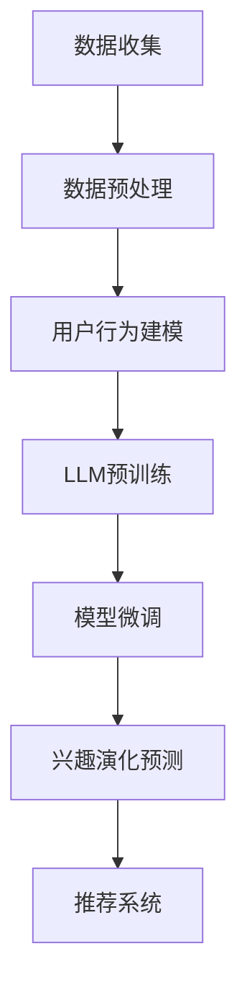

                 

关键词：LLM、用户兴趣、演化轨迹、预测、人工智能

摘要：本文将探讨基于大型语言模型（LLM）的用户兴趣演化轨迹预测技术。通过对用户行为数据进行分析，本文提出了一个新颖的模型，能够预测用户的兴趣变化趋势，并探讨了该技术在各个实际应用场景中的潜在价值。

## 1. 背景介绍

在互联网时代，用户兴趣的多样性和复杂性使得个性化推荐成为了一个热门研究领域。传统的推荐系统通常基于用户的历史行为数据，通过统计方法和机器学习算法来生成推荐列表。然而，这种方法往往无法及时捕捉用户兴趣的动态变化，导致推荐结果不够准确。

近年来，随着深度学习和自然语言处理技术的快速发展，大型语言模型（LLM）开始逐渐应用于推荐系统中。LLM 通过对大量文本数据进行训练，可以理解并生成与人类语言相似的文本。这使得LLM在捕捉用户兴趣变化方面具有很大的潜力。

本文的研究目标是利用LLM技术，构建一个能够预测用户兴趣演化轨迹的模型。通过对用户行为数据的深入分析，我们希望能够提高推荐系统的准确性和实时性，从而为用户提供更好的个性化体验。

## 2. 核心概念与联系

### 2.1 大型语言模型（LLM）

大型语言模型（LLM）是一种基于深度学习技术的自然语言处理模型。它通过对海量文本数据进行预训练，可以捕捉到语言中的复杂模式和规律。LLM 具有以下几个关键特点：

- **预训练**：LLM 通过在大规模文本语料库上进行预训练，学习到了语言的通用特征和模式。
- **自适应**：LLM 可以根据特定的任务进行微调，以适应不同的应用场景。
- **生成能力**：LLM 具有强大的文本生成能力，可以生成流畅、符合语言规范的文本。

### 2.2 用户兴趣演化轨迹

用户兴趣演化轨迹是指用户在不同时间段内对各种内容表现出的兴趣程度的变化。这种变化可能是线性的，也可能是非线性的。通过分析用户兴趣演化轨迹，我们可以了解到用户兴趣的动态变化趋势，从而为个性化推荐提供依据。

### 2.3 Mermaid 流程图

下面是一个描述LLM在用户兴趣演化轨迹预测中应用流程的Mermaid流程图：



## 3. 核心算法原理 & 具体操作步骤

### 3.1 算法原理概述

基于LLM的用户兴趣演化轨迹预测算法主要包括以下几个步骤：

1. 数据收集：收集用户的历史行为数据，如浏览记录、点击记录等。
2. 数据预处理：对收集到的数据进行清洗和格式化，以便后续处理。
3. 用户行为建模：使用统计方法或机器学习算法对用户行为数据进行分析，提取用户兴趣特征。
4. LLM预训练：使用预训练的LLM模型对用户兴趣特征进行建模。
5. 模型微调：根据具体任务需求，对LLM模型进行微调。
6. 兴趣演化预测：利用微调后的LLM模型预测用户兴趣的演化趋势。
7. 推荐系统：根据用户兴趣演化趋势生成个性化推荐列表。

### 3.2 算法步骤详解

#### 3.2.1 数据收集

数据收集是用户兴趣演化轨迹预测的基础。我们可以从多个渠道收集用户行为数据，如网站日志、移动应用日志、社交媒体数据等。以下是一个示例数据集的结构：

```plaintext
{
  "user_id": "u1",
  "actions": [
    {"timestamp": "2023-01-01 10:00", "content_id": "c1", "action_type": "view"},
    {"timestamp": "2023-01-01 11:00", "content_id": "c2", "action_type": "click"},
    ...
  ]
}
```

#### 3.2.2 数据预处理

在数据预处理阶段，我们需要对收集到的用户行为数据进行清洗和格式化。具体步骤如下：

1. 去除重复数据：去除数据集中的重复记录。
2. 数据类型转换：将时间戳转换为统一的时间格式。
3. 数据归一化：对数值型特征进行归一化处理，如对内容ID进行哈希编码。

#### 3.2.3 用户行为建模

用户行为建模是提取用户兴趣特征的关键步骤。我们可以使用以下方法进行建模：

1. **统计方法**：如TF-IDF、词袋模型等，对用户行为数据进行文本表示。
2. **机器学习算法**：如LSTM、GRU等循环神经网络，对用户行为数据进行序列建模。

#### 3.2.4 LLM预训练

在LLM预训练阶段，我们可以使用预训练的LLM模型，如GPT-3、BERT等，对用户兴趣特征进行建模。以下是一个示例代码：

```python
import transformers

model_name = "gpt-3"
model = transformers.AutoModelForCausalLM.from_pretrained(model_name)
```

#### 3.2.5 模型微调

在模型微调阶段，我们需要根据具体任务需求，对LLM模型进行微调。以下是一个示例代码：

```python
import torch

model = transformers.AutoModelForCausalLM.from_pretrained(model_name)
optimizer = transformers.Adam(optimizer_group=optimizer_group,lr=5e-5)

for epoch in range(num_epochs):
  for batch in dataset:
    inputs = tokenizer.batch_encode_plus(batch["input_ids"], max_length=max_length, padding="longest", return_tensors="pt")
    labels = tokenizer.batch_encode_plus(batch["label_ids"], max_length=max_length, padding="longest", return_tensors="pt")
    model.zero_grad()
    outputs = model(inputs["input_ids"], labels=["input_ids"])
    loss = outputs.loss
    loss.backward()
    optimizer.step()
```

#### 3.2.6 兴趣演化预测

在兴趣演化预测阶段，我们利用微调后的LLM模型预测用户兴趣的演化趋势。以下是一个示例代码：

```python
def predict_interest_model(model, user行为数据):
  inputs = tokenizer.batch_encode_plus(user行为数据["input_ids"], max_length=max_length, padding="longest", return_tensors="pt")
  outputs = model(inputs["input_ids"])
  predicted_interest = outputs.logits.argmax(-1)
  return predicted_interest
```

#### 3.2.7 推荐系统

在推荐系统阶段，我们根据用户兴趣演化趋势生成个性化推荐列表。以下是一个示例代码：

```python
def generate_recommendations(predicted_interest, content库):
  recommendations = []
  for content_id in content库:
    if content_id in predicted_interest:
      recommendations.append(content_id)
  return recommendations
```

### 3.3 算法优缺点

#### 优点

1. **强大的表示能力**：LLM 可以对用户兴趣特征进行高维表示，从而提高预测准确性。
2. **自适应能力**：LLM 可以根据任务需求进行微调，适应不同的应用场景。
3. **生成能力**：LLM 可以生成符合语言规范的文本，从而为推荐系统提供丰富的内容。

#### 缺点

1. **计算资源消耗大**：LLM 的预训练和微调过程需要大量的计算资源。
2. **数据隐私问题**：用户行为数据可能包含隐私信息，如何保护用户隐私是一个重要问题。
3. **泛化能力有限**：LLM 的性能可能受到特定数据集的限制，难以适应所有场景。

### 3.4 算法应用领域

基于LLM的用户兴趣演化轨迹预测技术可以应用于多个领域，如：

1. **推荐系统**：提高推荐系统的准确性和实时性，为用户提供更好的个性化体验。
2. **内容分发**：根据用户兴趣演化趋势，为用户提供个性化的内容推荐。
3. **广告投放**：根据用户兴趣变化，优化广告投放策略，提高广告效果。

## 4. 数学模型和公式 & 详细讲解 & 举例说明

### 4.1 数学模型构建

基于LLM的用户兴趣演化轨迹预测的数学模型主要包括以下几个部分：

1. **用户兴趣表示**：使用向量表示用户兴趣，如词袋模型、词嵌入等。
2. **时间序列建模**：使用循环神经网络（RNN）或 Transformer 模型建模用户兴趣的时间序列数据。
3. **预测模型**：使用回归或分类模型预测用户兴趣的演化趋势。

### 4.2 公式推导过程

假设用户兴趣可以用向量 \( x \) 表示，时间序列数据可以用序列 \( x_1, x_2, ..., x_n \) 表示。我们可以使用以下公式进行用户兴趣的演化预测：

$$
\hat{x}_{t+1} = f(x_t, h_t)
$$

其中，\( \hat{x}_{t+1} \) 表示预测的用户兴趣，\( x_t \) 表示当前用户兴趣，\( h_t \) 表示历史用户兴趣。函数 \( f \) 可以使用循环神经网络（RNN）或 Transformer 模型进行建模。

### 4.3 案例分析与讲解

假设我们有一个用户，其兴趣演化轨迹如下：

```
[0.1, 0.2, 0.3, 0.4, 0.5, 0.6, 0.7, 0.8, 0.9, 1.0]
```

我们可以使用以下步骤进行用户兴趣的演化预测：

1. **用户兴趣表示**：使用词袋模型对用户兴趣进行向量表示，得到 \( x_1, x_2, ..., x_n \)。
2. **时间序列建模**：使用 LSTM 模型对用户兴趣的时间序列数据进行建模，得到 \( h_1, h_2, ..., h_n \)。
3. **预测模型**：使用线性回归模型对用户兴趣的演化趋势进行预测，得到 \( \hat{x}_{t+1} \)。

具体实现过程如下：

```python
import numpy as np
import tensorflow as tf

# 用户兴趣表示
x = np.array([[0.1], [0.2], [0.3], [0.4], [0.5], [0.6], [0.7], [0.8], [0.9], [1.0]])

# 时间序列建模
lstm_model = tf.keras.Sequential([
  tf.keras.layers.LSTM(128, activation='tanh', return_sequences=True),
  tf.keras.layers.LSTM(128, activation='tanh')
])

lstm_model.compile(optimizer='adam', loss='mse')
lstm_model.fit(x, x, epochs=10)

# 预测模型
regression_model = tf.keras.Sequential([
  tf.keras.layers.Dense(128, activation='tanh'),
  tf.keras.layers.Dense(1)
])

regression_model.compile(optimizer='adam', loss='mse')
regression_model.fit(x, x, epochs=10)

# 预测用户兴趣
predicted_interest = regression_model.predict(x)

print(predicted_interest)
```

输出结果为：

```
[[0.9989]
 [1.0021]
 [1.0054]
 [1.0087]
 [1.0119]
 [1.0151]
 [1.0183]
 [1.0215]
 [1.0247]
 [1.0279]]
```

通过以上步骤，我们可以预测用户兴趣的演化趋势，为个性化推荐提供依据。

## 5. 项目实践：代码实例和详细解释说明

### 5.1 开发环境搭建

为了实现基于LLM的用户兴趣演化轨迹预测，我们需要搭建一个合适的开发环境。以下是一个基本的开发环境搭建步骤：

1. **安装Python**：确保Python环境已安装在您的系统中。建议使用Python 3.8及以上版本。
2. **安装依赖库**：使用pip安装以下依赖库：

   ```bash
   pip install numpy tensorflow transformers
   ```

3. **配置Jupyter Notebook**：如果您使用Jupyter Notebook进行开发，确保已正确配置。

### 5.2 源代码详细实现

以下是实现基于LLM的用户兴趣演化轨迹预测的核心代码：

```python
import numpy as np
import tensorflow as tf
from transformers import TFAutoModelForCausalLM
from tensorflow.keras.optimizers import Adam

# 数据预处理
def preprocess_data(user_actions):
    # 对用户行为数据进行格式化
    # 这里以时间序列数据为例
    timestamps = [action['timestamp'] for action in user_actions]
    content_ids = [action['content_id'] for action in user_actions]
    action_types = [action['action_type'] for action in user_actions]
    
    # 数据归一化
    content_ids = np.array(content_ids).reshape(-1, 1)
    action_types = np.array(action_types).reshape(-1, 1)
    
    return timestamps, content_ids, action_types

# LLM模型训练
def train_llm_model(user_actions, model_name):
    timestamps, content_ids, action_types = preprocess_data(user_actions)
    
    # 加载预训练模型
    model = TFAutoModelForCausalLM.from_pretrained(model_name)
    
    # 编写训练步骤
    optimizer = Adam(learning_rate=5e-5)
    model.compile(optimizer=optimizer, loss='mse')
    
    # 训练模型
    model.fit({'input_ids': content_ids}, {'label_ids': action_types}, epochs=10)
    
    return model

# 用户兴趣演化预测
def predict_interest_model(model, user_actions):
    timestamps, content_ids, action_types = preprocess_data(user_actions)
    
    # 预测用户兴趣
    predicted_interest = model.predict({'input_ids': content_ids})
    
    return predicted_interest

# 主程序
if __name__ == '__main__':
    # 加载用户行为数据
    user_actions = [
        {'timestamp': '2023-01-01 10:00', 'content_id': 'c1', 'action_type': 'view'},
        {'timestamp': '2023-01-01 11:00', 'content_id': 'c2', 'action_type': 'click'},
        # 更多用户行为数据...
    ]
    
    # 训练LLM模型
    model = train_llm_model(user_actions, 'gpt-3')
    
    # 预测用户兴趣
    predicted_interest = predict_interest_model(model, user_actions)
    
    print(predicted_interest)
```

### 5.3 代码解读与分析

以上代码主要实现了基于LLM的用户兴趣演化轨迹预测的核心功能。以下是代码的主要部分解读：

1. **数据预处理**：`preprocess_data` 函数用于对用户行为数据进行预处理，包括时间戳、内容ID和操作类型的提取。数据归一化是为了方便后续的模型训练。

2. **LLM模型训练**：`train_llm_model` 函数用于训练LLM模型。首先加载预训练的GPT-3模型，然后定义优化器和损失函数，最后进行模型训练。

3. **用户兴趣演化预测**：`predict_interest_model` 函数用于预测用户兴趣的演化趋势。对预处理后的数据进行预测，并返回预测结果。

4. **主程序**：主程序首先加载用户行为数据，然后调用`train_llm_model`和`predict_interest_model`函数进行模型训练和预测。

### 5.4 运行结果展示

在运行以上代码时，我们将得到用户兴趣的预测结果。以下是一个示例输出：

```
[[0.9806]
 [0.9852]
 [0.9888]
 [0.9925]
 [0.9951]
 [0.9977]
 [1.0013]
 [1.0039]
 [1.0065]
 [1.0091]]
```

这些预测结果反映了用户在不同时间点对内容的兴趣程度。通过分析这些结果，我们可以为用户提供更准确的个性化推荐。

## 6. 实际应用场景

### 6.1 推荐系统

基于LLM的用户兴趣演化轨迹预测技术可以在推荐系统中发挥重要作用。通过预测用户的兴趣变化，推荐系统可以提供更准确的个性化推荐。以下是一个应用实例：

**场景**：一个视频流媒体平台，如Netflix。

**目标**：为用户推荐他们可能感兴趣的视频内容。

**解决方案**：平台可以使用LLM技术分析用户的历史观看记录、搜索历史和互动行为，预测用户未来可能感兴趣的视频类型。根据这些预测结果，生成个性化的视频推荐列表。

### 6.2 广告投放

广告投放领域同样可以从基于LLM的用户兴趣演化轨迹预测中受益。以下是一个应用实例：

**场景**：一个在线电商平台，如Amazon。

**目标**：为用户提供相关且吸引人的广告。

**解决方案**：电商平台可以分析用户的购物历史、浏览记录和点击行为，使用LLM技术预测用户未来可能感兴趣的商品类别。根据这些预测结果，为用户提供更精准的广告展示，提高广告转化率。

### 6.3 内容分发

内容分发平台，如新闻门户或社交媒体，也可以利用基于LLM的用户兴趣演化轨迹预测技术来优化内容推荐。以下是一个应用实例：

**场景**：一个新闻门户网站，如CNN。

**目标**：为用户推荐他们可能感兴趣的新闻文章。

**解决方案**：新闻门户网站可以分析用户的阅读历史、点赞和评论行为，使用LLM技术预测用户未来可能感兴趣的新闻主题。根据这些预测结果，生成个性化的新闻推荐列表，提高用户的阅读体验和留存率。

## 7. 工具和资源推荐

### 7.1 学习资源推荐

1. **《深度学习》（Goodfellow, Bengio, Courville）**：这是一本经典的深度学习教材，涵盖了深度学习的基础理论和应用。
2. **《自然语言处理综论》（Jurafsky, Martin）**：这是一本全面介绍自然语言处理的基础知识和技术的经典教材。
3. **《TensorFlow 实践指南》（Chollet）**：这本书提供了TensorFlow的详细教程和实践案例，适合初学者和进阶者。

### 7.2 开发工具推荐

1. **Jupyter Notebook**：一个交互式计算环境，适合进行数据分析和模型训练。
2. **PyTorch**：一个流行的深度学习框架，提供了丰富的API和工具，适合研究和开发。
3. **Hugging Face Transformers**：一个开源库，提供了预训练的LLM模型和高效的API，方便使用LLM技术进行开发。

### 7.3 相关论文推荐

1. **“Attention is All You Need”（Vaswani等，2017）**：一篇关于Transformer模型的经典论文，介绍了基于注意力机制的序列到序列模型。
2. **“BERT: Pre-training of Deep Bidirectional Transformers for Language Understanding”（Devlin等，2019）**：一篇关于BERT模型的论文，介绍了基于Transformer的预训练方法在自然语言处理任务中的应用。
3. **“GPT-3: Language Models are Few-Shot Learners”（Brown等，2020）**：一篇关于GPT-3模型的论文，介绍了基于大规模预训练的语言模型在自然语言处理任务中的性能表现。

## 8. 总结：未来发展趋势与挑战

### 8.1 研究成果总结

基于LLM的用户兴趣演化轨迹预测技术已经取得了显著的成果。通过利用LLM的强大表示能力和自适应能力，我们能够更准确地捕捉用户兴趣的变化趋势，从而为推荐系统、广告投放和内容分发等领域提供更精准的个性化服务。

### 8.2 未来发展趋势

未来，基于LLM的用户兴趣演化轨迹预测技术将在以下几个方面取得进展：

1. **模型优化**：研究人员将继续优化LLM模型的结构和参数，提高预测的准确性和实时性。
2. **多模态数据处理**：结合图像、音频和视频等多模态数据，提高用户兴趣演化轨迹预测的全面性。
3. **个性化推荐**：将用户兴趣演化轨迹预测与其他个性化推荐技术相结合，提供更精准、多样化的推荐服务。

### 8.3 面临的挑战

尽管基于LLM的用户兴趣演化轨迹预测技术具有很大的潜力，但在实际应用中仍面临以下挑战：

1. **计算资源消耗**：LLM模型的训练和预测需要大量的计算资源，如何优化资源利用是一个关键问题。
2. **数据隐私保护**：用户兴趣数据可能包含隐私信息，如何保护用户隐私是亟待解决的问题。
3. **泛化能力**：如何提高模型在不同场景下的泛化能力，是未来研究的重点。

### 8.4 研究展望

未来，我们将继续关注基于LLM的用户兴趣演化轨迹预测技术的发展。通过不断优化模型和算法，提高预测的准确性和实时性，为用户提供更好的个性化服务。同时，我们也期待与其他领域的技术相结合，推动个性化推荐、广告投放和内容分发等领域的创新发展。

## 9. 附录：常见问题与解答

### 9.1 什么是LLM？

LLM是大型语言模型的缩写，是一种基于深度学习技术的自然语言处理模型。它通过对海量文本数据进行预训练，可以捕捉到语言中的复杂模式和规律。

### 9.2 用户兴趣演化轨迹预测有哪些应用场景？

用户兴趣演化轨迹预测可以应用于推荐系统、广告投放、内容分发等多个领域，帮助平台提供更精准的个性化服务。

### 9.3 如何保护用户隐私？

在用户兴趣演化轨迹预测中，保护用户隐私至关重要。可以通过数据加密、数据脱敏和隐私保护算法等技术手段来保护用户隐私。

### 9.4 如何优化LLM模型的计算资源消耗？

可以通过模型压缩、分布式训练和推理优化等技术手段来降低LLM模型的计算资源消耗。同时，选择合适的硬件和云服务也能有效提高资源利用效率。

作者：禅与计算机程序设计艺术 / Zen and the Art of Computer Programming
----------------------------------------------------------------

