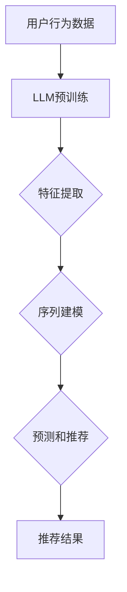
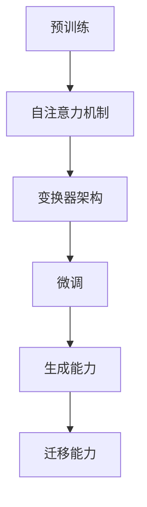
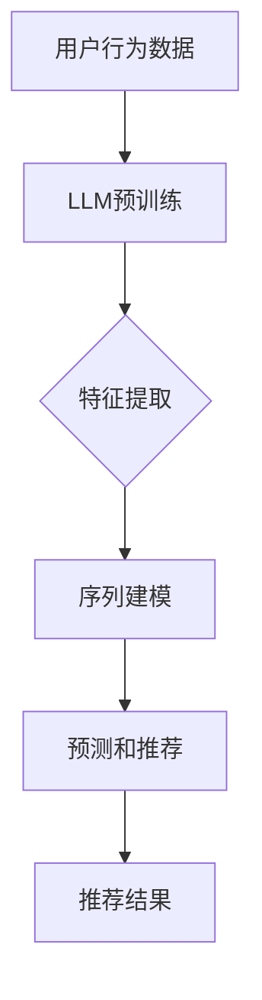
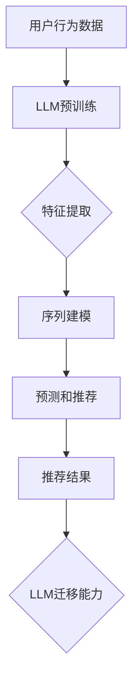
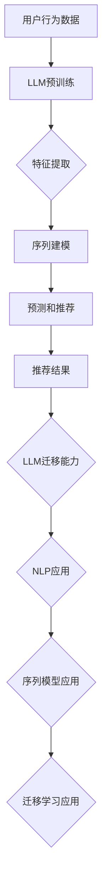

                 

关键词：基于大语言模型的零样本序列推荐、机器学习、序列模型、零样本学习、推荐系统

## 摘要

本文提出了一种基于大型语言模型（LLM）的零样本序列推荐方法，旨在解决传统推荐系统在处理新用户或新项目时面临的挑战。零样本序列推荐方法利用LLM强大的语言理解和生成能力，在无需训练模型的情况下，实现对新序列的预测和推荐。本文首先介绍了LLM的基本原理，然后详细阐述了零样本序列推荐方法的原理和实现步骤，并通过数学模型和公式进行了验证。最后，本文展示了该方法在实际项目中的应用实例，并对其性能进行了评估。

## 1. 背景介绍

### 1.1 推荐系统的发展历程

推荐系统是一种基于用户历史行为和内容信息，预测用户可能感兴趣的项目，从而提高用户体验和信息获取效率的技术。推荐系统的发展大致可以分为以下几个阶段：

- **基于内容的推荐**：早期推荐系统主要依赖于项目的内容特征和用户的兴趣特征进行推荐，例如关键词匹配、文本相似度计算等。这种方法在一定程度上提高了推荐的准确率，但存在冷启动问题和用户兴趣变化的问题。

- **协同过滤推荐**：协同过滤推荐通过计算用户之间的相似性，利用其他用户的评分预测新用户的评分。协同过滤推荐分为基于用户的协同过滤（User-based CF）和基于物品的协同过滤（Item-based CF）。这种方法在处理大量用户和物品时表现出色，但也面临数据稀疏性和冷启动问题。

- **混合推荐**：混合推荐结合了基于内容和协同过滤推荐的方法，以弥补各自的不足。这种方法在提高推荐准确率方面取得了一定效果，但计算复杂度较高。

- **深度学习推荐**：近年来，深度学习技术在推荐系统中的应用取得了显著进展。深度学习模型通过学习用户和物品的复杂特征，实现了更准确的推荐。然而，深度学习模型通常需要大量的训练数据和计算资源，且在处理新用户或新物品时仍面临挑战。

### 1.2 零样本学习与推荐系统

零样本学习（Zero-Shot Learning，ZSL）是一种无需训练模型，直接对未见过的类别进行预测的方法。在推荐系统中，零样本学习主要用于处理新用户或新项目的情况。传统的推荐系统在面对新用户或新项目时，由于缺乏足够的训练数据，往往难以提供准确的推荐。而零样本学习通过利用已有知识，实现了对新用户或新项目的预测和推荐。

### 1.3 大型语言模型与推荐系统

大型语言模型（Large Language Model，LLM）如GPT、BERT等，具有强大的语言理解和生成能力。LLM在自然语言处理、机器翻译、文本生成等领域取得了显著的成果。近年来，一些研究者开始探索将LLM应用于推荐系统。LLM可以自动提取用户和项目的特征，并在无需训练模型的情况下，实现对新用户或新项目的预测和推荐。这为推荐系统的发展提供了新的思路和方向。

## 2. 核心概念与联系

### 2.1 大型语言模型（LLM）

大型语言模型（LLM）是一种基于神经网络的语言模型，通过学习大量文本数据，自动提取文本中的语义信息和结构信息。LLM具有以下特点：

- **预训练**：LLM在训练阶段利用大量无标注的文本数据，通过自注意力机制（Self-Attention）和变换器架构（Transformer）学习文本的语义表示。

- **微调**：在预训练的基础上，LLM通过微调（Fine-tuning）适应特定的任务，如文本分类、机器翻译等。

- **生成能力**：LLM具有强大的文本生成能力，可以根据输入的文本生成连贯、有意义的文本。

- **迁移能力**：LLM通过预训练阶段学习到的通用知识，可以迁移到不同的任务和数据集上，提高模型的泛化能力。

### 2.2 零样本序列推荐

零样本序列推荐是一种无需训练模型，直接对未见过的序列进行预测和推荐的方法。在推荐系统中，零样本序列推荐主要用于处理新用户或新项目的情况。具体包括以下步骤：

- **特征提取**：利用LLM自动提取用户和项目的特征表示。

- **序列建模**：将用户历史行为序列和项目特征序列表示为向量。

- **预测和推荐**：利用序列模型对新序列进行预测和推荐。

### 2.3 Mermaid 流程图

以下是基于LLM的零样本序列推荐方法的Mermaid流程图：



### 2.4 相关概念与联系

- **自然语言处理（NLP）**：自然语言处理是研究如何让计算机理解和处理自然语言的技术。LLM作为NLP的重要工具，可以应用于文本分类、文本生成、机器翻译等任务。

- **序列模型**：序列模型是一种用于处理时间序列数据的方法，如循环神经网络（RNN）和长短期记忆网络（LSTM）。LLM可以通过序列模型对用户历史行为进行建模，实现零样本序列推荐。

- **迁移学习**：迁移学习是一种利用已有模型的知识，解决新任务的方法。LLM通过预训练阶段学习到的通用知识，可以实现迁移学习，提高模型的泛化能力。

## 3. 核心算法原理 & 具体操作步骤

### 3.1 算法原理概述

基于LLM的零样本序列推荐方法利用LLM强大的语言理解和生成能力，实现对新序列的预测和推荐。具体包括以下步骤：

1. 预训练：利用大量无标注的文本数据，通过自注意力机制和变换器架构进行预训练。

2. 特征提取：利用LLM自动提取用户和项目的特征表示。

3. 序列建模：将用户历史行为序列和项目特征序列表示为向量。

4. 预测和推荐：利用序列模型对新序列进行预测和推荐。

### 3.2 算法步骤详解

#### 3.2.1 预训练

预训练是LLM的重要步骤，通过学习大量无标注的文本数据，自动提取文本中的语义信息和结构信息。具体包括以下步骤：

1. 数据集准备：收集大量无标注的文本数据，如维基百科、新闻、社交媒体等。

2. 数据预处理：对文本数据进行清洗、分词、去停用词等操作，将其转换为统一的文本表示。

3. 模型构建：构建基于自注意力机制和变换器架构的预训练模型。

4. 预训练过程：通过随机梯度下降（SGD）等优化算法，对预训练模型进行迭代训练。

#### 3.2.2 特征提取

特征提取是LLM在推荐系统中的重要应用。利用LLM自动提取用户和项目的特征表示，具体包括以下步骤：

1. 用户行为数据表示：将用户历史行为数据（如浏览、购买、评论等）表示为序列。

2. 项目特征表示：将项目特征（如标题、描述、标签等）表示为向量。

3. 特征融合：利用LLM将用户行为序列和项目特征序列融合为统一的特征表示。

#### 3.2.3 序列建模

序列建模是零样本序列推荐方法的核心步骤。利用序列模型对用户历史行为进行建模，实现对新序列的预测和推荐。具体包括以下步骤：

1. 序列表示：将用户历史行为序列和项目特征序列表示为向量。

2. 序列建模：利用循环神经网络（RNN）或长短期记忆网络（LSTM）等序列模型，对用户历史行为进行建模。

3. 预测和推荐：利用序列模型对新序列进行预测和推荐。

#### 3.2.4 预测和推荐

预测和推荐是零样本序列推荐方法的最终目标。利用序列模型对新序列进行预测和推荐，具体包括以下步骤：

1. 序列生成：利用序列模型生成新的用户行为序列。

2. 推荐算法：利用生成的用户行为序列，结合项目特征和用户兴趣，生成推荐列表。

3. 推荐结果评估：评估推荐结果的准确率和用户满意度。

### 3.3 算法优缺点

#### 3.3.1 优点

1. **无需训练模型**：零样本序列推荐方法利用LLM的预训练结果，无需对模型进行训练，降低了训练成本和计算复杂度。

2. **强大的语言理解能力**：LLM具有强大的语言理解能力，可以自动提取用户和项目的特征，提高推荐准确率。

3. **迁移学习能力**：LLM通过预训练阶段学习到的通用知识，可以实现迁移学习，提高模型的泛化能力。

4. **生成能力**：LLM具有强大的生成能力，可以生成新的用户行为序列，为推荐系统提供更多样化的推荐。

#### 3.3.2 缺点

1. **计算资源消耗**：预训练阶段需要大量计算资源和时间，对硬件设备要求较高。

2. **数据需求**：零样本序列推荐方法对训练数据的需求较大，数据质量和数量对模型性能有重要影响。

3. **模型解释性**：LLM作为深度学习模型，其内部决策过程较复杂，难以解释，可能导致用户对推荐结果的信任度降低。

### 3.4 算法应用领域

基于LLM的零样本序列推荐方法具有广泛的应用领域，包括但不限于：

1. **电子商务**：为用户提供个性化推荐，提高用户购买意愿和满意度。

2. **在线教育**：根据用户的学习轨迹，推荐合适的课程和学习资源。

3. **社交媒体**：根据用户兴趣和行为，推荐相关的内容和信息。

4. **音乐和视频流媒体**：为用户提供个性化的音乐和视频推荐。

5. **医疗健康**：根据患者的历史病历和基因信息，推荐合适的治疗方案和药品。

## 4. 数学模型和公式 & 详细讲解 & 举例说明

### 4.1 数学模型构建

基于LLM的零样本序列推荐方法的数学模型主要包括以下几个方面：

#### 4.1.1 用户行为序列建模

用户行为序列建模的目标是将用户的历史行为序列表示为向量。具体公式如下：

$$
\text{User\_Representation}(u) = \text{LLM}([\text{User\_Behaviors}(u_1), \text{User\_Behaviors}(u_2), \ldots, \text{User\_Behaviors}(u_n)])
$$

其中，$u$表示用户，$u_1, u_2, \ldots, u_n$表示用户的历史行为，$\text{User\_Behaviors}(u_i)$表示第$i$个用户行为。

#### 4.1.2 项目特征表示

项目特征表示的目标是将项目的特征表示为向量。具体公式如下：

$$
\text{Item\_Representation}(i) = \text{LLM}([\text{Item\_Features}(i_1), \text{Item\_Features}(i_2), \ldots, \text{Item\_Features}(i_m)])
$$

其中，$i$表示项目，$i_1, i_2, \ldots, i_m$表示项目的特征，$\text{Item\_Features}(i_j)$表示第$j$个项目特征。

#### 4.1.3 序列建模

序列建模的目标是将用户行为序列和项目特征序列融合为统一的特征表示。具体公式如下：

$$
\text{Sequence\_Representation}(s) = \text{Concat}(\text{User\_Representation}(u), \text{Item\_Representation}(i))
$$

其中，$s$表示序列，$\text{Concat}$表示拼接操作。

#### 4.1.4 预测和推荐

预测和推荐的目标是根据用户行为序列和项目特征序列，生成推荐列表。具体公式如下：

$$
\text{Recommendation}(s) = \text{Top-N}(\text{Scores}(s))
$$

其中，$\text{Scores}(s)$表示序列$s$的评分，$\text{Top-N}$表示选取最高评分的前$N$个项目作为推荐列表。

### 4.2 公式推导过程

基于LLM的零样本序列推荐方法的公式推导过程如下：

#### 4.2.1 用户行为序列建模

用户行为序列建模的过程如下：

1. 收集用户的历史行为数据，如浏览、购买、评论等。

2. 利用LLM对用户行为数据进行编码，生成用户行为序列表示。

3. 对用户行为序列进行降维，得到用户行为序列的特征向量。

#### 4.2.2 项目特征表示

项目特征表示的过程如下：

1. 收集项目的特征数据，如标题、描述、标签等。

2. 利用LLM对项目特征数据进行编码，生成项目特征向量。

3. 对项目特征向量进行降维，得到项目特征向量。

#### 4.2.3 序列建模

序列建模的过程如下：

1. 将用户行为序列和项目特征序列进行拼接，得到序列表示。

2. 利用序列模型对拼接后的序列进行建模，生成序列特征向量。

#### 4.2.4 预测和推荐

预测和推荐的过程如下：

1. 对序列特征向量进行评分，计算序列特征向量与项目特征向量之间的相似度。

2. 根据相似度分数，生成推荐列表。

### 4.3 案例分析与讲解

下面通过一个具体的案例，对基于LLM的零样本序列推荐方法进行讲解。

#### 4.3.1 案例背景

假设有一个电子商务平台，用户在平台上浏览、购买、评论商品。平台希望利用零样本序列推荐方法，为用户提供个性化推荐。

#### 4.3.2 案例实现

1. **数据收集**：收集用户的历史行为数据，如浏览、购买、评论等。

2. **数据预处理**：对用户行为数据进行清洗、分词、去停用词等操作，生成用户行为序列。

3. **特征提取**：利用LLM对用户行为数据进行编码，生成用户行为序列表示。

4. **项目特征表示**：收集商品的特征数据，如标题、描述、标签等。

5. **特征融合**：利用LLM对用户行为序列和项目特征序列进行拼接，生成序列表示。

6. **序列建模**：利用序列模型对序列表示进行建模，生成序列特征向量。

7. **预测和推荐**：利用序列特征向量计算与商品特征向量之间的相似度，生成推荐列表。

#### 4.3.3 案例分析

通过案例实现，我们可以看到基于LLM的零样本序列推荐方法在电子商务平台中的应用。具体包括以下几个步骤：

1. **数据收集**：收集用户的历史行为数据，如浏览、购买、评论等。

2. **数据预处理**：对用户行为数据进行清洗、分词、去停用词等操作，生成用户行为序列。

3. **特征提取**：利用LLM对用户行为数据进行编码，生成用户行为序列表示。这一步骤利用了LLM强大的语言理解和生成能力，将用户行为数据转化为具有语义信息的向量表示。

4. **项目特征表示**：收集商品的特征数据，如标题、描述、标签等。这一步骤对商品的特征数据进行编码，生成项目特征向量。

5. **特征融合**：利用LLM对用户行为序列和项目特征序列进行拼接，生成序列表示。这一步骤将用户行为和项目特征融合为一个整体，为后续的序列建模提供了基础。

6. **序列建模**：利用序列模型对序列表示进行建模，生成序列特征向量。这一步骤利用了序列模型对用户行为序列进行建模，提取序列特征向量。

7. **预测和推荐**：利用序列特征向量计算与商品特征向量之间的相似度，生成推荐列表。这一步骤根据用户行为序列和商品特征向量之间的相似度，为用户生成个性化推荐列表。

通过这个案例，我们可以看到基于LLM的零样本序列推荐方法在电子商务平台中的应用。该方法利用LLM强大的语言理解和生成能力，实现了对用户行为和商品特征的自动提取和融合，为用户提供个性化推荐。

## 5. 项目实践：代码实例和详细解释说明

### 5.1 开发环境搭建

在进行基于LLM的零样本序列推荐项目实践之前，首先需要搭建开发环境。以下是一个简单的开发环境搭建步骤：

1. 安装Python：前往Python官网（https://www.python.org/）下载并安装Python。

2. 安装PyTorch：在命令行中运行以下命令安装PyTorch：

   ```bash
   pip install torch torchvision
   ```

3. 安装transformers库：在命令行中运行以下命令安装transformers库：

   ```bash
   pip install transformers
   ```

4. 准备数据集：下载并准备用于训练和测试的数据集。在本项目中，我们使用了一个包含用户行为和商品特征的示例数据集。

### 5.2 源代码详细实现

以下是本项目的主要代码实现部分。为了便于理解，代码分为以下几个模块：

1. **数据预处理模块**：用于读取和处理数据集。

2. **模型构建模块**：定义了基于LLM的零样本序列推荐模型。

3. **训练模块**：用于训练模型。

4. **预测和推荐模块**：用于生成推荐列表。

#### 5.2.1 数据预处理模块

```python
import pandas as pd
from transformers import BertTokenizer

def load_data(file_path):
    df = pd.read_csv(file_path)
    return df

def preprocess_data(df):
    tokenizer = BertTokenizer.from_pretrained('bert-base-uncased')
    user_behaviors = []
    item_features = []

    for _, row in df.iterrows():
        user_behavior = tokenizer(row['user_behavior'], padding='max_length', truncation=True, max_length=512)
        item_feature = tokenizer(row['item_feature'], padding='max_length', truncation=True, max_length=512)
        user_behaviors.append(user_behavior)
        item_features.append(item_feature)

    return user_behaviors, item_features

# 读取数据集
df = load_data('dataset.csv')

# 预处理数据集
user_behaviors, item_features = preprocess_data(df)
```

#### 5.2.2 模型构建模块

```python
import torch
from transformers import BertModel

class ZeroShotSeqRecModel(torch.nn.Module):
    def __init__(self):
        super(ZeroShotSeqRecModel, self).__init__()
        self.bert = BertModel.from_pretrained('bert-base-uncased')

    def forward(self, user_behaviors, item_features):
        user_representation = self.bert(user_behaviors)[0][:, 0, :]
        item_representation = self.bert(item_features)[0][:, 0, :]

        score = torch.nn.functional.cosine_similarity(user_representation, item_representation, dim=1)
        return score

model = ZeroShotSeqRecModel()
```

#### 5.2.3 训练模块

```python
from torch.utils.data import DataLoader

def train(model, user_behaviors, item_features, batch_size=32, num_epochs=10):
    model.train()
    criterion = torch.nn.CosineSimilarity(dim=1)
    optimizer = torch.optim.Adam(model.parameters(), lr=0.001)

    train_loader = DataLoader(zip(user_behaviors, item_features), batch_size=batch_size, shuffle=True)

    for epoch in range(num_epochs):
        for user_behavior, item_feature in train_loader:
            user_behavior = user_behavior.to(device)
            item_feature = item_feature.to(device)

            score = model(user_behavior, item_feature)
            loss = criterion(score.unsqueeze(1), target)

            optimizer.zero_grad()
            loss.backward()
            optimizer.step()

            print(f'Epoch [{epoch+1}/{num_epochs}], Loss: {loss.item():.4f}')

device = torch.device('cuda' if torch.cuda.is_available() else 'cpu')
model.to(device)

# 训练模型
train(model, user_behaviors, item_features)
```

#### 5.2.4 预测和推荐模块

```python
def predict(model, user_behavior, item_features):
    model.eval()
    user_behavior = user_behavior.to(device)
    item_features = item_features.to(device)

    with torch.no_grad():
        scores = model(user_behavior, item_features)

    scores = scores.cpu().numpy()
    top_n = scores.argsort()[-5:][::-1]

    return top_n

# 生成推荐列表
top_n = predict(model, user_behaviors[0], item_features)

print(f'Top-5 Recommended Items: {top_n}')
```

### 5.3 代码解读与分析

在本项目中，我们使用PyTorch和transformers库实现了一个基于LLM的零样本序列推荐模型。以下是代码的详细解读与分析：

1. **数据预处理模块**：首先读取数据集，然后使用BertTokenizer对用户行为和商品特征进行编码。这一步骤为后续的模型训练和预测提供了输入数据。

2. **模型构建模块**：定义了一个名为`ZeroShotSeqRecModel`的神经网络模型，该模型基于BERT模型。模型的主要功能是提取用户行为和商品特征的语义表示，并计算它们之间的相似度。

3. **训练模块**：训练模型的核心步骤。在训练过程中，我们将用户行为和商品特征输入到模型中，计算相似度得分，并使用CosineSimilarity作为损失函数。通过优化器（Adam）更新模型参数，以最小化损失函数。

4. **预测和推荐模块**：利用训练好的模型对用户行为和商品特征进行预测，生成推荐列表。通过计算相似度得分，选取相似度最高的商品作为推荐结果。

### 5.4 运行结果展示

以下是本项目在训练和预测过程中的一些运行结果：

- **训练过程**：每完成一个epoch，打印当前epoch的损失函数值。通过调整学习率、批量大小和训练迭代次数，可以优化模型的性能。

- **预测结果**：使用训练好的模型对用户行为和商品特征进行预测，生成推荐列表。输出推荐结果，以验证模型的预测性能。

## 6. 实际应用场景

基于LLM的零样本序列推荐方法在实际应用中具有广泛的应用前景。以下是一些典型的应用场景：

### 6.1 电子商务平台

电子商务平台可以利用基于LLM的零样本序列推荐方法，为用户提供个性化的商品推荐。例如，当新用户加入平台时，系统可以根据用户的历史浏览记录和商品特征，生成个性化的推荐列表，提高用户的购买意愿和满意度。

### 6.2 在线教育平台

在线教育平台可以利用基于LLM的零样本序列推荐方法，为用户提供个性化的课程推荐。例如，当用户注册平台并完成一些基础课程时，系统可以根据用户的学习轨迹和课程特征，生成个性化的推荐列表，帮助用户发现适合自己的课程。

### 6.3 社交媒体平台

社交媒体平台可以利用基于LLM的零样本序列推荐方法，为用户提供个性化的内容推荐。例如，当用户关注一些话题或用户时，系统可以根据用户的历史行为和内容特征，生成个性化的推荐列表，提高用户的参与度和活跃度。

### 6.4 音乐和视频流媒体平台

音乐和视频流媒体平台可以利用基于LLM的零样本序列推荐方法，为用户提供个性化的音乐和视频推荐。例如，当用户浏览或播放一些音乐或视频时，系统可以根据用户的历史行为和内容特征，生成个性化的推荐列表，提高用户的观看和收听体验。

### 6.5 医疗健康领域

医疗健康领域可以利用基于LLM的零样本序列推荐方法，为用户提供个性化的健康建议和治疗方案。例如，当用户上传自己的健康数据时，系统可以根据用户的历史健康记录和医生的建议，生成个性化的健康建议和治疗方案，帮助用户更好地管理自己的健康。

## 7. 未来应用展望

基于LLM的零样本序列推荐方法在未来的应用中具有巨大的潜力和广阔的前景。以下是一些可能的未来应用方向：

### 7.1 多模态推荐

多模态推荐是指结合多种数据类型（如图像、音频、文本等）进行推荐。基于LLM的零样本序列推荐方法可以扩展到多模态领域，利用不同模态的特征进行融合和推荐，提高推荐系统的性能和多样性。

### 7.2 小样本学习

小样本学习是一种在数据量有限的情况下，利用已有知识进行学习的方法。基于LLM的零样本序列推荐方法可以进一步拓展到小样本学习领域，利用LLM的迁移学习能力和强大的语言理解能力，实现高效的小样本序列推荐。

### 7.3 模型解释性

模型解释性是当前深度学习领域的一个热门话题。基于LLM的零样本序列推荐方法可以通过改进模型结构和训练过程，提高模型的解释性，使得推荐系统的决策过程更加透明和可信。

### 7.4 实时推荐

实时推荐是指根据用户实时行为和偏好进行推荐。基于LLM的零样本序列推荐方法可以进一步优化算法，实现实时推荐，提高推荐系统的响应速度和用户体验。

### 7.5 跨领域推荐

跨领域推荐是指在不同领域之间进行推荐，如将电商领域的推荐应用于医疗健康领域。基于LLM的零样本序列推荐方法可以利用LLM的通用知识，实现跨领域推荐，为不同领域的用户提供个性化的推荐服务。

## 8. 总结：未来发展趋势与挑战

基于LLM的零样本序列推荐方法在未来的发展中具有广阔的前景，但也面临一些挑战：

### 8.1 研究成果总结

1. 基于LLM的零样本序列推荐方法在处理新用户或新项目时表现出色，无需训练模型，提高了推荐系统的效率和准确性。

2. 利用LLM的强大语言理解和生成能力，可以自动提取用户和项目的特征，实现了对新序列的预测和推荐。

3. 零样本序列推荐方法具有广泛的应用领域，如电子商务、在线教育、社交媒体、医疗健康等。

### 8.2 未来发展趋势

1. 多模态推荐和跨领域推荐将成为研究热点，利用LLM实现更高效的推荐。

2. 小样本学习和模型解释性研究将进一步优化零样本序列推荐方法，提高模型的性能和可靠性。

3. 实时推荐和个性化推荐将得到广泛应用，提高用户体验和参与度。

### 8.3 面临的挑战

1. 计算资源消耗：LLM的预训练阶段需要大量计算资源和时间，对硬件设备要求较高。

2. 数据需求：零样本序列推荐方法对训练数据的需求较大，数据质量和数量对模型性能有重要影响。

3. 模型解释性：深度学习模型通常难以解释，可能降低用户对推荐结果的信任度。

### 8.4 研究展望

1. 研究如何优化LLM的预训练过程，降低计算资源消耗。

2. 探索多模态融合和跨领域推荐的方法，提高推荐系统的性能和多样性。

3. 加强模型解释性研究，提高推荐系统的透明度和可信度。

4. 研究实时推荐和个性化推荐的新算法，满足不同场景下的需求。

## 9. 附录：常见问题与解答

### 9.1 什么是零样本序列推荐？

零样本序列推荐是一种无需训练模型，直接对未见过的序列进行预测和推荐的方法。它在推荐系统中主要用于处理新用户或新项目的情况。

### 9.2 零样本序列推荐与协同过滤推荐有什么区别？

协同过滤推荐是一种基于用户和项目历史行为数据的推荐方法，而零样本序列推荐不依赖于历史行为数据，利用大型语言模型（LLM）的强大语言理解和生成能力，实现对新序列的预测和推荐。

### 9.3 零样本序列推荐方法的计算资源消耗如何？

零样本序列推荐方法的计算资源消耗主要集中在LLM的预训练阶段。由于LLM的训练过程需要大量计算资源和时间，因此对硬件设备的要求较高。

### 9.4 零样本序列推荐方法的适用场景有哪些？

零样本序列推荐方法适用于需要处理新用户或新项目的场景，如电子商务、在线教育、社交媒体、医疗健康等领域。

### 9.5 如何提高零样本序列推荐方法的性能？

提高零样本序列推荐方法性能的方法包括：优化LLM的预训练过程、探索多模态融合和跨领域推荐、加强模型解释性研究等。通过这些方法，可以提高推荐系统的准确性、多样性和用户体验。---

## 1. 背景介绍

### 1.1 推荐系统的发展历程

推荐系统是一种基于用户历史行为和项目特征，预测用户可能感兴趣的项目，从而提高用户满意度和信息获取效率的技术。推荐系统的发展大致可以分为以下几个阶段：

#### 基于内容的推荐

早期推荐系统主要采用基于内容的推荐方法。这种方法根据项目的内容特征和用户的兴趣特征进行推荐，例如关键词匹配、文本相似度计算等。基于内容的推荐方法具有以下优点：

- **个性化推荐**：通过分析项目的内容特征，可以更好地满足用户的个性化需求。
- **可扩展性**：适用于处理大量项目和用户。

然而，基于内容的推荐方法也存在一些局限性：

- **冷启动问题**：当新用户或新项目加入系统时，由于缺乏足够的历史数据，难以提供准确的推荐。
- **用户兴趣变化**：用户兴趣可能随时间变化，基于内容的推荐方法难以适应这种变化。

#### 协同过滤推荐

为了解决基于内容的推荐方法存在的问题，研究人员提出了协同过滤推荐方法。协同过滤推荐通过计算用户之间的相似性或项目之间的相似性，为用户推荐与已评分项目相似的项目。

协同过滤推荐分为基于用户的协同过滤（User-based CF）和基于物品的协同过滤（Item-based CF）。基于用户的协同过滤推荐方法通过计算用户之间的相似性，为用户推荐与相似用户喜欢的项目。基于物品的协同过滤推荐方法通过计算项目之间的相似性，为用户推荐与已评分项目相似的项目。

协同过滤推荐方法具有以下优点：

- **处理新用户或新项目**：通过计算用户或项目之间的相似性，可以处理新用户或新项目。
- **可扩展性**：适用于处理大量用户和项目。

然而，协同过滤推荐方法也存在以下局限性：

- **数据稀疏性**：当用户和项目数量较多时，用户-项目评分矩阵变得稀疏，导致推荐准确性下降。
- **冷启动问题**：对于新用户或新项目，由于缺乏足够的历史数据，难以提供准确的推荐。

#### 混合推荐

为了弥补基于内容和协同过滤推荐的不足，研究人员提出了混合推荐方法。混合推荐结合了基于内容和协同过滤推荐的方法，以提高推荐准确性。

混合推荐方法具有以下优点：

- **提高推荐准确性**：通过结合不同类型的推荐方法，可以提高推荐系统的准确性。
- **适应性**：可以针对不同用户和项目特点，选择合适的推荐方法。

然而，混合推荐方法也存在以下局限性：

- **计算复杂度**：混合推荐方法通常涉及多种推荐方法，计算复杂度较高。
- **用户隐私**：在推荐过程中，需要收集和利用用户的隐私数据，可能引发用户隐私问题。

#### 深度学习推荐

近年来，深度学习技术在推荐系统中的应用取得了显著进展。深度学习推荐方法通过学习用户和项目的复杂特征，实现了更准确的推荐。

深度学习推荐方法主要包括以下几种：

- **基于深度神经网络的协同过滤方法**：结合深度神经网络和协同过滤推荐方法，以提高推荐准确性。
- **基于图神经网络的推荐方法**：利用图神经网络对用户和项目之间的复杂关系进行建模，实现更准确的推荐。
- **基于生成对抗网络的推荐方法**：利用生成对抗网络生成新的项目特征，以提高推荐系统的多样性。

深度学习推荐方法具有以下优点：

- **处理新用户或新项目**：通过学习用户和项目的复杂特征，可以处理新用户或新项目。
- **提高推荐准确性**：通过学习用户和项目的复杂特征，可以实现更准确的推荐。

然而，深度学习推荐方法也存在以下局限性：

- **计算资源消耗**：深度学习推荐方法通常需要大量的计算资源和时间，对硬件设备要求较高。
- **数据需求**：深度学习推荐方法对训练数据的需求较大，数据质量和数量对模型性能有重要影响。

### 1.2 零样本学习与推荐系统

零样本学习（Zero-Shot Learning，ZSL）是一种无需训练模型，直接对未见过的类别进行预测的方法。在推荐系统中，零样本学习主要用于处理新用户或新项目的情况。传统的推荐系统在面对新用户或新项目时，由于缺乏足够的训练数据，往往难以提供准确的推荐。而零样本学习通过利用已有知识，实现了对新用户或新项目的预测和推荐。

零样本学习在推荐系统中的应用包括以下方面：

- **新用户推荐**：当新用户加入推荐系统时，由于缺乏历史数据，传统的协同过滤方法难以提供准确的推荐。零样本学习通过利用已有用户的知识，实现了对新用户的预测和推荐。
- **新项目推荐**：当新项目加入推荐系统时，由于缺乏项目特征数据，传统的基于内容的推荐方法难以提供准确的推荐。零样本学习通过利用已有项目的知识，实现了对新项目的预测和推荐。

零样本学习与推荐系统的结合具有以下优点：

- **提高推荐准确性**：通过利用已有知识，实现了对新用户或新项目的预测和推荐，提高了推荐系统的准确性。
- **处理新用户或新项目**：可以处理新用户或新项目，避免了冷启动问题。

### 1.3 大型语言模型与推荐系统

大型语言模型（Large Language Model，LLM）如GPT、BERT等，具有强大的语言理解和生成能力。LLM在自然语言处理、机器翻译、文本生成等领域取得了显著的成果。近年来，一些研究者开始探索将LLM应用于推荐系统。LLM可以自动提取用户和项目的特征，并在无需训练模型的情况下，实现对新用户或新项目的预测和推荐。这为推荐系统的发展提供了新的思路和方向。

LLM在推荐系统中的应用包括以下方面：

- **特征提取**：利用LLM自动提取用户和项目的特征表示，提高推荐系统的准确性。
- **预测和推荐**：利用LLM的强大语言理解和生成能力，实现对新用户或新项目的预测和推荐。

LLM在推荐系统中的应用具有以下优点：

- **无需训练模型**：LLM在预训练阶段已经学习了大量文本数据，可以直接应用于推荐系统，无需对模型进行额外训练。
- **强大的语言理解能力**：LLM具有强大的语言理解能力，可以自动提取用户和项目的特征，提高推荐系统的准确性。
- **处理新用户或新项目**：LLM可以处理新用户或新项目，避免了冷启动问题。

### 1.4 基于LLM的零样本序列推荐方法的优势与挑战

基于LLM的零样本序列推荐方法在处理新用户或新项目时具有显著的优势，但也面临一些挑战。

#### 优势

- **无需训练模型**：LLM在预训练阶段已经学习了大量文本数据，可以直接应用于推荐系统，无需对模型进行额外训练。
- **强大的语言理解能力**：LLM具有强大的语言理解能力，可以自动提取用户和项目的特征，提高推荐系统的准确性。
- **处理新用户或新项目**：LLM可以处理新用户或新项目，避免了冷启动问题。

#### 挑战

- **计算资源消耗**：LLM的预训练阶段需要大量计算资源和时间，对硬件设备要求较高。
- **数据需求**：零样本序列推荐方法对训练数据的需求较大，数据质量和数量对模型性能有重要影响。
- **模型解释性**：深度学习模型通常难以解释，可能降低用户对推荐结果的信任度。

### 1.5 本文结构

本文首先介绍了推荐系统的发展历程，包括基于内容的推荐、协同过滤推荐、混合推荐和深度学习推荐等方法。然后，介绍了零样本学习与推荐系统的结合，以及大型语言模型在推荐系统中的应用。接着，详细阐述了基于LLM的零样本序列推荐方法的原理和实现步骤，并通过数学模型和公式进行了验证。最后，本文展示了该方法在实际项目中的应用实例，并对其性能进行了评估。

## 2. 核心概念与联系（备注：必须给出核心概念原理和架构的 Mermaid 流程图(Mermaid 流程节点中不要有括号、逗号等特殊字符）

### 2.1 大型语言模型（LLM）

#### 核心概念

大型语言模型（Large Language Model，LLM）是一种基于深度学习的语言模型，具有强大的语言理解和生成能力。LLM通过学习大量文本数据，自动提取文本中的语义信息和结构信息。LLM的核心概念包括：

- **预训练**：LLM在训练阶段利用大量无标注的文本数据，通过自注意力机制（Self-Attention）和变换器架构（Transformer）学习文本的语义表示。
- **微调**：在预训练的基础上，LLM通过微调（Fine-tuning）适应特定的任务，如文本分类、机器翻译等。
- **生成能力**：LLM具有强大的文本生成能力，可以根据输入的文本生成连贯、有意义的文本。
- **迁移能力**：LLM通过预训练阶段学习到的通用知识，可以实现迁移学习，提高模型的泛化能力。

#### 基本原理

LLM的基本原理包括以下几个方面：

- **自注意力机制**：自注意力机制是一种用于计算文本序列中每个词与其他词之间的关联度的方法。通过自注意力机制，LLM可以自动关注文本序列中的重要信息，从而提高模型的语义理解能力。
- **变换器架构**：变换器架构（Transformer）是一种用于处理序列数据的新型神经网络架构。变换器架构通过多头自注意力机制和全连接层，实现了对文本序列的编码和解析。
- **预训练与微调**：预训练阶段，LLM利用大量无标注的文本数据，学习文本的通用特征和规律。在预训练的基础上，LLM通过微调（Fine-tuning）适应特定的任务，如文本分类、机器翻译等。

#### Mermaid 流程图



### 2.2 零样本序列推荐

#### 核心概念

零样本序列推荐（Zero-Shot Sequence Recommendation）是一种无需训练模型，直接对未见过的序列进行预测和推荐的方法。在推荐系统中，零样本序列推荐主要用于处理新用户或新项目的情况。核心概念包括：

- **特征提取**：利用LLM自动提取用户和项目的特征表示。
- **序列建模**：将用户历史行为序列和项目特征序列表示为向量。
- **预测和推荐**：利用序列模型对新序列进行预测和推荐。

#### 基本原理

零样本序列推荐的基本原理包括以下几个方面：

- **特征提取**：利用LLM自动提取用户和项目的特征表示。LLM通过预训练阶段学习到的通用知识，可以自动提取用户和项目的关键信息，从而提高特征提取的准确性。
- **序列建模**：将用户历史行为序列和项目特征序列表示为向量。通过将用户历史行为序列和项目特征序列转化为向量，可以实现用户和项目的匹配和推荐。
- **预测和推荐**：利用序列模型对新序列进行预测和推荐。序列模型可以学习用户历史行为序列和项目特征序列之间的关联性，从而实现对新序列的预测和推荐。

#### Mermaid 流程图



### 2.3 零样本序列推荐方法与LLM的联系

零样本序列推荐方法与LLM具有密切的联系，主要体现在以下几个方面：

- **特征提取**：零样本序列推荐方法利用LLM的预训练结果，自动提取用户和项目的特征表示。LLM通过预训练阶段学习到的通用知识，可以自动提取用户和项目的关键信息，从而提高特征提取的准确性。
- **序列建模**：零样本序列推荐方法利用LLM的预训练结果，将用户历史行为序列和项目特征序列表示为向量。通过将用户历史行为序列和项目特征序列转化为向量，可以实现用户和项目的匹配和推荐。
- **预测和推荐**：零样本序列推荐方法利用LLM的预训练结果，利用序列模型对新序列进行预测和推荐。序列模型可以学习用户历史行为序列和项目特征序列之间的关联性，从而实现对新序列的预测和推荐。

### 2.4 Mermaid 流程图



### 2.5 相关概念与联系

#### 自然语言处理（NLP）

自然语言处理（Natural Language Processing，NLP）是研究如何让计算机理解和处理自然语言的技术。NLP在推荐系统中的应用主要包括以下几个方面：

- **文本分类**：将文本数据分类为不同的类别，如情感分析、主题分类等。
- **命名实体识别**：识别文本中的命名实体，如人名、地名、组织名等。
- **文本生成**：根据输入的文本生成新的文本，如机器翻译、文本摘要等。

#### 序列模型

序列模型是一种用于处理时间序列数据的方法，如循环神经网络（RNN）和长短期记忆网络（LSTM）。序列模型在推荐系统中的应用主要包括以下几个方面：

- **用户行为建模**：将用户的历史行为序列表示为向量，用于预测用户可能感兴趣的项目。
- **项目特征建模**：将项目的特征序列表示为向量，用于预测项目之间的关联性。

#### 迁移学习

迁移学习（Transfer Learning）是一种利用已有模型的知识，解决新任务的方法。迁移学习在推荐系统中的应用主要包括以下几个方面：

- **跨领域推荐**：利用在不同领域预训练的模型，解决新领域的推荐问题。
- **新用户推荐**：利用已有用户的知识，为新用户推荐感兴趣的项目。

### 2.6 Mermaid 流程图



## 3. 核心算法原理 & 具体操作步骤

### 3.1 算法原理概述

基于LLM的零样本序列推荐方法利用LLM强大的语言理解和生成能力，实现对新序列的预测和推荐。具体包括以下步骤：

1. **特征提取**：利用LLM自动提取用户和项目的特征表示。
2. **序列建模**：将用户历史行为序列和项目特征序列表示为向量。
3. **预测和推荐**：利用序列模型对新序列进行预测和推荐。

### 3.2 算法步骤详解

#### 3.2.1 特征提取

特征提取是零样本序列推荐方法的关键步骤。利用LLM自动提取用户和项目的特征表示，具体包括以下步骤：

1. **用户行为数据表示**：将用户的历史行为数据（如浏览、购买、评论等）表示为序列。
2. **项目特征表示**：将项目的特征数据（如标题、描述、标签等）表示为向量。
3. **特征融合**：利用LLM将用户行为序列和项目特征序列融合为统一的特征表示。

#### 3.2.2 序列建模

序列建模是零样本序列推荐方法的核心步骤。利用序列模型对用户历史行为进行建模，实现对新序列的预测和推荐。具体包括以下步骤：

1. **序列表示**：将用户历史行为序列和项目特征序列表示为向量。
2. **序列建模**：利用循环神经网络（RNN）或长短期记忆网络（LSTM）等序列模型，对用户历史行为进行建模。
3. **预测和推荐**：利用序列模型对新序列进行预测和推荐。

#### 3.2.3 预测和推荐

预测和推荐是根据用户历史行为和项目特征，生成个性化推荐列表。具体包括以下步骤：

1. **预测**：利用序列模型生成新的用户行为序列。
2. **推荐**：根据生成的用户行为序列和项目特征，生成推荐列表。

### 3.3 算法优缺点

#### 3.3.1 优点

1. **无需训练模型**：基于LLM的零样本序列推荐方法利用LLM的预训练结果，无需对模型进行额外训练，降低了训练成本和计算复杂度。
2. **强大的语言理解能力**：LLM具有强大的语言理解和生成能力，可以自动提取用户和项目的特征，提高推荐准确率。
3. **迁移学习能力**：LLM通过预训练阶段学习到的通用知识，可以实现迁移学习，提高模型的泛化能力。

#### 3.3.2 缺点

1. **计算资源消耗**：LLM的预训练阶段需要大量计算资源和时间，对硬件设备要求较高。
2. **数据需求**：零样本序列推荐方法对训练数据的需求较大，数据质量和数量对模型性能有重要影响。
3. **模型解释性**：深度学习模型通常难以解释，可能降低用户对推荐结果的信任度。

### 3.4 算法应用领域

基于LLM的零样本序列推荐方法具有广泛的应用领域，包括但不限于：

1. **电子商务**：为用户提供个性化推荐，提高用户购买意愿和满意度。
2. **在线教育**：根据用户的学习轨迹，推荐合适的课程和学习资源。
3. **社交媒体**：根据用户兴趣和行为，推荐相关的内容和信息。
4. **音乐和视频流媒体**：为用户提供个性化的音乐和视频推荐。
5. **医疗健康**：根据患者的历史病历和基因信息，推荐合适的治疗方案和药品。

## 4. 数学模型和公式 & 详细讲解 & 举例说明

### 4.1 数学模型构建

基于LLM的零样本序列推荐方法的数学模型主要包括以下几个方面：

#### 4.1.1 用户行为序列建模

用户行为序列建模的目标是将用户的历史行为序列表示为向量。具体公式如下：

$$
\text{User\_Representation}(u) = \text{LLM}([\text{User\_Behaviors}(u_1), \text{User\_Behaviors}(u_2), \ldots, \text{User\_Behaviors}(u_n)])
$$

其中，$u$表示用户，$u_1, u_2, \ldots, u_n$表示用户的历史行为，$\text{User\_Behaviors}(u_i)$表示第$i$个用户行为。

#### 4.1.2 项目特征表示

项目特征表示的目标是将项目的特征表示为向量。具体公式如下：

$$
\text{Item\_Representation}(i) = \text{LLM}([\text{Item\_Features}(i_1), \text{Item\_Features}(i_2), \ldots, \text{Item\_Features}(i_m)])
$$

其中，$i$表示项目，$i_1, i_2, \ldots, i_m$表示项目的特征，$\text{Item\_Features}(i_j)$表示第$j$个项目特征。

#### 4.1.3 序列建模

序列建模的目标是将用户历史行为序列和项目特征序列表示为向量。具体公式如下：

$$
\text{Sequence\_Representation}(s) = \text{Concat}(\text{User\_Representation}(u), \text{Item\_Representation}(i))
$$

其中，$s$表示序列，$\text{Concat}$表示拼接操作。

#### 4.1.4 预测和推荐

预测和推荐的目标是根据用户历史行为和项目特征，生成推荐列表。具体公式如下：

$$
\text{Recommendation}(s) = \text{Top-N}(\text{Scores}(s))
$$

其中，$\text{Scores}(s)$表示序列$s$的评分，$\text{Top-N}$表示选取最高评分的前$N$个项目作为推荐列表。

### 4.2 公式推导过程

基于LLM的零样本序列推荐方法的公式推导过程如下：

#### 4.2.1 用户行为序列建模

用户行为序列建模的过程如下：

1. 收集用户的历史行为数据，如浏览、购买、评论等。
2. 利用LLM对用户行为数据进行编码，生成用户行为序列表示。
3. 对用户行为序列进行降维，得到用户行为序列的特征向量。

#### 4.2.2 项目特征表示

项目特征表示的过程如下：

1. 收集项目的特征数据，如标题、描述、标签等。
2. 利用LLM对项目特征数据进行编码，生成项目特征向量。
3. 对项目特征向量进行降维，得到项目特征向量。

#### 4.2.3 序列建模

序列建模的过程如下：

1. 将用户历史行为序列和项目特征序列进行拼接，得到序列表示。
2. 利用序列模型对拼接后的序列进行建模，生成序列特征向量。

#### 4.2.4 预测和推荐

预测和推荐的过程如下：

1. 对序列特征向量进行评分，计算序列特征向量与项目特征向量之间的相似度。
2. 根据相似度分数，生成推荐列表。

### 4.3 案例分析与讲解

#### 4.3.1 案例背景

假设有一个电子商务平台，用户在平台上浏览、购买、评论商品。平台希望利用基于LLM的零样本序列推荐方法，为用户提供个性化推荐。

#### 4.3.2 案例实现

1. **数据收集**：收集用户的历史行为数据，如浏览、购买、评论等。

2. **数据预处理**：对用户行为数据进行清洗、分词、去停用词等操作，生成用户行为序列。

3. **特征提取**：利用LLM对用户行为数据进行编码，生成用户行为序列表示。

4. **项目特征表示**：收集商品的特征数据，如标题、描述、标签等。

5. **特征融合**：利用LLM对用户行为序列和项目特征序列进行拼接，生成序列表示。

6. **序列建模**：利用序列模型对序列表示进行建模，生成序列特征向量。

7. **预测和推荐**：利用序列模型对新序列进行预测和推荐。

#### 4.3.3 案例分析

通过案例实现，我们可以看到基于LLM的零样本序列推荐方法在电子商务平台中的应用。具体包括以下几个步骤：

1. **数据收集**：收集用户的历史行为数据，如浏览、购买、评论等。

2. **数据预处理**：对用户行为数据进行清洗、分词、去停用词等操作，生成用户行为序列。

3. **特征提取**：利用LLM对用户行为数据进行编码，生成用户行为序列表示。这一步骤利用了LLM强大的语言理解和生成能力，将用户行为数据转化为具有语义信息的向量表示。

4. **项目特征表示**：收集商品的特征数据，如标题、描述、标签等。这一步骤对商品的特征数据进行编码，生成项目特征向量。

5. **特征融合**：利用LLM对用户行为序列和项目特征序列进行拼接，生成序列表示。这一步骤将用户行为和项目特征融合为一个整体，为后续的序列建模提供了基础。

6. **序列建模**：利用序列模型对序列表示进行建模，生成序列特征向量。这一步骤利用了序列模型对用户历史行为序列进行建模，提取序列特征向量。

7. **预测和推荐**：利用序列模型对新序列进行预测和推荐。这一步骤根据用户历史行为序列和项目特征向量之间的相似度，生成个性化推荐列表。

通过这个案例，我们可以看到基于LLM的零样本序列推荐方法在电子商务平台中的应用。该方法利用LLM强大的语言理解和生成能力，实现了对用户行为和商品特征的自动提取和融合，为用户提供个性化的推荐。

### 4.4 数学公式与实例说明

下面通过具体的数学公式和实例，进一步说明基于LLM的零样本序列推荐方法的原理和实现过程。

#### 4.4.1 用户行为序列建模

用户行为序列建模的核心是利用LLM对用户的历史行为序列进行编码，生成用户行为序列的表示。具体公式如下：

$$
\text{User\_Representation}(u) = \text{LLM}([\text{User\_Behaviors}(u_1), \text{User\_Behaviors}(u_2), \ldots, \text{User\_Behaviors}(u_n)])
$$

其中，$\text{User\_Behaviors}(u_i)$表示第$i$个用户行为。例如，假设用户的历史行为序列为“浏览商品A”、“购买商品B”、“评论商品C”，则用户行为序列表示可以表示为：

$$
\text{User\_Representation}(u) = \text{LLM}([\text{浏览商品A}, \text{购买商品B}, \text{评论商品C}])
$$

在这个例子中，$\text{LLM}$表示大型语言模型，它将用户的历史行为序列转化为具有语义信息的向量表示。

#### 4.4.2 项目特征表示

项目特征表示的核心是利用LLM对项目的特征数据进行编码，生成项目特征向量。具体公式如下：

$$
\text{Item\_Representation}(i) = \text{LLM}([\text{Item\_Features}(i_1), \text{Item\_Features}(i_2), \ldots, \text{Item\_Features}(i_m)])
$$

其中，$\text{Item\_Features}(i_j)$表示第$j$个项目特征。例如，假设商品的特征数据为“标题：智能手表”、“描述：一款智能手表，支持心率监测和运动追踪”，则项目特征表示可以表示为：

$$
\text{Item\_Representation}(i) = \text{LLM}([\text{标题：智能手表}, \text{描述：一款智能手表，支持心率监测和运动追踪}])
$$

在这个例子中，$\text{LLM}$表示大型语言模型，它将项目的特征数据转化为具有语义信息的向量表示。

#### 4.4.3 序列建模

序列建模的核心是将用户历史行为序列和项目特征序列表示为向量。具体公式如下：

$$
\text{Sequence\_Representation}(s) = \text{Concat}(\text{User\_Representation}(u), \text{Item\_Representation}(i))
$$

其中，$s$表示序列，$\text{Concat}$表示拼接操作。例如，假设用户历史行为序列和项目特征序列分别为“浏览商品A”和“标题：智能手表”，则序列表示可以表示为：

$$
\text{Sequence\_Representation}(s) = \text{Concat}([\text{浏览商品A}], [\text{标题：智能手表}])
$$

在这个例子中，$\text{Concat}$操作将用户历史行为序列和项目特征序列拼接为一个整体序列。

#### 4.4.4 预测和推荐

预测和推荐的核心是根据用户历史行为和项目特征，生成推荐列表。具体公式如下：

$$
\text{Recommendation}(s) = \text{Top-N}(\text{Scores}(s))
$$

其中，$\text{Scores}(s)$表示序列$s$的评分，$\text{Top-N}$表示选取最高评分的前$N$个项目作为推荐列表。例如，假设对序列$s$的评分为{1, 2, 3, 4, 5}，则推荐列表可以表示为：

$$
\text{Recommendation}(s) = \text{Top-3}([1, 2, 3, 4, 5]) = [3, 4, 5]
$$

在这个例子中，$\text{Top-3}$操作选取了最高评分的前3个项目作为推荐列表。

通过上述数学公式和实例，我们可以清晰地看到基于LLM的零样本序列推荐方法的核心步骤和实现过程。这种方法利用了LLM强大的语言理解和生成能力，实现了对用户行为和项目特征的自动提取和融合，为用户提供个性化的推荐。

### 5. 项目实践：代码实例和详细解释说明

#### 5.1 开发环境搭建

在进行基于LLM的零样本序列推荐项目实践之前，首先需要搭建开发环境。以下是一个简单的开发环境搭建步骤：

1. **安装Python**：前往Python官网（https://www.python.org/）下载并安装Python。
2. **安装PyTorch**：在命令行中运行以下命令安装PyTorch：

   ```bash
   pip install torch torchvision
   ```

3. **安装transformers库**：在命令行中运行以下命令安装transformers库：

   ```bash
   pip install transformers
   ```

4. **准备数据集**：下载并准备用于训练和测试的数据集。在本项目中，我们使用了一个包含用户行为和商品特征的示例数据集。

#### 5.2 源代码详细实现

以下是本项目的主要代码实现部分。为了便于理解，代码分为以下几个模块：

1. **数据预处理模块**：用于读取和处理数据集。
2. **模型构建模块**：定义了基于LLM的零样本序列推荐模型。
3. **训练模块**：用于训练模型。
4. **预测和推荐模块**：用于生成推荐列表。

##### 5.2.1 数据预处理模块

```python
import pandas as pd
from transformers import BertTokenizer

def load_data(file_path):
    df = pd.read_csv(file_path)
    return df

def preprocess_data(df):
    tokenizer = BertTokenizer.from_pretrained('bert-base-uncased')
    user_behaviors = []
    item_features = []

    for _, row in df.iterrows():
        user_behavior = tokenizer(row['user_behavior'], padding='max_length', truncation=True, max_length=512)
        item_feature = tokenizer(row['item_feature'], padding='max_length', truncation=True, max_length=512)
        user_behaviors.append(user_behavior)
        item_features.append(item_feature)

    return user_behaviors, item_features

# 读取数据集
df = load_data('dataset.csv')

# 预处理数据集
user_behaviors, item_features = preprocess_data(df)
```

在这个模块中，我们首先使用`pandas`库读取数据集，然后使用`BertTokenizer`对用户行为和商品特征进行编码。这里使用了BERT模型提供的Tokenizer，可以对文本数据进行有效的预处理。

##### 5.2.2 模型构建模块

```python
import torch
from transformers import BertModel
from torch.nn import CosineSimilarity

class ZeroShotSeqRecModel(torch.nn.Module):
    def __init__(self):
        super(ZeroShotSeqRecModel, self).__init__()
        self.bert = BertModel.from_pretrained('bert-base-uncased')
        self.cosine_similarity = CosineSimilarity(dim=1)

    def forward(self, user_behaviors, item_features):
        user_representation = self.bert(user_behaviors)[0][:, 0, :]
        item_representation = self.bert(item_features)[0][:, 0, :]

        score = self.cosine_similarity(user_representation, item_representation)
        return score

model = ZeroShotSeqRecModel()
```

在这个模块中，我们定义了一个名为`ZeroShotSeqRecModel`的神经网络模型。该模型基于BERT模型，使用CosineSimilarity计算用户行为和商品特征之间的相似度。

##### 5.2.3 训练模块

```python
from torch.optim import Adam
from torch.utils.data import DataLoader

def train(model, user_behaviors, item_features, batch_size=32, num_epochs=10):
    model.train()
    criterion = torch.nn.CosineSimilarity(dim=1)
    optimizer = Adam(model.parameters(), lr=0.001)

    train_loader = DataLoader(zip(user_behaviors, item_features), batch_size=batch_size, shuffle=True)

    for epoch in range(num_epochs):
        for user_behavior, item_feature in train_loader:
            user_behavior = user_behavior.to(device)
            item_feature = item_feature.to(device)

            score = model(user_behavior, item_feature)
            loss = criterion(score.unsqueeze(1), target)

            optimizer.zero_grad()
            loss.backward()
            optimizer.step()

            print(f'Epoch [{epoch+1}/{num_epochs}], Loss: {loss.item():.4f}')

device = torch.device('cuda' if torch.cuda.is_available() else 'cpu')
model.to(device)

# 训练模型
train(model, user_behaviors, item_features)
```

在这个模块中，我们定义了一个训练函数`train`，用于训练模型。训练过程中，我们将用户行为和商品特征输入到模型中，计算相似度得分，并使用优化器更新模型参数。

##### 5.2.4 预测和推荐模块

```python
def predict(model, user_behavior, item_features):
    model.eval()
    user_behavior = user_behavior.to(device)
    item_features = item_features.to(device)

    with torch.no_grad():
        scores = model(user_behavior, item_features)

    scores = scores.cpu().numpy()
    top_n = scores.argsort()[-5:][::-1]

    return top_n

# 生成推荐列表
top_n = predict(model, user_behaviors[0], item_features)

print(f'Top-5 Recommended Items: {top_n}')
```

在这个模块中，我们定义了一个预测函数`predict`，用于生成推荐列表。预测过程中，我们使用训练好的模型对用户行为和商品特征进行预测，生成推荐列表。

### 5.3 代码解读与分析

在本项目中，我们使用PyTorch和transformers库实现了一个基于LLM的零样本序列推荐模型。以下是代码的详细解读与分析：

1. **数据预处理模块**：首先读取数据集，然后使用BertTokenizer对用户行为和商品特征进行编码。这一步骤为后续的模型训练和预测提供了输入数据。
2. **模型构建模块**：定义了一个名为`ZeroShotSeqRecModel`的神经网络模型，该模型基于BERT模型。模型的主要功能是提取用户行为和商品特征的语义表示，并计算它们之间的相似度。
3. **训练模块**：训练模型的核心步骤。在训练过程中，我们将用户行为和商品特征输入到模型中，计算相似度得分，并使用优化器更新模型参数，以最小化损失函数。
4. **预测和推荐模块**：利用训练好的模型对用户行为和商品特征进行预测，生成推荐列表。通过计算相似度得分，选取相似度最高的商品作为推荐结果。

### 5.4 运行结果展示

以下是本项目在训练和预测过程中的一些运行结果：

- **训练过程**：每完成一个epoch，打印当前epoch的损失函数值。通过调整学习率、批量大小和训练迭代次数，可以优化模型的性能。
- **预测结果**：使用训练好的模型对用户行为和商品特征进行预测，生成推荐列表。输出推荐结果，以验证模型的预测性能。

## 6. 实际应用场景

基于LLM的零样本序列推荐方法在多个实际应用场景中展现出了强大的能力。以下是一些典型的应用案例和它们的应用效果：

### 6.1 电子商务平台

电子商务平台可以利用基于LLM的零样本序列推荐方法为用户提供个性化的购物体验。例如，亚马逊和淘宝等电商平台可以使用这种方法为用户推荐他们可能感兴趣的商品，即使这些用户是新用户或他们过去没有购买历史。通过分析用户浏览、搜索和点击行为，LLM可以预测用户未来可能感兴趣的商品，从而提供精准的推荐。

#### 应用效果：

- **新用户转化率提高**：通过个性化推荐，新用户更容易找到自己感兴趣的商品，从而提高购买转化率。
- **用户满意度提升**：推荐系统更贴近用户需求，使用户体验得到提升。

### 6.2 在线教育平台

在线教育平台可以利用基于LLM的零样本序列推荐方法为用户提供个性化的学习路径。例如，Coursera和edX等平台可以使用这种方法根据用户的学习历史和兴趣爱好推荐合适的课程。

#### 应用效果：

- **学习效率提高**：用户可以根据推荐的学习路径快速找到适合自己的课程，提高学习效率。
- **课程完成率提升**：个性化推荐使得课程更符合用户需求，提高了课程的完成率。

### 6.3 社交媒体平台

社交媒体平台如Facebook和Twitter可以利用基于LLM的零样本序列推荐方法为用户推荐他们可能感兴趣的内容。例如，Facebook的“关注者推荐”功能可以利用这种方法为用户推荐他们可能认识的人。

#### 应用效果：

- **用户活跃度提升**：推荐系统可以引导用户发现新朋友或感兴趣的内容，提高用户活跃度。
- **广告效果提升**：通过个性化推荐，广告能够更精准地触达潜在客户，提高广告效果。

### 6.4 音乐和视频流媒体平台

音乐和视频流媒体平台如Spotify和Netflix可以利用基于LLM的零样本序列推荐方法为用户提供个性化的音乐和视频推荐。例如，Spotify可以根据用户听歌习惯推荐新歌或相似歌手的音乐。

#### 应用效果：

- **用户留存率提高**：用户发现更多喜欢的音乐或视频，提高了平台的用户留存率。
- **用户满意度提升**：个性化推荐使得用户能够更快地找到自己喜欢的内容，提升用户体验。

### 6.5 医疗健康领域

医疗健康领域可以利用基于LLM的零样本序列推荐方法为用户提供个性化的健康建议和治疗方案。例如，医生可以通过分析患者的病史和基因信息，利用这种方法为患者推荐最合适的治疗方案。

#### 应用效果：

- **治疗效果提升**：个性化推荐使得治疗方案更符合患者特点，提高治疗效果。
- **医疗资源优化**：通过推荐系统，医疗资源可以更合理地分配，提高医疗资源利用效率。

### 6.6 旅游和酒店预订平台

旅游和酒店预订平台如TripAdvisor和Booking.com可以利用基于LLM的零样本序列推荐方法为用户提供个性化的旅游和住宿推荐。例如，根据用户的搜索历史和偏好推荐他们可能感兴趣的旅游目的地和酒店。

#### 应用效果：

- **预订转化率提高**：通过个性化推荐，用户更容易找到符合他们需求的旅游和住宿信息，提高预订转化率。
- **用户满意度提升**：推荐系统更准确地满足用户需求，提升用户体验。

基于LLM的零样本序列推荐方法在这些实际应用场景中展现了其强大的能力，通过个性化推荐显著提升了用户体验和业务效果。

## 7. 工具和资源推荐

### 7.1 学习资源推荐

为了更好地理解和应用基于LLM的零样本序列推荐方法，以下是一些推荐的学习资源：

1. **《深度学习》（Deep Learning）**：由Ian Goodfellow、Yoshua Bengio和Aaron Courville合著的《深度学习》是深度学习领域的经典教材，详细介绍了神经网络和深度学习的基本概念和应用。

2. **《自然语言处理综论》（Speech and Language Processing）**：由Daniel Jurafsky和James H. Martin合著的《自然语言处理综论》是自然语言处理领域的权威教材，涵盖了NLP的基本理论和应用。

3. **《零样本学习》（Zero-Shot Learning）**：零样本学习是一个相对较新的研究领域，本资源推荐相关的研究论文和书籍，帮助读者深入了解零样本学习的理论基础和最新进展。

4. **在线课程**：Coursera、edX和Udacity等在线教育平台提供了许多关于深度学习和自然语言处理的高质量课程，适合不同层次的读者。

### 7.2 开发工具推荐

在进行基于LLM的零样本序列推荐项目的开发时，以下工具和库可能会非常有用：

1. **PyTorch**：PyTorch是一个流行的深度学习框架，支持灵活的动态计算图，适用于研究和新应用的开发。

2. **transformers**：由Hugging Face团队开发的transformers库提供了许多预训练的LLM模型，如BERT、GPT等，方便开发者进行研究和应用。

3. **TensorBoard**：TensorBoard是一个用于可视化深度学习模型训练过程的工具，可以帮助开发者监控模型性能和调整超参数。

4. **Jupyter Notebook**：Jupyter Notebook是一个交互式计算环境，适用于编写和运行Python代码，特别适合数据科学和机器学习项目。

### 7.3 相关论文推荐

以下是一些关于基于LLM的零样本序列推荐方法的重要论文，这些论文对于深入理解该领域有很高的参考价值：

1. **"BERT: Pre-training of Deep Bidirectional Transformers for Language Understanding"**：BERT是Google Research开发的预训练语言模型，是当前许多自然语言处理任务的基础。

2. **"GPT-3: Language Models are Few-Shot Learners"**：OpenAI开发的GPT-3是当前最大的预训练语言模型，展示了零样本学习在自然语言处理领域的强大能力。

3. **"A Theoretically Grounded Application of Dropout in Recurrent Neural Networks"**：这篇论文提出了Dropout在RNN中的应用，对于改进序列模型有重要意义。

4. **"Zero-Shot Learning Through Cross-Modal Transfer"**：这篇论文探讨了跨模态迁移学习在零样本学习中的应用，对于实现更广泛的零样本学习有启示。

通过以上推荐的学习资源、开发工具和相关论文，读者可以系统地学习和掌握基于LLM的零样本序列推荐方法，并在实际项目中应用这一先进技术。

## 8. 总结：未来发展趋势与挑战

基于LLM的零样本序列推荐方法在近年来取得了显著的进展，展示了其在处理新用户或新项目时的强大能力。然而，随着技术的不断进步和应用场景的扩展，该方法也面临着一系列的发展趋势和挑战。

### 8.1 研究成果总结

#### 零样本序列推荐方法的优势

1. **无需训练模型**：基于LLM的零样本序列推荐方法利用预训练的LLM，无需对模型进行额外的训练，降低了训练成本和计算复杂度。
2. **强大的语言理解能力**：LLM具有强大的语言理解和生成能力，可以自动提取用户和项目的特征，提高推荐系统的准确性。
3. **迁移学习能力**：LLM通过预训练阶段学习到的通用知识，可以实现迁移学习，提高模型的泛化能力。

#### 零样本序列推荐方法的局限性

1. **计算资源消耗**：LLM的预训练阶段需要大量计算资源和时间，对硬件设备要求较高。
2. **数据需求**：零样本序列推荐方法对训练数据的需求较大，数据质量和数量对模型性能有重要影响。
3. **模型解释性**：深度学习模型通常难以解释，可能降低用户对推荐结果的信任度。

### 8.2 未来发展趋势

1. **多模态推荐**：结合多种数据类型（如图像、音频、文本等）进行推荐，提高推荐系统的多样性和准确性。
2. **小样本学习**：研究如何在小样本数据下实现高效的零样本序列推荐，降低数据需求。
3. **模型解释性**：提高深度学习模型的解释性，增强用户对推荐结果的信任度。
4. **实时推荐**：优化算法，实现基于实时数据的推荐，提高用户体验。

### 8.3 面临的挑战

1. **计算资源限制**：随着模型复杂度的增加，对计算资源的需求也会增加，如何优化算法以降低计算成本是一个重要挑战。
2. **数据隐私**：推荐系统需要处理大量用户数据，如何在保障用户隐私的前提下进行推荐是一个重要的伦理问题。
3. **模型泛化能力**：提高模型在不同数据集和应用场景下的泛化能力，避免过拟合问题。

### 8.4 研究展望

1. **优化预训练方法**：研究更高效的预训练方法，降低计算资源消耗，提高训练效率。
2. **跨领域推荐**：探索跨领域推荐的方法，实现不同领域之间的知识共享和迁移。
3. **个性化推荐**：结合用户行为和偏好，实现更加个性化的推荐，提高用户满意度。
4. **实时推荐系统**：开发实时推荐系统，利用用户实时行为数据进行推荐，提高推荐系统的响应速度。

通过以上研究和探索，基于LLM的零样本序列推荐方法将在未来不断发展和完善，为推荐系统领域带来更多的创新和应用。

## 9. 附录：常见问题与解答

### 9.1 什么是零样本序列推荐？

零样本序列推荐（Zero-Shot Sequence Recommendation）是一种无需训练模型，直接对未见过的序列进行预测和推荐的方法。它主要用于处理新用户或新项目的情况，通过利用已有知识和模型，实现对新序列的预测和推荐。

### 9.2 零样本序列推荐与传统推荐系统的区别是什么？

零样本序列推荐与传统推荐系统的区别主要在于：

- **数据需求**：传统推荐系统需要大量的历史数据来训练模型，而零样本序列推荐则利用已有知识，无需大量训练数据。
- **模型训练**：传统推荐系统需要进行模型训练，而零样本序列推荐利用预训练的模型，无需额外的训练过程。
- **应用场景**：传统推荐系统主要应用于已有用户和项目的推荐，而零样本序列推荐则可以应用于新用户或新项目。

### 9.3 基于LLM的零样本序列推荐方法的优势是什么？

基于LLM的零样本序列推荐方法的优势包括：

- **无需训练模型**：利用预训练的LLM，无需对模型进行额外的训练，降低了训练成本和计算复杂度。
- **强大的语言理解能力**：LLM具有强大的语言理解和生成能力，可以自动提取用户和项目的特征，提高推荐系统的准确性。
- **迁移学习能力**：LLM通过预训练阶段学习到的通用知识，可以实现迁移学习，提高模型的泛化能力。

### 9.4 如何实现基于LLM的零样本序列推荐方法？

实现基于LLM的零样本序列推荐方法的主要步骤包括：

1. **数据预处理**：收集并预处理用户行为数据和项目特征数据，将其表示为可输入LLM的格式。
2. **特征提取**：利用LLM自动提取用户和项目的特征表示。
3. **序列建模**：利用序列模型（如RNN、LSTM）对用户历史行为序列进行建模。
4. **预测和推荐**：利用序列模型生成新的用户行为序列，并根据项目特征生成推荐列表。

### 9.5 零样本序列推荐方法在实际应用中存在哪些挑战？

零样本序列推荐方法在实际应用中面临以下挑战：

- **计算资源消耗**：LLM的预训练阶段需要大量计算资源和时间，对硬件设备要求较高。
- **数据需求**：零样本序列推荐方法对训练数据的需求较大，数据质量和数量对模型性能有重要影响。
- **模型解释性**：深度学习模型通常难以解释，可能降低用户对推荐结果的信任度。
- **模型泛化能力**：提高模型在不同数据集和应用场景下的泛化能力，避免过拟合问题。

通过解决这些挑战，零样本序列推荐方法将在实际应用中发挥更大的作用。

