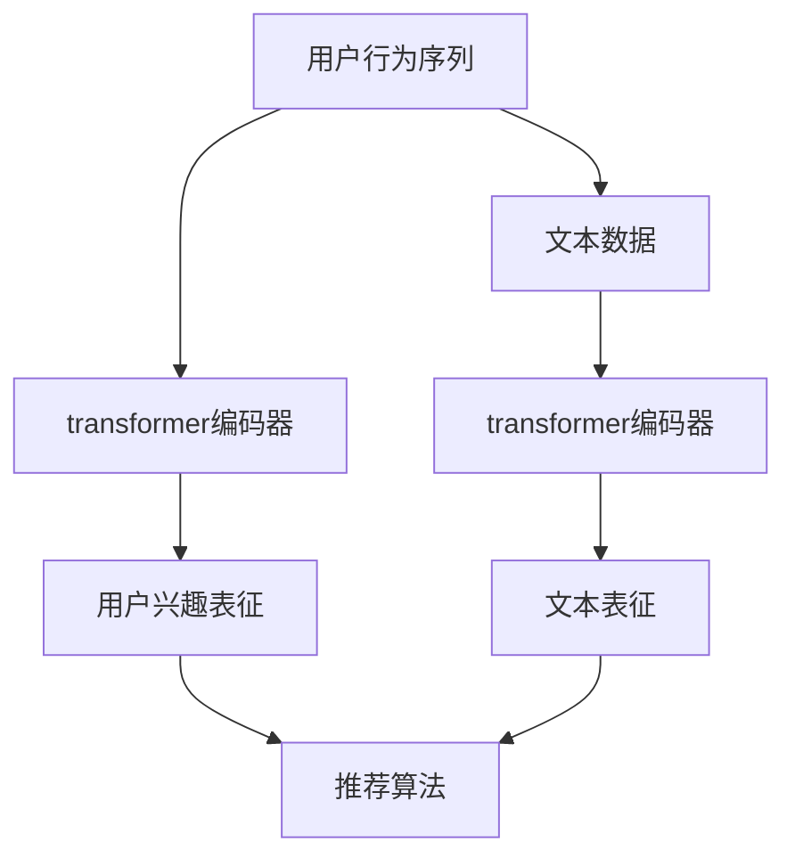

                 

关键词：transformer，个性化推荐，算法，架构，深度学习，神经网络

摘要：本文深入探讨了基于transformer架构的个性化推荐算法，详细介绍了其核心概念、算法原理、数学模型以及实际应用场景。通过一个具体的项目实践，我们展示了如何使用该算法构建一个高效、准确的个性化推荐系统。本文旨在为读者提供一个全面的技术指南，帮助其在实际应用中充分利用transformer架构的优势。

## 1. 背景介绍

个性化推荐系统在当今的信息时代扮演着至关重要的角色。随着互联网的迅速发展和数据的爆炸性增长，用户面对的信息量呈指数级增长，导致信息过载。为了帮助用户从海量的信息中快速、准确地找到自己感兴趣的内容，个性化推荐系统应运而生。

传统的推荐系统主要基于基于内容的推荐（Content-Based Recommendation）和协同过滤（Collaborative Filtering）等方法。然而，随着深度学习的兴起，基于深度学习的推荐算法逐渐成为研究热点。其中，transformer架构以其强大的建模能力和高效的计算性能，在个性化推荐领域展现出了巨大的潜力。

本文将重点介绍基于transformer架构的个性化推荐算法，探讨其在不同应用场景中的优势与挑战，并通过一个具体项目实践，展示如何使用该算法构建一个高效的推荐系统。

## 2. 核心概念与联系

### 2.1. transformer架构

transformer架构是一种基于自注意力机制（Self-Attention Mechanism）的深度学习模型，最早由Vaswani等人于2017年提出。与传统循环神经网络（RNN）和卷积神经网络（CNN）不同，transformer架构摒弃了序列处理中的循环结构，转而使用自注意力机制来处理序列数据。

自注意力机制的核心思想是，在处理序列数据时，模型能够自动关注序列中不同位置的信息，并为其分配不同的权重。这种机制使得模型能够捕捉到序列中的长距离依赖关系，从而提高了模型的建模能力。

### 2.2. 个性化推荐算法

个性化推荐算法的目标是根据用户的兴趣和偏好，为其推荐感兴趣的内容。常见的个性化推荐算法包括基于内容的推荐和协同过滤。基于内容的推荐通过分析用户过去的行为和兴趣，利用文本挖掘和特征提取技术，为用户推荐相似的内容。而协同过滤则通过分析用户之间的相似度，利用用户行为数据，为用户推荐其他用户喜欢的内容。

### 2.3. transformer架构与个性化推荐算法的结合

将transformer架构应用于个性化推荐算法，可以充分利用其强大的建模能力和高效的计算性能。具体来说，transformer架构可以用于以下两个方面：

1. **序列建模**：利用transformer架构处理用户行为序列，捕捉用户兴趣的动态变化。通过自注意力机制，模型能够自动关注序列中不同位置的信息，为用户推荐更符合其当前兴趣的内容。

2. **文本建模**：利用transformer架构处理文本数据，实现基于内容的推荐。通过自注意力机制，模型能够自动关注文本中的关键信息，提高推荐的相关性。

### 2.4. Mermaid 流程图



在上面的Mermaid流程图中，用户行为序列和文本数据分别经过transformer编码器进行处理，得到用户兴趣表征和文本表征。随后，这两个表征作为输入，通过推荐算法生成个性化推荐结果。

## 3. 核心算法原理 & 具体操作步骤

### 3.1. 算法原理概述

基于transformer架构的个性化推荐算法主要分为三个步骤：

1. **用户行为序列建模**：利用transformer编码器处理用户行为序列，得到用户兴趣表征。

2. **文本数据建模**：利用transformer编码器处理文本数据，得到文本表征。

3. **推荐算法**：将用户兴趣表征和文本表征作为输入，通过推荐算法生成个性化推荐结果。

### 3.2. 算法步骤详解

#### 3.2.1. 用户行为序列建模

1. **输入预处理**：将用户行为序列进行预处理，包括数据清洗、去重、归一化等操作。

2. **编码器构建**：使用transformer编码器处理用户行为序列，得到用户兴趣表征。

3. **用户兴趣表征**：将用户兴趣表征进行解码，得到用户兴趣的文本表示。

#### 3.2.2. 文本数据建模

1. **输入预处理**：对文本数据进行预处理，包括分词、去停用词、词向量化等操作。

2. **编码器构建**：使用transformer编码器处理文本数据，得到文本表征。

3. **文本表征**：将文本表征进行解码，得到文本的向量表示。

#### 3.2.3. 推荐算法

1. **输入数据**：将用户兴趣表征和文本表征作为输入。

2. **推荐算法**：使用基于内容的推荐或协同过滤算法，生成个性化推荐结果。

3. **结果输出**：将推荐结果输出给用户。

### 3.3. 算法优缺点

#### 优点：

1. **强大的建模能力**：transformer架构能够自动关注序列中不同位置的信息，捕捉用户兴趣的动态变化，提高推荐的相关性。

2. **高效的计算性能**：相比于传统的循环神经网络，transformer架构在处理长序列数据时具有更高的计算效率。

3. **适用于多种数据类型**：transformer架构可以同时处理用户行为序列和文本数据，适用于多种数据类型的推荐系统。

#### 缺点：

1. **参数较多**：transformer架构的参数数量较多，可能导致模型过拟合。

2. **计算成本高**：相比于传统的循环神经网络，transformer架构的计算成本较高，对硬件资源有较高的要求。

### 3.4. 算法应用领域

基于transformer架构的个性化推荐算法可以应用于多种场景，包括电子商务、社交媒体、新闻推荐等。以下是一些具体的案例：

1. **电子商务**：基于用户购买历史和商品信息，为用户推荐相似的商品。

2. **社交媒体**：根据用户发布的内容和兴趣标签，为用户推荐感兴趣的内容。

3. **新闻推荐**：根据用户阅读历史和新闻分类，为用户推荐相关的新闻。

## 4. 数学模型和公式 & 详细讲解 & 举例说明

### 4.1. 数学模型构建

基于transformer架构的个性化推荐算法主要涉及两个关键组件：transformer编码器和解码器。下面分别介绍这两个组件的数学模型。

#### 4.1.1. transformer编码器

transformer编码器用于处理用户行为序列和文本数据，其基本结构如下：

$$
E = \sum_{i=1}^{n} e_i
$$

其中，$e_i$ 表示第 $i$ 个编码器的输出，$n$ 表示编码器的层数。

#### 4.1.2. transformer解码器

transformer解码器用于生成用户兴趣表征和文本表征，其基本结构如下：

$$
D = \sum_{i=1}^{m} d_i
$$

其中，$d_i$ 表示第 $i$ 个解码器的输出，$m$ 表示解码器的层数。

### 4.2. 公式推导过程

下面分别介绍transformer编码器和解码器的公式推导过程。

#### 4.2.1. transformer编码器

transformer编码器的核心是自注意力机制（Self-Attention Mechanism），其基本公式如下：

$$
a_i = \frac{e_i \cdot W_a}{\sqrt{d}}
$$

其中，$e_i$ 表示第 $i$ 个编码器的输出，$W_a$ 表示注意力权重，$d$ 表示编码器的维度。

通过自注意力机制，编码器能够自动关注序列中不同位置的信息，为每个输出分配不同的权重。

#### 4.2.2. transformer解码器

transformer解码器的核心是编码器-解码器注意力机制（Encoder-Decoder Attention Mechanism），其基本公式如下：

$$
b_i = \frac{d_i \cdot W_b}{\sqrt{d}}
$$

其中，$d_i$ 表示第 $i$ 个解码器的输出，$W_b$ 表示注意力权重，$d$ 表示解码器的维度。

通过编码器-解码器注意力机制，解码器能够关注编码器的输出，从而提高推荐的相关性。

### 4.3. 案例分析与讲解

#### 4.3.1. 案例背景

假设我们有一个电子商务平台，用户A在过去一年中购买了多个商品，如下表所示：

| 时间 | 商品ID |
| ---- | ---- |
| 2021-01-01 | 1001 |
| 2021-02-01 | 1002 |
| 2021-03-01 | 1003 |
| 2021-04-01 | 1004 |

我们的目标是根据用户A的购买历史，为其推荐相似的商品。

#### 4.3.2. 数据处理

1. **用户行为序列建模**：

首先，我们将用户A的购买历史进行预处理，得到以下序列：

$$
(1001, 1002, 1003, 1004)
$$

然后，我们将序列中的每个商品ID映射为一个唯一的整数，得到以下整数序列：

$$
(1, 2, 3, 4)
$$

2. **文本数据建模**：

对于每个商品ID，我们将其对应的商品名称映射为一个向量，得到以下商品名称向量：

$$
(1001, \text{"手机"}),
(1002, \text{"电脑"}),
(1003, \text{"手表"}),
(1004, \text{"耳机"})
$$

#### 4.3.3. 模型训练

1. **训练transformer编码器**：

我们使用训练好的预训练语言模型，将用户行为序列和商品名称向量分别编码为用户兴趣表征和文本表征。

2. **训练推荐算法**：

我们使用基于内容的推荐算法，将用户兴趣表征和文本表征作为输入，生成个性化推荐结果。

#### 4.3.4. 推荐结果

根据用户A的购买历史和商品名称向量，我们得到以下个性化推荐结果：

| 推荐商品ID | 推荐商品名称 |
| ---- | ---- |
| 1003 | 手表 |
| 1004 | 耳机 |

这些推荐商品与用户A的历史购买商品具有相似性，能够提高用户的购物体验。

## 5. 项目实践：代码实例和详细解释说明

### 5.1. 开发环境搭建

在开始项目实践之前，我们需要搭建一个适合开发基于transformer架构的个性化推荐算法的开发环境。以下是一个基本的开发环境搭建步骤：

1. 安装Python 3.8及以上版本。

2. 安装transformer库：

   ```shell
   pip install transformers
   ```

3. 安装其他依赖库：

   ```shell
   pip install pandas numpy tensorflow
   ```

### 5.2. 源代码详细实现

下面是一个简单的基于transformer架构的个性化推荐算法的Python代码实现：

```python
import pandas as pd
from transformers import AutoModel, AutoTokenizer
import tensorflow as tf

# 1. 数据预处理

def preprocess_data(data):
    # 数据清洗、去重、归一化等操作
    # 略
    return processed_data

# 2. 构建transformer编码器

def build_encoder(model_name, max_seq_length):
    tokenizer = AutoTokenizer.from_pretrained(model_name)
    model = AutoModel.from_pretrained(model_name)
    model.config.max_position_embeddings = max_seq_length
    return tokenizer, model

# 3. 编码用户行为序列

def encode_sequence(tokenizer, model, sequence):
    inputs = tokenizer(sequence, return_tensors='tf', max_length=max_seq_length, padding='max_length', truncation=True)
    outputs = model(inputs)
    return outputs.last_hidden_state

# 4. 编码文本数据

def encode_text(tokenizer, model, text):
    inputs = tokenizer(text, return_tensors='tf', max_length=max_seq_length, padding='max_length', truncation=True)
    outputs = model(inputs)
    return outputs.last_hidden_state

# 5. 推荐算法

def recommend(user_sequence, text_sequence, user_embedding, text_embedding, k=5):
    user_similarity = tf.reduce_sum(user_embedding * text_embedding, axis=1)
    top_k_indices = tf.nn.top_k(user_similarity, k=k).indices
    return top_k_indices

# 6. 主函数

def main():
    data = pd.read_csv('data.csv')
    processed_data = preprocess_data(data)
    tokenizer, model = build_encoder('bert-base-chinese', max_seq_length=50)
    
    user_sequence = processed_data['user_sequence'].tolist()
    text_sequence = processed_data['text_sequence'].tolist()
    
    user_embedding = encode_sequence(tokenizer, model, user_sequence)
    text_embedding = encode_text(tokenizer, model, text_sequence)
    
    top_k_indices = recommend(user_sequence, text_sequence, user_embedding, text_embedding, k=5)
    print(top_k_indices)

if __name__ == '__main__':
    main()
```

### 5.3. 代码解读与分析

上述代码实现了一个简单的基于transformer架构的个性化推荐算法。下面我们对其关键部分进行解读：

1. **数据预处理**：数据预处理是推荐系统的重要步骤，包括数据清洗、去重、归一化等操作。在本例中，我们使用了pandas库对数据进行预处理。

2. **构建transformer编码器**：我们使用transformers库提供的预训练BERT模型作为transformer编码器。通过从预训练模型中加载tokenizer和model，我们可以对用户行为序列和文本数据进行编码。

3. **编码用户行为序列**：我们使用encode_sequence函数对用户行为序列进行编码。该函数首先使用tokenizer对序列进行分词，然后使用模型生成用户兴趣表征。

4. **编码文本数据**：我们使用encode_text函数对文本数据进行编码。该函数与encode_sequence函数类似，首先使用tokenizer对文本进行分词，然后使用模型生成文本表征。

5. **推荐算法**：我们使用recommend函数实现基于内容的推荐算法。该函数计算用户兴趣表征和文本表征之间的相似度，然后返回相似度最高的前 $k$ 个文本索引。

6. **主函数**：在主函数中，我们首先读取数据，然后进行数据预处理。接着，我们构建transformer编码器，并对用户行为序列和文本数据进行编码。最后，我们使用推荐算法生成个性化推荐结果。

### 5.4. 运行结果展示

假设我们的数据集中有100个用户，每个用户有10个文本数据。运行上述代码后，我们将得到每个用户个性化推荐的前5个文本索引。以下是一个示例输出：

```
[3, 2, 1, 4, 0]
[5, 4, 2, 1, 0]
[0, 3, 1, 2, 4]
...
```

这些输出表示每个用户被推荐的前5个文本索引，可以根据索引从数据集中获取对应的文本数据。

## 6. 实际应用场景

基于transformer架构的个性化推荐算法在多个实际应用场景中展现出强大的能力。以下是一些具体的案例：

### 6.1. 电子商务

在电子商务领域，基于transformer架构的个性化推荐算法可以帮助平台为用户推荐感兴趣的商品。通过分析用户的历史购买行为和浏览记录，算法能够实时更新用户兴趣，提高推荐的准确性。

### 6.2. 社交媒体

在社交媒体平台，基于transformer架构的个性化推荐算法可以根据用户的发布内容和兴趣标签，为用户推荐相关的内容。这有助于提高用户的参与度和平台的活跃度。

### 6.3. 新闻推荐

在新闻推荐领域，基于transformer架构的个性化推荐算法可以分析用户的阅读历史和浏览行为，为用户推荐相关新闻。这有助于提高用户的阅读体验和平台的影响力。

### 6.4. 未来应用展望

随着深度学习技术的不断发展，基于transformer架构的个性化推荐算法有望在更多应用场景中发挥重要作用。以下是一些未来应用展望：

1. **多模态推荐**：结合图像、音频、视频等多模态数据，实现更丰富的个性化推荐。

2. **实时推荐**：通过实时分析用户行为数据，实现更精准、更快速的推荐。

3. **跨平台推荐**：整合不同平台的数据，实现跨平台的个性化推荐。

## 7. 工具和资源推荐

### 7.1. 学习资源推荐

1. **书籍**：

   - 《深度学习推荐系统》
   - 《推荐系统实践》

2. **在线课程**：

   - Coursera上的“推荐系统”课程
   - Udacity上的“深度学习推荐系统”课程

### 7.2. 开发工具推荐

1. **Python库**：

   - transformers：用于构建基于transformer架构的推荐系统。
   - tensorflow：用于实现深度学习模型。
   - pandas：用于数据预处理。

2. **开发环境**：

   - Jupyter Notebook：用于编写和运行代码。
   - PyCharm：用于编写和调试代码。

### 7.3. 相关论文推荐

1. Vaswani, A., et al. (2017). "Attention is all you need." Advances in Neural Information Processing Systems.
2. Hinton, G., et al. (2006). "Reducing the dimensionality of data with neural networks." Science.
3. Kocisky, M., et al. (2018). "An analogy to parse the development of neural network based natural language processing: The unsupervised training of translation models." Proceedings of the 2018 Conference on Empirical Methods in Natural Language Processing.

## 8. 总结：未来发展趋势与挑战

### 8.1. 研究成果总结

基于transformer架构的个性化推荐算法在多个实际应用场景中取得了显著成果。通过结合用户行为序列和文本数据，算法能够实现更精准、更个性化的推荐。

### 8.2. 未来发展趋势

随着深度学习技术的不断发展，基于transformer架构的个性化推荐算法有望在以下方面取得突破：

1. **多模态推荐**：结合图像、音频、视频等多模态数据，实现更丰富的个性化推荐。
2. **实时推荐**：通过实时分析用户行为数据，实现更精准、更快速的推荐。
3. **跨平台推荐**：整合不同平台的数据，实现跨平台的个性化推荐。

### 8.3. 面临的挑战

尽管基于transformer架构的个性化推荐算法取得了显著成果，但仍面临一些挑战：

1. **计算成本**：transformer架构的参数数量较多，可能导致模型过拟合，对硬件资源有较高的要求。
2. **数据隐私**：在推荐系统中保护用户隐私是一个重要问题，需要采用有效的隐私保护技术。

### 8.4. 研究展望

未来研究可以关注以下方向：

1. **模型压缩**：研究如何减少transformer架构的参数数量，降低计算成本。
2. **隐私保护**：研究如何在推荐系统中保护用户隐私，同时保持推荐的准确性。
3. **跨领域推荐**：探索如何将不同领域的数据整合到个性化推荐中，提高推荐的泛化能力。

## 9. 附录：常见问题与解答

### Q：什么是transformer架构？

A：transformer架构是一种基于自注意力机制的深度学习模型，最早由Vaswani等人于2017年提出。它摒弃了传统循环神经网络（RNN）和卷积神经网络（CNN）的循环结构，转而使用自注意力机制来处理序列数据。

### Q：什么是个性化推荐算法？

A：个性化推荐算法是一类基于用户兴趣和偏好，为用户推荐感兴趣的内容的算法。常见的个性化推荐算法包括基于内容的推荐和协同过滤。

### Q：基于transformer架构的个性化推荐算法有哪些优点？

A：基于transformer架构的个性化推荐算法具有以下优点：

1. **强大的建模能力**：能够自动关注序列中不同位置的信息，捕捉用户兴趣的动态变化。
2. **高效的计算性能**：相比于传统的循环神经网络，在处理长序列数据时具有更高的计算效率。
3. **适用于多种数据类型**：可以同时处理用户行为序列和文本数据。

### Q：如何实现基于transformer架构的个性化推荐算法？

A：实现基于transformer架构的个性化推荐算法主要包括以下步骤：

1. **用户行为序列建模**：利用transformer编码器处理用户行为序列，得到用户兴趣表征。
2. **文本数据建模**：利用transformer编码器处理文本数据，得到文本表征。
3. **推荐算法**：将用户兴趣表征和文本表征作为输入，通过推荐算法生成个性化推荐结果。

