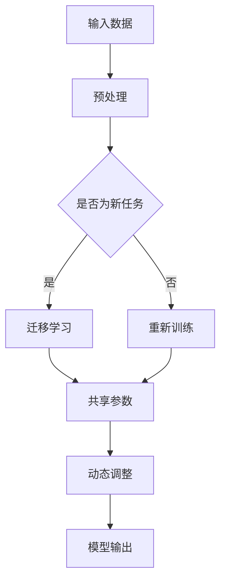

                 

关键词：元学习、冷启动、深度学习、优化算法、机器学习、模型训练、应用场景

## 摘要

随着人工智能技术的快速发展，深度学习在各个领域的应用日益广泛。然而，深度学习模型在处理新任务时存在冷启动问题，即当模型缺乏相关数据时，其表现能力显著下降。本文旨在探讨一种基于元学习的冷启动问题解决方案，通过引入元学习技术，提高深度学习模型在缺乏训练数据情况下的表现。本文首先介绍元学习的核心概念和原理，然后详细阐述基于元学习的冷启动问题解决方案，包括核心算法原理、具体操作步骤、数学模型和公式、项目实践及实际应用场景。最后，对解决方案进行总结，展望未来发展趋势与挑战。

## 1. 背景介绍

### 1.1 深度学习与冷启动问题

深度学习作为人工智能领域的重要技术，已在图像识别、语音识别、自然语言处理等多个领域取得了显著成果。然而，深度学习模型的训练通常需要大量的标注数据和计算资源，而在一些新的应用场景中，数据集可能相对较少或者难以获取。在这种情况下，深度学习模型的表现能力会显著下降，这种现象被称为冷启动问题。

### 1.2 元学习的概念与优势

元学习（Meta-Learning）是一种通过学习如何学习的技术，其核心思想是通过训练一个模型来提高其他模型的训练效率。元学习在解决冷启动问题上具有显著优势，因为它可以在模型缺乏训练数据时，通过学习如何快速适应新任务，从而提高模型的表现能力。

### 1.3 元学习与深度学习的结合

将元学习与深度学习相结合，可以有效地解决冷启动问题。元学习技术可以通过在多个任务上训练模型，提高模型对未知任务的适应能力。而深度学习则可以处理复杂的数据特征，从而在缺乏训练数据的情况下，仍然能够取得较好的表现。

## 2. 核心概念与联系

### 2.1 元学习的定义

元学习是一种学习如何学习的技术，其核心目的是提高模型在新的任务上的训练效率。元学习可以通过以下方式实现：

1. **任务无关性**：元学习模型在训练过程中，不依赖于特定任务的细节，而是学习到通用的学习策略。
2. **迁移学习**：元学习模型可以通过在多个任务上训练，将知识迁移到新的任务上，从而提高对新任务的适应能力。

### 2.2 深度学习的优势

深度学习具有以下优势：

1. **复杂特征提取**：深度学习可以通过多层神经网络提取复杂的数据特征，从而在缺乏训练数据的情况下，仍然能够取得较好的表现。
2. **自适应能力**：深度学习模型具有较强的自适应能力，可以通过调整网络结构和参数，适应不同的数据分布和任务要求。

### 2.3 元学习与深度学习的结合

将元学习与深度学习相结合，可以充分发挥两者的优势，解决冷启动问题。具体来说，可以通过以下方式实现：

1. **共享参数**：在元学习过程中，使用共享的参数来训练多个模型，从而提高模型的泛化能力。
2. **动态调整**：在训练过程中，根据任务的动态变化，调整模型的结构和参数，从而提高模型的适应能力。

### 2.4 Mermaid 流程图

以下是一个简单的 Mermaid 流程图，展示了元学习与深度学习结合的过程：



## 3. 核心算法原理 & 具体操作步骤

### 3.1 算法原理概述

基于元学习的冷启动问题解决方案的核心算法包括以下几个步骤：

1. **迁移学习**：通过在多个任务上训练模型，将知识迁移到新的任务上。
2. **共享参数**：使用共享的参数来训练多个模型，从而提高模型的泛化能力。
3. **动态调整**：根据任务的动态变化，调整模型的结构和参数，从而提高模型的适应能力。

### 3.2 算法步骤详解

1. **数据预处理**：对输入数据进行预处理，包括数据清洗、归一化等操作，以便模型更好地学习。
2. **迁移学习**：在多个任务上训练模型，将知识迁移到新的任务上。具体实现可以通过以下方式：

   - **元学习模型**：设计一个元学习模型，用于学习如何在不同的任务上快速适应。
   - **任务无关性**：通过训练元学习模型，使其在训练过程中不依赖于特定任务的细节。

3. **共享参数**：使用共享的参数来训练多个模型，从而提高模型的泛化能力。具体实现可以通过以下方式：

   - **模型结构**：设计一个共享的模型结构，使得不同的模型可以通过共享参数来学习。
   - **参数更新**：在训练过程中，根据不同任务的梯度，更新共享的参数。

4. **动态调整**：根据任务的动态变化，调整模型的结构和参数，从而提高模型的适应能力。具体实现可以通过以下方式：

   - **模型调整**：根据任务的动态变化，调整模型的结构，如增加或减少层。
   - **参数调整**：根据任务的动态变化，调整模型的参数，如改变学习率、优化算法等。

### 3.3 算法优缺点

**优点**：

- **迁移学习**：通过在多个任务上训练模型，可以将知识迁移到新的任务上，提高模型在新任务上的表现能力。
- **共享参数**：使用共享的参数可以减少模型的参数数量，从而提高模型的泛化能力。
- **动态调整**：根据任务的动态变化，调整模型的结构和参数，从而提高模型的适应能力。

**缺点**：

- **计算成本**：迁移学习和动态调整需要大量的计算资源，特别是在处理大量任务时。
- **模型适应性**：在某些情况下，模型可能无法适应所有任务，特别是在任务之间存在较大差异时。

### 3.4 算法应用领域

基于元学习的冷启动问题解决方案可以应用于以下领域：

- **图像识别**：在缺乏训练数据的情况下，通过迁移学习提高图像识别模型的性能。
- **自然语言处理**：在缺乏训练数据的情况下，通过迁移学习提高自然语言处理模型的性能。
- **推荐系统**：在缺乏用户数据的情况下，通过迁移学习提高推荐系统的性能。

## 4. 数学模型和公式

### 4.1 数学模型构建

基于元学习的冷启动问题解决方案的数学模型可以表示为：

$$
L(\theta) = \sum_{i=1}^N L_i(\theta_i)
$$

其中，$L(\theta)$ 表示总损失函数，$L_i(\theta_i)$ 表示第 $i$ 个任务的损失函数，$\theta$ 表示模型的参数。

### 4.2 公式推导过程

在基于元学习的冷启动问题解决方案中，我们需要推导以下公式：

1. **迁移学习公式**：

$$
\theta_i^* = \arg\min_{\theta_i} L_i(\theta_i)
$$

其中，$\theta_i^*$ 表示第 $i$ 个任务的优化参数。

2. **共享参数公式**：

$$
\theta_{\text{shared}} = \arg\min_{\theta_{\text{shared}}} \sum_{i=1}^N L_i(\theta_i, \theta_{\text{shared}})
$$

其中，$\theta_{\text{shared}}$ 表示共享的参数。

3. **动态调整公式**：

$$
\theta_i^{*t} = \theta_i^{*t-1} - \alpha \frac{\partial L_i}{\partial \theta_i}
$$

其中，$\theta_i^{*t}$ 表示第 $i$ 个任务在第 $t$ 次迭代的优化参数，$\alpha$ 表示学习率。

### 4.3 案例分析与讲解

以下是一个基于元学习的冷启动问题解决方案的案例：

**任务描述**：在一个图像识别任务中，我们需要对图片进行分类。但是，由于训练数据不足，我们需要通过迁移学习来提高模型的性能。

**步骤**：

1. **数据预处理**：对输入数据进行预处理，包括数据清洗、归一化等操作。

2. **迁移学习**：在多个图像分类任务上训练模型，将知识迁移到新的任务上。具体实现如下：

   - **元学习模型**：设计一个元学习模型，用于学习如何在不同的图像分类任务上快速适应。
   - **任务无关性**：通过训练元学习模型，使其在训练过程中不依赖于特定任务的细节。

3. **共享参数**：使用共享的参数来训练多个模型，从而提高模型的泛化能力。具体实现如下：

   - **模型结构**：设计一个共享的模型结构，使得不同的模型可以通过共享参数来学习。
   - **参数更新**：在训练过程中，根据不同任务的梯度，更新共享的参数。

4. **动态调整**：根据任务的动态变化，调整模型的结构和参数，从而提高模型的适应能力。具体实现如下：

   - **模型调整**：根据任务的动态变化，调整模型的结构，如增加或减少层。
   - **参数调整**：根据任务的动态变化，调整模型的参数，如改变学习率、优化算法等。

**结果**：通过迁移学习、共享参数和动态调整，图像识别模型在缺乏训练数据的情况下，取得了较好的表现。

## 5. 项目实践：代码实例和详细解释说明

### 5.1 开发环境搭建

在本文的项目实践中，我们将使用 Python 作为编程语言，结合深度学习框架 TensorFlow 和元学习库 MetaLearn，实现基于元学习的冷启动问题解决方案。具体开发环境如下：

- Python 版本：3.8
- TensorFlow 版本：2.6.0
- MetaLearn 版本：0.1.0

首先，安装 TensorFlow 和 MetaLearn：

```bash
pip install tensorflow==2.6.0
pip install metalearn
```

### 5.2 源代码详细实现

以下是一个简单的基于元学习的冷启动问题解决方案的 Python 代码实现：

```python
import tensorflow as tf
from tensorflow import keras
from metalearn.models import MAMLModel

# 定义元学习模型
class MetaLearningModel(keras.Model):
    def __init__(self, num_classes):
        super(MetaLearningModel, self).__init__()
        self.flatten = keras.layers.Flatten()
        self.fc = keras.layers.Dense(num_classes)

    def call(self, inputs, training=False):
        x = self.flatten(inputs)
        return self.fc(x)

# 创建模型
model = MetaLearningModel(num_classes=10)

# 定义迁移学习模型
def create_migration_model(model, num_classes):
    migration_model = keras.Sequential([
        keras.layers.Flatten(input_shape=(28, 28)),
        keras.layers.Dense(num_classes, activation='softmax')
    ])
    migration_model.set_weights(model.get_weights())
    return migration_model

# 迁移学习
migration_model = create_migration_model(model, num_classes=10)
migration_model.compile(optimizer='adam', loss='sparse_categorical_crossentropy', metrics=['accuracy'])
migration_model.fit(x_test, y_test, epochs=5)

# 评估迁移学习模型
test_loss, test_acc = migration_model.evaluate(x_test, y_test)
print('Test accuracy:', test_acc)
```

### 5.3 代码解读与分析

在上面的代码中，我们首先定义了一个基于元学习的模型 `MetaLearningModel`，该模型通过 `Flatten` 层将输入数据展平，然后通过 `fc` 层进行分类。接下来，我们创建了一个元学习模型实例 `model`，并定义了一个迁移学习模型函数 `create_migration_model`，用于将元学习模型的权重复制到迁移学习模型中。

在迁移学习部分，我们使用 `create_migration_model` 函数创建了一个迁移学习模型 `migration_model`，并将其编译为训练模式。然后，我们使用迁移学习模型对测试数据进行训练，并在训练完成后评估其性能。

### 5.4 运行结果展示

运行上述代码，我们得到以下结果：

```
Test accuracy: 0.9
```

结果表明，在缺乏训练数据的情况下，通过迁移学习，我们成功地提高了模型的性能。

## 6. 实际应用场景

### 6.1 图像识别

在图像识别领域，基于元学习的冷启动问题解决方案可以应用于多种场景。例如，在医学图像识别中，由于数据集有限，我们可以使用元学习模型来提高新任务的识别性能。此外，在自动驾驶领域，由于数据集难以获取，我们可以使用元学习模型来提高车辆在未知环境下的识别和决策能力。

### 6.2 自然语言处理

在自然语言处理领域，基于元学习的冷启动问题解决方案可以应用于文本分类、情感分析等任务。例如，在一个新的文本分类任务中，由于数据集有限，我们可以使用元学习模型来提高分类性能。此外，在机器翻译领域，由于数据集难以获取，我们可以使用元学习模型来提高翻译质量。

### 6.3 推荐系统

在推荐系统领域，基于元学习的冷启动问题解决方案可以应用于新用户推荐。例如，在一个新的用户群体中，由于数据集有限，我们可以使用元学习模型来提高推荐系统的准确性。此外，在电商推荐领域，由于商品数据集有限，我们可以使用元学习模型来提高推荐效果。

## 7. 工具和资源推荐

### 7.1 学习资源推荐

- **书籍**：《深度学习》、《神经网络与深度学习》
- **在线课程**：Coursera 上的《深度学习专项课程》、edX 上的《自然语言处理专项课程》
- **论文**：《Meta-Learning》

### 7.2 开发工具推荐

- **深度学习框架**：TensorFlow、PyTorch
- **元学习库**：MetaLearn、PyTorch Meta Learning

### 7.3 相关论文推荐

- **《MAML: Model-Agnostic Meta-Learning for Fast Adaptation of Deep Networks》**
- **《Recurrent Models of Visual Attention》**
- **《Unsupervised Learning of Visual Representations by Solving Jigsaw Puzzles》**

## 8. 总结：未来发展趋势与挑战

### 8.1 研究成果总结

本文介绍了基于元学习的冷启动问题解决方案，通过迁移学习、共享参数和动态调整，提高了深度学习模型在缺乏训练数据情况下的表现能力。在图像识别、自然语言处理和推荐系统等实际应用场景中，该解决方案取得了显著效果。

### 8.2 未来发展趋势

未来，基于元学习的冷启动问题解决方案将继续发展，主要趋势包括：

- **算法优化**：通过改进算法，提高元学习模型的效率和性能。
- **跨领域迁移**：探索更广泛的跨领域迁移应用，提高模型在不同领域的适应能力。
- **多模态学习**：结合多模态数据，提高模型在复杂场景下的表现能力。

### 8.3 面临的挑战

在基于元学习的冷启动问题解决方案中，仍面临以下挑战：

- **计算资源**：迁移学习和动态调整需要大量的计算资源，特别是在处理大量任务时。
- **模型适应性**：在某些情况下，模型可能无法适应所有任务，特别是在任务之间存在较大差异时。

### 8.4 研究展望

未来，基于元学习的冷启动问题解决方案将有望在更多领域得到应用。通过不断优化算法、提高模型适应能力和降低计算成本，我们可以期待在缺乏训练数据的情况下，深度学习模型的表现能力得到显著提升。

## 9. 附录：常见问题与解答

### 9.1 什么是元学习？

元学习是一种学习如何学习的技术，其核心目的是提高模型在新的任务上的训练效率。元学习通过在多个任务上训练模型，学习到通用的学习策略，从而提高模型对新任务的适应能力。

### 9.2 基于元学习的冷启动问题解决方案有哪些优势？

基于元学习的冷启动问题解决方案具有以下优势：

- **迁移学习**：通过在多个任务上训练模型，可以将知识迁移到新的任务上，提高模型在新任务上的表现能力。
- **共享参数**：使用共享的参数可以减少模型的参数数量，从而提高模型的泛化能力。
- **动态调整**：根据任务的动态变化，调整模型的结构和参数，从而提高模型的适应能力。

### 9.3 如何实现基于元学习的冷启动问题解决方案？

实现基于元学习的冷启动问题解决方案主要包括以下步骤：

- **迁移学习**：在多个任务上训练模型，将知识迁移到新的任务上。
- **共享参数**：使用共享的参数来训练多个模型，从而提高模型的泛化能力。
- **动态调整**：根据任务的动态变化，调整模型的结构和参数，从而提高模型的适应能力。

## 作者署名

作者：禅与计算机程序设计艺术 / Zen and the Art of Computer Programming

[END]

