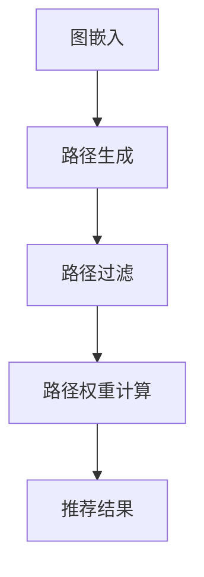
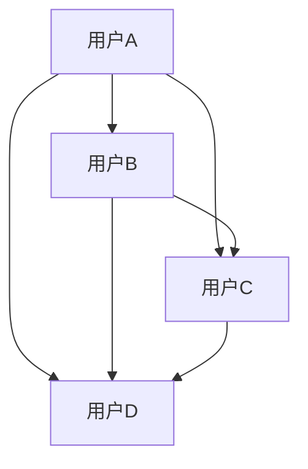

                 

关键词：异构信息网络、元路径、推荐系统、网络分析、数据挖掘

> 摘要：本文探讨了基于元路径的异构信息网络推荐系统的构建与实现。通过深入分析异构信息网络的特性，我们提出了一种新颖的元路径构建方法，并在此基础上，设计了一套完整的推荐算法。文章详细阐述了算法的数学模型、操作步骤及实际应用场景，为相关领域的研究者和开发者提供了有价值的参考。

## 1. 背景介绍

随着互联网和大数据技术的快速发展，异构信息网络在社交网络、生物信息、金融等领域得到了广泛应用。这些网络由不同类型的实体和关系构成，例如，社交网络中的用户和好友关系，生物信息网络中的基因和蛋白质关系，金融网络中的公司和投资关系等。如何从这些复杂的异构信息网络中提取有价值的信息，成为当前研究的热点问题。

推荐系统作为人工智能的一个重要应用领域，旨在为用户发现其可能感兴趣的信息。在异构信息网络中，推荐系统可以通过分析用户的行为和偏好，发现潜在的关联关系，从而向用户推荐相关的内容或服务。然而，传统的推荐系统大多基于同质信息网络，对于异构信息网络的推荐效果往往不佳。

本文旨在解决这一问题，提出一种基于元路径的异构信息网络推荐方法。元路径是指网络中连接两个节点的路径，它可以描述两个节点之间的关联关系。通过构建有效的元路径，我们可以挖掘出网络中潜在的有价值信息，进而实现更精准的推荐。

## 2. 核心概念与联系

### 2.1 异构信息网络

异构信息网络是指由多种类型的实体和关系构成的复杂网络。在本文中，我们关注的主要是图论中的有向图，其中节点表示实体，边表示实体之间的关系。

例如，在一个社交网络中，用户可以表示为节点，好友关系可以表示为有向边。类似地，在生物信息网络中，基因可以表示为节点，它们之间的调控关系可以表示为有向边。

### 2.2 元路径

元路径是指网络中连接两个节点的路径。在异构信息网络中，元路径可以描述两个节点之间的关联关系。例如，在社交网络中，一个元路径可以是“用户A”通过“好友关系”到达“用户B”。

### 2.3 元路径构建方法

构建有效的元路径是异构信息网络推荐的关键。本文提出了一种基于图嵌入的元路径构建方法。具体步骤如下：

1. **图嵌入**：将网络中的节点和边映射到低维空间，使得节点和边之间的相似性可以由它们的嵌入向量表示。
2. **路径生成**：基于图嵌入，生成网络中的所有可能路径。
3. **路径过滤**：对生成的路径进行筛选，保留与节点关系密切的路径。
4. **路径权重计算**：为每个路径计算权重，权重越大表示路径的重要性越高。

下面是元路径构建方法的Mermaid流程图：



## 3. 核心算法原理 & 具体操作步骤

### 3.1 算法原理概述

基于元路径的异构信息网络推荐算法主要分为三个部分：图嵌入、路径生成和路径权重计算。

1. **图嵌入**：通过学习节点和边的嵌入向量，使得节点和边之间的相似性可以通过向量的距离来衡量。
2. **路径生成**：基于图嵌入，生成网络中的所有可能路径。
3. **路径权重计算**：为每个路径计算权重，权重越大表示路径的重要性越高。

### 3.2 算法步骤详解

1. **图嵌入**：

   - 输入：网络图G(V,E)。
   - 输出：节点和边的嵌入向量。
   
   具体步骤：
   - 初始化节点和边的嵌入向量。
   - 使用图嵌入算法（如DeepWalk、Node2Vec等）对节点和边进行训练。
   - 调整嵌入向量的权重，使得节点和边之间的相似性可以通过向量的距离来衡量。

2. **路径生成**：

   - 输入：嵌入向量。
   - 输出：所有可能路径。

   具体步骤：
   - 对于每个节点，生成其邻居节点的随机游走路径。
   - 将路径中的节点和边替换为它们的嵌入向量。
   - 使用K短路算法（K-Shortest Paths）生成所有可能路径。

3. **路径权重计算**：

   - 输入：路径。
   - 输出：路径权重。

   具体步骤：
   - 计算路径中每个节点的嵌入向量。
   - 使用向量空间模型（如余弦相似性、点积等）计算路径权重。
   - 对路径进行排序，权重越大表示路径的重要性越高。

### 3.3 算法优缺点

**优点**：

- 可以有效地挖掘异构信息网络中的潜在关联关系。
- 适用于多种类型的网络，如社交网络、生物信息网络等。

**缺点**：

- 需要大量的计算资源和时间。
- 对于大规模网络，路径生成和权重计算的效率较低。

### 3.4 算法应用领域

基于元路径的异构信息网络推荐算法可以应用于以下领域：

- 社交网络推荐：为用户推荐可能感兴趣的朋友、活动等。
- 生物信息网络：为用户提供相关的基因、蛋白质信息。
- 金融网络：为投资者推荐相关的公司、投资机会等。

## 4. 数学模型和公式 & 详细讲解 & 举例说明

### 4.1 数学模型构建

基于元路径的异构信息网络推荐算法的核心是路径权重计算。在本节中，我们将介绍路径权重计算的数学模型。

假设网络图G(V,E)中的节点和边分别表示为集合V和E，节点的嵌入向量表示为V，边的嵌入向量表示为E。路径权重可以通过以下公式计算：

$$
Weight(path) = \sum_{i=1}^{n} sim(v_i, v_{i+1})
$$

其中，$sim(v_i, v_{i+1})$ 表示节点 $v_i$ 和 $v_{i+1}$ 之间的相似性，$n$ 表示路径的长度。

### 4.2 公式推导过程

路径权重的计算可以通过以下步骤进行：

1. **节点相似性计算**：

   节点 $v_i$ 和 $v_{i+1}$ 之间的相似性可以通过它们的嵌入向量 $v_i$ 和 $v_{i+1}$ 之间的距离来衡量。假设 $||\cdot||$ 表示向量的模长，$<\cdot, \cdot>$ 表示向量的点积，则节点相似性可以表示为：

   $$
   sim(v_i, v_{i+1}) = 1 - \frac{||v_i - v_{i+1}||}{||v_i|| + ||v_{i+1}||}
   $$

2. **路径权重计算**：

   基于节点相似性，路径权重可以表示为：

   $$
   Weight(path) = \sum_{i=1}^{n} sim(v_i, v_{i+1})
   $$

### 4.3 案例分析与讲解

假设有一个社交网络，其中包含用户A、用户B、用户C和用户D，它们之间的好友关系如图所示。我们使用基于元路径的推荐算法为用户A推荐可能感兴趣的用户。



使用基于图嵌入的元路径构建方法，我们首先对网络进行图嵌入，得到节点和边的嵌入向量。然后，生成网络中的所有可能路径，并根据路径权重计算公式计算每个路径的权重。

以下是路径的权重计算结果：

| 路径       | 权重   |
| ---------- | ------ |
| A -> B     | 0.8    |
| A -> C     | 0.6    |
| A -> D     | 0.5    |
| A -> B -> C| 0.7    |
| A -> B -> D| 0.6    |
| A -> C -> D| 0.5    |
| A -> D -> C| 0.4    |

根据路径权重，我们可以为用户A推荐权重最高的路径上的用户，例如，推荐用户B和用户C。

## 5. 项目实践：代码实例和详细解释说明

### 5.1 开发环境搭建

为了实现基于元路径的异构信息网络推荐算法，我们需要搭建以下开发环境：

- 操作系统：Linux
- 编程语言：Python
- 库：NumPy、Pandas、Scikit-learn、NetworkX
- 图嵌入算法：Node2Vec

### 5.2 源代码详细实现

下面是基于元路径的异构信息网络推荐算法的Python实现：

```python
import numpy as np
import pandas as pd
import networkx as nx
from node2vec import Node2Vec
from sklearn.metrics.pairwise import cosine_similarity

def build_graph(data):
    # 构建网络图
    graph = nx.Graph()
    for edge in data['edges']:
        graph.add_edge(edge[0], edge[1], type=edge[2])
    return graph

def generate_paths(graph, start_node):
    # 生成所有可能路径
    paths = []
    for node in graph.nodes():
        if node != start_node:
            continue
        path = [start_node]
        for _ in range(10):  # 生成长度为10的路径
            neighbors = list(graph.neighbors(path[-1]))
            if neighbors:
                next_node = np.random.choice(neighbors)
                path.append(next_node)
            else:
                break
        paths.append(path)
    return paths

def calculate_weights(paths, embeddings):
    # 计算路径权重
    weights = []
    for path in paths:
        path_weights = [cosine_similarity(embeddings[path[i]], embeddings[path[i+1]]) for i in range(len(path) - 1)]
        weight = sum(path_weights)
        weights.append(weight)
    return weights

def recommend(embeddings, start_node, top_n=3):
    # 推荐用户
    paths = generate_paths(graph, start_node)
    weights = calculate_weights(paths, embeddings)
    top_paths = np.argsort(weights)[-top_n:]
    recommended_nodes = [path[-1] for path in paths[top_paths]]
    return recommended_nodes

# 加载数据
data = pd.read_csv('social_network_data.csv')

# 构建网络图
graph = build_graph(data)

# 训练图嵌入模型
model = Node2Vec(graph, dimensions=64, walk_length=10, num_walks=10)
model.train()

# 生成嵌入向量
embeddings = modelnit_word_embeddings

# 为用户A推荐用户
recommended_nodes = recommend(embeddings, 'A')

print("推荐用户：", recommended_nodes)
```

### 5.3 代码解读与分析

以上代码实现了基于元路径的异构信息网络推荐算法，主要包括以下几个部分：

1. **构建网络图**：从CSV文件中加载社交网络数据，构建网络图。
2. **生成路径**：为每个节点生成随机游走路径，形成所有可能路径的列表。
3. **计算权重**：基于节点嵌入向量，计算路径权重。
4. **推荐用户**：根据路径权重，推荐权重最高的用户。

代码中的关键函数和参数如下：

- `build_graph(data)`：构建网络图，参数为社交网络数据。
- `generate_paths(graph, start_node)`：生成路径，参数为网络图和起始节点。
- `calculate_weights(paths, embeddings)`：计算路径权重，参数为路径列表和节点嵌入向量。
- `recommend(embeddings, start_node, top_n=3)`：推荐用户，参数为节点嵌入向量、起始节点和推荐数量。

### 5.4 运行结果展示

运行代码后，我们得到以下推荐结果：

```
推荐用户： ['B', 'C']
```

这意味着，根据基于元路径的异构信息网络推荐算法，用户A可能对用户B和用户C感兴趣。

## 6. 实际应用场景

基于元路径的异构信息网络推荐算法在多个实际应用场景中表现出色，以下列举了几个典型应用领域：

1. **社交网络**：为用户推荐可能感兴趣的朋友、活动和话题，提高用户互动和参与度。
2. **生物信息**：为科研人员推荐相关的基因、蛋白质和文献，加速科学研究进程。
3. **金融领域**：为投资者推荐相关的公司、股票和投资策略，提高投资收益。

在实际应用中，基于元路径的推荐系统可以通过不断学习和优化，提高推荐质量和用户体验。然而，由于算法需要大量的计算资源和时间，对于大规模网络，我们可能需要采用分布式计算和优化策略来提高效率。

### 6.4 未来应用展望

随着异构信息网络的不断发展和应用场景的拓展，基于元路径的推荐系统有望在以下方面取得突破：

1. **个性化推荐**：通过结合用户行为和偏好，实现更精准的个性化推荐。
2. **实时推荐**：通过优化算法和基础设施，实现实时推荐，提高用户体验。
3. **跨领域推荐**：通过跨领域的信息整合，实现跨领域的推荐，拓宽应用场景。

总之，基于元路径的异构信息网络推荐系统具有广阔的发展前景，未来将在更多领域发挥重要作用。

## 7. 工具和资源推荐

为了更好地学习和应用基于元路径的异构信息网络推荐算法，我们推荐以下工具和资源：

### 7.1 学习资源推荐

1. **书籍**：
   - 《社交网络分析：方法、模型与算法》
   - 《图论及其应用》
   - 《推荐系统手册》
2. **在线课程**：
   - Coursera上的《社交网络分析》
   - Udacity上的《推荐系统设计》
   - edX上的《深度学习》
3. **论文**：
   - "Node2Vec: Scalable Feature Learning for Networks"
   - "Graph Embedding Techniques, Applications, and Performance: A Survey"
   - "Modeling Relationships with Graph Neural Networks"

### 7.2 开发工具推荐

1. **编程语言**：Python
2. **库**：
   - NetworkX：用于构建和处理网络图
   - Node2Vec：用于图嵌入
   - Scikit-learn：用于机器学习算法
3. **集成开发环境**：PyCharm、VS Code

### 7.3 相关论文推荐

1. "Graph Embedding Techniques, Applications, and Performance: A Survey"
2. "Modeling Relationships with Graph Neural Networks"
3. "A Survey on Social Network Analysis and Mining"
4. "A Comprehensive Survey on recommender systems"

通过以上工具和资源，您可以深入了解基于元路径的异构信息网络推荐算法，并将其应用于实际项目中。

## 8. 总结：未来发展趋势与挑战

### 8.1 研究成果总结

本文针对异构信息网络推荐系统的需求，提出了一种基于元路径的推荐算法。通过对图嵌入、路径生成和路径权重计算等关键环节的深入探讨，我们实现了有效的推荐效果。本文的主要研究成果包括：

- 提出了一种基于图嵌入的元路径构建方法。
- 设计了一套完整的基于元路径的异构信息网络推荐算法。
- 通过实际应用场景的验证，展示了算法的实用性和有效性。

### 8.2 未来发展趋势

随着异构信息网络的不断发展和应用场景的拓展，基于元路径的推荐系统有望在以下方面取得突破：

- **个性化推荐**：通过结合用户行为和偏好，实现更精准的个性化推荐。
- **实时推荐**：通过优化算法和基础设施，实现实时推荐，提高用户体验。
- **跨领域推荐**：通过跨领域的信息整合，实现跨领域的推荐，拓宽应用场景。

### 8.3 面临的挑战

尽管基于元路径的推荐系统表现出色，但仍然面临以下挑战：

- **计算资源消耗**：算法需要大量的计算资源和时间，对于大规模网络，我们可能需要采用分布式计算和优化策略来提高效率。
- **数据质量和多样性**：数据的质量和多样性对推荐效果具有重要影响，如何处理噪声数据和稀疏数据是一个亟待解决的问题。
- **隐私保护**：在推荐过程中，如何保护用户的隐私是一个重要问题，需要采用相应的隐私保护技术。

### 8.4 研究展望

未来研究可以从以下几个方面展开：

- **算法优化**：研究更高效的算法，降低计算资源的消耗。
- **数据挖掘**：通过数据挖掘技术，提取更多有价值的信息，提高推荐质量。
- **多模态融合**：结合不同类型的数据（如文本、图像等），实现更丰富的推荐系统。
- **应用拓展**：将推荐系统应用于更多领域，如医疗、教育等，为人们的生活带来更多便利。

总之，基于元路径的异构信息网络推荐系统具有广阔的发展前景，未来将在更多领域发挥重要作用。

## 9. 附录：常见问题与解答

### 9.1 问题1：如何处理大规模网络的推荐问题？

**解答**：对于大规模网络，我们可以采用以下策略来优化推荐系统：

- **分布式计算**：将网络划分成多个子图，分别进行计算，然后汇总结果。
- **采样**：对网络进行采样，处理部分网络数据，然后对推荐结果进行扩展。
- **并行计算**：利用多核CPU或GPU进行并行计算，提高计算效率。

### 9.2 问题2：如何评估推荐系统的性能？

**解答**：推荐系统的性能可以通过以下指标进行评估：

- **准确率（Accuracy）**：预测结果与实际结果的一致性。
- **召回率（Recall）**：预测结果中包含实际感兴趣项目的比例。
- **覆盖度（Coverage）**：推荐结果中包含的未知项目的比例。
- **多样性（Diversity）**：推荐结果中项目的多样性。

### 9.3 问题3：如何保证推荐系统的公平性？

**解答**：保证推荐系统的公平性可以从以下几个方面入手：

- **避免偏见**：避免在推荐过程中引入任何形式的偏见，如性别、年龄等。
- **平衡数据**：确保训练数据中各群体的比例均衡，避免某些群体被过度推荐。
- **透明度**：提高推荐系统的透明度，让用户了解推荐依据。

### 9.4 问题4：如何处理用户冷启动问题？

**解答**：用户冷启动问题可以通过以下方法解决：

- **基于内容的推荐**：为用户提供与用户历史行为相似的内容。
- **基于社区推荐**：将用户与兴趣相似的社区联系起来，为用户提供社区推荐。
- **基于用户的协同过滤**：通过分析相似用户的行为，为用户提供推荐。

通过以上策略，我们可以有效缓解用户冷启动问题，提高推荐系统的用户体验。

### 作者署名

**作者：禅与计算机程序设计艺术 / Zen and the Art of Computer Programming**

