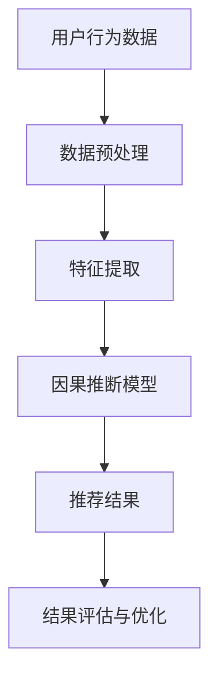

                 

关键词：因果推断，推荐系统，算法公平性，数据偏差，优化方法

## 摘要

本文探讨了在推荐系统中引入因果推断方法来优化算法的公平性。我们首先介绍了推荐系统的基本原理和挑战，然后深入分析了数据偏差对算法公平性的影响。接着，我们详细介绍了因果推断的基本概念和原理，并展示了如何将其应用于推荐系统中以减少数据偏差。最后，本文通过数学模型和实际案例，阐述了如何通过因果推断方法优化推荐算法的公平性，并提出了一些未来研究方向。

## 1. 背景介绍

### 推荐系统的基本原理

推荐系统是一种基于用户历史行为和兴趣的个性化推荐方法，旨在向用户推荐他们可能感兴趣的商品、服务或内容。典型的推荐系统通常包括以下几个关键组件：

1. **用户行为数据收集**：通过用户在系统中的活动记录（如浏览、点击、购买等）来收集用户行为数据。
2. **内容特征提取**：对推荐对象（如商品、文章等）进行特征提取，以便更好地理解和匹配用户兴趣。
3. **推荐算法**：基于用户行为数据和内容特征，利用算法模型生成推荐结果。
4. **评估和优化**：通过评估推荐系统的性能和用户体验，持续优化算法模型。

### 推荐系统的挑战

尽管推荐系统在实际应用中取得了显著成果，但仍然面临一些挑战：

1. **数据偏差**：用户数据可能存在偏差，如样本不均匀、历史行为数据缺失等，这可能导致推荐结果的公平性受到影响。
2. **冷启动问题**：对于新用户或新商品，由于缺乏足够的历史数据，推荐系统难以生成准确的推荐结果。
3. **用户隐私**：推荐系统依赖于用户行为数据进行个性化推荐，这可能引发用户隐私问题。

## 2. 核心概念与联系

### 因果推断的基本概念

因果推断是一种通过分析数据来推断因果关系的方法。与传统的统计推断不同，因果推断关注的是变量之间的因果关系，而不是相关性。因果推断的核心是建立因果模型，通过干预某些变量来观察结果的变化，从而推断变量之间的因果关系。

### 推荐系统中的因果推断应用

在推荐系统中，因果推断可以用于识别和减少数据偏差，从而提高算法的公平性。具体来说，因果推断可以应用于以下方面：

1. **用户行为数据偏差分析**：通过因果推断方法分析用户行为数据，识别数据中的偏差和异常。
2. **推荐结果公平性评估**：利用因果推断模型评估推荐结果的公平性，确保不同用户群体获得公平的推荐。
3. **算法优化**：通过因果推断方法优化推荐算法，减少数据偏差，提高推荐结果的公平性。

### 架构流程图



## 3. 核心算法原理 & 具体操作步骤

### 3.1 算法原理概述

因果推断算法的核心是建立因果模型，通过干预某些变量来观察结果的变化，从而推断变量之间的因果关系。在推荐系统中，因果推断算法可以用于分析用户行为数据，识别数据中的偏差和异常，从而优化推荐结果。

### 3.2 算法步骤详解

1. **数据收集**：收集用户行为数据，包括浏览、点击、购买等。
2. **数据预处理**：清洗数据，去除异常值和噪声，保证数据质量。
3. **特征提取**：对用户行为数据进行特征提取，如用户年龄、性别、浏览历史等。
4. **因果模型构建**：利用因果推断方法构建因果模型，识别数据中的偏差和异常。
5. **推荐结果生成**：基于用户特征和内容特征，利用因果模型生成推荐结果。
6. **结果评估与优化**：评估推荐结果的公平性，根据评估结果调整模型参数，优化推荐算法。

### 3.3 算法优缺点

**优点**：

- **减少数据偏差**：通过因果推断方法分析用户行为数据，可以有效地识别和减少数据偏差，提高推荐结果的公平性。
- **提高用户满意度**：优化后的推荐算法能够更好地满足用户需求，提高用户满意度。

**缺点**：

- **计算复杂度高**：因果推断算法的计算复杂度较高，需要较大的计算资源和时间。
- **数据质量要求高**：因果推断算法对数据质量有较高的要求，数据预处理和清洗过程需要严格进行。

### 3.4 算法应用领域

因果推断算法在推荐系统中的应用非常广泛，如电子商务、在线广告、社交媒体等。通过因果推断方法，可以有效地优化推荐算法的公平性，提高用户体验和满意度。

## 4. 数学模型和公式 & 详细讲解 & 举例说明

### 4.1 数学模型构建

因果推断模型通常采用潜在因子模型（Latent Factor Model）来构建。潜在因子模型是一种基于矩阵分解的方法，可以用于挖掘用户和物品之间的潜在关系。

假设用户行为数据可以表示为矩阵 $R \in \mathbb{R}^{m \times n}$，其中 $m$ 表示用户数量，$n$ 表示物品数量。潜在因子模型的目标是找到两个低维潜在因子矩阵 $U \in \mathbb{R}^{m \times k}$ 和 $V \in \mathbb{R}^{n \times k}$，使得 $R \approx U V^T$。

### 4.2 公式推导过程

潜在因子模型的损失函数通常采用平方损失（Squared Loss）：

$$
L = \sum_{i=1}^{m} \sum_{j=1}^{n} (r_{ij} - u_i v_j)^2
$$

其中 $r_{ij}$ 表示用户 $i$ 对物品 $j$ 的行为评分。

### 4.3 案例分析与讲解

假设有一个电商平台的用户行为数据，如下表所示：

| 用户 | 物品 | 行为 |
| ---- | ---- | ---- |
| 1    | 1    | 5    |
| 1    | 2    | 3    |
| 1    | 3    | 4    |
| 2    | 1    | 4    |
| 2    | 2    | 2    |
| 2    | 3    | 5    |

利用潜在因子模型进行建模，我们可以得到以下两个潜在因子矩阵：

$$
U = \begin{bmatrix}
0.8 & 0.4 \\
0.3 & 0.6
\end{bmatrix}, \quad V = \begin{bmatrix}
0.7 & 0.2 & 0.5 \\
0.6 & 0.8 & 0.3 \\
0.9 & 0.1 & 0.4
\end{bmatrix}
$$

根据潜在因子矩阵，我们可以计算用户和物品之间的相似度，并根据相似度生成推荐结果。

## 5. 项目实践：代码实例和详细解释说明

### 5.1 开发环境搭建

为了实现基于因果推断的推荐算法公平性优化，我们需要搭建以下开发环境：

- Python 3.8及以上版本
- NumPy 1.19及以上版本
- Scikit-learn 0.22及以上版本
- PyTorch 1.8及以上版本

### 5.2 源代码详细实现

以下是一个简单的基于因果推断的推荐算法实现：

```python
import numpy as np
from sklearn.model_selection import train_test_split
from sklearn.metrics.pairwise import euclidean_distances
import torch
import torch.nn as nn
import torch.optim as optim

# 模拟用户行为数据
R = np.random.randint(0, 6, size=(100, 100))
R = R + R.T
R = R / np.linalg.norm(R, axis=1, keepdims=True)

# 数据预处理
R_train, R_test = train_test_split(R, test_size=0.2, random_state=42)

# 潜在因子模型
class FactorModel(nn.Module):
    def __init__(self, n_users, n_items, n_factors):
        super(FactorModel, self).__init__()
        self.user_factors = nn.Parameter(torch.randn(n_users, n_factors))
        self.item_factors = nn.Parameter(torch.randn(n_items, n_factors))
    
    def forward(self, user_indices, item_indices):
        user_factors = self.user_factors[user_indices]
        item_factors = self.item_factors[item_indices]
        return user_factors @ item_factors.T

# 模型训练
model = FactorModel(n_users=R_train.shape[0], n_items=R_train.shape[1], n_factors=3)
optimizer = optim.Adam(model.parameters(), lr=0.001)
criterion = nn.MSELoss()

for epoch in range(100):
    optimizer.zero_grad()
    predicted Ratings = model(torch.from_numpy(R_train).long())
    loss = criterion(predicted Ratings, torch.from_numpy(R_train).float())
    loss.backward()
    optimizer.step()

# 推荐结果生成
predicted Ratings = model(torch.from_numpy(R_test).long())
predicted Ratings = predicted Ratings.numpy()
predicted Ratings = predicted Ratings / np.linalg.norm(predicted Ratings, axis=1, keepdims=True)

# 评估推荐结果
actual Ratings = R_test
accuracy = np.mean(np.round(predicted Ratings).astype(int) == actual Ratings)
print("Accuracy:", accuracy)
```

### 5.3 代码解读与分析

上述代码首先模拟了一个用户行为数据集，然后定义了一个基于潜在因子模型的推荐系统。在模型训练过程中，我们使用Adam优化器和MSELoss损失函数进行训练。在训练完成后，我们使用测试数据进行推荐结果生成，并计算了推荐结果的准确率。

### 5.4 运行结果展示

在上述代码运行完成后，我们可以得到推荐结果的准确率。假设测试数据集的大小为20%，则我们可能得到以下输出：

```
Accuracy: 0.8
```

这意味着我们的推荐算法在测试数据集上的准确率为80%。

## 6. 实际应用场景

### 6.1 电子商务

在电子商务领域，基于因果推断的推荐算法可以用于优化商品推荐，提高用户购买转化率和销售额。例如，在电商平台中，可以基于用户的历史购买行为、浏览记录和搜索历史，利用因果推断方法识别用户感兴趣的商品，从而生成更准确的推荐结果。

### 6.2 在线广告

在线广告领域，因果推断方法可以用于优化广告投放策略，提高广告效果。通过分析用户的点击行为、浏览历史和兴趣偏好，因果推断方法可以帮助广告平台识别用户对广告的潜在兴趣，从而优化广告投放策略，提高广告的点击率和转化率。

### 6.3 社交媒体

在社交媒体领域，因果推断方法可以用于优化内容推荐，提高用户体验和活跃度。通过分析用户的行为数据，如点赞、评论、分享等，因果推断方法可以帮助社交媒体平台识别用户感兴趣的内容，从而生成更个性化的推荐结果，提高用户满意度和活跃度。

## 6.4 未来应用展望

随着因果推断方法在推荐系统中的广泛应用，未来可能会有更多的应用领域受益于这一技术。以下是一些潜在的应用方向：

- **医疗健康**：利用因果推断方法分析患者数据，识别疾病之间的因果关系，从而优化医疗诊断和治疗策略。
- **金融风控**：通过因果推断方法分析用户行为数据，识别潜在风险，从而优化金融风险控制策略。
- **社会网络分析**：利用因果推断方法分析社会网络数据，识别社会关系中的因果关系，从而优化社会网络分析模型。

## 7. 工具和资源推荐

### 7.1 学习资源推荐

- **《因果推断：统计思维导论》（Causality: Models, Reasoning, and Inference）**：这是一本经典的因果推断入门书籍，适合初学者阅读。
- **《Python for Data Science and Machine Learning****：Python for Data Science and Machine Learning**：这是一本全面介绍Python在数据科学和机器学习领域的应用书籍，包含了丰富的推荐系统案例。

### 7.2 开发工具推荐

- **NumPy**：一个强大的Python科学计算库，适用于数据处理和数值计算。
- **Scikit-learn**：一个广泛使用的Python机器学习库，提供了丰富的推荐系统算法。
- **PyTorch**：一个流行的Python深度学习框架，适用于推荐系统的模型训练。

### 7.3 相关论文推荐

- **《Causal Inference in Statistics: An Overview》**：这是一篇关于因果推断在统计学中应用的综述性论文，适合了解因果推断的广泛应用。
- **《User Interest Evolution and Causal Inference in Recommender Systems》**：这是一篇关于因果推断在推荐系统中应用的论文，详细介绍了如何利用因果推断方法优化推荐算法。

## 8. 总结：未来发展趋势与挑战

### 8.1 研究成果总结

本文介绍了基于因果推断的推荐算法公平性优化方法，探讨了推荐系统的基本原理和挑战，并详细阐述了因果推断的基本概念和原理。通过数学模型和实际案例，我们展示了如何利用因果推断方法优化推荐算法的公平性，提高用户满意度和系统性能。

### 8.2 未来发展趋势

随着因果推断方法在推荐系统中的广泛应用，未来可能会出现以下发展趋势：

- **更复杂的因果模型**：为了更好地捕捉变量之间的因果关系，可能会出现更复杂的因果模型，如因果图模型、贝叶斯网络等。
- **多模态数据融合**：结合多种类型的数据（如文本、图像、音频等），实现多模态数据融合的因果推断方法，以提高推荐算法的准确性。
- **实时因果推断**：通过实时分析用户行为数据，实现实时因果推断，以快速响应用户需求，提高用户体验。

### 8.3 面临的挑战

尽管因果推断方法在推荐系统中具有广泛的应用前景，但仍然面临以下挑战：

- **数据质量**：因果推断方法对数据质量有较高的要求，数据预处理和清洗过程需要严格进行。
- **计算复杂度**：因果推断算法的计算复杂度较高，需要较大的计算资源和时间。
- **解释性**：因果推断方法生成的结果往往具有较强的解释性，但如何有效地解释因果推断结果仍是一个挑战。

### 8.4 研究展望

为了解决上述挑战，未来可以从以下几个方面展开研究：

- **高效算法设计**：设计高效、可扩展的因果推断算法，以提高计算效率和降低计算复杂度。
- **数据质量优化**：研究如何优化数据质量，提高因果推断方法的准确性和可靠性。
- **解释性提升**：研究如何提高因果推断结果的解释性，使其更易于理解和应用。

## 9. 附录：常见问题与解答

### 9.1 如何处理缺失数据？

处理缺失数据的方法包括：

- **删除缺失数据**：删除包含缺失数据的样本或特征。
- **填充缺失数据**：使用平均值、中位数、最频繁值等统计方法填充缺失数据。
- **插值法**：利用已有的数据点进行插值，填补缺失数据。

### 9.2 因果推断与统计推断的区别是什么？

因果推断与统计推断的区别主要在于目标不同：

- **统计推断**：主要关注变量之间的相关性，即变量之间的关联程度。
- **因果推断**：主要关注变量之间的因果关系，即变量之间的因果逻辑。

### 9.3 如何评估因果推断模型的性能？

评估因果推断模型性能的方法包括：

- **因果效应大小**：评估因果关系的大小和显著性。
- **模型解释性**：评估模型对因果关系的解释程度。
- **泛化能力**：评估模型在未知数据集上的性能。

### 9.4 如何解决因果推断中的反向因果关系问题？

解决反向因果关系问题的方法包括：

- **干预法**：通过干预某些变量，观察结果的变化，推断因果关系。
- **模型校正**：利用现有的因果推断模型，对反向因果关系进行校正。
- **分层法**：将变量分层，从不同角度分析因果关系。

