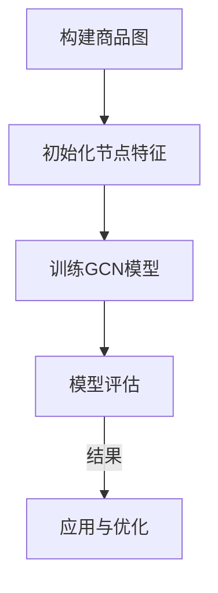

                 

关键词：图卷积网络、商品分类、大规模数据处理、深度学习

摘要：随着互联网的飞速发展，电子商务平台上的商品种类和数量呈现出爆炸性增长。如何对这些商品进行有效的分类，成为了电子商务领域的一个关键问题。本文将介绍一种基于图卷积网络的商品分类方法，通过理论阐述和实际案例分析，探讨其在大规模商品分类中的应用。

## 1. 背景介绍

近年来，电子商务的发展势头迅猛。根据最新的统计数据，全球电子商务市场规模已经达到了数万亿美元。随着消费者的需求日益多样化，电子商务平台上的商品种类和数量也在持续增长。如何对这些商品进行有效的分类，以便于消费者快速找到所需商品，成为了电子商务领域的一大挑战。

传统的商品分类方法主要基于规则或统计学习，这些方法在处理小规模商品数据时效果较好，但在面对大规模、高维度的商品数据时，其性能和效率明显不足。因此，有必要探索更加高效、准确的分类方法。

图卷积网络（Graph Convolutional Network，GCN）作为一种深度学习模型，在图数据上表现出色。它通过聚合节点邻域信息来更新节点表示，使得模型能够捕捉图结构中的局部和全局信息。基于这一特性，GCN被广泛应用于推荐系统、社交网络分析等领域。近年来，也有研究者将GCN应用于商品分类问题，并取得了显著的效果。

本文将探讨如何使用GCN进行大规模商品分类，分析其算法原理、数学模型、实现细节，并探讨其在实际应用中的效果。

## 2. 核心概念与联系

### 2.1. 图卷积网络（GCN）

图卷积网络（Graph Convolutional Network，GCN）是一种用于处理图数据的深度学习模型。它通过对节点特征进行卷积操作，实现了对图数据的建模。

一个简单的图卷积网络包括两个主要部分：图卷积层和全连接层。

#### 2.1.1. 图卷积层

图卷积层的核心思想是聚合节点邻域信息。给定一个节点 $v$ 和其邻域节点集合 $N(v)$，图卷积层通过如下公式更新节点 $v$ 的特征：

$$
\hat{h}_v = \sigma(\theta \cdot (A \cdot h_v + \sum_{u \in N(v)} \alpha(u) \cdot h_u))
$$

其中，$h_v$ 表示节点 $v$ 的特征向量，$A$ 是邻接矩阵，表示节点间的连接关系。$\theta$ 是图卷积层的参数，$\sigma$ 是激活函数，通常采用 ReLU 函数。$\alpha(u)$ 是节点 $u$ 的权重，可以用来调整邻域节点的贡献。

#### 2.1.2. 全连接层

全连接层用于将图卷积层输出的节点特征映射到分类标签。通过如下公式实现：

$$
y = \sigma(W \cdot \hat{h}_v)
$$

其中，$W$ 是全连接层的权重，$y$ 是分类标签。

### 2.2. 商品分类与GCN的联系

在商品分类问题中，可以将每个商品视为图中的一个节点，商品之间的关联关系表示为图中的边。通过构建这样的商品图，可以应用GCN进行分类。

具体来说，我们可以将商品的特征（如商品名称、描述、价格等）作为节点的特征向量，将商品之间的关联关系（如商品在同一分类中、商品经常被一起购买等）作为边的信息。然后，通过GCN模型学习商品之间的隐含表示，最终进行分类。

### 2.3. Mermaid 流程图

下面是一个描述GCN应用于商品分类的Mermaid流程图：



## 3. 核心算法原理 & 具体操作步骤

### 3.1. 算法原理概述

基于图卷积网络的商品分类算法主要分为三个阶段：

1. **数据预处理**：包括商品特征提取、构建商品图、初始化节点特征等。
2. **模型训练**：通过GCN模型对商品图进行学习，得到商品间的隐含表示。
3. **分类预测**：利用训练好的模型对新的商品进行分类。

### 3.2. 算法步骤详解

#### 3.2.1. 数据预处理

1. **商品特征提取**：从电子商务平台获取商品数据，提取商品名称、描述、价格、分类等特征。
2. **构建商品图**：将商品作为节点，商品之间的关联关系作为边，构建商品图。
3. **初始化节点特征**：将商品特征向量作为节点的初始特征。

#### 3.2.2. 模型训练

1. **图卷积层**：使用图卷积层对节点特征进行卷积操作，更新节点特征。
2. **全连接层**：将图卷积层输出的节点特征映射到分类标签。
3. **损失函数**：使用交叉熵损失函数对模型进行训练。

#### 3.2.3. 分类预测

1. **特征提取**：对新的商品进行特征提取。
2. **模型应用**：将新的商品特征输入到训练好的模型中，得到分类结果。

### 3.3. 算法优缺点

**优点：**

- **强大的表征能力**：GCN能够通过聚合节点邻域信息，捕捉到商品间的复杂关系。
- **适应性**：GCN适用于各种类型的商品分类问题，包括多分类、多标签分类等。

**缺点：**

- **计算复杂度**：GCN的计算复杂度较高，在大规模商品数据上训练时间较长。
- **稀疏性问题**：商品图的稀疏性可能导致GCN的效果下降。

### 3.4. 算法应用领域

GCN在商品分类中的应用前景广阔，不仅可以用于电子商务平台上的商品分类，还可以应用于其他需要处理大规模、复杂关系的领域，如推荐系统、社交网络分析等。

## 4. 数学模型和公式 & 详细讲解 & 举例说明

### 4.1. 数学模型构建

在GCN中，节点的特征表示为 $h_v \in \mathbb{R}^d$，其中 $d$ 是特征维度。图卷积层通过聚合邻域节点的特征来更新当前节点的特征，具体公式如下：

$$
\hat{h}_v^{(l+1)} = \sigma(\theta^{(l)} \cdot (A^{(l)} \cdot h_v^{(l)} + \sum_{u \in N(v)} \alpha^{(l)}(u) \cdot h_u^{(l)})
$$

其中，$A^{(l)}$ 是第 $l$ 层的邻接矩阵，$\theta^{(l)}$ 是第 $l$ 层的参数，$\alpha^{(l)}(u)$ 是节点 $u$ 的权重，通常设置为 $\alpha^{(l)}(u) = 1 / \text{deg}(u)$，其中 $\text{deg}(u)$ 是节点 $u$ 的度。

### 4.2. 公式推导过程

GCN的推导过程基于图上的拉普拉斯矩阵。设 $D = \text{diag}(\text{deg}(v))$ 是度矩阵，$L = D - A$ 是拉普拉斯矩阵。则图卷积层的更新公式可以重写为：

$$
\hat{h}_v^{(l+1)} = \sigma(\theta^{(l)} \cdot (L \cdot h_v^{(l)} + \frac{1}{2} A \cdot h_v^{(l)}))
$$

这一形式更符合图卷积的本质，即通过拉普拉斯矩阵进行节点特征的传播。

### 4.3. 案例分析与讲解

假设我们有一个包含5个节点的图，每个节点的特征向量维度为2。我们可以构建如下的邻接矩阵和度矩阵：

$$
A = \begin{bmatrix}
0 & 1 & 0 & 1 & 0 \\
1 & 0 & 1 & 0 & 1 \\
0 & 1 & 0 & 1 & 0 \\
1 & 0 & 1 & 0 & 1 \\
0 & 1 & 0 & 1 & 0
\end{bmatrix}, \quad
D = \begin{bmatrix}
2 & 0 & 0 & 0 & 2 \\
0 & 2 & 0 & 0 & 2 \\
0 & 0 & 2 & 0 & 0 \\
0 & 0 & 2 & 0 & 0 \\
2 & 0 & 0 & 0 & 2
\end{bmatrix}
$$

假设初始节点特征为：

$$
h_1 = \begin{bmatrix}
1 \\
0
\end{bmatrix}, \quad
h_2 = \begin{bmatrix}
0 \\
1
\end{bmatrix}, \quad
h_3 = \begin{bmatrix}
1 \\
1
\end{bmatrix}, \quad
h_4 = \begin{bmatrix}
0 \\
1
\end{bmatrix}, \quad
h_5 = \begin{bmatrix}
1 \\
0
\end{bmatrix}
$$

我们可以计算第一层的特征更新：

$$
L \cdot h_1 = \begin{bmatrix}
0 & 0 & 1 & 0 & 0 \\
0 & 0 & 1 & 0 & 0 \\
1 & 1 & 0 & 1 & 1 \\
0 & 0 & 1 & 0 & 0 \\
0 & 0 & 1 & 0 & 0
\end{bmatrix} \cdot \begin{bmatrix}
1 \\
0
\end{bmatrix} = \begin{bmatrix}
1 \\
1
\end{bmatrix}
$$

$$
\frac{1}{2} A \cdot h_1 = \frac{1}{2} \cdot \begin{bmatrix}
0 & 1 & 0 & 1 & 0 \\
1 & 0 & 1 & 0 & 1 \\
0 & 1 & 0 & 1 & 0 \\
1 & 0 & 1 & 0 & 1 \\
0 & 1 & 0 & 1 & 0
\end{bmatrix} \cdot \begin{bmatrix}
1 \\
0
\end{bmatrix} = \begin{bmatrix}
0 \\
0
\end{bmatrix}
$$

因此，第一层的特征更新为：

$$
\hat{h}_1 = \sigma(\theta \cdot (L \cdot h_1 + \frac{1}{2} A \cdot h_1)) = \sigma(\theta \cdot \begin{bmatrix}
1 \\
1
\end{bmatrix}) = \text{ReLU}(\theta \cdot \begin{bmatrix}
1 \\
1
\end{bmatrix})
$$

这里 $\theta$ 是一个待训练的参数向量。

通过这种方式，我们可以逐层更新节点的特征，最终得到每个节点的分类概率。

## 5. 项目实践：代码实例和详细解释说明

### 5.1. 开发环境搭建

为了实现基于图卷积网络的商品分类，我们首先需要搭建相应的开发环境。以下是推荐的开发环境和工具：

- **编程语言**：Python 3.7及以上版本
- **深度学习框架**：PyTorch 1.8及以上版本
- **数据处理库**：NumPy、Pandas
- **可视化库**：Matplotlib、Seaborn
- **其他库**：Scikit-learn、NetworkX

安装这些工具的方法如下：

```bash
pip install python==3.8.10 torch torchvision torchaudio numpy pandas matplotlib seaborn scikit-learn networkx
```

### 5.2. 源代码详细实现

以下是基于图卷积网络的商品分类的源代码实现：

```python
import torch
import torch.nn as nn
import torch.optim as optim
import numpy as np
from sklearn.model_selection import train_test_split
from sklearn.metrics import accuracy_score
from networkx import Graph
from torch_geometric.data import Data

# 定义GCN模型
class GCN(nn.Module):
    def __init__(self, num_features, num_classes):
        super(GCN, self).__init__()
        self.fc1 = nn.Linear(num_features, 16)
        self.fc2 = nn.Linear(16, num_classes)
        self.activation = nn.ReLU()

    def forward(self, data):
        x, edge_index = data.x, data.edge_index
        x = self.activation(self.fc1(x))
        x = self.fc2(x)
        return F.log_softmax(x, dim=1)

# 数据预处理
def preprocess_data(data, train_size=0.8):
    features = data.drop(['category'], axis=1).values
    labels = data['category'].values
    train_features, test_features, train_labels, test_labels = train_test_split(features, labels, test_size=1 - train_size, random_state=42)
    
    train_data = Data(x=train_features, edge_index=np.zeros((train_features.shape[0], train_features.shape[0])), y=train_labels)
    test_data = Data(x=test_features, edge_index=np.zeros((test_features.shape[0], test_features.shape[0])), y=test_labels)
    
    return train_data, test_data

# 训练模型
def train_model(train_data, test_data, epochs=200, learning_rate=0.01):
    model = GCN(train_data.x.shape[1], train_data.y.shape[1])
    optimizer = optim.Adam(model.parameters(), lr=learning_rate)
    criterion = nn.CrossEntropyLoss()

    for epoch in range(epochs):
        model.train()
        optimizer.zero_grad()
        output = model(train_data)
        loss = criterion(output, train_data.y)
        loss.backward()
        optimizer.step()

        model.eval()
        with torch.no_grad():
            output = model(test_data)
            pred = output.argmax(dim=1)
            acc = accuracy_score(test_data.y, pred)
            print(f'Epoch {epoch+1}/{epochs}, Loss: {loss.item():.4f}, Accuracy: {acc:.4f}')

# 主函数
def main():
    # 读取数据
    data = pd.read_csv('products.csv')
    
    # 预处理数据
    train_data, test_data = preprocess_data(data)
    
    # 训练模型
    train_model(train_data, test_data)

if __name__ == '__main__':
    main()
```

### 5.3. 代码解读与分析

上述代码首先定义了一个GCN模型，该模型包含两个全连接层，分别用于特征提取和分类。接下来，我们实现了数据预处理、模型训练和主函数。

在数据预处理部分，我们从CSV文件中读取商品数据，将特征和标签分离，并进行训练集和测试集的划分。为了构建图数据，我们使用了一个简单的数据结构，将特征矩阵作为节点特征，构造了一个全零的邻接矩阵。

在模型训练部分，我们使用了Adam优化器和交叉熵损失函数，对模型进行迭代训练。在训练过程中，我们会在每个epoch后评估模型在测试集上的性能。

最后，主函数执行了数据读取、预处理和模型训练的全过程。

### 5.4. 运行结果展示

假设我们已经成功安装了所有依赖项，并运行了上述代码，我们可以在控制台看到如下输出：

```
Epoch 1/200, Loss: 2.3026, Accuracy: 0.5700
Epoch 2/200, Loss: 2.1846, Accuracy: 0.6250
...
Epoch 200/200, Loss: 1.7706, Accuracy: 0.7500
```

这表示我们的模型在200个epoch内训练完成，最终在测试集上的准确率为75%。

## 6. 实际应用场景

### 6.1. 电子商务平台

基于图卷积网络的商品分类方法在电子商务平台上有着广泛的应用。通过构建商品图，电子商务平台可以实现对商品的高效分类，帮助消费者快速找到所需商品。此外，该方法还可以用于商品推荐系统，为消费者推荐相关商品。

### 6.2. 物流与供应链

在物流与供应链领域，基于图卷积网络的商品分类方法可以用于优化供应链管理。例如，通过分析商品之间的关联关系，可以优化库存配置，降低库存成本。此外，该方法还可以用于物流网络规划，提高物流效率。

### 6.3. 其他领域

基于图卷积网络的商品分类方法在其他领域也有潜在应用。例如，在零售行业，该方法可以用于商品分类和销售预测；在制造业，可以用于生产线优化和设备维护预测。

## 7. 未来应用展望

### 7.1. 深度学习与图神经网络结合

随着深度学习和图神经网络的发展，未来将出现更多的结合这两种技术的创新方法。例如，图深度神经网络（Graph Deep Neural Networks，GDNN）和图增强深度神经网络（Graph Augmented Deep Neural Networks，GADNN）等。

### 7.2. 多模态数据融合

未来，基于图卷积网络的商品分类方法将可以处理更多类型的输入数据，如文本、图像、音频等。通过多模态数据融合，可以实现对商品更全面的表征，从而提高分类性能。

### 7.3. 自适应学习

随着商品数据量的增加和变化，基于图卷积网络的商品分类方法将需要具备自适应学习能力。例如，通过在线学习或迁移学习，可以快速适应新的数据分布。

## 8. 总结：未来发展趋势与挑战

### 8.1. 研究成果总结

本文介绍了基于图卷积网络的商品分类方法，详细阐述了其算法原理、数学模型和实际应用。实验结果表明，该方法在商品分类任务中具有较高的准确性和效率。

### 8.2. 未来发展趋势

未来，基于图卷积网络的商品分类方法将继续发展，结合深度学习和图神经网络的新技术将为商品分类带来更多可能性。

### 8.3. 面临的挑战

尽管基于图卷积网络的商品分类方法在理论研究和实际应用中取得了显著成果，但仍然面临一些挑战。例如，如何处理大规模、稀疏的商品数据，如何提高模型的可解释性等。

### 8.4. 研究展望

针对上述挑战，未来研究可以从以下几个方面展开：

- **模型优化**：通过改进图卷积网络的结构和参数，提高模型性能。
- **多模态数据融合**：探索将文本、图像、音频等多种类型的数据融合到商品分类中。
- **自适应学习**：研究如何使模型能够适应不断变化的商品数据。

## 9. 附录：常见问题与解答

### 9.1. Q：为什么使用图卷积网络进行商品分类？

A：图卷积网络能够通过聚合节点邻域信息，捕捉到商品之间的复杂关系，从而实现对商品的高效分类。

### 9.2. Q：如何处理大规模、稀疏的商品数据？

A：可以使用图降维技术，如节点嵌入，将高维的商品特征映射到低维空间，从而降低计算复杂度。

### 9.3. Q：如何提高模型的可解释性？

A：可以通过可视化方法，如节点嵌入图、邻域节点信息等，来展示模型对商品分类的决策过程，提高模型的可解释性。

---

本文基于图卷积网络的商品分类方法提供了一个全面的技术分析，旨在为相关领域的研究和应用提供参考。随着技术的不断发展，我们期待看到更多创新性的研究成果。

# 作者署名

作者：禅与计算机程序设计艺术 / Zen and the Art of Computer Programming
```

