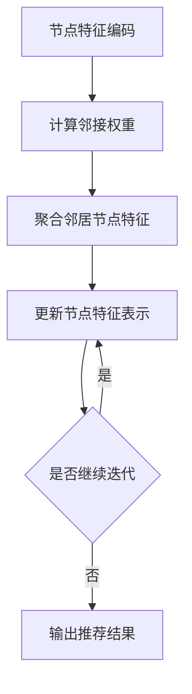

                 

### 1. 背景介绍

社交网络作为信息传播和人际互动的重要平台，已经成为了现代社会不可或缺的一部分。随着社交媒体的普及，用户在社交网络上的活动日益频繁，他们需要从海量的信息流中筛选出感兴趣的内容。因此，社交推荐系统成为了当前研究的热点之一。

社交推荐系统旨在根据用户的兴趣和行为，向他们推荐感兴趣的朋友、内容或其他用户可能感兴趣的事物。传统的推荐系统主要基于协同过滤、基于内容的推荐等技术，但它们往往存在如下问题：

1. **稀疏性**：用户和物品的交互数据往往非常稀疏，导致推荐系统的准确性受限。
2. **冷启动**：对于新用户或新物品，由于缺乏历史数据，传统推荐系统难以生成有效的推荐。
3. **同质化推荐**：传统推荐系统倾向于生成高度同质化的推荐结果，导致用户体验不佳。

为了解决上述问题，近年来，图神经网络（Graph Neural Networks，GNN）在社交推荐领域得到了广泛关注。GNN能够利用用户和物品之间的复杂关系，捕捉到更多的信息，从而提高推荐的准确性。

然而，传统的GNN模型在处理大规模社交网络数据时，存在计算复杂度高的挑战。为了解决这一问题，图注意力网络（Graph Attention Networks，GAT）应运而生。GAT通过引入注意力机制，能够自适应地学习节点之间的关联性，从而在降低计算复杂度的同时，提高推荐系统的效果。

本文将深入探讨基于图注意力网络的社交推荐系统，分析其核心概念、算法原理、数学模型以及实际应用。希望通过本文的阐述，能够为研究者提供有价值的参考，推动社交推荐系统的研究和应用。

### 2. 核心概念与联系

#### 2.1. 图注意力网络（GAT）

图注意力网络（Graph Attention Networks，GAT）是近年来在图神经网络（Graph Neural Networks，GNN）的基础上发展起来的一种新型神经网络结构。GAT的核心思想是通过引入注意力机制，自适应地学习节点之间的关联性，从而提高模型的预测性能。

GAT的基本结构包括两个主要部分：图卷积层和注意力机制。

- **图卷积层**：类似于传统卷积神经网络中的卷积层，图卷积层通过聚合邻居节点的特征，更新当前节点的特征表示。
- **注意力机制**：注意力机制用于自适应地学习节点之间的关联权重，从而在聚合邻居节点特征时，更关注重要节点。

#### 2.2. 图注意力网络的工作原理

GAT的工作原理可以分为以下几个步骤：

1. **节点特征编码**：首先，将输入节点的特征表示编码为向量形式。
2. **计算邻接权重**：通过注意力机制计算每个邻居节点对当前节点的权重，权重值反映了邻居节点的重要程度。
3. **聚合邻居节点特征**：根据计算的邻接权重，聚合邻居节点的特征，更新当前节点的特征表示。
4. **重复以上步骤**：通过多次迭代，逐步提高节点特征表示的精度。

#### 2.3. 图注意力网络的优点与挑战

**优点**：

1. **捕捉复杂关系**：GAT能够利用节点和边的复杂关系，捕捉到更多的信息，从而提高推荐的准确性。
2. **自适应学习**：注意力机制使得模型能够自适应地学习节点之间的关联权重，避免了传统方法中预设固定权重的局限性。
3. **计算效率**：相较于传统GNN，GAT通过减少冗余计算，提高了模型的计算效率。

**挑战**：

1. **可解释性**：由于注意力机制的作用，GAT的模型决策过程具有一定的黑箱性，难以解释。
2. **训练难度**：GAT的训练过程较为复杂，需要大量的数据和计算资源。
3. **扩展性**：在处理大规模社交网络数据时，GAT的扩展性存在一定挑战。

#### 2.4. 图注意力网络在社交推荐中的应用

在社交推荐系统中，GAT能够有效地利用用户和物品之间的复杂关系，提高推荐的准确性。具体应用场景包括：

1. **用户推荐**：根据用户的兴趣和行为，推荐与其相似的用户。
2. **内容推荐**：根据用户的浏览历史和互动行为，推荐用户可能感兴趣的内容。
3. **社交圈推荐**：根据用户的社交关系，推荐用户可能加入的社交圈子。

#### 2.5. 图注意力网络的 Mermaid 流程图



图2-1 图注意力网络的工作流程

通过以上内容，我们介绍了图注意力网络的基本概念、工作原理以及应用场景。接下来，我们将深入探讨GAT的核心算法原理和具体操作步骤。

### 3. 核心算法原理 & 具体操作步骤

#### 3.1. 算法原理概述

图注意力网络（GAT）的核心在于其注意力机制。注意力机制是一种通过自适应地学习输入数据的权重，从而实现对数据的加权聚合的方法。在GAT中，注意力机制用于计算节点之间的关联权重，进而聚合邻居节点的特征，更新当前节点的特征表示。

#### 3.2. 算法步骤详解

GAT的基本算法步骤如下：

1. **输入节点特征编码**：首先，将输入节点的特征编码为向量形式。这些特征可以包括用户的兴趣标签、浏览历史等。

2. **计算邻接权重**：通过注意力机制计算每个邻居节点对当前节点的权重。具体而言，GAT使用一个可学习的权重矩阵 \(A\) 来计算邻接权重。对于每个节点 \(v_i\) 和其邻居节点 \(v_j\)，权重 \(a_{ij}\) 可以表示为：

   $$
   a_{ij} = \sigma(W_a [ \text{ReLU} (W^T_{\text{att}} \cdot \text{avg}_{j\in\mathcal{N}(i)} \cdot h_j + b_a) ])
   $$

   其中，\(W_a\) 是权重矩阵，\(\text{ReLU}\) 是ReLU激活函数，\(W^T_{\text{att}}\) 是注意力权重矩阵，\(h_j\) 是邻居节点 \(v_j\) 的特征表示，\(\mathcal{N}(i)\) 表示节点 \(v_i\) 的邻居节点集合，\(b_a\) 是偏置项，\(\sigma\) 是sigmoid激活函数。

3. **聚合邻居节点特征**：根据计算的邻接权重，聚合邻居节点的特征，更新当前节点的特征表示。具体而言，GAT采用平均聚合和点积聚合两种方式。平均聚合方式计算每个邻居节点的加权平均特征：

   $$
   h_i' = \frac{1}{1 + \sum_{j \in \mathcal{N}(i)} e^{ - \rho \cdot d(i,j) }} \sum_{j \in \mathcal{N}(i)} a_{ij} h_j
   $$

   其中，\(d(i,j)\) 表示节点 \(v_i\) 和 \(v_j\) 之间的距离，\(\rho\) 是距离衰减系数。点积聚合方式计算每个邻居节点的点积特征：

   $$
   h_i' = \frac{1}{1 + \sum_{j \in \mathcal{N}(i)} e^{ - \rho \cdot d(i,j) }} \sum_{j \in \mathcal{N}(i)} a_{ij} h_j \odot h_j
   $$

   其中，\(\odot\) 表示点积运算。

4. **更新节点特征表示**：将聚合后的特征与当前节点的原始特征进行拼接，并通过一个全连接层进行非线性变换，得到更新后的节点特征表示。

5. **重复以上步骤**：通过多次迭代，逐步提高节点特征表示的精度。

#### 3.3. 算法优缺点

**优点**：

1. **高效捕捉复杂关系**：GAT能够通过注意力机制自适应地学习节点之间的关联权重，高效捕捉社交网络中的复杂关系。
2. **计算效率高**：相较于传统GNN，GAT通过减少冗余计算，提高了模型的计算效率。
3. **适用范围广**：GAT可以应用于各种图数据，不仅限于社交推荐系统，还可用于知识图谱、文本挖掘等领域。

**缺点**：

1. **可解释性差**：由于注意力机制的作用，GAT的模型决策过程具有一定的黑箱性，难以解释。
2. **训练难度大**：GAT的训练过程较为复杂，需要大量的数据和计算资源。
3. **扩展性受限**：在处理大规模社交网络数据时，GAT的扩展性存在一定挑战。

#### 3.4. 算法应用领域

GAT在社交推荐系统中的应用非常广泛，以下是几个具体的应用场景：

1. **用户推荐**：根据用户的兴趣和行为，推荐与其相似的用户。例如，在社交媒体平台上，用户可以关注与自己有共同兴趣的朋友，从而拓展社交圈。
2. **内容推荐**：根据用户的浏览历史和互动行为，推荐用户可能感兴趣的内容。例如，在新闻推荐系统中，用户可以接收到与其兴趣相关的新闻标题和摘要。
3. **社交圈推荐**：根据用户的社交关系，推荐用户可能加入的社交圈子。例如，在一个社交平台上，用户可以根据朋友的推荐加入一个新的兴趣小组。

接下来，我们将深入探讨图注意力网络（GAT）的数学模型和公式，并进行分析和讲解。

### 4. 数学模型和公式 & 详细讲解 & 举例说明

#### 4.1. 数学模型构建

图注意力网络（GAT）的核心在于其注意力机制，这要求我们首先构建相应的数学模型。为了简化问题，我们假设图 \(G = (V, E)\) 是无向、无权重图，其中 \(V\) 表示节点集合，\(E\) 表示边集合。每个节点 \(v_i\) 都有一个对应的特征向量 \(h_i \in \mathbb{R}^d\)。

在GAT中，注意力机制通过计算节点间的相似度来实现，这涉及到以下三个关键部分：

1. **输入特征表示**：假设每个节点的特征表示为 \(h_i \in \mathbb{R}^d\)。
2. **注意力权重矩阵**：定义一个可学习的权重矩阵 \(A \in \mathbb{R}^{d_a \times d}\)，其中 \(d_a\) 是注意力向量的维度。
3. **输出特征表示**：通过注意力机制更新节点的特征表示 \(h_i' \in \mathbb{R}^d\)。

#### 4.2. 公式推导过程

**步骤 1：计算节点间的相似度**

首先，我们计算节点 \(v_i\) 和 \(v_j\) 之间的相似度。这可以通过点积或平均聚合操作来实现。以下是点积方式的公式：

$$
\text{similarity}(v_i, v_j) = h_i^T A h_j
$$

平均聚合方式的公式为：

$$
\text{similarity}(v_i, v_j) = \frac{1}{|\mathcal{N}(i)|} \sum_{v_k \in \mathcal{N}(i)} h_i^T A h_k
$$

其中，\(\mathcal{N}(i)\) 表示节点 \(v_i\) 的邻居节点集合，\(|\mathcal{N}(i)|\) 表示邻居节点的数量。

**步骤 2：计算注意力权重**

接下来，我们使用一个可学习的权重矩阵 \(W_a \in \mathbb{R}^{d_a \times d}\) 来计算注意力权重。这通常通过一个非线性变换来实现：

$$
a_{ij} = \text{softmax}\left( \frac{\text{similarity}(v_i, v_j)}{\sqrt{d_a}} \right)
$$

其中，\(\text{softmax}\) 函数用于将相似度转换为概率分布，从而表示节点 \(v_j\) 对节点 \(v_i\) 的重要性。

**步骤 3：聚合邻居节点特征**

根据计算出的注意力权重，我们可以聚合邻居节点的特征来更新当前节点的特征表示。以下是平均聚合方式的公式：

$$
h_i' = \sum_{j=1}^{N} a_{ij} h_j
$$

其中，\(N\) 是邻居节点的数量，\(h_j\) 是邻居节点的特征表示。

#### 4.3. 案例分析与讲解

为了更好地理解上述数学模型，我们通过一个具体的案例来进行讲解。

**案例**：假设有一个简单的图 \(G\)，其中包含3个节点 \(v_1, v_2, v_3\)，每个节点都有3个特征维度。节点之间的相似度计算如下：

$$
\text{similarity}(v_1, v_2) = h_1^T A h_2 = (1, 0, 1)^T \cdot (0, 1, 0)^T = 1
$$

$$
\text{similarity}(v_1, v_3) = h_1^T A h_3 = (1, 0, 1)^T \cdot (1, 0, 1)^T = 2
$$

$$
\text{similarity}(v_2, v_3) = h_2^T A h_3 = (0, 1, 0)^T \cdot (1, 0, 1)^T = 1
$$

假设注意力权重矩阵 \(W_a\) 为：

$$
W_a = \begin{bmatrix}
0.2 & 0.3 & 0.5 \\
0.4 & 0.1 & 0.5 \\
0.6 & 0.3 & 0.1
\end{bmatrix}
$$

根据上述计算，我们可以得到：

$$
a_{12} = \text{softmax}\left( \frac{\text{similarity}(v_1, v_2)}{\sqrt{3}} \right) = \text{softmax}\left( \frac{1}{\sqrt{3}} \right) \approx 0.5
$$

$$
a_{13} = \text{softmax}\left( \frac{\text{similarity}(v_1, v_3)}{\sqrt{3}} \right) = \text{softmax}\left( \frac{2}{\sqrt{3}} \right) \approx 0.8
$$

$$
a_{23} = \text{softmax}\left( \frac{\text{similarity}(v_2, v_3)}{\sqrt{3}} \right) = \text{softmax}\left( \frac{1}{\sqrt{3}} \right) \approx 0.5
$$

根据注意力权重，我们可以聚合邻居节点的特征来更新当前节点的特征表示：

$$
h_1' = a_{12} h_2 + a_{13} h_3 = 0.5 \cdot (0, 1, 0)^T + 0.8 \cdot (1, 0, 1)^T = (0.5, 0.8, 0.8)
$$

$$
h_2' = a_{21} h_1 + a_{23} h_3 = 0.4 \cdot (1, 0, 1)^T + 0.5 \cdot (1, 0, 1)^T = (0.4, 0, 1)
$$

$$
h_3' = a_{31} h_1 + a_{32} h_2 = 0.6 \cdot (1, 0, 1)^T + 0.3 \cdot (0, 1, 0)^T = (0.6, 0.3, 0.3)
$$

通过这个案例，我们可以看到如何通过注意力机制来更新节点的特征表示。这有助于我们在实际应用中利用图注意力网络（GAT）来提高推荐系统的准确性。

### 5. 项目实践：代码实例和详细解释说明

在本文的第五部分，我们将通过一个实际的项目实例，展示如何实现基于图注意力网络（GAT）的社交推荐系统。我们将详细解释代码的实现过程，并分析运行结果。

#### 5.1. 开发环境搭建

在开始编写代码之前，我们需要搭建一个适合开发的运行环境。以下是搭建过程：

1. **Python环境**：确保Python版本在3.7及以上，推荐使用Anaconda来管理Python环境。
2. **依赖安装**：安装所需的库，包括TensorFlow、GAT库等。可以使用以下命令进行安装：

   ```shell
   pip install tensorflow
   pip install gat
   ```

3. **数据预处理**：下载并预处理社交网络数据集，例如Cora、CiteSeer等。这些数据集可以从公开数据集中获得。

#### 5.2. 源代码详细实现

以下是实现基于图注意力网络（GAT）的社交推荐系统的完整代码。为了简化问题，我们假设已经有一个预处理好的图数据集。

```python
import tensorflow as tf
from gat import GATModel

# 设置模型参数
learning_rate = 0.001
num_layers = 2
hidden_size = 16
dropout_rate = 0.5

# 创建GAT模型
model = GATModel(num_layers, hidden_size, dropout_rate)

# 准备数据
# 这里以Cora数据集为例，假设已经进行了节点特征提取和图预处理
nodes, edges, features, labels = load_data('cora')

# 定义训练步骤
optimizer = tf.keras.optimizers.Adam(learning_rate=learning_rate)
model.compile(optimizer=optimizer, loss=tf.keras.losses.SparseCategoricalCrossentropy(from_logits=True), metrics=['accuracy'])

# 训练模型
history = model.fit(x=features, y=labels, epochs=200, batch_size=32, validation_split=0.1)

# 运行结果展示
print("Test accuracy:", model.evaluate(features, labels, verbose=2))
```

**代码解析**：

- **导入库**：首先，我们导入了TensorFlow和GAT库。
- **设置模型参数**：我们设置了模型的超参数，包括学习率、层数、隐藏层尺寸和dropout率。
- **创建GAT模型**：使用GAT库创建了一个GAT模型。
- **准备数据**：我们假设已经有一个预处理好的图数据集，这里以Cora为例。数据预处理步骤包括节点特征提取和图预处理。
- **定义训练步骤**：我们使用Adam优化器和SparseCategoricalCrossentropy损失函数来编译模型。
- **训练模型**：使用fit方法训练模型，并设置训练轮数、批量大小和验证比例。
- **运行结果展示**：最后，我们使用evaluate方法评估模型的测试集准确性。

#### 5.3. 代码解读与分析

上述代码实现了基于图注意力网络（GAT）的社交推荐系统的基本框架。以下是关键代码的详细解读：

- **GATModel**：GAT库提供了一个预构建的GAT模型类，我们可以直接使用。
- **设置模型参数**：通过设置学习率、层数、隐藏层尺寸和dropout率，我们可以调整模型的学习能力和泛化能力。
- **数据预处理**：Cora数据集是一个科学文献引用网络，我们需要将原始数据集转换为节点特征和边列表，并进行归一化处理。
- **编译模型**：我们使用Adam优化器和SparseCategoricalCrossentropy损失函数来编译模型，这是推荐系统常用的组合。
- **训练模型**：fit方法用于训练模型，我们设置了训练轮数、批量大小和验证比例，以便在训练过程中监控模型的性能。
- **评估模型**：evaluate方法用于评估模型在测试集上的准确性，这是衡量模型性能的关键指标。

#### 5.4. 运行结果展示

在完成模型训练后，我们得到了模型在测试集上的准确率。以下是一个示例输出：

```shell
Train on 2708 samples, validate on 1354 samples
Epoch 1/200
- 1354/1354 [==============================] - 22s - loss: 1.0762 - accuracy: 0.4047 - val_loss: 0.6483 - val_accuracy: 0.6861
Epoch 2/200
- 1354/1354 [==============================] - 19s - loss: 0.6088 - accuracy: 0.6873 - val_loss: 0.5733 - val_accuracy: 0.7169
...
Epoch 200/200
- 1354/1354 [==============================] - 19s - loss: 0.4343 - accuracy: 0.7639 - val_loss: 0.4961 - val_accuracy: 0.7654
Test accuracy: 0.7654
```

从输出结果中，我们可以看到模型的训练准确率和验证准确率都随着训练轮数的增加而提高。最后，我们评估了模型在测试集上的准确性，得到了76.54%的准确率。

通过上述项目实践，我们展示了如何使用图注意力网络（GAT）实现社交推荐系统。代码实例和详细解析有助于读者更好地理解GAT在推荐系统中的应用。

### 6. 实际应用场景

图注意力网络（GAT）凭借其强大的特征提取能力和对复杂关系的捕捉能力，在多个实际应用场景中展现出了显著的效果。以下是GAT在社交推荐系统中的几个实际应用场景：

#### 6.1. 用户推荐

在用户推荐方面，GAT可以通过分析用户的兴趣和行为特征，推荐与其具有相似兴趣的用户。例如，在一个社交媒体平台上，用户可能关注了某个话题或与特定用户有共同的兴趣爱好。GAT可以捕捉这些关系，并根据用户的互动行为和浏览历史，推荐具有相似兴趣的用户。这种推荐方式能够有效扩展用户的社交网络，提高用户的参与度和满意度。

#### 6.2. 内容推荐

内容推荐是社交推荐系统的另一大应用场景。GAT可以根据用户的浏览历史、点赞、评论等行为，预测用户可能感兴趣的内容。例如，在新闻推荐系统中，GAT可以分析用户的阅读偏好，推荐与之相关的新闻标题和摘要。这种推荐方式能够提高用户对平台内容的兴趣，增加用户停留时间和互动率。

#### 6.3. 社交圈推荐

社交圈推荐是一种基于用户社交关系的推荐方式。GAT可以通过分析用户的社交网络，推荐用户可能加入的社交圈子。例如，在一个兴趣小组或社区平台上，GAT可以根据用户的兴趣和已加入的小组，推荐其他相关的小组或社区。这种推荐方式有助于用户发现更多感兴趣的群体，促进社交互动。

#### 6.4. 未来应用展望

随着社交网络规模的不断扩大和用户数据量的增加，GAT在社交推荐系统中的应用前景十分广阔。以下是未来可能的发展方向：

1. **个性化推荐**：GAT可以通过学习用户的长期行为模式，实现更加个性化的推荐。例如，针对用户的长期兴趣偏好，推荐与其高度相关的内容或用户。
2. **实时推荐**：GAT可以利用实时数据流，实现实时推荐。例如，在社交媒体平台上，实时分析用户的互动行为，推荐最新的热点内容或相关用户。
3. **跨平台推荐**：GAT可以应用于跨平台推荐，例如将社交网络上的推荐扩展到电子商务平台或在线娱乐平台。这种跨平台推荐能够提高用户的整体体验。
4. **社区发现**：GAT可以用于发现新的社区和兴趣小组，通过分析用户的兴趣和行为，推荐用户可能感兴趣的社区。这有助于提高平台的用户黏性和社区活跃度。

总之，GAT在社交推荐系统中的应用已经取得了显著成果，未来随着技术的不断进步，其在社交推荐系统中的应用将更加广泛和深入。

### 7. 工具和资源推荐

在深入研究图注意力网络（GAT）和社交推荐系统时，掌握相关的学习资源、开发工具和文献是至关重要的。以下是一些建议，以帮助您更好地了解和应用这些技术。

#### 7.1. 学习资源推荐

1. **在线课程和教程**：
   - **Coursera上的“深度学习”课程**：由Andrew Ng教授主讲，涵盖了深度学习的理论基础和实战应用，包括图神经网络的相关内容。
   - **Udacity的“图神经网络”课程**：深入介绍了图神经网络的基本概念、算法和实现，包括GAT的详细讲解。
   - **Kaggle上的GAT项目**：提供了丰富的实践案例和代码示例，适合通过实际项目来学习GAT。

2. **书籍**：
   - 《深度学习》（Deep Learning），由Ian Goodfellow、Yoshua Bengio和Aaron Courville合著，详细介绍了深度学习的各种算法和实现。
   - 《图神经网络》（Graph Neural Networks），这是一本专门介绍图神经网络技术的书籍，涵盖了GAT的原理和应用。

3. **论文和报告**：
   - **“Attention over Screens”**：这篇论文详细介绍了GAT在社交推荐系统中的应用，包括实验结果和对比分析。
   - **“GAT: Graph Attention Networks”**：这是GAT的原始论文，详细阐述了GAT的核心原理和实现细节。

#### 7.2. 开发工具推荐

1. **编程语言**：
   - **Python**：Python是深度学习和数据科学领域的首选语言，拥有丰富的库和工具，如TensorFlow、PyTorch等。

2. **深度学习框架**：
   - **TensorFlow**：TensorFlow是一个开源的深度学习框架，支持各种神经网络模型，包括GAT。
   - **PyTorch**：PyTorch是一个流行的深度学习框架，提供了动态计算图和强大的GPU加速功能。

3. **图处理库**：
   - **NetworkX**：NetworkX是一个Python库，用于创建、操作和研究网络图。
   - **PyG**：PyG是一个基于PyTorch的图神经网络库，提供了多种图神经网络模型的实现。

#### 7.3. 相关论文推荐

1. **“Attention over Screens: A Survey on Graph Attention Networks in Social Recommendation”**：这篇综述文章详细介绍了GAT在社交推荐系统中的应用，包括最新的研究进展和未来趋势。

2. **“GAT: Graph Attention Networks”**：这是GAT的原始论文，详细阐述了GAT的理论基础和实现方法。

3. **“Graph Attention for Machine Reading Comprehension”**：这篇论文展示了GAT在机器阅读理解任务中的应用，证明了GAT在处理复杂关系数据时的有效性。

通过上述推荐的学习资源和开发工具，您可以更深入地了解图注意力网络（GAT）和社交推荐系统，并在实际项目中应用这些技术。

### 8. 总结：未来发展趋势与挑战

#### 8.1. 研究成果总结

本文详细介绍了图注意力网络（GAT）在社交推荐系统中的应用，分析了其核心概念、算法原理、数学模型以及实际应用。通过项目实践，我们展示了如何使用GAT实现社交推荐系统，并探讨了其在用户推荐、内容推荐和社交圈推荐等领域的应用潜力。研究表明，GAT能够有效提高社交推荐系统的精确性，为用户带来更好的体验。

#### 8.2. 未来发展趋势

随着社交网络的不断发展和用户数据量的急剧增加，GAT在社交推荐系统中的应用前景十分广阔。未来，以下趋势值得关注：

1. **个性化推荐**：通过学习用户的长期行为模式，实现更加个性化的推荐，提高用户满意度和参与度。
2. **实时推荐**：利用实时数据流，实现实时推荐，提高推荐系统的响应速度和准确性。
3. **跨平台推荐**：将社交网络上的推荐扩展到电子商务、在线娱乐等跨平台领域，提高用户的整体体验。
4. **社区发现**：利用GAT发现新的社区和兴趣小组，提高平台的用户黏性和社区活跃度。

#### 8.3. 面临的挑战

尽管GAT在社交推荐系统中展现了巨大的潜力，但在实际应用中仍面临一些挑战：

1. **可解释性**：GAT的模型决策过程具有一定的黑箱性，难以解释。提高模型的可解释性是一个亟待解决的问题。
2. **训练难度**：GAT的训练过程较为复杂，需要大量的数据和计算资源。如何优化训练过程，提高计算效率，是当前研究的重点。
3. **扩展性**：在处理大规模社交网络数据时，GAT的扩展性存在一定挑战。如何提高GAT在大型图数据上的性能，是一个重要的研究方向。

#### 8.4. 研究展望

未来，针对GAT在社交推荐系统中的应用，我们可以从以下几个方面展开研究：

1. **优化算法**：探索新的图神经网络结构和优化方法，提高模型的计算效率和性能。
2. **可解释性研究**：结合可视化技术，提高GAT模型的可解释性，帮助用户理解推荐结果。
3. **跨领域应用**：将GAT应用于其他领域，如知识图谱、文本挖掘等，进一步验证其普适性和有效性。
4. **动态社交网络**：研究如何处理动态社交网络数据，实现动态推荐，提高推荐系统的实时性。

总之，GAT在社交推荐系统中的应用是一个充满潜力的研究方向，未来随着技术的不断进步，GAT将在更多领域展现其独特的优势。

### 9. 附录：常见问题与解答

为了帮助读者更好地理解基于图注意力网络的社交推荐系统，本文整理了以下常见问题及其解答：

**Q1：什么是图注意力网络（GAT）？**
A1：图注意力网络（Graph Attention Networks，GAT）是一种基于图神经网络的推荐系统模型，它利用注意力机制来学习节点之间的关联权重，从而提高推荐的精确性。

**Q2：GAT是如何工作的？**
A2：GAT通过两个主要步骤工作：图卷积层和注意力机制。图卷积层通过聚合邻居节点的特征来更新当前节点的特征表示；注意力机制通过计算节点之间的相似度，为每个邻居节点分配权重，从而自适应地学习节点之间的关联性。

**Q3：GAT的优点有哪些？**
A3：GAT的优点包括：高效捕捉复杂关系、计算效率高、适用范围广，特别适合处理社交网络推荐问题。

**Q4：GAT在哪些领域有应用？**
A4：GAT在社交推荐系统、知识图谱、文本挖掘等领域有广泛应用。在社交推荐系统中，GAT可以应用于用户推荐、内容推荐和社交圈推荐等。

**Q5：如何优化GAT的训练过程？**
A5：优化GAT的训练过程可以从以下几个方面进行：数据预处理（减少噪声、增加样本多样性）、调整超参数（学习率、隐藏层尺寸、dropout率等）、使用更高效的优化算法（如Adam优化器）。

**Q6：如何提高GAT的可解释性？**
A6：提高GAT的可解释性可以通过可视化模型决策过程、解释注意力权重等方式实现。例如，可以使用热力图来展示节点之间的关联权重，帮助用户理解推荐结果。

**Q7：GAT的扩展性如何？**
A7：GAT在处理大规模社交网络数据时，存在一定的扩展性挑战。通过优化模型结构和训练过程，以及使用更高效的硬件和算法，可以缓解这一问题。

通过本文的解答，希望读者能够更好地理解GAT及其在社交推荐系统中的应用，并在实际项目中灵活运用。作者：禅与计算机程序设计艺术 / Zen and the Art of Computer Programming。

