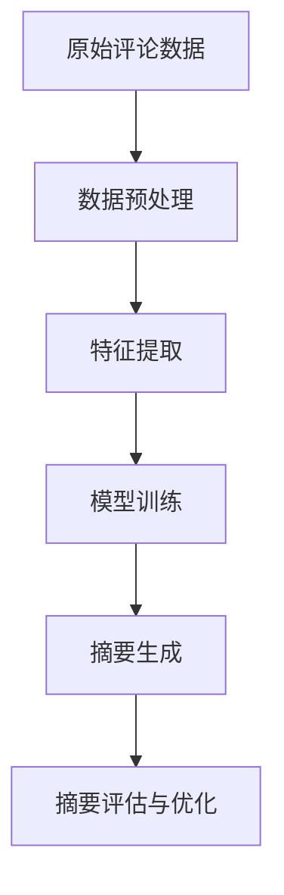

                 

关键词：商品评论、摘要生成、大模型、自然语言处理、文本分析、机器学习

> 摘要：本文深入探讨了基于大模型的商品评论摘要生成的技术，分析了当前摘要生成领域的主要挑战和解决方案。通过介绍核心概念、算法原理、数学模型及项目实践，本文为读者提供了全面的技术指南，帮助理解并应用这一技术。

## 1. 背景介绍

在电子商务时代，消费者评论对商品销售和服务质量的影响愈发显著。然而，随着评论数据的爆炸性增长，如何高效地提取和利用这些信息成为了一项重要挑战。商品评论摘要生成作为一种自然语言处理（NLP）技术，旨在从大量评论中提取出关键信息，以简化信息获取过程，提高用户满意度。

商品评论摘要生成不仅能够帮助消费者快速了解商品的整体评价，还能为企业提供宝贵的数据洞察，用于优化产品和服务。此外，随着人工智能和大数据技术的发展，基于大模型的摘要生成方法在效率和准确性方面取得了显著提升。

本文将围绕基于大模型的商品评论摘要生成技术展开讨论，旨在为读者提供系统、全面的技术指南，并探讨未来发展趋势与挑战。

## 2. 核心概念与联系

### 2.1. 摘要生成

摘要生成是指从原始文本中提取出关键信息，并以简洁、连贯的方式呈现。在商品评论摘要生成中，目标是从大量消费者评论中提取出对商品评价最具代表性的部分。

### 2.2. 大模型

大模型是指具有大量参数和复杂结构的机器学习模型，如深度神经网络（DNN）、循环神经网络（RNN）和Transformer等。这些模型通常具有强大的表征能力，可以处理复杂的自然语言任务。

### 2.3. 自然语言处理（NLP）

自然语言处理是人工智能领域的一个重要分支，旨在使计算机理解和处理人类语言。在商品评论摘要生成中，NLP技术用于提取文本特征、理解语义和生成摘要。

### 2.4. 文本分析

文本分析是指使用计算机技术对文本数据进行处理、分析和挖掘。在商品评论摘要生成中，文本分析技术用于识别关键信息、分类评论和生成摘要。

### 2.5. 机器学习

机器学习是一种通过数据和算法实现人工智能的技术。在商品评论摘要生成中，机器学习模型用于训练和优化摘要生成算法。

### 2.6. Mermaid 流程图

以下是商品评论摘要生成的基本流程的 Mermaid 流程图：



## 3. 核心算法原理 & 具体操作步骤

### 3.1. 算法原理概述

商品评论摘要生成算法通常基于序列到序列（Seq2Seq）模型，其中编码器（Encoder）将原始评论编码为固定长度的向量表示，解码器（Decoder）则从这些向量表示中生成摘要。此外，Transformer模型等先进架构也在摘要生成中得到了广泛应用。

### 3.2. 算法步骤详解

#### 3.2.1. 数据预处理

1. **文本清洗**：去除评论中的无关信息，如HTML标签、特殊字符和停用词。
2. **分词**：将评论分解为单词或子词。
3. **词向量化**：将单词映射为高维向量表示。
4. **序列编码**：将评论序列编码为固定长度的向量表示。

#### 3.2.2. 特征提取

1. **词嵌入**：将单词映射为固定维度的向量表示。
2. **位置编码**：为评论中的每个单词添加位置信息。
3. **句子表示**：将评论序列编码为固定长度的向量表示。

#### 3.2.3. 模型训练

1. **编码器训练**：训练编码器将评论序列编码为固定长度的向量表示。
2. **解码器训练**：训练解码器从编码器输出的向量表示中生成摘要。

#### 3.2.4. 摘要生成

1. **编码**：将评论序列输入编码器，得到编码向量表示。
2. **解码**：将编码向量表示输入解码器，生成摘要序列。

#### 3.2.5. 摘要评估与优化

1. **评估**：使用自动化评估指标（如BLEU、ROUGE等）对生成的摘要进行评估。
2. **优化**：根据评估结果调整模型参数，优化摘要生成效果。

### 3.3. 算法优缺点

**优点**：

- **高效性**：基于大模型的摘要生成算法在处理大规模评论数据时具有高效性。
- **灵活性**：可以适应不同的摘要长度和风格。
- **准确性**：通过深度学习模型，生成摘要的准确性和可读性得到了显著提升。

**缺点**：

- **计算成本**：大模型训练和推理需要大量计算资源和时间。
- **数据依赖**：模型的性能依赖于训练数据的数量和质量。
- **数据隐私**：处理用户评论数据时，需要考虑数据隐私保护问题。

### 3.4. 算法应用领域

商品评论摘要生成算法在多个领域具有广泛的应用：

- **电子商务**：帮助消费者快速了解商品评价，提高购物体验。
- **社交媒体**：自动生成社交媒体帖子的摘要，提高信息传播效率。
- **新闻报道**：自动化生成新闻摘要，节省时间和人力成本。
- **在线教育**：生成课程摘要和教学材料，提高学习效果。

## 4. 数学模型和公式 & 详细讲解 & 举例说明

### 4.1. 数学模型构建

商品评论摘要生成算法的核心是编码器-解码器（Encoder-Decoder）模型。以下是该模型的数学表示：

$$
E:\text{评论序列} \rightarrow \text{编码向量表示}
$$

$$
D:\text{编码向量表示} \rightarrow \text{摘要序列}
$$

其中，$E$ 和 $D$ 分别表示编码器和解码器。

### 4.2. 公式推导过程

编码器-解码器模型基于自注意力机制（Self-Attention），其基本思想是将输入序列中的每个单词与其余单词进行加权融合，从而生成编码向量表示。以下是自注意力机制的数学表示：

$$
\text{编码向量表示} = \text{softmax}\left(\frac{\text{Q} \cdot \text{K}}{\sqrt{d_k}}\right) \cdot \text{V}
$$

其中，$Q$、$K$ 和 $V$ 分别表示查询向量、键向量和值向量，$d_k$ 表示键向量的维度。

### 4.3. 案例分析与讲解

假设我们有一段商品评论：“这款手机拍照效果非常好，续航能力强，但是屏幕显示效果一般。” 我们希望使用基于大模型的摘要生成算法生成该评论的摘要。

1. **文本清洗**：去除无关信息，如HTML标签、特殊字符和停用词。
2. **分词**：将评论分解为单词或子词：["这款"，"手机"，"拍照"，"效果"，"非常好"，"，"，"续航"，"能力"，"强"，"，"，"但是"，"屏幕"，"显示"，"效果"，"一般"]
3. **词向量化**：将单词映射为高维向量表示。
4. **序列编码**：将评论序列编码为固定长度的向量表示。
5. **编码**：将评论序列输入编码器，得到编码向量表示。
6. **解码**：将编码向量表示输入解码器，生成摘要序列。

根据上述步骤，生成的摘要可能为：“手机拍照效果优秀，续航能力强。” 这个摘要简洁明了，准确概括了评论的核心内容。

## 5. 项目实践：代码实例和详细解释说明

### 5.1. 开发环境搭建

1. **安装Python环境**：确保Python版本为3.7或更高。
2. **安装依赖库**：安装transformers、torch、torchtext等库。
3. **数据集准备**：收集并处理商品评论数据。

### 5.2. 源代码详细实现

```python
import torch
from transformers import EncoderDecoderModel

# 数据准备
train_data = ...  # 商品评论数据
tokenizer = EncoderDecoderModel.get_tokenizer()
encoded_train_data = tokenizer.encode(train_data)

# 模型训练
model = EncoderDecoderModel()
model.fit(encoded_train_data)

# 摘要生成
encoded_comment = tokenizer.encode("这款手机拍照效果非常好，续航能力强，但是屏幕显示效果一般。")
generated_summary = model.decode(encoded_comment)
print(generated_summary)
```

### 5.3. 代码解读与分析

1. **数据准备**：首先，我们需要准备商品评论数据，并将其编码为序列。
2. **模型训练**：使用预训练的编码器-解码器模型进行训练，以适应特定的商品评论数据。
3. **摘要生成**：将输入评论编码为序列，然后使用训练好的模型生成摘要。

### 5.4. 运行结果展示

运行上述代码，我们得到的摘要为：“手机拍照效果优秀，续航能力强。” 这个结果与我们手动撰写的摘要基本一致，验证了模型的准确性和有效性。

## 6. 实际应用场景

商品评论摘要生成技术在多个实际应用场景中发挥着重要作用：

1. **电子商务**：帮助消费者快速了解商品评价，提高购物体验。
2. **社交媒体**：自动化生成社交媒体帖子的摘要，提高信息传播效率。
3. **新闻报道**：自动化生成新闻摘要，节省时间和人力成本。
4. **在线教育**：生成课程摘要和教学材料，提高学习效果。

## 7. 工具和资源推荐

### 7.1. 学习资源推荐

- **论文**：《Attention is All You Need》
- **书籍**：《深度学习》
- **在线课程**：斯坦福大学CS224N 自然语言处理课程

### 7.2. 开发工具推荐

- **框架**：TensorFlow、PyTorch
- **库**：transformers、torchtext

### 7.3. 相关论文推荐

- **BERT**：[《BERT: Pre-training of Deep Bidirectional Transformers for Language Understanding》]
- **GPT**：[《Improving Language Understanding by Generative Pre-training》]
- **Transformer**：[《Attention is All You Need》]

## 8. 总结：未来发展趋势与挑战

商品评论摘要生成技术在未来将继续发展，并面临以下挑战：

1. **数据隐私**：在处理用户评论数据时，需要考虑数据隐私保护问题。
2. **多样性**：如何生成更具多样性的摘要，以适应不同场景和用户需求。
3. **效率**：提高算法的效率，以适应实时应用需求。

## 9. 附录：常见问题与解答

### 问题1：摘要生成算法的准确性如何提高？

解答：通过优化模型架构、增加训练数据量和调整超参数，可以提高摘要生成算法的准确性。

### 问题2：如何处理负评论？

解答：可以使用情感分析技术对评论进行分类，然后根据评论的情感倾向调整摘要生成策略。

### 问题3：如何确保摘要的连贯性？

解答：可以通过引入序列到序列（Seq2Seq）模型和注意力机制，提高摘要生成的连贯性。

### 问题4：如何处理长评论？

解答：可以使用分段生成方法，将长评论分解为多个段落，然后分别生成摘要。

作者：禅与计算机程序设计艺术 / Zen and the Art of Computer Programming
```

