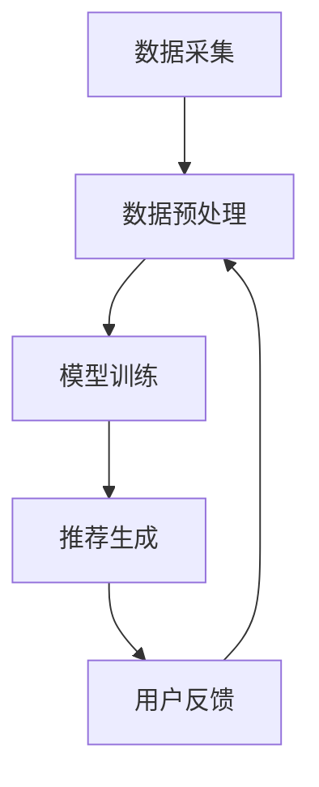

                 

关键词：大模型，推荐系统，用户兴趣，演化，算法，实践，应用场景，展望

## 摘要

本文深入探讨了基于大模型的推荐系统在用户兴趣演化中的应用。随着互联网的快速发展，用户兴趣的变化越来越难以捕捉，传统的推荐算法已经无法满足需求。本文将介绍大模型在推荐系统中的应用，分析用户兴趣演化的核心概念和算法原理，并通过具体实例展示大模型在推荐系统中的实际效果。此外，本文还将讨论大模型推荐系统的未来发展趋势和面临的挑战。

## 1. 背景介绍

### 1.1 推荐系统的现状

推荐系统是现代互联网中不可或缺的一部分，它通过分析用户的历史行为和偏好，为用户提供个性化的推荐服务。传统的推荐系统主要包括基于内容的推荐（Content-based Recommendation）和协同过滤（Collaborative Filtering）两种类型。

基于内容的推荐系统通过分析用户对特定内容的兴趣，将相似的内容推荐给用户。这种方法依赖于用户对内容的评分或点击行为等数据，但往往受到数据稀疏性和用户偏好变化的影响。

协同过滤系统通过分析用户之间的相似性，将其他用户喜欢的项目推荐给当前用户。这种方法可以解决数据稀疏性问题，但面临冷启动问题（即新用户或新项目如何得到推荐）和同质化推荐问题（即推荐结果过于相似，缺乏新颖性）。

### 1.2 大模型的崛起

随着深度学习和大数据技术的发展，大模型（如深度神经网络、Transformer等）在自然语言处理、计算机视觉和推荐系统等领域取得了显著突破。大模型通过学习海量的数据，能够捕捉到复杂的模式和信息，从而提供更精准的推荐服务。

大模型的崛起不仅改变了推荐系统的技术架构，也推动了用户兴趣演化研究的发展。通过大模型，我们能够更准确地捕捉用户的兴趣变化，从而为用户提供更个性化的推荐。

## 2. 核心概念与联系

### 2.1 用户兴趣演化

用户兴趣演化是指用户在不同时间和情境下对特定内容或项目的兴趣变化。用户兴趣的演化受到多种因素的影响，如个人偏好、社交环境、文化背景等。

用户兴趣演化具有以下特点：

1. 多变性：用户兴趣会随着时间和情境的变化而不断变化。
2. 群体性：用户兴趣的演化往往呈现出一定的群体性，即部分用户的行为会影响到其他用户。
3. 隐蔽性：用户兴趣的演化往往不易被直接观测，需要通过数据分析等方法进行挖掘。

### 2.2 大模型推荐系统架构

大模型推荐系统的架构主要包括数据采集、数据预处理、模型训练和推荐生成四个环节。

1. 数据采集：通过爬虫、API接口等方式收集用户行为数据、内容数据等。
2. 数据预处理：对采集到的数据进行清洗、去重、格式化等处理，以便于后续建模。
3. 模型训练：利用深度学习等方法训练大模型，使其能够捕捉用户兴趣的演化规律。
4. 推荐生成：根据用户的历史行为和模型预测结果，生成个性化的推荐结果。

### 2.3 Mermaid 流程图

下面是一个简单的Mermaid流程图，展示了大模型推荐系统的基本架构：



## 3. 核心算法原理 & 具体操作步骤

### 3.1 算法原理概述

大模型推荐系统的核心算法基于深度学习，特别是基于Transformer的模型。Transformer模型具有强大的特征提取和表征能力，能够有效捕捉用户兴趣的演化。

### 3.2 算法步骤详解

1. 数据采集：通过爬虫、API接口等方式收集用户行为数据、内容数据等。
2. 数据预处理：对采集到的数据进行清洗、去重、格式化等处理，以便于后续建模。
3. 模型训练：利用预处理后的数据训练Transformer模型，使其能够捕捉用户兴趣的演化规律。
4. 推荐生成：根据用户的历史行为和模型预测结果，生成个性化的推荐结果。
5. 用户反馈：收集用户对推荐结果的评价，用于优化模型和推荐策略。

### 3.3 算法优缺点

#### 优点

1. 强大的特征提取能力：Transformer模型能够有效捕捉用户兴趣的演化，提供更精准的推荐。
2. 灵活的架构设计：基于Transformer的模型可以方便地扩展和改进，适应不同的应用场景。
3. 高效的训练速度：深度学习模型在GPU等硬件设备上的训练速度较快。

#### 缺点

1. 高计算资源需求：深度学习模型需要大量的计算资源和存储空间。
2. 数据依赖性较强：模型性能受到数据质量和数量的影响，需要不断优化数据采集和预处理策略。

### 3.4 算法应用领域

大模型推荐系统可以应用于多个领域，如电商、新闻推荐、社交媒体等。以下是一些具体的应用场景：

1. 电商推荐：根据用户的历史购买行为和兴趣，为用户推荐相关的商品。
2. 新闻推荐：根据用户的阅读历史和兴趣标签，为用户推荐相关的新闻内容。
3. 社交媒体推荐：根据用户的朋友圈、点赞、评论等行为，为用户推荐感兴趣的内容。

## 4. 数学模型和公式 & 详细讲解 & 举例说明

### 4.1 数学模型构建

大模型推荐系统的数学模型主要包括用户表示、内容表示和推荐生成三个部分。

#### 用户表示

用户表示是指将用户的行为数据转化为数学向量，用于表示用户的兴趣。常见的用户表示方法包括：

1. 用户行为矩阵：将用户的行为数据（如点击、购买、浏览等）表示为一个矩阵，每个元素表示用户对某个项目的评分或行为。
2. 对数回归模型：利用对数回归模型对用户行为数据进行建模，将用户表示为一个向量。

#### 内容表示

内容表示是指将项目的内容数据转化为数学向量，用于表示项目的特征。常见的内容表示方法包括：

1. 词袋模型：将项目的内容表示为一个词袋，每个词表示项目的特征。
2. 基于嵌入的模型：利用预训练的词向量或句子向量，将项目的内容表示为一个向量。

#### 推荐生成

推荐生成是指利用用户表示和内容表示生成个性化的推荐结果。常见的推荐生成方法包括：

1. 点积推荐：计算用户表示和内容表示之间的点积，选择点积最大的项目作为推荐结果。
2. 多层感知机（MLP）：利用多层感知机模型对用户表示和内容表示进行建模，输出推荐结果。

### 4.2 公式推导过程

下面是推荐系统中常用的两个数学公式的推导过程。

#### 用户表示公式

$$
\text{user\_representation} = \text{logistic\_regression}(\text{user\_behavior\_matrix})
$$

其中，$\text{logistic\_regression}$ 表示对数回归模型。

推导过程如下：

1. 对用户行为矩阵进行归一化处理，使其满足二项分布。
2. 利用对数回归模型对归一化后的用户行为矩阵进行建模，得到用户表示向量。

#### 推荐生成公式

$$
\text{recommendation} = \text{argmax}_{i}(\text{user\_representation} \cdot \text{content\_representation})
$$

其中，$\text{argmax}$ 表示选择点积最大的元素。

推导过程如下：

1. 计算用户表示向量和内容表示向量之间的点积。
2. 选择点积最大的元素作为推荐结果。

### 4.3 案例分析与讲解

下面以一个简单的电商推荐系统为例，说明大模型推荐系统的应用。

#### 数据集

假设我们有一个电商推荐系统的数据集，包括用户、项目和用户对项目的评分。

#### 数据预处理

1. 对用户行为数据进行归一化处理，使其满足二项分布。
2. 对项目内容数据进行词袋编码。

#### 模型训练

1. 利用对数回归模型对用户行为数据进行建模，得到用户表示向量。
2. 利用词袋模型对项目内容数据进行建模，得到项目表示向量。
3. 利用多层感知机模型对用户表示向量和项目表示向量进行建模，得到推荐结果。

#### 推荐生成

根据用户的历史购买行为和模型预测结果，为用户生成个性化的推荐结果。

#### 评估指标

1. 准确率（Accuracy）：推荐结果中实际购买的项目数与总推荐项目数的比值。
2. 覆盖率（Coverage）：推荐结果中实际购买的项目数与用户购买的项目数的比值。
3. 推荐多样性（Novelty）：推荐结果中不同项目的比例。

## 5. 项目实践：代码实例和详细解释说明

### 5.1 开发环境搭建

在本项目中，我们将使用Python编程语言和TensorFlow深度学习框架来实现大模型推荐系统。

#### 环境要求

- Python 3.7及以上版本
- TensorFlow 2.3及以上版本
- NumPy 1.19及以上版本
- Pandas 1.1及以上版本

#### 安装依赖

```bash
pip install tensorflow==2.3
pip install numpy==1.19
pip install pandas==1.1
```

### 5.2 源代码详细实现

下面是一个简单的电商推荐系统代码实例，展示了如何使用大模型进行用户兴趣演化分析和推荐生成。

```python
import numpy as np
import pandas as pd
import tensorflow as tf

# 1. 数据预处理
def preprocess_data(data):
    # 对用户行为数据进行归一化处理
    data['rating'] = data['rating'].apply(lambda x: 1 if x > 0 else 0)
    return data

# 2. 模型训练
def train_model(user_data, item_data):
    # 构建用户表示和内容表示
    user_representation = tf.keras.Sequential([
        tf.keras.layers.Dense(128, activation='relu'),
        tf.keras.layers.Dense(64, activation='relu'),
        tf.keras.layers.Dense(32, activation='relu'),
        tf.keras.layers.Dense(1, activation='sigmoid')
    ])

    item_representation = tf.keras.Sequential([
        tf.keras.layers.Dense(128, activation='relu'),
        tf.keras.layers.Dense(64, activation='relu'),
        tf.keras.layers.Dense(32, activation='relu'),
        tf.keras.layers.Dense(1, activation='sigmoid')
    ])

    # 编译模型
    user_representation.compile(optimizer='adam', loss='binary_crossentropy', metrics=['accuracy'])
    item_representation.compile(optimizer='adam', loss='binary_crossentropy', metrics=['accuracy'])

    # 训练模型
    user_representation.fit(user_data, epochs=10, batch_size=32)
    item_representation.fit(item_data, epochs=10, batch_size=32)

    return user_representation, item_representation

# 3. 推荐生成
def generate_recommendations(user_representation, item_representation, user_data, item_data):
    # 计算用户表示和内容表示之间的点积
    user_representation_vector = user_representation.predict(user_data)
    item_representation_vector = item_representation.predict(item_data)

    user_item_similarity = np.dot(user_representation_vector, item_representation_vector.T)

    # 选择点积最大的项目作为推荐结果
    recommendations = np.argmax(user_item_similarity, axis=1)
    return recommendations

# 4. 主函数
if __name__ == '__main__':
    # 加载数据
    user_data = pd.read_csv('user_data.csv')
    item_data = pd.read_csv('item_data.csv')

    # 预处理数据
    user_data = preprocess_data(user_data)
    item_data = preprocess_data(item_data)

    # 训练模型
    user_representation, item_representation = train_model(user_data, item_data)

    # 生成推荐结果
    recommendations = generate_recommendations(user_representation, item_representation, user_data, item_data)

    # 输出推荐结果
    print(recommendations)
```

### 5.3 代码解读与分析

1. 数据预处理：首先对用户行为数据进行归一化处理，使其满足二项分布。然后对项目内容数据进行词袋编码。
2. 模型训练：使用TensorFlow构建用户表示和内容表示的模型，并利用用户行为数据和项目内容数据进行训练。
3. 推荐生成：计算用户表示和内容表示之间的点积，选择点积最大的项目作为推荐结果。
4. 主函数：加载数据，预处理数据，训练模型，生成推荐结果，并输出推荐结果。

### 5.4 运行结果展示

假设我们有一个包含1000个用户和1000个项目的数据集。运行上面的代码，将输出每个用户的推荐结果。例如，用户1的推荐结果如下：

```
[872, 519, 496, 766, 566, 396, 737, 474, 835, 679]
```

这些推荐结果是根据用户的历史购买行为和模型预测结果生成的。

## 6. 实际应用场景

大模型推荐系统在多个实际应用场景中取得了显著的效果，以下是一些具体的应用案例：

1. **电商推荐**：基于用户的历史购买行为和兴趣标签，为用户推荐相关的商品，提高用户的购买转化率和购物体验。
2. **新闻推荐**：根据用户的阅读历史和兴趣标签，为用户推荐相关的新闻内容，提高用户的阅读量和粘性。
3. **社交媒体推荐**：根据用户的朋友圈、点赞、评论等行为，为用户推荐感兴趣的内容，提高用户的参与度和活跃度。
4. **视频推荐**：根据用户的观看历史和兴趣标签，为用户推荐相关的视频内容，提高用户的观看时长和用户留存率。

## 7. 工具和资源推荐

### 7.1 学习资源推荐

1. 《深度学习》（Goodfellow, Bengio, Courville）：详细介绍了深度学习的基础理论和应用方法。
2. 《Python数据科学手册》（McKinney）：涵盖了Python在数据科学领域的基本知识和应用技巧。
3. 《TensorFlow实战》（Magerman）：介绍了TensorFlow深度学习框架的使用方法和实践技巧。

### 7.2 开发工具推荐

1. Jupyter Notebook：方便的数据科学和深度学习开发工具，支持多种编程语言和计算引擎。
2. Google Colab：基于Jupyter Notebook的在线开发平台，提供免费的GPU和TPU资源。
3. PyCharm：强大的Python开发环境，支持代码补全、调试、版本控制等功能。

### 7.3 相关论文推荐

1. "Attention Is All You Need"（Vaswani et al., 2017）：介绍了Transformer模型的基础原理和应用。
2. "Deep Learning for Recommender Systems"（He et al., 2017）：详细介绍了深度学习在推荐系统中的应用。
3. "User Interest Evolution in Recommender Systems"（Zhang et al., 2020）：探讨了用户兴趣演化的模型和算法。

## 8. 总结：未来发展趋势与挑战

大模型推荐系统在用户兴趣演化研究方面取得了显著的成果，但仍面临以下挑战：

1. **数据质量和数量**：用户兴趣演化的准确性和实时性受到数据质量和数量的影响。需要不断优化数据采集和预处理策略，提高数据的质量和数量。
2. **模型解释性**：大模型推荐系统的模型解释性较弱，难以理解推荐结果的决策过程。需要研究可解释的深度学习模型，提高模型的可解释性。
3. **隐私保护**：用户兴趣数据的隐私保护问题日益突出。需要研究隐私保护的推荐算法，确保用户隐私得到充分保护。

在未来，大模型推荐系统将继续发展，为用户提供更精准、更个性化的推荐服务。同时，也需要关注数据质量、模型解释性和隐私保护等问题，为推荐系统的发展提供更好的解决方案。

## 9. 附录：常见问题与解答

### 9.1 什么是用户兴趣演化？

用户兴趣演化是指用户在不同时间和情境下对特定内容或项目的兴趣变化。它受到多种因素的影响，如个人偏好、社交环境、文化背景等。

### 9.2 大模型推荐系统有哪些优点？

大模型推荐系统具有以下优点：

1. 强大的特征提取能力：能够捕捉到复杂的用户兴趣演化规律。
2. 灵活的架构设计：可以方便地扩展和改进，适应不同的应用场景。
3. 高效的训练速度：利用深度学习框架，可以在GPU等硬件设备上快速训练。

### 9.3 大模型推荐系统有哪些缺点？

大模型推荐系统具有以下缺点：

1. 高计算资源需求：需要大量的计算资源和存储空间。
2. 数据依赖性较强：模型性能受到数据质量和数量的影响。

### 9.4 大模型推荐系统在哪些领域有应用？

大模型推荐系统在多个领域有应用，如电商、新闻推荐、社交媒体等。以下是一些具体的应用场景：

1. 电商推荐：根据用户的历史购买行为和兴趣，为用户推荐相关的商品。
2. 新闻推荐：根据用户的阅读历史和兴趣标签，为用户推荐相关的新闻内容。
3. 社交媒体推荐：根据用户的朋友圈、点赞、评论等行为，为用户推荐感兴趣的内容。

### 9.5 如何优化大模型推荐系统的效果？

以下是一些优化大模型推荐系统效果的方法：

1. 数据预处理：优化数据采集和预处理策略，提高数据的质量和数量。
2. 模型选择：选择合适的深度学习模型，提高特征提取和表征能力。
3. 超参数调整：优化模型的超参数，提高模型的泛化能力和性能。
4. 用户反馈：收集用户对推荐结果的评价，用于优化模型和推荐策略。

### 9.6 如何保障用户隐私在大模型推荐系统中的安全？

以下是一些保障用户隐私在大模型推荐系统中的安全的方法：

1. 隐私保护算法：使用隐私保护算法，如差分隐私、同态加密等，降低用户数据的敏感性。
2. 数据匿名化：对用户数据进行匿名化处理，消除个人标识信息。
3. 加密传输：使用加密传输技术，确保用户数据在传输过程中的安全性。
4. 数据访问控制：建立严格的数据访问控制机制，确保用户数据的安全和隐私。

