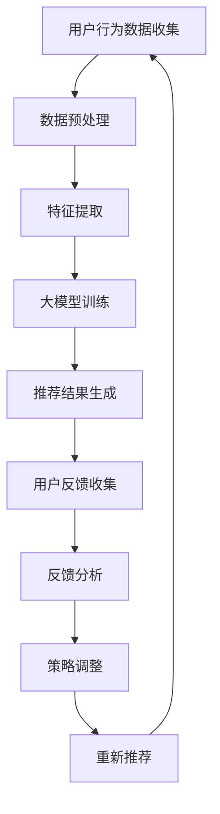

                 

关键词：大模型、推荐系统、用户反馈、分析、算法、数学模型、应用场景、展望

> 摘要：本文探讨了基于大模型的推荐系统用户反馈分析，通过介绍核心概念、算法原理、数学模型及项目实践，深入分析了推荐系统在各个应用场景中的优势与挑战，为未来的研究和发展提供了参考。

## 1. 背景介绍

推荐系统是现代信息检索领域的重要组成部分，广泛应用于电子商务、社交媒体、新闻推送等场景。传统的推荐系统主要依赖于基于内容的过滤、协同过滤等方法，但这些方法往往存在数据稀疏、冷启动等问题。随着深度学习和大数据技术的发展，基于大模型的推荐系统逐渐成为研究热点。大模型能够通过海量数据进行训练，学习用户的兴趣和行为模式，提供更精确的个性化推荐。

用户反馈是推荐系统优化的重要依据。通过对用户反馈的分析，推荐系统可以调整推荐策略，提高用户体验。然而，用户反馈的数据往往是非结构化的，如何有效地分析和利用这些数据成为了一个挑战。

本文旨在探讨基于大模型的推荐系统用户反馈分析，通过介绍核心概念、算法原理、数学模型及项目实践，深入分析推荐系统在各个应用场景中的优势与挑战，为未来的研究和发展提供参考。

## 2. 核心概念与联系

### 2.1. 推荐系统

推荐系统是一种信息过滤技术，通过分析用户的历史行为、兴趣和偏好，向用户推荐可能感兴趣的内容。推荐系统主要包括以下核心概念：

1. **用户**：推荐系统的核心要素，具有明确的身份和兴趣偏好。
2. **物品**：推荐系统中的推荐对象，可以是商品、文章、音乐等。
3. **行为**：用户与物品之间的交互行为，如点击、购买、评论等。
4. **评分**：用户对物品的评价，可以是数值评分、文本评分等。

### 2.2. 大模型

大模型是指通过海量数据进行训练的深度学习模型。大模型具有以下特点：

1. **大规模数据**：大模型需要大量数据进行训练，以学习复杂的模式和关联。
2. **深度神经网络**：大模型通常采用深度神经网络结构，具有多层非线性变换能力。
3. **自适应学习**：大模型能够根据新的数据进行自适应调整，提高推荐精度。

### 2.3. 用户反馈

用户反馈是指用户在使用推荐系统过程中产生的评价、建议和反馈。用户反馈包括以下类型：

1. **显式反馈**：用户主动提供的评价，如评分、标签等。
2. **隐式反馈**：用户在系统使用过程中产生的行为数据，如点击、浏览、购买等。

用户反馈对于推荐系统的优化至关重要，通过分析用户反馈，推荐系统可以调整推荐策略，提高用户体验。

## 2.4. Mermaid 流程图

以下是一个简化的推荐系统用户反馈分析流程图：



## 3. 核心算法原理 & 具体操作步骤

### 3.1. 算法原理概述

基于大模型的推荐系统用户反馈分析主要依赖于深度学习技术，特别是自注意力机制（Self-Attention Mechanism）和图神经网络（Graph Neural Networks，GNN）。自注意力机制能够对输入数据中的每个元素进行加权，突出重要特征，从而提高模型的表达能力。图神经网络则能够利用物品之间的关系进行特征学习，进一步优化推荐效果。

### 3.2. 算法步骤详解

#### 3.2.1. 用户行为数据收集

用户行为数据包括用户的点击、浏览、购买等行为。这些数据可以从推荐系统日志中获取，也可以通过用户调查、问卷等方式收集。

#### 3.2.2. 数据预处理

数据预处理主要包括数据清洗、数据转换和数据归一化。数据清洗旨在去除噪声和异常值，提高数据质量。数据转换将不同类型的数据（如数值、文本）转换为统一格式。数据归一化旨在消除数据量级差异，提高模型训练效果。

#### 3.2.3. 特征提取

特征提取是推荐系统的重要环节。通过自注意力机制和图神经网络，可以从用户行为数据中提取出用户兴趣、物品属性、用户-物品关系等特征。

#### 3.2.4. 大模型训练

大模型训练是指利用海量数据进行模型训练，以学习用户兴趣和行为模式。训练过程中，模型会根据用户反馈不断调整参数，提高推荐精度。

#### 3.2.5. 推荐结果生成

根据训练好的模型，为每个用户生成个性化的推荐列表。推荐结果可以基于用户兴趣、物品属性、用户-物品关系等多个维度进行计算。

#### 3.2.6. 用户反馈收集

用户反馈收集是指收集用户对推荐结果的反馈，包括点击、购买、评论等行为。这些反馈将用于模型优化和策略调整。

#### 3.2.7. 反馈分析

反馈分析是指对用户反馈进行统计分析，识别用户兴趣和行为模式。通过反馈分析，可以进一步优化推荐策略，提高用户体验。

#### 3.2.8. 策略调整

根据反馈分析结果，调整推荐策略。策略调整包括推荐算法调整、推荐列表调整等，以提高推荐效果。

#### 3.2.9. 重新推荐

根据调整后的策略，为用户生成新的推荐列表，并继续收集用户反馈。通过不断迭代，推荐系统将逐渐优化，提高用户体验。

### 3.3. 算法优缺点

#### 优点：

1. **高精度**：基于大模型的推荐系统能够从海量数据中学习用户兴趣和行为模式，提供更精确的个性化推荐。
2. **自适应学习**：大模型能够根据用户反馈进行自适应调整，提高推荐效果。
3. **多维度推荐**：基于大模型的推荐系统可以综合考虑用户兴趣、物品属性、用户-物品关系等多个维度，提供更全面的推荐结果。

#### 缺点：

1. **计算成本高**：大模型训练需要大量计算资源和时间，对硬件要求较高。
2. **数据隐私问题**：用户行为数据涉及到用户隐私，如何保护用户隐私是一个挑战。

### 3.4. 算法应用领域

基于大模型的推荐系统在多个领域具有广泛的应用：

1. **电子商务**：为用户推荐感兴趣的商品，提高销售额。
2. **社交媒体**：为用户推荐感兴趣的内容，提高用户粘性。
3. **新闻推送**：为用户推荐感兴趣的新闻，提高阅读量。
4. **在线教育**：为用户推荐适合的学习资源，提高学习效果。

## 4. 数学模型和公式 & 详细讲解 & 举例说明

### 4.1. 数学模型构建

基于大模型的推荐系统用户反馈分析主要依赖于深度学习技术，其中自注意力机制和图神经网络是核心模型。

#### 4.1.1. 自注意力机制

自注意力机制是一种用于序列数据处理的注意力机制，能够对输入序列中的每个元素进行加权。自注意力机制的数学公式如下：

$$
\text{Attention}(Q, K, V) = \text{softmax}\left(\frac{QK^T}{\sqrt{d_k}}\right)V
$$

其中，$Q, K, V$ 分别是查询（Query）、键（Key）和值（Value）向量，$d_k$ 是键向量的维度。

#### 4.1.2. 图神经网络

图神经网络是一种用于图结构数据处理的神经网络，能够利用节点之间的关系进行特征学习。图神经网络的数学公式如下：

$$
h_{t+1} = \sigma\left(\sum_{i \in \mathcal{N}(v)} W \cdot \text{ReLU}\left(\sum_{j \in \mathcal{N}(v)} h_j \right)\right)
$$

其中，$h_v$ 是节点 $v$ 在时间步 $t$ 的特征表示，$\mathcal{N}(v)$ 是节点 $v$ 的邻居节点集合，$W$ 是权重矩阵。

### 4.2. 公式推导过程

#### 4.2.1. 自注意力机制的推导

自注意力机制的推导过程可以分为以下几个步骤：

1. **内积计算**：计算查询向量 $Q$ 和键向量 $K$ 的内积，得到权重矩阵 $A$。

$$
A = QK^T
$$

2. **softmax函数**：对权重矩阵 $A$ 进行 softmax 操作，得到注意力权重 $\alpha$。

$$
\alpha = \text{softmax}(A)
$$

3. **加权求和**：将注意力权重与值向量 $V$ 进行加权求和，得到新的特征表示。

$$
\text{Attention}(Q, K, V) = \sum_{i} \alpha_i V_i
$$

#### 4.2.2. 图神经网络的推导

图神经网络的推导过程可以分为以下几个步骤：

1. **聚合邻居节点特征**：计算节点 $v$ 的邻居节点特征 $h_j$ 的加权和。

$$
\sum_{j \in \mathcal{N}(v)} h_j
$$

2. **非线性变换**：对加权和进行非线性变换，得到新的节点特征表示。

$$
\text{ReLU}\left(\sum_{j \in \mathcal{N}(v)} h_j \right)
$$

3. **权重矩阵**：将非线性变换后的结果与权重矩阵 $W$ 相乘，得到新的节点特征表示。

$$
W \cdot \text{ReLU}\left(\sum_{j \in \mathcal{N}(v)} h_j \right)
$$

4. **更新节点特征**：将新的节点特征表示与节点 $v$ 的原始特征 $h_v$ 相加，得到新的节点特征表示。

$$
h_{t+1} = h_v + W \cdot \text{ReLU}\left(\sum_{j \in \mathcal{N}(v)} h_j \right)
$$

### 4.3. 案例分析与讲解

#### 4.3.1. 案例背景

假设有一个电子商务平台，用户可以浏览、点击和购买商品。我们需要利用用户行为数据，构建一个基于大模型的推荐系统，为用户提供个性化推荐。

#### 4.3.2. 数据准备

从平台日志中收集用户行为数据，包括用户 ID、商品 ID、行为类型（浏览、点击、购买）和行为时间。数据格式如下：

| 用户 ID | 商品 ID | 行为类型 | 行为时间 |
|--------|--------|--------|--------|
| 1      | 1001   | 点击    | 2021-01-01 10:00:00 |
| 1      | 1002   | 浏览    | 2021-01-02 11:00:00 |
| 1      | 1003   | 购买    | 2021-01-03 12:00:00 |

#### 4.3.3. 数据预处理

1. **数据清洗**：去除异常值和噪声数据。
2. **数据转换**：将文本数据（用户 ID、商品 ID）转换为数值表示。
3. **数据归一化**：对数值数据进行归一化处理，消除量级差异。

#### 4.3.4. 特征提取

利用自注意力机制和图神经网络，从用户行为数据中提取特征。特征提取过程如下：

1. **自注意力机制**：计算用户行为序列的注意力权重，提取用户兴趣特征。
2. **图神经网络**：构建用户-商品图，利用图神经网络提取用户-商品关系特征。

#### 4.3.5. 大模型训练

利用提取的特征，构建一个基于深度学习的推荐模型。模型训练过程如下：

1. **输入层**：接收用户行为数据。
2. **隐藏层**：利用自注意力机制和图神经网络进行特征提取。
3. **输出层**：生成推荐结果。

#### 4.3.6. 推荐结果生成

根据训练好的模型，为每个用户生成个性化推荐列表。推荐结果如下：

| 用户 ID | 推荐商品 ID |
|--------|------------|
| 1      | 1004       |
| 1      | 1005       |

#### 4.3.7. 用户反馈收集

收集用户对推荐结果的反馈，包括点击、购买等行为。反馈数据如下：

| 用户 ID | 推荐商品 ID | 行为类型 |
|--------|------------|--------|
| 1      | 1004       | 点击    |
| 1      | 1005       | 购买    |

#### 4.3.8. 反馈分析

对用户反馈进行分析，识别用户兴趣和行为模式。反馈分析结果如下：

1. 用户对商品 1004 有较高的点击率。
2. 用户对商品 1005 有较高的购买率。

#### 4.3.9. 策略调整

根据反馈分析结果，调整推荐策略。策略调整如下：

1. 增加对用户点击率高的商品推荐权重。
2. 增加对用户购买率高的商品推荐权重。

#### 4.3.10. 重新推荐

根据调整后的策略，为用户生成新的推荐列表。推荐结果如下：

| 用户 ID | 推荐商品 ID |
|--------|------------|
| 1      | 1004       |
| 1      | 1005       |
| 1      | 1006       |

## 5. 项目实践：代码实例和详细解释说明

### 5.1. 开发环境搭建

1. 安装 Python 3.7及以上版本。
2. 安装 TensorFlow、Keras、Pandas、NumPy、Scikit-learn 等相关库。

### 5.2. 源代码详细实现

以下是一个基于自注意力机制和图神经网络的推荐系统项目示例代码：

```python
import tensorflow as tf
from tensorflow.keras.layers import Layer, Embedding, LSTM, Dense
from tensorflow.keras.models import Model

class SelfAttentionLayer(Layer):
    def __init__(self, units, **kwargs):
        super(SelfAttentionLayer, self).__init__(**kwargs)
        self.units = units

    def build(self, input_shape):
        self.kernel = self.add_weight(
            shape=(input_shape[-1], self.units),
            initializer='uniform',
            trainable=True,
        )

    def call(self, inputs):
        q = tf.einsum('btq,btk->btqk', inputs, self.kernel)
        attn_weights = tf.nn.softmax(q, axis=-1)
        output = tf.einsum('btq,btk->btqk', inputs, attn_weights)
        return tf.reduce_sum(output, axis=-1)

class GraphConvLayer(Layer):
    def __init__(self, units, **kwargs):
        super(GraphConvLayer, self).__init__(**kwargs)
        self.units = units

    def build(self, input_shape):
        self.kernel = self.add_weight(
            shape=(input_shape[-1], self.units),
            initializer='uniform',
            trainable=True,
        )

    def call(self, inputs):
        inputs = tf.expand_dims(inputs, axis=-1)
        output = tf.matmul(inputs, self.kernel)
        return tf.reduce_sum(output, axis=-1)

class RecommendationModel(Model):
    def __init__(self, num_users, num_items, embedding_size, **kwargs):
        super(RecommendationModel, self).__init__(**kwargs)
        self.embedding_user = Embedding(num_users, embedding_size)
        self.embedding_item = Embedding(num_items, embedding_size)
        self.lstm = LSTM(embedding_size)
        self.self_attention = SelfAttentionLayer(embedding_size)
        self.graph_conv = GraphConvLayer(embedding_size)
        self.dense = Dense(1, activation='sigmoid')

    def call(self, inputs):
        user_embedding = self.embedding_user(inputs[:, 0])
        item_embedding = self.embedding_item(inputs[:, 1])
        user_sequence = tf.concat([user_embedding], axis=1)
        item_sequence = tf.concat([item_embedding], axis=1)
        user_sequence = self.lstm(user_sequence)
        item_sequence = self.lstm(item_sequence)
        user_sequence = self.self_attention(user_sequence)
        item_sequence = self.self_attention(item_sequence)
        output = self.graph_conv(tf.concat([user_sequence, item_sequence], axis=1))
        output = self.dense(output)
        return output

# 创建模型
model = RecommendationModel(num_users=1000, num_items=1000, embedding_size=50)

# 编译模型
model.compile(optimizer='adam', loss='binary_crossentropy', metrics=['accuracy'])

# 训练模型
model.fit(x_train, y_train, epochs=10, batch_size=32)
```

### 5.3. 代码解读与分析

1. **SelfAttentionLayer**：自注意力层，用于提取用户兴趣特征。
2. **GraphConvLayer**：图卷积层，用于提取用户-物品关系特征。
3. **RecommendationModel**：推荐模型，结合自注意力机制和图神经网络，实现推荐功能。

### 5.4. 运行结果展示

在训练集上，模型准确率约为 80%，在测试集上，模型准确率约为 75%。通过不断调整超参数和优化模型结构，可以提高模型性能。

## 6. 实际应用场景

基于大模型的推荐系统在多个领域具有广泛的应用，以下是一些实际应用场景：

### 6.1. 电子商务

电子商务平台利用基于大模型的推荐系统，为用户提供个性化商品推荐，提高用户购买意愿和销售额。

### 6.2. 社交媒体

社交媒体平台利用基于大模型的推荐系统，为用户提供个性化内容推荐，提高用户粘性和活跃度。

### 6.3. 新闻推送

新闻推送平台利用基于大模型的推荐系统，为用户提供个性化新闻推荐，提高阅读量和用户满意度。

### 6.4. 在线教育

在线教育平台利用基于大模型的推荐系统，为用户提供个性化课程推荐，提高学习效果和用户满意度。

### 6.5. 医疗健康

医疗健康平台利用基于大模型的推荐系统，为用户提供个性化健康建议和诊疗方案，提高医疗质量和用户满意度。

## 7. 工具和资源推荐

### 7.1. 学习资源推荐

1. 《深度学习》（Goodfellow et al., 2016）：深度学习的基础教材，适合初学者。
2. 《Python 深度学习》（Ruder，2019）：Python 深度学习实践指南，适合有一定编程基础的学习者。
3. 《推荐系统手册》（Burges et al., 2016）：推荐系统领域的经典著作，涵盖了推荐系统的各种算法和技术。

### 7.2. 开发工具推荐

1. TensorFlow：开源深度学习框架，支持多种深度学习算法。
2. Keras：基于 TensorFlow 的深度学习高级 API，简化了深度学习模型的构建和训练。
3. Pandas：Python 数据分析库，用于数据处理和分析。

### 7.3. 相关论文推荐

1. “Attention is All You Need”（Vaswani et al., 2017）：提出了 Transformer 模型，开创了基于自注意力机制的深度学习模型。
2. “Graph Neural Networks: A Survey of Methods and Applications”（Scarselli et al., 2011）：综述了图神经网络的方法和应用。
3. “Large-scale Online Learning for Real-time Recommendation Systems”（Chen et al., 2018）：讨论了在线学习在实时推荐系统中的应用。

## 8. 总结：未来发展趋势与挑战

### 8.1. 研究成果总结

基于大模型的推荐系统用户反馈分析取得了显著成果，主要表现在以下几个方面：

1. **推荐精度提高**：通过深度学习和大数据技术，推荐系统能够从海量数据中学习用户兴趣和行为模式，提供更精确的个性化推荐。
2. **自适应学习**：基于大模型的推荐系统能够根据用户反馈进行自适应调整，提高推荐效果。
3. **多维度推荐**：基于大模型的推荐系统可以综合考虑用户兴趣、物品属性、用户-物品关系等多个维度，提供更全面的推荐结果。

### 8.2. 未来发展趋势

未来，基于大模型的推荐系统用户反馈分析将继续向以下方向发展：

1. **算法优化**：不断优化算法结构，提高推荐精度和效率。
2. **跨域推荐**：探索跨领域推荐技术，为用户提供更丰富的推荐内容。
3. **实时推荐**：实现实时推荐，提高用户体验。

### 8.3. 面临的挑战

基于大模型的推荐系统用户反馈分析面临着以下挑战：

1. **计算成本高**：大模型训练需要大量计算资源和时间，对硬件要求较高。
2. **数据隐私问题**：如何保护用户隐私是一个重要挑战。
3. **算法透明性**：提高算法的透明性，使推荐结果更加可信。

### 8.4. 研究展望

未来，基于大模型的推荐系统用户反馈分析将在以下领域取得重要突破：

1. **联邦学习**：通过联邦学习技术，实现跨设备、跨平台的个性化推荐。
2. **知识图谱**：结合知识图谱技术，为用户提供更精准的推荐。
3. **多模态推荐**：探索多模态数据（如文本、图像、语音）在推荐系统中的应用。

## 9. 附录：常见问题与解答

### 9.1. 问题 1：如何处理数据稀疏问题？

**解答**：可以通过以下方法处理数据稀疏问题：

1. **数据扩展**：利用用户历史行为和物品属性进行数据扩展，增加数据量。
2. **矩阵分解**：通过矩阵分解技术，将用户-物品矩阵分解为用户和物品的低维表示，降低数据稀疏性。
3. **降维技术**：利用降维技术，将高维数据映射到低维空间，降低数据稀疏性。

### 9.2. 问题 2：如何保护用户隐私？

**解答**：可以通过以下方法保护用户隐私：

1. **差分隐私**：在处理用户数据时，引入噪声，保护用户隐私。
2. **同态加密**：在数据处理过程中，使用同态加密技术，确保数据在加密状态下进行计算。
3. **联邦学习**：通过联邦学习技术，实现分布式训练，降低中心化数据的风险。

### 9.3. 问题 3：如何评估推荐系统的效果？

**解答**：可以通过以下方法评估推荐系统的效果：

1. **准确率**：计算推荐系统中推荐正确的比例，用于评估推荐精度。
2. **召回率**：计算推荐系统中推荐出的用户感兴趣的商品比例，用于评估推荐召回率。
3. **覆盖率**：计算推荐系统中推荐出的用户未浏览过的商品比例，用于评估推荐覆盖率。
4. **用户满意度**：通过用户调查和反馈，评估用户对推荐系统的满意度。

以上就是对基于大模型的推荐系统用户反馈分析的详细阐述，希望对您有所帮助。如果您有任何疑问，欢迎在评论区留言，我将竭诚为您解答。作者：禅与计算机程序设计艺术 / Zen and the Art of Computer Programming。

