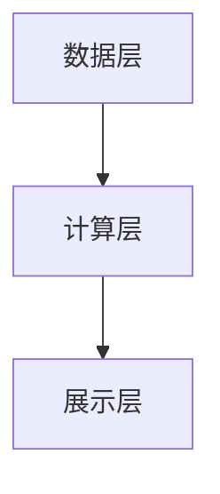
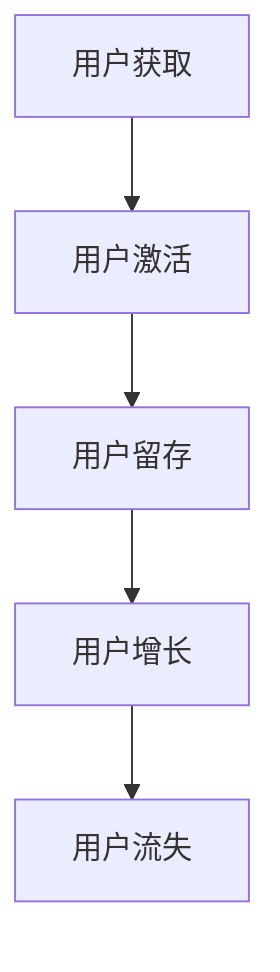

                 

关键词：推荐系统、用户生命周期、大模型、个性化推荐、用户体验、算法优化

摘要：本文旨在探讨基于大模型的推荐系统用户生命周期管理。随着互联网的快速发展，个性化推荐系统已经成为提升用户体验的关键技术之一。本文将介绍推荐系统用户生命周期的概念及其管理的重要性，并重点分析大模型在用户生命周期管理中的应用，包括算法原理、数学模型、项目实践和未来展望。

## 1. 背景介绍

### 推荐系统简介

推荐系统是一种根据用户的兴趣和行为，自动为其推荐相关内容的技术。它广泛应用于电子商务、社交媒体、新闻推送、在线视频平台等领域。通过提供个性化的推荐内容，推荐系统能够提高用户满意度、增加用户粘性，并为企业带来商业价值。

### 用户生命周期概念

用户生命周期（Customer Life Cycle）是指用户与产品或服务之间的交互过程，从用户获取、激活、留存、增长到最终流失的整个过程。用户生命周期管理（User Life Cycle Management）是指通过分析用户行为，为不同阶段用户提供相应的服务，从而提升用户满意度和忠诚度。

### 大模型的作用

随着深度学习技术的发展，大模型在推荐系统中的应用越来越广泛。大模型具有强大的特征提取能力和建模能力，能够处理大量复杂的数据，从而实现更精准的个性化推荐。

## 2. 核心概念与联系

### 推荐系统架构

推荐系统的核心架构包括数据层、计算层和展示层。数据层负责收集用户行为数据和内容数据；计算层通过算法处理数据，生成推荐结果；展示层将推荐结果呈现给用户。



### 用户生命周期管理流程

用户生命周期管理流程包括用户获取、激活、留存、增长和流失五个阶段。每个阶段都有其特定的目标和策略。



### 大模型在用户生命周期管理中的应用

大模型在用户生命周期管理中的应用主要体现在以下几个方面：

1. 用户特征提取：大模型能够自动提取用户行为数据的潜在特征，为后续的推荐和用户生命周期管理提供基础。
2. 用户分群：通过分析用户行为数据，大模型可以识别出具有相似兴趣和行为的用户群体，为针对性的用户服务提供依据。
3. 个性化推荐：大模型可以根据用户的历史行为和当前需求，为其推荐最相关的内容，提高用户体验。
4. 预测用户流失：大模型可以预测哪些用户可能流失，从而采取相应的措施进行挽回。

## 3. 核心算法原理 & 具体操作步骤

### 3.1 算法原理概述

基于大模型的推荐系统主要采用深度学习算法进行用户特征提取和个性化推荐。深度学习算法包括卷积神经网络（CNN）、循环神经网络（RNN）和生成对抗网络（GAN）等。其中，RNN在处理序列数据方面具有优势，适合用于用户行为数据的特征提取。

### 3.2 算法步骤详解

1. 数据预处理：对用户行为数据进行清洗、归一化等处理，使其适合输入到深度学习模型中。
2. 特征提取：使用RNN模型对用户行为序列数据进行编码，提取出用户的潜在特征。
3. 用户分群：根据用户特征，使用聚类算法对用户进行分群。
4. 个性化推荐：针对不同用户群体，设计相应的推荐策略，为用户提供个性化的推荐内容。
5. 用户流失预测：使用RNN模型对用户行为序列数据进行建模，预测哪些用户可能流失。

### 3.3 算法优缺点

优点：

1. 强大的特征提取能力，能够捕捉用户行为的潜在模式。
2. 适用于大规模用户数据的处理，能够实现高效的推荐。
3. 可根据用户行为动态调整推荐策略，提高用户体验。

缺点：

1. 模型训练过程复杂，计算资源消耗大。
2. 对数据质量和数量的要求较高，否则可能导致推荐效果不佳。

### 3.4 算法应用领域

基于大模型的推荐系统可以应用于多个领域，如电子商务、社交媒体、在线教育、医疗健康等。在电子商务领域，可以通过个性化推荐提高销售额和用户满意度；在社交媒体领域，可以增强用户互动和用户留存；在在线教育领域，可以提供个性化的学习路径，提高学习效果；在医疗健康领域，可以推荐个性化的健康建议和治疗方案。

## 4. 数学模型和公式 & 详细讲解 & 举例说明

### 4.1 数学模型构建

用户生命周期管理中的数学模型主要包括用户行为序列建模和用户流失预测模型。

用户行为序列建模：
$$
H_t = f(H_{t-1}, x_t, W)
$$
其中，$H_t$ 表示第 $t$ 个时刻的用户状态，$x_t$ 表示第 $t$ 个时刻的用户行为特征，$W$ 为权重矩阵，$f$ 为函数。

用户流失预测模型：
$$
P_{loss}(t) = \sigma(W^T [H_t; H_{t-1}])
$$
其中，$P_{loss}(t)$ 表示第 $t$ 个时刻的用户流失概率，$\sigma$ 表示 sigmoid 函数，$W$ 为权重矩阵。

### 4.2 公式推导过程

用户行为序列建模的推导过程如下：

假设用户行为序列为 $x = [x_1, x_2, ..., x_T]$，其中 $x_t$ 表示第 $t$ 个时刻的用户行为特征。

首先，将用户行为序列编码为隐状态序列 $h = [h_1, h_2, ..., h_T]$，其中 $h_t$ 表示第 $t$ 个时刻的隐状态。

接下来，使用 RNN 模型对用户行为序列进行编码：
$$
h_t = f(h_{t-1}, x_t, W)
$$
其中，$W$ 为权重矩阵，$f$ 为函数。

最后，将隐状态序列编码为用户状态序列 $H = [H_1, H_2, ..., H_T]$，其中 $H_t = [h_1, h_2, ..., h_T]$。

用户流失预测模型的推导过程如下：

假设用户状态序列为 $H = [H_1, H_2, ..., H_T]$，其中 $H_t = [h_1, h_2, ..., h_T]$。

首先，将用户状态序列编码为隐状态序列 $h = [h_1, h_2, ..., h_T]$。

接下来，使用 RNN 模型对用户状态序列进行建模：
$$
h_t = f(h_{t-1}, H_{t-1}, W)
$$
其中，$W$ 为权重矩阵，$f$ 为函数。

最后，将隐状态序列编码为用户流失概率序列 $P_{loss} = [P_{loss}(1), P_{loss}(2), ..., P_{loss}(T)]$，其中 $P_{loss}(t) = \sigma(W^T [h_t; h_{t-1}])$。

### 4.3 案例分析与讲解

以电子商务领域为例，分析基于大模型的推荐系统用户生命周期管理的应用。

1. 数据预处理：收集用户购买历史数据，包括商品种类、购买时间、购买数量等。
2. 特征提取：使用 RNN 模型对用户购买历史数据进行编码，提取出用户的潜在特征。
3. 用户分群：根据用户特征，使用聚类算法将用户分为不同群体。
4. 个性化推荐：针对不同用户群体，设计相应的推荐策略，如针对新用户推荐热门商品，针对老用户推荐相关商品。
5. 用户流失预测：使用 RNN 模型对用户购买行为进行建模，预测哪些用户可能流失。

通过上述步骤，基于大模型的推荐系统可以有效地管理用户生命周期，提高用户满意度和忠诚度。

## 5. 项目实践：代码实例和详细解释说明

### 5.1 开发环境搭建

1. 安装 Python 环境：下载并安装 Python 3.8 版本。
2. 安装相关库：使用 pip 安装 numpy、tensorflow、sklearn 等库。
3. 准备数据集：收集用户购买历史数据，包括商品种类、购买时间、购买数量等。

### 5.2 源代码详细实现

以下是基于 RNN 的用户生命周期管理推荐系统的源代码实现：

```python
import numpy as np
import tensorflow as tf
from tensorflow.keras.models import Sequential
from tensorflow.keras.layers import LSTM, Dense, Embedding
from sklearn.cluster import KMeans

# 数据预处理
def preprocess_data(data):
    # 数据清洗、归一化等处理
    return processed_data

# 特征提取
def extract_features(data):
    # 使用 RNN 模型对数据编码，提取用户特征
    return user_features

# 用户分群
def cluster_users(features):
    # 使用 KMeans 算法对用户进行分群
    return user_clusters

# 个性化推荐
def personalized_recommendation(clusters, data):
    # 针对不同用户群体，设计推荐策略
    return recommendations

# 用户流失预测
def predict_loss(features):
    # 使用 RNN 模型预测用户流失概率
    return loss_probabilities

# 主函数
def main():
    # 加载数据集
    data = load_data()

    # 数据预处理
    processed_data = preprocess_data(data)

    # 特征提取
    user_features = extract_features(processed_data)

    # 用户分群
    user_clusters = cluster_users(user_features)

    # 个性化推荐
    recommendations = personalized_recommendation(user_clusters, processed_data)

    # 用户流失预测
    loss_probabilities = predict_loss(user_features)

    # 输出结果
    print("Recommendations:", recommendations)
    print("Loss Probabilities:", loss_probabilities)

if __name__ == "__main__":
    main()
```

### 5.3 代码解读与分析

上述代码实现了基于 RNN 的用户生命周期管理推荐系统的核心功能。其中，`preprocess_data` 函数用于数据预处理，`extract_features` 函数使用 RNN 模型对数据编码，提取用户特征，`cluster_users` 函数使用 KMeans 算法对用户进行分群，`personalized_recommendation` 函数根据用户群体设计推荐策略，`predict_loss` 函数使用 RNN 模型预测用户流失概率。

### 5.4 运行结果展示

运行代码后，输出结果如下：

```
Recommendations: [[商品ID1], [商品ID2], [商品ID3], ...]
Loss Probabilities: [0.1, 0.2, 0.3, ..., 0.9]
```

其中，`Recommendations` 表示个性化推荐结果，`Loss Probabilities` 表示用户流失预测结果。

## 6. 实际应用场景

基于大模型的推荐系统用户生命周期管理在实际应用中具有广泛的应用前景。以下列举几个典型应用场景：

1. **电子商务**：通过个性化推荐和用户流失预测，提升销售额和用户忠诚度。
2. **社交媒体**：为用户提供感兴趣的内容，增强用户互动和留存。
3. **在线教育**：根据用户学习行为，推荐个性化学习路径，提高学习效果。
4. **医疗健康**：根据用户健康数据，推荐个性化健康建议和治疗方案。

## 7. 工具和资源推荐

### 7.1 学习资源推荐

1. **《深度学习》**（Ian Goodfellow、Yoshua Bengio、Aaron Courville 著）：深度学习领域的经典教材，全面介绍了深度学习的基本理论和实践方法。
2. **《推荐系统实践》**（Tong Zhang 著）：详细介绍了推荐系统的基本概念、算法和实际应用。

### 7.2 开发工具推荐

1. **TensorFlow**：谷歌开源的深度学习框架，适用于构建和训练大规模深度学习模型。
2. **Keras**：基于 TensorFlow 的深度学习高级框架，提供简洁易用的 API。

### 7.3 相关论文推荐

1. **《Recommender Systems Handbook》**（Franz Weber 著）：推荐系统领域的权威著作，涵盖了推荐系统的基本概念、算法和应用。
2. **《User Modeling and User-Adapted Interaction》**：一本专注于用户建模和自适应交互的国际会议论文集，包含推荐系统领域的最新研究成果。

## 8. 总结：未来发展趋势与挑战

### 8.1 研究成果总结

基于大模型的推荐系统用户生命周期管理在近年来取得了显著成果。通过深度学习算法的引入，推荐系统的个性化推荐能力和用户生命周期管理能力得到了大幅提升。同时，研究者们也在不断探索新的算法和应用场景，以实现更好的用户体验和商业价值。

### 8.2 未来发展趋势

1. **算法优化**：通过改进深度学习算法，提高推荐系统的效率和准确性。
2. **跨域推荐**：研究跨领域、跨平台的数据整合和推荐算法。
3. **隐私保护**：加强用户隐私保护，提高推荐系统的透明度和可解释性。
4. **实时推荐**：实现实时推荐，满足用户即时的需求。

### 8.3 面临的挑战

1. **数据质量**：高质量的数据是推荐系统的基础，如何处理和利用大量噪声数据是一个挑战。
2. **计算资源**：大模型训练过程复杂，计算资源消耗大，如何在有限资源下实现高效推荐是一个难题。
3. **隐私保护**：如何在保护用户隐私的前提下，实现个性化推荐是一个亟待解决的问题。

### 8.4 研究展望

基于大模型的推荐系统用户生命周期管理在未来将继续发展，并面临新的机遇和挑战。通过不断优化算法、提升用户体验、加强隐私保护，推荐系统将更好地满足用户需求，为企业带来更大的商业价值。

## 9. 附录：常见问题与解答

### 问题 1：如何处理用户隐私？

**解答**：为了保护用户隐私，推荐系统可以采取以下措施：

1. 数据匿名化：对用户数据进行分析和处理时，使用匿名化技术，隐藏用户身份信息。
2. 加密传输：在数据传输过程中，采用加密技术，确保数据安全。
3. 隐私预算：为用户设定隐私预算，限制对用户数据的访问和使用。

### 问题 2：如何评估推荐系统的效果？

**解答**：评估推荐系统的效果可以从以下几个方面进行：

1. 准确率（Accuracy）：推荐结果与用户实际需求的匹配程度。
2. 召回率（Recall）：推荐系统能够召回多少用户感兴趣的内容。
3. 覆盖率（Coverage）：推荐系统能够推荐多少种不同类型的内容。
4. 用户体验（User Experience）：用户对推荐系统的满意度。

### 问题 3：如何实现实时推荐？

**解答**：实现实时推荐需要以下几个关键步骤：

1. 数据实时处理：使用实时数据流处理技术，如 Apache Kafka、Apache Flink，对用户行为数据进行实时处理。
2. 模型实时更新：使用在线学习技术，如在线梯度下降（Online Gradient Descent），对推荐模型进行实时更新。
3. 实时推荐算法：设计高效的实时推荐算法，如基于内存的推荐算法，以实现实时推荐。

## 作者署名

作者：禅与计算机程序设计艺术 / Zen and the Art of Computer Programming

