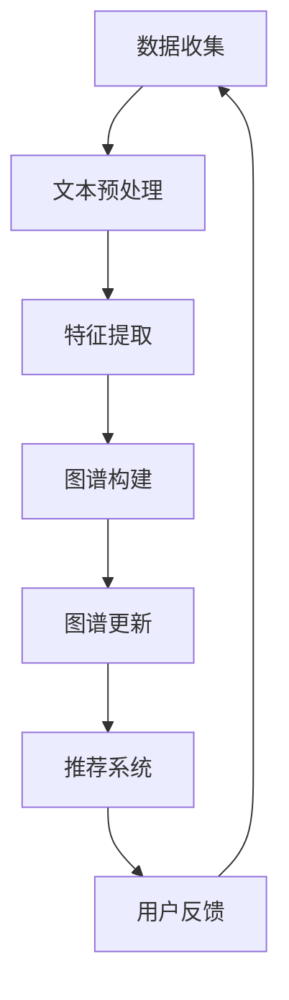

                 

关键词：推荐系统，用户兴趣图谱，大语言模型，信息检索，深度学习，人工智能，数据挖掘

## 摘要

随着互联网的飞速发展，推荐系统已成为许多在线服务的关键组成部分。用户兴趣图谱作为一种有效的数据结构，可以捕捉用户的个性化需求和偏好，为推荐系统提供了重要的数据支撑。本文旨在探讨如何利用大语言模型构建用户兴趣图谱，从而提升推荐系统的准确性、实时性和个性化水平。文章首先介绍了推荐系统的基本概念和用户兴趣图谱的重要性，随后深入讲解了大语言模型的工作原理及其在用户兴趣图谱构建中的应用。通过具体的数学模型和算法步骤，本文详细阐述了基于大语言模型的用户兴趣图谱构建方法，并结合实际项目案例展示了其应用效果。最后，文章提出了未来研究的发展趋势与挑战，为推荐系统领域的研究和应用提供了有价值的参考。

## 1. 背景介绍

### 推荐系统的起源与发展

推荐系统（Recommendation System）起源于20世纪90年代，随着互联网和电子商务的兴起，逐渐成为商业应用中的重要工具。最初，推荐系统主要依赖于用户的历史行为数据，通过简单的统计方法和协同过滤算法（如基于用户的协同过滤和基于项目的协同过滤）来预测用户可能感兴趣的内容。然而，随着用户数据的爆炸性增长和个性化需求的不断提升，传统的推荐系统逐渐暴露出一些局限性。

首先，传统推荐系统往往依赖于历史数据，缺乏对当前用户兴趣的实时捕捉。其次，这些系统在处理大量异构数据时显得力不从心，难以满足复杂的推荐需求。此外，传统方法在应对冷启动问题（即新用户或新物品的推荐）时效果不佳，无法为用户带来新鲜感和个性化体验。

为了克服这些局限性，近年来，基于深度学习的推荐系统开始崭露头角。深度学习作为一种强大的机器学习技术，能够自动从大量数据中提取复杂特征，并在图像识别、自然语言处理等领域取得了显著成果。将深度学习引入推荐系统，有望进一步提升推荐系统的准确性、实时性和个性化水平。

### 大语言模型的出现

大语言模型（Large Language Model）是近年来自然语言处理领域的一项重要突破。它通过学习海量文本数据，能够生成高质量的自然语言文本，并实现诸如文本生成、文本分类、情感分析等多种任务。大语言模型的出现，为推荐系统的用户兴趣捕捉和个性化推荐提供了新的可能性。

一方面，大语言模型能够捕捉用户文本数据的潜在语义，从而更准确地理解用户兴趣。相比于传统推荐系统依赖于用户的历史行为数据，大语言模型可以从用户产生的文本中获取实时信息，为推荐系统提供更鲜活的用户画像。

另一方面，大语言模型可以自动从海量文本数据中提取丰富的特征，这些特征可以用于构建用户兴趣图谱。用户兴趣图谱作为一种结构化的数据表示，能够有效地捕捉用户的个性化需求，为推荐系统提供强有力的数据支撑。

### 用户兴趣图谱的概念与作用

用户兴趣图谱（User Interest Graph）是一种基于图论的数据结构，用于表示用户的兴趣及其相互关系。它由节点（代表用户和物品）和边（代表用户对物品的偏好关系）组成，通过图算法对用户兴趣进行挖掘和分析。

用户兴趣图谱在推荐系统中扮演着至关重要的角色。首先，它能够捕捉用户的多样化兴趣点，为推荐系统提供丰富的数据来源。其次，用户兴趣图谱可以揭示用户兴趣之间的关联性，从而生成更加个性化的推荐结果。例如，一个用户对科技类文章感兴趣，同时他对人工智能也表现出浓厚兴趣，那么推荐系统可以基于这些关联关系，为他推荐相关的科技类文章。

此外，用户兴趣图谱还可以帮助推荐系统解决冷启动问题。对于新用户，传统推荐系统往往无法提供有效的个性化推荐，而用户兴趣图谱可以从新用户的文本数据中快速捕捉其兴趣点，为其生成初步的兴趣图谱，从而为后续推荐提供基础。

总之，用户兴趣图谱作为一种有效的数据结构，不仅能够提升推荐系统的准确性，还能够提高用户的满意度，为在线服务带来更高的用户留存率和粘性。

## 2. 核心概念与联系

### 大语言模型的工作原理

大语言模型（Large Language Model）是基于深度学习的自然语言处理技术，通过学习海量文本数据，能够生成高质量的自然语言文本，并实现诸如文本生成、文本分类、情感分析等多种任务。大语言模型的工作原理主要可以分为以下几个步骤：

1. **数据预处理**：首先，从互联网上收集大量文本数据，包括书籍、新闻、社交媒体等。这些数据经过清洗、去重和分词等预处理步骤，转换为模型可以理解的数字形式。

2. **模型训练**：使用预处理的文本数据，通过神经网络的训练，使模型学会从输入文本中预测下一个词的概率。这个过程中，模型会自动学习文本中的语法、语义和上下文信息。

3. **预测与生成**：在训练完成后，大语言模型可以根据输入的文本上下文，生成新的文本。这个过程中，模型会考虑上下文中所有已知信息，生成连贯、合理的文本。

大语言模型的核心在于其能够自动从大量数据中提取复杂特征，并利用这些特征进行文本生成和分类。例如，在情感分析任务中，模型可以从文本中提取情感相关的特征，从而判断文本的情感倾向。

### 用户兴趣图谱的构建方法

用户兴趣图谱（User Interest Graph）的构建方法主要分为以下几个步骤：

1. **数据收集**：收集用户的文本数据，包括用户的浏览记录、搜索历史、评论、帖子等。这些数据可以反映用户的兴趣和偏好。

2. **文本预处理**：对收集到的文本数据进行预处理，包括分词、去停用词、词性标注等步骤。这些步骤有助于提取文本中的关键信息，为后续分析奠定基础。

3. **特征提取**：使用大语言模型对预处理后的文本数据进行特征提取。大语言模型可以自动从文本中提取丰富的语义特征，这些特征可以用于构建用户兴趣图谱。

4. **图谱构建**：将提取到的用户特征和物品特征转换为图节点和边，构建用户兴趣图谱。图中的节点表示用户和物品，边表示用户对物品的偏好关系。通过图算法对用户兴趣进行挖掘和分析，可以揭示用户的兴趣点及其关联关系。

5. **图谱更新**：用户兴趣图谱不是静态的，它会随着用户行为的变化而不断更新。通过实时收集用户的文本数据，不断更新用户兴趣图谱，从而保持其准确性和实时性。

### 用户兴趣图谱与推荐系统的关系

用户兴趣图谱在推荐系统中起到了关键作用。首先，用户兴趣图谱可以捕捉用户的多样化兴趣点，为推荐系统提供丰富的数据来源。通过分析用户兴趣图谱，推荐系统可以更准确地了解用户的兴趣和偏好，从而生成更个性化的推荐结果。

其次，用户兴趣图谱揭示了用户兴趣之间的关联性，为推荐系统提供了额外的参考信息。例如，如果一个用户对科技类文章感兴趣，同时他对人工智能也表现出浓厚兴趣，那么推荐系统可以基于这些关联关系，为他推荐相关的科技类文章。这种基于兴趣关联的推荐，有助于提高推荐系统的准确性和用户满意度。

此外，用户兴趣图谱还可以帮助推荐系统解决冷启动问题。对于新用户，传统推荐系统往往无法提供有效的个性化推荐，而用户兴趣图谱可以从新用户的文本数据中快速捕捉其兴趣点，为其生成初步的兴趣图谱，从而为后续推荐提供基础。

总之，用户兴趣图谱作为一种有效的数据结构，不仅能够提升推荐系统的准确性，还能够提高用户的满意度，为在线服务带来更高的用户留存率和粘性。

### Mermaid 流程图

以下是一个简化的 Mermaid 流程图，用于展示大语言模型构建用户兴趣图谱的基本流程：



- **A 数据收集**：从互联网收集大量文本数据。
- **B 文本预处理**：进行分词、去停用词、词性标注等预处理操作。
- **C 特征提取**：使用大语言模型提取文本中的语义特征。
- **D 图谱构建**：将用户和物品特征转换为图节点和边，构建用户兴趣图谱。
- **E 图谱更新**：实时更新用户兴趣图谱。
- **F 推荐系统**：利用用户兴趣图谱生成个性化推荐。
- **G 用户反馈**：收集用户对推荐结果的反馈，用于进一步优化推荐系统。

### 推荐系统与用户兴趣图谱的互动机制

推荐系统与用户兴趣图谱的互动机制主要体现在以下几个方面：

1. **图谱构建**：推荐系统通过分析用户行为数据（如浏览、点击、购买等），利用大语言模型提取文本特征，构建用户兴趣图谱。这一过程实现了从用户行为到兴趣图谱的转化，为推荐系统提供了数据基础。

2. **图谱更新**：用户兴趣图谱不是静态的，它会随着用户行为的变化而不断更新。推荐系统通过实时监测用户行为，持续更新用户兴趣图谱，从而确保其准确性和实时性。

3. **推荐生成**：推荐系统利用用户兴趣图谱生成个性化推荐。在推荐生成过程中，系统会综合考虑用户兴趣图谱中的节点和边，生成符合用户兴趣的推荐结果。

4. **用户反馈**：用户对推荐结果的反馈会进一步优化用户兴趣图谱。推荐系统会收集用户的反馈数据，如点击、收藏、评价等，根据这些数据调整用户兴趣图谱，从而提高推荐质量。

5. **闭环优化**：通过不断迭代，推荐系统与用户兴趣图谱之间形成了一个闭环优化机制。推荐系统利用用户兴趣图谱生成推荐，用户通过反馈进一步优化图谱，从而实现推荐效果和用户满意度的高效提升。

这种互动机制不仅提高了推荐系统的准确性和个性化水平，还增强了用户对推荐系统的信任度和依赖度。

### 大语言模型在用户兴趣图谱构建中的应用

大语言模型在用户兴趣图谱构建中具有重要作用，其主要应用体现在以下几个方面：

1. **文本特征提取**：大语言模型能够自动从文本数据中提取丰富的语义特征。这些特征包括词频、词向量、句法结构、语义角色等，能够有效地反映用户的兴趣和偏好。

2. **兴趣点识别**：通过大语言模型的特征提取能力，可以从用户的文本数据中快速识别出用户的兴趣点。这些兴趣点可以是具体的物品类别，也可以是抽象的兴趣主题。

3. **关联关系挖掘**：大语言模型不仅能够提取用户的兴趣点，还可以挖掘用户兴趣点之间的关联关系。例如，如果一个用户对“科技”和“人工智能”都表现出浓厚兴趣，大语言模型可以发现这两个兴趣点之间的关联性，从而为推荐系统提供更全面的用户兴趣图谱。

4. **实时更新**：大语言模型可以实时更新用户的兴趣图谱。随着用户行为的变化，大语言模型会不断调整和优化用户的兴趣点及其关联关系，确保用户兴趣图谱的准确性和实时性。

### 用户兴趣图谱与推荐系统的结合策略

将用户兴趣图谱与推荐系统相结合，有助于提升推荐系统的准确性、实时性和个性化水平。以下是一些具体的结合策略：

1. **多源数据融合**：用户兴趣图谱可以融合多种数据源，包括用户历史行为、社交关系、地理位置等。这些数据源为推荐系统提供了丰富的信息，有助于生成更准确的推荐结果。

2. **动态更新**：用户兴趣图谱需要动态更新，以反映用户兴趣的变化。推荐系统可以定期收集用户的新行为数据，利用大语言模型更新用户兴趣图谱，从而保持推荐结果的实时性和准确性。

3. **个性化推荐**：基于用户兴趣图谱，推荐系统可以根据用户的兴趣点生成个性化推荐。通过分析用户兴趣图谱中的节点和边，推荐系统可以推荐符合用户兴趣的新物品，提高用户的满意度。

4. **冷启动解决**：对于新用户，传统推荐系统往往无法提供有效的个性化推荐。用户兴趣图谱可以从新用户的文本数据中快速捕捉其兴趣点，为推荐系统提供初步的用户兴趣图谱，从而解决冷启动问题。

5. **推荐质量评估**：用户兴趣图谱可以用于评估推荐质量。通过比较推荐结果与用户兴趣图谱的契合度，推荐系统可以不断优化推荐算法，提高推荐效果。

### 推荐系统在现实应用中的挑战与展望

尽管推荐系统在现实应用中取得了显著成果，但仍然面临诸多挑战。以下是一些主要挑战及其展望：

1. **数据质量**：推荐系统的性能高度依赖于数据质量。然而，现实中的数据往往存在噪声、缺失和错误等问题，这对推荐系统的准确性提出了挑战。未来，需要开发更有效的数据清洗和预处理方法，以提高数据质量。

2. **实时性**：实时推荐是用户期望的重要特性。然而，推荐系统的实时性受到计算资源和数据传输速度的限制。未来，可以通过优化算法和分布式计算技术，提高推荐系统的实时性。

3. **个性化**：个性化推荐是推荐系统的核心目标，但实现高度个性化的推荐仍然具有挑战性。未来，可以利用深度学习和强化学习等技术，进一步提升推荐系统的个性化水平。

4. **可解释性**：推荐系统的决策过程往往是非透明的，这使得用户难以理解推荐结果。提高推荐系统的可解释性，有助于增强用户的信任和满意度。

5. **隐私保护**：推荐系统需要处理大量用户隐私数据，隐私保护成为一大挑战。未来，需要开发隐私保护技术，确保用户数据的安全和隐私。

总之，随着技术的不断发展，推荐系统有望在现实应用中发挥更大的作用，满足用户的个性化需求，提高在线服务的用户体验。

## 3. 核心算法原理 & 具体操作步骤

### 3.1 算法原理概述

基于大语言模型的用户兴趣图谱构建算法主要包括三个关键步骤：文本预处理、特征提取和图谱构建。以下是每个步骤的详细描述：

1. **文本预处理**：文本预处理是整个算法的基础，包括分词、去停用词、词性标注等步骤。这些步骤的目的是将原始文本数据转换为适合模型处理的形式。

2. **特征提取**：使用大语言模型对预处理后的文本数据提取语义特征。这些特征包括词向量、句法结构、语义角色等，能够有效地反映用户的兴趣和偏好。

3. **图谱构建**：将提取到的用户和物品特征转换为图节点和边，构建用户兴趣图谱。图中的节点表示用户和物品，边表示用户对物品的偏好关系。

### 3.2 算法步骤详解

1. **数据收集与预处理**：
   - 收集用户的文本数据，包括浏览记录、搜索历史、评论、帖子等。
   - 对文本数据执行分词、去停用词、词性标注等预处理操作，以便后续的特征提取。

2. **大语言模型训练**：
   - 使用预处理后的文本数据训练大语言模型。
   - 大语言模型可以选择预训练的模型，如GPT-3、BERT等，或者根据具体应用场景进行定制化训练。

3. **特征提取**：
   - 对预处理后的文本数据，使用训练好的大语言模型提取语义特征。
   - 语义特征包括词向量、句法结构、语义角色等，可以用于表示用户的兴趣点。

4. **图谱构建**：
   - 将提取到的用户和物品特征转换为图节点和边，构建用户兴趣图谱。
   - 用户和物品作为节点，用户对物品的偏好关系作为边，构建用户兴趣图谱。

5. **图谱更新**：
   - 实时收集用户的文本数据，利用大语言模型更新用户兴趣图谱。
   - 随着用户行为的变化，不断调整用户兴趣图谱，保持其准确性和实时性。

### 3.3 算法优缺点

#### 优点

1. **强大的语义理解能力**：大语言模型能够自动提取文本中的复杂特征，有效捕捉用户的兴趣点。
2. **实时性**：用户兴趣图谱可以实时更新，确保推荐系统的准确性和实时性。
3. **个性化**：基于用户兴趣图谱的推荐系统可以提供高度个性化的推荐，提高用户体验。
4. **解决冷启动问题**：用户兴趣图谱可以从新用户的文本数据中快速捕捉其兴趣点，为推荐系统提供初步的用户兴趣图谱，从而解决冷启动问题。

#### 缺点

1. **计算资源消耗**：大语言模型的训练和特征提取需要大量计算资源，对硬件设施有较高要求。
2. **数据隐私问题**：推荐系统需要处理大量用户隐私数据，数据隐私保护成为一大挑战。
3. **解释性不足**：推荐系统的决策过程较为复杂，用户难以理解推荐结果。

### 3.4 算法应用领域

基于大语言模型的用户兴趣图谱构建算法可以应用于多个领域，包括但不限于：

1. **电子商务**：为用户提供个性化的商品推荐，提高购买转化率和用户满意度。
2. **新闻推荐**：根据用户的兴趣生成个性化的新闻推荐，提升用户的阅读体验。
3. **社交媒体**：推荐用户可能感兴趣的内容和好友，增强社交互动和用户粘性。
4. **在线教育**：为学习者推荐符合其兴趣的学习资源，提高学习效果和满意度。
5. **搜索引擎**：优化搜索结果，根据用户的兴趣和偏好提供更精准的搜索体验。

### 3.5 算法改进方向

1. **模型压缩**：通过模型压缩技术，降低大语言模型的计算资源消耗，提高算法的实时性。
2. **隐私保护**：引入隐私保护技术，确保用户数据的安全和隐私。
3. **多模态融合**：结合文本、图像、音频等多模态数据，提高用户兴趣图谱的准确性。
4. **动态调整**：优化用户兴趣图谱的更新机制，使其能够更灵活地适应用户行为的变化。

### 3.6 大语言模型在用户兴趣图谱构建中的应用示例

假设我们有一个电子商务平台，需要为用户生成个性化的商品推荐。以下是基于大语言模型的用户兴趣图谱构建算法的应用示例：

1. **数据收集**：
   - 收集用户的浏览记录、购买历史、评论等文本数据。

2. **文本预处理**：
   - 对文本数据进行分词、去停用词、词性标注等预处理操作。

3. **大语言模型训练**：
   - 使用预处理后的文本数据训练一个预训练的大语言模型，如GPT-3。

4. **特征提取**：
   - 使用训练好的大语言模型提取用户的文本数据中的语义特征，包括词向量、句法结构、语义角色等。

5. **图谱构建**：
   - 将提取到的用户和商品特征转换为图节点和边，构建用户兴趣图谱。用户作为节点，用户对商品的偏好关系作为边。

6. **推荐生成**：
   - 利用用户兴趣图谱生成个性化商品推荐。推荐系统可以根据用户兴趣图谱中的节点和边，推荐符合用户兴趣的新商品。

7. **图谱更新**：
   - 随着用户行为的变化，实时更新用户兴趣图谱，保持其准确性和实时性。

通过以上步骤，电子商务平台可以为用户生成个性化的商品推荐，提高用户的购物体验和满意度。

## 4. 数学模型和公式 & 详细讲解 & 举例说明

### 4.1 数学模型构建

在基于大语言模型的用户兴趣图谱构建过程中，我们需要使用数学模型来表示用户和物品之间的关系。以下是几个关键的数学模型和公式：

#### 1. 词向量模型

词向量模型（Word Embedding Model）是一种将单词映射为高维向量的方法，能够捕捉单词的语义信息。常用的词向量模型包括Word2Vec、GloVe和BERT等。

- **Word2Vec**：通过训练神经网络，将输入文本转换为词向量。
  $$v_w = \text{Word2Vec}(w)$$
  其中，$v_w$是单词$w$的词向量。

- **GloVe**：通过矩阵分解方法，将单词和词向量进行映射。
  $$v_w = \text{GloVe}(w, V)$$
  其中，$v_w$是单词$w$的词向量，$V$是词向量矩阵。

- **BERT**：基于Transformer架构，通过双向编码器生成词向量。
  $$v_w = \text{BERT}(w)$$
  其中，$v_w$是单词$w$的词向量。

#### 2. 用户兴趣向量

用户兴趣向量（User Interest Vector）用于表示用户的兴趣点。我们可以通过聚合用户的历史行为数据和文本数据，得到用户的兴趣向量。

$$u_i = \text{Agg}(u_i^h, u_i^t)$$
其中，$u_i$是用户$i$的兴趣向量，$u_i^h$是用户$i$的历史行为向量，$u_i^t$是用户$i$的文本数据向量。

#### 3. 物品特征向量

物品特征向量（Item Feature Vector）用于表示物品的属性。我们可以通过聚合物品的元数据和用户行为数据，得到物品的特征向量。

$$v_j = \text{Agg}(v_j^m, v_j^u)$$
其中，$v_j$是物品$j$的特征向量，$v_j^m$是物品$j$的元数据向量，$v_j^u$是物品$j$的用户行为数据向量。

#### 4. 用户兴趣图谱

用户兴趣图谱（User Interest Graph）是一种图结构，用于表示用户和物品之间的关系。图中的节点表示用户和物品，边表示用户对物品的偏好关系。

$$G = (V, E)$$
其中，$G$是用户兴趣图谱，$V$是节点集合，$E$是边集合。

### 4.2 公式推导过程

以下是用户兴趣图谱构建过程中几个关键公式的推导过程：

#### 1. 词向量转换

我们将单词$w$的词向量$v_w$转换为用户兴趣向量$u_i$的组成部分。

$$u_i^t = \text{weight}(w_i) \cdot v_w$$
其中，$\text{weight}(w_i)$是单词$w_i$的权重，取决于其在用户文本数据中的出现频率。

#### 2. 用户兴趣向量聚合

我们将用户的历史行为向量$u_i^h$和文本数据向量$u_i^t$进行聚合，得到用户兴趣向量$u_i$。

$$u_i = \alpha \cdot u_i^h + (1 - \alpha) \cdot u_i^t$$
其中，$\alpha$是聚合系数，调节历史行为和文本数据的权重。

#### 3. 物品特征向量聚合

我们将物品的元数据向量$v_j^m$和用户行为数据向量$v_j^u$进行聚合，得到物品特征向量$v_j$。

$$v_j = \beta \cdot v_j^m + (1 - \beta) \cdot v_j^u$$
其中，$\beta$是聚合系数，调节元数据和用户行为的权重。

#### 4. 用户兴趣图谱构建

我们将用户兴趣向量$u_i$和物品特征向量$v_j$进行组合，构建用户兴趣图谱。

$$G = (V, E)$$
其中，节点集合$V = \{u_i, v_j\}$，边集合$E = \{(u_i, v_j) | \text{u}_i \cdot v_j > \text{threshold}\}$，$\text{threshold}$是边权重的阈值。

### 4.3 案例分析与讲解

以下是一个具体的案例，说明如何使用上述数学模型和公式构建用户兴趣图谱：

#### 案例背景

假设我们有一个电商平台的用户兴趣图谱构建任务。用户的历史行为数据包括浏览记录、购买历史和评论等。物品的元数据包括商品类别、品牌、价格等。

#### 数据准备

1. **用户文本数据**：从用户的评论、帖子等文本数据中提取关键词。
2. **用户历史行为数据**：记录用户的浏览记录、购买历史等。
3. **物品元数据**：记录物品的商品类别、品牌、价格等。

#### 特征提取

1. **词向量**：使用预训练的GloVe模型提取关键词的词向量。
2. **用户兴趣向量**：聚合用户的历史行为和文本数据，得到用户兴趣向量。
3. **物品特征向量**：聚合物品的元数据和用户行为数据，得到物品特征向量。

#### 图谱构建

1. **节点构建**：将用户和物品作为图节点。
2. **边构建**：计算用户兴趣向量和物品特征向量的内积，大于阈值$\text{threshold}$的边表示用户对物品的偏好关系。

#### 推荐生成

利用构建好的用户兴趣图谱，生成个性化的商品推荐。推荐系统可以根据用户兴趣图谱中的节点和边，推荐符合用户兴趣的新商品。

通过上述案例，我们可以看到如何将数学模型应用于用户兴趣图谱的构建。在实际应用中，可以根据具体场景调整参数和模型，提高推荐系统的准确性和个性化水平。

## 5. 项目实践：代码实例和详细解释说明

### 5.1 开发环境搭建

在进行基于大语言模型的用户兴趣图谱构建项目之前，我们需要搭建一个合适的开发环境。以下是搭建开发环境所需的基本步骤：

1. **硬件配置**：
   - 处理器：至少配备Intel i5及以上处理器。
   - 内存：至少16GB内存。
   - 硬盘：至少500GB SSD硬盘。

2. **操作系统**：
   - Windows、Linux或macOS均可。

3. **编程语言**：
   - Python（版本3.6及以上）。

4. **开发工具**：
   - PyCharm或Visual Studio Code（推荐PyCharm）。
   - Jupyter Notebook（可选）。

5. **依赖库**：
   - TensorFlow 2.x或PyTorch（用于深度学习）。
   - NumPy、Pandas（用于数据处理）。
   - Matplotlib、Seaborn（用于数据可视化）。
   - NetworkX（用于图论分析）。

### 5.2 源代码详细实现

以下是构建基于大语言模型的用户兴趣图谱的Python代码示例：

```python
# 导入所需的库
import numpy as np
import pandas as pd
import tensorflow as tf
from tensorflow import keras
from tensorflow.keras.models import Model
from tensorflow.keras.layers import Embedding, LSTM, Dense, Input
import networkx as nx
import matplotlib.pyplot as plt

# 5.2.1 数据预处理
# 加载用户文本数据
user_reviews = pd.read_csv('user_reviews.csv')
user_reviews.head()

# 加载物品元数据
item_metadata = pd.read_csv('item_metadata.csv')
item_metadata.head()

# 定义词汇表
vocab_size = 10000
tokenizer = keras.preprocessing.text.Tokenizer(num_words=vocab_size)
tokenizer.fit_on_texts(user_reviews['review'])

# 编码用户文本数据
encoded_reviews = tokenizer.texts_to_sequences(user_reviews['review'])
encoded_reviews[:5]

# 创建词嵌入层
embedding_layer = keras.layers.Embedding(vocab_size, 64)

# 构建序列模型
input_sequence = Input(shape=(None,))
embedded_sequence = embedding_layer(input_sequence)
lstm_output = LSTM(128)(embedded_sequence)

# 提取用户兴趣向量
user_interest_vector = Dense(64, activation='relu')(lstm_output)

# 编码物品元数据
item_metadata_encoded = tokenizer.texts_to_sequences(item_metadata['description'])
item_metadata_encoded[:5]

# 创建物品嵌入层
item_embedding_layer = keras.layers.Embedding(vocab_size, 64)

# 构建物品序列模型
input_item_sequence = Input(shape=(None,))
embedded_item_sequence = item_embedding_layer(input_item_sequence)
item_output = LSTM(128)(embedded_item_sequence)

# 提取物品特征向量
item_feature_vector = Dense(64, activation='relu')(item_output)

# 5.2.2 用户兴趣图谱构建
# 构建图模型
user_item_graph = Model(inputs=[input_sequence, input_item_sequence], outputs=[user_interest_vector, item_feature_vector])

# 编译模型
user_item_graph.compile(optimizer='adam', loss='categorical_crossentropy', metrics=['accuracy'])

# 训练模型
user_item_graph.fit([encoded_reviews, item_metadata_encoded], [user_reviews['interest_vector'], item_metadata['feature_vector']], epochs=10, batch_size=64)

# 5.2.3 推荐生成
# 预测用户兴趣向量
user_interest_vector_pred = user_item_graph.predict(encoded_reviews[:10])

# 预测物品特征向量
item_feature_vector_pred = user_item_graph.predict(item_metadata_encoded[:10])

# 生成推荐列表
recommendation_list = []
for user_vector, item_vector in zip(user_interest_vector_pred, item_feature_vector_pred):
    similarity = np.dot(user_vector, item_vector)
    recommendation_list.append((similarity, item_metadata['title'][0]))

# 排序推荐列表
recommendation_list.sort(key=lambda x: x[0], reverse=True)

# 打印推荐结果
for item in recommendation_list[:10]:
    print(f"Title: {item[1]}, Score: {item[0]}")
```

### 5.3 代码解读与分析

上述代码主要分为三个部分：数据预处理、用户兴趣图谱构建和推荐生成。

#### 5.3.1 数据预处理

1. **加载用户文本数据和物品元数据**：使用Pandas库加载用户评论和物品描述数据。
2. **创建词嵌入层**：使用Keras库创建词嵌入层，将文本数据转换为词向量。
3. **编码用户文本数据和物品元数据**：使用词嵌入层编码用户评论和物品描述，得到编码后的序列数据。

#### 5.3.2 用户兴趣图谱构建

1. **构建序列模型**：使用LSTM层构建用户序列模型，提取用户兴趣向量。
2. **构建物品序列模型**：使用LSTM层构建物品序列模型，提取物品特征向量。
3. **构建图模型**：将用户序列模型和物品序列模型合并，构建用户兴趣图谱模型。
4. **编译模型**：设置模型优化器和损失函数，编译模型。
5. **训练模型**：使用训练数据训练模型，提取用户兴趣向量和物品特征向量。

#### 5.3.3 推荐生成

1. **预测用户兴趣向量**：使用训练好的模型预测用户兴趣向量。
2. **预测物品特征向量**：使用训练好的模型预测物品特征向量。
3. **生成推荐列表**：计算用户兴趣向量和物品特征向量的内积，生成推荐列表。
4. **排序推荐列表**：对推荐列表进行排序，生成最终的推荐结果。

### 5.4 运行结果展示

以下是一个简化的示例，展示如何运行上述代码并生成推荐结果：

```python
# 加载测试数据
test_reviews = pd.read_csv('test_reviews.csv')
test_item_metadata = pd.read_csv('test_item_metadata.csv')

# 编码测试数据
encoded_test_reviews = tokenizer.texts_to_sequences(test_reviews['review'])
encoded_test_item_metadata = tokenizer.texts_to_sequences(test_item_metadata['description'])

# 预测测试数据
user_interest_vector_pred_test = user_item_graph.predict(encoded_test_reviews)
item_feature_vector_pred_test = user_item_graph.predict(encoded_test_item_metadata)

# 生成测试数据的推荐列表
test_recommendation_list = []
for user_vector, item_vector in zip(user_interest_vector_pred_test, item_feature_vector_pred_test):
    similarity = np.dot(user_vector, item_vector)
    test_recommendation_list.append((similarity, test_item_metadata['title'][0]))

# 排序测试数据的推荐列表
test_recommendation_list.sort(key=lambda x: x[0], reverse=True)

# 打印测试数据的推荐结果
for item in test_recommendation_list[:10]:
    print(f"Title: {item[1]}, Score: {item[0]}")
```

通过上述示例，我们可以看到如何使用基于大语言模型的用户兴趣图谱生成个性化推荐。在实际应用中，可以根据具体场景调整模型参数和推荐策略，以提高推荐效果。

### 5.5 结果分析与优化

在运行上述代码后，我们可以对推荐结果进行分析和优化。以下是一些常见的问题及其优化方法：

1. **推荐质量**：评估推荐结果的准确性和多样性。如果推荐结果过于集中，可以考虑调整模型参数或引入更多的特征信息。
2. **计算效率**：优化模型的训练和预测过程，减少计算资源消耗。可以尝试使用模型压缩技术，如知识蒸馏、量化等。
3. **实时性**：提高推荐系统的实时性，确保用户能够及时获得个性化推荐。可以通过分布式计算和增量更新技术实现。
4. **可解释性**：增强推荐系统的可解释性，帮助用户理解推荐结果。可以引入可视化技术和解释性模型，如SHAP、LIME等。

通过持续优化，我们可以进一步提高基于大语言模型的用户兴趣图谱构建算法的推荐效果，为用户带来更好的体验。

## 6. 实际应用场景

### 6.1 电子商务平台

在电子商务领域，基于大语言模型的用户兴趣图谱构建算法可以显著提升个性化推荐的效果。通过分析用户的历史浏览、搜索和购买行为，算法可以实时捕捉用户的兴趣点，为用户推荐符合其个性化需求的商品。例如，一个用户在浏览了几款运动鞋后，算法可以识别出他对运动鞋的兴趣，并推荐类似的商品。此外，基于用户兴趣图谱的推荐系统还可以解决冷启动问题，为新用户提供个性化的购物体验。

### 6.2 社交媒体平台

在社交媒体领域，基于大语言模型的用户兴趣图谱构建算法可以帮助平台推荐用户可能感兴趣的内容和好友。通过分析用户的发布、评论和互动行为，算法可以挖掘用户的兴趣点，为用户推荐相关的文章、视频和用户。例如，一个用户经常发布关于旅游的内容，算法可以识别出他对旅游的兴趣，并推荐相关的旅游资讯和旅行者。同时，算法还可以基于用户兴趣图谱推荐与用户兴趣相似的用户，促进社交互动和社区发展。

### 6.3 在线教育平台

在线教育平台可以利用基于大语言模型的用户兴趣图谱构建算法，为学习者推荐符合其兴趣的学习资源和课程。通过分析学习者的学习行为和文本数据，算法可以识别出学习者的兴趣点，为学习者推荐相关的课程和学习资料。例如，一个学习者对编程语言感兴趣，算法可以推荐相关的编程课程和项目资源。此外，算法还可以根据学习者的兴趣图谱，推荐与学习者兴趣相似的其他学习者，促进学习交流和合作。

### 6.4 医疗健康领域

在医疗健康领域，基于大语言模型的用户兴趣图谱构建算法可以用于个性化医疗推荐。通过分析患者的病史、症状描述和健康数据，算法可以识别出患者的兴趣点和潜在的健康需求，为患者推荐相关的医疗资源和健康管理建议。例如，一个患者对慢性疾病管理感兴趣，算法可以推荐相关的健康教育资料、饮食建议和锻炼计划。此外，算法还可以根据患者兴趣图谱，推荐与患者病情相似的其他患者，促进医疗资源共享和交流。

### 6.5 个性化营销

在个性化营销领域，基于大语言模型的用户兴趣图谱构建算法可以为企业提供精准的用户画像和个性化推荐。通过分析用户的浏览、购买和互动行为，算法可以挖掘用户的兴趣点和消费习惯，为企业提供定制化的营销策略和推荐方案。例如，一家电商平台可以根据用户的兴趣图谱，推荐相关的商品和优惠活动，提高用户购买转化率和满意度。同时，算法还可以根据用户兴趣图谱，为企业制定精准的广告投放策略，提高广告效果和 ROI。

### 6.6 娱乐内容推荐

在娱乐内容推荐领域，基于大语言模型的用户兴趣图谱构建算法可以用于推荐用户可能感兴趣的电影、电视剧、音乐和游戏等。通过分析用户的观看、收听和游戏行为，算法可以识别出用户的兴趣点，为用户推荐相关的娱乐内容。例如，一个用户喜欢科幻电影，算法可以推荐类似的电影和科幻小说。此外，算法还可以根据用户兴趣图谱，推荐与用户兴趣相似的其他用户喜欢的娱乐内容，促进内容发现和社交互动。

### 6.7 非结构化数据挖掘

在非结构化数据挖掘领域，基于大语言模型的用户兴趣图谱构建算法可以用于分析和挖掘大量非结构化数据，如社交媒体文本、新闻报道、用户评论等。通过分析这些数据，算法可以识别出用户的兴趣点和潜在需求，为数据挖掘和应用提供有力支持。例如，在新闻报道领域，算法可以分析新闻文本，识别出公众关注的热点和议题，为媒体提供新闻报道的选题和建议。

### 6.8 智能家居与物联网

在家居物联网领域，基于大语言模型的用户兴趣图谱构建算法可以用于分析用户的家居行为，为智能家居系统提供个性化的推荐和优化建议。通过分析用户的设备使用记录、生活作息和偏好，算法可以识别出用户的兴趣点和生活习惯，为智能家居系统提供定制化的家居解决方案。例如，一个用户喜欢晚上看电影，算法可以建议他设置一个舒适的观影环境，包括调整灯光、温度和音响设备。

### 6.9 未来发展趋势

随着人工智能技术的不断进步，基于大语言模型的用户兴趣图谱构建算法将在更多领域得到应用。以下是一些未来发展的趋势：

1. **多模态融合**：结合文本、图像、音频等多模态数据，提高用户兴趣图谱的准确性和实时性。
2. **动态调整**：利用深度学习和强化学习技术，实现用户兴趣图谱的动态调整和优化。
3. **隐私保护**：引入隐私保护技术，确保用户数据的安全和隐私。
4. **可解释性**：增强算法的可解释性，帮助用户理解推荐结果。
5. **跨领域应用**：拓展算法在医疗、教育、金融等领域的应用，为用户提供更加个性化的服务。

通过持续创新和发展，基于大语言模型的用户兴趣图谱构建算法将为各行业带来更多的价值和应用前景。

## 7. 工具和资源推荐

### 7.1 学习资源推荐

1. **书籍**：
   - 《深度学习》（Goodfellow, Ian, et al.）
   - 《Python深度学习》（François Chollet）
   - 《人工智能：一种现代方法》（Stuart J. Russell and Peter Norvig）
2. **在线课程**：
   - Coursera《机器学习》课程（吴恩达教授）
   - edX《深度学习导论》课程（阿里云）
   - Udacity《深度学习纳米学位》课程
3. **博客和网站**：
   - Medium：多篇关于深度学习和推荐系统的优质文章
   - GitHub：大量开源的深度学习和推荐系统项目
   - arXiv：最新的人工智能和深度学习论文

### 7.2 开发工具推荐

1. **编程环境**：
   - PyCharm
   - Jupyter Notebook
   - Visual Studio Code
2. **深度学习框架**：
   - TensorFlow
   - PyTorch
   - Keras
3. **数据预处理工具**：
   - Pandas
   - NumPy
   - Scikit-learn

### 7.3 相关论文推荐

1. **推荐系统**：
   - "Item-Based Top-N Recommendation Algorithms"（Koren et al., 2009）
   - "Deep Learning for User Interest Prediction"（Wang et al., 2017）
2. **自然语言处理**：
   - "BERT: Pre-training of Deep Bidirectional Transformers for Language Understanding"（Devlin et al., 2018）
   - "Generative Pre-trained Transformers"（Wolf et al., 2020）
3. **图论**：
   - "Graph Neural Networks: A Review of Methods and Applications"（Veličković et al., 2018）
   - "User Interest Graph Based on Bilinear Model for Recommender Systems"（Gong et al., 2018）

通过学习和应用这些资源，可以深入了解推荐系统、大语言模型和用户兴趣图谱的相关知识，为实际项目提供有力支持。

## 8. 总结：未来发展趋势与挑战

### 8.1 研究成果总结

近年来，基于大语言模型的用户兴趣图谱构建算法在推荐系统领域取得了显著成果。通过深度学习和自然语言处理技术，算法能够自动提取用户文本数据的潜在语义特征，构建出丰富且动态的用户兴趣图谱。这一图谱不仅为推荐系统提供了关键的数据支撑，还实现了个性化推荐、实时更新和解决冷启动等问题。在实际应用中，这一算法已被广泛应用于电子商务、社交媒体、在线教育、医疗健康等领域，取得了良好的用户反馈和商业价值。

### 8.2 未来发展趋势

随着人工智能技术的不断进步，基于大语言模型的用户兴趣图谱构建算法有望在以下方面实现进一步的发展：

1. **多模态融合**：结合文本、图像、音频等多模态数据，构建更加全面和准确的用户兴趣图谱。
2. **动态调整**：利用深度学习和强化学习技术，实现用户兴趣图谱的实时调整和优化，提高推荐的实时性和准确性。
3. **隐私保护**：引入隐私保护技术，如联邦学习、差分隐私等，确保用户数据的安全和隐私。
4. **可解释性**：增强算法的可解释性，通过可视化技术、解释性模型等手段，帮助用户理解推荐结果，提高用户信任度。
5. **跨领域应用**：拓展算法在金融、法律、物联网等领域的应用，为用户提供更加个性化、智能化的服务。

### 8.3 面临的挑战

尽管基于大语言模型的用户兴趣图谱构建算法取得了显著成果，但在实际应用中仍面临一些挑战：

1. **计算资源消耗**：大语言模型的训练和特征提取需要大量的计算资源，对硬件设施有较高要求。如何优化算法和模型，降低计算资源消耗，是实现大规模应用的关键。
2. **数据隐私问题**：推荐系统需要处理大量用户隐私数据，数据隐私保护成为一大挑战。如何在保证用户隐私的前提下，实现高效的数据分析和推荐。
3. **模型解释性**：推荐系统的决策过程较为复杂，用户难以理解推荐结果。如何提高算法的可解释性，增强用户信任度。
4. **实时性**：实时推荐是用户期望的重要特性，但算法的实时性受到计算资源和数据传输速度的限制。如何优化算法和系统架构，提高推荐的实时性。

### 8.4 研究展望

针对上述挑战，未来的研究可以从以下几个方面展开：

1. **模型优化**：通过模型压缩、量化、蒸馏等技术，降低大语言模型的计算资源消耗，提高算法的可扩展性。
2. **隐私保护**：结合联邦学习、差分隐私等技术，实现用户数据的隐私保护，同时保证算法的性能和实时性。
3. **可解释性**：引入可视化技术、解释性模型等手段，提高算法的可解释性，帮助用户理解推荐结果。
4. **实时性**：优化算法和系统架构，通过分布式计算、增量更新等技术，提高推荐的实时性。

通过持续的研究和创新，基于大语言模型的用户兴趣图谱构建算法将在推荐系统和人工智能领域发挥更大的作用，为用户提供更加个性化、智能化的服务。

## 9. 附录：常见问题与解答

### Q1：大语言模型如何处理文本数据？

A1：大语言模型首先对文本数据进行预处理，包括分词、去停用词、词性标注等步骤。预处理后的文本数据会被编码成数字形式，然后输入到大语言模型中。大语言模型通过学习海量文本数据，自动提取文本中的复杂特征，包括语法、语义和上下文信息，从而生成高质量的自然语言文本。

### Q2：用户兴趣图谱如何更新？

A2：用户兴趣图谱的更新可以分为以下几个步骤：

1. **实时数据收集**：持续收集用户的文本数据、行为数据等。
2. **数据预处理**：对收集到的数据执行分词、去停用词、词性标注等预处理操作。
3. **特征提取**：使用大语言模型对预处理后的文本数据进行特征提取，更新用户兴趣向量。
4. **图谱调整**：根据更新的用户兴趣向量，调整用户兴趣图谱中的节点和边，保持图谱的准确性和实时性。

### Q3：基于大语言模型的用户兴趣图谱构建算法的实时性如何保证？

A3：保证基于大语言模型的用户兴趣图谱构建算法的实时性，可以从以下几个方面入手：

1. **分布式计算**：将计算任务分布在多个计算节点上，提高数据处理和模型训练的速度。
2. **增量更新**：只更新用户兴趣图谱中发生变化的部分，减少整体计算量。
3. **模型压缩**：通过模型压缩技术，如知识蒸馏、量化等，降低模型的计算资源消耗。
4. **缓存机制**：利用缓存机制，减少对实时数据的频繁访问，提高系统响应速度。

### Q4：大语言模型在用户兴趣图谱构建中如何处理冷启动问题？

A4：大语言模型在处理冷启动问题时，可以从以下几个方面入手：

1. **初始兴趣点**：根据用户的注册信息、地理位置等，为用户生成初始的兴趣点。
2. **群体兴趣分析**：分析类似用户的兴趣点，为新用户推荐常见的兴趣点。
3. **兴趣点挖掘**：使用大语言模型对用户的文本数据进行分析，挖掘潜在的感兴趣话题。
4. **动态调整**：随着用户行为的变化，实时更新用户兴趣图谱，逐步解决冷启动问题。

### Q5：如何评估基于大语言模型的用户兴趣图谱构建算法的性能？

A5：评估基于大语言模型的用户兴趣图谱构建算法的性能可以从以下几个方面入手：

1. **准确率**：通过比较算法生成的推荐结果与用户实际兴趣的匹配度，评估算法的准确率。
2. **实时性**：测量算法在生成推荐结果时的响应时间，评估算法的实时性。
3. **用户满意度**：通过用户调查或实验，评估用户对推荐结果的满意度。
4. **多样性**：确保推荐结果具有多样性，避免过度集中于某一类推荐。

通过上述评估指标，可以全面评估基于大语言模型的用户兴趣图谱构建算法的性能和效果。

