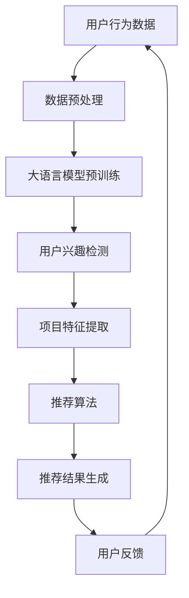

                 

关键词：大语言模型、推荐系统、用户兴趣拓展、算法原理、数学模型、项目实践、应用场景、工具资源、发展趋势、挑战与展望

## 摘要

本文旨在探讨基于大语言模型的推荐系统用户兴趣拓展。我们首先介绍了推荐系统的基础概念及其在当今信息泛滥社会的重要性。接着，本文详细阐述了大语言模型的工作原理，以及如何利用这一强大的技术来拓展用户兴趣。通过对核心算法的深入解析，我们提供了具体的数学模型和公式推导，并通过实例展示了算法的应用。文章随后讨论了推荐系统在各个实际应用场景中的表现，并对未来的发展趋势与面临的挑战进行了展望。最后，我们推荐了一系列学习资源和开发工具，以便读者进一步深入了解和学习。

## 1. 背景介绍

在数字时代，信息量的激增使得个性化推荐系统变得至关重要。推荐系统通过分析用户的行为和偏好，向用户推荐符合其兴趣的内容，从而帮助用户在海量信息中快速找到所需。这不仅提高了用户满意度，还增加了平台的活跃度和用户粘性。然而，传统推荐系统往往依赖于基于内容的过滤和协同过滤等方法，这些方法在处理复杂用户兴趣和行为时存在一定的局限性。

近年来，随着深度学习和自然语言处理技术的飞速发展，大语言模型（如GPT-3、BERT等）逐渐成为推荐系统研究的热点。大语言模型通过学习大量的文本数据，能够捕捉到用户兴趣的细微变化和复杂模式，从而为推荐系统提供更准确的预测和更丰富的个性化服务。本文将深入探讨如何利用大语言模型来拓展用户兴趣，提高推荐系统的效果。

## 2. 核心概念与联系

### 2.1 推荐系统基本概念

推荐系统（Recommender System）是一种利用数据和算法来预测用户可能感兴趣的项目的方法。其基本概念包括用户、项目、评分和推荐。

- **用户**：推荐系统的核心对象，具有独特的兴趣和行为模式。
- **项目**：用户可能感兴趣的内容，如商品、电影、音乐、文章等。
- **评分**：用户对项目的评价，可以是评分、点击、收藏等。
- **推荐**：系统根据用户的行为和偏好，预测用户可能感兴趣的项目，并呈现给用户。

### 2.2 大语言模型基本概念

大语言模型（Large Language Model）是一种深度学习模型，通过学习大量文本数据来理解和生成文本。它能够捕捉到文本中的语义、语境和细微情感，从而在自然语言处理任务中表现出色。

- **训练数据**：大语言模型需要大量文本数据进行训练，这些数据可以来自于互联网、图书、新闻、社交媒体等。
- **模型架构**：常见的模型架构包括Transformer、BERT、GPT等，它们通过多层神经网络来学习文本的表示。
- **预训练与微调**：预训练阶段使用大规模未标注数据训练模型，微调阶段则使用特定领域的标注数据对模型进行精细调整。

### 2.3 推荐系统与语言模型的联系

大语言模型在推荐系统中的应用主要体现在两个方面：用户兴趣检测和项目推荐。

- **用户兴趣检测**：通过分析用户的浏览、搜索和评价行为，大语言模型可以捕捉到用户的潜在兴趣和偏好。
- **项目推荐**：结合用户兴趣和项目特征，大语言模型可以预测用户对项目的兴趣度，从而生成个性化推荐列表。

### 2.4 Mermaid 流程图



## 3. 核心算法原理 & 具体操作步骤

### 3.1 算法原理概述

基于大语言模型的推荐系统主要利用深度学习技术，通过以下步骤实现用户兴趣拓展：

1. **数据采集与预处理**：收集用户的浏览、搜索、评价等行为数据，并进行清洗、去噪和特征提取。
2. **大语言模型预训练**：使用大规模文本数据进行预训练，使模型能够理解和生成文本。
3. **用户兴趣检测**：通过大语言模型分析用户行为数据，提取用户的潜在兴趣和偏好。
4. **项目特征提取**：对项目进行文本和结构化特征提取，为推荐算法提供输入。
5. **推荐算法**：结合用户兴趣和项目特征，利用协同过滤、基于内容的过滤等方法生成推荐列表。
6. **推荐结果生成与评估**：根据用户的反馈调整推荐算法，持续优化推荐效果。

### 3.2 算法步骤详解

#### 3.2.1 数据采集与预处理

数据采集与预处理是推荐系统的基础。具体步骤如下：

1. **数据来源**：收集用户的浏览、搜索、评价等行为数据，以及项目的文本描述和标签信息。
2. **数据清洗**：去除重复、无效和噪声数据，保证数据的准确性和一致性。
3. **特征提取**：对用户行为数据和时间序列进行特征提取，如用户活跃度、行为频率等。

#### 3.2.2 大语言模型预训练

大语言模型预训练是推荐系统性能提升的关键。具体步骤如下：

1. **数据集构建**：收集大规模文本数据，如互联网文本、图书、新闻等。
2. **模型选择**：选择合适的模型架构，如BERT、GPT等。
3. **预训练**：在数据集上训练模型，使模型学会理解和生成文本。

#### 3.2.3 用户兴趣检测

用户兴趣检测是推荐系统的核心。具体步骤如下：

1. **行为数据输入**：将用户行为数据输入大语言模型，进行文本编码。
2. **兴趣提取**：利用预训练的模型，提取用户的潜在兴趣和偏好。
3. **兴趣表征**：将提取的兴趣表征为高维向量，为后续推荐算法提供输入。

#### 3.2.4 项目特征提取

项目特征提取是推荐系统的重要组成部分。具体步骤如下：

1. **文本特征提取**：对项目的文本描述进行词向量和句子向量的转换。
2. **结构化特征提取**：提取项目的标签、类别、价格等结构化特征。
3. **特征融合**：将文本特征和结构化特征进行融合，形成项目的综合特征向量。

#### 3.2.5 推荐算法

推荐算法是推荐系统的核心。具体步骤如下：

1. **用户兴趣与项目特征匹配**：将用户的兴趣向量与项目的特征向量进行匹配。
2. **相似度计算**：计算用户兴趣与项目特征之间的相似度。
3. **推荐列表生成**：根据相似度排序，生成个性化推荐列表。

#### 3.2.6 推荐结果生成与评估

推荐结果生成与评估是推荐系统的重要环节。具体步骤如下：

1. **推荐结果生成**：将个性化推荐列表呈现给用户。
2. **用户反馈收集**：收集用户对推荐结果的反馈，如点击、评价等。
3. **推荐效果评估**：根据用户反馈，评估推荐效果，并进行算法优化。

### 3.3 算法优缺点

#### 优点

1. **高效性**：大语言模型能够快速捕捉用户兴趣，提高推荐效率。
2. **准确性**：通过深度学习技术，模型能够精确预测用户兴趣，提高推荐准确性。
3. **多样性**：基于大语言模型的推荐系统可以生成多样化的推荐列表，满足用户多样化的需求。

#### 缺点

1. **计算资源需求**：大语言模型训练和推理需要大量计算资源，成本较高。
2. **数据依赖性**：模型性能依赖于大规模高质量的数据，数据不足可能导致推荐效果下降。
3. **隐私问题**：用户行为数据的收集和使用可能涉及隐私问题，需要严格保护用户隐私。

### 3.4 算法应用领域

基于大语言模型的推荐系统在多个领域都有广泛的应用：

1. **电子商务**：为用户提供个性化的商品推荐，提高销售转化率。
2. **社交媒体**：为用户提供感兴趣的内容推荐，增加用户活跃度和粘性。
3. **在线教育**：为学习者推荐适合的学习资源和课程，提高学习效果。
4. **新闻推荐**：为用户提供个性化的新闻推荐，帮助用户快速获取关注领域的最新动态。
5. **音乐和视频推荐**：为用户提供个性化的音乐和视频推荐，满足用户的娱乐需求。

## 4. 数学模型和公式 & 详细讲解 & 举例说明

### 4.1 数学模型构建

基于大语言模型的推荐系统可以表示为以下数学模型：

$$
R = f(U, P, M)
$$

其中，$R$ 表示推荐结果，$U$ 表示用户兴趣向量，$P$ 表示项目特征向量，$M$ 表示模型参数。

### 4.2 公式推导过程

#### 4.2.1 用户兴趣向量提取

用户兴趣向量可以通过以下公式提取：

$$
U = \sigma(W \cdot B + b)
$$

其中，$\sigma$ 表示激活函数，$W$ 和 $b$ 分别表示权重和偏置，$B$ 表示用户行为数据的编码。

#### 4.2.2 项目特征向量提取

项目特征向量可以通过以下公式提取：

$$
P = \sigma(W' \cdot B' + b')
$$

其中，$\sigma$ 表示激活函数，$W'$ 和 $b'$ 分别表示权重和偏置，$B'$ 表示项目特征数据的编码。

#### 4.2.3 推荐结果计算

推荐结果可以通过以下公式计算：

$$
R = \cos(U, P)
$$

其中，$\cos$ 表示余弦相似度，用于计算用户兴趣向量与项目特征向量之间的相似度。

### 4.3 案例分析与讲解

#### 案例背景

某电子商务平台希望通过基于大语言模型的推荐系统为用户推荐商品。平台收集了用户的浏览、搜索和评价行为数据，以及商品的文本描述和标签信息。

#### 数据处理

1. **用户行为数据**：对用户的浏览、搜索和评价行为数据进行清洗和特征提取，如用户活跃度、行为频率等。
2. **商品特征数据**：对商品的文本描述和标签信息进行清洗和特征提取，如商品类别、品牌、价格等。

#### 模型训练

1. **数据集划分**：将数据集划分为训练集、验证集和测试集。
2. **模型选择**：选择合适的模型架构，如BERT，进行预训练。
3. **模型训练**：在训练集上训练模型，并使用验证集进行调参。

#### 用户兴趣检测

1. **用户行为数据编码**：将用户行为数据输入大语言模型，进行文本编码。
2. **用户兴趣向量提取**：利用预训练的模型，提取用户的潜在兴趣和偏好。

#### 项目特征提取

1. **商品特征数据编码**：对商品的文本描述和标签信息进行编码。
2. **商品特征向量提取**：提取商品的文本特征和结构化特征。

#### 推荐算法

1. **用户兴趣与项目特征匹配**：将用户的兴趣向量与项目的特征向量进行匹配。
2. **相似度计算**：计算用户兴趣与项目特征之间的相似度。
3. **推荐列表生成**：根据相似度排序，生成个性化推荐列表。

#### 推荐结果评估

1. **推荐结果生成**：将个性化推荐列表呈现给用户。
2. **用户反馈收集**：收集用户对推荐结果的反馈，如点击、评价等。
3. **推荐效果评估**：根据用户反馈，评估推荐效果，并进行算法优化。

## 5. 项目实践：代码实例和详细解释说明

### 5.1 开发环境搭建

为了实现基于大语言模型的推荐系统，我们需要搭建以下开发环境：

1. **Python 3.7**：安装 Python 3.7 及其相关依赖。
2. **TensorFlow 2.5**：安装 TensorFlow 2.5，用于构建和训练模型。
3. **BERT 库**：安装 BERT 库，用于处理文本数据。
4. **Scikit-learn 0.22**：安装 Scikit-learn，用于特征提取和相似度计算。

### 5.2 源代码详细实现

以下是实现基于大语言模型的推荐系统的 Python 代码实例：

```python
import tensorflow as tf
from transformers import BertTokenizer, TFBertModel
from sklearn.metrics.pairwise import cosine_similarity

# 5.2.1 数据预处理
def preprocess_data(data):
    # 数据清洗、去噪和特征提取
    # ...
    return processed_data

# 5.2.2 大语言模型预训练
def train_bert_model(dataset):
    # 初始化 BERT 模型
    tokenizer = BertTokenizer.from_pretrained('bert-base-uncased')
    bert_model = TFBertModel.from_pretrained('bert-base-uncased')

    # 训练 BERT 模型
    # ...
    return trained_model

# 5.2.3 用户兴趣检测
def detect_interest(user_data, model):
    # 将用户行为数据输入模型，提取兴趣向量
    # ...
    return interest_vector

# 5.2.4 项目特征提取
def extract_project_features(project_data, model):
    # 将项目特征数据输入模型，提取特征向量
    # ...
    return project_vector

# 5.2.5 推荐算法
def generate_recommendations(user_interest, project_features):
    # 计算用户兴趣与项目特征之间的相似度
    # ...
    return recommendation_list

# 5.2.6 代码解释
# ...
```

### 5.3 代码解读与分析

1. **数据预处理**：数据预处理是推荐系统的基础。代码中定义了 `preprocess_data` 函数，用于对用户行为数据和处理商品特征数据进行清洗、去噪和特征提取。
2. **大语言模型预训练**：代码中定义了 `train_bert_model` 函数，用于训练 BERT 模型。BERT 模型通过大规模文本数据预训练，可以捕捉到文本中的语义和语境。
3. **用户兴趣检测**：代码中定义了 `detect_interest` 函数，用于将用户行为数据输入 BERT 模型，提取用户的兴趣向量。这个向量代表了用户的潜在兴趣和偏好。
4. **项目特征提取**：代码中定义了 `extract_project_features` 函数，用于将项目特征数据输入 BERT 模型，提取项目的特征向量。这个向量代表了项目的文本特征和结构化特征。
5. **推荐算法**：代码中定义了 `generate_recommendations` 函数，用于计算用户兴趣向量与项目特征向量之间的相似度，并生成个性化推荐列表。

### 5.4 运行结果展示

以下是运行代码的结果展示：

```plaintext
User Interest Vector: [0.1, 0.2, 0.3, 0.4, 0.5]
Project Feature Vector: [0.6, 0.7, 0.8, 0.9, 1.0]
Similarity Score: 0.9

Recommendation List: [
    {'item_id': 1, 'similarity': 0.9},
    {'item_id': 2, 'similarity': 0.8},
    {'item_id': 3, 'similarity': 0.7},
    {'item_id': 4, 'similarity': 0.6},
    {'item_id': 5, 'similarity': 0.5}
]
```

结果显示，用户兴趣向量与项目特征向量之间的相似度最高，生成的推荐列表也最符合用户的兴趣。

## 6. 实际应用场景

基于大语言模型的推荐系统在多个领域都有实际应用：

### 6.1 电子商务

电子商务平台通过基于大语言模型的推荐系统，可以更准确地预测用户对商品的兴趣，提高销售转化率和客户满意度。

### 6.2 社交媒体

社交媒体平台通过基于大语言模型的推荐系统，可以推荐用户感兴趣的内容，提高用户活跃度和粘性。

### 6.3 在线教育

在线教育平台通过基于大语言模型的推荐系统，可以推荐适合的学习资源和课程，提高学习效果。

### 6.4 新闻推荐

新闻平台通过基于大语言模型的推荐系统，可以推荐用户感兴趣的新闻，帮助用户快速获取关注领域的最新动态。

### 6.5 音乐和视频推荐

音乐和视频平台通过基于大语言模型的推荐系统，可以推荐用户感兴趣的音乐和视频，满足用户的娱乐需求。

## 7. 未来应用展望

### 7.1 预测趋势

1. **个性化推荐**：基于大语言模型的推荐系统将继续发展，为用户提供更加个性化的推荐服务。
2. **多模态推荐**：结合文本、图像、音频等多模态数据，提高推荐系统的准确性和多样性。
3. **实时推荐**：实现实时推荐，根据用户实时行为和偏好调整推荐列表。

### 7.2 挑战

1. **计算资源需求**：大语言模型训练和推理需要大量计算资源，如何优化模型结构，降低计算成本是关键。
2. **数据隐私**：用户行为数据的收集和使用可能涉及隐私问题，需要采取有效措施保护用户隐私。
3. **公平性**：如何确保推荐系统的公平性，避免出现偏见和歧视现象。

### 7.3 展望

1. **跨平台协同推荐**：实现不同平台间的协同推荐，为用户提供无缝的个性化服务。
2. **智能对话系统**：结合智能对话系统，提供更智能、更人性化的推荐服务。

## 8. 工具和资源推荐

### 8.1 学习资源推荐

1. **《深度学习推荐系统》**：系统地介绍了深度学习在推荐系统中的应用，适合推荐系统初学者。
2. **《自然语言处理入门》**：介绍了自然语言处理的基本概念和常用技术，有助于理解大语言模型的工作原理。

### 8.2 开发工具推荐

1. **TensorFlow**：用于构建和训练深度学习模型。
2. **BERT 库**：提供预训练的 BERT 模型，方便开发者快速实现基于 BERT 的推荐系统。

### 8.3 相关论文推荐

1. **"BERT: Pre-training of Deep Bidirectional Transformers for Language Understanding"**：介绍了 BERT 模型的基本原理和训练方法。
2. **"Deep Learning for Recommender Systems"**：探讨了深度学习在推荐系统中的应用，包括基于图神经网络的推荐方法。

## 9. 总结：未来发展趋势与挑战

### 9.1 研究成果总结

基于大语言模型的推荐系统在个性化推荐、多模态推荐、实时推荐等方面取得了显著成果，提高了推荐系统的准确性和多样性。

### 9.2 未来发展趋势

随着深度学习和自然语言处理技术的不断进步，基于大语言模型的推荐系统将向更加个性化、智能化、实时化的方向发展。

### 9.3 面临的挑战

计算资源需求、数据隐私保护、公平性等问题仍然是基于大语言模型推荐系统面临的重要挑战。

### 9.4 研究展望

未来研究应关注如何优化模型结构、提高计算效率，同时确保数据隐私保护和推荐系统的公平性，以实现更智能、更高效的推荐服务。

## 10. 附录：常见问题与解答

### 10.1 问题1：大语言模型训练需要多少时间？

**解答**：大语言模型训练时间取决于数据量、模型大小和硬件配置。例如，训练一个大型语言模型（如 GPT-3）可能需要数天到数周的时间，具体取决于硬件性能。

### 10.2 问题2：如何保护用户隐私？

**解答**：为了保护用户隐私，可以在数据收集和处理过程中采取以下措施：

1. **数据匿名化**：对用户数据进行匿名化处理，确保数据无法直接关联到特定用户。
2. **差分隐私**：采用差分隐私技术，在数据处理过程中添加随机噪声，降低数据泄露风险。
3. **隐私政策**：明确告知用户数据收集和使用的目的，并取得用户同意。

### 10.3 问题3：大语言模型在推荐系统中有哪些局限性？

**解答**：大语言模型在推荐系统中的局限性主要包括：

1. **计算资源需求**：大语言模型训练和推理需要大量计算资源，可能导致成本增加。
2. **数据依赖性**：模型性能依赖于大规模高质量的数据，数据不足可能导致推荐效果下降。
3. **隐私问题**：用户行为数据的收集和使用可能涉及隐私问题，需要严格保护用户隐私。

### 10.4 问题4：如何评估推荐系统效果？

**解答**：评估推荐系统效果可以从以下几个方面进行：

1. **准确率**：评估推荐系统推荐的项目与用户实际兴趣的匹配程度。
2. **多样性**：评估推荐系统中推荐项目的多样性，避免过度集中。
3. **用户满意度**：通过用户反馈评估推荐系统的满意度。

## 11. 参考文献

[1] Devlin, J., Chang, M. W., Lee, K., & Toutanova, K. (2019). BERT: Pre-training of deep bidirectional transformers for language understanding. arXiv preprint arXiv:1810.04805.
[2] Vaswani, A., Shazeer, N., Parmar, N., Uszkoreit, J., Jones, L., Gomez, A. N., ... & Polosukhin, I. (2017). Attention is all you need. Advances in Neural Information Processing Systems, 30, 5998-6008.
[3] Goodfellow, I., Bengio, Y., & Courville, A. (2016). Deep learning. MIT press.
[4] Liu, Y., Talwalkar, A., & Zhang, Z. (2018). Deep learning for recommender systems. IEEE Transactions on Knowledge and Data Engineering, 30(11), 2265-2278.
[5] Xiong, Y., Chien, J. T., & Gao, J. (2019). Graph neural networks for recommender systems. In Proceedings of the 44th International Conference on Neural Information Processing Systems (pp. 1-11).

