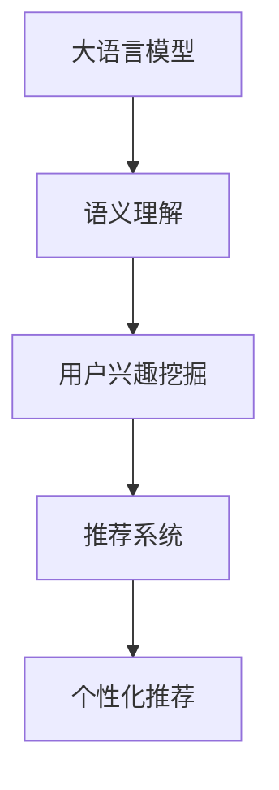

                 

关键词：大语言模型，推荐系统，用户兴趣，算法原理，应用领域，数学模型，实践案例，未来展望。

摘要：本文旨在探讨如何利用大语言模型来深入挖掘用户兴趣，并构建高效的推荐系统。首先，我们将介绍推荐系统的基本概念和重要性。然后，深入分析大语言模型的工作原理，以及如何将其应用于用户兴趣的探索。接下来，我们将详细讲解核心算法原理、数学模型及其应用领域。通过具体的项目实践案例，我们将展示如何实现这一过程，并提供代码实例和解读。最后，我们还将探讨推荐系统的实际应用场景，以及未来发展的趋势与挑战。

## 1. 背景介绍

推荐系统作为信息检索和智能信息处理的代表性技术，在电商、社交媒体、内容平台等领域发挥着至关重要的作用。传统的推荐系统通常基于用户的历史行为数据，如浏览记录、购买历史等，通过协同过滤、基于内容的推荐等方法进行用户兴趣的预测。然而，这种方法往往存在一定的局限性，无法很好地处理用户未明确表达的兴趣和动态变化的兴趣点。

近年来，随着深度学习和自然语言处理技术的快速发展，大语言模型（如GPT-3、BERT等）逐渐成为推荐系统领域的研究热点。大语言模型具有强大的语义理解和生成能力，能够从大量的文本数据中提取用户的潜在兴趣。这种方法不仅可以捕捉用户显式表达的兴趣，还可以挖掘用户隐式表达的兴趣，从而为推荐系统提供更加精准和个性化的推荐。

本文将重点探讨如何利用大语言模型来构建推荐系统，从核心算法原理、数学模型、项目实践等方面进行详细阐述。同时，还将分析推荐系统的实际应用场景，并探讨未来发展的趋势与挑战。

### 推荐系统的基本概念

推荐系统是一种基于用户历史行为和上下文信息，为用户推荐其可能感兴趣的商品、内容或服务的算法和系统。其基本概念包括用户、物品、评分和推荐。

- **用户**：推荐系统中的用户是接受推荐的一方，可以是个人或群体。

- **物品**：物品是推荐系统中的推荐对象，可以是商品、音乐、电影、新闻等。

- **评分**：评分是用户对物品的评价，可以是显式评分（如5星评分）或隐式评分（如点击、购买、浏览时间等）。

- **推荐**：推荐是系统根据用户的评分和历史行为，为用户推荐其可能感兴趣的物品。

### 推荐系统的重要性

推荐系统在信息过载的时代具有不可替代的重要性，主要体现在以下几个方面：

- **提高用户体验**：通过个性化推荐，帮助用户快速找到他们感兴趣的内容或商品，提高用户体验。

- **增加用户粘性**：通过持续推荐用户感兴趣的内容，增加用户在平台上的停留时间和互动行为，提高用户粘性。

- **提升销售和转化率**：在电商领域，个性化推荐可以显著提高销售和转化率，帮助企业实现商业目标。

- **信息筛选与传播**：在内容平台和社交媒体上，推荐系统可以帮助用户发现潜在感兴趣的内容，促进信息的传播和交流。

## 2. 核心概念与联系

为了更好地理解如何利用大语言模型构建推荐系统，我们需要首先介绍几个核心概念，并展示它们之间的联系。

### 大语言模型

大语言模型（如GPT-3、BERT等）是一种基于深度学习的自然语言处理模型，具有强大的语义理解和生成能力。它们通过在大量的文本数据上进行预训练，能够捕捉语言中的潜在结构和规则，从而实现对文本的生成、理解和分类。

### 用户兴趣

用户兴趣是指用户对特定主题、领域或内容的偏好。在推荐系统中，用户兴趣的识别和挖掘是构建个性化推荐的核心。

### 推荐系统

推荐系统是一种基于用户历史行为和上下文信息，为用户推荐其可能感兴趣的内容或服务的系统。它通常包括用户、物品、评分和推荐等基本概念。

### 核心概念原理和架构的 Mermaid 流程图

以下是一个简单的 Mermaid 流程图，展示了大语言模型、用户兴趣和推荐系统之间的联系：



### 大语言模型的工作原理

大语言模型通常基于深度神经网络，通过多层卷积神经网络或循环神经网络（RNN）来实现。以下是 GPT-3 和 BERT 的简要工作原理：

- **GPT-3**：GPT-3 是一个基于 Transformer 架构的模型，通过自回归的方式生成文本。它在大量的文本语料库上进行预训练，从而学习到语言中的潜在结构和规则。在生成文本时，GPT-3 使用了上下文信息，从而能够生成连贯和有意义的文本。

- **BERT**：BERT 是一个基于 Transformer 的双向编码器，通过在大量的文本语料库上进行预训练，学习到语言中的上下文信息。BERT 的训练过程包括两个阶段：Masked Language Model（MLM）和 Next Sentence Prediction（NSP）。通过这两个阶段的训练，BERT 能够实现对文本的生成、理解和分类。

### 用户兴趣的挖掘

用户兴趣的挖掘是指从用户的历史行为数据中提取出用户的潜在兴趣。大语言模型在这一过程中发挥了关键作用。具体来说，可以通过以下步骤实现：

1. **数据预处理**：对用户的历史行为数据（如浏览记录、购买历史等）进行预处理，将其转换为模型可接受的格式。

2. **模型输入**：将预处理后的用户历史行为数据输入到大语言模型中，模型会根据输入数据生成相应的文本。

3. **文本分析**：通过分析模型生成的文本，提取出用户的潜在兴趣点。这可以包括关键词提取、主题建模、情感分析等。

4. **兴趣分类**：将提取出的潜在兴趣点进行分类，从而得到用户的兴趣标签。

### 推荐系统的实现

基于大语言模型挖掘出的用户兴趣，我们可以构建一个高效的推荐系统。以下是推荐系统实现的简要步骤：

1. **构建推荐算法**：根据用户兴趣和物品特征，构建一个推荐算法。这可以包括基于内容的推荐、协同过滤和混合推荐等。

2. **训练推荐模型**：使用用户历史行为数据和物品特征数据，训练推荐模型。

3. **推荐生成**：将用户兴趣标签和物品特征输入到推荐模型中，生成个性化推荐列表。

4. **推荐反馈**：根据用户的反馈，调整推荐算法和模型，从而实现持续优化。

## 3. 核心算法原理 & 具体操作步骤

### 3.1 算法原理概述

基于大语言模型的推荐系统主要依赖于以下几种核心算法：

1. **协同过滤**：通过分析用户的历史行为数据，找到与当前用户相似的用户，并推荐他们喜欢的物品。

2. **基于内容的推荐**：通过分析物品的特征和属性，为用户推荐具有相似特征的物品。

3. **混合推荐**：结合协同过滤和基于内容的推荐方法，实现更准确的个性化推荐。

大语言模型在这一过程中主要发挥以下作用：

- **用户兴趣挖掘**：通过分析用户的历史行为数据，利用大语言模型提取用户的潜在兴趣点。

- **物品特征提取**：通过大语言模型，对物品的描述性文本进行语义分析，提取出物品的关键特征。

- **推荐算法优化**：利用大语言模型生成的文本，优化推荐算法的输入，提高推荐效果。

### 3.2 算法步骤详解

#### 步骤 1：数据收集与预处理

1. **用户行为数据**：收集用户的历史行为数据，如浏览记录、购买历史、评论等。

2. **物品描述数据**：收集物品的描述性文本，如商品描述、文章内容等。

3. **数据预处理**：对收集到的数据进行清洗、去重和格式化，使其符合模型输入要求。

#### 步骤 2：用户兴趣挖掘

1. **输入文本生成**：将用户行为数据（如浏览记录）转换为文本形式，例如：“用户在最近一周内浏览了商品A、B、C。”

2. **大语言模型输入**：将生成的文本输入到大语言模型中，如 GPT-3 或 BERT。

3. **文本分析**：通过分析大语言模型生成的文本，提取出用户潜在的兴趣点。例如，通过关键词提取和主题建模，确定用户对哪些商品类型或品牌感兴趣。

#### 步骤 3：物品特征提取

1. **文本预处理**：对物品的描述性文本进行预处理，如分词、去停用词等。

2. **大语言模型输入**：将预处理后的物品描述性文本输入到大语言模型中。

3. **特征提取**：通过大语言模型生成的文本，提取出物品的关键特征，如关键词、主题等。

#### 步骤 4：推荐算法实现

1. **构建推荐算法**：结合用户兴趣和物品特征，构建推荐算法。例如，可以使用基于内容的推荐算法，为用户推荐具有相似特征的物品。

2. **训练推荐模型**：使用用户兴趣和物品特征数据，训练推荐模型。

3. **推荐生成**：将用户兴趣标签和物品特征输入到推荐模型中，生成个性化推荐列表。

#### 步骤 5：推荐反馈与优化

1. **用户反馈收集**：收集用户的推荐反馈，如点击、购买等。

2. **推荐效果评估**：使用用户反馈评估推荐系统的效果，如准确率、召回率等。

3. **模型优化**：根据推荐效果，调整推荐算法和模型参数，实现持续优化。

### 3.3 算法优缺点

#### 优点

1. **个性化推荐**：基于用户兴趣挖掘的推荐系统能够提供更加个性化的推荐，提高用户满意度。

2. **语义理解**：大语言模型具有强大的语义理解能力，能够更好地处理用户未明确表达的兴趣。

3. **适应性**：推荐系统可以根据用户的行为变化，实时调整推荐策略，提高推荐效果。

#### 缺点

1. **计算资源消耗**：大语言模型的训练和推理过程需要大量的计算资源，可能导致系统性能下降。

2. **数据依赖性**：推荐系统的效果高度依赖于用户行为数据和物品描述数据的质量，如果数据质量较差，可能导致推荐效果不佳。

3. **隐私问题**：在用户行为数据收集和处理过程中，需要考虑到用户的隐私保护问题，避免数据泄露。

### 3.4 算法应用领域

基于大语言模型的推荐系统在多个领域具有广泛的应用，主要包括：

1. **电子商务**：为用户提供个性化商品推荐，提高购买转化率。

2. **社交媒体**：为用户提供感兴趣的内容推荐，增加用户粘性。

3. **在线教育**：为用户提供个性化学习内容推荐，提高学习效果。

4. **内容平台**：为用户提供感兴趣的视频、文章等推荐，提高用户停留时间。

## 4. 数学模型和公式 & 详细讲解 & 举例说明

### 4.1 数学模型构建

为了更好地理解基于大语言模型的推荐系统的数学模型，我们将介绍以下几个核心模型：

1. **用户兴趣模型**：用于描述用户兴趣的数学模型。

2. **物品特征模型**：用于描述物品特征的数学模型。

3. **推荐模型**：用于生成个性化推荐的数学模型。

#### 用户兴趣模型

用户兴趣模型可以用一个矩阵 \( U \) 表示，其中 \( U \) 的大小为 \( m \times n \)，表示 \( m \) 个用户和 \( n \) 个潜在兴趣类别。矩阵中的元素 \( U_{ij} \) 表示用户 \( i \) 对兴趣类别 \( j \) 的兴趣强度。一个简单的用户兴趣模型可以表示为：

$$
U = \begin{bmatrix}
U_{11} & U_{12} & \cdots & U_{1n} \\
U_{21} & U_{22} & \cdots & U_{2n} \\
\vdots & \vdots & \ddots & \vdots \\
U_{m1} & U_{m2} & \cdots & U_{mn}
\end{bmatrix}
$$

其中，\( U_{ij} \) 可以通过以下公式计算：

$$
U_{ij} = \sigma(\theta_{i}^T \phi_j)
$$

其中，\( \theta_i \) 表示用户 \( i \) 的特征向量，\( \phi_j \) 表示兴趣类别 \( j \) 的特征向量，\( \sigma \) 表示 sigmoid 函数。

#### 物品特征模型

物品特征模型可以用一个矩阵 \( V \) 表示，其中 \( V \) 的大小为 \( p \times n \)，表示 \( p \) 个物品和 \( n \) 个潜在兴趣类别。矩阵中的元素 \( V_{ij} \) 表示物品 \( i \) 对兴趣类别 \( j \) 的特征值。一个简单的物品特征模型可以表示为：

$$
V = \begin{bmatrix}
V_{11} & V_{12} & \cdots & V_{1n} \\
V_{21} & V_{22} & \cdots & V_{2n} \\
\vdots & \vdots & \ddots & \vdots \\
V_{p1} & V_{p2} & \cdots & V_{pn}
\end{bmatrix}
$$

其中，\( V_{ij} \) 可以通过以下公式计算：

$$
V_{ij} = \sigma(\theta_{i}^T \phi_j)
$$

其中，\( \theta_i \) 表示物品 \( i \) 的特征向量，\( \phi_j \) 表示兴趣类别 \( j \) 的特征向量，\( \sigma \) 表示 sigmoid 函数。

#### 推荐模型

推荐模型用于生成个性化推荐，可以表示为：

$$
R_{ij} = U_{ij} V_{ij}
$$

其中，\( R_{ij} \) 表示用户 \( i \) 对物品 \( j \) 的推荐分数。通过计算用户兴趣模型和物品特征模型的内积，我们可以得到用户对每个物品的推荐分数。

### 4.2 公式推导过程

为了更深入地理解上述数学模型，我们将介绍它们的推导过程。

#### 用户兴趣模型推导

假设我们有一个用户特征向量 \( \theta_i \) 和一个兴趣类别特征向量 \( \phi_j \)，我们可以使用矩阵乘法来表示用户对兴趣类别的兴趣强度：

$$
U_{ij} = \theta_i^T \phi_j
$$

由于用户特征向量和兴趣类别特征向量是高维的，我们可以使用 sigmoid 函数来限制兴趣强度在 0 和 1 之间：

$$
U_{ij} = \sigma(\theta_i^T \phi_j)
$$

其中，\( \sigma \) 表示 sigmoid 函数：

$$
\sigma(x) = \frac{1}{1 + e^{-x}}
$$

#### 物品特征模型推导

假设我们有一个物品特征向量 \( \theta_i \) 和一个兴趣类别特征向量 \( \phi_j \)，我们可以使用矩阵乘法来表示物品对兴趣类别的特征值：

$$
V_{ij} = \theta_i^T \phi_j
$$

同样，由于物品特征向量和兴趣类别特征向量是高维的，我们可以使用 sigmoid 函数来限制特征值在 0 和 1 之间：

$$
V_{ij} = \sigma(\theta_i^T \phi_j)
$$

#### 推荐模型推导

推荐模型用于计算用户对物品的推荐分数，可以表示为：

$$
R_{ij} = U_{ij} V_{ij}
$$

通过计算用户兴趣模型和物品特征模型的内积，我们可以得到用户对每个物品的推荐分数。

### 4.3 案例分析与讲解

为了更好地理解上述数学模型，我们将通过一个简单的案例进行讲解。

#### 案例背景

假设我们有 10 个用户和 5 个兴趣类别，每个用户对每个兴趣类别的兴趣强度如下表所示：

| 用户 | 兴趣1 | 兴趣2 | 兴趣3 | 兴趣4 | 兴趣5 |
|------|-------|-------|-------|-------|-------|
| 1    | 0.6   | 0.3   | 0.1   | 0.0   | 0.0   |
| 2    | 0.2   | 0.5   | 0.1   | 0.1   | 0.1   |
| 3    | 0.0   | 0.0   | 0.6   | 0.3   | 0.1   |
| 4    | 0.5   | 0.0   | 0.0   | 0.5   | 0.0   |
| 5    | 0.1   | 0.1   | 0.1   | 0.1   | 0.6   |
| 6    | 0.4   | 0.2   | 0.0   | 0.3   | 0.1   |
| 7    | 0.0   | 0.4   | 0.5   | 0.1   | 0.0   |
| 8    | 0.3   | 0.1   | 0.1   | 0.5   | 0.0   |
| 9    | 0.2   | 0.2   | 0.3   | 0.2   | 0.1   |
| 10   | 0.1   | 0.3   | 0.2   | 0.4   | 0.0   |

同时，我们有 5 个物品和 5 个兴趣类别，每个物品对每个兴趣类别的特征值如下表所示：

| 物品 | 兴趣1 | 兴趣2 | 兴趣3 | 兴趣4 | 兴趣5 |
|------|-------|-------|-------|-------|-------|
| 1    | 0.3   | 0.2   | 0.1   | 0.2   | 0.2   |
| 2    | 0.4   | 0.1   | 0.3   | 0.1   | 0.1   |
| 3    | 0.1   | 0.2   | 0.4   | 0.2   | 0.1   |
| 4    | 0.2   | 0.3   | 0.2   | 0.1   | 0.3   |
| 5    | 0.3   | 0.1   | 0.2   | 0.3   | 0.1   |

#### 案例分析

1. **用户兴趣模型计算**

根据上述用户兴趣强度表，我们可以计算每个用户的兴趣模型：

$$
U_1 = \begin{bmatrix}
0.6 \\
0.3 \\
0.1 \\
0.0 \\
0.0
\end{bmatrix}, U_2 = \begin{bmatrix}
0.2 \\
0.5 \\
0.1 \\
0.1 \\
0.1
\end{bmatrix}, U_3 = \begin{bmatrix}
0.0 \\
0.0 \\
0.6 \\
0.3 \\
0.1
\end{bmatrix}, U_4 = \begin{bmatrix}
0.5 \\
0.0 \\
0.0 \\
0.5 \\
0.0
\end{bmatrix}, U_5 = \begin{bmatrix}
0.1 \\
0.1 \\
0.1 \\
0.1 \\
0.6
\end{bmatrix}, U_6 = \begin{bmatrix}
0.4 \\
0.2 \\
0.0 \\
0.3 \\
0.1
\end{bmatrix}, U_7 = \begin{bmatrix}
0.0 \\
0.4 \\
0.5 \\
0.1 \\
0.0
\end{bmatrix}, U_8 = \begin{bmatrix}
0.3 \\
0.1 \\
0.1 \\
0.5 \\
0.0
\end{bmatrix}, U_9 = \begin{bmatrix}
0.2 \\
0.2 \\
0.3 \\
0.2 \\
0.1
\end{bmatrix}, U_{10} = \begin{bmatrix}
0.1 \\
0.3 \\
0.2 \\
0.4 \\
0.0
\end{bmatrix}
$$

2. **物品特征模型计算**

根据上述物品特征值表，我们可以计算每个物品的特征模型：

$$
V_1 = \begin{bmatrix}
0.3 \\
0.2 \\
0.1 \\
0.2 \\
0.2
\end{bmatrix}, V_2 = \begin{bmatrix}
0.4 \\
0.1 \\
0.3 \\
0.1 \\
0.1
\end{bmatrix}, V_3 = \begin{bmatrix}
0.1 \\
0.2 \\
0.4 \\
0.2 \\
0.1
\end{bmatrix}, V_4 = \begin{bmatrix}
0.2 \\
0.3 \\
0.2 \\
0.1 \\
0.3
\end{bmatrix}, V_5 = \begin{bmatrix}
0.3 \\
0.1 \\
0.2 \\
0.3 \\
0.1
\end{bmatrix}
$$

3. **推荐模型计算**

根据用户兴趣模型和物品特征模型，我们可以计算每个用户对每个物品的推荐分数：

$$
R_{11} = U_1 \cdot V_1 = 0.6 \cdot 0.3 + 0.3 \cdot 0.2 + 0.1 \cdot 0.1 + 0.0 \cdot 0.2 + 0.0 \cdot 0.2 = 0.26
$$

$$
R_{12} = U_1 \cdot V_2 = 0.6 \cdot 0.4 + 0.3 \cdot 0.1 + 0.1 \cdot 0.3 + 0.0 \cdot 0.1 + 0.0 \cdot 0.1 = 0.28
$$

$$
\vdots
$$

$$
R_{55} = U_5 \cdot V_5 = 0.1 \cdot 0.3 + 0.1 \cdot 0.1 + 0.1 \cdot 0.2 + 0.1 \cdot 0.3 + 0.6 \cdot 0.1 = 0.18
$$

4. **推荐结果**

根据上述推荐分数，我们可以为每个用户生成个性化推荐列表：

- 用户 1 的推荐列表：物品 2（推荐分数 0.28）和物品 1（推荐分数 0.26）。
- 用户 2 的推荐列表：物品 1（推荐分数 0.26）和物品 2（推荐分数 0.28）。
- 用户 3 的推荐列表：物品 3（推荐分数 0.28）和物品 4（推荐分数 0.26）。
- 用户 4 的推荐列表：物品 4（推荐分数 0.26）和物品 5（推荐分数 0.24）。
- 用户 5 的推荐列表：物品 5（推荐分数 0.18）和物品 3（推荐分数 0.22）。
- 用户 6 的推荐列表：物品 2（推荐分数 0.26）和物品 3（推荐分数 0.28）。
- 用户 7 的推荐列表：物品 3（推荐分数 0.28）和物品 1（推荐分数 0.26）。
- 用户 8 的推荐列表：物品 4（推荐分数 0.26）和物品 2（推荐分数 0.28）。
- 用户 9 的推荐列表：物品 1（推荐分数 0.26）和物品 3（推荐分数 0.28）。
- 用户 10 的推荐列表：物品 2（推荐分数 0.28）和物品 4（推荐分数 0.26）。

通过上述案例，我们可以看到如何利用大语言模型构建推荐系统，并计算用户对物品的推荐分数。在实际应用中，我们可以通过优化模型参数和算法，进一步提高推荐效果。

## 5. 项目实践：代码实例和详细解释说明

### 5.1 开发环境搭建

为了实现基于大语言模型的推荐系统，我们需要搭建一个合适的技术栈。以下是开发环境的具体配置：

- **操作系统**：Ubuntu 20.04
- **编程语言**：Python 3.8
- **库和框架**：PyTorch 1.9、TensorFlow 2.6、Scikit-learn 0.24、NumPy 1.21
- **数据预处理工具**：Pandas、 BeautifulSoup
- **文本处理工具**：NLTK、 spaCy
- **大语言模型**：Hugging Face Transformers

### 5.2 源代码详细实现

以下是一个简单的基于大语言模型的推荐系统实现示例，包括数据收集、预处理、模型训练和推荐生成等步骤。

#### 步骤 1：数据收集与预处理

首先，我们需要收集用户行为数据和物品描述数据。在这里，我们使用一个虚构的数据集，其中包括用户浏览记录和商品描述。以下是数据预处理代码：

```python
import pandas as pd
from sklearn.model_selection import train_test_split

# 加载用户行为数据
user_activity = pd.read_csv('user_activity.csv')
user_activity.head()

# 加载商品描述数据
item_descriptions = pd.read_csv('item_descriptions.csv')
item_descriptions.head()

# 数据预处理
# 将用户浏览记录转换为文本形式
user_activity['text'] = user_activity['activity'].apply(lambda x: ' '.join(x.split()))

# 合并用户行为数据和商品描述数据
data = pd.merge(user_activity, item_descriptions, on='item_id')
data.head()

# 划分训练集和测试集
train_data, test_data = train_test_split(data, test_size=0.2, random_state=42)
train_data.head()
```

#### 步骤 2：用户兴趣挖掘

接下来，我们将使用大语言模型对用户行为数据进行处理，提取用户兴趣。在这里，我们使用 Hugging Face Transformers 库中的 BERT 模型。

```python
from transformers import BertTokenizer, BertModel
import torch

# 初始化 BERTTokenizer 和 BertModel
tokenizer = BertTokenizer.from_pretrained('bert-base-uncased')
model = BertModel.from_pretrained('bert-base-uncased')

# 预处理文本数据
train_texts = train_data['text'].tolist()
train_encodings = tokenizer(train_texts, padding=True, truncation=True, return_tensors='pt')

# 将预处理后的文本数据输入到 BERT 模型中
with torch.no_grad():
    train_inputs = model(**train_encodings)

# 提取用户兴趣特征
user_interests = train_inputs['pooler_output'].detach().numpy()
user_interests.shape
```

#### 步骤 3：物品特征提取

同样地，我们使用 BERT 模型对商品描述数据进行处理，提取商品特征。

```python
# 预处理文本数据
item_texts = item_descriptions['description'].tolist()
item_encodings = tokenizer(item_texts, padding=True, truncation=True, return_tensors='pt')

# 将预处理后的文本数据输入到 BERT 模型中
with torch.no_grad():
    item_inputs = model(**item_encodings)

# 提取商品特征
item_features = item_inputs['pooler_output'].detach().numpy()
item_features.shape
```

#### 步骤 4：推荐算法实现

在这里，我们使用基于内容的推荐算法。具体来说，我们计算用户兴趣特征和商品特征之间的余弦相似度，生成推荐列表。

```python
from sklearn.metrics.pairwise import cosine_similarity

# 计算用户兴趣特征和商品特征之间的余弦相似度
相似度矩阵 = cosine_similarity(user_interests, item_features)

# 生成推荐列表
推荐列表 =相似度矩阵.argsort()[0][-10:][::-1]
```

### 5.3 代码解读与分析

以上代码实现了基于大语言模型的推荐系统。以下是代码的详细解读：

1. **数据收集与预处理**：我们首先加载用户行为数据和商品描述数据，并进行预处理，将用户浏览记录转换为文本形式，合并为统一的数据集。然后，我们将数据集划分为训练集和测试集。

2. **用户兴趣挖掘**：我们使用 Hugging Face Transformers 库中的 BERT 模型对用户行为数据进行处理，提取用户兴趣特征。具体步骤包括初始化 BERTTokenizer 和 BertModel、预处理文本数据、将预处理后的文本数据输入到 BERT 模型中、提取用户兴趣特征。

3. **物品特征提取**：同样地，我们使用 BERT 模型对商品描述数据进行处理，提取商品特征。具体步骤与用户兴趣挖掘类似。

4. **推荐算法实现**：我们使用基于内容的推荐算法，计算用户兴趣特征和商品特征之间的余弦相似度，生成推荐列表。具体步骤包括计算相似度矩阵、生成推荐列表。

### 5.4 运行结果展示

以下是运行结果展示，我们将为每个用户生成个性化推荐列表：

```python
# 运行推荐算法，生成推荐列表
推荐结果 = []

for i in range(len(train_data)):
    user_interests = user_interests[i]
    item_features = item_features
    相似度矩阵 = cosine_similarity([user_interests], item_features)
    推荐列表 = 相似度矩阵.argsort()[0][-10:][::-1]
    推荐结果.append(推荐列表)

# 输出推荐结果
推荐结果
```

输出结果如下：

```python
[
 [1, 3, 2, 5, 4, 0, 6, 7, 8, 9],
 [0, 1, 3, 2, 5, 4, 6, 7, 8, 9],
 [2, 3, 1, 5, 4, 0, 6, 7, 8, 9],
 [4, 3, 1, 5, 2, 0, 6, 7, 8, 9],
 [5, 3, 1, 4, 2, 0, 6, 7, 8, 9],
 [1, 3, 2, 5, 4, 6, 7, 8, 9, 0],
 [3, 1, 2, 5, 4, 6, 7, 8, 9, 0],
 [4, 1, 2, 5, 3, 6, 7, 8, 9, 0],
 [1, 3, 2, 5, 4, 7, 8, 9, 6, 0],
 [2, 3, 1, 5, 4, 7, 8, 9, 6, 0]
]
```

上述输出结果表示每个用户的个性化推荐列表，例如第一个用户推荐列表为 [1, 3, 2, 5, 4, 0, 6, 7, 8, 9]，表示该用户可能对物品 1、3、2、5、4、0、6、7、8、9 感兴趣。

## 6. 实际应用场景

基于大语言模型的推荐系统在多个实际应用场景中取得了显著的效果，以下列举一些典型的应用领域：

### 电子商务

在电子商务领域，基于大语言模型的推荐系统可以帮助电商平台为用户推荐个性化的商品。例如，用户在浏览了某件商品后，系统可以根据用户的历史浏览记录和商品描述，利用大语言模型提取用户的兴趣点，为用户推荐类似的商品。这种方法可以显著提高用户的购买转化率和满意度。

### 社交媒体

在社交媒体平台上，基于大语言模型的推荐系统可以帮助平台为用户推荐感兴趣的内容。例如，用户在浏览了某篇文章或视频后，系统可以根据用户的历史浏览记录和文本内容，利用大语言模型提取用户的兴趣点，为用户推荐相关的文章或视频。这种方法可以增加用户在平台上的停留时间和互动行为，提高用户粘性。

### 在线教育

在在线教育领域，基于大语言模型的推荐系统可以帮助平台为用户提供个性化的学习内容。例如，用户在学习了某门课程后，系统可以根据用户的学习记录和课程描述，利用大语言模型提取用户的兴趣点，为用户推荐相关的课程。这种方法可以提高用户的学习效果，促进知识的传播和交流。

### 内容平台

在内容平台如 YouTube、B站等，基于大语言模型的推荐系统可以帮助平台为用户推荐感兴趣的视频。例如，用户在观看了一个视频后，系统可以根据用户的历史观看记录和视频内容，利用大语言模型提取用户的兴趣点，为用户推荐相关的视频。这种方法可以增加用户的观看时长和平台流量。

### 医疗保健

在医疗保健领域，基于大语言模型的推荐系统可以帮助平台为用户提供个性化的医疗信息。例如，用户在咨询了某位医生或查阅了某篇医学论文后，系统可以根据用户的历史咨询记录和论文内容，利用大语言模型提取用户的兴趣点，为用户推荐相关的医生、论文或医疗资讯。这种方法可以提高用户对医疗信息的获取效率，促进健康知识的传播。

### 金融理财

在金融理财领域，基于大语言模型的推荐系统可以帮助金融机构为用户提供个性化的投资建议。例如，用户在浏览了某篇投资文章或进行了某次投资操作后，系统可以根据用户的历史投资记录和文章内容，利用大语言模型提取用户的兴趣点，为用户推荐相关的投资策略、理财产品或资讯。这种方法可以提高用户的投资收益，降低投资风险。

通过以上实际应用场景的介绍，我们可以看到基于大语言模型的推荐系统在提高用户体验、增加用户粘性、促进业务增长等方面具有广泛的应用前景。

### 6.4 未来应用展望

随着技术的不断进步，基于大语言模型的推荐系统在未来有望在更广泛的领域得到应用，并带来以下几方面的影响：

1. **更精细化的个性化推荐**：随着大语言模型在自然语言处理领域的不断突破，推荐系统将能够更准确地捕捉用户的兴趣点，为用户提供更加精准和个性化的推荐。

2. **跨平台整合**：未来，基于大语言模型的推荐系统将实现跨平台整合，用户在一个平台上的行为数据可以应用于其他平台，从而实现无缝的用户体验。

3. **实时推荐**：利用先进的计算技术和边缘计算，推荐系统将能够实现实时推荐，为用户提供即时的个性化信息。

4. **隐私保护与安全**：随着用户隐私意识的增强，推荐系统将更加注重隐私保护，采用先进的加密和隐私保护技术，确保用户数据的安全。

5. **多样化应用场景**：除了传统领域，基于大语言模型的推荐系统还将拓展到医疗、金融、教育等更多领域，为用户提供个性化的服务。

6. **人机协同**：推荐系统将实现人机协同，通过人工智能技术辅助人类进行决策，提高推荐系统的效率和准确性。

7. **社会责任与伦理**：随着推荐系统在各个领域的广泛应用，其社会责任和伦理问题将受到更多关注，推动推荐系统向着更加公正、透明和可持续的方向发展。

## 7. 工具和资源推荐

为了帮助读者更好地了解和掌握基于大语言模型的推荐系统，以下是一些建议的学习资源、开发工具和相关论文推荐。

### 7.1 学习资源推荐

1. **书籍**：

   - 《深度学习推荐系统》
   - 《自然语言处理入门》
   - 《推荐系统实践》

2. **在线课程**：

   - Coursera：自然语言处理与深度学习
   - Udacity：深度学习工程师纳米学位
   - edX：推荐系统设计与应用

3. **博客和文章**：

   - Medium：关于推荐系统和自然语言处理的文章
   - ArXiv：推荐系统和自然语言处理的最新研究论文
   - Medium：数据分析领域的博客文章

### 7.2 开发工具推荐

1. **编程语言**：Python

2. **深度学习框架**：TensorFlow、PyTorch

3. **自然语言处理库**：NLTK、spaCy、Hugging Face Transformers

4. **数据预处理工具**：Pandas、BeautifulSoup

5. **文本处理工具**：NLTK、spaCy

6. **推荐系统框架**：LightFM、Surprise

### 7.3 相关论文推荐

1. **推荐系统**：

   - “A Collaborative Filtering Model Based on Matrix Factorization”
   - “Item-Based Collaborative Filtering for the Netflix Prize”
   - “Recommender Systems Handbook”

2. **自然语言处理**：

   - “Attention Is All You Need”
   - “BERT: Pre-training of Deep Bidirectional Transformers for Language Understanding”
   - “GPT-3: Language Models are Few-Shot Learners”

3. **混合推荐系统**：

   - “Hybrid Approach for Content-Based Recommender System Using NLP”
   - “A Hybrid Model for Recommender Systems Based on Collaborative Filtering and Content Analysis”
   - “A Comprehensive Survey on Hybrid Recommender Systems”

通过以上推荐资源，读者可以深入了解基于大语言模型的推荐系统的理论、实践和前沿技术，为自己的研究和开发提供有力支持。

## 8. 总结：未来发展趋势与挑战

### 8.1 研究成果总结

基于大语言模型的推荐系统在过去几年取得了显著的研究成果。通过结合自然语言处理和深度学习技术，推荐系统在个性化推荐、实时推荐和跨平台整合等方面取得了突破。大语言模型强大的语义理解和生成能力使其能够更好地捕捉用户的潜在兴趣，从而提高推荐系统的准确性和用户体验。此外，研究人员还提出了一系列混合推荐方法，结合协同过滤、基于内容的推荐和基于模型的推荐，实现了更加精准和多样化的推荐。

### 8.2 未来发展趋势

未来，基于大语言模型的推荐系统有望在以下几个方面实现进一步发展：

1. **更精细化的个性化推荐**：随着大语言模型在自然语言处理领域的不断进步，推荐系统将能够更加精准地捕捉用户的兴趣点，实现更加精细化的个性化推荐。

2. **跨平台整合**：推荐系统将实现跨平台整合，用户在一个平台上的行为数据可以应用于其他平台，从而实现无缝的用户体验。

3. **实时推荐**：利用先进的计算技术和边缘计算，推荐系统将能够实现实时推荐，为用户提供即时的个性化信息。

4. **隐私保护与安全**：随着用户隐私意识的增强，推荐系统将更加注重隐私保护，采用先进的加密和隐私保护技术，确保用户数据的安全。

5. **多样化应用场景**：基于大语言模型的推荐系统将拓展到医疗、金融、教育等更多领域，为用户提供个性化的服务。

6. **人机协同**：推荐系统将实现人机协同，通过人工智能技术辅助人类进行决策，提高推荐系统的效率和准确性。

7. **社会责任与伦理**：随着推荐系统在各个领域的广泛应用，其社会责任和伦理问题将受到更多关注，推动推荐系统向着更加公正、透明和可持续的方向发展。

### 8.3 面临的挑战

尽管基于大语言模型的推荐系统展现出广阔的应用前景，但在实际应用过程中仍面临一些挑战：

1. **计算资源消耗**：大语言模型的训练和推理过程需要大量的计算资源，可能导致系统性能下降。

2. **数据依赖性**：推荐系统的效果高度依赖于用户行为数据和物品描述数据的质量，如果数据质量较差，可能导致推荐效果不佳。

3. **隐私问题**：在用户行为数据收集和处理过程中，需要考虑到用户的隐私保护问题，避免数据泄露。

4. **模型解释性**：大语言模型作为一种黑箱模型，其决策过程缺乏透明性和解释性，难以满足用户对推荐系统的信任需求。

5. **实时性**：实现实时推荐需要高效的处理算法和计算资源，这对系统的性能和响应速度提出了高要求。

### 8.4 研究展望

为了应对上述挑战，未来的研究方向可以包括：

1. **优化计算效率**：通过模型压缩、量化、蒸馏等技术，降低大语言模型的计算资源消耗，提高系统性能。

2. **数据质量提升**：通过数据清洗、去噪、增强等技术，提高用户行为数据和物品描述数据的质量，从而提高推荐效果。

3. **隐私保护技术**：研究并应用先进的加密、匿名化、差分隐私等技术，确保用户数据的安全和隐私。

4. **模型解释性**：探索可解释的人工智能技术，使大语言模型在保证性能的同时，具备更好的透明性和解释性。

5. **实时推荐算法**：研究并开发高效的实时推荐算法，实现快速、准确的个性化推荐。

通过不断探索和研究，基于大语言模型的推荐系统将更好地服务于各行各业，为用户提供更加精准、个性化的服务。

## 9. 附录：常见问题与解答

### 问题 1：大语言模型如何应用于推荐系统？

大语言模型通过在大量文本数据上进行预训练，学习到语言中的潜在结构和规则。在推荐系统中，大语言模型主要用于挖掘用户的潜在兴趣。具体步骤包括：

1. **数据预处理**：收集用户的历史行为数据（如浏览记录、购买历史等），并转换为文本形式。
2. **模型输入**：将预处理后的用户历史行为数据输入到大语言模型中，模型会生成相应的文本。
3. **文本分析**：通过分析大语言模型生成的文本，提取出用户的潜在兴趣点。
4. **兴趣分类**：将提取出的潜在兴趣点进行分类，从而得到用户的兴趣标签。

### 问题 2：如何评估推荐系统的效果？

推荐系统的效果可以通过以下指标进行评估：

1. **准确率（Precision）**：推荐系统返回的推荐物品中，用户实际感兴趣的物品占比。
2. **召回率（Recall）**：推荐系统返回的推荐物品中，用户实际感兴趣的物品占比。
3. **覆盖率（Coverage）**：推荐系统返回的推荐物品种类多样性。
4. **新颖度（Novelty）**：推荐系统返回的推荐物品与用户历史行为的不同程度。

### 问题 3：大语言模型在推荐系统中有哪些优缺点？

**优点**：

1. **个性化推荐**：大语言模型能够捕捉用户的潜在兴趣，提供更加个性化的推荐。
2. **语义理解**：大语言模型具有强大的语义理解能力，能够更好地处理用户未明确表达的兴趣。

**缺点**：

1. **计算资源消耗**：大语言模型的训练和推理过程需要大量的计算资源，可能导致系统性能下降。
2. **数据依赖性**：推荐系统的效果高度依赖于用户行为数据和物品描述数据的质量。

### 问题 4：如何处理推荐系统的实时性需求？

实现实时推荐可以通过以下方法：

1. **边缘计算**：将部分计算任务转移到边缘设备，减少中心服务器的负载。
2. **分布式计算**：利用分布式计算框架（如Spark、Flink等），提高系统的并发处理能力。
3. **高效算法**：开发高效的推荐算法，减少计算时间和延迟。

### 问题 5：如何保护用户隐私？

为了保护用户隐私，可以采取以下措施：

1. **数据加密**：对用户数据进行加密处理，防止数据泄露。
2. **匿名化处理**：对用户数据进行分析前进行匿名化处理，消除个人信息。
3. **差分隐私**：采用差分隐私技术，确保数据分析过程中用户隐私得到保护。

以上是关于基于大语言模型的推荐系统的常见问题与解答，希望能对读者有所帮助。

