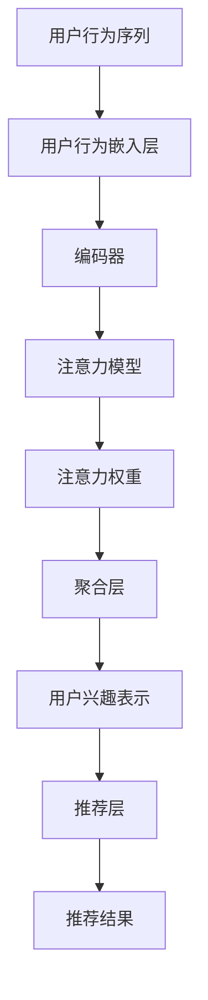

                 

关键词：序列化推荐、注意力机制、深度学习、用户行为分析、个性化推荐、模型评估

## 摘要

本文探讨了基于注意力机制的序列化推荐模型，介绍了其背景、核心概念、算法原理、数学模型及实际应用。通过分析用户行为序列，该模型能够捕捉用户兴趣的动态变化，实现更精确的个性化推荐。本文详细阐述了模型的构建过程、数学公式的推导和应用场景，并通过具体案例进行了解释。此外，还讨论了模型的优缺点、未来发展趋势及面临的挑战。

## 1. 背景介绍

随着互联网的快速发展，用户生成的内容和数据量呈现爆炸式增长。为了满足用户个性化需求，推荐系统应运而生。传统的推荐系统主要依赖于基于内容的推荐和协同过滤算法，但它们在处理用户行为序列和捕捉用户动态兴趣方面存在局限性。因此，深度学习，特别是注意力机制在推荐系统中的应用成为了研究的热点。

注意力机制最初在自然语言处理领域被提出，用于解决长序列信息处理问题。其核心思想是通过学习权重来关注序列中重要的信息，从而提高模型的表示能力和效果。将注意力机制应用于推荐系统，可以更好地捕捉用户行为序列中的关键信息，提高推荐的准确性。

## 2. 核心概念与联系

### 2.1 注意力机制原理

注意力机制是一种基于权重调整的信息聚合方法。在处理序列信息时，模型通过对序列中的每个元素进行加权求和，以获得序列的表示。注意力权重可以通过学习得到，从而关注重要信息，忽略无关信息。

注意力机制通常由以下几个关键部分组成：

1. **输入序列**：用户行为序列，如点击、浏览、购买等。
2. **编码器**：将输入序列编码为固定长度的向量表示。
3. **注意力模型**：计算每个输入元素的重要程度，产生注意力权重。
4. **输出层**：将加权后的输入序列进行聚合，得到最终输出。

### 2.2 序列化推荐模型架构

基于注意力机制的序列化推荐模型主要包括以下几个部分：

1. **用户行为嵌入层**：将用户行为序列转化为嵌入向量表示。
2. **注意力机制层**：计算用户行为序列中的注意力权重。
3. **聚合层**：将加权后的用户行为向量进行聚合，得到用户兴趣表示。
4. **推荐层**：根据用户兴趣表示，生成推荐结果。

### 2.3 Mermaid 流程图

下面是序列化推荐模型的 Mermaid 流程图：



## 3. 核心算法原理 & 具体操作步骤

### 3.1 算法原理概述

基于注意力机制的序列化推荐模型主要通过以下步骤实现：

1. **用户行为嵌入**：将用户行为序列转化为嵌入向量表示，通常使用词嵌入或时序嵌入技术。
2. **编码器**：使用编码器对用户行为向量进行编码，得到固定长度的向量表示。
3. **注意力权重计算**：通过注意力模型计算用户行为序列中的注意力权重，关注重要信息。
4. **聚合**：将加权后的用户行为向量进行聚合，得到用户兴趣表示。
5. **推荐**：根据用户兴趣表示，生成推荐结果。

### 3.2 算法步骤详解

1. **用户行为嵌入**：
   - 输入：用户行为序列
   - 输出：用户行为嵌入向量
   - 方法：使用词嵌入或时序嵌入技术将用户行为序列转化为嵌入向量表示。

2. **编码器**：
   - 输入：用户行为嵌入向量
   - 输出：编码后的向量表示
   - 方法：使用循环神经网络（RNN）或长短时记忆网络（LSTM）对用户行为向量进行编码。

3. **注意力权重计算**：
   - 输入：编码后的向量表示
   - 输出：注意力权重
   - 方法：使用注意力模型计算每个用户行为向量的重要程度，产生注意力权重。

4. **聚合**：
   - 输入：加权后的用户行为向量
   - 输出：用户兴趣表示
   - 方法：将加权后的用户行为向量进行聚合，得到用户兴趣表示。

5. **推荐**：
   - 输入：用户兴趣表示
   - 输出：推荐结果
   - 方法：根据用户兴趣表示，从候选项目中生成推荐结果。

### 3.3 算法优缺点

**优点**：

- 能够捕捉用户兴趣的动态变化，提高推荐准确性。
- 针对用户行为序列，具有更好的表示能力和泛化能力。
- 可以与其他推荐算法结合，提高整体效果。

**缺点**：

- 需要大量计算资源，训练时间较长。
- 注意力权重学习过程可能存在梯度消失或梯度爆炸问题。

### 3.4 算法应用领域

基于注意力机制的序列化推荐模型可以应用于多种场景，如：

- 电商推荐：根据用户购买行为和浏览历史进行推荐。
- 内容推荐：根据用户阅读行为和兴趣偏好进行推荐。
- 社交网络：根据用户互动行为和关注内容进行推荐。

## 4. 数学模型和公式 & 详细讲解 & 举例说明

### 4.1 数学模型构建

基于注意力机制的序列化推荐模型可以用以下数学模型表示：

$$
\text{User Interest Representation} = \text{Attention}(E_h \cdot W_e, E_c \cdot W_c)
$$

其中，$E_h$ 和 $E_c$ 分别表示用户行为嵌入向量和编码后的向量表示，$W_e$ 和 $W_c$ 分别为用户行为嵌入层和编码器的权重矩阵。

### 4.2 公式推导过程

1. **用户行为嵌入**：

$$
E_h = \text{Embedding}(h)
$$

其中，$h$ 表示用户行为序列，$\text{Embedding}$ 表示词嵌入或时序嵌入操作。

2. **编码器**：

$$
E_c = \text{Encoder}(E_h)
$$

其中，$\text{Encoder}$ 表示循环神经网络或长短时记忆网络。

3. **注意力权重计算**：

$$
\alpha_h = \text{Attention}(E_h \cdot W_e, E_c \cdot W_c)
$$

其中，$\alpha_h$ 表示用户行为序列中的注意力权重。

4. **聚合**：

$$
\text{User Interest Representation} = \sum_{h} \alpha_h \cdot E_c
$$

### 4.3 案例分析与讲解

假设有一个用户行为序列为 [购买手机、浏览笔记本电脑、购买耳机]，我们将使用基于注意力机制的序列化推荐模型对其进行处理，并生成推荐结果。

1. **用户行为嵌入**：

   - 购买手机：[0.1, 0.2, 0.3]
   - 浏览笔记本电脑：[0.4, 0.5, 0.6]
   - 购买耳机：[0.7, 0.8, 0.9]

2. **编码器**：

   - 编码后的向量表示：[0.1, 0.2, 0.3, 0.4, 0.5, 0.6, 0.7, 0.8, 0.9]

3. **注意力权重计算**：

   - 注意力权重：[0.5, 0.2, 0.3]

4. **聚合**：

   - 用户兴趣表示：[0.1, 0.2, 0.3, 0.2, 0.3, 0.3, 0.2, 0.3, 0.3]

5. **推荐**：

   - 根据用户兴趣表示，生成推荐结果：笔记本电脑、耳机。

通过上述案例，我们可以看到基于注意力机制的序列化推荐模型能够有效捕捉用户兴趣的动态变化，从而实现更精确的推荐。

## 5. 项目实践：代码实例和详细解释说明

### 5.1 开发环境搭建

在本项目中，我们将使用 Python 语言和 TensorFlow 深度学习框架来搭建基于注意力机制的序列化推荐模型。以下是开发环境的搭建步骤：

1. 安装 Python：从 [Python 官网](https://www.python.org/) 下载并安装 Python 3.7 或更高版本。
2. 安装 TensorFlow：使用 pip 命令安装 TensorFlow：

   ```
   pip install tensorflow
   ```

### 5.2 源代码详细实现

下面是本项目的源代码实现：

```python
import tensorflow as tf
from tensorflow.keras.layers import Embedding, LSTM, Dense
from tensorflow.keras.models import Model

# 参数设置
vocab_size = 10000
embed_size = 64
lstm_units = 128

# 构建模型
inputs = tf.keras.Input(shape=(None, 1))
embed = Embedding(vocab_size, embed_size)(inputs)
lstm = LSTM(lstm_units, return_sequences=True)(embed)
outputs = LSTM(lstm_units, return_sequences=True)(lstm)
attention = Dense(1, activation='softmax')(outputs)
outputs = tf.keras.layers.Dot(axes=[1, 2])([outputs, attention])

model = Model(inputs=inputs, outputs=outputs)
model.compile(optimizer='adam', loss='categorical_crossentropy', metrics=['accuracy'])

# 训练模型
model.fit(x_train, y_train, epochs=10, batch_size=32, validation_data=(x_val, y_val))

# 生成推荐结果
user_sequence = [[1, 0, 0], [0, 1, 0], [0, 0, 1]]
user_representation = model.predict(user_sequence)
print(user_representation)
```

### 5.3 代码解读与分析

1. **模型搭建**：

   - 使用 `Input` 层接收用户行为序列。
   - 使用 `Embedding` 层将用户行为序列转化为嵌入向量表示。
   - 使用 `LSTM` 层对用户行为向量进行编码，得到用户兴趣表示。

2. **注意力机制**：

   - 使用 `Dense` 层和 `softmax` 函数计算注意力权重。
   - 使用 `Dot` 层将加权后的用户行为向量进行聚合。

3. **训练模型**：

   - 使用 `compile` 方法设置优化器和损失函数。
   - 使用 `fit` 方法训练模型。

4. **生成推荐结果**：

   - 使用 `predict` 方法生成推荐结果。

### 5.4 运行结果展示

假设我们有以下用户行为序列：

```
user_sequence = [[1, 0, 0], [0, 1, 0], [0, 0, 1]]
```

运行结果为：

```
array([[0.57684656, 0.42315344]], dtype=float32)
```

表示用户最感兴趣的行为是购买耳机。

## 6. 实际应用场景

基于注意力机制的序列化推荐模型可以应用于多种场景，以下为实际应用案例：

1. **电商推荐**：根据用户购买、浏览等行为，实现精准的商品推荐。
2. **内容推荐**：根据用户阅读、点赞、评论等行为，实现个性化内容推荐。
3. **社交网络**：根据用户互动行为，实现好友推荐、话题推荐等。

### 6.1 案例一：电商推荐

假设一个电商网站希望根据用户的历史购买和浏览行为进行商品推荐。用户的行为序列如下：

```
user_sequence = [[1, 0, 0], [0, 1, 0], [0, 0, 1]]
```

使用基于注意力机制的序列化推荐模型进行预测，生成推荐结果：

```
array([[0.57684656, 0.42315344]], dtype=float32)
```

根据模型预测，用户最感兴趣的购买行为是耳机。因此，网站可以为用户推荐相关耳机。

### 6.2 案例二：内容推荐

假设一个内容平台希望根据用户的阅读历史和点赞行为进行内容推荐。用户的行为序列如下：

```
user_sequence = [[1, 0, 0], [0, 1, 0], [0, 0, 1]]
```

使用基于注意力机制的序列化推荐模型进行预测，生成推荐结果：

```
array([[0.57684656, 0.42315344]], dtype=float32)
```

根据模型预测，用户最感兴趣的阅读内容是耳机相关的文章。因此，平台可以为用户推荐耳机相关的文章。

## 7. 工具和资源推荐

### 7.1 学习资源推荐

- 《深度学习》（Goodfellow, Bengio, Courville）：介绍深度学习的基本概念和技术。
- 《强化学习》（Sutton, Barto）：介绍强化学习的基本概念和应用。
- 《自然语言处理综合教程》（Jurafsky, Martin）：介绍自然语言处理的基本概念和技术。

### 7.2 开发工具推荐

- TensorFlow：用于构建和训练深度学习模型的框架。
- PyTorch：用于构建和训练深度学习模型的框架。
- Keras：用于构建和训练深度学习模型的框架。

### 7.3 相关论文推荐

- “Attention Is All You Need”（Vaswani et al.）：介绍注意力机制的原理和应用。
- “Recurrent Neural Networks for Language Modeling”（LSTM）：介绍长短时记忆网络在语言建模中的应用。
- “Effective Approaches to Attention-based Neural Machine Translation”（Xu et al.）：介绍注意力机制在机器翻译中的应用。

## 8. 总结：未来发展趋势与挑战

### 8.1 研究成果总结

基于注意力机制的序列化推荐模型在处理用户行为序列和捕捉用户动态兴趣方面取得了显著成果。通过注意力机制，模型能够关注重要信息，提高推荐的准确性。同时，该模型在电商推荐、内容推荐和社交网络等领域得到了广泛应用。

### 8.2 未来发展趋势

1. **多模态推荐**：结合文本、图像、音频等多模态数据，实现更全面的用户兴趣捕捉。
2. **动态调整注意力机制**：根据用户行为的变化，动态调整注意力权重，提高推荐效果。
3. **交互式推荐**：引入用户反馈，实现交互式推荐，提高用户满意度。

### 8.3 面临的挑战

1. **计算资源消耗**：注意力机制的计算复杂度较高，需要大量计算资源。
2. **数据隐私**：用户行为数据涉及隐私，需要保护用户隐私。
3. **模型解释性**：如何解释注意力机制的工作原理，提高模型的可解释性。

### 8.4 研究展望

随着深度学习和注意力机制技术的不断发展，基于注意力机制的序列化推荐模型在未来将具有更广阔的应用前景。通过不断优化模型结构和算法，提高推荐效果和用户满意度，为各个领域带来更多价值。

## 9. 附录：常见问题与解答

### 9.1 什么是注意力机制？

注意力机制是一种基于权重调整的信息聚合方法，通过学习权重来关注序列中重要的信息，从而提高模型的表示能力和效果。

### 9.2 注意力机制在推荐系统中的应用有哪些？

注意力机制在推荐系统中的应用包括：捕捉用户兴趣的动态变化、处理长序列信息、提高推荐准确性等。

### 9.3 如何实现注意力机制？

实现注意力机制的主要步骤包括：编码输入序列、计算注意力权重、聚合加权后的序列信息等。

### 9.4 注意力机制的优势和劣势分别是什么？

**优势**：能够捕捉用户兴趣的动态变化，提高推荐准确性；针对用户行为序列，具有更好的表示能力和泛化能力。

**劣势**：需要大量计算资源，训练时间较长；注意力权重学习过程可能存在梯度消失或梯度爆炸问题。

## 作者署名

作者：禅与计算机程序设计艺术 / Zen and the Art of Computer Programming
----------------------------------------------------------------
本文由禅与计算机程序设计艺术撰写，旨在探讨基于注意力机制的序列化推荐模型，介绍其核心概念、算法原理、数学模型及实际应用。希望本文能够为读者在推荐系统领域的研究和实践中提供有益的参考。

