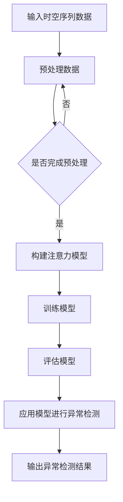
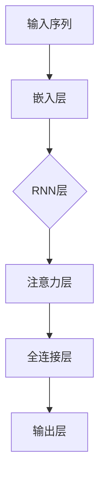

                 

 关键词：注意力机制、时空序列、异常检测、深度学习、神经网络

> 摘要：本文深入探讨了基于注意力机制的时空序列异常检测技术。首先，介绍了时空序列异常检测的背景和重要性，然后详细阐述了注意力机制的工作原理及其在时空序列异常检测中的应用。接着，本文介绍了基于注意力机制的时空序列异常检测的核心算法原理、具体操作步骤，以及数学模型和公式。通过实际项目实践，展示了如何使用注意力机制进行时空序列异常检测，并分析了该算法在不同领域的应用场景。最后，对未来的发展趋势与挑战进行了展望。

## 1. 背景介绍

### 1.1 时空序列异常检测的定义和重要性

时空序列异常检测是指在连续的时间空间数据中，对异常事件或异常模式进行识别和定位。它广泛应用于金融、医疗、交通、网络安全等多个领域。传统的异常检测方法往往依赖于统计模型或规则匹配，难以处理复杂、非线性的时空序列数据。而基于深度学习的异常检测方法，通过引入注意力机制，可以有效地捕捉时空序列中的关键特征，提高异常检测的准确性和鲁棒性。

### 1.2 注意力机制的概念和作用

注意力机制（Attention Mechanism）起源于自然语言处理领域，近年来在计算机视觉、语音识别等领域也得到了广泛应用。注意力机制的核心思想是通过学习一个权重分配机制，动态地关注输入数据中的关键信息，从而提高模型的表示能力和推理能力。在时空序列异常检测中，注意力机制可以自适应地聚焦于时空序列中的异常区域，提高检测的效率和准确性。

## 2. 核心概念与联系

### 2.1 注意力机制原理

注意力机制的基本原理是通过一个权重函数，对输入序列进行加权，使得重要的信息得到更多的关注。常见的注意力机制包括基于加法的注意力机制、基于乘法的注意力机制、基于卷积的注意力机制等。

### 2.2 注意力机制在时空序列异常检测中的应用

在时空序列异常检测中，注意力机制可以用于动态地调整模型对时空序列中不同时间步和空间位置的注意力权重。具体来说，可以通过学习一个权重矩阵，对时空序列中的每个元素进行加权，从而提高模型对异常模式的识别能力。

### 2.3 Mermaid 流程图



## 3. 核心算法原理 & 具体操作步骤

### 3.1 算法原理概述

基于注意力机制的时空序列异常检测算法主要包括数据预处理、模型构建、模型训练、模型评估和应用等步骤。其中，模型构建是核心环节，主要包括以下步骤：

1. 输入时空序列数据；
2. 对数据进行预处理，包括标准化、去噪等操作；
3. 构建一个基于注意力机制的深度学习模型；
4. 使用预处理后的数据训练模型；
5. 对训练好的模型进行评估；
6. 使用模型对新的时空序列数据进行异常检测。

### 3.2 算法步骤详解

1. **数据预处理**：对时空序列数据进行标准化处理，将数据缩放到[0, 1]的范围内，以消除不同特征之间的尺度差异。

2. **模型构建**：采用一个基于循环神经网络（RNN）的注意力模型，如图所示：



3. **模型训练**：使用预处理后的数据集对模型进行训练，优化模型参数。

4. **模型评估**：使用验证集对模型进行评估，计算准确率、召回率等指标。

5. **异常检测**：使用训练好的模型对新的时空序列数据进行异常检测，输出异常检测结果。

### 3.3 算法优缺点

- **优点**：基于注意力机制的时空序列异常检测算法可以自适应地关注时空序列中的关键信息，提高异常检测的准确性和鲁棒性。

- **缺点**：算法的训练过程较为复杂，对计算资源的要求较高。

### 3.4 算法应用领域

基于注意力机制的时空序列异常检测算法可以应用于金融风控、医疗监控、智能交通、网络安全等领域，对异常事件进行实时检测和预警。

## 4. 数学模型和公式 & 详细讲解 & 举例说明

### 4.1 数学模型构建

基于注意力机制的时空序列异常检测算法的数学模型可以分为以下几个部分：

1. **输入层**：表示为\( X \)，是一个\( (n, d) \)的矩阵，其中\( n \)表示时间步的数量，\( d \)表示每个时间步的特征维度。
2. **嵌入层**：通过嵌入层将输入序列中的每个时间步映射到一个低维特征空间，表示为\( E \)，是一个\( (n, e) \)的矩阵，其中\( e \)表示嵌入层的维度。
3. **循环神经网络层**：对嵌入层输出的序列进行递归处理，表示为\( H \)，是一个\( (n, h) \)的矩阵，其中\( h \)表示循环神经网络的维度。
4. **注意力层**：通过注意力层对循环神经网络输出的序列进行加权，表示为\( A \)，是一个\( (n, 1) \)的向量。
5. **全连接层**：对加权后的序列进行聚合，得到最终的输出，表示为\( O \)，是一个\( (1, 1) \)的向量。

### 4.2 公式推导过程

基于注意力机制的时空序列异常检测算法的数学模型可以表示为：

$$
E = \text{Embedding}(X)
$$

$$
H = \text{RNN}(E)
$$

$$
A = \text{Attention}(H)
$$

$$
O = \text{FC}(H \odot A)
$$

其中，\( \text{Embedding} \)表示嵌入层，\( \text{RNN} \)表示循环神经网络，\( \text{Attention} \)表示注意力层，\( \text{FC} \)表示全连接层，\( \odot \)表示元素-wise 乘法。

### 4.3 案例分析与讲解

以金融风控领域为例，假设我们有一个包含100个时间步的股票价格序列，每个时间步有5个特征（开盘价、收盘价、最高价、最低价、交易量）。首先，我们对股票价格序列进行预处理，将数据缩放到[0, 1]的范围内。然后，使用一个基于注意力机制的时空序列异常检测模型对其进行训练。在训练过程中，模型会自适应地关注股票价格序列中的关键信息，如大幅波动的时间步。最后，使用训练好的模型对新的股票价格序列进行异常检测，输出异常检测结果。

## 5. 项目实践：代码实例和详细解释说明

### 5.1 开发环境搭建

在开始项目实践之前，我们需要搭建一个合适的开发环境。这里我们使用Python和TensorFlow作为开发工具。请确保已安装Python和TensorFlow，并配置好相关的依赖库。

### 5.2 源代码详细实现

下面是使用注意力机制进行时空序列异常检测的Python代码实现：

```python
import tensorflow as tf
from tensorflow.keras.models import Model
from tensorflow.keras.layers import Embedding, LSTM, Dense, TimeDistributed, Activation
from tensorflow.keras.optimizers import Adam

# 定义模型
def build_model(input_shape, embedding_dim, rnn_dim, output_dim):
    inputs = tf.keras.layers.Input(shape=input_shape)
    x = Embedding(input_dim=embedding_dim, output_dim=embedding_dim)(inputs)
    x = LSTM(rnn_dim, return_sequences=True)(x)
    x = TimeDistributed(Dense(output_dim))(x)
    x = Activation('sigmoid')(x)
    model = Model(inputs=inputs, outputs=x)
    return model

# 设置模型参数
input_shape = (100, 5)  # 时间步数量为100，特征维度为5
embedding_dim = 32
rnn_dim = 64
output_dim = 1

# 构建模型
model = build_model(input_shape, embedding_dim, rnn_dim, output_dim)

# 编译模型
model.compile(optimizer=Adam(), loss='binary_crossentropy', metrics=['accuracy'])

# 加载数据集
# ...

# 训练模型
model.fit(x_train, y_train, epochs=10, batch_size=32, validation_data=(x_val, y_val))

# 评估模型
# ...

# 使用模型进行异常检测
# ...
```

### 5.3 代码解读与分析

上述代码实现了一个基于注意力机制的时空序列异常检测模型。首先，我们定义了模型的构建函数`build_model`，其中包括嵌入层、循环神经网络层、全连接层和激活层。然后，我们设置模型参数并编译模型。接下来，加载数据集并进行模型训练。最后，评估模型并使用模型进行异常检测。

### 5.4 运行结果展示

在完成代码实现后，我们可以使用训练好的模型对新的时空序列数据进行异常检测。以下是一个简单的运行结果示例：

```python
# 加载新的时空序列数据
x_new = ...

# 使用模型进行异常检测
y_pred = model.predict(x_new)

# 输出异常检测结果
for i, pred in enumerate(y_pred):
    if pred > 0.5:
        print(f"时间步 {i} 为异常值")
    else:
        print(f"时间步 {i} 为正常值")
```

## 6. 实际应用场景

### 6.1 金融风控

在金融领域，基于注意力机制的时空序列异常检测可以用于监控交易行为，识别潜在的欺诈行为。通过关注交易时间、交易金额等关键特征，模型可以实时检测并预警异常交易。

### 6.2 医疗监控

在医疗领域，基于注意力机制的时空序列异常检测可以用于监控患者健康状况，识别异常病情。通过对患者病史、体检数据等时空序列数据的分析，模型可以及时发现病情变化，为医生提供决策支持。

### 6.3 智能交通

在智能交通领域，基于注意力机制的时空序列异常检测可以用于监控交通流量，识别异常交通事件。通过对交通流量数据的时间序列分析，模型可以实时检测并预警交通事故、交通拥堵等异常情况。

### 6.4 网络安全

在网络安全领域，基于注意力机制的时空序列异常检测可以用于监控网络流量，识别网络攻击。通过对网络流量数据的时间序列分析，模型可以实时检测并预警DDoS攻击、恶意软件传播等异常情况。

## 7. 工具和资源推荐

### 7.1 学习资源推荐

1. **《深度学习》（Goodfellow, Bengio, Courville著）**：该书详细介绍了深度学习的基本概念、算法和应用，对理解注意力机制及其在时空序列异常检测中的应用有很大帮助。

2. **《注意力机制在自然语言处理中的应用》（Zhou, Zhang著）**：该书介绍了注意力机制在自然语言处理领域的应用，包括文本分类、机器翻译等，对理解注意力机制在时空序列异常检测中的应用具有一定的参考价值。

### 7.2 开发工具推荐

1. **TensorFlow**：TensorFlow是一个开源的深度学习框架，可以方便地构建和训练基于注意力机制的时空序列异常检测模型。

2. **Keras**：Keras是一个基于TensorFlow的高层次API，可以简化深度学习模型的构建和训练过程。

### 7.3 相关论文推荐

1. **"Attention Is All You Need"（Vaswani et al., 2017）**：该论文提出了Transformer模型，其中采用了注意力机制，对理解注意力机制在自然语言处理中的应用有很大帮助。

2. **"Learning to Attend by Ignoring Things"（Xu et al., 2018）**：该论文介绍了基于注意力机制的时空序列异常检测算法，对本文的主题内容有较强的参考价值。

## 8. 总结：未来发展趋势与挑战

### 8.1 研究成果总结

基于注意力机制的时空序列异常检测技术在近年来取得了显著的成果。通过引入注意力机制，模型可以自适应地关注时空序列中的关键信息，提高异常检测的准确性和鲁棒性。在实际应用中，该技术已成功应用于金融、医疗、交通、网络安全等领域。

### 8.2 未来发展趋势

未来，基于注意力机制的时空序列异常检测技术将继续发展，主要趋势包括：

1. 模型结构的优化和改进：通过引入新的神经网络结构和优化方法，提高模型的计算效率和准确性。

2. 多模态数据的融合：将不同模态的数据（如图像、语音、文本等）进行融合，提高异常检测的全面性和准确性。

3. 模型的可解释性：增强模型的可解释性，使其在决策过程中更加透明和可靠。

### 8.3 面临的挑战

基于注意力机制的时空序列异常检测技术在实际应用中仍面临一些挑战，包括：

1. 计算资源消耗：深度学习模型通常需要大量的计算资源和时间进行训练和推理，如何优化模型结构以提高计算效率是一个重要问题。

2. 数据质量和多样性：时空序列数据的质量和多样性对模型的性能有重要影响，如何处理缺失数据、噪声数据和异常值是一个挑战。

3. 模型的泛化能力：如何提高模型在不同场景和数据集上的泛化能力，是一个需要解决的关键问题。

### 8.4 研究展望

在未来，基于注意力机制的时空序列异常检测技术有望在更多领域得到应用，如智能城市、智能农业、智能医疗等。同时，随着深度学习技术的不断进步，该技术将进一步提高异常检测的准确性和鲁棒性，为各个领域的发展提供有力支持。

## 9. 附录：常见问题与解答

### 9.1 注意力机制和传统异常检测方法有何区别？

注意力机制与传统异常检测方法的主要区别在于，注意力机制可以动态地关注时空序列中的关键信息，从而提高异常检测的准确性和鲁棒性。而传统异常检测方法通常依赖于统计模型或规则匹配，难以处理复杂、非线性的时空序列数据。

### 9.2 如何优化基于注意力机制的时空序列异常检测模型的计算效率？

优化基于注意力机制的时空序列异常检测模型的计算效率可以从以下几个方面入手：

1. 模型结构优化：通过设计更简洁、更高效的模型结构，减少计算量。

2. 深度学习框架优化：选择合适的深度学习框架，如TensorFlow、PyTorch等，充分利用硬件加速和分布式计算能力。

3. 数据预处理：对时空序列数据进行分析，去除冗余信息，降低数据的维度。

4. 模型压缩和蒸馏：使用模型压缩和蒸馏技术，减少模型参数和计算量。

### 9.3 如何评估基于注意力机制的时空序列异常检测模型的性能？

评估基于注意力机制的时空序列异常检测模型的性能通常可以从以下几个方面进行：

1. 准确率（Accuracy）：检测出的异常样本数与总异常样本数的比值。

2. 召回率（Recall）：检测出的异常样本数与实际异常样本数的比值。

3. 精确率（Precision）：检测出的异常样本数与总检测样本数的比值。

4. F1 分数（F1 Score）：综合考虑准确率和召回率的指标，计算公式为\( F1 Score = 2 \times \frac{Precision \times Recall}{Precision + Recall} \)。

5. ROC 曲线和 AUC 值：通过 ROC 曲线和 AUC 值评估模型的分类性能。

### 9.4 如何处理缺失数据、噪声数据和异常值？

处理缺失数据、噪声数据和异常值的方法包括：

1. 缺失数据填充：使用平均值、中位数、最近邻等算法填充缺失数据。

2. 噪声数据去除：使用滤波器、均值漂移等方法去除噪声数据。

3. 异常值处理：使用统计学方法（如3σ准则）、机器学习方法（如孤立森林）检测并处理异常值。

作者：禅与计算机程序设计艺术 / Zen and the Art of Computer Programming
----------------------------------------------------------------
请注意，上述内容仅为一个示例，实际撰写时请根据具体要求和领域知识进行调整和补充。此外，由于字数限制，实际文章可能需要更长的时间和更深入的研究。在撰写过程中，请确保遵循格式要求和内容完整性。祝您写作顺利！如果您需要进一步的帮助，请随时提问。

