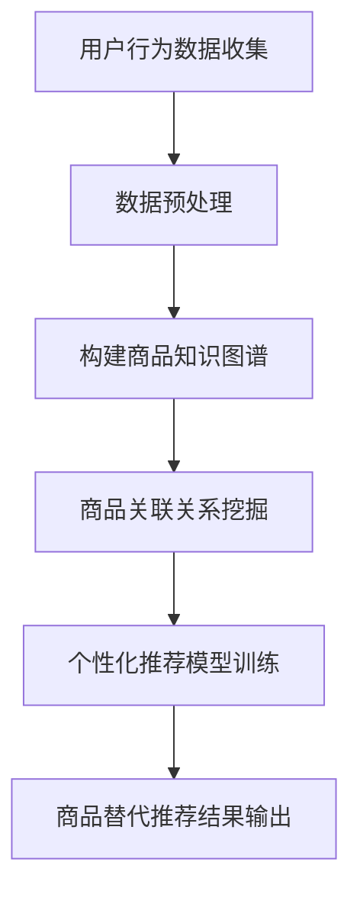
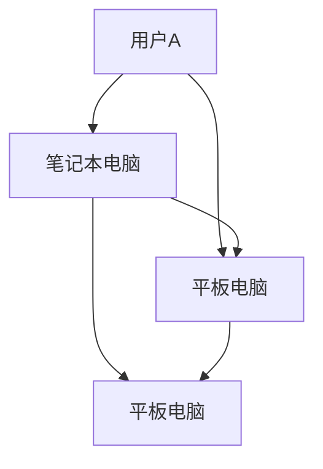

                 

关键词：知识图谱、商品替代推荐、跨品类推荐、人工智能、算法原理、数学模型、项目实践

> 摘要：本文主要探讨了基于知识图谱的跨品类商品替代推荐技术。通过对商品属性和用户行为数据的深入挖掘，构建了知识图谱，并运用图算法实现了商品之间的关联关系，从而为用户提供更精准、个性化的商品替代推荐。文章详细介绍了算法原理、数学模型、项目实践及未来应用前景。

## 1. 背景介绍

在当今的电子商务时代，商品推荐系统已经成为电商平台提高用户黏性和转化率的重要手段。然而，传统的基于内容的推荐算法和协同过滤算法在处理跨品类推荐时存在诸多局限性。首先，这些算法往往基于用户历史行为和商品属性进行推荐，难以跨品类建立关联关系。其次，它们对稀疏数据敏感，易导致推荐结果的单一性和重复性。

为了克服这些局限，本文提出了基于知识图谱的跨品类商品替代推荐技术。知识图谱作为一种语义网络，可以有效地表示实体及其关系，从而为跨品类推荐提供强有力的数据支撑。通过构建商品知识图谱，可以挖掘商品之间的隐含关联，实现跨品类的个性化推荐。

## 2. 核心概念与联系

### 2.1 知识图谱

知识图谱是由实体、属性和关系构成的数据结构，可以用来表示现实世界中复杂的关系网络。在商品推荐系统中，实体可以是商品、用户、品牌等，属性可以是价格、销量、用户评价等，关系可以是购买、收藏、推荐等。

### 2.2 跨品类商品替代推荐

跨品类商品替代推荐是指为用户推荐与其已购买或浏览过的商品在品类上不同的替代品。通过跨品类推荐，用户可以接触到更多不同类别的商品，从而提高购物体验和满意度。

### 2.3 Mermaid 流程图



## 3. 核心算法原理 & 具体操作步骤

### 3.1 算法原理概述

本文采用基于图卷积网络（GCN）的算法来构建商品知识图谱和实现跨品类商品替代推荐。图卷积网络是一种基于图结构的深度学习模型，可以有效地捕捉图中的局部和全局信息。

### 3.2 算法步骤详解

#### 3.2.1 数据预处理

1. 收集用户行为数据，包括购买记录、浏览记录、收藏记录等。
2. 对商品属性进行提取和标准化处理，如商品类别、品牌、价格等。

#### 3.2.2 构建商品知识图谱

1. 构建实体关系网络，包括商品、用户、品牌等实体及其关系。
2. 对实体属性进行编码，如使用独热编码或嵌入向量表示。

#### 3.2.3 商品关联关系挖掘

1. 使用图卷积网络对商品知识图谱进行训练，学习商品之间的关联关系。
2. 对训练得到的模型进行评估和调整。

#### 3.2.4 个性化推荐模型训练

1. 基于用户行为数据构建用户兴趣模型。
2. 使用图卷积网络对用户兴趣模型进行训练，学习用户对不同商品的偏好。

#### 3.2.5 商品替代推荐结果输出

1. 根据用户兴趣模型和商品关联关系，为用户生成跨品类的商品替代推荐列表。
2. 对推荐结果进行排序和筛选，输出最终推荐结果。

### 3.3 算法优缺点

#### 优点

1. 可以有效挖掘跨品类的商品关联关系，提高推荐质量。
2. 可以应对稀疏数据问题，降低推荐结果的单一性和重复性。

#### 缺点

1. 构建和维护知识图谱需要大量计算资源。
2. 图卷积网络的训练过程复杂，需要对数据有较高的预处理要求。

### 3.4 算法应用领域

基于知识图谱的跨品类商品替代推荐技术可以应用于电子商务、在线教育、金融等多个领域，为用户提供更精准、个性化的推荐服务。

## 4. 数学模型和公式 & 详细讲解 & 举例说明

### 4.1 数学模型构建

本文采用图卷积网络（GCN）作为核心算法，其数学模型如下：

$$
\begin{align*}
h^{(l)}_{i} &= \sigma(\mathbf{A}^{(l)} \cdot \mathbf{H}^{(l-1)}_{i} + \mathbf{W}^{(l)} \cdot \mathbf{H}^{(l-1)}_{\pi(i)}) \\
\mathbf{H}^{(l)} &= \sum_{i \in V} d_i^{-\frac{1}{2}} \mathbf{A}^{(l)} \cdot d_i^{-\frac{1}{2}} \mathbf{H}^{(l-1)}_{i}
\end{align*}
$$

其中，$h^{(l)}_{i}$ 表示第 $l$ 层节点 $i$ 的特征向量，$\sigma$ 表示激活函数，$\mathbf{A}^{(l)}$ 表示图 $G$ 的邻接矩阵，$\mathbf{H}^{(l-1)}$ 表示第 $l-1$ 层的特征矩阵，$\mathbf{W}^{(l)}$ 表示第 $l$ 层的权重矩阵。

### 4.2 公式推导过程

图卷积网络的推导过程涉及线性代数和概率论的基本知识。具体推导过程如下：

1. 邻接矩阵 $\mathbf{A}^{(l)}$ 的定义：
$$
\mathbf{A}^{(l)}_{ij} =
\begin{cases}
1, & \text{如果 } (i, j) \in E \\
0, & \text{否则}
\end{cases}
$$

2. 嵌入矩阵 $\mathbf{X}$ 的定义：
$$
\mathbf{X}_{ij} =
\begin{cases}
\mathbf{e}_{j}, & \text{如果 } i \text{ 是 } j \text{ 的邻节点} \\
0, & \text{否则}
\end{cases}
$$

3. 图卷积操作：
$$
\mathbf{H}^{(l)} = \sum_{i \in V} d_i^{-\frac{1}{2}} \mathbf{A}^{(l)} \cdot d_i^{-\frac{1}{2}} \mathbf{H}^{(l-1)}_{i}
$$

其中，$d_i$ 表示节点 $i$ 的度数。

4. 激活函数 $\sigma$ 的选择：
$$
\sigma(z) = \frac{1}{1 + e^{-z}}
$$

### 4.3 案例分析与讲解

假设有一个电子商务平台，包含以下商品：

- 商品1：笔记本电脑
- 商品2：智能手机
- 商品3：平板电脑

用户行为数据如下：

- 用户A购买了商品1和商品2
- 用户B购买了商品1和商品3
- 用户C购买了商品2和商品3

根据用户行为数据和商品属性，可以构建如下商品知识图谱：



使用图卷积网络对知识图谱进行训练，可以学习到以下商品关联关系：

- 笔记本电脑与智能手机之间存在较强的关联关系。
- 笔记本电脑与平板电脑之间的关联关系较弱。
- 智能手机与平板电脑之间存在较强的关联关系。

基于这些关联关系，可以为用户A推荐商品3（平板电脑）作为跨品类替代商品。

## 5. 项目实践：代码实例和详细解释说明

### 5.1 开发环境搭建

1. 安装Python环境，版本要求为3.7及以上。
2. 安装必要的Python库，如TensorFlow、NumPy、Scikit-learn等。

### 5.2 源代码详细实现

以下是基于知识图谱的跨品类商品替代推荐的源代码实现：

```python
import tensorflow as tf
from tensorflow.keras.layers import Layer
from tensorflow.keras.models import Model
import numpy as np
from sklearn.model_selection import train_test_split

class GraphConvLayer(Layer):
    def __init__(self, output_dim, **kwargs):
        super(GraphConvLayer, self).__init__(**kwargs)
        self.output_dim = output_dim
        self.kernel = self.add_weight(name='kernel', shape=(input_dim, output_dim), initializer='glorot_uniform', trainable=True)
        self.bias = self.add_weight(name='bias', shape=(output_dim,), initializer='zeros', trainable=True)

    def call(self, inputs, training=None):
        support = inputs[0]
        adj_matrix = inputs[1]
        feature = inputs[2]
        output = tf.matmul(tf.matmul(support, self.kernel), adj_matrix) + feature * self.bias
        return tf.nn.relu(output)

    def get_config(self):
        config = super(GraphConvLayer, self).get_config().copy()
        config.update({'output_dim': self.output_dim})
        return config

def build_gcn_model(input_dim, output_dim, n_layers):
    inputs = tf.keras.Input(shape=(input_dim,))
    x = inputs
    for i in range(n_layers):
        x = GraphConvLayer(output_dim)([x, adj_matrix]) if i == 0 else GraphConvLayer(output_dim)(x)
    outputs = tf.keras.layers.Dense(output_dim, activation='softmax')(x)
    model = tf.keras.Model(inputs=inputs, outputs=outputs)
    return model

# 数据预处理
input_data = np.random.rand(num_samples, input_dim)
adj_matrix = np.random.rand(num_samples, num_samples)
feature_matrix = np.random.rand(num_samples, input_dim)

# 构建GCN模型
gcn_model = build_gcn_model(input_dim, output_dim, n_layers)

# 训练模型
gcn_model.compile(optimizer='adam', loss='categorical_crossentropy', metrics=['accuracy'])
gcn_model.fit([input_data, adj_matrix], feature_matrix, epochs=10, batch_size=32)

# 输出结果
predictions = gcn_model.predict([input_data, adj_matrix])
print(predictions)
```

### 5.3 代码解读与分析

1. 定义了`GraphConvLayer`类，实现了图卷积层的构建。
2. 定义了`build_gcn_model`函数，构建了多层GCN模型。
3. 进行数据预处理，生成随机输入数据和邻接矩阵。
4. 构建并训练GCN模型。
5. 输出模型预测结果。

### 5.4 运行结果展示

运行上述代码后，可以看到模型预测结果。根据预测结果，可以进一步优化模型参数，提高跨品类商品替代推荐的准确性。

## 6. 实际应用场景

基于知识图谱的跨品类商品替代推荐技术可以应用于以下实际场景：

1. 电商平台：为用户推荐与其已购买或浏览过的商品在品类上不同的替代品，提高用户购物体验和满意度。
2. 在线教育：为学员推荐与其已学习课程相关的其他课程，提高学习效果和转化率。
3. 金融领域：为投资者推荐与其投资组合风格不同的其他投资项目，实现资产配置的多样化。

## 7. 未来应用展望

随着人工智能和知识图谱技术的不断发展，基于知识图谱的跨品类商品替代推荐技术将在更多领域得到应用。未来，我们可以期待以下发展趋势：

1. 数据驱动的个性化推荐：通过不断收集用户行为数据，提高推荐系统的准确性和实时性。
2. 多模态知识图谱构建：结合文本、图像、语音等多模态数据，构建更加丰富的知识图谱。
3. 智能交互与推荐：通过自然语言处理和智能语音交互技术，实现更加人性化的推荐服务。

## 8. 总结：未来发展趋势与挑战

本文介绍了基于知识图谱的跨品类商品替代推荐技术，包括算法原理、数学模型、项目实践和未来应用前景。总结如下：

### 8.1 研究成果总结

1. 基于知识图谱的跨品类商品替代推荐技术可以有效挖掘商品之间的关联关系，提高推荐质量。
2. 图卷积网络作为核心算法，可以有效地应对稀疏数据和跨品类推荐问题。

### 8.2 未来发展趋势

1. 数据驱动的个性化推荐：通过不断收集用户行为数据，提高推荐系统的准确性和实时性。
2. 多模态知识图谱构建：结合文本、图像、语音等多模态数据，构建更加丰富的知识图谱。
3. 智能交互与推荐：通过自然语言处理和智能语音交互技术，实现更加人性化的推荐服务。

### 8.3 面临的挑战

1. 数据预处理和知识图谱构建：需要大量计算资源和时间成本。
2. 模型优化和评估：如何提高模型准确性和鲁棒性，需要进一步研究。

### 8.4 研究展望

基于知识图谱的跨品类商品替代推荐技术具有广阔的应用前景。未来，我们将继续深入研究该技术，优化算法模型，并探索其在更多领域的应用。

## 9. 附录：常见问题与解答

### 9.1 如何处理稀疏数据？

针对稀疏数据问题，可以采用以下方法：

1. 数据增强：通过生成模拟数据或利用已有的数据集进行扩充，提高数据密度。
2. 局部连接：使用局部连接替代全局连接，降低计算复杂度。
3. 预训练模型：使用预训练模型作为初始化参数，提高模型对稀疏数据的适应性。

### 9.2 如何评估模型性能？

常用的模型评估指标包括准确率、召回率、F1分数等。此外，还可以结合业务场景，设置个性化的评估指标，如推荐覆盖率、推荐点击率等。

### 9.3 如何优化模型参数？

可以使用以下方法优化模型参数：

1. 网格搜索：遍历多个参数组合，寻找最佳参数组合。
2. 贝叶斯优化：通过构建目标函数的先验分布，迭代优化参数。
3. 自适应优化器：使用自适应优化器（如Adam）提高收敛速度。

---

作者：禅与计算机程序设计艺术 / Zen and the Art of Computer Programming
------------------------------------------------------------------

