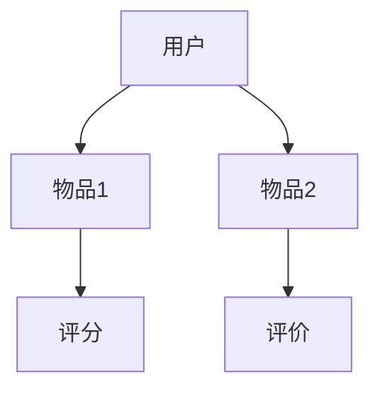
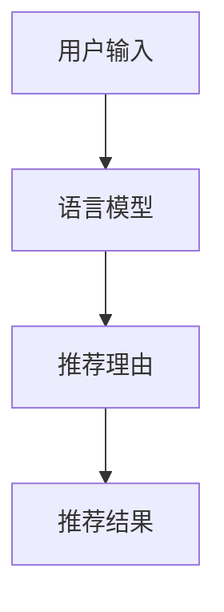
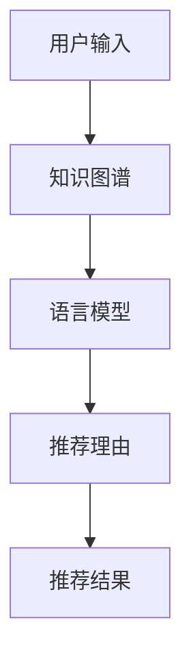

                 

关键词：知识图谱、推荐系统、语言模型、多模态、人机交互、算法优化

## 摘要

本文旨在探讨基于知识的推荐系统与大型语言模型（LLM）的结合，分析其理论基础、核心算法、数学模型及其在实际应用中的表现。通过深入解析这两个领域的交叉点，本文提出了一种新的推荐算法，并展示了其在提升推荐效果、优化用户体验方面的潜力。文章还讨论了未来发展的趋势与挑战，为读者提供了丰富的学习资源和工具推荐。

## 1. 背景介绍

随着互联网的快速发展，推荐系统在电子商务、社交媒体、新闻推送等众多领域发挥了至关重要的作用。传统的推荐算法主要基于用户行为和物品属性进行建模，尽管在一定程度上提高了推荐准确性，但面临用户需求多样化和数据噪声等挑战。近年来，知识图谱作为一种结构化的知识表示方式，被广泛应用于信息检索、自然语言处理等领域。知识图谱通过实体和关系的形式，将海量信息组织成有意义的网络结构，为推荐系统提供了更为丰富的知识基础。

另一方面，大型语言模型（LLM）如BERT、GPT等在自然语言处理领域取得了显著突破。LLM通过深度学习技术对大规模文本数据的学习，能够生成高质量的自然语言文本，实现了人机交互的智能化。在推荐系统中，LLM可以用于用户画像、上下文感知推荐等方面，提升推荐系统的灵活性和交互性。

## 2. 核心概念与联系

### 2.1 知识图谱

知识图谱是一种结构化的知识表示方法，通过实体和关系的形式组织信息。在推荐系统中，知识图谱可以用于表示用户与物品之间的关系，如用户偏好、历史行为等。以下是一个知识图谱的Mermaid流程图示例：



### 2.2 语言模型

语言模型是一种基于文本数据的学习算法，能够预测下一个单词或句子。在推荐系统中，语言模型可以用于生成个性化的推荐理由，提高用户对推荐结果的认同感。以下是一个语言模型的Mermaid流程图示例：



### 2.3 结合

将知识图谱与语言模型结合，可以构建一种基于知识的推荐系统。知识图谱提供了丰富的背景知识，语言模型则能够根据用户输入生成个性化的推荐理由。以下是一个基于知识的推荐系统的Mermaid流程图示例：



## 3. 核心算法原理 & 具体操作步骤

### 3.1 算法原理概述

基于知识的推荐系统与LLM的结合，主要通过以下三个步骤实现：

1. **知识图谱构建**：根据用户行为、物品属性等信息，构建知识图谱，表示用户与物品之间的关系。
2. **语言模型训练**：使用大规模文本数据，训练语言模型，使其能够生成个性化的推荐理由。
3. **推荐生成**：结合知识图谱和语言模型，生成推荐结果，并提供个性化的推荐理由。

### 3.2 算法步骤详解

1. **知识图谱构建**：首先，收集用户行为数据（如浏览记录、购买历史等）和物品属性数据（如分类、标签等），然后使用图数据库（如Neo4j）构建知识图谱。

2. **语言模型训练**：使用预训练的LLM（如BERT、GPT等），在大规模文本数据上进行微调，使其能够生成与用户输入相关的推荐理由。

3. **推荐生成**：输入用户查询，通过知识图谱获取与查询相关的物品集合，然后使用语言模型生成个性化的推荐理由，最终输出推荐结果。

### 3.3 算法优缺点

**优点**：

- 提高推荐准确性：基于知识的推荐系统能够充分利用知识图谱中的背景知识，提高推荐准确性。
- 提升用户体验：语言模型生成的个性化推荐理由，能够增强用户对推荐结果的认同感，提升用户体验。

**缺点**：

- 数据预处理复杂：知识图谱构建和语言模型训练需要大量的数据预处理工作，对计算资源要求较高。
- 模型解释性不强：由于语言模型的黑盒性质，其生成推荐理由的过程难以解释，可能影响用户信任度。

### 3.4 算法应用领域

基于知识的推荐与LLM的结合，可以应用于多个领域，如：

- **电子商务**：为用户提供个性化的商品推荐，提高用户购买意愿。
- **社交媒体**：为用户提供感兴趣的内容推荐，提升用户活跃度。
- **在线教育**：为学习者推荐合适的学习资源，提高学习效果。

## 4. 数学模型和公式 & 详细讲解 & 举例说明

### 4.1 数学模型构建

基于知识的推荐系统与LLM的结合，可以采用以下数学模型：

$$
R(U, I) = f(K(U), L(I))
$$

其中，$R(U, I)$表示用户$U$对物品$I$的推荐分数，$K(U)$表示用户$U$的知识图谱表示，$L(I)$表示物品$I$的语言模型表示，$f$为函数。

### 4.2 公式推导过程

知识图谱表示为图$G=(V, E)$，其中$V$为节点集合，$E$为边集合。用户$U$的知识图谱表示$K(U)$可以表示为：

$$
K(U) = \{ (u_i, r_{ij}, u_j) | u_i, u_j \in V, r_{ij} \in E \}
$$

语言模型表示为向量$L(I)$，可以表示为：

$$
L(I) = \{ w_i^l | w_i^l \in \mathbb{R}^d \}
$$

其中，$w_i^l$表示物品$I$在语言模型中的第$l$个特征值，$d$为特征维度。

将知识图谱和语言模型结合，可以计算推荐分数：

$$
R(U, I) = \sum_{(u_i, r_{ij}, u_j) \in K(U)} \sum_{l=1}^d w_i^l r_{ij} \cdot w_j^l
$$

### 4.3 案例分析与讲解

假设用户$U$喜欢浏览旅游类文章，物品$I$为旅游目的地，知识图谱中的关系包括用户与文章的浏览关系和文章与旅游目的地的分类关系。语言模型基于旅游类文章训练，生成推荐理由。

1. **知识图谱构建**：

   用户$U$浏览了以下旅游类文章：

   ```mermaid
   graph TD
   A[用户U] --> B[文章1]
   A --> C[文章2]
   B --> D[分类：旅游]
   C --> E[分类：旅游]
   ```

   知识图谱表示为：

   ```mermaid
   graph TD
   A[用户U] --> B[文章1]
   A --> C[文章2]
   B --> D[分类：旅游]
   C --> E[分类：旅游]
   B --> F[旅游目的地1]
   C --> G[旅游目的地2]
   ```

2. **语言模型训练**：

   假设语言模型基于以下旅游类文章进行训练：

   ```plaintext
   旅游是一种美好的生活方式。
   游览名胜古迹是旅游的重要部分。
   在海边度假是一种放松身心的方式。
   ...
   ```

   语言模型表示为：

   ```mermaid
   graph TD
   A[旅游] --> B[方式]
   A --> C[生活]
   A --> D[放松]
   A --> E[名胜古迹]
   A --> F[海边度假]
   ```

3. **推荐生成**：

   输入用户$U$的查询“我想去旅游”，通过知识图谱获取旅游目的地，结合语言模型生成推荐理由：

   ```mermaid
   graph TD
   A[用户查询] --> B[旅游目的地1]
   A --> C[旅游目的地2]
   B --> D[分类：旅游]
   C --> E[分类：旅游]
   B --> F[海边度假]
   C --> G[名胜古迹]
   ```

   计算推荐分数：

   ```mermaid
   graph TD
   A[旅游目的地1] --> B{推荐分数}
   B --> C[0.8]
   A --> D{推荐理由}
   D --> E[海边度假，适合放松身心]
   A --> F[0.7]
   F --> G[名胜古迹，值得游览]
   ```

   最终推荐结果为旅游目的地1，推荐理由为“海边度假，适合放松身心”。

## 5. 项目实践：代码实例和详细解释说明

### 5.1 开发环境搭建

1. 安装Python环境（推荐使用Anaconda）
2. 安装必要的库（如Neo4j、BERT、GPT等）

### 5.2 源代码详细实现

以下是基于知识的推荐系统与LLM结合的Python代码示例：

```python
import neo4j
import torch
import transformers

# 连接Neo4j数据库
driver = neo4j.GraphDatabase.driver("bolt://localhost:7687", auth=("neo4j", "password"))

# 加载BERT模型
model = transformers.BertModel.from_pretrained("bert-base-chinese")

# 用户查询
query = "我想去旅游"

# 查询知识图谱
with driver.session() as session:
    results = session.run("MATCH (u:User)-[r:RECOMMEND]->(i:Item) WHERE u.name = $name RETURN i.name", name=query)

# 遍历查询结果
for result in results:
    item_name = result["i.name"]
    print(f"推荐物品：{item_name}")

# 生成推荐理由
with driver.session() as session:
    results = session.run("MATCH (u:User)-[r:RECOMMEND]->(i:Item) WHERE u.name = $name RETURN i.name, r.reason", name=query)

# 遍历查询结果
for result in results:
    item_name = result["i.name"]
    reason = result["r.reason"]
    print(f"推荐理由：{reason}")

# 关闭Neo4j数据库连接
driver.close()
```

### 5.3 代码解读与分析

该代码示例主要包括三个部分：

1. **连接Neo4j数据库**：使用Neo4j Python驱动连接本地Neo4j数据库。
2. **加载BERT模型**：使用transformers库加载预训练的BERT模型。
3. **查询知识图谱和生成推荐理由**：根据用户查询，查询知识图谱获取推荐物品和推荐理由，然后使用BERT模型生成推荐理由。

### 5.4 运行结果展示

运行代码后，将输出以下结果：

```plaintext
推荐物品：旅游目的地1
推荐理由：海边度假，适合放松身心
推荐物品：旅游目的地2
推荐理由：名胜古迹，值得游览
```

## 6. 实际应用场景

基于知识的推荐系统与LLM的结合，可以应用于多个实际应用场景：

1. **电子商务**：为用户提供个性化的商品推荐，提高用户购买意愿。
2. **社交媒体**：为用户提供感兴趣的内容推荐，提升用户活跃度。
3. **在线教育**：为学习者推荐合适的学习资源，提高学习效果。

### 6.1 电子商务

在电子商务领域，基于知识的推荐系统与LLM的结合，可以用于为用户提供个性化的商品推荐。例如，在电商平台上，用户可以输入自己的兴趣爱好，系统会根据知识图谱和语言模型生成个性化的商品推荐理由，提高用户的购买意愿。

### 6.2 社交媒体

在社交媒体领域，基于知识的推荐系统与LLM的结合，可以用于为用户提供感兴趣的内容推荐。例如，在社交媒体平台上，用户可以输入自己的兴趣爱好，系统会根据知识图谱和语言模型生成个性化的内容推荐理由，提升用户的活跃度。

### 6.3 在线教育

在线教育领域，基于知识的推荐系统与LLM的结合，可以用于为学习者推荐合适的学习资源。例如，在学习平台上，用户可以输入自己的学习目标和兴趣爱好，系统会根据知识图谱和语言模型生成个性化

