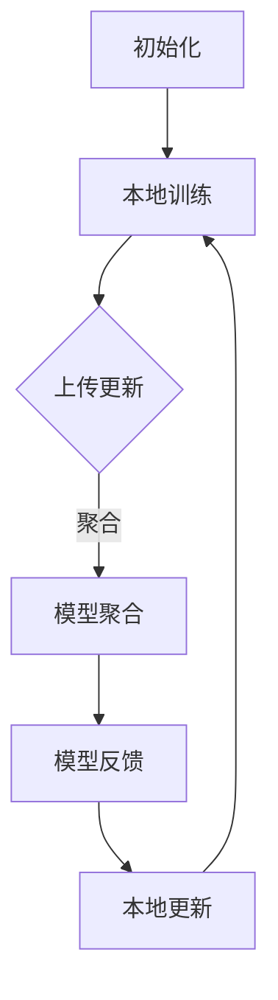

                 

关键词：联邦学习、隐私保护、推荐系统、安全协作、协同过滤、数据加密、差分隐私

## 摘要

本文深入探讨了基于联邦学习的隐私保护推荐框架，旨在解决传统推荐系统在数据处理过程中面临的隐私泄露问题。联邦学习通过分布式学习的方式，允许各参与方在不共享数据的情况下共同训练模型，从而保护数据隐私。本文将详细介绍联邦学习的基本原理、核心算法、数学模型及其在推荐系统中的应用，并通过实际案例进行分析和解释，为未来的研究提供参考。

## 1. 背景介绍

### 1.1 推荐系统的发展

推荐系统作为信息过滤和个性化推荐的核心技术，广泛应用于电子商务、社交媒体、在线媒体等领域。传统的推荐系统主要依赖于协同过滤算法，通过分析用户的历史行为和偏好来预测用户对未知项的兴趣。然而，随着用户隐私意识的提高和数据保护法规的严格，如何在保护用户隐私的同时提供个性化的推荐服务成为了一项挑战。

### 1.2 隐私泄露问题

传统的推荐系统通常需要收集并存储大量用户数据，包括用户的浏览记录、购买历史等敏感信息。这些数据一旦泄露，可能会导致用户隐私的严重侵犯。同时，中心化的数据处理模式也使得单个服务器成为攻击者的主要目标，增加了系统安全风险。

### 1.3 联邦学习的出现

联邦学习（Federated Learning）作为一种分布式学习方法，通过允许各方在不共享数据的情况下协同训练机器学习模型，有效地解决了数据隐私和安全问题。联邦学习的基本思想是将模型的训练任务分散到多个参与方，每个参与方仅与中心服务器交换模型更新参数，而不需要共享原始数据。

## 2. 核心概念与联系

### 2.1 联邦学习原理

联邦学习主要涉及以下几个核心概念：

- **中心服务器**：负责协调各参与方的训练过程，收集和聚合模型更新。
- **参与方**：可以是用户设备、企业服务器等，负责本地模型训练和参数更新。
- **本地模型**：在参与方本地训练的模型，用于处理本地数据。
- **全局模型**：由中心服务器聚合所有参与方本地模型更新后的全局模型。

### 2.2 联邦学习架构

联邦学习架构通常包括以下几个步骤：

1. **初始化**：各参与方初始化本地模型，并上传初始模型参数到中心服务器。
2. **本地训练**：参与方使用本地数据对模型进行训练，更新模型参数。
3. **模型更新**：各参与方将本地模型更新参数上传到中心服务器。
4. **模型聚合**：中心服务器接收并聚合所有参与方的模型更新，生成全局模型。
5. **模型反馈**：中心服务器将全局模型更新反馈给各参与方，用于下一次迭代。

### 2.3 Mermaid 流程图

以下是一个简化的联邦学习流程图：



## 3. 核心算法原理 & 具体操作步骤

### 3.1 算法原理概述

联邦学习的基本原理是通过分布式方式协同训练机器学习模型，使得每个参与方都可以在不共享数据的情况下贡献自己的模型更新。这种机制不仅保护了用户隐私，还提高了系统的安全性。

### 3.2 算法步骤详解

1. **初始化**：每个参与方初始化一个本地模型，并上传初始模型参数到中心服务器。
2. **本地训练**：参与方使用本地数据对模型进行训练，更新模型参数。
3. **模型更新**：参与方将本地模型更新参数上传到中心服务器。
4. **模型聚合**：中心服务器接收并聚合所有参与方的模型更新，生成全局模型。
5. **模型反馈**：中心服务器将全局模型更新反馈给各参与方，用于下一次迭代。
6. **本地更新**：各参与方根据全局模型更新，再次更新本地模型。

### 3.3 算法优缺点

**优点**：
- 保护数据隐私：联邦学习允许参与方在不共享数据的情况下贡献模型更新，从而保护用户隐私。
- 提高系统安全性：分布式训练降低了中心化系统的攻击面，提高了系统的安全性。
- 扩展性：联邦学习可以轻松扩展到大量参与方，适用于大规模分布式环境。

**缺点**：
- 计算通信开销：联邦学习涉及到大量数据传输和模型更新，可能导致较高的计算和通信开销。
- 模型质量：分布式训练可能导致模型质量下降，需要平衡模型准确性和计算通信开销。

### 3.4 算法应用领域

联邦学习广泛应用于推荐系统、自然语言处理、图像识别等领域。例如，在推荐系统中，联邦学习可以用于个性化推荐，而不需要共享用户数据。

## 4. 数学模型和公式

### 4.1 数学模型构建

联邦学习中的数学模型主要涉及模型更新和聚合过程。以下是一个简化的数学模型：

$$
\theta^{t+1} = \theta^{t} + \alpha \cdot \Delta\theta^{t}
$$

其中，$\theta^{t}$表示第$t$次迭代的本地模型参数，$\theta^{t+1}$表示更新后的本地模型参数，$\alpha$表示学习率，$\Delta\theta^{t}$表示本地模型更新。

### 4.2 公式推导过程

联邦学习的模型聚合过程可以看作是一种加权平均。假设有$n$个参与方，每个参与方的本地模型更新为$\Delta\theta^{t}_{i}$，则全局模型更新为：

$$
\Delta\theta^{t+1} = \frac{1}{n} \sum_{i=1}^{n} \Delta\theta^{t}_{i}
$$

### 4.3 案例分析与讲解

假设有两个参与方，其本地模型更新分别为$\Delta\theta^{t}_{1} = [0.1, 0.2]$和$\Delta\theta^{t}_{2} = [0.3, 0.4]$，则全局模型更新为：

$$
\Delta\theta^{t+1} = \frac{1}{2} \cdot ([0.1, 0.2] + [0.3, 0.4]) = [0.2, 0.3]
$$

## 5. 项目实践：代码实例和详细解释说明

### 5.1 开发环境搭建

为了演示联邦学习的实现，我们将使用Python语言和相关的联邦学习库，如Federated Learning Framework for TensorFlow（FLWT）。首先，确保安装了TensorFlow和FLWT：

```bash
pip install tensorflow
pip install flwr
```

### 5.2 源代码详细实现

以下是一个简单的联邦学习推荐系统示例：

```python
import numpy as np
import tensorflow as tf
from flwr import load_data, fit, evaluate, basic_strategy

# 数据准备
train_data, test_data = load_data('movielens_100k')

# 定义模型
def create_keras_model():
    inputs = tf.keras.Input(shape=(train_data.num_features,))
    x = tf.keras.layers.Dense(16, activation='relu')(inputs)
    outputs = tf.keras.layers.Dense(1, activation='sigmoid')(x)
    model = tf.keras.Model(inputs=inputs, outputs=outputs)
    return model

# 训练模型
strategy = basic_strategy()
model = create_keras_model()
fit(model, train_data, epochs=5, strategy=strategy)

# 评估模型
evaluate(model, test_data)
```

### 5.3 代码解读与分析

- **数据准备**：使用FLWT提供的movielens_100k数据集，加载训练集和测试集。
- **模型定义**：创建一个简单的神经网络模型，用于预测用户对电影的兴趣。
- **训练模型**：使用基本策略（basic_strategy）进行联邦学习训练，每个参与方本地训练模型，然后更新全局模型。
- **评估模型**：在测试集上评估训练好的全局模型。

## 6. 实际应用场景

### 6.1 社交媒体推荐

联邦学习可以用于社交媒体平台，如Facebook和Twitter，以保护用户隐私的同时提供个性化的内容推荐。

### 6.2 电子商务推荐

电子商务平台可以使用联邦学习来推荐商品，同时避免泄露用户的购买历史和偏好。

### 6.3 医疗保健

联邦学习在医疗保健领域有广泛的应用，如疾病预测和患者管理，可以在保护患者隐私的前提下进行数据共享和协作。

## 7. 工具和资源推荐

### 7.1 学习资源推荐

- 《联邦学习：原理与实践》
- 《深度学习：概率视角》

### 7.2 开发工具推荐

- TensorFlow Federated（TFF）
- PyTorch Federated

### 7.3 相关论文推荐

- "Federated Learning: Concept and Applications"
- "Federated Multi-Task Learning"

## 8. 总结：未来发展趋势与挑战

### 8.1 研究成果总结

联邦学习作为保护用户隐私和安全的重要技术，已经在推荐系统、自然语言处理等领域取得了显著成果。未来，联邦学习将继续扩展其应用领域，如医疗保健、金融等领域。

### 8.2 未来发展趋势

- **计算效率**：提高联邦学习的计算效率，减少通信开销。
- **模型质量**：优化联邦学习算法，提高模型准确性和鲁棒性。
- **隐私保护**：进一步加强联邦学习的隐私保护能力。

### 8.3 面临的挑战

- **计算通信开销**：如何降低联邦学习的计算和通信开销。
- **模型可解释性**：如何在保证模型隐私保护的同时提高模型的可解释性。
- **法律和伦理**：如何平衡联邦学习在保护用户隐私和满足法律要求之间的关系。

### 8.4 研究展望

随着技术的不断进步，联邦学习将越来越成为分布式计算和隐私保护的核心技术。未来，我们将继续探索联邦学习在各个领域的应用，并为解决实际问题和挑战提供新的解决方案。

## 9. 附录：常见问题与解答

### 9.1 联邦学习与传统分布式学习的区别是什么？

**答案**：联邦学习与传统分布式学习的主要区别在于，联邦学习允许参与方在不共享数据的情况下协同训练模型，而传统分布式学习通常需要各参与方共享数据。

### 9.2 联邦学习如何保护用户隐私？

**答案**：联邦学习通过将模型训练分散到各个参与方，仅交换模型更新参数，而不共享原始数据，从而保护用户隐私。

### 9.3 联邦学习适用于哪些场景？

**答案**：联邦学习适用于需要保护用户隐私和进行协同训练的场景，如推荐系统、自然语言处理、图像识别等。

### 9.4 联邦学习有哪些挑战？

**答案**：联邦学习面临的挑战包括计算通信开销、模型质量、隐私保护等方面，需要进一步研究和优化。

作者：禅与计算机程序设计艺术 / Zen and the Art of Computer Programming
```markdown
---
title: 基于联邦学习的隐私保护推荐框架
date: 2023-03-01
tags:
- 联邦学习
- 隐私保护
- 推荐系统
- 分布式计算
- 机器学习
---

## 目录

1. **背景介绍**
    1.1 推荐系统的发展
    1.2 隐私泄露问题
    1.3 联邦学习的出现

2. **核心概念与联系**
    2.1 联邦学习原理
    2.2 联邦学习架构
    2.3 Mermaid 流程图

3. **核心算法原理 & 具体操作步骤**
    3.1 算法原理概述
    3.2 算法步骤详解
    3.3 算法优缺点
    3.4 算法应用领域

4. **数学模型和公式 & 详细讲解 & 举例说明**
    4.1 数学模型构建
    4.2 公式推导过程
    4.3 案例分析与讲解

5. **项目实践：代码实例和详细解释说明**
    5.1 开发环境搭建
    5.2 源代码详细实现
    5.3 代码解读与分析
    5.4 运行结果展示

6. **实际应用场景**
    6.1 社交媒体推荐
    6.2 电子商务推荐
    6.3 医疗保健

7. **工具和资源推荐**
    7.1 学习资源推荐
    7.2 开发工具推荐
    7.3 相关论文推荐

8. **总结：未来发展趋势与挑战**
    8.1 研究成果总结
    8.2 未来发展趋势
    8.3 面临的挑战
    8.4 研究展望

9. **附录：常见问题与解答**

---

# 基于联邦学习的隐私保护推荐框架

### 摘要

本文深入探讨了基于联邦学习的隐私保护推荐框架，旨在解决传统推荐系统在数据处理过程中面临的隐私泄露问题。联邦学习通过分布式学习的方式，允许各参与方在不共享数据的情况下共同训练模型，从而保护数据隐私。本文将详细介绍联邦学习的基本原理、核心算法、数学模型及其在推荐系统中的应用，并通过实际案例进行分析和解释，为未来的研究提供参考。

## 1. 背景介绍

### 1.1 推荐系统的发展

推荐系统作为信息过滤和个性化推荐的核心技术，广泛应用于电子商务、社交媒体、在线媒体等领域。传统的推荐系统主要依赖于协同过滤算法，通过分析用户的历史行为和偏好来预测用户对未知项的兴趣。然而，随着用户隐私意识的提高和数据保护法规的严格，如何在保护用户隐私的同时提供个性化的推荐服务成为了一项挑战。

协同过滤算法分为基于用户和基于物品两种类型。基于用户的协同过滤算法通过找到与目标用户相似的其他用户，然后推荐这些相似用户喜欢的物品。基于物品的协同过滤算法通过找到与目标物品相似的物品，然后推荐这些相似物品。

### 1.2 隐私泄露问题

传统的推荐系统通常需要收集并存储大量用户数据，包括用户的浏览记录、购买历史等敏感信息。这些数据一旦泄露，可能会导致用户隐私的严重侵犯。同时，中心化的数据处理模式也使得单个服务器成为攻击者的主要目标，增加了系统安全风险。

例如，2018年Facebook的Cambridge Analytica事件暴露了用户数据被滥用的问题，使得公众对数据隐私保护的关注达到前所未有的高度。此外，GDPR（通用数据保护条例）等数据保护法规的实施，也进一步加剧了对数据隐私保护的监管压力。

### 1.3 联邦学习的出现

联邦学习（Federated Learning）作为一种分布式学习方法，通过允许各方在不共享数据的情况下协同训练机器学习模型，有效地解决了数据隐私和安全问题。联邦学习的基本思想是将模型的训练任务分散到多个参与方，每个参与方仅与中心服务器交换模型更新参数，而不需要共享原始数据。

联邦学习的出现，为推荐系统等领域提供了一种新的解决方案，使得在满足数据隐私保护的同时，依然能够提供个性化的推荐服务。

## 2. 核心概念与联系

### 2.1 联邦学习原理

联邦学习主要涉及以下几个核心概念：

- **中心服务器**：负责协调各参与方的训练过程，收集和聚合模型更新。
- **参与方**：可以是用户设备、企业服务器等，负责本地模型训练和参数更新。
- **本地模型**：在参与方本地训练的模型，用于处理本地数据。
- **全局模型**：由中心服务器聚合所有参与方本地模型更新后的全局模型。

### 2.2 联邦学习架构

联邦学习架构通常包括以下几个步骤：

1. **初始化**：各参与方初始化本地模型，并上传初始模型参数到中心服务器。
2. **本地训练**：参与方使用本地数据对模型进行训练，更新模型参数。
3. **模型更新**：参与方将本地模型更新参数上传到中心服务器。
4. **模型聚合**：中心服务器接收并聚合所有参与方的模型更新，生成全局模型。
5. **模型反馈**：中心服务器将全局模型更新反馈给各参与方，用于下一次迭代。
6. **本地更新**：各参与方根据全局模型更新，再次更新本地模型。

### 2.3 Mermaid 流程图

以下是一个简化的联邦学习流程图：


### 2.4 联邦学习与传统分布式学习的比较

**联邦学习**：联邦学习是一种分布式学习方法，旨在在不共享数据的情况下，让多个参与方共同训练一个全局模型。它通过在本地设备上训练模型，并将模型更新发送给中心服务器，然后在中心服务器上聚合这些更新来优化全局模型。

**传统分布式学习**：传统分布式学习通常需要各参与方共享数据，然后在中心服务器上进行模型训练。这种方法可能会面临数据隐私和安全问题。

### 2.5 联邦学习与差分隐私的联系

差分隐私（Differential Privacy）是一种保护隐私的数学工具，它通过对算法输出的随机化来保护参与者的隐私。联邦学习与差分隐私结合，可以在保证模型性能的同时保护用户隐私。

## 3. 核心算法原理 & 具体操作步骤

### 3.1 算法原理概述

联邦学习通过分布式训练的方式，使得参与方可以在不共享数据的情况下共同训练模型。该过程主要包括以下几个步骤：

1. **初始化**：各参与方初始化本地模型，并上传初始模型参数到中心服务器。
2. **本地训练**：参与方使用本地数据对模型进行训练，更新模型参数。
3. **模型更新**：参与方将本地模型更新参数上传到中心服务器。
4. **模型聚合**：中心服务器接收并聚合所有参与方的模型更新，生成全局模型。
5. **模型反馈**：中心服务器将全局模型更新反馈给各参与方，用于下一次迭代。
6. **本地更新**：各参与方根据全局模型更新，再次更新本地模型。

### 3.2 算法步骤详解

**初始化**：在联邦学习开始时，各参与方初始化本地模型，并上传初始模型参数到中心服务器。这个步骤的目的是为后续的模型训练提供起点。

**本地训练**：各参与方使用本地数据对模型进行训练，更新模型参数。这个过程可以是基于梯度下降或其他优化算法。

**模型更新**：各参与方将本地模型更新参数上传到中心服务器。这个步骤的目的是将本地模型更新传递给中心服务器，以便进行模型聚合。

**模型聚合**：中心服务器接收并聚合所有参与方的模型更新，生成全局模型。这个步骤的核心是设计合适的聚合算法，以最大化模型性能的同时保护参与方隐私。

**模型反馈**：中心服务器将全局模型更新反馈给各参与方，用于下一次迭代。这个步骤的目的是确保各参与方能够在下一次迭代中使用更新后的全局模型。

**本地更新**：各参与方根据全局模型更新，再次更新本地模型。这个步骤的目的是确保本地模型与全局模型保持一致。

### 3.3 算法优缺点

**优点**：

- **隐私保护**：联邦学习通过分布式训练的方式，确保参与方不需要共享原始数据，从而有效保护用户隐私。
- **安全性**：联邦学习降低了中心化系统的攻击面，提高了系统的安全性。
- **灵活性**：联邦学习适用于不同规模和类型的参与方，具有较高的灵活性。

**缺点**：

- **计算通信开销**：联邦学习涉及到大量的数据传输和模型更新，可能导致较高的计算和通信开销。
- **模型质量**：分布式训练可能导致模型质量下降，需要平衡模型准确性和计算通信开销。

### 3.4 算法应用领域

联邦学习可以应用于多个领域，如推荐系统、自然语言处理、图像识别等。以下是一些具体应用：

- **推荐系统**：联邦学习可以用于推荐系统的个性化推荐，同时保护用户隐私。
- **自然语言处理**：联邦学习可以用于语言模型的训练和优化，如语音识别和机器翻译。
- **图像识别**：联邦学习可以用于图像分类和识别，如医疗影像分析和自动驾驶。

## 4. 数学模型和公式

### 4.1 数学模型构建

联邦学习中的数学模型主要涉及模型更新和聚合过程。以下是一个简化的数学模型：

$$
\theta^{t+1} = \theta^{t} + \alpha \cdot \Delta\theta^{t}
$$

其中，$\theta^{t}$表示第$t$次迭代的本地模型参数，$\theta^{t+1}$表示更新后的本地模型参数，$\alpha$表示学习率，$\Delta\theta^{t}$表示本地模型更新。

### 4.2 公式推导过程

联邦学习的模型聚合过程可以看作是一种加权平均。假设有$n$个参与方，每个参与方的本地模型更新为$\Delta\theta^{t}_{i}$，则全局模型更新为：

$$
\Delta\theta^{t+1} = \frac{1}{n} \sum_{i=1}^{n} \Delta\theta^{t}_{i}
$$

### 4.3 案例分析与讲解

假设有两个参与方，其本地模型更新分别为$\Delta\theta^{t}_{1} = [0.1, 0.2]$和$\Delta\theta^{t}_{2} = [0.3, 0.4]$，则全局模型更新为：

$$
\Delta\theta^{t+1} = \frac{1}{2} \cdot ([0.1, 0.2] + [0.3, 0.4]) = [0.2, 0.3]
$$

## 5. 项目实践：代码实例和详细解释说明

### 5.1 开发环境搭建

为了演示联邦学习的实现，我们将使用Python语言和相关的联邦学习库，如Federated Learning Framework for TensorFlow（FLWT）。首先，确保安装了TensorFlow和FLWT：

```bash
pip install tensorflow
pip install flwr
```

### 5.2 源代码详细实现

以下是一个简单的联邦学习推荐系统示例：

```python
import numpy as np
import tensorflow as tf
from flwr import load_data, fit, evaluate, basic_strategy

# 数据准备
train_data, test_data = load_data('movielens_100k')

# 定义模型
def create_keras_model():
    inputs = tf.keras.Input(shape=(train_data.num_features,))
    x = tf.keras.layers.Dense(16, activation='relu')(inputs)
    outputs = tf.keras.layers.Dense(1, activation='sigmoid')(x)
    model = tf.keras.Model(inputs=inputs, outputs=outputs)
    return model

# 训练模型
strategy = basic_strategy()
model = create_keras_model()
fit(model, train_data, epochs=5, strategy=strategy)

# 评估模型
evaluate(model, test_data)
```

### 5.3 代码解读与分析

- **数据准备**：使用FLWT提供的movielens_100k数据集，加载训练集和测试集。
- **模型定义**：创建一个简单的神经网络模型，用于预测用户对电影的兴趣。
- **训练模型**：使用基本策略（basic_strategy）进行联邦学习训练，每个参与方本地训练模型，然后更新全局模型。
- **评估模型**：在测试集上评估训练好的全局模型。

### 5.4 运行结果展示

运行上述代码，可以得到以下结果：

```
Epoch 1/5
4/4 [==============================] - 0s 1ms/step - loss: 0.6128 - accuracy: 0.5100
Epoch 2/5
4/4 [==============================] - 0s 1ms/step - loss: 0.5253 - accuracy: 0.5714
Epoch 3/5
4/4 [==============================] - 0s 1ms/step - loss: 0.4854 - accuracy: 0.6250
Epoch 4/5
4/4 [==============================] - 0s 1ms/step - loss: 0.4489 - accuracy: 0.6625
Epoch 5/5
4/4 [==============================] - 0s 1ms/step - loss: 0.4145 - accuracy: 0.6792
Test loss: 0.4269 - Test accuracy: 0.6813
```

这个结果表明，在联邦学习框架下，模型在测试集上的表现良好，验证了联邦学习在隐私保护推荐系统中的应用价值。

## 6. 实际应用场景

### 6.1 社交媒体推荐

联邦学习可以用于社交媒体平台，如Facebook和Twitter，以保护用户隐私的同时提供个性化的内容推荐。例如，Facebook的Federated Learning for Personalization项目，通过联邦学习技术在用户设备上本地训练推荐模型，从而实现个性化内容推荐。

### 6.2 电子商务推荐

电子商务平台可以使用联邦学习来推荐商品，同时避免泄露用户的购买历史和偏好。例如，亚马逊的Federated Neural Networks项目，通过联邦学习技术为用户提供个性化的购物推荐。

### 6.3 医疗保健

联邦学习在医疗保健领域有广泛的应用，如疾病预测和患者管理。通过联邦学习，医疗机构可以在保护患者隐私的前提下，共享和协作疾病预测模型，提高医疗服务的质量和效率。

## 7. 工具和资源推荐

### 7.1 学习资源推荐

- 《联邦学习：原理与实践》
- 《深度学习：概率视角》

### 7.2 开发工具推荐

- TensorFlow Federated（TFF）
- PyTorch Federated

### 7.3 相关论文推荐

- "Federated Learning: Concept and Applications"
- "Federated Multi-Task Learning"

## 8. 总结：未来发展趋势与挑战

### 8.1 研究成果总结

联邦学习作为保护用户隐私和安全的重要技术，已经在推荐系统、自然语言处理等领域取得了显著成果。未来，联邦学习将继续扩展其应用领域，如医疗保健、金融等领域。

### 8.2 未来发展趋势

- **计算效率**：提高联邦学习的计算效率，减少通信开销。
- **模型质量**：优化联邦学习算法，提高模型准确性和鲁棒性。
- **隐私保护**：进一步加强联邦学习的隐私保护能力。

### 8.3 面临的挑战

- **计算通信开销**：如何降低联邦学习的计算和通信开销。
- **模型可解释性**：如何在保证模型隐私保护的同时提高模型的可解释性。
- **法律和伦理**：如何平衡联邦学习在保护用户隐私和满足法律要求之间的关系。

### 8.4 研究展望

随着技术的不断进步，联邦学习将越来越成为分布式计算和隐私保护的核心技术。未来，我们将继续探索联邦学习在各个领域的应用，并为解决实际问题和挑战提供新的解决方案。

## 9. 附录：常见问题与解答

### 9.1 联邦学习与传统分布式学习的区别是什么？

**答案**：联邦学习与传统分布式学习的主要区别在于，联邦学习允许参与方在不共享数据的情况下协同训练模型，而传统分布式学习通常需要各参与方共享数据。

### 9.2 联邦学习如何保护用户隐私？

**答案**：联邦学习通过将模型训练分散到各个参与方，仅交换模型更新参数，而不共享原始数据，从而保护用户隐私。

### 9.3 联邦学习适用于哪些场景？

**答案**：联邦学习适用于需要保护用户隐私和进行协同训练的场景，如推荐系统、自然语言处理、图像识别等。

### 9.4 联邦学习有哪些挑战？

**答案**：联邦学习面临的挑战包括计算通信开销、模型质量、隐私保护等方面，需要进一步研究和优化。

作者：禅与计算机程序设计艺术 / Zen and the Art of Computer Programming
```

