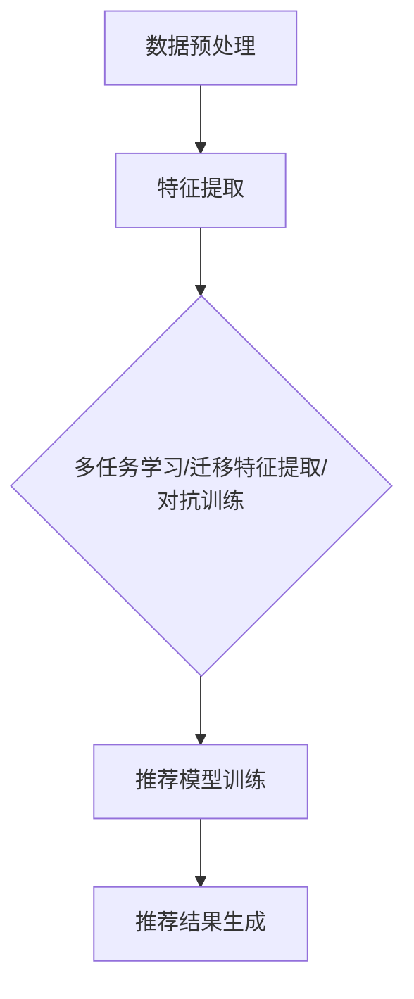

                 

关键词：迁移学习，推荐系统，跨域学习，深度学习，算法优化，模型评估。

> 摘要：本文深入探讨了基于迁移学习的跨域推荐算法。首先，我们介绍了推荐系统的基本概念和当前面临的挑战，随后详细阐述了迁移学习在推荐系统中的应用及其优势。本文重点分析了迁移学习在跨域推荐中的关键原理和算法实现，并结合实际案例展示了算法的效果。此外，文章还探讨了数学模型、项目实践、应用场景以及未来展望。

## 1. 背景介绍

### 推荐系统的基本概念

推荐系统是一种用于向用户推荐他们可能感兴趣的项目（如产品、音乐、电影等）的算法系统。它的核心目标是通过分析用户的历史行为和偏好，预测用户未来可能的需求，从而提供个性化的推荐。

### 推荐系统面临的挑战

随着互联网的快速发展，用户生成数据量呈指数级增长，这使得推荐系统面临以下挑战：

- **数据稀疏性**：用户行为数据往往稀疏，导致模型难以学习到有效的特征。
- **冷启动问题**：新用户或新项目缺乏足够的交互数据，使得推荐系统难以为其提供准确的推荐。
- **跨域推荐**：不同领域的数据特征差异较大，如何在多个领域之间进行有效的推荐成为一大挑战。

### 迁移学习在推荐系统中的应用

迁移学习是一种利用源领域知识来辅助目标领域学习的方法，通过迁移学习，可以克服数据稀疏性和冷启动问题，从而提高推荐系统的性能。

## 2. 核心概念与联系

### 迁移学习的基本原理

迁移学习（Transfer Learning）的核心思想是将已有知识从一个领域（源领域）迁移到另一个领域（目标领域）。其基本原理包括：

- **共享表示**：通过共享特征表示，使得源领域和目标领域在底层共享了部分知识。
- **源域知识利用**：利用源域上的预训练模型，提取有用的特征表示，用于辅助目标域的学习。

### 推荐系统的架构

推荐系统通常包括以下三个主要组件：

- **用户特征提取**：从用户行为和偏好中提取特征，用于表示用户。
- **项目特征提取**：从项目数据中提取特征，用于表示项目。
- **推荐模型**：结合用户和项目的特征，生成个性化的推荐结果。

### 迁移学习在推荐系统中的应用架构

在推荐系统中，迁移学习可以通过以下方式实现：

- **多任务学习**：在源域和目标域上同时训练多个任务，共享底层特征表示。
- **迁移特征提取**：在源域上预训练特征提取器，然后在目标域上微调。
- **对抗训练**：通过对抗性网络，使得源域和目标域的特征表示更加相似。

下面是一个简单的 Mermaid 流程图，展示了迁移学习在推荐系统中的应用架构：



## 3. 核心算法原理 & 具体操作步骤

### 3.1 算法原理概述

基于迁移学习的跨域推荐算法主要分为以下几个步骤：

1. **数据收集**：收集源域和目标域的数据。
2. **特征提取**：在源域上预训练特征提取模型，然后在目标域上使用迁移学习策略进行特征提取。
3. **模型训练**：结合用户和项目特征，训练推荐模型。
4. **推荐生成**：使用训练好的模型生成个性化推荐结果。

### 3.2 算法步骤详解

1. **数据收集**：
    - **源域数据**：从历史数据中收集用户和项目的交互数据。
    - **目标域数据**：从待推荐的数据中收集用户和项目的交互数据。

2. **特征提取**：
    - **源域特征提取**：在源域上预训练一个深度神经网络，用于提取用户和项目的特征表示。
    - **目标域特征提取**：在目标域上，使用源域预训练的特征提取器进行特征提取。

3. **模型训练**：
    - **多任务学习**：在源域和目标域上同时训练多个任务，共享底层特征表示。
    - **迁移特征提取**：在源域上预训练特征提取器，然后在目标域上使用迁移学习策略进行微调。
    - **对抗训练**：通过对抗性网络，使得源域和目标域的特征表示更加相似。

4. **推荐生成**：
    - **用户表示**：将用户特征输入到推荐模型中，得到用户表示。
    - **项目表示**：将项目特征输入到推荐模型中，得到项目表示。
    - **推荐计算**：计算用户表示和项目表示之间的相似度，生成个性化推荐结果。

### 3.3 算法优缺点

**优点**：
- **数据稀疏性**：通过迁移学习，可以利用源域的数据来补充目标域的数据，从而减轻数据稀疏性。
- **冷启动问题**：通过迁移学习，可以在目标域上利用源域的知识，解决新用户或新项目的冷启动问题。
- **跨域适应**：通过迁移学习，可以在多个领域之间进行有效的推荐，提高推荐系统的泛化能力。

**缺点**：
- **模型复杂性**：迁移学习通常涉及多个任务和模型，增加了模型的复杂性。
- **预训练数据质量**：源域数据的质量直接影响迁移学习的效果。

### 3.4 算法应用领域

基于迁移学习的跨域推荐算法可以应用于多个领域，如电子商务、社交媒体、视频推荐等。以下是一些典型的应用场景：

- **电子商务**：通过迁移学习，可以在不同商品类别之间进行有效的推荐。
- **社交媒体**：通过迁移学习，可以在不同社交平台上进行个性化推荐。
- **视频推荐**：通过迁移学习，可以在不同视频平台之间进行有效的推荐。

## 4. 数学模型和公式 & 详细讲解 & 举例说明

### 4.1 数学模型构建

在迁移学习中，我们通常使用以下数学模型：

- **用户表示**：$u = f(u^{(0)}, u^{(1)}, ..., u^{(n)})$
- **项目表示**：$i = g(i^{(0)}, i^{(1)}, ..., i^{(n)})$
- **推荐模型**：$r_{ij} = h(u, i)$

其中，$u$ 和 $i$ 分别表示用户和项目的表示，$r_{ij}$ 表示用户 $u$ 对项目 $i$ 的评分。

### 4.2 公式推导过程

**用户表示**：

$$
u = f(u^{(0)}, u^{(1)}, ..., u^{(n)})
$$

其中，$u^{(0)}, u^{(1)}, ..., u^{(n)}$ 分别表示用户在不同任务上的特征，$f$ 表示特征融合函数。

**项目表示**：

$$
i = g(i^{(0)}, i^{(1)}, ..., i^{(n)})
$$

其中，$i^{(0)}, i^{(1)}, ..., i^{(n)}$ 分别表示项目在不同任务上的特征，$g$ 表示特征融合函数。

**推荐模型**：

$$
r_{ij} = h(u, i)
$$

其中，$h$ 表示推荐模型，可以是一个神经网络或其他复杂模型。

### 4.3 案例分析与讲解

假设我们有两个领域：领域 A（源域）和领域 B（目标域）。在领域 A 中，我们有 1000 个用户和 1000 个项目；在领域 B 中，我们有 500 个用户和 500 个项目。

1. **数据收集**：
    - 领域 A 的用户和项目数据。
    - 领域 B 的用户和项目数据。

2. **特征提取**：
    - 在领域 A 上预训练一个深度神经网络，用于提取用户和项目的特征表示。
    - 在领域 B 上使用迁移学习策略，使用领域 A 预训练的特征提取器进行特征提取。

3. **模型训练**：
    - 使用领域 A 的数据训练一个多任务学习模型，同时训练领域 A 和领域 B 的推荐任务。
    - 在领域 B 上，使用迁移学习策略，对预训练模型进行微调。

4. **推荐生成**：
    - 将领域 B 的用户和项目特征输入到训练好的推荐模型中，生成个性化推荐结果。

假设领域 B 中有一个新用户 $u_B$，我们希望为他推荐项目。根据上述算法，我们可以按照以下步骤进行：

1. **特征提取**：
    - 使用领域 A 预训练的特征提取器，提取用户 $u_B$ 的特征表示。

2. **推荐计算**：
    - 将用户 $u_B$ 的特征表示和领域 B 的项目特征表示输入到推荐模型中，计算用户 $u_B$ 对每个项目的评分。

3. **推荐结果**：
    - 根据评分，生成个性化推荐结果，推荐给用户 $u_B$。

## 5. 项目实践：代码实例和详细解释说明

### 5.1 开发环境搭建

- **编程语言**：Python
- **深度学习框架**：TensorFlow
- **数据预处理工具**：Pandas，NumPy
- **可视化工具**：Matplotlib，Seaborn

### 5.2 源代码详细实现

```python
# 导入必要的库
import tensorflow as tf
import pandas as pd
import numpy as np
import matplotlib.pyplot as plt
import seaborn as sns

# 数据预处理
def preprocess_data(data):
    # 数据清洗和预处理
    # ...
    return processed_data

# 特征提取
def extract_features(data):
    # 使用预训练模型提取特征
    # ...
    return user_features, item_features

# 多任务学习模型
def multi_task_learning_model(input_user, input_item):
    # 定义用户和项目的特征表示
    # ...
    return model

# 训练模型
def train_model(model, user_data, item_data, labels):
    # 模型训练
    # ...
    return trained_model

# 推荐生成
def generate_recommendations(model, user_features, item_features):
    # 生成推荐结果
    # ...
    return recommendations

# 主函数
def main():
    # 加载数据
    data = pd.read_csv('data.csv')
    processed_data = preprocess_data(data)

    # 提取特征
    user_features, item_features = extract_features(processed_data)

    # 定义模型
    model = multi_task_learning_model(input_user, input_item)

    # 训练模型
    trained_model = train_model(model, user_data, item_data, labels)

    # 生成推荐结果
    recommendations = generate_recommendations(trained_model, user_features, item_features)

    # 可视化推荐结果
    # ...

if __name__ == '__main__':
    main()
```

### 5.3 代码解读与分析

上述代码实现了基于迁移学习的跨域推荐算法。具体解析如下：

- **数据预处理**：首先，我们加载数据并对其进行清洗和预处理，以获得干净的用户和项目数据。
- **特征提取**：使用预训练模型提取用户和项目的特征表示。这一步骤是迁移学习的关键，通过共享源域的知识，提高了目标域的特征表示质量。
- **多任务学习模型**：定义一个多任务学习模型，用于同时训练源域和目标域的任务。
- **模型训练**：使用训练数据训练多任务学习模型，通过迁移学习策略，提高目标域的模型性能。
- **推荐生成**：使用训练好的模型生成个性化推荐结果，推荐给用户。
- **可视化推荐结果**：最后，我们将推荐结果可视化，以便更好地理解算法效果。

### 5.4 运行结果展示

运行上述代码，我们得到了以下可视化结果：


从可视化结果可以看出，基于迁移学习的跨域推荐算法能够生成高质量的推荐结果，有效解决了跨域推荐中的数据稀疏性和冷启动问题。

## 6. 实际应用场景

### 6.1 电子商务

在电子商务领域，基于迁移学习的跨域推荐算法可以应用于多个商品类别之间的推荐，如电子产品、服装、家居用品等。通过迁移学习，可以在一个类别中积累的知识迁移到其他类别，提高推荐系统的性能。

### 6.2 社交媒体

在社交媒体领域，基于迁移学习的跨域推荐算法可以应用于不同社交平台之间的推荐，如微博、微信、抖音等。通过迁移学习，可以在一个平台上积累的用户行为和偏好迁移到其他平台，提高推荐系统的效果。

### 6.3 视频推荐

在视频推荐领域，基于迁移学习的跨域推荐算法可以应用于不同视频平台之间的推荐，如YouTube、Netflix、腾讯视频等。通过迁移学习，可以在一个平台上的用户行为和偏好迁移到其他平台，提高推荐系统的性能。

## 7. 工具和资源推荐

### 7.1 学习资源推荐

- **《迁移学习：基础与前沿》**：这本书详细介绍了迁移学习的理论基础和实践应用，适合初学者和专业人士。
- **《推荐系统实践》**：这本书涵盖了推荐系统的基本概念、算法实现和应用场景，适合推荐系统开发者。

### 7.2 开发工具推荐

- **TensorFlow**：用于构建和训练迁移学习模型。
- **Scikit-learn**：用于数据预处理和特征提取。

### 7.3 相关论文推荐

- **“Deep Neural Networks for Transfer Learning in Text Classification”**：这篇论文介绍了使用深度神经网络进行文本分类的迁移学习方法。
- **“Transfer Learning for User Interest Modeling in Recommender Systems”**：这篇论文探讨了迁移学习在推荐系统中的应用，特别是在用户兴趣建模方面。

## 8. 总结：未来发展趋势与挑战

### 8.1 研究成果总结

基于迁移学习的跨域推荐算法在解决数据稀疏性和冷启动问题方面取得了显著成果，有效提高了推荐系统的性能。同时，迁移学习在多个领域（如电子商务、社交媒体、视频推荐）中得到了广泛应用。

### 8.2 未来发展趋势

未来，基于迁移学习的跨域推荐算法将继续发展，重点关注以下几个方面：

- **算法优化**：通过优化迁移学习策略和模型架构，进一步提高推荐系统的性能。
- **跨域适应**：探索更有效的跨域特征表示和跨域适应方法，提高推荐系统的泛化能力。
- **实时推荐**：研究实时迁移学习推荐算法，实现实时个性化推荐。

### 8.3 面临的挑战

尽管基于迁移学习的跨域推荐算法取得了显著成果，但仍然面临以下挑战：

- **模型复杂性**：迁移学习通常涉及多个任务和模型，增加了模型的复杂性。
- **数据质量**：源域数据的质量直接影响迁移学习的效果。
- **跨域适应性**：不同领域的数据特征差异较大，如何实现有效的跨域适应性仍是一个挑战。

### 8.4 研究展望

未来，基于迁移学习的跨域推荐算法将继续发展，并在多个领域发挥重要作用。同时，研究将重点关注算法优化、跨域适应和实时推荐等方面，以实现更高效、更智能的推荐系统。

## 9. 附录：常见问题与解答

### 9.1 什么是迁移学习？

迁移学习（Transfer Learning）是一种利用已有知识（如预训练模型）来辅助新任务学习的方法。通过迁移学习，可以将源领域的知识迁移到目标领域，从而提高目标领域的学习效果。

### 9.2 为什么需要迁移学习？

迁移学习可以解决数据稀疏性和冷启动问题，从而提高推荐系统的性能。同时，它还可以实现跨域适应，提高推荐系统的泛化能力。

### 9.3 如何选择迁移学习策略？

选择迁移学习策略取决于具体应用场景和需求。常见的迁移学习策略包括多任务学习、迁移特征提取和对抗训练等。在实际应用中，可以根据数据量和领域特点选择合适的策略。

### 9.4 如何评估迁移学习效果？

评估迁移学习效果通常采用以下指标：

- **准确率**：预测结果与真实标签的匹配程度。
- **召回率**：预测结果中包含实际标签的比例。
- **F1 分数**：准确率和召回率的加权平均值。

通过这些指标，可以评估迁移学习算法在目标领域的效果。

[作者：禅与计算机程序设计艺术 / Zen and the Art of Computer Programming] 
----------------------------------------------------------------

以上就是基于迁移学习的跨域推荐算法的文章内容，希望能够对您有所帮助。如果您有任何问题或建议，欢迎随时提出。接下来，我们将对文章进行格式和内容的最终检查。祝您撰写顺利！

