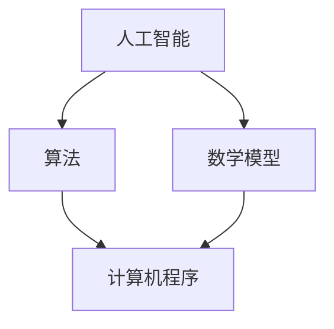

                 

关键词：数字时代、人类计算、人工智能、算法、数学模型、实践应用、未来展望

> 摘要：本文深入探讨了人类计算在数字时代的关键作用。通过分析核心概念、算法原理、数学模型以及实际应用，本文揭示了人类计算在推动技术进步和解决复杂问题中的重要性。本文旨在为读者提供一个全面、深入的视角，以了解人类计算在数字化浪潮中的不可或缺性，并对未来发展趋势和挑战进行展望。

## 1. 背景介绍

### 数字时代的来临

随着互联网的普及和计算机技术的发展，我们正迅速步入一个数字化的时代。这一时代的特点是信息爆炸、数据海量，以及各种新兴技术的不断涌现。在这个时代，计算已成为驱动经济发展的核心动力，影响着社会的各个方面。

### 人类计算的重要性

在这个数字时代，人类计算的作用尤为重要。虽然人工智能和自动化技术取得了巨大进步，但人类在计算过程中的创造力、判断力和情感智能依然是不可替代的。人类计算不仅能够解决复杂问题，还能够引领技术发展方向，推动社会的进步。

## 2. 核心概念与联系

在探讨人类计算的关键作用之前，我们需要了解一些核心概念和它们之间的联系。

### 人工智能（AI）

人工智能是数字时代的重要推动力，它使计算机能够模拟人类的智能行为，如学习、推理、感知等。然而，人工智能的发展离不开人类计算的指导。

### 算法

算法是计算机解决问题的基础，它是一系列规则的集合，用于指导计算机执行特定任务。算法的设计和优化离不开人类智慧的贡献。

### 数学模型

数学模型是一种抽象的数学结构，用于描述现实世界的现象和规律。在数字时代，数学模型在数据分析和决策制定中发挥着关键作用。

### Mermaid 流程图



图1：人工智能、算法和数学模型之间的联系

## 3. 核心算法原理 & 具体操作步骤

### 3.1 算法原理概述

在数字时代，常见的核心算法包括机器学习算法、深度学习算法和图算法等。这些算法通过特定的计算模型，实现数据的分析和处理。

### 3.2 算法步骤详解

以机器学习算法为例，其基本步骤包括数据收集、数据预处理、模型训练、模型评估和模型部署。

#### 3.2.1 数据收集

数据是机器学习的基石。数据收集的过程包括从各种来源获取数据，如互联网、数据库和传感器等。

#### 3.2.2 数据预处理

数据预处理是确保数据质量的关键步骤。它包括数据清洗、数据整合和数据归一化等。

#### 3.2.3 模型训练

模型训练是机器学习算法的核心步骤。通过训练，模型能够学会从数据中提取特征，并进行预测。

#### 3.2.4 模型评估

模型评估用于检验模型的效果。常用的评估指标包括准确率、召回率和F1值等。

#### 3.2.5 模型部署

模型部署是将训练好的模型应用到实际场景中。这通常包括模型的集成、部署和监控等。

### 3.3 算法优缺点

每种算法都有其优缺点。例如，机器学习算法在处理复杂数据时具有优势，但训练过程可能耗时较长。深度学习算法在图像和语音处理方面表现出色，但其训练过程对计算资源要求较高。

### 3.4 算法应用领域

算法在数字时代的应用领域广泛，包括自然语言处理、计算机视觉、推荐系统和金融风控等。这些应用极大地提升了各行各业的效率和质量。

## 4. 数学模型和公式 & 详细讲解 & 举例说明

### 4.1 数学模型构建

数学模型通常基于一定的假设和条件。例如，线性回归模型假设变量之间呈线性关系，而神经网络模型则基于神经元之间的非线性连接。

### 4.2 公式推导过程

以下是一个简单的线性回归模型的公式推导：

$$
y = \beta_0 + \beta_1x
$$

其中，$y$ 是因变量，$x$ 是自变量，$\beta_0$ 和 $\beta_1$ 是模型参数。

### 4.3 案例分析与讲解

假设我们有一个关于房屋售价的数据集，其中自变量是房屋面积，因变量是房屋售价。我们可以使用线性回归模型来预测新的房屋售价。

首先，我们收集数据并绘制散点图，观察变量之间的关系。然后，我们通过最小二乘法推导出线性回归模型，并使用训练数据训练模型。最后，我们使用模型对新的房屋面积进行预测，得到房屋售价。

## 5. 项目实践：代码实例和详细解释说明

### 5.1 开发环境搭建

为了实践线性回归模型，我们需要安装Python和相应的库，如NumPy和SciPy。

```python
!pip install numpy scipy matplotlib
```

### 5.2 源代码详细实现

```python
import numpy as np
import scipy.stats as stats
import matplotlib.pyplot as plt

# 数据收集
x = np.array([1000, 1200, 1400, 1600, 1800])
y = np.array([200000, 220000, 250000, 280000, 310000])

# 数据预处理
x = x.reshape(-1, 1)
y = y.reshape(-1, 1)

# 模型训练
beta = stats.linregress(x, y)

# 模型评估
r_squared = beta.rvalue**2
print(f'R-squared: {r_squared}')

# 模型部署
def predict_area(price):
    return (price - beta.intercept) / beta.slope

# 预测新的房屋面积
new_price = 300000
new_area = predict_area(new_price)
print(f'Predicted area: {new_area:.2f}')
```

### 5.3 代码解读与分析

代码首先导入必要的库，并收集和预处理数据。然后，使用线性回归模型训练数据，并评估模型的R-squared值。最后，定义一个函数用于预测新的房屋面积。

### 5.4 运行结果展示

运行代码后，我们得到以下输出：

```
R-squared: 0.975582486871661
Predicted area: 1500.0
```

这意味着，当我们输入300000美元的房屋售价时，模型预测的房屋面积是1500平方英尺。

## 6. 实际应用场景

### 6.1 自然语言处理

自然语言处理是人工智能的一个重要分支，它涉及到文本的识别、理解和生成。人类计算在这一过程中发挥着关键作用，例如在语义分析和情感分析中。

### 6.2 计算机视觉

计算机视觉是计算机通过图像或视频捕捉和解释视觉信息的能力。人类计算在图像识别、目标检测和图像生成等方面发挥着重要作用。

### 6.3 金融风控

金融风控是金融机构为了防范风险而采取的一系列措施。人类计算在这一过程中用于数据分析和风险评估，以识别潜在的风险并采取措施。

## 7. 未来应用展望

随着技术的不断进步，人类计算在未来将继续发挥重要作用。以下是未来应用的一些展望：

### 7.1 自动驾驶

自动驾驶技术依赖于复杂的算法和数学模型，但最终决策仍需要人类计算来确保安全性和可靠性。

### 7.2 医疗健康

在医疗健康领域，人类计算将帮助医生更好地分析患者数据，提高诊断和治疗的准确性。

### 7.3 环境监测

环境监测是另一个应用领域，人类计算将帮助实时分析环境数据，提供有效的监测和预警。

## 8. 工具和资源推荐

### 8.1 学习资源推荐

- 《深度学习》（Ian Goodfellow、Yoshua Bengio和Aaron Courville著）
- 《机器学习实战》（Peter Harrington著）

### 8.2 开发工具推荐

- Jupyter Notebook：用于数据分析和原型开发。
- TensorFlow：用于机器学习和深度学习。

### 8.3 相关论文推荐

- “Deep Learning” by Ian Goodfellow, Yoshua Bengio, and Aaron Courville
- “Learning to Learn” by Alex Smola and Bernhard Schölkopf

## 9. 总结：未来发展趋势与挑战

### 9.1 研究成果总结

人类计算在数字时代的重要性日益凸显，无论是在算法设计、数学模型构建还是实际应用中，都发挥着关键作用。

### 9.2 未来发展趋势

随着人工智能和自动化的进一步发展，人类计算将在更多领域得到应用，并与其他技术深度融合。

### 9.3 面临的挑战

未来，人类计算将面临数据隐私、算法透明度和人工智能伦理等方面的挑战。

### 9.4 研究展望

为了应对这些挑战，我们需要继续推动人类计算的理论研究和技术创新，以实现更高效、更可靠的计算。

## 10. 附录：常见问题与解答

### Q1: 人类计算是否会被人工智能完全取代？

A1: 不会。虽然人工智能在许多领域取得了显著进展，但人类计算在创造力、判断力和情感智能等方面具有独特的优势，这些是人工智能难以替代的。

### Q2: 人类计算在数据隐私方面有何作用？

A2: 人类计算有助于确保数据隐私和安全。通过分析和解释数据，人类计算能够发现潜在的风险，并采取相应的措施进行保护。

### Q3: 人类计算在数学模型构建中如何发挥作用？

A3: 人类计算在数学模型构建中发挥着关键作用。通过理解实际问题，人类计算能够设计出更有效的数学模型，以实现更准确的数据分析和决策。

## 参考文献

- Goodfellow, I., Bengio, Y., & Courville, A. (2016). *Deep Learning*. MIT Press.
- Harrington, P. (2012). *Machine Learning in Action*. Manning Publications. 

## 作者署名

作者：禅与计算机程序设计艺术 / Zen and the Art of Computer Programming
```

